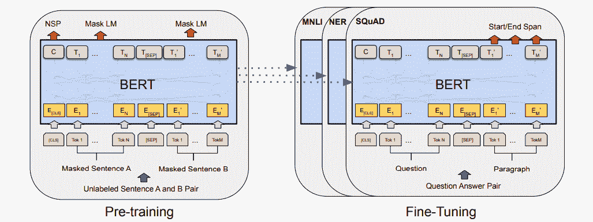
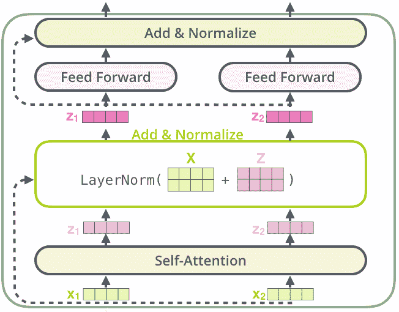
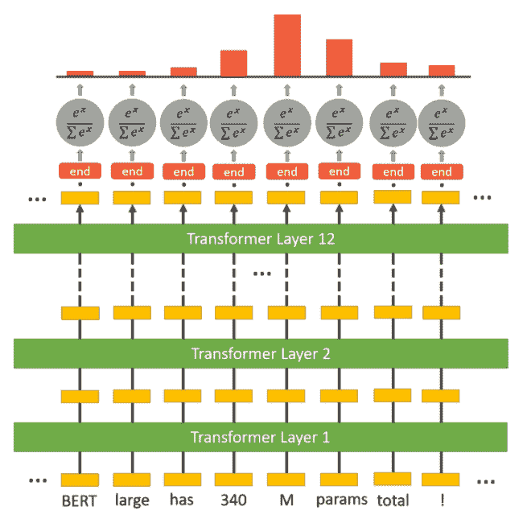
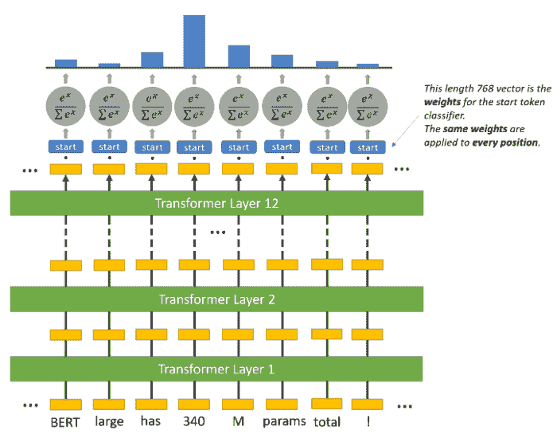

# 如何训练问答机学习模型(BERT)

> 原文：<https://blog.paperspace.com/how-to-train-question-answering-machine-learning-models/>

问答模型是机器或深度学习模型，可以在给定一些上下文的情况下回答问题，有时没有任何上下文(例如开放域 QA)。他们可以从段落中提取答案短语，概括地解释答案，或者从给定选项列表中选择一个选项，等等。这完全取决于它被训练的数据集(例如[小队](https://rajpurkar.github.io/SQuAD-explorer/)、 [CoQA](https://stanfordnlp.github.io/coqa/) 等)。)或者它被训练的问题，或者在某种程度上神经网络架构。因此，举例来说，如果你将这一段(上下文)输入到你的模型中，该模型被训练来从上下文中提取答案短语，并问一个类似“什么是问答模型？”，它应该输出这一段的第一行。

这种模型需要理解语言的结构，对上下文和问题有语义理解，有能力定位回答短语的位置，等等。所以毫无疑问，训练执行这些任务的模型是很困难的。幸运的是，神经网络中的注意力概念已经成为这种困难任务的救命稻草。自从[为序列建模任务引入](https://lilianweng.github.io/lil-log/2018/06/24/attention-attention.html#a-family-of-attention-mechanisms)以来，出现了许多具有复杂注意机制的 RNN 网络，如 [R-NET](https://www.microsoft.com/en-us/research/wp-content/uploads/2017/05/r-net.pdf) 、 [FusionNet](https://arxiv.org/pdf/1711.07341.pdf) 等。在 QA 任务中表现出很大的改进。然而，一种基于注意力，特别是自我注意力的全新神经网络架构，称为 [Transformer](https://ai.googleblog.com/2017/08/transformer-novel-neural-network.html) ，已经成为 NLP 中真正的游戏规则改变者。在这里，我将讨论一个名为 BERT 的 Transformer 架构的变体，简要概述其架构，如何执行问答任务，然后编写代码来训练这样一个模型，以回答研究论文中与新冠肺炎相关的问题。

你可以从 [ML Showcase](https://ml-showcase.paperspace.com/projects/answer-covid-19-questions-using-bert) 跟随代码，并在渐变社区笔记本中免费运行它。让我们开始吧。

## 语言模型和转换器

在跳到 BERT 之前，让我们了解一下什么是语言模型，变形金刚是如何进入画面的。

语言模型是一种概率模型，它基于在训练期间看到的文本示例来学习句子或标记序列出现的概率。例如:

> P( *没有杀死我们的使我们更强大*)= P(*That*)P(*which | That*)P(*does | That，which* )P( *not|That，which，does* ...

> P( *没有杀死我们的东西让我们更强大* ) = 0.65

如果这些语言模型足够大，并在足够大的数据集上进行训练，它们可以很好地理解任何语言及其复杂性。传统上，由于语言的顺序结构，rnn 被用于训练这种模型，但是它们训练缓慢(由于每个标记的顺序处理)，并且有时难以收敛(由于消失/爆炸梯度)。

然而，变形金刚的不同变体，凭借其并行处理令牌的能力以及由于自我注意机制和不同的预训练目标而产生的令人印象深刻的性能，已经使得训练大型模型(有时[非常非常大型的模型](https://arxiv.org/abs/2005.14165))成为可能，这些模型理解自然语言非常好。不同的基于 Transformer 的语言模型，在架构和预训练目标上有微小的变化，在不同类型的任务上表现不同。 [BERT](https://ai.googleblog.com/2018/11/open-sourcing-bert-state-of-art-pre.html) (来自变压器的双向编码器表示)就是这样一个模型。BERT 已经使用 Transformer 编码器架构进行了训练，具有掩蔽语言建模(MLM)和下一句预测(NSP)预训练目标。

## 伯特及其变体



BERT Architecture ([source](https://arxiv.org/pdf/1810.04805.pdf))

现在我们已经知道了 BERT 是什么，让我们简单了解一下它的体系结构和培训前目标。BERT 使用来自[原始变压器纸](https://arxiv.org/abs/1706.03762)的变压器编码器。一个编码器有一堆编码器模块(其中一个模块的输出作为下一个模块的输入)，每个编码器模块由两个神经网络层组成。首先是自我关注层(这是使变形金刚如此强大的神奇操作),然后是简单的前馈层。每一层之后都有一个残差连接和一个图层归一化操作，如下图所示。



One Encoder Block ([source](http://jalammar.github.io/illustrated-transformer/)). Here X1, X2 are input vectors. One vector for each token.

因此，对于每个编码器层，输入向量和输出向量的数量(最大限制为 512)总是相同的。并且在第一编码器层之前，通过添加记号嵌入、位置嵌入和片段嵌入来获得每个记号的输入向量。使用矩阵乘法在每个编码器层内并行处理这些向量，并将获得的输出向量馈送到下一个编码器块。通过 *N* 这样的块顺序处理后，得到的输出向量开始很好的理解自然语言。

这是对 BERT 架构的一个非常压缩的概述，只关注我们理解博客其余部分所需的想法。关于各层如何发生不同操作、多头自我关注以及理解并行令牌处理的更详细讨论，请查看 [Jay Alammar 的博客](http://jalammar.github.io/illustrated-transformer/)。

### 培训前目标

预训练目标是一项任务，在为最终任务进行微调之前，对模型进行训练。GPT 模型在生成性预训练任务(因此命名为 GPT)上被训练，即在被微调到例如 SST-2(句子分类数据)上以分类句子之前，在给定先前记号的情况下生成下一个记号。

同样，BERT 将 MLM 和 NSP 作为其预培训目标。它使用一些特殊的令牌，如 CLS、SEP 和 MASK 来完成这些目标。在我们完成培训前目标时，我们将看到这些令牌的使用。但是在继续之前，我们应该知道，馈送到 BERT 的每个标记化样本在开始时附加有 CLS 标记，并且来自 BERT 的 CLS 的输出向量用于不同的分类任务。现在让我们从 MLM 开始。

在 MLM 目标中，一定百分比的标记被屏蔽，即被特殊的标记屏蔽代替，并且模型被要求预测正确的标记来代替屏蔽。为了实现这一点，在最终编码器块上增加了屏蔽语言模型头，它只为屏蔽标记的输出向量(从最终编码器块输出)计算词汇上的概率分布。在《NSP》中，两个被标记化的句子和附加在它们末尾的 SEP 标记被连接起来，并被送给 BERT。然后，使用 CLS 令牌的输出向量来计算句子对中的第二个句子是否是原始文档中的后续句子的概率。对于这两个目标，使用 AdamW 优化器的标准交叉熵损失来训练权重。

与其他预训练目标(例如，生成性预训练目标)相比，上述预训练目标在捕捉自然语言的语义方面非常强大。因此，许多具有类似或稍微调整的预训练目标的模型，具有或多或少与 BERT 相同的架构，已经被训练以在许多 NLP 任务上实现 SOTA 结果。[罗伯塔](https://arxiv.org/abs/1907.11692)、[斯潘伯特](https://www.cs.princeton.edu/~danqic/papers/tacl2020.pdf)、[迪翁伯特](https://arxiv.org/abs/1910.01108)、[艾伯特](https://arxiv.org/abs/1909.11942)等。是其中的几个。

在对这些预训练目标进行训练后，这些模型在特殊任务上进行微调，如问题回答、命名实体识别等。在这里，我们将看到如何训练伯特回答问题的目标。

## 问题回答目标

### 数据集

如前所述，QA 任务可以用不同的方式构建。在这里，我将重点关注基于上下文的问题回答，即从给定的段落中提出问题。SQuAD 是这项任务的一个流行数据集，它包含许多文本段落、与段落相关的不同问题、它们的答案以及段落中答案的起始索引。SQuAD 有两个版本，SQuAD1.1 和 SQuAD2.0，主要区别在于 SQuAD2.0 包含超过 50，000 个无法回答的问题，这些问题看起来与可回答的问题相似。因此，要在 SQuAD2.0 上做得好，系统不仅必须尽可能地回答问题，还必须确定段落何时不支持任何答案，并放弃回答。这两个数据集都是公开的，可以从[这里](https://rajpurkar.github.io/SQuAD-explorer/)下载。在这里，我将使用 SQuAD2.0。

### 伯特班建筑

为了执行问答任务，我们在 BERT 上添加了一个新的问题回答头，就像我们添加了一个掩蔽语言模型头来执行 MLM 任务一样。该问答头的目的是找到给定段落的答案的开始标记和结束标记，例如:

> BERT-large 真的很大...它有 24 层，嵌入大小为 1024，总共有 340M 个参数！总共有 1.34GB，所以预计下载需要几分钟。
> **问题**:BERT-large 有几个参数？
> **回答** : 340M 参数
> **开始令牌** : 340
> **结束令牌**:参数

介于两者之间的所有内容，包括开始和结束标记，都被视为答案。

在问答头部中有两组权重，一组用于开始标记，另一组用于结束标记，它们与输出嵌入具有相同的维数。所有标记的输出嵌入被馈送到这个头部，并且分别计算它们与开始和结束标记的权重集之间的点积。换句话说，取开始标记权重和输出嵌入之间的点积，也取结束标记权重和输出嵌入之间的点积。然后，应用 softmax 激活，以在开始和结束记号集(每个集合也是单独的)的所有记号上产生概率分布。具有最大概率的记号被分别选为开始和结束记号。在此过程中，可能会出现结束标记出现在开始标记之前的情况。在这种情况下，输出一个空字符串作为预测答案。下面的数字应该使操作更加清晰。



Question Answering Head Separately for Start and End Token ([source](https://mccormickml.com/2020/03/10/question-answering-with-a-fine-tuned-BERT/#part-1-how-bert-is-applied-to-question-answering))

在流行的实现中，这个头被实现为前馈层，它接受与 BERT 输出嵌入相同维度的输入，并返回一个二维向量，该向量然后被馈送到 softmax 层。使用开始和结束令牌的交叉熵损失来微调完整的 BERT 小队模型。

## 训练问答模型

我们将使用拥抱脸的[变形金刚](https://github.com/huggingface/transformers/)库来训练我们的 QA 模型。我们还将使用 BioBERT，这是一种基于 BERT 的语言模型，唯一的区别是它已经根据 MLM 和 NSP 的目标对一般&生物医学领域语料库的不同组合进行了微调。不同的领域有特定的术语，这些术语在标准英语中很少出现，如果它们出现，可能意味着不同的事情，或者意味着不同的上下文。因此，像 BioBERT，LegalBERT 等模型。已经被训练来学习特定领域文本的这种细微差别，使得特定领域的 NLP 任务可以更准确地执行。

在这里，我们旨在使用质量保证模型从新冠肺炎研究文献中提取相关信息。因此，我们将使用拥抱脸的变形金刚库对 SQuADv2 数据进行微调。

在变形金刚库的示例部分，Hugging Face 已经提供了一个脚本`run_squad.py`，用于在小队数据上训练 QA 模型。使用下面的命令可以很容易地运行这个脚本。

您也可以从 [ML Showcase](https://ml-showcase.paperspace.com/projects/answer-covid-19-questions-using-bert) 的渐变社区笔记本中免费运行代码。

```py
python run_squad.py \
--model_type bert \  
--model_name_or_path monologg/biobert_v1.1_pubmed \  
--do_train \  
--do_eval \  
--train_file train-v2.0.json \  
--predict_file dev-v2.0.json \  
--per_gpu_train_batch_size 24 \ 
--per_gpu_eval_batch_size 24 \ 
--learning_rate 3e-5 \  
--num_train_epochs 4 \  
--max_seq_length 384 \ 
--doc_stride 128 \  
--save_steps 1500 \  
--output_dir ./biobert \  
--overwrite_output_dir \  
--thread 32 \
```

人们可以从它们的名字中理解大多数参数。关于参数的更多细节和可以调整的参数的详尽列表，可以参考`run_squad.py` [脚本](https://github.com/huggingface/transformers/blob/master/examples/question-answering/run_squad.py)。

使用这个脚本，可以很容易地对模型进行微调，以执行 QA 任务。然而，运行这个脚本占用大量内存，因为`squad_convert_examples_to_features`试图一次处理完整的队伍数据，需要超过 12GB 的内存。所以，我修改了`load_and_cache_examples`，增加了一个名为`read_saved_data`的新功能，可以批量处理阵容数据。你可以看看下面的这些方法。

`load_and_cache_examples`:

```py
def load_and_cache_examples(args, tokenizer, evaluate=False, output_examples=False):
    if args.local_rank not in [-1, 0] and not evaluate:
        # Make sure only the first process in distributed training process the dataset, and the others will use the cache
        torch.distributed.barrier()

    # Load data features from cache or dataset file
    input_dir = args.data_dir if args.data_dir else "."
    cached_features_file = os.path.join(
        input_dir,
        "cached_{}_{}_{}".format(
            "dev" if evaluate else "train",
            list(filter(None, args.model_name_or_path.split("/"))).pop(),
            str(args.max_seq_length),
        ),
    )
    root_dir = os.path.join(cached_features_file+"_dir")
    features_file = os.path.join(root_dir,'features')
    datasets_file = os.path.join(root_dir,'datasets')
    examples_file = os.path.join(root_dir,'examples')

    # Init features and dataset from cache if it exists
    if os.path.exists(cached_features_file) and not args.overwrite_cache:
        logger.info("Loading features from cached file %s", cached_features_file)
        features_and_dataset = torch.load(cached_features_file)
        features, dataset, examples = (
            features_and_dataset["features"],
            features_and_dataset["dataset"],
            features_and_dataset["examples"],
        )
        if output_examples:
            return features, dataset, examples
        else:
            return dataset
    elif os.path.exists(datasets_file) and not output_examples and not args.overwrite_cache:
        pass
    elif os.path.exists(datasets_file) and os.path.exists(features_file) and os.path.exists(examples_file) and output_examples and not args.overwrite_cache:
        pass
    else:
        logger.info("Creating features from dataset file at %s", input_dir)

        if not args.data_dir and ((evaluate and not args.predict_file) or (not evaluate and not args.train_file)):
            try:
                import tensorflow_datasets as tfds
            except ImportError:
                raise ImportError("If not data_dir is specified, tensorflow_datasets needs to be installed.")

            if args.version_2_with_negative:
                logger.warn("tensorflow_datasets does not handle version 2 of SQuAD.")

            tfds_examples = tfds.load("squad")
            examples = SquadV1Processor().get_examples_from_dataset(tfds_examples, evaluate=evaluate)
        else:
            processor = SquadV2Processor() if args.version_2_with_negative else SquadV1Processor()
            if evaluate:
                examples = processor.get_dev_examples(args.data_dir, filename=args.predict_file)
            else:
                examples = processor.get_train_examples(args.data_dir, filename=args.train_file)

        for i,j in enumerate(range(0,len(examples),args.data_process_batch)):
            sub_examples = examples[j:j+args.data_process_batch]
            features, dataset = squad_convert_examples_to_features(
                examples=sub_examples,
                tokenizer=tokenizer,
                max_seq_length=args.max_seq_length,
                doc_stride=args.doc_stride,
                max_query_length=args.max_query_length,
                is_training=not evaluate,
                return_dataset="pt",
                threads=args.threads,
            )

            if args.local_rank in [-1, 0]:
                if not os.path.exists(os.path.join(features_file)):
                    os.makedirs(os.path.join(features_file))
                if not os.path.exists(os.path.join(datasets_file)):
                    os.makedirs(os.path.join(datasets_file))
                if not os.path.exists(os.path.join(examples_file)):
                    os.makedirs(os.path.join(examples_file))

                logger.info("Saving features into cached files %s, %s, %s", os.path.join(features_file,'features_'+str(i)),os.path.join(datasets_file,'datasets_'+str(i)),os.path.join(examples_file,'examples_'+str(i)))
                torch.save({"features": features}, os.path.join(features_file,'features_'+str(i)))
                torch.save({"datasets": dataset}, os.path.join(datasets_file,'datasets_'+str(i)))
                torch.save({"examples": sub_examples}, os.path.join(examples_file,'examples_'+str(i)))

    if args.local_rank == 0 and not evaluate:
        # Make sure only the first process in distributed training process the dataset, and the others will use the cache
        torch.distributed.barrier()
    return read_saved_data(root_dir,evaluate=evaluate,output_examples=output_examples) 
```

`read_saved_data`:

```py
def read_saved_data(input_dir,evaluate=False,output_examples=False):
    from torch.utils.data import TensorDataset

    if output_examples:
        feat="features;datasets;examples"
    else:
        feat="datasets"

    all_features = {"features":[],"examples":[],"datasets":[]}
    all_input_ids = torch.tensor([], dtype=torch.long)
    all_attention_masks = torch.tensor([], dtype=torch.long)
    all_token_type_ids = torch.tensor([], dtype=torch.long)
    all_cls_index = torch.tensor([], dtype=torch.long)
    all_p_mask = torch.tensor([], dtype=torch.float)
    all_is_impossible = torch.tensor([], dtype=torch.float)
    all_start_positions = torch.tensor([], dtype=torch.long)
    all_end_positions = torch.tensor([], dtype=torch.long)

    for i in feat.split(";"):
        for file_name in os.listdir(os.path.join(input_dir,i)):
            data = torch.load(os.path.join(input_dir,i,file_name))[i]
            if isinstance(data,TensorDataset):
                if evaluate:
                    all_input_ids = torch.cat([all_input_ids,data.tensors[0]],dim=0)
                    all_attention_masks = torch.cat([all_attention_masks,data.tensors[1]],dim=0)
                    all_token_type_ids = torch.cat([all_token_type_ids,data.tensors[2]],dim=0)
                    all_cls_index = torch.cat([all_cls_index,data.tensors[4]],dim=0)
                    all_p_mask = torch.cat([all_p_mask,data.tensors[5]],dim=0)
                else:
                    all_input_ids = torch.cat([all_input_ids,data.tensors[0]],dim=0)
                    all_attention_masks = torch.cat([all_attention_masks,data.tensors[1]],dim=0)
                    all_token_type_ids = torch.cat([all_token_type_ids,data.tensors[2]],dim=0)
                    all_start_positions = torch.cat([all_start_positions,data.tensors[3]],dim=0)
                    all_end_positions = torch.cat([all_end_positions,data.tensors[4]],dim=0)
                    all_cls_index = torch.cat([all_cls_index,data.tensors[5]],dim=0)
                    all_p_mask = torch.cat([all_p_mask,data.tensors[6]],dim=0)
                    all_is_impossible = torch.cat([all_is_impossible,data.tensors[7]],dim=0)
            elif isinstance(data,list):
                all_features[i] += data

    if evaluate and "datasets" in feat.split(";"):
        all_example_index = torch.arange(all_input_ids.size(0), dtype=torch.long)
        all_features["datasets"] = TensorDataset(all_input_ids, all_attention_masks, all_token_type_ids, all_example_index, all_cls_index, all_p_mask)
    elif not evaluate and "datasets" in feat.split(";"):
        all_features["datasets"] = TensorDataset(all_input_ids,all_attention_masks,all_token_type_ids,all_start_positions,all_end_positions,all_cls_index,all_p_mask,all_is_impossible,)

    if output_examples:
        return all_features['datasets'], all_features['examples'], all_features['features']
    else:
        return all_features['datasets'] 
```

基本上，添加的修改在小批量数据上运行相同的方法`squad_convert_examples_to_features`,并将创建的特征保存在一个文件夹中。可以通过在`run_squad.py`的第 660 行添加下面一行，并在我上面提到的命令中提供一个参数`data_process_batch`，来定义迷你批处理的大小。

```py
parser.add_argument(
        "--data_process_batch",
        default=50000,
        type=int,
        help="Number of batches in which SQuAD data will be processed.",
    ) 
```

修改后的`modified_run_squad.py`可以从[这里](https://gist.github.com/SKRohit/04ac2b4805382f72e7591630ee971bda)下载。

## 模型验证

使用`run_squad.py` [脚本](https://github.com/huggingface/transformers/blob/master/examples/question-answering/run_squad.py)中提到的默认超参数，我们训练的模型能够在 4 个时期后在 SQuADv2 数据上获得 70 的 F1 分数和 67.8 的精确匹配。现在，让我们看看这个经过训练的模型在来自[新冠肺炎开放研究数据集挑战(CORD-19)](https://www.kaggle.com/allen-institute-for-ai/CORD-19-research-challenge) 的一些研究文章上的表现。以下是从研究文章中获得的一些示例文本、对示例文本提出的问题以及预测的答案。

> **背景:** 结论:本研究首先展示了重庆市新冠肺炎的地区差异，并进一步深入比较了重症患者与非重症患者的差异。重庆市 3 所定点医院新冠肺炎患者的 28 天死亡率为 1。5 %，低于湖北省和包括湖北省在内的 mainland China。然而，重症患者的 28 -死亡率相对较高，当出现并发症时死亡率更高。值得注意的是，并发严重 ARDS 的危重患者的死亡率高达 44%。4 %.因此，对重症新冠肺炎病例，尤其是合并急性呼吸窘迫综合征的病例，早期诊断和加强监护对降低死亡率至关重要。
> **问题***:*ARDS 的死亡率是多少？
> **预测答案** : 44.4 %

> **背景:** 这是 2020 年 1 月 31 日至 2 月 6 日武汉市 COVID - 2019 定点医院武汉大学人民医院收治的 3 例 2019 - nCoV 感染患者的回顾性研究。所有患者均根据中国国家卫生委员会发布的《新型冠状病毒肺炎的诊断和治疗》(第 6 版)进行诊断和分类。我们详细记录了流行病学史、人口统计学特征、临床特征、症状和体征、治疗和临床结果。此外，我们发现益生菌的比例明显减少，如双歧杆菌、乳酸杆菌和真细菌，条件致病菌的比例明显增加，如放线菌的棒状杆菌和厚壁菌门的黑鲁氏菌。值得注意的是，所有患者都死亡了。
> ***问题** :* 病毒感染引起的 ARDS 死亡率是多少？
> **预测答案:** 患者全部死亡。

> ***背景:*** 同时，新冠肺炎感染者中有一定数量的患者存在慢性共病，主要为高血压、糖尿病和心血管疾病，与 MERS - COV 人群相似。这些结果表明，患有慢性基础疾病的老年男性可能更容易感染新冠肺炎或 COV 中东呼吸综合征..CC - BY - NC - ND 4。在实验室检测方面，新冠肺炎和 MERS - COV 患者的淋巴细胞减少，CRP 增加。这一结果表明，新冠肺炎可能与细胞免疫反应有关，主要作用于淋巴细胞，就像 MERS - COV 那样$[ 48 ]$。被病毒感染的细胞在体内诱导大量促炎细胞因子的释放和炎症风暴。此外，细胞因子增加可能会对相关器官造成损害，如肝脏$[ 49 ]$。我们的研究结果表明，在 MERS - COV 人群中发现了 AST 异常值，而在新冠肺炎人群中没有发现。可能的原因是新冠肺炎人群的随访时间太短，而肝脏。
> **问题:** 什么样的细胞因子在宿主反应中起主要作用？
> **预测答案:** 促炎

## 尾注

在本文中，我们简要介绍了 BERT 的架构，了解了 BERT 在问答任务中的表现，使用`modified_run_squad.py`(这减少了 RAM 的使用)在 SQuADv2 数据上训练了一个版本的 BERT 模型(Bio-BERT)，并了解了训练后的模型在 COVID 相关研究文章的文本上的性能。这种模型的性能在很大程度上取决于提供给模型的上下文和相关问题。在这里，上下文是从文章中手动提取出来并输入到模型中的。在后面的文章中，我们将看到一种基于深度学习的方法，在给定特定问题的情况下，从研究文章中找到最合适的段落。