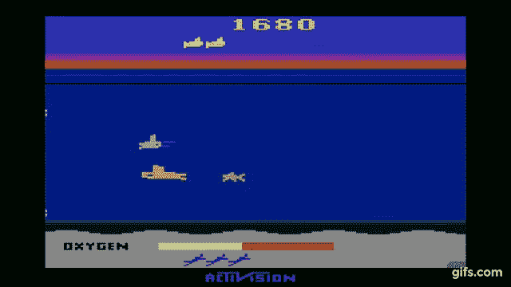
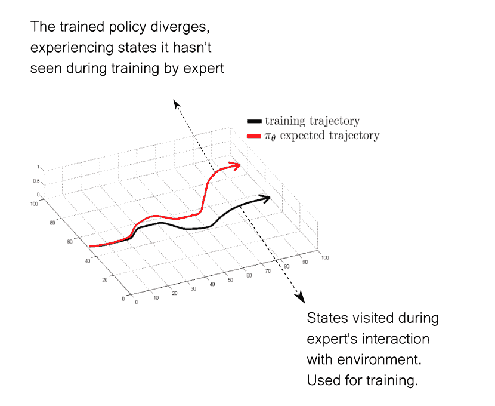
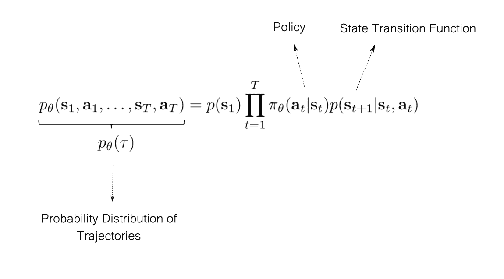
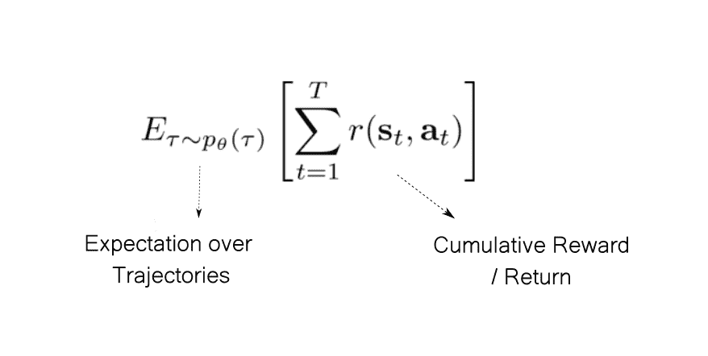
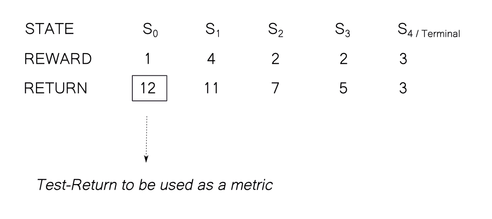
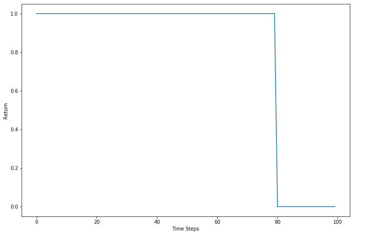
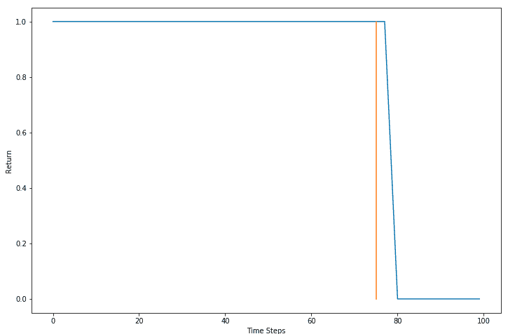
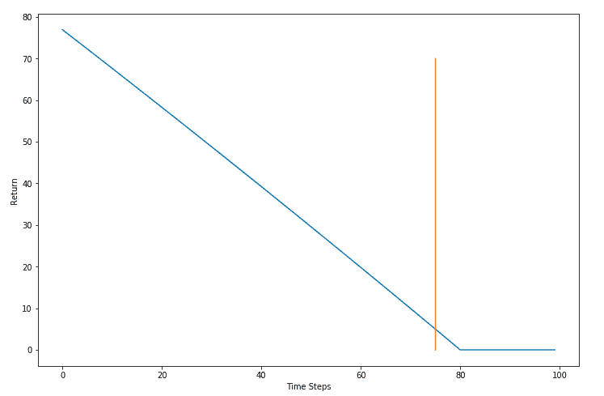
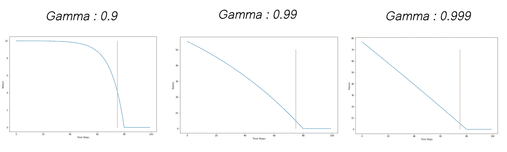

# 强化学习的机器学习实践者指南:强化学习领域概述

> 原文：<https://blog.paperspace.com/overview-of-reinforcement-learning-universe/>

这是我们关于强化学习(RL)概念系列的第 2 部分，面向已经有一些机器学习经验的人。在[第 1 部分](https://blog.paperspace.com/reinforcement-learning-for-machine-learning-folks/)中，我们主要关注马尔可夫决策过程(或 MDP)，这是一种数学框架，用于对强化学习中的问题进行建模。

在这一部分中，我们将对 RL 世界进行一次简短的游览，包括基本术语、RL 和其他形式的机器学习之间的相似性和不同性、RL 算法的剖析等等。

这一部分假设您熟悉马尔可夫决策过程(MDP ),我们已经在第 1 部分的[中广泛讨论过。如果您不熟悉 MDP 或者需要复习，我强烈建议您在继续阅读本文之前先阅读第 1 部分。](https://blog.paperspace.com/reinforcement-learning-for-machine-learning-folks/)

以下是我们将在本帖中涉及的内容。

*   为什么要强化学习？为什么不是监督学习？
    *   优化奖励函数
    *   带标签的监督学习
    *   分配转移
*   RL 算法剖析
*   收集数据
    *   政策外与政策内
    *   探索与开发
    *   为什么不符合政策？
    *   为什么是政策上的？
*   计算回报
    *   在无模型设置中估计预期收益
    *   贴现因素
    *   价值函数
    *   n 步返回
*   更新政策
    *   q 学习
    *   政策梯度

那么，我们开始吧。

## 为什么要强化学习？为什么不是监督学习？

强化学习的中心目标是最大化累积回报，或*回报*。为了做到这一点，代理应该找到一个策略$ \pi(s) $来预测一个动作$ a $，给定状态$ s $，使回报最大化。

### 优化奖励函数

就像我们在标准 ML 中使用梯度下降来最小化损失函数一样，我们也可以使用梯度上升来最大化回报吗？(梯度上升不是找到最小值，而是收敛到最大值。)还是有问题？

考虑回归问题的均方损失。损失的定义如下:

$$ L(X，Y；\ theta)= \ frac { 1 } { 2 }(y-\theta^tx)^ 2 $ $

这里$ Y $是标签，$ X $是输入，$θ$是神经网络的权重。它的梯度很容易计算。

另一方面，回报是通过增加奖励来构建的。奖励是由环境的奖励函数产生的，很多情况下我们可能不知道(无模型设置)。如果我们不知道函数，就不能计算梯度。所以，这个办法行不通！

### 带标签的监督学习

如果我们不知道回报函数，也许我们能做的是构造我们自己的损失函数，如果代理人采取的行动不是导致最大回报的行动，它基本上惩罚代理人。这样，代理预测的动作就变成了预测$ \theta^TX$，最优动作就变成了标签。

为了确定每一步的最佳行动，我们需要一个专家/软件。在这个方向上所做的工作的例子包括模仿学习和行为克隆，在这两种情况下，代理应该通过专家的示范来学习(请阅读相关链接)。

然而，这种方法所需的演示/标记数据的数量可能被证明是良好训练的瓶颈。人类标记是一项昂贵的业务，考虑到深度学习算法往往需要大量数据，收集如此多的专家标记数据可能根本不可行。另一方面，如果一个人有一个专家软件，那么他需要知道为什么要用人工智能来构建另一个软件来解决一个我们已经有专家软件的任务！

此外，使用专家训练数据进行监督的方法通常受到专家专业知识上限的限制。专家的政策可能是目前最好的，而不是最优的。理想情况下，我们希望 RL 代理发现最优策略(使回报最大化)。

此外，这种方法对于我们没有专家的未解决的问题不起作用。

### 分配转移

用专家标注的数据解决问题的另一个问题是分布变化。让我们考虑一个专家代理玩 SeaQuest 的例子，在这个游戏中，你要从海底接潜水员。该试剂具有耗尽的氧气源，并且必须定期到表面重新收集氧气。



现在假设专家代理的策略是永远不会让代理处于氧气低于 30%的状态。因此，遵循此策略收集的数据不会有氧气低于 30%的状态。

现在想象一个代理从使用上述专家的策略创建的数据集被训练。如果训练有素的代理人不完美(100%的性能是不现实的)，并发现自己处于氧气约为 20%的状态，它可能没有经历过在这种状态下应采取的最佳行动。这种现象称为分布偏移，可以通过下图来理解。



模仿学习中的一个著名作品被用来对抗分配转移**匕首**，我在下面提供了一个链接。然而，这种方法也因花费的金钱和时间方面的高数据获取成本而受到损害。

## RL 算法的剖析

在 RL 中，代理不是使用标签来学习，而是通过**试错来学习。**代理人尝试了一堆东西，观察什么能带来好的回报，什么能带来坏的回报。使用各种技术，代理人想出一个策略，该策略应该执行给出最大或接近最大回报的动作。

RL 算法有各种形状和大小，但大多数都倾向于遵循一个模板，我们在这里称之为 RL 算法的*剖析。*

一般来说，任何 RL 算法都将学习过程分为三个步骤。

1.  收集数据
2.  估计回报
3.  完善政策。

这些步骤重复多次，直到达到期望的性能。我避免使用*收敛*这个词，因为对于许多深度 RL 算法来说，没有收敛的理论保证，只是它们在实践中似乎对广泛的问题都很有效。

本文的其余部分将深入探讨上述每一个问题。

## 收集数据

与标准的机器学习设置不同，RL 设置中没有静态数据集，我们可以重复迭代以改进我们的策略。

相反，我们必须通过与环境互动来收集数据。运行策略并存储数据。数据通常存储为四元组值$ \乐浪 s_t，a_t，r_t，s_{t+1} \rangle $其中，

*   $ s_t $是初始状态
*   $ a_t $是采取的行动
*   $ r_t $是以$ s_t $的形式获得$ a_t $的奖励
*   $ s_{t+1} $是在$ s_t $中提取$ a_t $后座席转换到的新状态

### 政策外与政策内

RL 算法通常在收集数据和改进策略之间交替。我们用来收集数据的策略可能与我们正在培训的策略不同。这被称为**非政策学习。**

收集数据的策略被称为**行为策略**，而我们正在训练的策略(我们计划使用测试时间)被称为**目标策略。**

在另一种情况下，我们可能会使用我们正在培训的相同策略来收集数据。这被称为**政策学习。**在这里，行为策略和目标策略是相同的。

让我们了解一个例子的帮助之间的区别。假设我们正在训练一个目标策略，它为我们提供了每个行动的估计回报(考虑行动是离散的)，我们必须选择最大化这个估计的行动*。换句话说，我们根据行动分数贪婪地行动。*

$ $ \ pi(s)= \ under set { A \ in \ mathcal { A } } { \ arg \ max } R _ { estimate }(A)$ $

这里，$ R_{estimate} $是返回估计值。

在数据收集阶段，我们选择随机行动来与环境互动，不考虑回报估计。当我们更新我们的目标策略时，我们假设超过＄\乐浪 s_t，a_t，s _ { t+1 } \ rangle＄的策略所采取的轨迹将通过贪婪地选择行为 w.r.t 到估计的回报来确定。相反，当我们收集数据时，我们选择随机行动。

因此，我们的行为政策不同于我们的训练政策，即贪婪政策。因此，这是*非政策培训*。

如果我们也使用贪婪策略进行数据收集，这将成为一个*策略上的*设置*。*

### 探索与开发

除了学分分配问题，这是 RL 中最大的挑战之一；如此之多，保证它自己的职位，但我会尝试在这里给出一个简短的概述。

让我们再举一个例子。你是一名编写生产级代码的数据科学家。尽可能使用矢量化来编写 NumPy 代码。现在，你有一个非常重要的项目，你非常想完成。

你会想，我是否应该继续在我的代码中严格使用矢量化来优化它？或者，我是否应该花些时间在我的武器库中添加更多的技术，比如广播和整形，以编写甚至更优化的代码，而这仅仅通过矢量化是可能的。如果你正朝这个方向思考，你可以阅读我们关于 NumPy 优化的 4 部分系列文章，它涵盖了上面提到的所有内容，甚至更多！

[NumPy Optimization: Vectorization and Broadcasting | Paperspace BlogIn Part 1 of our series on writing efficient code with NumPy we cover why loops are slow in Python, and how to replace them with vectorized code. We also dig deep into how broadcasting works, along with a few practical examples.Paperspace BlogAyoosh Kathuria](https://blog.paperspace.com/numpy-optimization-vectorization-and-broadcasting/)

我们以前都遇到过这种情况。我目前的工作流程是否足够好，或者我是否应该探索 Docker？我现在的 IDE 够好吗，还是应该学 Vim？所有这些场景基本上都是在我们是否想要**探索**更多以追求新工具，还是**利用**我们现有的知识之间的选择！

在 RL 算法的世界中，代理从探索所有行为开始。在适当的训练过程中，通过反复试验，它在某种程度上认识到什么可行，什么不可行。

一旦它的表现达到了一个不错的水平，随着训练的进一步进行，它应该利用它所学到的东西变得更好吗？或者，它应该探索更多，也许发现新的方法，最大限度地提高回报。这就是 exploration v/s 剥削困境的核心所在。

RL 算法必须平衡这两者，以确保良好的性能。最好的解决方案是在完全探索和剥削行为的中间。有多种方法可以将这些行为的平衡融入数据收集策略中。

在非策略设置中，数据收集策略可能完全随机，导致过度探索性行为。或者，一个人可以根据训练策略采取一个步骤，或者以某种概率随机地采取一个随机行动*。这是在深度 RL 中普遍使用的技术。*

```py
p = random.random()

if p < 0.9:
	# act according to policy 
else:
	# pick a random action
```

在基于策略的设置中，我们可以使用一些噪声来干扰操作，或者预测概率分布的参数，并从中进行采样以确定要采取的操作。

### 为什么不符合政策？

非政策学习的最大好处是它帮助我们探索。目标政策在本质上可能会变得非常具有剥削性，不能很好地探索环境，只能满足于次优政策。探索性的数据收集策略将提供从环境到训练策略的不同状态。由于这个原因，行为政策也被称为*探索性政策。*

此外，偏离策略的学习允许代理使用来自旧迭代的数据，而对于基于策略的学习，每次迭代都必须收集新数据。然而，如果数据收集操作是昂贵的，则 on-policy 可能增加训练过程的计算时间。

### 为什么是政策上的？

如果非政策学习在鼓励探索方面如此伟大，为什么我们还要使用政策学习呢？嗯，原因与策略如何更新的数学原理有关(步骤 3)。

对于非策略更新，我们基本上是使用另一个策略生成的轨迹来更新目标策略的行为。给定类似的初始状态和行动，我们的目标政策可能会导致不同的轨迹和回报。如果这些差异太大，更新可能会以意想不到的方式修改策略。

正是因为这个原因，我们并不总是进行非政策学习。即使我们这样做了，只有当两个策略之间的差异不是很大时，更新才能很好地工作，因此，我们定期同步我们的目标和行为策略，并在进行偏离策略的学习更新时使用重要性采样等技术。我把关于精确数学和重要性抽样的讨论留到另一篇文章中。

## 计算回报

RL 算法学习循环的下一部分是计算回报。强化学习的核心目标是最大化预期累积回报，或者简单地说是*回报。**预期*这个词基本上考虑了政策和环境的可能随机性。

当我们处理环境在本质上是偶发的情况时(即代理的*生命*最终终止。就像马里奥这样的游戏，代理人可以完成游戏，或者因摔倒/被咬而死亡)，回报被称为*有限期限回报。*在处理连续环境(无终端状态)的情况下，该回报被称为*无限期回报。*

让我们只考虑*偶发的*环境。我们的策略可能是随机的，即给定一个状态$ s $ *，*，它可能采取不同的轨迹$ \tau $到达最终状态$ s_T $。

我们可以定义这些轨迹的概率分布，使用

1.  政策(给我们各种行动的可能性)，以及
2.  环境的状态转移函数(它给出了给定状态和动作的未来状态的分布)。

从初始状态＄s _ 1＄开始并在终止状态＄s _ T＄结束的任何轨迹的概率由下式给出



一旦我们有了轨迹的概率分布，我们就可以计算所有可能轨迹的预期收益，如下所示。



RL 算法旨在最大化这个量。

* * *

注意，奖励和回报是非常容易混淆的。环境为代理人的每一步提供奖励，而回报是这些个人奖励的总和。

我们可以将时间$ t $的回报$ G_t $定义为该时间的奖励总和。

$$ G_t = \sum_{t}^{T} r(s_t，a_t) $$

一般来说，当我们谈论最大化期望回报作为解决 RL 任务的目标时，我们谈论最大化$ R_1 $即从初始状态的回报。

在数学上，我们优化算法以最大化每$ R_t $。如果算法能够最大化每$ R_t $的值，那么$ R_1 $会自动最大化。相反，试图最大化$ R _ { 1 是荒谬的...t-1} $使用在时间$ t $采取的行动。该策略不能改变以前采取的操作。

为了区分$ R_1 $ return 和一般 return $ R_t $，我们称前者为*测试 return* ，而称后者为 *return。*



The return for any state is sum of cumulative reward from that state to the terminal state. 

### 在无模型设置中估计预期收益

回想一下上一篇文章，很多时候我们试图直接从经验中学习，但是我们无法使用状态转换函数。这些设置是*无模型* RL 的一部分。在其他情况下，状态空间可能如此之大，以至于计算所有轨迹都很困难。

在这种情况下，我们基本上会多次运行该策略，并对单个回报进行平均，以获得回报的估计值。下面的表达式估计了预期收益。

$$ \ frac { 1 } { n } \sum_{i}^{n} \ sum _ { t} ^ { T} r(s _ { I，t }，a_{i，t })，$ $

其中$ N $是运行次数，而$ r(s_{i，t}，a_{i，t}) $是在$ i^{th} $运行中在时间$ t $获得的奖励

我们运行的次数越多，我们的估计就越准确。

### 贴现因素

上述预期回报公式有几个问题。

1.  在没有终结状态的*继续*任务的情况下，期望收益是无穷和。从数学上讲，这个总和可能不会收敛于任意的奖励结构。
2.  即使在有限范围的情况下，一个轨迹的回报也包括从一个状态开始的所有回报，比如$ s $一直到最终状态$ s_T $。我们平等地权衡所有的回报，不管它们是早出现还是晚出现。这与现实生活中的事情完全不同。

第二点基本上问的是“在计算回报的同时，有必要把未来的所有回报都加起来吗？”也许我们可以只做下一个 10 或 100？这也将解决持续任务带来的问题，因为我们不必担心无穷和。

假设你正试图教一辆汽车如何在 RL 中行驶。这辆车每走一步都会得到 0 到 1 之间的奖励，这取决于它的速度。一旦我们记录了 10 分钟或更早的驾驶时间，情节就会终止，以防发生碰撞。

想象一下，汽车与车辆靠得太近，必须减速以避免碰撞和本集的结束。请注意，碰撞可能仍在几步之外。因此，在碰撞发生之前，我们仍然会因为撞车前的高速行驶而获得奖励。如果我们只考虑立即或 3 立即回报的奖励，那么我们将获得高回报，即使我们在碰撞过程中！

假设，10 分钟的一集分成 100 个时间步。汽车全速前进，直到第 80 个时间步，之后为 0，因为它在第 80 个时间步发生碰撞。理想情况下，它应该减速以避免碰撞。



Using Instantaneous Rewards as Return.

现在让我们用未来的三个回报来计算回报。



Using three future rewards as return.

橙色线代表 75 时间步长标记。车辆至少应该在这里开始减速。换句话说，返回应该更少，因此不鼓励这种行为(碰撞路径上的速度)。只有在第 78 个时间步之后，回报才开始下降，这时停止已经太晚了。第 75 个时间步超速的回报应该也会少。

我们想要激励远见的回报。也许我们应该加入更多的未来回报来计算我们的回报。

如果我们把所有的未来收益像原始公式一样加起来。这样，我们的回报随着我们的前进而不断下降，即使是在时间步长 1-50。注意，在 T = 1-50 时采取的措施对导致 T = 80 时碰撞的措施几乎没有影响。



Adding all future rewards to the return 

最佳时机介于两者之间。为了做到这一点，我们引入了一个新的参数$ \gamma $来做这件事。我们将预期收益改写如下。

$ $ \ frac { 1 } { n } \sum_{i}^{n} \ sum _ { t = t ' } ^ { T} \gamma^{t-t ' } r(s _ { I，t }，a_{i，t}) $$

这是贴现收益$ G_1 $的样子。

$ $ g _ 1 = r _ 1+\ gamma r _ { 2 }+∞r _ 3+\ gamma = 3r _ 4+……$ $ $ $ $ $ $ $ $ $ $ $ $ $ $ $ $ $ $ $ $ $ $ $ $ $ $ $ $ $ $ $ $ $ $ $ $ $ $

这通常被称为贴现预期回报。$ \gamma $称为**折扣系数**

当使用奖励来计算我们的回报时，参数$ \gamma $让我们控制我们对未来的展望。更高的$ \gamma $值会让我们看到更远的未来。$ \gamma $的值介于 0 和 1 之间。奖励的权重随着每个时间步呈指数下降。实践中常用的值是 0.9、0.99 和 0.999。下图显示了$ \gamma $如何影响我们的汽车示例的回报。



A higher $ \gamma $ means that the the agent looks much further into the future. Conversely, the effect of collision on the return is seen on much earlier time steps with a higher $ \gamma $

在合理的假设下，贴现无限和可以被证明是收敛的，这使得它们在没有终态的连续环境的情况下是有用的。

### 价值函数

虽然我们可以用上面提到的方法定义计算贴现回报，但这里有一个问题。计算任何一个州的回报都需要你先完成这一集或者执行大量的步骤，然后才能计算回报。

计算回报的另一种方法是提出一个函数，它将州$ s $和保单$ \pi $作为输入，并直接估计贴现回报的价值，而不是我们必须将未来的回报相加。

策略$ \pi $的值函数写为$ V^\pi (s)$。如果我们从状态$ s $开始遵循策略$ \pi $的话，它的值等于预期收益。在 RL 文献中，以下符号用于描述价值函数。

$ $ v^\pi(s)= \ mathbb { e }[g _ t | s _ t = s]$ $

注意，我们没有把$ G_t $写成州和政策的函数。这是因为我们把$ G_t $仅仅当作环境回报的总和。我们不知道(在无模型环境中)这些奖励是如何计算的。

然而，$ V^\pi(s ) $是一个函数，我们用神经网络这样的估计器来预测自己。在这里，它被写成符号中的一个函数。

价值函数的一个微小修改是 **Q 函数**，它估计如果我们在州$ s $采取行动$ a $在政策$ \pi $下的预期贴现回报。

$ $ q^\pi(s,a)= \ mathbb { e }[g _ t | s _ t = s，A_t = a] $$

最大化所有状态的价值函数的策略被称为*最优策略。*

在 RL 中有相当多的学习价值函数的方法。如果我们处于基于模型的 RL 环境中，并且状态空间不是非常大，那么我们可以通过动态编程来学习值函数。这些方法使用价值函数的递归公式，称为贝尔曼方程来学习它们。我们将在后面关于价值函数学习的文章中深入讨论贝尔曼方程。

在状态空间太大的情况下，或者我们处于无模型设置中，我们可以使用监督学习来估计价值函数，其中标签是通过平均许多回报来估计的。

### n 步返回

我们可以混合回报和价值函数，得出所谓的 *n 步回报。*

$ $ g^{n}_t = r _ { t }+\伽马 r_{t+1} +...+\伽马^{n-1} r _ { t+n-1 }+\伽马^ 3 V(s_{t+n}) $$

这里有一个 3 步返回的例子。

$ $ g^{3}_t = r _ { t }+\伽马 r _ { t+1 }+\gamma^2 r _ { t+2 }+\伽马^ 3 V(s_{t+3}) $$

在文献中，使用价值函数来计算剩余的回报(在 n 步之后)也被称为*自举。*

## 更新政策

在第三部分，我们更新政策，使其采取行动最大化贴现期望报酬(DER)

在 Deep RL 中有几种流行的方法来学习最优策略。这两种方法都包含可以使用反向传播进行优化的目标。

### q 学习

在 Q 学习中，我们学习一个 Q 函数，并通过对每个动作的 Q 值表现贪婪来选择动作。我们优化损失，目的是学习 Q 函数。

### 政策梯度

我们还可以通过对其进行梯度上升来最大化预期回报。这个梯度被称为*政策梯度。*

在这种方法中，我们直接修改策略，使得在所收集的经验中导致更多奖励的行为更有可能发生，而在策略的概率分布中导致不好的奖励的行为不太可能发生。

另一类算法叫做*行动者-批评家*算法，结合了 Q 学习和策略梯度。

## 结论

这是我们结束这一部分的地方。在这一部分中，我们讨论了使用 RL 方法的动机和 RL 算法的基本结构。

如果你觉得我对最后一部分，也就是更新政策的那一部分不够重视，那也是应该的。我把这一节写得很短，因为提到的每种方法都有它自己的位置！在接下来的几周里，我将为每一种方法撰写专门的博客文章，并附上您可以运行的代码。在那之前，代码速度！

## 进一步阅读

1.  [模仿学习概述](https://medium.com/@SmartLabAI/a-brief-overview-of-imitation-learning-8a8a75c44a9c)
2.  [数据集聚合或 Dagger 方法上的幻灯片。](https://www.cc.gatech.edu/~bboots3/ACRL-Spring2019/Lectures/DAgger_slides.pdf)
3.  [RL -重要性抽样](https://jonathan-hui.medium.com/rl-importance-sampling-ebfb28b4a8c6)
4.  [贝尔曼方程](https://towardsdatascience.com/the-bellman-equation-59258a0d3fa7)