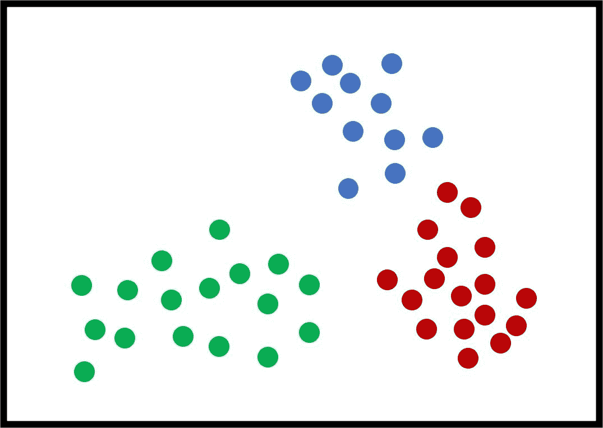
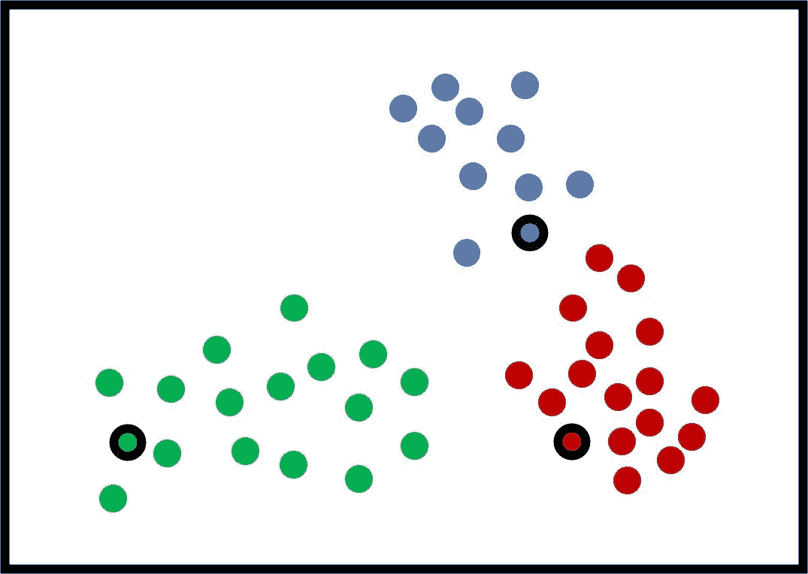
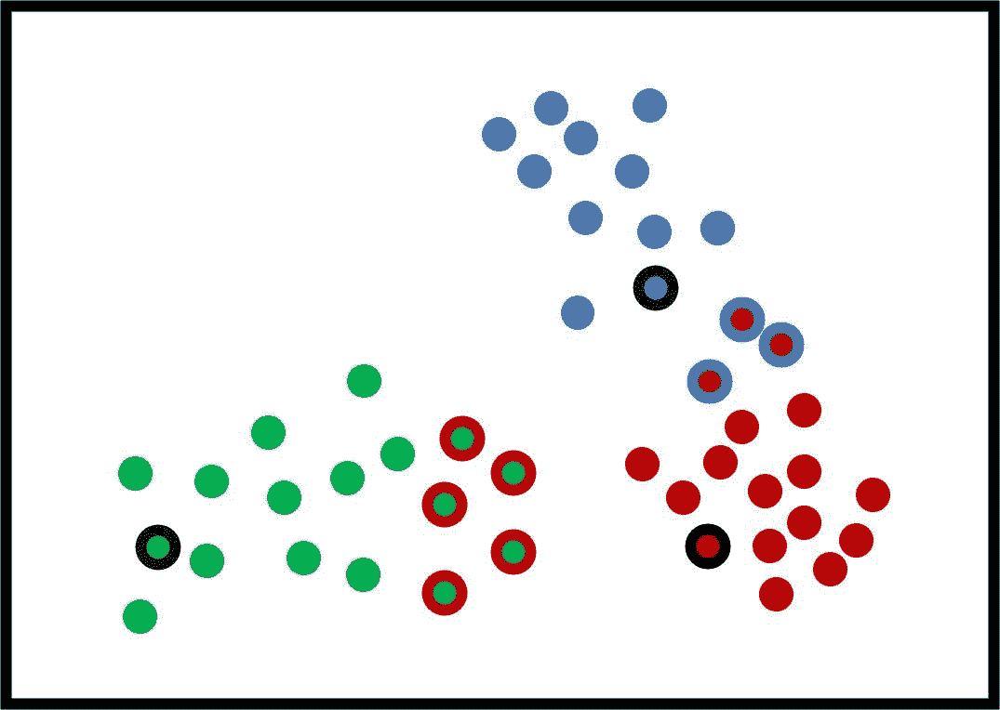
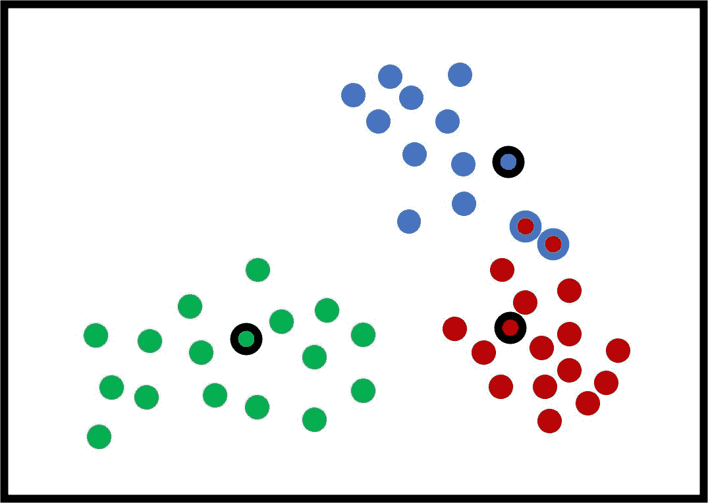
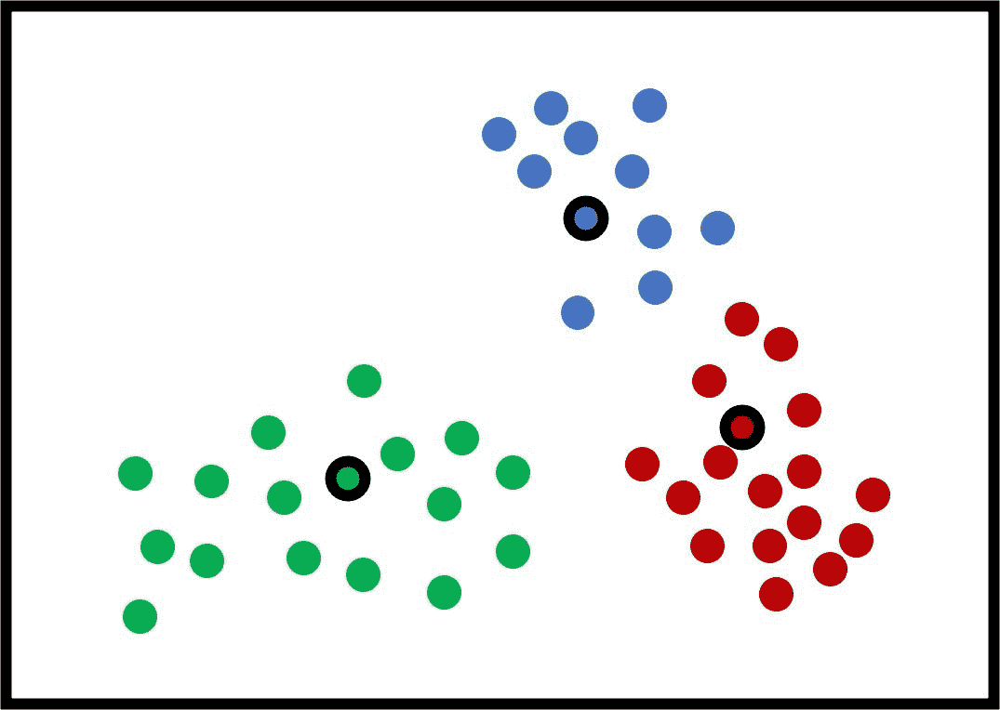
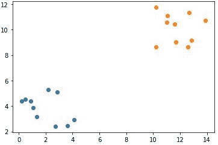
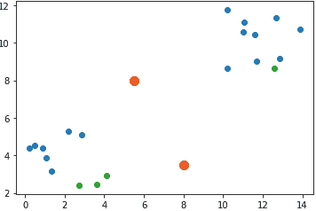
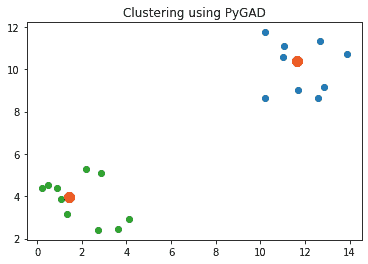
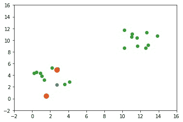
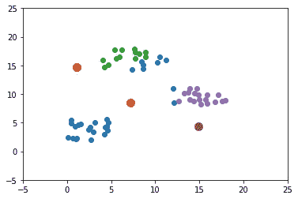

# Python 中使用遗传算法的聚类

> 原文：<https://blog.paperspace.com/clustering-using-the-genetic-algorithm/>

在监督机器学习中，训练数据已经被标记，这意味着每个数据实例都有其相应的输出。在无监督的机器学习中，数据没有标签。聚类是一个无监督的学习问题，任务是探索数据，为每个数据实例找到最佳标签。

本教程讨论如何使用遗传算法对数据进行聚类，从随机聚类开始，一直运行到找到最佳聚类。我们将首先简要地修改 K-means 聚类算法，指出它的弱点，这些弱点稍后将由遗传算法来解决。本教程中的代码示例是使用 [PyGAD 库](https://pygad.readthedocs.io)在 Python 中实现的。

本教程的大纲如下:

1.  介绍
2.  k 均值聚类
3.  使用遗传算法的聚类
4.  准备人工聚类数据
5.  到聚类中心的距离
6.  适应度函数
7.  使用遗传算法的进化
8.  两个集群的完整 Python 代码
9.  3 个集群的示例
10.  结论

## **简介**

根据训练数据是否有标签，有两种类型的机器学习:

1.  监督学习
2.  无监督学习

在监督学习问题中，模型使用一些描述数据的信息。该信息是数据实例的输出，因此模型知道(并学习)它接收的每个输入实例的预期输出应该是什么。这有助于模型评估其性能，并学习减少误差(或提高准确性)的方法。

对于分类问题，输出是每个样本的期望类别。对于 RGB 颜色分类器，输入和输出数据可能如下所示:

```py
Input  1 : 255, 0, 0
Output 1 : Red

Input  2 : 0, 255, 0
Output 2 : Green
```

假设只有两个类:*红色*，和*绿色*。当模型知道预期输出时，它会在训练阶段调整自身(即其参数)以返回正确的输出。对于一个新的测试样本，该模型测量其与之前在两个类中看到的样本的相似性。

在无监督学习问题中，模型不知道数据的正确输出(输入)。聚类是一个无监督的学习问题，任务是找到每个数据实例的结果(即标签)。

聚类算法的输入只是如下的输入:

```py
Input 1 : 255, 0, 0
Input 2 : 0, 255, 0
```

聚类之后，模型应该预测每个数据实例的标签:

```py
Output 1: Red
Output 2: Green
```

存在一些聚类算法，如 K-means 算法(这是最流行的)；分支和绑定；和最大似然估计。

为了达到本教程使用遗传算法进行聚类的目的，下一节将回顾 K-means 算法。

## **K-均值聚类**

K-means 算法是一种流行的聚类算法。虽然它非常简单，但本节快速回顾了它是如何工作的，因为理解它对于使用遗传算法进行聚类是必不可少的。

K 均值算法的输入是:

1.  数据样本。
2.  簇的数量为$K$。

该算法的输出是一组$K$个聚类，其中每个聚类由一组数据样本组成。一个样本可以在两个或多个聚类之间重叠，也可以不重叠；这取决于所解决问题的性质。

下图显示了一个包含 3 个人工聚类的示例，以说明 K-means 算法是如何工作的。请注意，“人工”意味着数据不是真实的。对于这个例子，很明显$K$(最佳聚类数)的最佳值是 3。对于现实世界的问题，不同的$K$值产生不同的结果，选择最可行的一个。每个样本都有一种反映其分类的颜色。

每个聚类可以由包括其样本的集合来表示。例如，$C_1={\{32，21，5，2，9\}}$意味着 id 为$32，21，5，2，$和$9$的样本属于第一个聚类。



K-means 通过为 K 个聚类中的每一个选择初始中心来工作。注意，K-means 算法对这些初始中心非常敏感，并且通过改变初始中心可能给出不同的结果。在下图中，选定的中心是那些带有黑色边框的中心。



下一步是计算每个样本和 3 个中心之间的距离，并将每个样本分配给最近中心的聚类。目标是最小化所有样本与其中心之间的总距离。该距离可以是根据下式计算的欧几里德距离:

$$euc(q，p)=\sqrt{\sum_{i=1}^{f}(c_i-p_i)^2}$$

其中:

*   $F$是代表每个样本的特征数量。
*   $C$和$P$是两个样本，计算了它们之间的欧几里德距离。

下图显示了样本是如何聚类的。分配给不正确簇的样本具有与它们被错误放入的簇相同颜色的边缘。



基于当前的聚类，K-means 算法通过根据下式取每个聚类内所有样本的平均值来更新其$K$聚类的中心:

$$c_icenter=\frac{1}{n_i^k}\sum_{i=1}^{n_i^k}{x_i^k}$$

其中:

*   $n$是聚类内的样本数。
*   $x_i$是群集中的一个样本。

如果一个样本到多个聚类的距离相等，那么它可以被分配到这些聚类中的任何一个。

在计算出新的中心之后，聚类中心从它们当前的位置移动到有希望创建新的、更好的聚类的其他位置。注意，新的聚类中心不必是来自聚类的样本，并且可以是新的人工样本。

新的图表显示了集群的一些潜在的新中心。使用这些新的中心，只有 2 个样本在错误的聚类中。同样，新的中心是通过对聚类中的所有样本进行平均来计算的。



再次更新中心后，下图显示所有样本都被正确聚类。



K-means 算法继续生成新聚类的中心，并将样本分配给距离最小的聚类，直到它发现新中心与当前中心完全相同。在这种情况下，K-means 算法停止。您还可以设置它，使算法在一定次数的迭代后停止，即使中心仍在变化。

在回顾了 K-means 算法的工作原理之后，让我们讨论一下它的一些局限性，以突出使用进化算法(如遗传算法)进行聚类的好处。

根据本文中的[，使用 K-means 聚类有两个缺点:](http://library.isical.ac.in:8080/jspui/bitstream/10263/3870/1/genetic%20algorithm.pdf)

1.  K-means 算法的第一个限制是它对初始中心非常敏感。改变初始中心会强烈影响结果。
2.  K-means 算法可能会陷入局部最优，并且可能无法找到全局最优解。

K-means 能够陷入局部最优的一个原因是，它停止在第一个稳定中心，然后没有办法改进它们以达到更好的解决方案。K-means 没有办法衡量解的质量，它只停留在第一个可用的解上。

K-means 算法的这些局限性通过使用遗传算法来解决。下一节将展示如何使用遗传算法进行聚类。

## **利用遗传算法进行聚类**

遗传算法是一种优化算法，它使用一个以上的解来搜索给定问题的解。遗传算法不仅搜索解，而且通过在多个方向上对解进行一些随机(即盲目)改变来搜索全局最优解。

遗传算法按照以下步骤寻找最佳解决方案:

1.  初始化一组解决方案。
2.  计算群体中解的适应值。
3.  选择最佳解(具有最高适应值)作为父代。
4.  使用交叉和变异使选择的亲本交配。
5.  创造一个新的群体。
6.  重复步骤 2 到 5 若干代，或者直到满足某个条件。

有关遗传算法的更多信息，请查看以下资源:

*   [遗传算法优化简介](https://towardsdatascience.com/introduction-to-optimization-with-genetic-algorithm-2f5001d9964b)
*   [丹·西蒙，进化优化算法，威利，2013 年](https://www.amazon.com/Evolutionary-Optimization-Algorithms-Simon-2013-05-17/dp/B01K0Q6Y6C)

对于聚类问题，遗传算法优于 K-means，因为它对初始中心不太敏感。遗传算法并不止步于第一个解，而是对其进行进化，以找到全局最优解。

为了用遗传算法解决问题，你必须考虑这三件事:

1.  将问题公式化为遗传算法所期望的形式，其中每个解被表示为一个染色体。
2.  编码问题(二进制或十进制)。
3.  构建一个适应度函数来衡量解决方案的适应度(即质量)。

对于聚类问题，问题的解是聚类的中心坐标。所有的中心必须表示为一条染色体，这基本上是一个一维向量。

假设上一个问题中的每个样本只有两个要素，分别代表其$X$和$Y$位置。还假设 3 个集群的位置如下:

$$(C_{1X}，C_{1Y})=(0.4，0.8)
\space
(C_{2X}，C_{2Y})=(1.3，2.23)
\space
(C_{3X}，C_{3Y})=(5.657，3.41)$$

那么解应该表示为如下给出的一维向量，其中前两个元素是第一个聚类中心的$X$和$Y$位置，后两个元素表示第二个聚类的中心，依此类推。

$$(C_{1X}，C_{1Y}，C_{2X}，C_{2Y}，C_{3X}，C_{3Y}) = (0.4，0.8，1.3，2.23，5.657，3.41)$

因为解决方案的基因已经以十进制编码，所以使用十进制编码解决方案是很简单的。如果选择了二进制编码，则必须执行以下操作:

1.  将十进制基因转换成二进制。
2.  将二进制基因转换成十进制基因。

在本教程中，十进制编码是用来使事情更简单。

### 健身功能

适应度函数是评估解决方案的一种方式。因为遗传算法使用最大化适应度函数，所以目标是找到具有最高可能适应度值的解决方案。

受 K-means 算法的启发，遗传算法根据以下等式计算每个样本与其聚类中心之间的距离之和，其中使用了欧几里德距离:

$$fitness=\frac{1}{\sum_{k=1}^{n_c}\sum_{j=1}^{n_k}\sqrt{\sum_{i=1}^{f}(c_{ki}-p_{jj})^2}}$$

其中:

*   $N_c$是集群的数量。
*   $N_k$是聚类$k$内的样本数。
*   $F$是代表样本的特征数，在我们的例子中是 2。
*   $C_k$是群集$k$的中心。

请注意适应度函数是如何使用距离总和的倒数来计算适应度的。原因是直接使用距离之和使得适应度函数成为最小化函数，这与遗传算法相矛盾。

在讨论了使用遗传算法进行聚类的工作原理之后，本教程的其余部分将使用 Python 来完成以下工作:

*   准备人工数据。
*   使用 Python 库 [PyGAD](https://pygad.readthedocs.io) 对数据进行聚类。

## **准备人工聚类数据**

本节准备用于测试遗传算法聚类的人工数据。选择的数据在不同的集群之间有一个余量，以使事情在开始时更容易，并确保一切正常工作。

在整个教程中，生成了 2 组人工数据。第一组有 2 个簇，另一组有 3 个簇。数据样本是随机生成的，其中每个样本只有 2 个特征。现在让我们只关注两个集群的数据。

下一个代码块使用`numpy.random`模块随机生成数据并绘制出来。这两个特征中的每一个都在一定范围内被缩放，以确保这两个聚类被适当地分开。以下是用于两个聚类中两个要素的起始值和结束值:

*   分类 1 特征 1: (0，5)
*   群组 1 功能 2: (2，6)
*   群组 2 功能 1: (10，15)
*   群组 2 功能 2: (8，12)

每个聚类内的样本数量被设置为 10。根据您的喜好，您可以调整每个特征的开始值和结束值，以及每个聚类中的样本数。

```py
import numpy
import matplotlib.pyplot

cluster1_num_samples = 10
cluster1_x1_start = 0
cluster1_x1_end = 5
cluster1_x2_start = 2
cluster1_x2_end = 6
cluster1_x1 = numpy.random.random(size=(cluster1_num_samples))
cluster1_x1 = cluster1_x1 * (cluster1_x1_end - cluster1_x1_start) + cluster1_x1_start
cluster1_x2 = numpy.random.random(size=(cluster1_num_samples))
cluster1_x2 = cluster1_x2 * (cluster1_x2_end - cluster1_x2_start) + cluster1_x2_start

cluster2_num_samples = 10
cluster2_x1_start = 10
cluster2_x1_end = 15
cluster2_x2_start = 8
cluster2_x2_end = 12
cluster2_x1 = numpy.random.random(size=(cluster2_num_samples))
cluster2_x1 = cluster2_x1 * (cluster2_x1_end - cluster2_x1_start) + cluster2_x1_start
cluster2_x2 = numpy.random.random(size=(cluster2_num_samples))
cluster2_x2 = cluster2_x2 * (cluster2_x2_end - cluster2_x2_start) + cluster2_x2_start

matplotlib.pyplot.scatter(cluster1_x1, cluster1_x2)
matplotlib.pyplot.scatter(cluster2_x1, cluster2_x2)
matplotlib.pyplot.show()
```

因为数据是随机生成的，所以每次代码运行时都会返回不同的结果。如果您想保留数据，请将其另存为。npy 文件如下:

```py
numpy.save("p1_cluster1_x1.npy", cluster1_x1)
numpy.save("p1_cluster1_x2.npy", cluster1_x2)
numpy.save("p1_cluster2_x1.npy", cluster2_x1)
numpy.save("p1_cluster2_x2.npy", cluster2_x2)
```

下图显示了两个聚类中每个聚类的样本，其中同一聚类中的样本具有相同的颜色。



请注意，每个集群中的单个要素位于不同的阵列中。需要根据下面的代码将所有集群中的数据样本分组到单个数组中。数组`c1`和`c2`分别保存第一和第二聚类的样本。数组`data`将`c1`和`c2`连接在一起，将两个集群的所有样本保存在一起。因为每个聚类有 10 个样本，其中每个样本有 2 个特征，所以`data`数组的形状是`(20, 2)`。

```py
c1 = numpy.array([cluster1_x1, cluster1_x2]).T
c2 = numpy.array([cluster2_x1, cluster2_x2]).T

data = numpy.concatenate((c1, c2), axis=0)
```

因为我们希望将数据分成两个簇，所以创建了一个名为`num_clusters`的变量来保存簇的数量。

```py
num_clusters = 2
```

下一节将展示如何计算样本对之间的欧几里德距离。

## **计算欧几里德距离**

下一个名为`euclidean_distance()`的函数接受 2 个输入`X`和`Y`。其中一个输入可以是具有多个样本的二维数组**T4，另一个输入应该是只有一个样本的一维数组**T6。该函数计算并返回二维数组中的每个样本与一维数组中的单个样本之间的欧几里德距离。****

```py
def euclidean_distance(X, Y):
    return numpy.sqrt(numpy.sum(numpy.power(X - Y, 2), axis=1))
```

例如，下面的代码计算了`data`数组中的数据样本和该数组中的第一个样本之间的距离。请注意，二维数组是在第一个还是第二个参数中传递并不重要。

```py
d = euclidean_distance(data, data[0])
# d = euclidean_distance(data[0], data)
print(d)
```

`euclidean_distance()`函数的结果是一个一维数组，其元素数量等于二维数组中的元素数量，在本例中为 20。因为这个数组中的第一个元素计算第一个样本与其自身之间的距离，所以结果是`0`。

```py
[ 0\.          0.42619051  2.443811    1.87889259  3.75043     1.5822869
  3.96625121  3.06553115  0.86155518  0.28939665 13.96001895 12.06666769
 12.76627205 10.57271874 12.13148125 12.13964431 14.75208149 12.60948923
 12.44900076 13.18736698]
```

下一部分使用`data`数组和`euclidean_distance()`函数来计算每个聚类中心和所有样本之间的欧几里德距离，以对数据进行聚类。稍后，遗传算法将使用计算的距离来进化聚类中心。

## **到聚类中心的距离**

要使用遗传算法进行聚类，请记住适应度函数是根据下一个等式计算的。

$$fitness=\frac{1}{\sum_{k=1}^{n_c}\sum_{j=1}^{n_k}\sqrt{\sum_{i=1}^{f}(c_{ki}-p_{jj})^2}}$$

为了计算适合度，遵循以下步骤:

1.  遍历聚类中心，计算所有样本和所有聚类中心之间的欧几里德距离。
2.  将每个样本分配到欧氏距离最小的聚类中。
3.  另一个循环遍历聚类，计算每个聚类中所有距离的总和。如果一个分类有 0 个样本，那么它的总距离是 0。
4.  对所有聚类中的距离求和。
5.  计算距离总和的倒数。这就是健身值。

所有这些步骤都应用于下面给出的`cluster_data()`函数。它接受以下两个参数:

1.  `solution`:群体的一种解决方案，计算其中心与数据样本之间的距离。
2.  `solution_idx`:群体内部解的指数。

在函数开始时，定义了以下列表:

*   `cluster_centers = []`:大小为`(C, f)`的列表，其中`C`是聚类的数量，`f`是代表每个样本的特征的数量。
*   `all_clusters_dists = []`:大小为`(C, N)`的列表，其中`C`是聚类的数量，`N`是数据样本的数量。它保存每个聚类中心和所有数据样本之间的距离。
*   `clusters = []`:具有`C`个元素的列表，其中每个元素保存聚类内样本的索引。
*   `clusters_sum_dist = []`:具有`C`个元素的列表，其中每个元素代表样本与聚类的距离之和。

根据我们的示例，这些数组的大小为:

*   `cluster_centers = []` : `(2, 2)`
*   `all_clusters_dists = []` : `(2, 20)`
*   `clusters = []` : `(2)`
*   `clusters_sum_dist = []` : `(2)`

第一个循环从$0$开始到集群的数量，并将集群的索引保存在`clust_idx`变量中。对于每个聚类，当前的聚类中心从`solution`参数返回，并附加到`cluster_centers`列表中。

假设`solution`参数中的初始聚类中心如下:

```py
[5.5, 8, 8, 3.5]
```

结果，下面给出了`cluster_centers`，其中第一个聚类的中心是`[5.5, 8]`，第二个聚类的中心是`[8, 3.5]`。

```py
[[5.5, 8],
 [8 , 3.5]]
```

下图显示了数据样本(蓝色和绿色)和聚类中心(橙色和红色)的位置。



```py
import numpy

def cluster_data(solution, solution_idx):
    global num_cluster, data
    feature_vector_length = data.shape[1]
    cluster_centers = []
    all_clusters_dists = []
    clusters = []
    clusters_sum_dist = []

    for clust_idx in range(num_clusters):
        cluster_centers.append(solution[feature_vector_length*clust_idx:feature_vector_length*(clust_idx+1)])
        cluster_center_dists = euclidean_distance(data, cluster_centers[clust_idx])
        all_clusters_dists.append(numpy.array(cluster_center_dists))

    cluster_centers = numpy.array(cluster_centers)
    all_clusters_dists = numpy.array(all_clusters_dists)

    cluster_indices = numpy.argmin(all_clusters_dists, axis=0)
    for clust_idx in range(num_clusters):
        clusters.append(numpy.where(cluster_indices == clust_idx)[0])
        if len(clusters[clust_idx]) == 0:
            clusters_sum_dist.append(0)
        else:
            clusters_sum_dist.append(numpy.sum(all_clusters_dists[clust_idx, clusters[clust_idx]]))

    clusters_sum_dist = numpy.array(clusters_sum_dist)

    return cluster_centers, all_clusters_dists, clusters, clusters_sum_dist
```

使用`euclidean_distance()`函数计算聚类中心和所有数据样本之间的欧几里德距离，该函数返回一个带有距离的一维数组。返回的一维数组被附加到列表`all_clusters_dists`中。

根据使用的中心，下面给出了`all_clusters_dists`列表。对于第一个数据样本，它到第一个聚类中心的距离是`6.10987275`，而对于第二个聚类中心的距离是`7.58117358`。这意味着第一个样本比第二个样本更接近第一个聚类。因此，应该将其分配给第一个集群。

相反，第五个样本到第一组的距离为`5.87318124`，大于到第二组的距离`4.51325553`。结果，最后一个样本被分配给第二个聚类。

```py
[
    [6.10987275, 5.85488677, 3.92811163, 4.26972678, 5.87318124,
     6.39720168, 5.28119451, 6.24298182, 6.07007001, 6.39430533,
     7.90203904, 6.25946844, 7.09108705, 4.75587942, 6.02754277,
     6.07567479, 8.79599995, 6.58285106, 6.35517978, 7.42091138],

    [7.58117358, 7.1607106 , 5.38161037, 6.08709119, 4.51325553,
     6.69279857, 3.9319092 , 5.39058713, 6.9519177 , 7.82907281,
     9.11361263, 6.63760617, 6.88139784, 5.61260512, 8.54100171,
     7.67377794, 9.30938389, 7.82144838, 8.17728968, 7.42907412]
]
```

然后将`cluster_centers`和`all_clusters_dists`列表转换成 NumPy 数组，以便更好地处理它们。

根据`all_clusters_dists`列表中的距离，每个样本被分配到最近的聚类。如下所示，`cluster_indices`数组的每个元素都有一个值，该值对应于每个样本的指定聚类。例如，前四个样本被分配给第一组，而第五个样本被分配给第二组。

```py
array([0, 0, 0, 0, 1, 0, 1, 1, 0, 0, 0, 0, 1, 0, 0, 0, 0, 0, 0, 0])
```

还有另一个循环，对每个聚类中样本的距离求和。对于每个聚类，其内样本的索引被返回并附加到`clusters`列表中。下一个输出显示了哪些样本属于每个聚类。

```py
[
 array([ 0,  1,  2,  3,  5,  8,  9, 10, 11, 13, 14, 15, 16, 17, 18, 19]), 
 array([ 4,  6,  7, 12])
]
```

如果一个聚类没有样本，那么它的总距离被设置为$0$。否则，计算并添加到`clusters_sum_dist`列表中。下一个输出显示了每个聚类的总距离。

```py
[99.19972158, 20.71714969]
```

在`cluster_data()`函数结束时，返回以下数组:

1.  `cluster_centers`:星团的中心。
2.  `all_clusters_dists`:所有样本和所有聚类中心之间的距离。
3.  `cluster_indices`:样本被分配到的聚类的索引。
4.  `clusters`:每个聚类内样本的索引。
5.  `clusters_sum_dist`:每个聚类中样本的总距离。

## **健身功能**

名为`fitness_func()`的适应度函数被创建并调用`cluster_data()`函数，计算所有聚类中的距离之和。

计算总和的倒数以使适应度函数最大化。

在找到最优解且总距离为 0 的情况下，将微小值`0.00000001`加到分母上。

```py
def fitness_func(solution, solution_idx):
    _, _, _, _, clusters_sum_dist = cluster_data(solution, solution_idx)

    fitness = 1.0 / (numpy.sum(clusters_sum_dist) + 0.00000001)

    return fitness
```

本节讨论了该过程如何从初始聚类中心的初始解开始，直到计算它们的适应度值。下一部分使用遗传算法来进化聚类中心，直到达到最优解。

## **利用遗传算法进化**

使用 [PyGAD 库](https://pygad.readthedocs.io)可以很容易地构建遗传算法。您需要做的就是创建一个`pygad.GA`类的实例，同时传递适当的参数。然后，调用`run()`方法，开始进化若干代的聚类中心。

```py
import pygad

num_genes = num_clusters * data.shape[1]
ga_instance = pygad.GA(num_generations=100,
                       sol_per_pop=10,
                       num_parents_mating=5,
                       keep_parents=2,
                       num_genes=num_genes,
                       fitness_func=fitness_func,
                       suppress_warnings=True)

ga_instance.run()

best_solution, best_solution_fitness, best_solution_idx = ga_instance.best_solution()
print("Best solution is {bs}".format(bs=best_solution))
print("Fitness of the best solution is {bsf}".format(bsf=best_solution_fitness))
print("Best solution found after {gen} generations".format(gen=ga_instance.best_solution_generation))
```

在`run()`方法完成之后，关于最佳解决方案的一些信息被打印出来。下一个块显示了最佳解决方案本身、它的适合度以及找到它的代。

```py
Best solution: array([11.630579, 10.40645359, 1.418031, 3.96230158])
Fitness of the best solution is 0.033685406034550607
Best solution found after 73 generations
```

下一个代码块使用遗传算法找到的最佳解决方案对数据进行聚类。下图显示了该解决方案对数据进行了充分的聚类。

```py
import matplotlib.pyplot

cluster_centers, all_clusters_dists, cluster_indices, clusters, clusters_sum_dist = cluster_data(best_solution, best_solution_idx)

for cluster_idx in range(num_clusters):
    cluster_x = data[clusters[cluster_idx], 0]
    cluster_y = data[clusters[cluster_idx], 1]
    matplotlib.pyplot.scatter(cluster_x, cluster_y)
    matplotlib.pyplot.scatter(cluster_centers[cluster_idx, 0], cluster_centers[cluster_idx, 1], linewidths=5)
matplotlib.pyplot.title("Clustering using PyGAD")
matplotlib.pyplot.show()
```



下一张 GIF 展示了聚类中心是如何从初始中心进化到最优中心的。



## **两个集群的完整代码**

```py
import numpy
import matplotlib.pyplot
import pygad

cluster1_num_samples = 10
cluster1_x1_start = 0
cluster1_x1_end = 5
cluster1_x2_start = 2
cluster1_x2_end = 6
cluster1_x1 = numpy.random.random(size=(cluster1_num_samples))
cluster1_x1 = cluster1_x1 * (cluster1_x1_end - cluster1_x1_start) + cluster1_x1_start
cluster1_x2 = numpy.random.random(size=(cluster1_num_samples))
cluster1_x2 = cluster1_x2 * (cluster1_x2_end - cluster1_x2_start) + cluster1_x2_start

cluster2_num_samples = 10
cluster2_x1_start = 10
cluster2_x1_end = 15
cluster2_x2_start = 8
cluster2_x2_end = 12
cluster2_x1 = numpy.random.random(size=(cluster2_num_samples))
cluster2_x1 = cluster2_x1 * (cluster2_x1_end - cluster2_x1_start) + cluster2_x1_start
cluster2_x2 = numpy.random.random(size=(cluster2_num_samples))
cluster2_x2 = cluster2_x2 * (cluster2_x2_end - cluster2_x2_start) + cluster2_x2_start

c1 = numpy.array([cluster1_x1, cluster1_x2]).T
c2 = numpy.array([cluster2_x1, cluster2_x2]).T

data = numpy.concatenate((c1, c2), axis=0)

matplotlib.pyplot.scatter(cluster1_x1, cluster1_x2)
matplotlib.pyplot.scatter(cluster2_x1, cluster2_x2)
matplotlib.pyplot.title("Optimal Clustering")
matplotlib.pyplot.show()

def euclidean_distance(X, Y):
    return numpy.sqrt(numpy.sum(numpy.power(X - Y, 2), axis=1))

def cluster_data(solution, solution_idx):
    global num_cluster, data
    feature_vector_length = data.shape[1]
    cluster_centers = []
    all_clusters_dists = []
    clusters = []
    clusters_sum_dist = []

    for clust_idx in range(num_clusters):
        cluster_centers.append(solution[feature_vector_length*clust_idx:feature_vector_length*(clust_idx+1)])
        cluster_center_dists = euclidean_distance(data, cluster_centers[clust_idx])
        all_clusters_dists.append(numpy.array(cluster_center_dists))

    cluster_centers = numpy.array(cluster_centers)
    all_clusters_dists = numpy.array(all_clusters_dists)

    cluster_indices = numpy.argmin(all_clusters_dists, axis=0)
    for clust_idx in range(num_clusters):
        clusters.append(numpy.where(cluster_indices == clust_idx)[0])
        if len(clusters[clust_idx]) == 0:
            clusters_sum_dist.append(0)
        else:
            clusters_sum_dist.append(numpy.sum(all_clusters_dists[clust_idx, clusters[clust_idx]]))

    clusters_sum_dist = numpy.array(clusters_sum_dist)

    return cluster_centers, all_clusters_dists, cluster_indices, clusters, clusters_sum_dist

def fitness_func(solution, solution_idx):
    _, _, _, _, clusters_sum_dist = cluster_data(solution, solution_idx)

    fitness = 1.0 / (numpy.sum(clusters_sum_dist) + 0.00000001)

    return fitness

num_clusters = 2
num_genes = num_clusters * data.shape[1]

ga_instance = pygad.GA(num_generations=100,
                       sol_per_pop=10,
                       num_parents_mating=5,
                       init_range_low=-6,
                       init_range_high=20,
                       keep_parents=2,
                       num_genes=num_genes,
                       fitness_func=fitness_func,
                       suppress_warnings=True)

ga_instance.run()

best_solution, best_solution_fitness, best_solution_idx = ga_instance.best_solution()
print("Best solution is {bs}".format(bs=best_solution))
print("Fitness of the best solution is {bsf}".format(bsf=best_solution_fitness))
print("Best solution found after {gen} generations".format(gen=ga_instance.best_solution_generation))

cluster_centers, all_clusters_dists, cluster_indices, clusters, clusters_sum_dist = cluster_data(best_solution, best_solution_idx)

for cluster_idx in range(num_clusters):
    cluster_x = data[clusters[cluster_idx], 0]
    cluster_y = data[clusters[cluster_idx], 1]
    matplotlib.pyplot.scatter(cluster_x, cluster_y)
    matplotlib.pyplot.scatter(cluster_centers[cluster_idx, 0], cluster_centers[cluster_idx, 1], linewidths=5)
matplotlib.pyplot.title("Clustering using PyGAD")
matplotlib.pyplot.show()
```

## **具有 3 个集群的示例**

前面的示例仅使用了两个集群。本节构建了一个使用 3 个集群的示例。下面给出了这个例子的完整代码。

下一张 GIF 展示了 3 个星团的中心是如何演变的。



```py
import numpy
import matplotlib.pyplot
import pygad

cluster1_num_samples = 20
cluster1_x1_start = 0
cluster1_x1_end = 5
cluster1_x2_start = 2
cluster1_x2_end = 6
cluster1_x1 = numpy.random.random(size=(cluster1_num_samples))
cluster1_x1 = cluster1_x1 * (cluster1_x1_end - cluster1_x1_start) + cluster1_x1_start
cluster1_x2 = numpy.random.random(size=(cluster1_num_samples))
cluster1_x2 = cluster1_x2 * (cluster1_x2_end - cluster1_x2_start) + cluster1_x2_start

cluster2_num_samples = 20
cluster2_x1_start = 4
cluster2_x1_end = 12
cluster2_x2_start = 14
cluster2_x2_end = 18
cluster2_x1 = numpy.random.random(size=(cluster2_num_samples))
cluster2_x1 = cluster2_x1 * (cluster2_x1_end - cluster2_x1_start) + cluster2_x1_start
cluster2_x2 = numpy.random.random(size=(cluster2_num_samples))
cluster2_x2 = cluster2_x2 * (cluster2_x2_end - cluster2_x2_start) + cluster2_x2_start

cluster3_num_samples = 20
cluster3_x1_start = 12
cluster3_x1_end = 18
cluster3_x2_start = 8
cluster3_x2_end = 11
cluster3_x1 = numpy.random.random(size=(cluster3_num_samples))
cluster3_x1 = cluster3_x1 * (cluster3_x1_end - cluster3_x1_start) + cluster3_x1_start
cluster3_x2 = numpy.random.random(size=(cluster3_num_samples))
cluster3_x2 = cluster3_x2 * (cluster3_x2_end - cluster3_x2_start) + cluster3_x2_start

c1 = numpy.array([cluster1_x1, cluster1_x2]).T
c2 = numpy.array([cluster2_x1, cluster2_x2]).T
c3 = numpy.array([cluster3_x1, cluster3_x2]).T

data = numpy.concatenate((c1, c2, c3), axis=0)

matplotlib.pyplot.scatter(cluster1_x1, cluster1_x2)
matplotlib.pyplot.scatter(cluster2_x1, cluster2_x2)
matplotlib.pyplot.scatter(cluster3_x1, cluster3_x2)
matplotlib.pyplot.title("Optimal Clustering")
matplotlib.pyplot.show()

def euclidean_distance(X, Y):
    return numpy.sqrt(numpy.sum(numpy.power(X - Y, 2), axis=1))

def cluster_data(solution, solution_idx):
    global num_clusters, feature_vector_length, data
    cluster_centers = []
    all_clusters_dists = []
    clusters = []
    clusters_sum_dist = []

    for clust_idx in range(num_clusters):
        cluster_centers.append(solution[feature_vector_length*clust_idx:feature_vector_length*(clust_idx+1)])
        cluster_center_dists = euclidean_distance(data, cluster_centers[clust_idx])
        all_clusters_dists.append(numpy.array(cluster_center_dists))

    cluster_centers = numpy.array(cluster_centers)
    all_clusters_dists = numpy.array(all_clusters_dists)

    cluster_indices = numpy.argmin(all_clusters_dists, axis=0)
    for clust_idx in range(num_clusters):
        clusters.append(numpy.where(cluster_indices == clust_idx)[0])
        if len(clusters[clust_idx]) == 0:
            clusters_sum_dist.append(0)
        else:
            clusters_sum_dist.append(numpy.sum(all_clusters_dists[clust_idx, clusters[clust_idx]]))

    clusters_sum_dist = numpy.array(clusters_sum_dist)

    return cluster_centers, all_clusters_dists, cluster_indices, clusters, clusters_sum_dist

def fitness_func(solution, solution_idx):
    _, _, _, _, clusters_sum_dist = cluster_data(solution, solution_idx)

    fitness = 1.0 / (numpy.sum(clusters_sum_dist) + 0.00000001)

    return fitness

num_clusters = 3
feature_vector_length = data.shape[1]
num_genes = num_clusters * feature_vector_length

ga_instance = pygad.GA(num_generations=100,
                       sol_per_pop=10,
                       init_range_low=0,
                       init_range_high=20,
                       num_parents_mating=5,
                       keep_parents=2,
                       num_genes=num_genes,
                       fitness_func=fitness_func,
                       suppress_warnings=True)

ga_instance.run()

best_solution, best_solution_fitness, best_solution_idx = ga_instance.best_solution()
print("Best solution is {bs}".format(bs=best_solution))
print("Fitness of the best solution is {bsf}".format(bsf=best_solution_fitness))
print("Best solution found after {gen} generations".format(gen=ga_instance.best_solution_generation))

cluster_centers, all_clusters_dists, cluster_indices, clusters, clusters_sum_dist = cluster_data(best_solution, best_solution_idx)

for cluster_idx in range(num_clusters):
    cluster_x = data[clusters[cluster_idx], 0]
    cluster_y = data[clusters[cluster_idx], 1]
    matplotlib.pyplot.scatter(cluster_x, cluster_y)
    matplotlib.pyplot.scatter(cluster_centers[cluster_idx, 0], cluster_centers[cluster_idx, 1], linewidths=5)
matplotlib.pyplot.title("Clustering using PyGAD")
matplotlib.pyplot.show()
```

## **了解更多详情**

*   莫立克、乌吉瓦尔和僧伽蜜多。“基于遗传算法的聚类技术。”*模式识别* 33.9 (2000): 1455-1465。

## **结论**

在本教程中，我们使用进化遗传算法构建了一个聚类算法。使用遗传算法而不是流行的 k-means 算法的主要动机是，除了对初始聚类中心不太敏感之外，还能够在不停留在第一个可用解决方案的情况下达到最优解决方案。

讨论了 k-means 算法的步骤；遗传算法遵循类似的步骤。遗传算法通过求和每个样本与其聚类中心之间的距离来计算适应值。

在本教程中，我们还解决了 2 个和 3 个集群的两个例子——使用随机的人工数据——以展示遗传算法是如何找到最优解的。