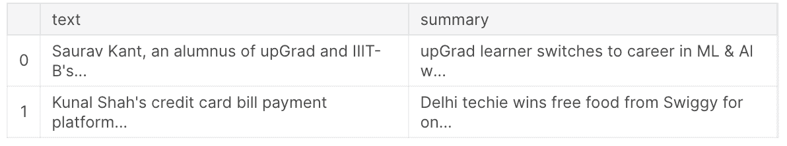
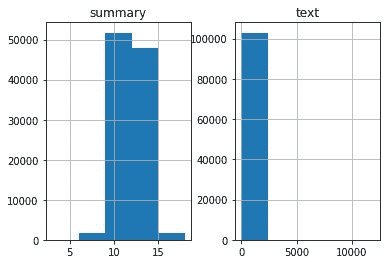
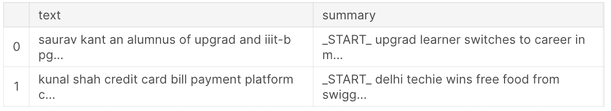
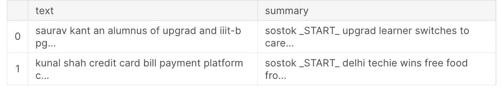

# 编码器-解码器序列到序列模型介绍(Seq2Seq)

> 原文：<https://blog.paperspace.com/introduction-to-seq2seq-models/>

在本教程中，我们将讨论编码器-解码器序列到序列(seq 2 seq)rnn:它们如何工作、网络架构、应用，以及如何使用 Keras 实现编码器-解码器序列到序列模型(直到数据准备；对于训练和测试模型，请继续关注第 2 部分)。

具体来说，我们将涵盖:

*   介绍
*   体系结构
*   应用程序
*   使用编码器-解码器序列到序列模型的文本摘要

> 您也可以跟随本教程中的完整代码，并从[Gradient Community Notebook](https://ml-showcase.paperspace.com/projects/text-summarization-with-seq2seq-models)在免费的 GPU 上运行它。

我们开始吧！

## 介绍

RNN 通常具有固定大小的输入和输出向量，即输入和输出向量的长度都是预定义的。尽管如此，这在语音识别、机器翻译等用例中并不理想。，其中输入和输出序列不需要固定并且长度相同。考虑这样一种情况，英语短语“你过得怎么样？”被翻译成法语。在法语中，你会说“你有什么看法？”。这里，输入和输出序列的大小都不固定。在这种情况下，如果您想使用 RNN 构建一个语言翻译器，您不希望预先定义序列长度。

序列对序列(seq2seq)模型可以帮助解决上述问题。当给定一个输入时，编码器-解码器 seq2seq 模型首先生成该模型的编码表示，然后将其传递给解码器以生成所需的输出。在这种情况下，输入和输出向量的大小不需要固定。

## 体系结构

这个模型设计背后的想法是使它能够在我们不限制长度的情况下处理输入。一个 RNN 将用作编码器，另一个用作解码器。由编码器生成的输出向量和提供给解码器的输入向量将拥有固定的大小。然而，它们不必相等。编码器生成的输出可以作为整个块给出，或者可以在每个时间步长连接到解码器单元的隐藏单元。


Encoder-Decoder Sequence-to-Sequence Model

编码器和解码器中的 rnn 可以是简单的 rnn、LSTMs 或 gru。

在一个简单的 RNN 中，每个隐藏状态都是使用以下公式计算的:

$$H_t(编码器)= \ phi(W _ { HH } * H _ { t-1 }+W _ { HX } * X _ { t })$ $

其中$\phi$是激活函数，$H_t(编码器)$表示编码器中的隐藏状态，$W_{HH}$是连接隐藏状态的权重矩阵，$W_{HX}$是连接输入和隐藏状态的权重矩阵。

解码器中的隐藏状态可以计算如下:

$$H_t(解码器)= \phi(W_{HH} * H_{t-1})$$

> 注意:解码器的初始隐藏状态是从编码器获得的最终隐藏状态。

解码器产生的输出如下所示:

$$Y_t = H_t(解码器)* W_{HY}$$

其中$W_{HY}$是连接隐藏状态和解码器输出的权重矩阵。

## Seq2Seq 模型的应用

Seq2seq 型号适用于以下应用:

*   机器翻译
*   语音识别
*   视频字幕
*   文本摘要

现在您已经了解了什么是序列到序列 RNN，在下一节中，您将使用 Keras API 构建一个文本摘要器。

## 使用 Seq2Seq 模型的文本摘要

文本摘要是指缩短长文本同时抓住其本质的技术。这有助于捕捉一大段文本的底线，从而减少所需的阅读时间。在这种情况下，我们可以利用使用编码器-解码器序列到序列模型构建的深度学习模型来构建文本摘要器，而不是依赖于手动摘要。

在该模型中，编码器接受实际的文本和摘要，训练该模型以创建编码表示，并将其发送到解码器，解码器将编码表示解码为可靠的摘要。随着训练的进行，经过训练的模型可用于对新文本进行推断，从中生成可靠的摘要。

这里我们将使用[新闻摘要数据集](https://www.kaggle.com/sunnysai12345/news-summary)。它由两个 CSV 文件组成:一个包含关于作者、标题、源 URL、短文和完整文章的信息，另一个只包含标题和文本。在当前应用程序中，您将从两个 CSV 文件中提取标题和文本来训练模型。

> 请注意，您可以跟随本教程中的完整代码，并从[渐变社区笔记本](https://ml-showcase.paperspace.com/projects/text-summarization-with-seq2seq-models)中的免费 GPU 上运行它。

### 步骤 1:导入数据集

首先使用 pandas 的`read_csv()`方法将新闻摘要数据集导入到您的工作区。

```py
import pandas as pd

summary = pd.read_csv('/kaggle/input/news-summary/news_summary.csv',
                      encoding='iso-8859-1')
raw = pd.read_csv('/kaggle/input/news-summary/news_summary_more.csv',
                  encoding='iso-8859-1') 
```

将两个 CSV 文件中的数据合并成一个`DataFrame`。

```py
pre1 = raw.iloc[:, 0:2].copy()
pre2 = summary.iloc[:, 0:6].copy()

# To increase the intake of possible text values to build a reliable model
pre2['text'] = pre2['author'].str.cat(pre2['date'
        ].str.cat(pre2['read_more'].str.cat(pre2['text'
        ].str.cat(pre2['ctext'], sep=' '), sep=' '), sep=' '), sep=' ')

pre = pd.DataFrame()
pre['text'] = pd.concat([pre1['text'], pre2['text']], ignore_index=True)
pre['summary'] = pd.concat([pre1['headlines'], pre2['headlines']],
                           ignore_index=True)
```

> 注意:为了增加训练模型所需的数据点，我们使用一个 CSV 文件构建了一个新的“文本”列。

让我们通过将前两行打印到控制台来更好地理解数据。

```py
pre.head(2)
```



Text and Summary

### 步骤 2:清理数据

您获取的数据可能包含非字母字符，您可以在训练模型之前删除这些字符。为此，可以使用`re`(正则表达式)库。

```py
import re

# Remove non-alphabetic characters (Data Cleaning)
def text_strip(column):

    for row in column:
        row = re.sub("(\\t)", " ", str(row)).lower()
        row = re.sub("(\\r)", " ", str(row)).lower()
        row = re.sub("(\\n)", " ", str(row)).lower()

        # Remove _ if it occurs more than one time consecutively
        row = re.sub("(__+)", " ", str(row)).lower()

        # Remove - if it occurs more than one time consecutively
        row = re.sub("(--+)", " ", str(row)).lower()

        # Remove ~ if it occurs more than one time consecutively
        row = re.sub("(~~+)", " ", str(row)).lower()

        # Remove + if it occurs more than one time consecutively
        row = re.sub("(\+\++)", " ", str(row)).lower()

        # Remove . if it occurs more than one time consecutively
        row = re.sub("(\.\.+)", " ", str(row)).lower()

        # Remove the characters - <>()|&©ø"',;?~*!
        row = re.sub(r"[<>()|&©ø\[\]\'\",;?~*!]", " ", str(row)).lower()

        # Remove mailto:
        row = re.sub("(mailto:)", " ", str(row)).lower()

        # Remove \x9* in text
        row = re.sub(r"(\\x9\d)", " ", str(row)).lower()

        # Replace INC nums to INC_NUM
        row = re.sub("([iI][nN][cC]\d+)", "INC_NUM", str(row)).lower()

        # Replace CM# and CHG# to CM_NUM
        row = re.sub("([cC][mM]\d+)|([cC][hH][gG]\d+)", "CM_NUM", str(row)).lower()

        # Remove punctuations at the end of a word
        row = re.sub("(\.\s+)", " ", str(row)).lower()
        row = re.sub("(\-\s+)", " ", str(row)).lower()
        row = re.sub("(\:\s+)", " ", str(row)).lower()

        # Replace any url to only the domain name
        try:
            url = re.search(r"((https*:\/*)([^\/\s]+))(.[^\s]+)", str(row))
            repl_url = url.group(3)
            row = re.sub(r"((https*:\/*)([^\/\s]+))(.[^\s]+)", repl_url, str(row))
        except:
            pass

        # Remove multiple spaces
        row = re.sub("(\s+)", " ", str(row)).lower()

        # Remove the single character hanging between any two spaces
        row = re.sub("(\s+.\s+)", " ", str(row)).lower()

        yield row
```

> 注意:您也可以使用其他数据清理方法来准备数据。

在文本和摘要上调用`text_strip()`函数。

```py
processed_text = text_strip(pre['text'])
processed_summary = text_strip(pre['summary'])
```

使用 spaCy 提供的`pipe()`方法批量加载数据。这确保了所有文本和摘要都拥有`string`数据类型。

```py
import spacy
from time import time

nlp = spacy.load('en', disable=['ner', 'parser']) 

# Process text as batches and yield Doc objects in order
text = [str(doc) for doc in nlp.pipe(processed_text, batch_size=5000)]

summary = ['_START_ '+ str(doc) + ' _END_' for doc in nlp.pipe(processed_summary, batch_size=5000)]
```

`_START_`和`_END_`标记分别表示摘要的开始和结束。这将在以后用于检测和删除空摘要。

现在让我们打印一些数据，以了解它是如何加载的。

```py
text[0] 
```

```py
# Output
'saurav kant an alumnus of upgrad and iiit-b s pg program in ...' 
```

也打印摘要。

```py
summary[0]
```

```py
# Output
'_START_ upgrad learner switches to career in ml  al with 90% salary hike _END_' 
```

### 步骤 3:确定最大允许序列长度

接下来，将`text`和`summary`列表存储在 pandas 对象中。

```py
pre['cleaned_text'] = pd.Series(text)
pre['cleaned_summary'] = pd.Series(summary)
```

绘制图表以确定与文本和摘要长度相关的频率范围，即确定最大数量的文本和摘要所在的单词长度范围。

```py
import matplotlib.pyplot as plt

text_count = []
summary_count = []

for sent in pre['cleaned_text']:
    text_count.append(len(sent.split()))

for sent in pre['cleaned_summary']:
    summary_count.append(len(sent.split()))

graph_df = pd.DataFrame() 

graph_df['text'] = text_count
graph_df['summary'] = summary_count

graph_df.hist(bins = 5)
plt.show()
```



从图表中，你可以确定最大单词数的范围。作为总结，您可以将范围指定为 0-15。

要找到我们无法从图表中清楚解读的文本范围，考虑一个随机范围，并找到落入该范围的单词的百分比。

```py
# Check how much % of text have 0-100 words
cnt = 0
for i in pre['cleaned_text']:
    if len(i.split()) <= 100:
        cnt = cnt + 1
print(cnt / len(pre['cleaned_text']))
```

```py
# Output
0.9578389933440218
```

正如您所观察到的，95%的文本属于 0-100 类别。

现在初始化文本和摘要的最大允许长度。

```py
# Model to summarize the text between 0-15 words for Summary and 0-100 words for Text
max_text_len = 100
max_summary_len = 15
```

### 第四步:选择合理的文本和摘要

选择小于步骤 3 中定义的最大长度的文本和摘要。

```py
# Select the Summaries and Text which fall below max length 

import numpy as np

cleaned_text = np.array(pre['cleaned_text'])
cleaned_summary= np.array(pre['cleaned_summary'])

short_text = []
short_summary = []

for i in range(len(cleaned_text)):
    if len(cleaned_summary[i].split()) <= max_summary_len and len(cleaned_text[i].split()) <= max_text_len:
        short_text.append(cleaned_text[i])
        short_summary.append(cleaned_summary[i])

post_pre = pd.DataFrame({'text': short_text,'summary': short_summary})

post_pre.head(2)
```



现在添加序列的开始(sostok)和序列的结束(eostok ),分别表示摘要的开始和结束。这将有助于在推理阶段触发汇总的开始。

```py
# Add sostok and eostok

post_pre['summary'] = post_pre['summary'].apply(lambda x: 'sostok ' + x \
        + ' eostok')

post_pre.head(2)
```



### 步骤 5:标记文本

首先将数据分成训练和测试数据块。

```py
from sklearn.model_selection import train_test_split

x_tr, x_val, y_tr, y_val = train_test_split(
    np.array(post_pre["text"]),
    np.array(post_pre["summary"]),
    test_size=0.1,
    random_state=0,
    shuffle=True,
)
```

准备并标记文本数据。

```py
# Tokenize the text to get the vocab count 
from tensorflow.keras.preprocessing.text import Tokenizer 
from tensorflow.keras.preprocessing.sequence import pad_sequences

# Prepare a tokenizer on training data
x_tokenizer = Tokenizer() 
x_tokenizer.fit_on_texts(list(x_tr))
```

找出文本中罕见词(比如，出现次数少于 5 次)的出现百分比。

```py
thresh = 5

cnt = 0
tot_cnt = 0

for key, value in x_tokenizer.word_counts.items():
    tot_cnt = tot_cnt + 1
    if value < thresh:
        cnt = cnt + 1

print("% of rare words in vocabulary: ", (cnt / tot_cnt) * 100)
```

```py
# Output
% of rare words in vocabulary:  62.625791318822664
```

通过考虑单词总数减去很少出现的单词，再次标记文本。将文本转换为数字，并将其填充到相同的长度。

```py
# Prepare a tokenizer, again -- by not considering the rare words
x_tokenizer = Tokenizer(num_words = tot_cnt - cnt) 
x_tokenizer.fit_on_texts(list(x_tr))

# Convert text sequences to integer sequences 
x_tr_seq = x_tokenizer.texts_to_sequences(x_tr) 
x_val_seq = x_tokenizer.texts_to_sequences(x_val)

# Pad zero upto maximum length
x_tr = pad_sequences(x_tr_seq,  maxlen=max_text_len, padding='post')
x_val = pad_sequences(x_val_seq, maxlen=max_text_len, padding='post')

# Size of vocabulary (+1 for padding token)
x_voc = x_tokenizer.num_words + 1

print("Size of vocabulary in X = {}".format(x_voc))
```

```py
# Output
Size of vocabulary in X = 29638
```

对摘要也做同样的操作。

```py
# Prepare a tokenizer on testing data
y_tokenizer = Tokenizer()   
y_tokenizer.fit_on_texts(list(y_tr))

thresh = 5

cnt = 0
tot_cnt = 0

for key, value in y_tokenizer.word_counts.items():
    tot_cnt = tot_cnt + 1
    if value < thresh:
        cnt = cnt + 1

print("% of rare words in vocabulary:",(cnt / tot_cnt) * 100)

# Prepare a tokenizer, again -- by not considering the rare words
y_tokenizer = Tokenizer(num_words=tot_cnt-cnt) 
y_tokenizer.fit_on_texts(list(y_tr))

# Convert text sequences to integer sequences 
y_tr_seq = y_tokenizer.texts_to_sequences(y_tr) 
y_val_seq = y_tokenizer.texts_to_sequences(y_val) 

# Pad zero upto maximum length
y_tr = pad_sequences(y_tr_seq, maxlen=max_summary_len, padding='post')
y_val = pad_sequences(y_val_seq, maxlen=max_summary_len, padding='post')

# Size of vocabulary (+1 for padding token)
y_voc = y_tokenizer.num_words + 1

print("Size of vocabulary in Y = {}".format(y_voc))
```

```py
# Output
% of rare words in vocabulary: 62.55667945587723
Size of vocabulary in Y = 12883
```

### 步骤 6:删除空文本和摘要

从数据中删除所有空摘要(只有开始和结束标记)及其相关文本。

```py
# Remove empty Summaries, .i.e, which only have 'START' and 'END' tokens
ind = []

for i in range(len(y_tr)):
    cnt = 0
    for j in y_tr[i]:
        if j != 0:
            cnt = cnt + 1
    if cnt == 2:
        ind.append(i)

y_tr = np.delete(y_tr, ind, axis=0)
x_tr = np.delete(x_tr, ind, axis=0)
```

对验证数据也重复同样的操作。

```py
# Remove empty Summaries, .i.e, which only have 'START' and 'END' tokens
ind = []
for i in range(len(y_val)):
    cnt = 0
    for j in y_val[i]:
        if j != 0:
            cnt = cnt + 1
    if cnt == 2:
        ind.append(i)

y_val = np.delete(y_val, ind, axis=0)
x_val = np.delete(x_val, ind, axis=0)
```

我们将在第 2 部分继续这一点，在那里我们构建模型，训练它，并进行推理。

## 结论

到目前为止，在本教程中，您已经看到了什么是编码器-解码器序列到序列模型及其架构。您还准备了新闻摘要数据集来训练您自己的 seq2seq 模型，以便对给定的文本片段进行摘要。

在这个由两部分组成的系列的下一部分中，您将构建、训练和测试这个模型。