# 时间序列预测导论:自回归模型和平滑方法

> 原文：<https://blog.paperspace.com/time-series-forecasting-autoregressive-models-smoothing-methods/>

在本系列的第 1 部分中，我们看了时间序列分析。我们学习了时间序列的不同属性，自相关、偏自相关、平稳性、平稳性检验和季节性。

在本系列的这一部分中，我们将看到如何制作时间序列模型，并预测该序列在未来的变化。具体来说，在本教程中，我们将看看自回归模型和指数平滑方法。在系列的最后一部分，我们将看看机器学习和深度学习算法，如线性回归和 LSTMs。

你也可以从 [ML Showcase](https://ml-showcase.paperspace.com/) 上的[渐变社区笔记本](https://ml-showcase.paperspace.com/projects/time-series-analysis-and-forecasting)中跟随本文中的代码(并免费运行)。

我们将使用在上一篇文章中使用的相同数据(即德国耶拿的天气数据)进行实验。您可以使用以下命令下载它。

```py
wget https://storage.googleapis.com/tensorflow/tf-keras-datasets/jena_climate_2009_2016.csv.zip
```

解压缩文件，你会发现 CSV 数据，你可以使用熊猫阅读。数据集记录了几个不同的天气参数。在本教程中，我们将使用摄氏温度。数据在 24 小时内以 10 分钟的间隔定期记录。我们将在预测模型中使用每小时的数据。

```py
import pandas as pd

df = pd.read_csv('jena_climate_2009_2016.csv')

time = pd.to_datetime(df.pop('Date Time'), format='%d.%m.%Y %H:%M:%S')
series = df['T (degC)'][5::6]
series.index = time[5::6]
```

时间序列预测有不同的方法，这取决于我们在[上一篇文章](https://blog.paperspace.com/introduction-time-series-analysis/)中讨论的趋势。如果时间序列是平稳的，自回归模型可以派上用场。如果一个序列不是稳定的，平滑方法可能会很有效。季节性可以用自回归模型和平滑方法来处理。我们还可以使用经典的机器学习算法，如线性回归、随机森林回归等。，以及基于 LSTMs 的深度学习架构。

如果你没有读过本系列的第一篇文章，我建议你在开始阅读这篇文章之前通读一遍。

## 自回归模型

在多元线性回归中，我们根据其他变量的值来预测一个值。模型的表达式假设输出变量和预测变量之间存在线性关系。

在自回归模型中，我们假设一个变量在时间$t$的值与同一个变量在过去，即时间$t-1，t-2，...，t-p，..., 2, 1, 0$.

$ $ y _ { t } = c+\ beta _ { 1 } y _ { t-1 }+\ beta _ { 2 } y _ { t-2 }+...+\ beta _ { p } y _ { t-p }+\ epsilon _ { t } $ $

这里 *p* 是自回归模型的滞后阶。

对于一个 [*AR(1)* 模型](https://otexts.com/fpp2/AR.html)，

*   当$\beta_1 = 0$，表示随机数据
*   当$\beta_1 = 1$且$c = 0$，时，表示随机行走
*   当$\beta_1 = 1$且$c \neq 0$，时，它表示具有漂移的随机游走

我们通常限制平稳时间序列的自回归模型，这意味着对于一个 *AR(1)* 模型$-1 < \beta_1 < 1$。**

另一种表示时间序列的方式是考虑一个纯移动平均(MA) 模型，其中变量的值取决于过去序列的残差。

$ $ y _ { t } = m+\ epsilon _ { t }+\ phi _ { 1 } \ epsilon _ { t-1 }+\ phi _ { 2 } \ epsilon _ { t-2 }+...+ \phi_{q}\epsilon_{t -q} $$

正如我们在[上一篇文章](https://blog.paperspace.com/introduction-time-series-analysis/)中了解到的，如果一个时间序列不是平稳的，有多种方法可以使它平稳。最常用的方法是差分法。

ARIMA 模型考虑了上述所有三种机制，并代表了如下所示的时间序列。

$ $ y _ { t } = \ alpha+\ beta _ { 1 } y _ { t-1 }+\ beta _ { 2 } y _ { t-2 }+...+\ beta _ { p } y _ { t-p }+\ epsilon _ { t }+\ phi _ { 1 } \ epsilon _ { t-1 }+\ phi _ { 2 } \ epsilon _ { t-2 }+...+ \phi_{q}\epsilon_{t -q}$$

(其中假设该序列是平稳的。)

在将模型拟合到系列上之前，实现了固定化机制。

差分的顺序可以通过使用不同的平稳性测试和查看 PACF 图来找到。您可以参考本系列的第一部分来理解测试及其实现。

MA 顺序基于差异系列的 ACF 图。该顺序取决于去除时间序列中任何自相关所需的差分顺序。

您可以按如下方式实现，其中$p$是滞后订单，$q$是移动平均订单，$d$是差异订单。

```py
from matplotlib import pyplot as plt
from sklearn.metrics import mean_squared_error
from statsmodels.tsa.arima_model import ARIMA

def ARIMA_model(df, p=1, q=1, d=1):
    model = ARIMA(df, order=(p, d, q))  
    results_ARIMA = model.fit(disp=-1)
    rmse = np.sqrt(mean_squared_error(df[1:], results_ARIMA.fittedvalues))
    return results_ARIMA, rmse
```

这对于我们的时间序列来说是不够的，因为除了不稳定之外，我们的时间序列还有季节性趋势。我们需要一个萨里玛模型。

SARIMA 模型的等式变为(假设季节性滞后为 12):

$ $ y _ { t } = \ gamma+\ beta _ { 1 } y _ { t-1 }+\ beta _ { 2 } y _ { t-2 }+...+\ beta _ { p } y _ { t-p }+\ \ \ epsilon _ { t }+\ phi _ { 1 } \ epsilon _ { t-1 }+\ phi _ { 2 } \ epsilon _ { t-2 }+...+\ phi _ { q } \ epsilon _ { t-q }+\ \ \ Beta _ { 1 } y _ { t-12 }+\ Beta _ { 2 } y _ { t-13 }+...+\ Beta _ { q } y _ { t-12-q }+\ \ \ epsilon _ { t-12 }+\ Phi _ { 1 } \ epsilon _ { t-13 }+\ Phi _ { 2 } \ epsilon _ { t-14 }+...+ \Phi_{q}\epsilon_{t - 12 - q}$$

这是一个线性方程，系数可以通过回归算法得到。

有时一个时间序列可能被过度或不足的差异，因为 ACF 和 PACF 图可能有点棘手的推断。幸运的是，有一个工具可以用来自动选择 ARIMA 参数的超参数以及同步性。您可以使用 pip 安装 [pmdarima](https://pypi.org/project/pmdarima/) 。

```py
pip install pmdarima
```

`pmdarima`使用网格搜索来搜索 ARIMA 参数的所有值，并挑选具有最低 AIC 值的模型。它还会使用您选择的平稳性测试自动计算差值。

但是，对于我们的时间序列，频率是每 365 天 1 个周期(每 8544 个数据点 1 个周期)。这对于你的电脑来说有点太重了。即使在我将数据从每小时一次减少到每天一次之后，我发现建模脚本被扼杀了。我剩下要做的唯一一件事就是将数据转换为月度数据，然后运行模型。

```py
import pandas as pd
import matplotlib.pyplot as plt
import pmdarima as pm
import pickle

df = pd.read_csv('jena_climate_2009_2016.csv')

series = df['T (degC)'][4391::4392]
time = pd.to_datetime(df.pop('Date Time'), format='%d.%m.%Y %H:%M:%S')[4391::4392]
series.index = time

train = series[:-int(len(series)/10)]
test = series[-int(len(series)/10):]

model = pm.auto_arima(train.values, 
                      start_p=1, # lag order starting value
                      start_q=1, # moving average order starting value
                      test='adf', #ADF test to decide the differencing order
                      max_p=3, # maximum lag order
                      max_q=3, # maximum moving average order
                      m=12, # seasonal frequency
                      d=None, # None so that the algorithm can chose the differencing order depending on the test
                      seasonal=True, 
                      start_P=0, 
                      D=1, # enforcing the seasonal frequencing with a positive seasonal difference value
                      trace=True,
                      suppress_warnings=True, 
                      stepwise=True)

print(model.summary())

# save the model
with open('seasonal_o.pkl', 'wb') as f:
    pickle.dump(model, f)

# predictions for the entire series 
all_vals = model.predict(n_periods=len(series), return_conf_int=False)
all_vals = pd.Series(all_vals, index=series.index)
plt.plot(series)
plt.plot(all_vals, color='darkgreen')
plt.title('Forecast values for the entire series')
plt.xlabel('Year')
plt.ylabel('Temp (Celcius)')
plt.legend(['True', 'Predicted'])
plt.show()

# predictions for the test set with confidence values
preds, conf_vals = model.predict(n_periods=len(test), return_conf_int=True)
preds = pd.Series(preds, index=test.index)

lower_bounds = pd.Series(conf_vals[:, 0], index=list(test.index))
upper_bounds = pd.Series(conf_vals[:, 1], index=list(test.index))

plt.plot(series)
plt.plot(preds, color='darkgreen')
plt.fill_between(lower_bounds.index, 
                 lower_bounds, 
                 upper_bounds, 
                 color='k', alpha=.15)

plt.title("Forecast for test values")
plt.xlabel('Year')
plt.ylabel('Temp (Celcius)')
plt.legend(['True', 'Predicted'])
plt.show()
```

输出如下所示。

```py
Performing stepwise search to minimize aic
 ARIMA(1,0,1)(0,1,1)[12] intercept   : AIC=470.845, Time=0.18 sec
 ARIMA(0,0,0)(0,1,0)[12] intercept   : AIC=495.164, Time=0.01 sec
 ARIMA(1,0,0)(1,1,0)[12] intercept   : AIC=476.897, Time=0.09 sec
 ARIMA(0,0,1)(0,1,1)[12] intercept   : AIC=469.206, Time=0.10 sec
 ARIMA(0,0,0)(0,1,0)[12]             : AIC=493.179, Time=0.01 sec
 ARIMA(0,0,1)(0,1,0)[12] intercept   : AIC=489.549, Time=0.03 sec
 ARIMA(0,0,1)(1,1,1)[12] intercept   : AIC=inf, Time=0.37 sec
 ARIMA(0,0,1)(0,1,2)[12] intercept   : AIC=inf, Time=0.64 sec
 ARIMA(0,0,1)(1,1,0)[12] intercept   : AIC=476.803, Time=0.07 sec
 ARIMA(0,0,1)(1,1,2)[12] intercept   : AIC=inf, Time=0.89 sec
 ARIMA(0,0,0)(0,1,1)[12] intercept   : AIC=472.626, Time=0.07 sec
 ARIMA(0,0,2)(0,1,1)[12] intercept   : AIC=470.997, Time=0.17 sec
 ARIMA(1,0,0)(0,1,1)[12] intercept   : AIC=468.858, Time=0.10 sec
 ARIMA(1,0,0)(0,1,0)[12] intercept   : AIC=490.050, Time=0.03 sec
 ARIMA(1,0,0)(1,1,1)[12] intercept   : AIC=inf, Time=0.32 sec
 ARIMA(1,0,0)(0,1,2)[12] intercept   : AIC=inf, Time=0.58 sec
 ARIMA(1,0,0)(1,1,2)[12] intercept   : AIC=inf, Time=0.81 sec
 ARIMA(2,0,0)(0,1,1)[12] intercept   : AIC=470.850, Time=0.17 sec
 ARIMA(2,0,1)(0,1,1)[12] intercept   : AIC=inf, Time=0.39 sec
 ARIMA(1,0,0)(0,1,1)[12]             : AIC=468.270, Time=0.07 sec
 ARIMA(1,0,0)(0,1,0)[12]             : AIC=488.078, Time=0.01 sec
 ARIMA(1,0,0)(1,1,1)[12]             : AIC=inf, Time=0.25 sec
 ARIMA(1,0,0)(0,1,2)[12]             : AIC=inf, Time=0.52 sec
 ARIMA(1,0,0)(1,1,0)[12]             : AIC=475.207, Time=0.05 sec
 ARIMA(1,0,0)(1,1,2)[12]             : AIC=inf, Time=0.74 sec
 ARIMA(0,0,0)(0,1,1)[12]             : AIC=471.431, Time=0.06 sec
 ARIMA(2,0,0)(0,1,1)[12]             : AIC=470.247, Time=0.10 sec
 ARIMA(1,0,1)(0,1,1)[12]             : AIC=470.243, Time=0.15 sec
 ARIMA(0,0,1)(0,1,1)[12]             : AIC=468.685, Time=0.07 sec
 ARIMA(2,0,1)(0,1,1)[12]             : AIC=471.782, Time=0.33 sec

Best model:  ARIMA(1,0,0)(0,1,1)[12]          
Total fit time: 7.426 seconds
                                      SARIMAX Results                                       
============================================================================================
Dep. Variable:                                    y   No. Observations:                   86
Model:             SARIMAX(1, 0, 0)x(0, 1, [1], 12)   Log Likelihood                -231.135
Date:                              Mon, 11 Jan 2021   AIC                            468.270
Time:                                      12:39:38   BIC                            475.182
Sample:                                           0   HQIC                           471.027
                                               - 86                                         
Covariance Type:                                opg                                         
==============================================================================
                 coef    std err          z      P>|z|      [0.025      0.975]
------------------------------------------------------------------------------
ar.L1         -0.2581      0.129     -2.004      0.045      -0.510      -0.006
ma.S.L12      -0.7548      0.231     -3.271      0.001      -1.207      -0.303
sigma2        26.4239      6.291      4.200      0.000      14.094      38.754
===================================================================================
Ljung-Box (Q):                       39.35   Jarque-Bera (JB):                 1.36
Prob(Q):                              0.50   Prob(JB):                         0.51
Heteroskedasticity (H):               0.70   Skew:                            -0.14
Prob(H) (two-sided):                  0.38   Kurtosis:                         3.61
=================================================================================== 
```

最好的模型是 ARIMA(1，0，0)(0，1，1)(12)。从结果中可以看到不同的系数值和$p$值，都在 0.05 以下。这表明$p$值很重要。

预测值相对于原始时间序列的曲线如下所示。

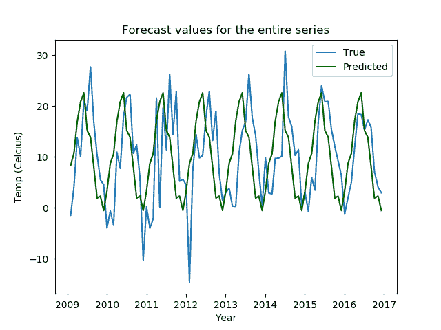

置信区间图看起来像这样。

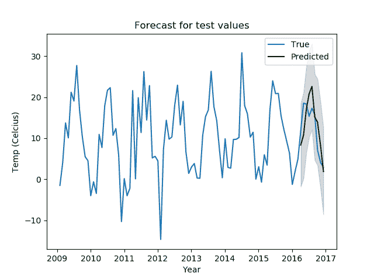

这些情节还不错；预测值都落在置信范围内，季节模式也能很好地捕捉到。

也就是说，当我们试图用有限的计算让算法为我们工作时，我们已经失去了数据的所有粒度。我们需要其他方法。

你可以在本文的[中了解更多关于自回归模型的知识。](https://www.machinelearningplus.com/time-series/arima-model-time-series-forecasting-python/)

## 平滑方法

指数平滑法常用于时间序列预测。他们利用指数窗口函数来平滑时间序列。平滑方法也有多种变化。

指数平滑的最简单形式可以这样想:

$ $ s _ { 0 } = x _ { 0 } \ \ s _ { t } = \ alpha x _ { t }+(1-\ alpha)s _ { t-1 } = s _ { t-1 }+\ alpha(x _ { t }-s _ { t-1 })$ $

其中$x$ 表示原始值，$s$表示预测值，$\alpha$ 是平滑因子，其中:

$$ 0 \leq \alpha \leq 1 $$

这意味着平滑的统计量$s_{t}$是当前实际值和前一时间步长的平滑值的加权平均值，前一时间步长值作为常数添加。

为了更好地平滑曲线，平滑因子的值(有点违反直觉)需要更低。有$\alpha = 1$相当于原始时间序列。平滑因子可以通过使用最小二乘法来找到，其中您可以最小化以下内容。

$$ (s_{t} - x_{t + 1})^2 $$

平滑方法称为指数平滑，因为当您递归应用公式时:

$ $ s _ { t } = \ alpha x _ { t }+(1-\ alpha)s _ { t-1 } $ $

您将获得:

$ $ s _ { t } = \ alpha \ sum _ { I = 0}^{t}(1-\alpha)^i x _ { t-I } $ $

这是一个几何级数，即指数函数的离散形式。

我们将实现指数平滑的三种变体:简单指数平滑、霍尔特线性平滑和霍尔特指数平滑。我们将尝试找出改变不同平滑算法的超参数如何改变我们的预测输出，并看看哪一个最适合我们。

```py
from statsmodels.tsa.holtwinters import SimpleExpSmoothing, Holt
from statsmodels.tsa.holtwinters import ExponentialSmoothing
from sklearn.metrics import mean_squared_error

def exponential_smoothing(df, smoothing_level=0.2):
    model = SimpleExpSmoothing(np.asarray(df))
    model._index = pd.to_datetime(df.index)
    fit = model.fit(smoothing_level=smoothing_level)   
    return fit

def holts_linear_smoothing(df, smoothing_level=0.3, smoothing_slope=0.05):
    model = Holt(np.asarray(df))
    model._index = pd.to_datetime(df.index)
    fit = model.fit(smoothing_level=smoothing_level, smoothing_slope=smoothing_slope)   
    return fit

def holts_exponential_smoothing(df, trend=None, damped=False, seasonal=None, seasonal_periods=None):
    model = ExponentialSmoothing(np.asarray(df), trend=trend, seasonal=seasonal, damped=damped, seasonal_periods=seasonal_periods)
    model._index = pd.to_datetime(df.index)
    fit = model.fit()
    return fit
```

所有三个模型都有不同的超参数，我们将使用网格搜索进行测试。我们还将返回 RMSE 值供我们比较，并获得最佳模型。

```py
import numpy as np

def smoothing_experiments(train, test, params, method):
    methods = ['simpl_exp', 'holts_lin', 'holts_exp']
    models = {}
    preds = {}
    rmse = {}
    if method == methods[0]:
        for s in params['smoothing_level']:
            models[s] = exponential_smoothing(train, smoothing_level=s)
            preds[s] = models[s].predict(start=1,end=len(test))
            preds[s] -= preds[s][0]
            preds[s] += train.values[-1]
            rmse[s] = np.sqrt(mean_squared_error(test, preds[s]))
    elif method == methods[1]:
        for sl in params['smoothing_level']:
            for ss in params['smoothing_trend']:
                models[(sl,ss)] = holts_linear_smoothing(train, smoothing_level=sl, smoothing_slope=ss)
                preds[(sl,ss)] = models[(sl,ss)].predict(start=1,end=len(test))                
                preds[(sl,ss)] -= preds[(sl,ss)][0]
                preds[(sl,ss)] += train.values[-1]
                rmse[(sl,ss)] = np.sqrt(mean_squared_error(test, preds[(sl,ss)]))
    elif method == methods[2]:
        for t in params['trend']:
            for d in params['damped_trend']:
                models[(t,d)] = holts_exponential_smoothing(train, trend=t, damped=d)
                preds[(t,d)] = models[(t,d)].predict(start=1,end=len(test))
                preds[(t,d)] -= preds[(t,d)][0]
                preds[(t,d)] += train.values[-1]
                rmse[(t,d)] = np.sqrt(mean_squared_error(test, preds[(t,d)]))
    fig, ax = plt.subplots(figsize=(12, 6))
    ax.plot(train.index, train.values, color="gray", label='train original')
    ax.plot(test.index, test.values, color="gray", label='test original')
    for p, f, r in zip(list(preds.values()),list(models.values()),list(rmse.values())):
        if method == methods[0]:
            ax.plot(test.index, p, label="alpha="+str(f.params['smoothing_level'])[:3]+" RMSE: "+str(r))
            ax.set_title("Simple Exponential Smoothing")    
            ax.legend();
        elif method == methods[1]:
            ax.plot(test.index, p, label="alpha="+str(f.params['smoothing_level'])[:4]+", beta="+str(f.params['smoothing_trend'])[:4]+" RMSE: "+str(r))
            ax.set_title("Holts Linear Smoothing")    
            ax.legend();
        elif method == methods[2]:
            ax.plot(test.index, p, 
                    label="alpha="+str(f.params['smoothing_level'])[:4]+", beta="+str(f.params['smoothing_trend'])[:4]+ ", damping="+str(True if f.params['damping_trend']>0 else False)+" RMSE: "+str(r), 
                    )
            ax.set_title("Holts Exponential Smoothing")    
            ax.legend();
    plt.show()
    return models, preds, rmse 
```

现在我们用不同的超参数进行实验。

```py
# defining the parameters for hyperparameter search
simpl_exp_params = {
    'smoothing_level': [0.2, 0.3, 0.5],
}

holts_lin_params = {
    'smoothing_level': [0.2, 0.3, 0.5],
    'smoothing_trend': [0.05, 0.1, 0.2],
}

holts_exp_params = {
    'trend': ['add'],
    'damped_trend': [False, True],
}

df = pd.read_csv('jena_climate_2009_2016.csv')

series = df['T (degC)'][5::6]
time = pd.to_datetime(df.pop('Date Time'), format='%d.%m.%Y %H:%M:%S')[5::6]
series.index = time

train = series[:-int(len(series)/10)]
test = series[-int(len(series)/10):]

simpl_exp_models, simpl_exp_preds, simpl_exp_rmse = smoothing_experiments(train, test, simpl_exp_params, 'simpl_exp')
holts_lin_models, holts_lin_preds, holts_lin_rmse = smoothing_experiments(train, test, holts_lin_params, 'holts_lin')
holts_exp_models, holts_exp_preds, holts_exp_rmse = smoothing_experiments(train, test, holts_exp_params, 'holts_exp')
```

让我们看看我们的阴谋是如何实现的。

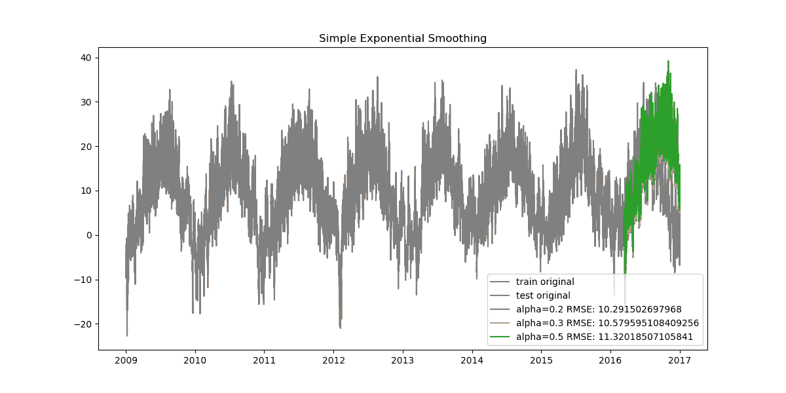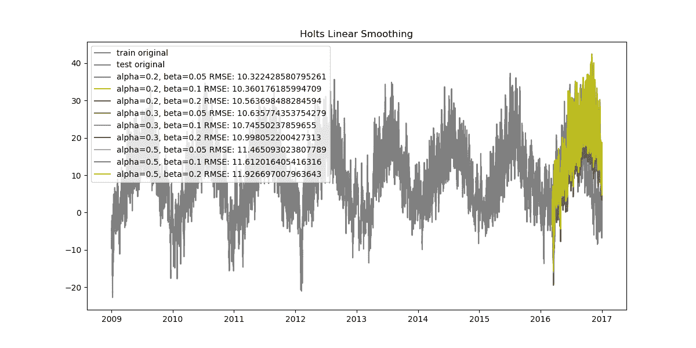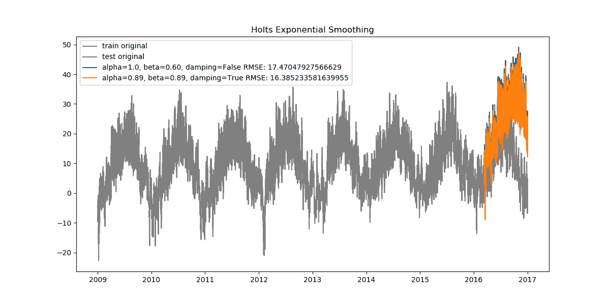

由于我们的数据非常密集，从头到尾看这些图会显得杂乱无章。让我们看看放大后的数据是什么样子。

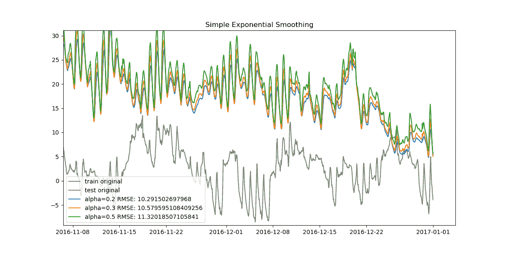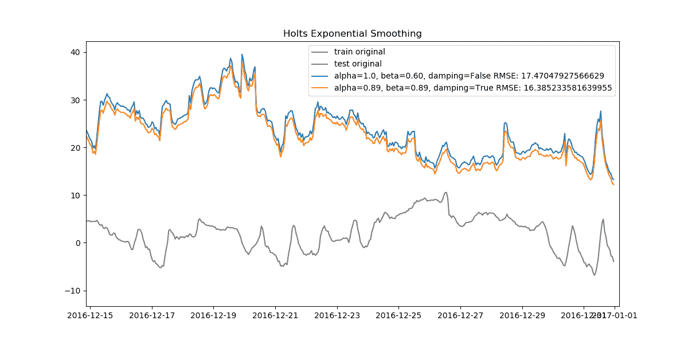

我们可以找到所有三种方法的最佳模型，并对它们进行比较。

```py
# find the best model based on the RMSE values
def get_best_model(rmse):
    min_rmse = min(rmse.values())
    best = [key for key in rmse if rmse[key] == min_rmse]
    return best[0]

best1 = get_best_model(simpl_exp_rmse)
best2 = get_best_model(holts_lin_rmse)
best3 = get_best_model(holts_exp_rmse)

# get plots for all the exponential smoothing best models
plt.figure(figsize=(12,6))
plt.plot(train.index, train.values, color='gray')
plt.plot(test.index, test.values, color='gray')
plt.title('Simple and Holt Smoothing Forecast')

preds = simpl_exp_preds[best1]
rmse = np.sqrt(mean_squared_error(test, preds))
plt.plot(test.index[:len(preds)], preds, color='red', label='preds - simple exponential smoothing - RMSE - {}'.format(rmse))
plt.legend()

preds = holts_lin_preds[best2]
rmse = np.sqrt(mean_squared_error(test, preds))
plt.plot(test.index[:len(preds)], preds, color='green', label='preds - holts linear smoothing - RMSE - {}'.format(rmse))
plt.legend()

preds = holts_exp_preds[best3]
rmse = np.sqrt(mean_squared_error(test, preds))
plt.plot(test.index[:len(preds)], preds, color='orange', label='preds - holts exponential smoothing - RMSE - {}'.format(rmse))
plt.legend()

plt.show()
```

我们发现以下结果。

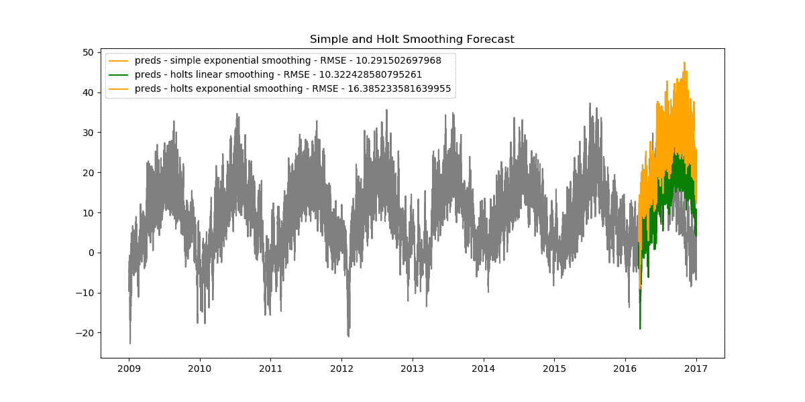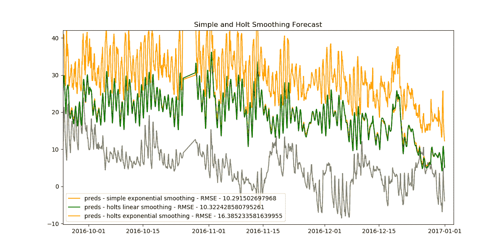

事实证明，简单指数模型具有最小的 RMSE 值，因此是我们拥有的最佳模型。

```py
plt.figure(figsize=(12,6))
plt.plot(train.index, train.values, color='gray')
plt.plot(test.index, test.values, color='gray')
plt.title('Simple Exponential Smoothing (Best Model) Forecast ')

preds = simpl_exp_preds[best1]
rmse = np.sqrt(mean_squared_error(test, preds))
plt.plot(test.index[:len(preds)], preds, color='red', label='preds - simple exponential smoothing - RMSE - {}'.format(rmse))
plt.legend()
plt.show() 
```

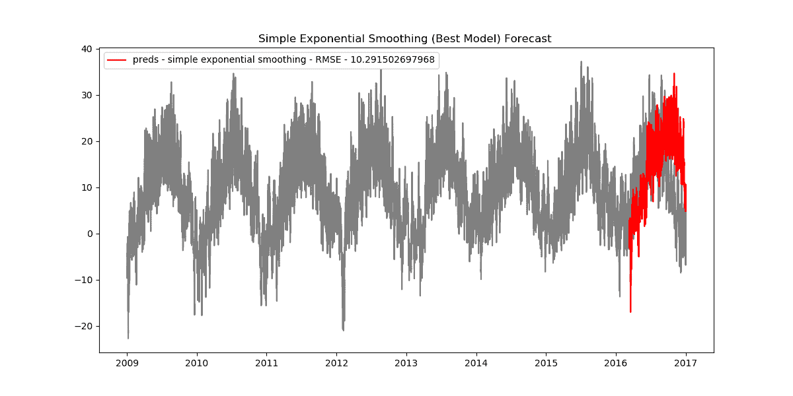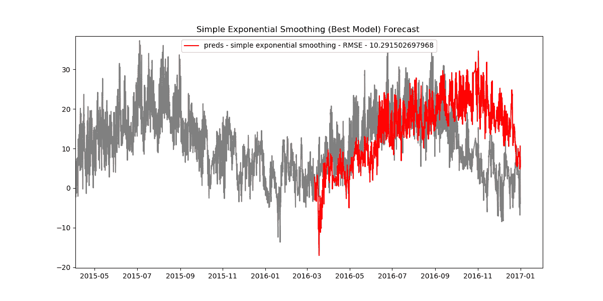

您可以在这里找到并运行本系列文章[的代码。](https://ml-showcase.paperspace.com/projects/time-series-analysis-and-forecasting)

## 结论

在本系列的这一部分中，我们主要关注自回归模型，探索了移动平均项、滞后阶数、差分、季节性因素及其实施，包括基于网格搜索的超参数选择。然后，我们转向指数平滑方法，研究简单指数平滑、霍尔特线性和指数平滑、基于网格搜索的超参数选择以及离散用户定义的搜索空间、最佳模型选择和推理。

在下一部分中，我们将了解如何为线性回归、随机森林回归等经典机器学习算法以及 LSTMs 等深度学习算法创建特征、训练模型和进行预测。

希望你喜欢阅读。