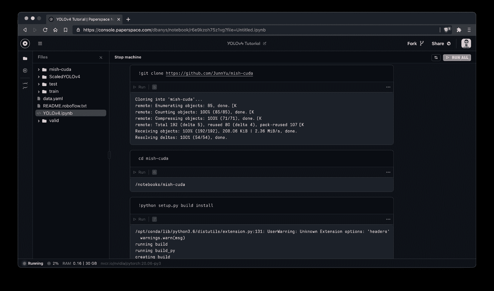
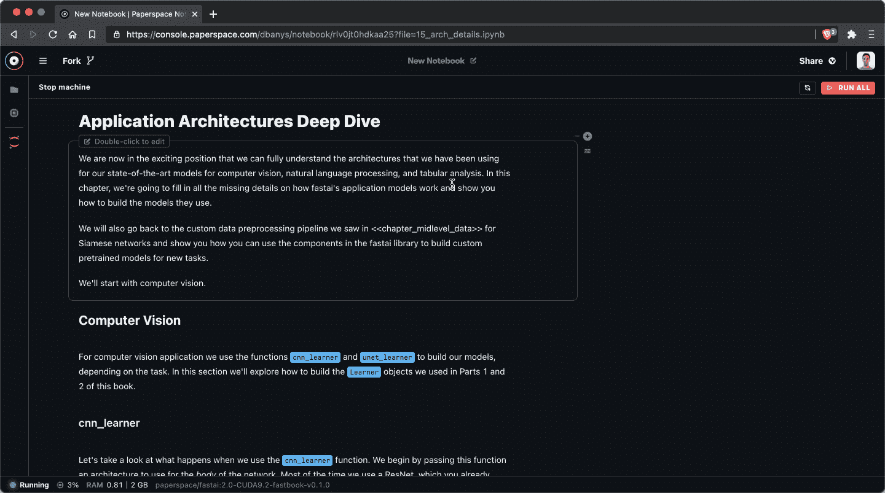
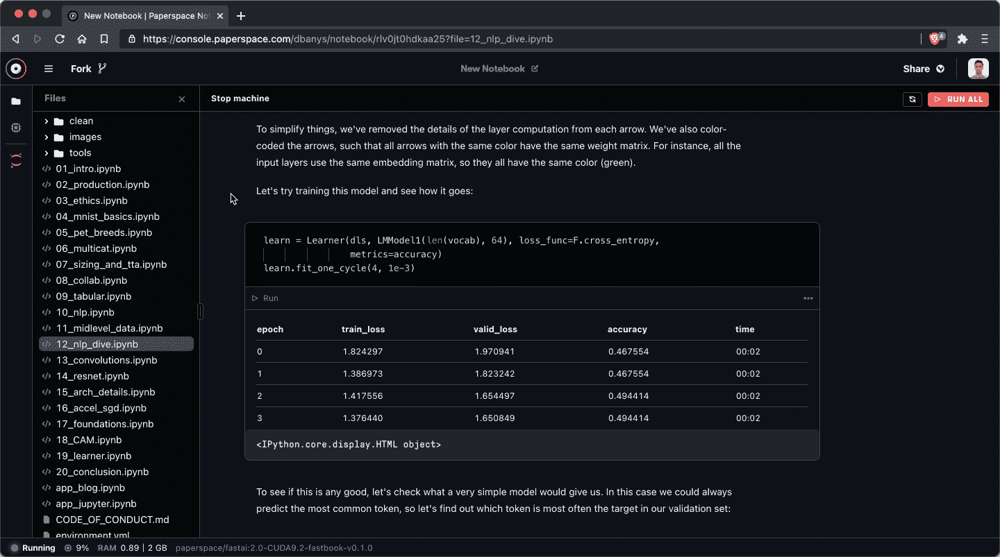
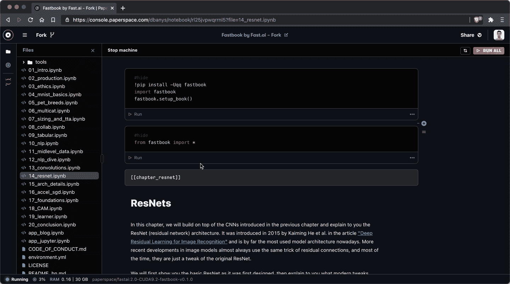

# 渐变笔记本刚刚获得了 2019 年以来最大的更新

> 原文：<https://blog.paperspace.com/all-new-gpu-backed-notebooks-on-gradient/>

我们在 Paperspace 度过了非常忙碌的一年，我们很高兴开始分享我们一直在做的一些事情。第一个是对 [Gradient cloud notebooks](https://gradient.paperspace.com/notebooks) 的巨大升级，今天它对任何订阅计划(包括自由层计划)的 Paperspace Gradient 的所有用户都可用。

Running [Scaled-YOLOv4](https://blog.paperspace.com/how-to-train-scaled-yolov4-object-detection/) in the all-new Gradient Notebooks IDE

Gradient 旨在为每个团队提供简单、可扩展的 ML 基础设施。我们的目标是通过共享计算原语和可组合的 ML 生命周期自动化来帮助 ML 社区构建更好的应用。

如果你一直在[关注](https://updates.paperspace.com/)我们最近发布的变化，你可能会注意到我们最近非常关注渐变控制台体验。控制台是我们提供的一切的关键——从[自动扩展模型和部署](https://updates.paperspace.com/autoscaling-is-here!-G3nS8)到[托管私有集群](https://blog.paperspace.com/introducing-private-gradient-clusters/)以及二者之间的一切。

全新的笔记本电脑 IDE 只是最新的改进，它将支持我们已经积累并准备在未来几周内发布的一些高阶功能。

如果你想知道为什么我们决定投资重写渐变笔记本电脑，这是因为我们认为笔记本电脑继续为渐变 ML 堆栈的其余部分提供最快的入口。

对许多用户来说，笔记本是让某些东西运转起来并被黑客攻击的最快方式——笔记本的使用数据证明了这一点。

上个月，10，000 多名 Paperspace 用户创建了一个渐变笔记本，我们的用户在 Paperspace 基础架构上记录了超过 200 万小时的 GPU 计算时间。换句话说，笔记本电脑非常受欢迎。

如果你不喜欢笔记本，不要担心！Gradient 提供了许多不同的基础设施原语(机器、集群、作业、实验、部署等。)而且你总是可以自由挑选让你生活更轻松的工具。

现在让我们开始发布。首先，我们将讨论此版本中的关键改进领域，然后我们将介绍具体的功能。

*   **架构**–我们重写了整个笔记本电脑前端，以提供丰富的基础设施集成，这是 vanilla Jupyter 无法实现的。这意味着你会在笔记本内部看到新的**文件浏览器**，新的**计算实例选择器**，以及新的**计算节点系统指标**。
*   **性能**–新的 IDE 大幅加快了笔记本电脑的启动和关闭时间以及单元渲染速度。事实上，从文件导航到单元格执行，笔记本的每个方面都应该快得多。
*   可靠性–IDE 重写也提供了一些优于 Jupyter 的受欢迎的生活质量改进。这些包括更多的原子自动保存间隔，更好的错误报告，以及新的单元块上下文菜单。
*   **美学** —也许是最明显的改进，但我们已经根据新的设计标准带来了笔记本电脑，这些标准是我们[在 12 月](https://blog.paperspace.com/web-console-2-0/)推出新的 Paperspace 控制台时首次推出的。我们对结果非常满意，从现在开始只会越来越好。

现在让我们向您展示一些正在运行的新功能。

#### 更快的启动和拆卸

Create a notebook from a template, select an instance type, and provision in under a minute

这一点不言自明:笔记本电脑配置和取消配置的方式比以前快得多。我们也感谢这一次。🙏

#### 新建文件浏览器

Expand the sidebar to view your files.

我们没有使用 Jupyter 的老式文件浏览器，而是自己写的！目前，文件浏览器有点简陋，但在短短的几周内，它将开始启用一些围绕数据管理的全新功能。敬请期待！

#### 笔记本中的实例选择

You can select the instance you want to run a notebook against from the `Instance` panel in the notebook sidebar.

长期以来，用户一直要求我们在不离开笔记本电脑环境的情况下选择机器，我们很乐意满足他们的要求。现在，您可以在侧边栏的实例面板中交换实例。(切换节点前一定要停好笔记本！)

#### **节点系统指标**

There's a new status bar at the bottom of the notebook that provides some handy machine performance metrics. 

现在，您可以从笔记本电脑本身了解计算性能。如果您查看笔记本电脑的底部，您会看到一个状态栏，其中显示了高级别的 CPU/GPU 指标。这通常有助于理解您的代码在哪里导致了问题，我们已经在想，如果没有这一点，我们是如何生活的！

善良的老 Jupyter

如果需要的话，你可以换成香草巧克力。从侧边栏的菜单选项启动 Jupyter 中的笔记本。

#### [即将推出]新的存储功能

数据输入/输出仍然是云笔记本电脑环境的一大挑战，我们从大量笔记本电脑用户那里了解到，他们希望在数据管理方面有更好的选择。在下一个版本中，我们将围绕存储引入原语。敬请期待！

请务必告诉您的朋友试用使用免费 GPU 的笔记本电脑，立即开始在 Paperspace 上培训模型。