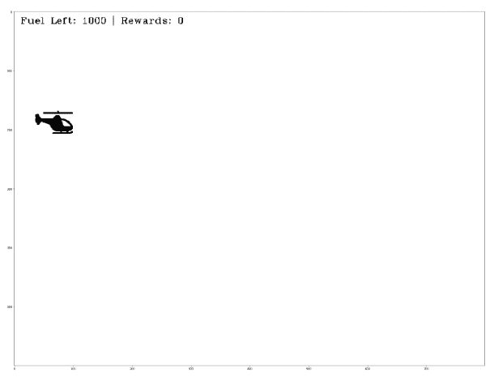
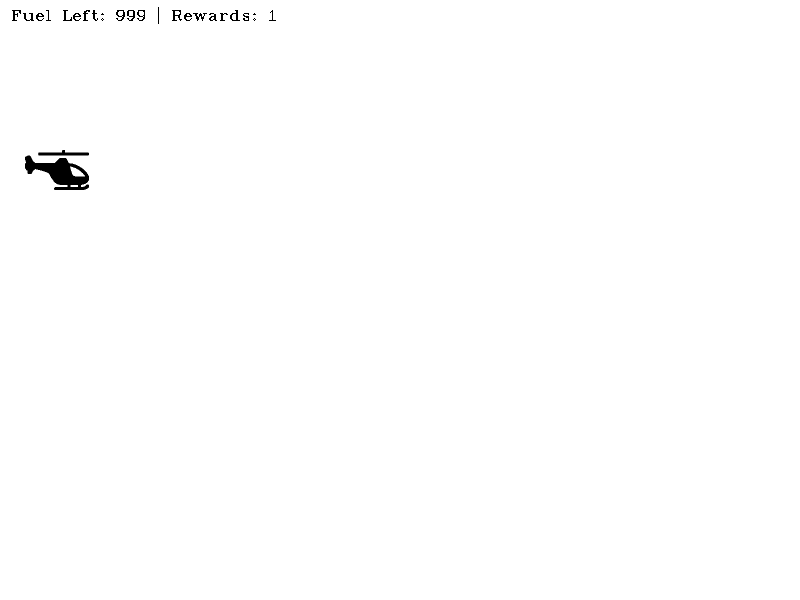

# OpenAI 健身房入门:创建定制健身房环境

> 原文：<https://blog.paperspace.com/creating-custom-environments-openai-gym/>

OpenAI Gym 提供了许多令人敬畏的环境，从经典的控制任务环境到让您训练代理玩 Atari 游戏(如 Breakout、Pacman 和 Seaquest)的环境。然而，您可能仍然有一项任务需要创建一个自定义环境，而这并不是健身房的一部分。幸运的是，Gym 足够灵活，允许你这样做，这正是这篇文章的主题。

在这篇文章中，我们将设计一个定制的环境，包括驾驶一架直升机，同时避开半空中的障碍物。注意，这是开放人工智能健身房系列的第二部分，第一部分介绍的概念知识被认为是这篇文章的先决条件。因此，如果你没有读过第 1 部分，[这里是链接](https://blog.paperspace.com/getting-started-with-openai-gym/)。

你也可以用一个[渐变社区笔记本](https://ml-showcase.paperspace.com/projects/reinforcement-learning)在一个免费的 GPU 上运行本教程中的所有代码。

## 依赖/导入

我们首先从安装一些重要的依赖项开始。

```py
!pip install opencv-python 
!pip install pillow
```

我们也从必要的进口开始。

```py
import numpy as np 
import cv2 
import matplotlib.pyplot as plt
import PIL.Image as Image
import gym
import random

from gym import Env, spaces
import time

font = cv2.FONT_HERSHEY_COMPLEX_SMALL 
```

## 环境描述

我们正在创建的环境基本上是一个受 Dino Run 游戏启发很大的游戏，如果你与互联网断开连接，你可以在 Google Chrome 上玩这个游戏。有一只恐龙，你必须跳过仙人掌，避免撞到鸟。你走过的距离代表了你最终得到的回报。

在我们的游戏中，我们的特工不是恐龙，而是直升机驾驶员。

1.  直升机必须覆盖尽可能多的距离以获得最大的回报。直升机必须避开一些鸟。
2.  如果发生鸟撞，这一集就结束了。如果直升机燃料耗尽，这一集也会终止。
3.  就像鸟一样，有漂浮的油箱(是的，贴近现实没分，我知道！)中，斩波器可以收集这些燃料以给斩波器加满燃料(固定为 1000 升)。

请注意，这将只是一个概念的证明，而不是最美观的游戏。然而，如果你想改进它，这篇文章会给你足够的知识来做到这一点！

设计环境时首先要考虑的是决定我们将使用哪种观察空间和行动空间。

*   观察空间可以是连续的，也可以是离散的。离散动作空间的一个例子是网格世界，其中观察空间由单元定义，代理可以在这些单元中的一个内。连续动作空间的一个例子是代理的位置由实值坐标描述。
*   动作空间可以是连续的，也可以是离散的。离散空间的一个例子是每个动作对应于代理的特定行为，但是该行为不能被量化。这方面的一个例子是[马里奥兄弟](https://blog.paperspace.com/building-double-deep-q-network-super-mario-bros/)，其中每个动作都会导致向左、向右移动、跳跃等。你的行为不能量化正在产生的行为，也就是说，你可以跳，但不能跳得更高、更高或更低。但是，在愤怒的小鸟这样的游戏里，你决定弹弓拉伸多少(你量化)。

### 直升机景观级

我们开始实现环境类`ChopperScape`的`__init__`函数。在`__init__`函数中，我们将定义观察和动作空间。除此之外，我们还将实现其他一些属性:

1.  这代表了我们的观察图像。
2.  这定义了我们屏幕的合法区域，在这里可以放置屏幕的各种元素，比如菜刀和鸟。其他区域用于显示剩余燃料、奖励和填充等信息。
3.  `elements`:存储任何给定时间存储在屏幕上的活动元素(如菜刀、鸟等)。)
4.  `max_fuel`:斩波器能容纳的最大燃油量。

```py
class ChopperScape(Env):
    def __init__(self):
        super(ChopperScape, self).__init__()

        # Define a 2-D observation space
        self.observation_shape = (600, 800, 3)
        self.observation_space = spaces.Box(low = np.zeros(self.observation_shape), 
                                            high = np.ones(self.observation_shape),
                                            dtype = np.float16)

        # Define an action space ranging from 0 to 4
        self.action_space = spaces.Discrete(6,)

        # Create a canvas to render the environment images upon 
        self.canvas = np.ones(self.observation_shape) * 1

        # Define elements present inside the environment
        self.elements = []

        # Maximum fuel chopper can take at once
        self.max_fuel = 1000

        # Permissible area of helicper to be 
        self.y_min = int (self.observation_shape[0] * 0.1)
        self.x_min = 0
        self.y_max = int (self.observation_shape[0] * 0.9)
        self.x_max = self.observation_shape[1] 
```

## 环境要素

一旦我们确定了行动空间和观察空间，我们需要最终确定我们环境的元素。在我们的游戏中，我们有三个不同的元素:直升机、飞鸟和浮动加油站。我们将把所有这些实现为独立的类，它们继承自一个叫做`Point`的公共基类。

### 点基类

`Point`类用于定义我们观察图像上的任意点。我们用以下属性定义这个类:

*   `(x,y)`:点在图像上的位置。
*   `(x_min, x_max, y_min, y_max)`:该点的允许坐标。如果我们试图将点的位置设置在这些限制之外，位置值将被限制在这些限制之内。
*   `name`:点的名称。

我们为此类定义了以下成员函数。

*   `get_position`:获取点的坐标。
*   `set_position`:将点的坐标设置为某个值。
*   `move`:将点移动一定的值。

```py
class Point(object):
    def __init__(self, name, x_max, x_min, y_max, y_min):
        self.x = 0
        self.y = 0
        self.x_min = x_min
        self.x_max = x_max
        self.y_min = y_min
        self.y_max = y_max
        self.name = name

    def set_position(self, x, y):
        self.x = self.clamp(x, self.x_min, self.x_max - self.icon_w)
        self.y = self.clamp(y, self.y_min, self.y_max - self.icon_h)

    def get_position(self):
        return (self.x, self.y)

    def move(self, del_x, del_y):
        self.x += del_x
        self.y += del_y

        self.x = self.clamp(self.x, self.x_min, self.x_max - self.icon_w)
        self.y = self.clamp(self.y, self.y_min, self.y_max - self.icon_h)

    def clamp(self, n, minn, maxn):
        return max(min(maxn, n), minn)
```

现在我们定义类别`Chopper`、`Bird`和`Fuel`。这些类从`Point`类派生而来，并引入了一组新的属性:

*   `icon`:渲染游戏时，观察图像上将显示的点的图标。
*   `(icon_w, icon_h)`:图标的尺寸。

如果您正在查看[渐变笔记本](https://ml-showcase.paperspace.com/projects/reinforcement-learning)，用于图标的图像将随笔记本一起托管。

```py
class Chopper(Point):
    def __init__(self, name, x_max, x_min, y_max, y_min):
        super(Chopper, self).__init__(name, x_max, x_min, y_max, y_min)
        self.icon = cv2.imread("chopper.png") / 255.0
        self.icon_w = 64
        self.icon_h = 64
        self.icon = cv2.resize(self.icon, (self.icon_h, self.icon_w))

class Bird(Point):
    def __init__(self, name, x_max, x_min, y_max, y_min):
        super(Bird, self).__init__(name, x_max, x_min, y_max, y_min)
        self.icon = cv2.imread("bird.png") / 255.0
        self.icon_w = 32
        self.icon_h = 32
        self.icon = cv2.resize(self.icon, (self.icon_h, self.icon_w))

class Fuel(Point):
    def __init__(self, name, x_max, x_min, y_max, y_min):
        super(Fuel, self).__init__(name, x_max, x_min, y_max, y_min)
        self.icon = cv2.imread("fuel.png") / 255.0
        self.icon_w = 32
        self.icon_h = 32
        self.icon = cv2.resize(self.icon, (self.icon_h, self.icon_w)) 
```

## 回到直升机场景类

回想一下第一部分中的内容，任何健身房`Env`都有两个重要的功能:

1.  `reset`:将环境复位到初始状态，返回初始观察。
2.  `step`:通过应用一个动作来执行环境中的一个步骤。返回新的观察、奖励、完成状态和其他信息。

在这一节中，我们将实现环境中的`reset`和`step`函数以及许多其他辅助函数。我们从`reset`功能开始。

### 重置功能

当我们重置环境时，我们需要重置环境中所有基于状态的变量。这些因素包括消耗的燃料、阶段性回报以及环境中存在的元素。

在我们的例子中，当我们重置环境时，除了初始状态的斩波器，我们什么都没有。我们在图像左上角的区域随机初始化我们的斩波器。该区域占图像宽度的 5-10%，占图像高度的 15-20%。

我们还定义了一个名为`draw_elements_on_canvas`的辅助函数，它基本上将游戏中出现的每个元素的图标放在观察图像中它们各自的位置上。如果位置超出允许的范围，则图标被放置在范围边界上。我们还打印剩余燃料等重要信息。

我们最后返回放置元素的画布作为观察。

```py
%%add_to ChopperScape

def draw_elements_on_canvas(self):
    # Init the canvas 
    self.canvas = np.ones(self.observation_shape) * 1

    # Draw the heliopter on canvas
    for elem in self.elements:
        elem_shape = elem.icon.shape
        x,y = elem.x, elem.y
        self.canvas[y : y + elem_shape[1], x:x + elem_shape[0]] = elem.icon

    text = 'Fuel Left: {} | Rewards: {}'.format(self.fuel_left, self.ep_return)

    # Put the info on canvas 
    self.canvas = cv2.putText(self.canvas, text, (10,20), font,  
               0.8, (0,0,0), 1, cv2.LINE_AA)

def reset(self):
    # Reset the fuel consumed
    self.fuel_left = self.max_fuel

    # Reset the reward
    self.ep_return  = 0

    # Number of birds
    self.bird_count = 0
    self.fuel_count = 0

    # Determine a place to intialise the chopper in
    x = random.randrange(int(self.observation_shape[0] * 0.05), int(self.observation_shape[0] * 0.10))
    y = random.randrange(int(self.observation_shape[1] * 0.15), int(self.observation_shape[1] * 0.20))

    # Intialise the chopper
    self.chopper = Chopper("chopper", self.x_max, self.x_min, self.y_max, self.y_min)
    self.chopper.set_position(x,y)

    # Intialise the elements 
    self.elements = [self.chopper]

    # Reset the Canvas 
    self.canvas = np.ones(self.observation_shape) * 1

    # Draw elements on the canvas
    self.draw_elements_on_canvas()

    # return the observation
    return self.canvas 
```

在我们继续下一步之前，让我们看看我们最初的观察是什么样子的。

```py
env = ChopperScape()
obs = env.reset()
plt.imshow(obs) 
```


因为我们的观察和游戏的游戏画面是一样的，我们的渲染函数也应该返回我们的观察。我们为两种模式构建功能，一种是在弹出窗口中呈现游戏的`human`，而`rgb_array`以像素数组的形式返回游戏。

```py
%%add_to ChopperScape

def render(self, mode = "human"):
    assert mode in ["human", "rgb_array"], "Invalid mode, must be either \"human\" or \"rgb_array\""
    if mode == "human":
        cv2.imshow("Game", self.canvas)
        cv2.waitKey(10)

    elif mode == "rgb_array":
        return self.canvas

def close(self):
    cv2.destroyAllWindows()

env = ChopperScape()
obs = env.reset()
screen = env.render(mode = "rgb_array")
plt.imshow(screen) 
```



### 阶跃函数

现在我们已经有了`reset`函数，我们开始实现`step`函数，它将包含给定动作时将我们的环境从一个状态转换到下一个状态的代码。在许多方面，这部分是众所周知的我们环境的一部分，这也是大部分计划进行的地方。

我们首先需要列出在环境的一个过渡步骤中需要发生的事情。这基本上可以分为两个部分:

1.  对我们的代理采取行动。
2.  环境中发生的所有其他事情，例如非 RL 参与者的行为(例如鸟类和浮动加油站)。

所以我们先来关注一下(1)。我们为游戏提供动作来控制我们的直升机做什么。我们基本上有 5 个动作，分别是向右、向左、向下、向上移动或什么都不做，分别用 0、1、2、3 和 4 表示。

我们定义了一个名为`get_action_meanings()`的成员函数，它会告诉我们每个动作被映射到哪个整数，以供我们参考。

```py
%%add_to ChopperScape

def get_action_meanings(self):
    return {0: "Right", 1: "Left", 2: "Down", 3: "Up", 4: "Do Nothing"}
```

我们还通过检查被传递的动作是否出现在动作空间中来验证它是否是有效的动作。如果不是，我们提出一个断言。

```py
# Assert that it is a valid action 
assert self.action_space.contains(action), "Invalid Action"
```

完成后，我们使用之前定义的`move`功能相应地改变斩波器的位置。每个动作导致在各自方向上移动 5 个坐标。

```py
# apply the action to the chopper
if action == 0:
    self.chopper.move(0,5)
elif action == 1:
    self.chopper.move(0,-5)
elif action == 2:
    self.chopper.move(5,0)
elif action == 3:
    self.chopper.move(-5,0)
elif action == 4:
    self.chopper.move(0,0)
```

既然我们已经将动作应用到了直升机上，那么我们将重点放在环境的其他元素上:

*   鸟类从屏幕的右边缘随机产卵，概率为 1%(即一只鸟很可能每一百帧出现在右边缘一次)。这只鸟每帧向左移动 5 个坐标点。如果他们击中直升机，游戏结束。否则，一旦到达左边缘，它们就会从游戏中消失。
*   燃料箱从屏幕的底部边缘随机产生，概率为 1 %(即燃料箱很可能每一百帧在底部边缘出现一次)。这只鸟每帧向上移动 5 个坐标。如果他们撞上了直升机，直升机就会加满油。否则，一旦到达顶部边缘，它们就会从游戏中消失。

为了实现上面概述的特性，我们需要实现一个助手函数来帮助我们确定两个`Point`物体(比如一架直升机/鸟，直升机/油箱)是否发生了碰撞。我们如何定义碰撞？当两个点的中心坐标之间的距离小于它们的维度之和的一半时，我们说这两个点发生了碰撞。我们称这个函数为`has_collided`。

```py
%%add_to ChopperScape

def has_collided(self, elem1, elem2):
    x_col = False
    y_col = False

    elem1_x, elem1_y = elem1.get_position()
    elem2_x, elem2_y = elem2.get_position()

    if 2 * abs(elem1_x - elem2_x) <= (elem1.icon_w + elem2.icon_w):
        x_col = True

    if 2 * abs(elem1_y - elem2_y) <= (elem1.icon_h + elem2.icon_h):
        y_col = True

    if x_col and y_col:
        return True

    return False
```

除此之外，我们还得做一些簿记工作。每一步的回报是 1，因此，每集的情节返回计数器都更新 1。如果有碰撞，奖励-10，剧集终止。燃油计数器每减少一步就减少 1。

最后，我们实现我们的`step`函数。我写了大量的评论来指导你。

```py
%%add_to ChopperScape

def step(self, action):
    # Flag that marks the termination of an episode
    done = False

    # Assert that it is a valid action 
    assert self.action_space.contains(action), "Invalid Action"

    # Decrease the fuel counter 
    self.fuel_left -= 1 

    # Reward for executing a step.
    reward = 1      

    # apply the action to the chopper
    if action == 0:
        self.chopper.move(0,5)
    elif action == 1:
        self.chopper.move(0,-5)
    elif action == 2:
        self.chopper.move(5,0)
    elif action == 3:
        self.chopper.move(-5,0)
    elif action == 4:
        self.chopper.move(0,0)

    # Spawn a bird at the right edge with prob 0.01
    if random.random() < 0.01:

        # Spawn a bird
        spawned_bird = Bird("bird_{}".format(self.bird_count), self.x_max, self.x_min, self.y_max, self.y_min)
        self.bird_count += 1

        # Compute the x,y co-ordinates of the position from where the bird has to be spawned
        # Horizontally, the position is on the right edge and vertically, the height is randomly 
        # sampled from the set of permissible values
        bird_x = self.x_max 
        bird_y = random.randrange(self.y_min, self.y_max)
        spawned_bird.set_position(self.x_max, bird_y)

        # Append the spawned bird to the elements currently present in Env. 
        self.elements.append(spawned_bird)    

    # Spawn a fuel at the bottom edge with prob 0.01
    if random.random() < 0.01:
        # Spawn a fuel tank
        spawned_fuel = Fuel("fuel_{}".format(self.bird_count), self.x_max, self.x_min, self.y_max, self.y_min)
        self.fuel_count += 1

        # Compute the x,y co-ordinates of the position from where the fuel tank has to be spawned
        # Horizontally, the position is randomly chosen from the list of permissible values and 
        # vertically, the position is on the bottom edge
        fuel_x = random.randrange(self.x_min, self.x_max)
        fuel_y = self.y_max
        spawned_fuel.set_position(fuel_x, fuel_y)

        # Append the spawned fuel tank to the elemetns currently present in the Env.
        self.elements.append(spawned_fuel)   

    # For elements in the Ev
    for elem in self.elements:
        if isinstance(elem, Bird):
            # If the bird has reached the left edge, remove it from the Env
            if elem.get_position()[0] <= self.x_min:
                self.elements.remove(elem)
            else:
                # Move the bird left by 5 pts.
                elem.move(-5,0)

            # If the bird has collided.
            if self.has_collided(self.chopper, elem):
                # Conclude the episode and remove the chopper from the Env.
                done = True
                reward = -10
                self.elements.remove(self.chopper)

        if isinstance(elem, Fuel):
            # If the fuel tank has reached the top, remove it from the Env
            if elem.get_position()[1] <= self.y_min:
                self.elements.remove(elem)
            else:
                # Move the Tank up by 5 pts.
                elem.move(0, -5)

            # If the fuel tank has collided with the chopper.
            if self.has_collided(self.chopper, elem):
                # Remove the fuel tank from the env.
                self.elements.remove(elem)

                # Fill the fuel tank of the chopper to full.
                self.fuel_left = self.max_fuel

    # Increment the episodic return
    self.ep_return += 1

    # Draw elements on the canvas
    self.draw_elements_on_canvas()

    # If out of fuel, end the episode.
    if self.fuel_left == 0:
        done = True

    return self.canvas, reward, done, []
```

## 看到它的实际应用

我们环境的代码到此结束。现在，使用一个采取随机行动的代理在环境中执行一些步骤！

```py
from IPython import display

env = ChopperScape()
obs = env.reset()

while True:
    # Take a random action
    action = env.action_space.sample()
    obs, reward, done, info = env.step(action)

    # Render the game
	env.render()

    if done == True:
        break

env.close()
```



Rendering the Environment

## 结论

各位，这部分到此为止。我希望这篇教程能让你对设计一个定制的 OpenAI 环境的一些考虑和设计决策有所了解。你现在可以试着创造一个你自己选择的环境，或者如果你愿意，你可以对我们刚刚为练习设计的环境做一些改进。一些现成的建议是:

1.  你可以为直升机设定多重生命，而不是在第一次撞鸟时就结束。
2.  设计一个邪恶的变异鸟类外星种族，它们也能够向直升机发射导弹，直升机必须避开它们。
3.  做点什么当油箱和鸟相撞的时候！

有了这些建议，就结束了。编码快乐！