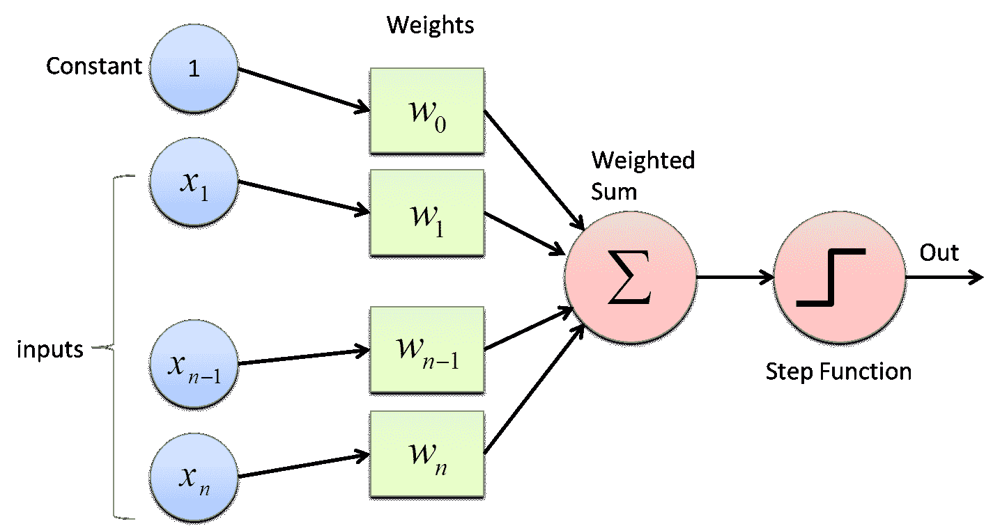
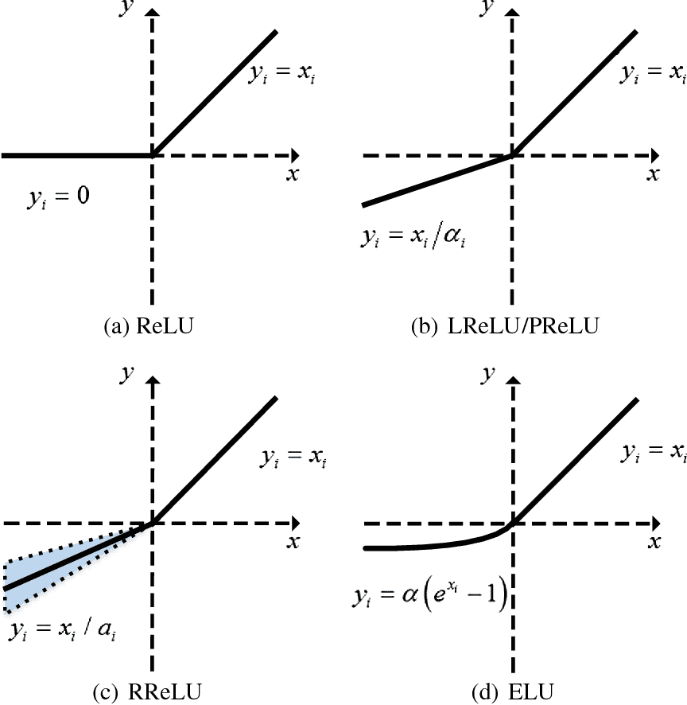
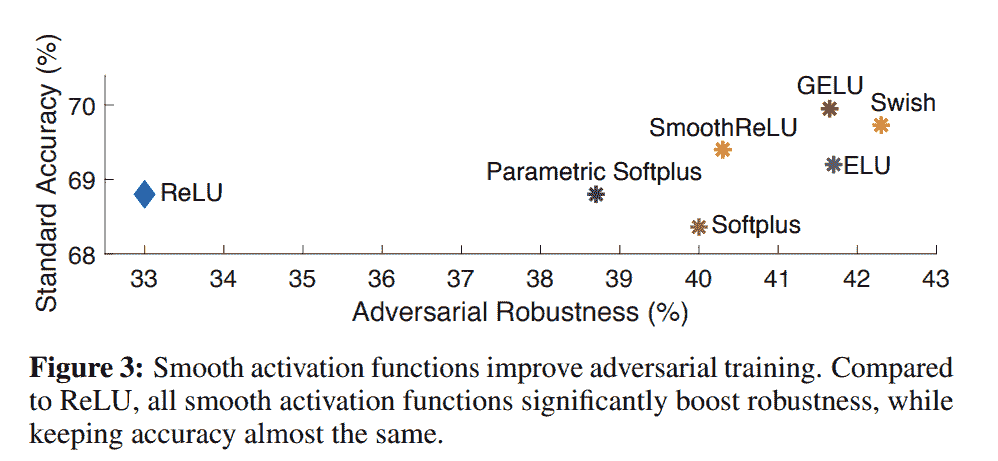
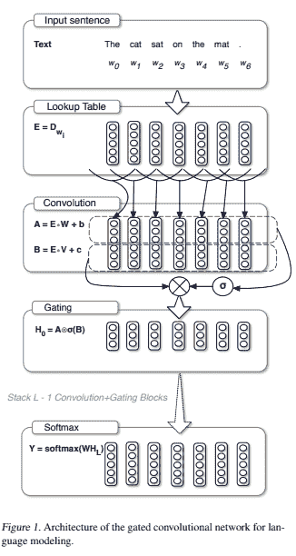
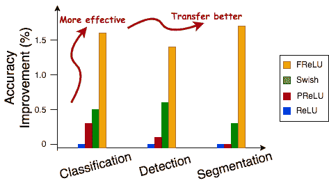
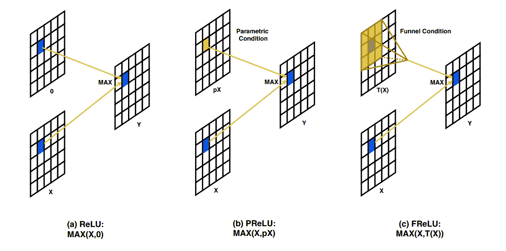
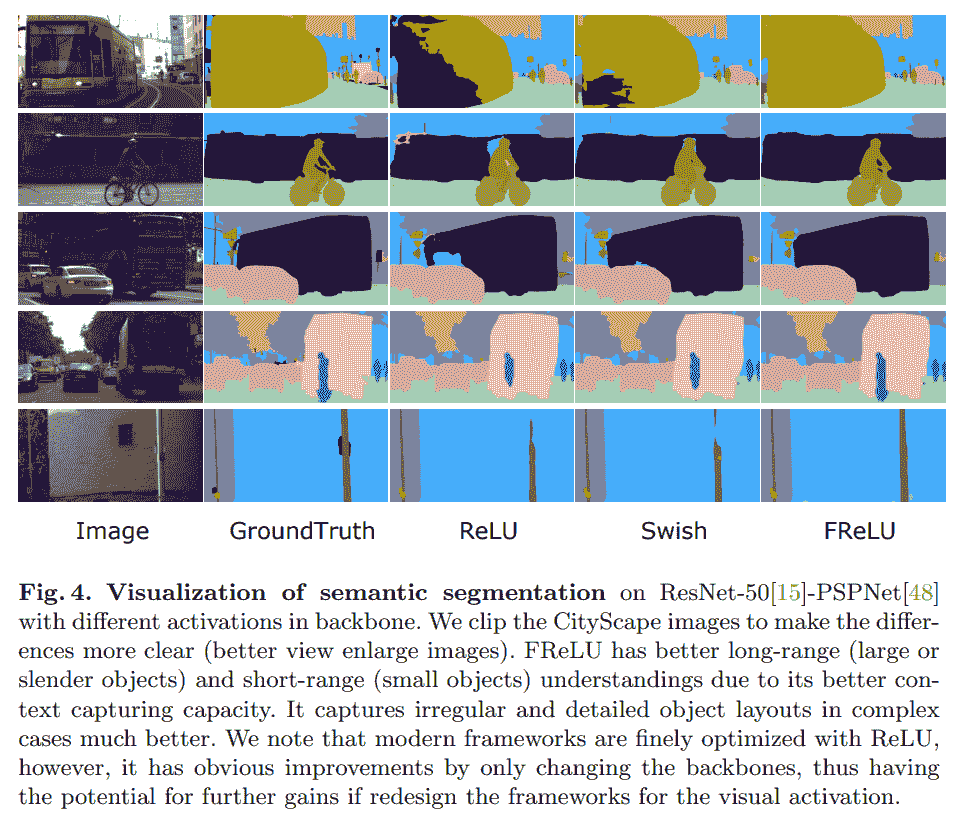

# 论文综述:视觉识别的漏斗激活(ECCV 2020)

> 原文：<https://blog.paperspace.com/funnel-activation/>

近年来，计算机视觉中基于组件的研究已经显著加速，特别是随着对抗性攻击和注意机制的出现。在最近一段时间内广泛复兴的主要组件之一是非线性变换层，称为*激活函数*。虽然激活函数在当前研究领域的大格局中可能被认为有些微不足道，但它们对深度学习所有领域中现代神经网络的训练动力学的贡献是巨大的，不可否认的。

在本帖中，我们将对最近在 2020 年[(ECCV)](https://eccv2020.eu/)第 16 届欧洲计算机视觉大会上公布的一种激活函数形式进行深入分析。标题为“用于视觉识别的[漏斗激活](https://arxiv.org/pdf/2007.11824.pdf)”的论文介绍了被称为 FReLU 的校正非线性家族中的新激活。

本文分为四个部分。首先，我们将简要回顾激活函数，特别是校正的非线性函数族。接下来，我们将深入到小说 FReLU，以及论文背后的直觉和理论。此外，我们将讨论论文中提出的结果，并通过分析该想法的潜在缺点以及需要改进或进一步研究的领域来得出结论。

您可以在 [ML Showcase](https://ml-showcase.paperspace.com/projects/funnel-activation-frelu) 上免费运行本文的相关代码。

# 目录:

*   激活功能
*   ReLU 家庭
*   非线性的最新进展
*   漏斗激活
*   密码
*   结果
*   缺点
*   参考

## 激活功能

激活函数是神经网络训练动力学中的一个关键因素。它们用于在网络中引入非线性的目的。这一切都始于感知器中一个简单的阶跃函数，阶跃函数的输出是二进制的(1 或 0)。这给出了一个概念，即由之前的神经元传播的信息是否足够重要，足以激发/激活该神经元(想象它类似于开关)。然而，这造成了巨大的信息损失，并很快被一种更平滑的替代方法所取代，这种方法有助于梯度反向传播:sigmoid 函数。



General representation of a Perceptron

后来，在 2010 年发表论文“[整流线性单元改进受限玻尔兹曼机器](https://www.cs.toronto.edu/~fritz/absps/reluICML.pdf)”之后，整流线性单元(ReLU)的使用变得更加标准化。十年过去了，已经出现了无数新形式的激活函数，然而，由于它们在不同深度学习任务中的通用性及其计算效率，ReLU 仍然占据着至高无上的地位。

在理解激活函数的重要性方面的最新进展导致了对更平滑的变体的探索，这些变体提高了深度神经网络的泛化能力和鲁棒性。一些最突出的例子包括:

1.  Swish ( [搜索激活功能](https://arxiv.org/abs/1710.05941)
2.  GELU ( [高斯误差线性单位](https://arxiv.org/abs/1606.08415)
3.  Mish ( [Mish:自正则化的非单调激活函数](https://arxiv.org/abs/1908.08681)

## ReLU 家庭

如前一节所述，ReLU 一直是大多数深度学习或机器学习实践者和研究人员长期以来忠实的非线性。然而，ReLU 有一些明显的缺点，这些缺点已由不同形式的 ReLU 解决，如泄漏 ReLU 和 PReLU。我们将在 ReLU 系列中包括这些激活函数，因为它们都具有分段线性函数的形式，与标准 ReLU 相比，函数的负半部分明显不同。



The ReLU family

首先，让我们了解一下 ReLU 的缺点。ReLU 是一个形式为$y(x) = \max(0，x)$的简单分段线性函数。因此，它将输入信号的所有负分量阈值设置为零。这导致潜在有用信息的大量丢失。虽然使用 ReLU 还有其他缺点，但我们将只使用 thresholding 属性来建立我们对 FReLU 的讨论，因为它已经成为其他形式的 ReLU 的基本动机。

为了解决这个问题，Leaky ReLU 作为一个潜在的解决方案被引入。Leaky ReLU 通过将输入信号的负分量调制一个小的预先确定的标量值，表示为$\alpha$(通常为 0.01)，引入了一个非零的负半函数。因此，该函数采用$\max(\alpha x，x)$的形式。虽然这被证明是成功的，但使用预定义值来调节函数负半部分的斜率背后的直觉让位于一种更基本正确、可学习的泄漏 ReLU 形式，称为参数 ReLU (PReLU)。

PReLU 和 Leaky ReLU 的函数形式是相同的，但是，唯一的警告是$\alpha$现在是一个可学习的参数，而不是预定义的。因此，这有助于网络学习函数负半部分的稳定且良好的斜率，并消除硬编码的差异。这将构成理解 FReLU 动机的基础。

在这篇评论文章的范围内，我们不会涉及 ReLU 家族中的其他激活函数，如 RReLU、Smooth ReLU、eLU 等。

## 非线性的最新进展

激活函数的作用最近也已经扩展到包括神经网络的对抗鲁棒性，更平滑的激活函数提供了比配备有例如 vanilla ReLU 的相同网络更好的鲁棒性。最近一篇名为[平稳对抗训练](https://arxiv.org/abs/2006.14536)的论文对此进行了探讨。



平滑函数主要是从逐点标量变换的角度进行研究的，其中最成功和最流行的选项是将现有函数组合成一个复合结构，以形成更平滑的替代函数，如 mish($ f(x)= x\tanh(\log(1+e^{x}))$)和 Swish ( $f(x)=xsigmoid(\beta x)$)。

然而，也有其他方面的探索。让我们使用本文使用的确切术语对这些类型做一个简短的案例研究。

### 上下文条件激活

顾名思义，上下文条件激活是那些受上下文制约的非线性转换，因此是多对一的函数。这种类型的激活函数的一个最突出的例子是 [Maxout 函数](https://arxiv.org/pdf/1302.4389.pdf)。定义为$max(\omega_{1}^{t}x+b_{1},\omega_{2}^{t}x+b _ { 2 })$，它基本上使层成为双/多分支结构，并选择两者的最大子节点，不像其他点态标量激活函数直接应用于权重和输入的点积，表示为:$\psi(x)=f(\omega^{T}x + b)$。因此，最大输出网络将 ReLU 和泄漏 ReLU/ PReLU 结构合并到同一框架中。

### 选通

这些激活主要是由使用门控卷积网络的[语言建模引入的，主要是复合函数或乘积函数，其中一个子函数由输入的另一个函数变换或原始输入本身门控。](https://arxiv.org/pdf/1612.08083.pdf)



如图所示，在基于 RNN 的结构中，卷积后的激活函数有两组输入，表示为 a 和 b。这里选择的激活是 sigmoid，表示为$\sigma(x) = \frac{1}{1+e^{-x}}$.因此，门控激活的形式为$ H _ { 0 } = A \ bigo times \ sigma(B)$ 1。因此，这里的激活$\sigma(B)$由 a 门控。门控的思想后来通过[用于强化学习中神经网络函数近似的 Sigmoid 加权线性单元](https://arxiv.org/abs/1702.03118)扩展到视觉，其中作者引入了 Sigmoid 加权线性单元(路斯)，它可以近似为$f(x)=xsigmoid(x)$。这里唯一的变化是，不是不同的输入用于选通，而是传递给非线性函数的相同输入用作选通。这种形式的门控被恰当地命名为“自门控”。这后来通过[搜索激活函数](https://arxiv.org/abs/1710.05941)得到了验证，作者使用 NAS 方法找到了定义为$f(x) = xsigmoid(\beta x)$的 Swish。这基本上以$\beta$的形式引入了一个简单的可训练参数，以在训练过程中增加更多的灵活性和适应性。

自门控的思想可以在与跳跃连接的作用相关的非常抽象的层面上，其中非调制输入被用作卷积层块的输出的受控更新。跳跃连接形成残差网络的基础，并且已经明显证明跳跃连接使得网络的优化轮廓更加平滑，因此更容易优化，并且导致更好的泛化和改进的鲁棒性。

还有更多最近提出的采用自门控的平滑激活函数的例子，如:

1.  GELU ( [高斯误差线性单位](https://arxiv.org/abs/1606.08415)):$ f(x)= x \ frac { 1 } { 2 }[1+ERF(x/\ sqrt { 2 })]$
2.  Mish ( [Mish:一个自正则化的非单调激活函数](https://arxiv.org/abs/1908.08681)):$ f(x)= x \ tanh(soft plus(x))$

继续上下文条件激活函数，这些在基于 RNN 的结构中更相关，因为序列长度与图像域中的输入空间相比要小得多，在图像域中， *B × C × H × W* 维的 4-D 张量可以具有大量的输入数据点。这就是为什么大多数上下文相关的激活函数只受通道相关的。然而，作者认为空间条件作用与通道适应性条件作用同等重要。为了满足不断增长的计算需求，FReLU 在默认情况下集成了 3×3 窗口大小的深度可分离卷积核(DWConv ),这在参数和触发器方面非常便宜。

### 空间依赖性建模

尽管空间自适应激活函数在早期没有被详细研究过，但是引入空间自适应建模的目标并不是新的，也不是从激活函数中派生出来的。空间依赖性建模的目标更多地是在注意力机制的背景下讨论的，其中捕获长距离依赖性是至关重要的。例如，全球背景网络(GCNet)(参见 [GCNet:非局域网络满足挤压激励网络和超越](https://arxiv.org/abs/1904.11492))，一种非局域网络(NLNet)(参见[非局域神经网络](https://arxiv.org/abs/1711.07971))使用一种通道注意力的变体来捕捉长期依赖性。

此外，为了捕捉非线性空间相关性，在不同的范围，不同大小的卷积核被用于聚集特征表示。但是，这样做效率不高，因为它增加了更多的参数和操作。相比之下，FReLU 通过引入一种廉价的模块来解决这些问题，该模块允许在捕捉空间依赖性的同时计算激活，并且不引入任何附加模块。

随后，FReLU 能够通过使用简单有效的 DWConv 使用自适应感受野来对单个像素应用非线性变换，而不是使用复杂的卷积算子来根据输入引入可变感受野，这已知可以提高深度卷积神经网络(CNN)的性能。

由于具备所有这些特性，FReLU 能够在图像识别和迁移学习的不同领域中始终比其他激活函数表现得更好，如下面的图表所示:



## 漏斗激活



如前所述，ReLU 是一个分段线性函数。但是，它可以解释为应用于输入的每个点(像素)的条件逐点标量操作。该条件是一个最大值函数，两个操作数是问题中的像素和零。因此，每个负值点都变为零。

为了解决这个问题，并使泄漏 ReLU 更强大，引入了参数 ReLU (PReLU)。PReLU 旨在保持相同的条件运算，除了比较值是参数缩放输入的值，其中标量参数是在训练期间学习的。如上所述，本质上，在计算给定像素 x 的激活时，使用最大运算将其与由可学习标量值$\alpha$缩放的相同像素进行比较。因此，这有助于保留负面信息和减少信息损失，并通过神经网络的深度改善信号传播。

这样做的缺点是可学习的标量$\alpha$与输入的上下文表示脱节。这就是 FReLU，或漏斗激活，提供了一个简单的修复方法。它不是学习单个固定标量值，而是学习目标像素周围局部邻域的聚合表示，并将其用作 max 运算中的比较值。本地上下文的这种学习到的聚集表示被表示为被定义为$\mathbb{T}(x)$的函数。因此，FReLU 的等式变成$f(x) = \max(x，\mathbb{T}(x))$了。空间条件依赖函数$\mathbb{T}(x)$被定义为参数池窗口，大小为$k *×* k$，并且总是以目标像素为中心。

函数形式的参数池窗口在数学上可以定义为:

$\mathbb{t}(x_{c,i,j}^{\omega})= x_{c,i,j}^{\omega} \ x_{c}^{\omega}$

其中 *c* 表示该像素的通道索引； *i，j* 表示该通道中该像素的空间坐标；并且 *p* 是每个通道的那个窗口的系数 *c* 。因此，参数池窗口函数本质上是输入与系数的逐通道点积。

作者使用高斯初始化来初始化系数，以具有初始条件来保持值接近于零。这近似于 ReLU，因为$ \ mathbb { T }(x)\ approximate 0 $近似于$\max(x，0)$这是 ReLU 的定义。作者在他们的论文中报告说，他们研究了非参数的聚集方法，如平均池和最大池。他们观察到性能比参数形式相对更差，因此通过涉及聚合的参数形式来证明模型权重的增加是合理的。

因此，简而言之，参数池窗口本质上是由大小 *k × k* 定义的深度卷积核，其中 k 默认设置为 3。随后是批处理规范化层。因此，对于维数为 *C × H × W* 的输入张量，FReLU 引入的额外参数的量等于 *C × k × k* ，并且由于 k < < < C，引入的额外复杂度的顺序等于输入张量中的通道数。

## 密码

作者提供了基于 [MegEngine 框架](https://megengine.org.cn/)的 FReLU 的官方实现[。](https://github.com/megvii-model/FunnelAct)

您还可以从 [ML Showcase](https://ml-showcase.paperspace.com/projects/funnel-activation-frelu) 中免费运行与本文相关的 Jupyter 笔记本。

##### 原始实现

```py
"""
To install megengine, use the following command in your terminal:
pip3 install megengine -f https://megengine.org.cn/whl/mge.html
Or if on Google Colab then:
!pip3 install megengine -f https://megengine.org.cn/whl/mge.html
"""
import megengine.functional as F
import megengine.module as M

class FReLU(M.Module):
    r""" FReLU formulation. The funnel condition has a window size of kxk. (k=3 by default)
    """
    def __init__(self, in_channels):
        super().__init__()
        self.conv_frelu = M.Conv2d(in_channels, in_channels, 3, 1, 1, groups=in_channels)
        self.bn_frelu = M.BatchNorm2d(in_channels)

    def forward(self, x):
        x1 = self.conv_frelu(x)
        x1 = self.bn_frelu(x1)
        x = F.maximum(x, x1)
        return x 
```

##### PyTorch 实现

```py
import torch
import torch.nn as nn

class FReLU(nn.Module):
    r""" FReLU formulation. The funnel condition has a window size of kxk. (k=3 by default)
    """
    def __init__(self, in_channels):
        super().__init__()
        self.conv_frelu = nn.Conv2d(in_channels, in_channels, 3, 1, 1, groups=in_channels)
        self.bn_frelu = nn.BatchNorm2d(in_channels)

    def forward(self, x):
        x1 = self.conv_frelu(x)
        x1 = self.bn_frelu(x1)
        x = torch.max(x, x1)
        return x 
```

注意:您可以将内核大小增加到大于 3，但是，您必须相应地增加填充以保持卷积的空间和深度保持性。

## 结果

在看 FReLU 的对比结果之前，我们先来看看作者进行的消融研究。作者们在探索寻找 FReLU 的最佳形式时不遗余力。我们将对条件类型、标准模型和层中 FReLU 的兼容性、使用的标准化类型等进行实验。

| 模型 | 激活 | 头号错误 |
| --- | --- | --- |
| A | Max(x，ParamPool(x)) | **22.4** |
| B | Max(x，MaxPool(x)) | Twenty-four point four |
| C | Max(x, AvgPool(x)) | Twenty-four point five |
|  |  |  |
| A | Max(x，ParamPool(x)) | **22.4** |
| D | Sum(x，ParamPool(x)) | Twenty-three point six |
| E | 最大(DW(x)，0) | Twenty-three point seven |

在这里，作者验证了参数池窗口$\mathbb{T}(x)$的重要性，他们将它用作条件。在模型 B 和 C 中，它们分别用 MaxPool 和 Average Pool 替换了参数池窗口。此外，在模型 D 中，他们用求和运算代替最大运算，以模拟类似于跳过连接的形式。最后，在模型 E 中，他们使用由表示为 DW 的深度方向可分离卷积核计算的上下文条件作为 ReLU 的操作数。他们使用 ImageNet-1k 数据集上的 ResNet-50 主干来验证这些设置，并确认参数池窗口在图像分类任务中的错误率方面优于其他变体。

| 正常化 | 头号错误 |
| --- | --- |
| 没有正常化 | Thirty-seven point six |
| 批量标准化 | Thirty-seven point one |
| 图层规范化 | **36.5** |
| 实例规范化 | Thirty-eight |
| 群体规范化 | **36.5** |

作者在计算 FReLU 中的空间条件时试验了不同的标准化层。注意:这不包括没有 FReLU 的模型中已经存在的默认批处理规范化层。在这个实验中，他们使用 ShuffleNet v2 网络来完成 ImageNet-1k 分类任务。尽管作者发现层标准化和组标准化实现了最低的误差，但是他们使用批量标准化，因为它对推断速度没有任何影响。这个问题是在他们的官方知识库的[这一期](https://github.com/megvii-model/FunnelAct/issues/7)中提出的，在那里作者指出[这篇文章](https://towardsdatascience.com/speed-up-inference-with-batch-normalization-folding-8a45a83a89d8)进一步阐明了规范化层对推理速度的影响。

| 模型 | 窗口大小 | 头号错误 |
| --- | --- | --- |
| A | 1×1 | Twenty-three point seven |
| B | 3×3 | **22.4** |
| C | 5×5 | Twenty-two point nine |
| D | 7×7 | Twenty-three |
| E | 总和(1×3，3×1) | Twenty-two point six |
| F | 最大值(1×3，3×1) | **22.4** |

作者进一步对不同的核大小进行了实验，从大小为 1 × 1 的逐点卷积开始，到使用 sum 和 max 函数聚集水平和垂直滑动窗口。他们发现，对于 ImageNet-1k 分类任务上的 ResNet-50，3 × 3 的内核大小表现最佳。

| 第二阶段 | 第 3 阶段 | 第四阶段 | 头号错误 |
| --- | --- | --- | --- |
| -好的 |  |  | Twenty-three point one |
|  | -好的 |  | Twenty-three |
|  |  | -好的 | Twenty-three point three |
| -好的 | -好的 |  | Twenty-two point eight |
|  | -好的 | -好的 | Twenty-three |
| -好的 | -好的 | -好的 | **22.4** |

ResNet 被定义为总共 4 个阶段的模型。每一级包含预定义数量的包含卷积层的瓶颈/基本块。作者验证了在每个阶段添加 FReLU 和替换现有 ReLU 层的重要性。如上表所示，在使用 ResNet-50 网络的 ImageNet-1k 分类任务中，FReLU 在所有阶段都表现最佳。

|  | 1×1 conv。 | 3×3 conv。 | 头号错误 |
| --- | --- | --- | --- |
| ResNet-50 | -好的 |  | Twenty-two point nine |
| ResNet-50 |  | -好的 | Twenty-three |
| ResNet-50 | -好的 | -好的 | **22.4** |
|  |  |  |  |
| MobileNet | -好的 |  | Twenty-nine point two |
| MobileNet |  | -好的 | Twenty-nine |
| MobileNet | -好的 | -好的 | **28.5** |

为了了解层兼容性，作者观察了在 MobileNet 和 ResNet-50 的瓶颈结构中用 1×1 卷积层、3×3 卷积层以及 1×1 和 3×3 卷积层替换 ReLU 的性能。根据上表，用 FReLU 替换所有 ReLU 的性能优于其他配置。注意:通常 1×1 卷积层被称为通道卷积，因为它们负责改变输入张量的通道维度，而 3×3 卷积层被称为空间卷积层，因为它们通常不改变输入的通道维度。相反，它们负责改变输入的空间维度。

| 模型 | 参数数量(百万) | 拖鞋 | 头号错误 |
| --- | --- | --- | --- |
| 热卢 | **25.5 米** | **3.9 克** | Twenty-four |
| 弗雷卢 | 25.5 米 | 3.9 克 | Twenty-two point four |
| 拒绝 | 26.7 米 | 3.9 克 | Twenty-two point eight |
| FReLU+SE | 26.7 米 | 3.9 克 | **22.1** |

此外，作者验证了 FReLU 与其他即插即用准确性提高方法的兼容性，例如，注意机制。这里选择的模块是挤压和激发(SE)模块，这是一种通道注意方法。作者验证了使用 SE 和 FReLU 提供了最佳的比较性能。

注意:我们已经在计算机视觉系列的注意力机制中讨论了挤压和激励网络。你可以在这里阅读[。](https://blog.paperspace.com/channel-attention-squeeze-and-excitation-networks/)

现在来看看 ImageNet 分类和语义分割的比较基准。

### resnets 上的 imagenes 基准测试

| 模型 | 激活 | 参数数量(百万) | 拖鞋 | 头号错误 |
| --- | --- | --- | --- | --- |
| ResNet-50 | 热卢 | **25.5 米** | **3.86 克** | Twenty-four |
| ResNet-50 | 普雷卢 | 25.5 米 | 3.86 克 | Twenty-three point seven |
| ResNet-50 | 嗖嗖 | 25.5 米 | 3.86 克 | Twenty-three point five |
| ResNet-50 | 弗雷卢 | 25.5 米 | 3.87 克 | **22.4** |
|  |  |  |  |  |
| ResNet-101 | 热卢 | **44.4 米** | **7.6G** | Twenty-two point eight |
| ResNet-101 | 普雷卢 | 44.4 米 | 7.6 克 | Twenty-two point seven |
| ResNet-101 | 嗖嗖 | 44.4 米 | 7.6 克 | Twenty-two point seven |
| ResNet-101 | 弗雷卢 | 44.5 米 | 7.6 克 | **22.1** |

### 轻量级移动架构的 imagenes 基准测试

| 模型 | 激活 | 参数数量(百万) | 拖鞋 | 头号错误 |
| --- | --- | --- | --- | --- |
| MobileNet 0.75 | 热卢 | **2.5 米** | **325 米** | Twenty-nine point eight |
| MobileNet 0.75 | 普雷卢 | 250 万 | 325 米 | Twenty-nine point six |
| MobileNet 0.75 | 嗖嗖 | 250 万 | 325 米 | Twenty-eight point nine |
| MobileNet 0.75 | 弗雷卢 | 250 万 | 328 米 | **28.5** |
|  |  |  |  |  |
| ShuffleNetV2 | 热卢 | **1.4 米** | **41M** | Thirty-nine point six |
| ShuffleNetV2 | 普雷卢 | 1.4 米 | 41 米 | Thirty-nine point one |
| ShuffleNetV2 | 嗖嗖 | 1.4 米 | 41 米 | Thirty-eight point seven |
| ShuffleNetV2 | 弗雷卢 | 1.4 米 | 45 米 | **37.1** |

### MS-COCO 上使用 RetinaNet 检测器的对象检测基准

| 模型 | 激活 | 参数数量(百万) | 拖鞋 | 地图 | AP[50] | 美联社[75] | 美联社[s] | 米 | AP[l] |
| --- | --- | --- | --- | --- | --- | --- | --- | --- | --- |
| ResNet-50 | 热卢 | **25.5 米** | **3.86 克** | Thirty-five point two | Fifty-three point seven | Thirty-seven point five | Eighteen point eight | Thirty-nine point seven | Forty-eight point eight |
| ResNet-50 | 嗖嗖 | 25.5 米 | 3.86 克 | Thirty-five point eight | Fifty-four point one | Thirty-eight point seven | Eighteen point six | Forty | Forty-nine point four |
| ResNet-50 | 弗雷卢 | 25.5 米 | 3.87 克 | **36.6** | **55.2** | **39.0** | **19.2** | **40.8** | **51.9** |
|  |  |  |  |  |  |  |  |  |  |
| ShuffleNetV2 | 热卢 | **3.5 米** | 299 米 | Thirty-one point seven | Forty-nine point four | Thirty-three point seven | Fifteen point three | Thirty-five point one | Forty-five point two |
| ShuffleNetV2 | 嗖嗖 | 3.5 米 | 299 米 | Thirty-two | Forty-nine point nine | Thirty-four | Sixteen point two | Thirty-five point two | Forty-five point two |
| ShuffleNetV2 | 弗雷卢 | 3.7 米 | 318 米 | **32.8** | **50.9** | **34.8** | **17.0** | **36.2** | **46.8** |

### 使用具有预训练 ResNet-50 架构的 PSP-Net 的城市景观语义分割基准

|  | 热卢 | 嗖嗖 | 弗雷卢 |
| --- | --- | --- | --- |
| 平均 IU | Seventy-seven point two | Seventy-seven point five | **78.9** |
| 路 | Ninety-eight | **98.1** | **98.1** |
| 人行道 | Eighty-four point two | **85.0** | Eighty-four point seven |
| 建筑物 | Ninety-two point three | Ninety-two point five | **92.7** |
| 墙壁 | Fifty-five | Fifty-six point three | **59.5** |
| 栅栏 | Fifty-nine | Fifty-nine point six | **60.9** |
| 杆 | Sixty-three point three | Sixty-three point six | **64.3** |
| 红绿灯 | Seventy-one point four | Seventy-two point one | **72.2** |
| 交通号志 | Seventy-nine | **80.0** | Seventy-nine point nine |
| 植物 | Ninety-two point four | Ninety-two point seven | **92.8** |
| 地带 | Sixty-five | Sixty-four | **64.5** |
| 天空 | Ninety-four point seven | **94.9** | Ninety-four point eight |
| 人 | Eighty-two point one | Eighty-three point one | **83.2** |
| 扶手 | Sixty-two point three | **65.5** | Sixty-four point seven |
| 汽车 | Ninety-five point one | Ninety-four point eight | **95.3** |
| 卡车 | Seventy-seven point seven | Seventy point one | **79.8** |
| 公共汽车 | Eighty-four point nine | Eighty-four | **87.8** |
| 火车 | Sixty-three point three | Sixty-eight point eight | **74.6** |
| 摩托车 | Sixty-eight point three | Sixty-nine point four | **69.8** |
| 自行车 | Seventy-eight point two | Seventy-eight point four | **78.7** |



## 缺点

1.  尽管结果相对好得多，但这并不能掩盖 DWConv 没有针对硬件进行优化并且效率低下的事实。参数和触发器没有反映这一点，但是延迟和吞吐量将明显比普通模型差。
2.  FReLU 最终是一种不平滑的 ReLU 形式，正如前面几节所示，与非平滑激活相比，平滑激活往往具有更高程度的对抗性鲁棒性。

唉，这取决于用户/读者/从业者/研究人员在他们自己的模型上尝试 FReLU 并评估其效率。

## 参考

1.  视觉识别的漏斗激活，ECCV 2020。
2.  【FReLU 的原始知识库。
3.  [搜索激活功能](https://arxiv.org/abs/1710.05941)
4.  米什:一个自正则化的非单调激活函数，BMVC 2020。
5.  [高斯误差线性单位](https://arxiv.org/abs/1606.08415)
6.  [用门控卷积网络进行语言建模](https://arxiv.org/pdf/1612.08083.pdf)
7.  [激活功能的维基百科页面](https://en.wikipedia.org/wiki/Activation_function)