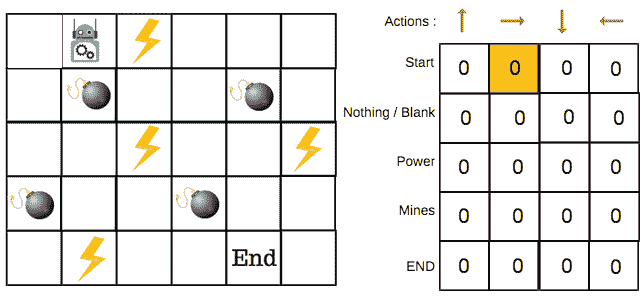
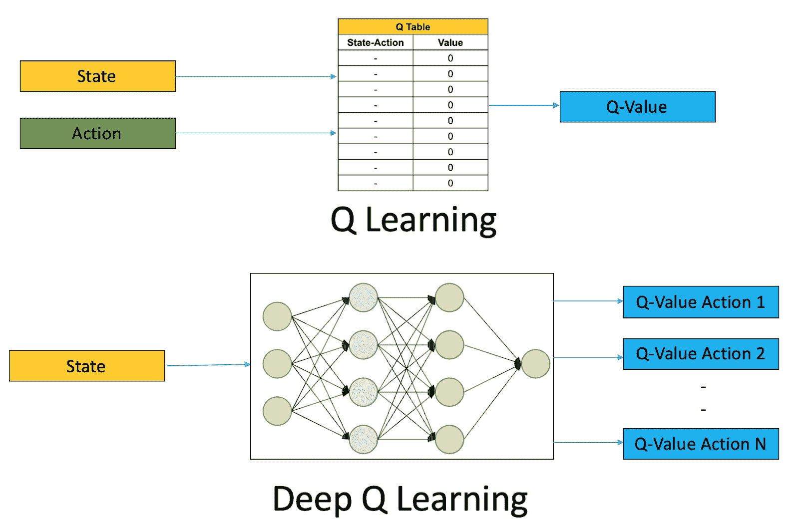

# 强化学习的全面介绍

> 原文：<https://blog.paperspace.com/introduction-to-reinforcement-learning/>

对海量数据的访问和巨大计算能力的可用性使我们探索各种技术来提取有用的模式，并过上更好的生活。正确地搅动数据已经成为一种必要。工业自动化、医疗保健中的疾病检测、机器人、资源管理和个性化推荐已经为我们的生活铺平了道路。它们彻底改变了我们感知和执行任务的陈词滥调。同样，强化学习是机器学习的一个子领域，它通过促进自动化决策在当前的技术时代占据了一席之地。

这里有一个主题列表，我们将通过它来详细了解强化学习:

*   这一切都始于机器学习
*   强化学习的本质
    *   机器人学硕士
    *   RL 的其他应用
*   马尔可夫决策过程(MDP)
    *   最优策略搜索
*   蒙特卡罗学习
*   动态规划
    *   时差学习
*   q 学习
    *   勘探-开采权衡
    *   ε-贪婪勘探政策
*   深度 Q-网络
*   结论

## 这一切都始于机器学习

**机器学习**顾名思义，赋予机器无需显式编程就能学习的能力。给定一组观察数据点，机器制定的决策类似于人类制定的决策。

**机器学习中的监督学习**是数据点标签的可用性。例如，如果我们考虑 Iris 数据集(由植物特征及其对应的植物名称组成)，监督学习算法必须学习特征和标签之间的映射，并在给定样本的情况下输出标签。

**机器学习中的无监督学习**就是不使用标签。算法的职责是通过分析概率分布从数据中得出模式。

**机器学习中的强化学习(RL)** 是标签的部分可用性。学习过程类似于儿童经历的养育过程。父母养育孩子，同意或不同意孩子采取的行动。孩子学习并据此行动。最终，孩子学会了通过倾向于有积极反馈的行动来最大化成功率。强化学习就是这样进行的。这是一种类似于人类学习的技术，由于它接近人类的行为和感知，在最近十年获得了发展势头。

## 强化学习的本质

> 强化学习有助于制定最佳决策，接近成功标准。每一个动作都不受监督；相反，机器必须自己学习才能接近成功率。

强化学习有四个主要组成部分:

1.  **代理人:**必须制定决策的实体。
2.  **动作:**由实体执行的事件。
3.  **环境:**代理执行动作的场景。它受到一系列规则的约束，环境会对每一个动作做出反应。
4.  **奖励:**反馈机制，通知代理人成功率。

### 机器人学硕士

一个显著的 RL 应用是在机器人领域。当没有给出成功的衡量标准时，机器人必须具有执行未知任务的智能。它必须探索所有的可能性，并达到它的既定目标。如果我们考虑典型的强化学习术语，这里的机器人是一个代理。行动就是它的运动。环境是，比如说，一个迷宫。奖励是成功完成一步棋所得到的分数。所有这四个部分一起解释了一个强化学习场景。

### RL 的其他应用

除了机器人技术之外，RL 还被证明是一种有前途的技术，可以在各种其他领域实现最先进的解决方案:

*   自动驾驶——停车、向正确的方向移动汽车、轨迹优化、运动规划、基于场景的学习等。
*   交通灯控制-根据道路上的车辆数量控制交通灯。
*   医疗保健-找到最佳治疗方案，设计更好的假肢。
*   金融交易和价格优化。
*   电力系统-利用有效的能源消耗策略降低能源消耗。
*   游戏——在游戏行业使用强化学习带来了巨大的成果。AlphaGo Zero 和 Dota 2 都有经过强化学习算法训练的智能体玩过，表现相当不错。

## 马尔可夫决策过程(MDP)

马尔可夫决策过程为强化学习代理提供了一个环境。为了理解马尔可夫决策过程，让我们首先理解它们的先决条件。

一个**马尔可夫属性**是一个无记忆属性，依赖于当前状态，而不依赖于之前的状态(它假设现在是所有过去事件的整体表示)。换句话说。考虑到现在，未来不取决于过去。拥有这种性质的过程被称为**马尔可夫过程**。这里的进程是一系列状态$S1，S2，S3，...$拥有马尔可夫性质。它由两个参数定义:状态$S$和转换函数$P$(即从一个状态转换到另一个状态的函数)。

一个**马尔可夫奖励过程**定义了一个马尔可夫过程所累积的奖励。它由状态$S$、转移函数$P$、奖励$R$和贴现率$D$定义。$D$解释了未来的回报，给出了现在的回报。如果$D$为 0，代理只关心下一个奖励。如果$D$为 1，则代理关心所有未来的奖励。贴现因子$D$是收敛结果所必需的，否则会导致无限平凡的结果。

从给定时间$t$累积的总奖励由一个简单的数学等式给出:

$ $ r _ t = r _ { t+1 }+dr _ { t+2 }+d^2r_{t+3}+…$ $

如果$D$ = 0，$R_t = R_{t + 1}$并且代理只关心下一个奖励。

如果$D$ = 1，$R_t = R_{t+1} + R_{t+2} + …$并且代理关心所有未来的奖励。

一个**马尔可夫决策过程(MDP)** 是一个应用于决策的马尔可夫奖励过程。它由状态$S$、转换函数$P$、奖励$R$、贴现率$D$和一组动作$a$表示。MDP 可以被认为是代理和环境之间的接口。一个代理在一个环境中执行一组特定的动作，然后这个环境用一个奖励和一个新的状态来响应。下一个状态和奖励只取决于前一个状态和动作。

### 最优策略搜索

既然环境是用 MDP 定义的，我们的重点就必须放在回报最大化上。为了实现这一点，代理必须确定它将处于的每个状态的最佳行动，或者一般来说，确定最佳政策或策略。

**贝尔曼方程**通过计算每个州能够产生的未来回报来帮助估计每个州的价值。

$$V^{}(S) = max_a \sum_{S^{'}}P(S，a，S^{'})[R(S，a，S^{'}) + D V(S{'})]$$

其中:

*   $P(S，a，S^{'})$是当动作为$a$时，从状态$S$到$S^{'}$的转移概率
*   $R(S，a，S^{'})$是当动作为$a$时，从状态$S$转换到$S^{'}$所获得的奖励
*   d 是贴现因子
*   $V(S^{'})$是州$S{'}$的值

上述方程可以从马尔可夫方程得到如下。

$ r _ t = r _ { t+1 }+dr _ { t+2 }+d^2r_{t+3}+…$

$ R _ t = R _ { t+1 }+D(R _ { t+2 }+DR _ { t+3 }+…)$

$R_t = R_{t+1} + DR_{t+1}$

期望值(EV)则为:

$$V^{}(S) = max_a \sum_{S^{'}}P(S，a，S^{'})[R(S，a，S^{'}) + D V(S{'})]$$

贝尔曼方程计算最佳状态，该状态与配对动作一起将进一步增强最佳策略搜索。这可以通过使用 Q 值来实现。

**Q 值**定义了代理在特定状态下必须选择的动作。Q 值可通过下式计算:

$$Q_{k+1}(S，a) = \sum_{S^{'}} P(S，a，S^{'})[R(S，a，s^{'})+d.max_{a^{'}} q_{k}(s^{'},a^{'})]\ for all(s，a) $

a^{'})$ $max_{a^{'}} q_{k}(s^{'}定义了$a^{'}$在$S^{'}$.采取的行动

简而言之，通过使用贝尔曼方程(最优状态)和 Q 值(最优动作)计算结果，代理的训练迭代地发生。

## 蒙特卡罗学习

在最优策略搜索中，我们的假设是概率是包含在内的，尽管我们不知道它的值。因此，为了找到概率，主体必须与环境交互，并找到从一种状态转换到另一种状态的所有可能的概率。

蒙特卡罗是一种随机抽样输入以确定输出的技术，该输出更接近考虑中的报酬。它根据观察到的回报生成一个更新动作-值对的轨迹。最终，策略/轨迹收敛到最优目标。

> 在蒙特卡罗学习中，每个试验(随机抽样)都被表示为一个**事件**。

状态$V(S)$的值可以使用以下方法来估计:

**首次访问蒙特卡洛政策评估:**只有代理人首次访问一个州才算数。

**每次访问蒙特卡洛政策评估:**代理人每次访问一个州都要计算 S $ S。

**增量蒙特卡罗策略评估:**每集后计算状态$S$的平均值。

使用这些技术中的任何一种，都可以评估动作值。

在蒙特卡罗学习中，整个事件必须发生以评估状态$V(S)$的价值，因为它取决于**未来回报**(如在贝尔曼方程和 Q 值中所见)，这是耗时的。为了克服这一点，我们使用了**动态编程**。

## 动态规划

在动态编程中，算法搜索与下一步相关的所有可能的动作。这使得有可能评估下一个状态，从而在单个步骤之后更新策略。动态编程向前看一步，迭代所有的动作。另一方面，要用蒙特卡罗选择一个单一的行动，整个情节必须是完整的。

动态规划和蒙特卡罗的交叉点是时差学习。

### 时差学习

在时差学习中，TD(0)是最简单的方法。它通过利用贝尔曼方程来估计一个状态的值，不包括概率。

$ $ V(S _ t)= V(S _ t)+\ alpha[R _ { t+1 }+D . V(S _ { t+1 })-V(S _ t)]$ $

其中$R_{t+1} + DV(S_{t+1}) - V(S_{t})$为 TD 误差，$R_{t+1} + DV(S_{t+1})$为 TD 目标。

也就是说，在时间$t + 1$时，代理计算 TD 目标并更新 TD 错误。

概括$TD(0)$，$TD(D)$将是:

$ $ v(s _ t)= v(s _ t)+\alpha[g^{\lambda}{t}-v(s _ t)]$ $

TD 试图通过考虑当前预测来计算未知的未来预测。

## q 学习

q 学习是蒙特卡罗和时差学习的结合。它由以下等式给出:

$$Q(S_t，a) = Q(S_t，a)+\ alpha[R _ { t+1 }+d . max _ a Q(S _ { t+1 }，a) - Q(S_t，a)]$$

贪婪地计算未来的回报。

Q-Learning 是一个**非策略**算法，这意味着它选择随机的动作来找到一个最优的动作。换句话说，不存在它遵守的政策。为了更好地理解这一点，让我们来看看勘探-开采的权衡。

### 勘探-开采权衡

勘探-开采权衡提出了一个问题，“在什么情况下开采应该优先于勘探？”

假设你从一个特定的服装品牌购买衣服。现在你的朋友说不同品牌的衣服看起来更好。你现在会为选择哪个品牌更好而左右为难吗？探索一个新品牌会更差还是更好？

我们人类优先选择探索(例如新的服装品牌)或开发(我们信赖的旧服装品牌)。但是这怎么能由机器来决定呢？

为了解决这个问题，我们有一个叫做**ε贪婪探索政策**的东西。

### ε-贪婪勘探政策

一方面，持续探索并不是一个合适的选择，因为它会耗费大量的时间。另一方面，持续利用不会将范围扩大到包括看不见的(可能更好的)数据。为了对此进行检查，使用了ε值。它的工作原理如下:

*   ε的值在开始时被设置为 1。这仅仅是通过选择随机行为和填写 Q 表来进行探索。
*   然后生成一个随机数。如果这个数字大于ε，我们就进行开发(这意味着我们知道该采取的最佳步骤)，否则我们就进行探索。
*   ε值必须逐渐减少(表示剥削增加)。

> Q 表存储了每个状态下一个动作的最大预期未来回报(Q 值)。

State-Action table and Q-table (Source: [freecodecamp](https://www.freecodecamp.org/news/an-introduction-to-q-learning-reinforcement-learning-14ac0b4493cc/))

ε-贪婪政策的优势在于它永远不会停止探索。尽管 Q-table 已经满了，但还是要去探索。

用 Q 值填充 Q 表构成了 Q 学习算法。它有助于通过贪婪地分析未来的回报来选择最大化总回报的行动。

## 深度 Q-网络

对于涉及较小离散态的问题，Q 表似乎是可行的。随着动作和状态的增长，Q 表不再是一个可行的选择。我们需要一个映射状态和动作的近似函数。在每一个时间步，代理都必须根据状态-动作近似计算预测值。如果状态-动作对是非线性和不连续的，这也是不可行的。

一个**深度人工神经网络**(用$Q(S，a 表示；其中θ对应于网络的可训练权重)。神经网络可以清晰地表示复杂的状态空间。这里有一个例子:

Q-Learning v/s Deep Q-Learning (Source: [Oracle](https://blogs.oracle.com/datascience/reinforcement-learning-deep-q-networks ))

DQN 成本函数看起来像这样:

$$Cost=[Q(S，a；\theta) - (r(S，a)+d.max_{a}q(s^{'},a；\theta))]^2$$

它是当前$Q$值(预期的未来回报)与当前和未来回报(实际回报)之间的均方误差(MSE)。

**训练过程:**训练数据集在整个训练过程中不断建立。我们要求代理使用当前网络选择最佳行动。状态、动作、奖励和下一个状态都被记录下来(新的训练数据样本)。在这种网络中使用的存储缓冲器通常被称为**体验重放**。它们打破了连续样本之间的相关性，否则会导致低效的训练。

## 结论

强化学习是机器学习的一个分支，旨在自动化决策。它分析和复制人类智能的能力为人工智能研究开辟了新的途径。理解其意义是必要的，越来越多的研究机构和公司专注于部署智能决策代理。

在本文中，您已经了解了强化学习的内容。通过构建问题的端到端 RL 解决方案来整合您的知识。[开始使用 OpenAI Gym](https://blog.paperspace.com/getting-started-with-openai-gym/) 是一个很好的开始(包括一个详细的[渐变社区笔记本](https://ml-showcase.paperspace.com/projects/reinforcement-learning)，有完整的 Python 代码，可以免费运行)。