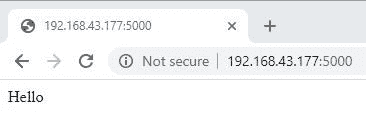
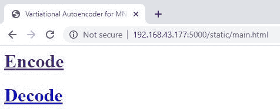
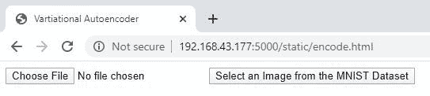
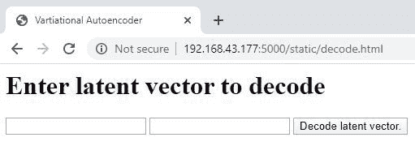

# 构建一个 Flask Web 应用程序，使用可变自动编码器压缩图像

> 原文：<https://blog.paperspace.com/compress-images-using-variational-autoencoders-and-flask/>

在本教程中，我们将使用 Flask 构建一个 web 应用程序，该应用程序允许用户上传要使用预训练的变分自动编码器(VAE)编码(即压缩)的图像。编码后，用户得到一个由两个元素组成的矢量，代表整个图像。该应用程序还允许用户基于这样的矢量解码(即解压缩)图像。

本教程的大纲如下:

*   预训练变分自动编码器
*   在 Flask 中构建一个简单的 Web 应用程序
*   构建 VAE App 主架构
*   App 主界面
*   用于编码图像的 HTML 页面
*   上传和编码图像
*   用于解码图像的 HTML 页面
*   解码图像
*   完全码

## **预训练的变分自动编码器**

变分自动编码器(VAE)在之前名为[如何在 Keras](https://blog.paperspace.com/how-to-build-variational-autoencoder-keras/) 中构建变分自动编码器的教程中介绍过，其中使用 Keras 构建了一个模型来压缩 MNIST 数据集中的图像。编码器网络接受形状为`(28, 28)`的整个图像，并将其编码为长度为 2 的潜在向量，从而将每个图像压缩为 2 个元素。然后使用解码器网络对编码器的输出进行解码，该解码器网络接受潜在向量作为输入，并返回图像的重建版本。

上一教程保存了代表以下 3 种模型的 3 个文件，但我们只对编码器和解码器的模型感兴趣:

1.  编码器
2.  解码器
3.  VAE

有必要知道如何使用这些模型来编码和解码图像。

给定一个名为`test.jpg`的图像，第一步是根据下面几行代码读取它。通过将`as_gray`参数设置为`True`，确保它被读取为灰度图像。

```py
import skimage.io

img = skimage.io.imread(fname="test.jpg", as_gray=True)
```

因为我们正在处理形状为`(28, 28)`的 MNIST 数据集的图像，所以确保图像形状为`(28, 28)`很重要。这里有一个`if`的声明。

```py
if img.shape[0] != 28 or img.shape[1] != 28:    
    print("Image shape must be (28, 28)")
```

在读取图像之后和编码之前，有一个额外的步骤。编码器模型期望输入是 4D 数组，其中维数按顺序表示以下内容:

1.  样本数目
2.  样本宽度
3.  样本高度
4.  频道数量

在我们的应用程序中，我们只对编码单个图像感兴趣，所以样本数是`1`。宽度和高度都等于`28`。通道的数量是`1`，因为 MNIST 图像是二进制的。因此，前 4 个维度的值如下:

1.  样本数量:`1`
2.  样本宽度:`28`
3.  样品高度:`28`
4.  通道数量:`1`

可以使用 NumPy 创建 4D 数组，如下所示:

```py
test_sample = numpy.zeros(shape=(1, 28, 28, 1))
```

然后，将先前读取的图像分配给该阵列，如下所示:

```py
test_sample[0, :, :, 0] = img
```

最后要做的一件事是重新调整像素值，使其落在`0-1`范围内，因为这是用来训练模型的。

```py
test_sample = test_sample.astype("float32") / 255.0
```

现在我们准备读取保存的编码器模型，命名为`VAE_encoder.h5`。

```py
encoder = tensorflow.keras.models.load_model("VAE_encoder.h5")
```

要对图像进行编码，只需调用接受 4D 数组并返回潜在向量的`predict()`方法。

```py
latent_vector = encoder.predict(test_sample)
```

此时，我们能够读取图像，加载编码器，并使用编码器对图像进行编码。下面是完成这些步骤的完整代码。

```py
import skimage.io
import numpy
import tensorflow.keras.models

img = skimage.io.imread(fname="test.jpg", as_gray=True)
if img.shape[0] != 28 or img.shape[1] != 28:
    print("Image shape must be (28, 28)")
    exit()

test_sample = numpy.zeros(shape=(1, 28, 28, 1))
test_sample[0, :, :, 0] = img
test_sample = test_sample.astype("float32") / 255.0

encoder = tensorflow.keras.models.load_model("VAE_encoder.h5")
latent_vector = encoder.predict(test_sample)
```

下一步是使用解码器解码图像。解码器希望其输入是以下维度的 2D 数组:

1.  样本数量。
2.  样本长度。

与编码器类似，只有一个样本需要解码，因此样本数为`1`。因为每个编码图像被表示为长度为 2 的向量，所以样本长度为`2`。前两个维度的值如下:

1.  样本数量:`1`
2.  样本长度:`2`

下面是如何创建一个空的 NumPy 数组来表示解码器的输入。

```py
latent_vector  = numpy.zeros(shape=(1, 2))
```

假设向量的 2 个元素是 0.1 和 4.2，下面是如何将它们赋给向量。

```py
latent_vector[0, 0] = 0.1
latent_vector[0, 1] = 4.2
```

现在我们可以读取解码器模型，它保存在一个名为`VAE_decoder.h5`的文件中。

```py
decoder = tensorflow.keras.models.load_model("VAE_decoder.h5")
```

通过调用解码器的`predict()`方法，我们可以重建图像。

```py
decoded_image = decoder.predict(latent_vector)
```

注意，解码器的结果是类似于编码器输入的 4D 张量。因此，我们需要提取该数组的图像，如下所示:

```py
decoded_image = decoded_image[0, :, :, 0]
```

现在我们有了这个图像，我们要么保存它，要么显示它。下面是如何将其保存为名为`decoder_image.jpg`的文件。

```py
skimage.io.imsave(fname="decoder_image.jpg", arr=decoded_image)
```

以下是准备解码器输入、加载解码器、解码图像并保存结果的完整代码。

```py
import skimage.io
import numpy
import tensorflow.keras.models

latent_vector  = numpy.zeros(shape=(1, 2))
latent_vector[0, 0] = 0.1
latent_vector[0, 1] = 4.2

decoder = tensorflow.keras.models.load_model("VAE_decoder.h5")

decoded_image = decoder.predict(latent_vector)

decoded_image = decoded_image[0, :, :, 0]

skimage.io.imsave(fname="decoder_image.jpg", arr=decoded_image)
```

目前，我们已经回顾了基于预训练的编码器和解码器网络对来自 MNIST 数据集的图像进行编码和解码的步骤。下一节讨论使用 Flask 构建一个简单的 web 应用程序。

## **在 Flask 中构建一个简单的 Web 应用程序**

最简单的 Flask 应用程序可以根据下面的代码块实现。通过实例化`Flask`类并将实例保存在`app`变量中来创建 flask 应用程序。之后，一个名为`vae()`的函数监听服务器`/`的主目录，并通过测试`Hello`做出响应。

为了运行应用程序，调用了`run()`方法，该方法有 3 个参数:

1.  `host`:保存服务器将被激活的主机名或 IP 地址。它被设置为`0.0.0.0`来监听所有公共 IP，或者您可以在您的本地网络中指定确切的 IP 地址。
2.  `port`:端口号，设置为`5000`。
3.  `debug`:设置为`True`以调试模式运行服务器，这提供了一些关于服务器的附加信息以供调试。

```py
import flask

app = flask.app.Flask(__name__)

@app.route("/", methods=["POST", "GET"])
def vae():
    return "Hello"

app.run(host="0.0.0.0", port=5000, debug=True)
```

假设前面的代码保存在一个名为`test_flask.py`的文件中，然后发出下面的终端命令来运行服务器。

```py
python test_flask.py
```

下图显示了从 URL `http://192.168.43.177:5000/`访问服务器后的结果，其中我的本地 IP 地址是 192.168.43.177。



有了一个运行的 Flask app 之后，我们就可以开始讨论我们的项目了。下一节只是总结了项目的结构，以便对我们将要使用的不同文件和文件夹有一个总体的了解。

## **项目结构**

下面给出了项目的结构，假设所有的文件和文件夹都保存在名为`VAE_Project`的根目录下。在这个根目录下，`test_flask.py`文件保存了 Flask 应用程序代码。

该目录有两个文件夹，分别是:

1.  `static`
2.  `templates`

`static`文件夹有 3 个文件和 1 个文件夹。这些文件是:

1.  `main.html`
2.  `encode.html`
3.  `decode.html`

在`static`文件夹中还有一个名为`imgs`的文件夹，它只是一个空文件夹，用于保存解码后的图像。

`templates`文件夹有两个文件:

1.  `decode_result.html`
2.  `encode_result.html`

```py
VAE_Project:
	static:
		main.html
		encode.html
		decode.html
		imgs:
	templates:
		encode_result.html
		decode_result.html
	test_flask.py
```

下一节构建应用程序的主要结构，以便它加载编码器和解码器模型，并为请求编码、解码或其他内容的请求提供服务。

## **搭建 VAE App 主体架构**

如果用户需要对图像进行编码或解码，那么必须加载编码器和解码器模型。每次使用这些模型时都加载它们(根本)不是一个好主意。相反，只需加载一次，就可以重复使用。因此，在运行 Flask 应用程序之前加载模型是一个好时机。下面是模型在应用程序中的加载方式。

```py
import flask

app = flask.app.Flask(__name__)

encoder = tensorflow.keras.models.load_model("VAE_encoder.h5")
decoder = tensorflow.keras.models.load_model("VAE_decoder.h5")

@app.route("/", methods=["POST", "GET"])
def vae():
    return "Hello"

app.run(host="0.0.0.0", port=5000, debug=True)
```

为了控制所有到达服务器的请求，将使用`vae()`函数来服务所有请求。在这个函数中，将根据请求的目的是编码、解码还是其他什么来调用其他函数。下面是`vae()`功能的主要结构。

根据传入请求中的`subject`参数，决定该请求是要求对图像进行编码或解码，还是只访问服务器的主页。

```py
@app.route("/", methods=["POST", "GET"])
def vae():
    subject = flask.request.args.get("subject")
    print(subject)

    if subject == "encode":
        return upload_encode_img(flask.request)
    elif subject == "decode":
        return decode_img(flask.request)
    else:
        return flask.redirect(flask.url_for("static", filename="main.html"))

def upload_encode_img():
    return "Encoder"

def decode_img():
    return "Decoder"
```

以下是该应用程序可能的行为:

1.  如果`subject`参数在请求中可用，并且其值为`encode`，则请求的目的是编码图像。结果，请求被转发到另一个名为`upload_encode_image()`的函数，该函数负责对图像进行编码。
2.  如果`subject`参数中的值是`decode`，那么它要求解码图像，并且该请求被转发给`decode_img()`函数。
3.  如果`subject`参数根本不可用，那么这意味着请求既不要求编码也不要求解码图像，因此加载了一个名为`main.html`的 HTML 页面。

此时，`upload_encode_img()`和`decode_img()`函数除了返回一些文本外什么也不做。

在 Flask 中，最好将 HTML 文件添加到主应用程序目录中名为`static`的文件夹中。通过这样做，Flask 应用程序可以轻松定位这些文件，并避免静态键入这些文件的 URL。例如，如果您想获得一个名为`main.html`的文件的 URL，那么只需发出这个命令:

```py
flask.url_for("static", filename="main.html")
```

获得页面的 URL 后，您可以使用`flask.redirect()`函数请求服务器重定向到该页面，如下所示:

```py
flask.redirect(flask.url_for("static", filename="main.html"))
```

下一节将讨论`main.html`页面的实现。

## **App 主界面**

如果用户访问了服务器的主页`http://192.168.43.177:5000/`，则会显示一个 HTML 页面，询问用户是否想要对图像进行编码或解码。下面的代码给出了该页面的实现。它的主体有 2 个`<a>`元素:一个引用用于编码图像的`encode.html`页面，另一个引用用于解码图像的`decode.html`页面。

```py
<html>

<head>
<title>Vartiational Autoencoder for MNIST Dataset</title>
</head>

<body>
<h1><a href="http://192.168.43.177:5000/static/encode.html">Encode</a></h1>
<h1><a href="http://192.168.43.177:5000/static/decode.html">Decode</a></h1>
</body>

</html>
```

下图显示了`main.html`在访问服务器的根目录后的样子。



下一节将讨论`encode.html`页面的实现。

## **用于编码图像的 HTML 页面**

下面列出了`encode.html`页面的实现。该页面只有一个提交给服务器的地址为`http://192.168.43.177:5000?subject=encode`的`form`。请注意，`subject`参数是可用的，并被设置为`encode`以通知服务器这是一个关于编码图像的请求。

```py
<html>

<head>
<title>Vartiational Autoencoder</title>
</head>

<body>
<form action="http://192.168.43.177:5000?subject=encode" method="post" enctype="multipart/form-data">


</form>

</body>

</html>
```

该表单只有两个元素:

1.  类型为`file`的输入，允许用户选择要上传的图像。这个元素被命名为`imageToUpload`，它将在服务器上被用来获取所选择的文件。
2.  类型为`submit`的输入，这是一个按钮，用户单击它将表单提交给服务器。

这就是关于`encode.html`页面的一切。下图显示了它的样子。



在从 MNIST 数据集中选择一幅图像并提交表单后，服务器将在`vae()`函数中接收请求，该请求将被转发给`upload_encode_img()`函数。下一节将讨论这个函数是如何工作的。

## **上传并编码图像**

用户在`encode.html`页面提交表单后，表单将被发送到`upload_encode_img()`功能。根据下一个`if`语句，该函数要做的第一件事是确保文件已经存在。它检查在请求的`files`对象中是否有 ID 为`imageToUpload`的文件。如果它不存在，那么服务器会显示一个 HTML 页面，声明没有上传任何文件。

```py
if "imageToUpload" not in encode_request.files:
    return "<html><body><h1>No file uploaded.</h1><a href=" + app_url + ">Try Again</a></body></html>" 
```

如果文件已经存在，则从`files`对象中获取，如下所示:

```py
img = encode_request.files["imageToUpload"]
```

为了再次检查文件是否已经上传，需要检查文件名，看它是否为空。如果为空，那么服务器将使用与前一种情况相同的 HTML 页面进行响应。

```py
if img.filename == '':
    return "<html><body><h1>No file uploaded.</h1><a href=" + app_url + ">Try Again</a></body></html>" 
```

如果文件名不为空，则按如下方式返回:

```py
filename = werkzeug.utils.secure_filename(img.filename)
```

因为服务器需要一个图像文件，所以根据支持的图像扩展名列表检查上传的文件扩展名，这些扩展名是`JPG`、`JPEG`和`PNG`。如果文件扩展名不受支持，则会显示一个 HTML 页面来通知用户。

```py
_, file_ext = filename.split(".")
if file_ext.lower() not in ["jpg", "jpeg", "png"]:
    return "<html><body><h1>Wrong file extension. The supported extensions are JPG, JPEG, and PNG.</h1><a href=" + app_url + ">Try Again</a></body></html>"
```

如果上传的文件是受支持扩展名的图像，则根据以下代码读取图像并检查其形状。如果图像尺寸不是`(28, 28)`，将显示一个 HTML 页面。

```py
read_image = skimage.io.imread(fname=filename, as_gray=True)
if read_image.shape[0] != 28 or read_image.shape[1] != 28:
    return "<html><body><h1>Image size must be 28x28 ...</h1><a href=" + app_url + ">Try Again</a></body></html>" 
```

最后，通过调用名为`encode_img()`的函数对图像进行编码。

```py
encode_img(read_image)
```

至此，这里是`upload_encode_image()`函数的实现。

```py
def upload_encode_image(encode_request):
    if "imageToUpload" not in encode_request.files:
        return "<html><body><h1>No file uploaded.</h1><a href=" + app_url + ">Try Again</a></body></html>"
    img = encode_request.files["imageToUpload"]
    if img.filename == '':
        return "<html><body><h1>No file uploaded.</h1><a href=" + app_url + ">Try Again</a></body></html>"
    filename = werkzeug.utils.secure_filename(img.filename)
    _, file_ext = filename.split(".")
    if file_ext.lower() not in ["jpg", "jpeg", "png"]:
        return "<html><body><h1>Wrong file extension. The supported extensions are JPG, JPEG, and PNG.</h1><a href=" + app_url + ">Try Again</a></body></html>"

    read_image = skimage.io.imread(fname=filename, as_gray=True)
    if read_image.shape[0] != 28 or read_image.shape[1] != 28:
        return "<html><body><h1>Image size must be 28x28 ...</h1><a href=" + app_url + ">Try Again</a></body></html>"        

    return encode_img(read_image)
```

下面给出了`encode_img()`功能的实现。它接受要编码的图像作为参数。在其中，准备好 4D 数组，然后通过调用`predict()`方法，使用之前加载的`encoder`模型对图像进行编码。返回的潜在向量用于填充一个名为`encode_result.html`的 HTML 模板。最后，通过调用`render_template()`函数来呈现 HTML 模板。

```py
def encode_img(img):
    test_sample = numpy.zeros(shape=(1, 28, 28, 1))
    test_sample[0, :, :, 0] = img
    test_sample = test_sample.astype("float32") / 255.0

    latent_vector = encoder.predict(test_sample)
    return flask.render_template("encode_result.html", num1=latent_vector[0, 0], num2 = latent_vector[0, 1])
```

`render_template()`函数接受 HTML 模板的名称作为参数，此外还接受列出了名称和值的其他参数(`num1`和`num2`代表潜在向量的两个值)。

名称-值参数用于填充 HTML 模板中的某些位置。下面给出了`encode_result.html`文件的实现。其中有一个`{{num1}}`，它将被分配给`render_template()`函数中`num1`参数的值所替代。这同样适用于`{{num2}}`。

注意，HTML 模板保存在名为`templates`的文件夹中。关于 Flask 中模板的更多信息，请查看[这个链接](https://jinja.palletsprojects.com/en/2.11.x/)。

```py
<html>

<head>
<title>Vartiational Autoencoder</title>
</head>

<body>

<h1>Variational Autoencoder for Compressing and Reconstructing MNIST Images</h1>
<h1>Latent vector of the encoded image</h1>
<h3>{{num1}}, {{num2}}</h3>
<h1><a href="http://192.168.43.177:5000">Go to Main Page</a></h1>

</body>

</html>
```

在选定的图像被编码并且模板 HTML `encode_result.html`被填充后，下图显示了结果。用户应该复制打印的值，因为它们代表编码的图像，以后用于解码。下一节讨论应用程序如何解码图像。


## **用于解码图像的 HTML 页面**

在服务器的主页中，有 2 个`<a>`元素，它们将用户带到`encode`页面或`decode`图像。之前讨论了编码部分。本节讨论解码部分。下面给出了用户点击`Decode`链接后呈现的 HTML 页面。

页面有一个包含 3 个`input`元素的`form`。前两个是`number`类型，允许用户输入潜在向量的值。他们的名字是`num1`和`num2`。服务器将使用这些名称来访问它们的值。第三个元素的类型是`submit`，用于将表单提交到这个 URL: `http://192.168.43.177:5000?subject=decode`。请注意，`subject`参数被赋予值`decode`以告知服务器上的`vae()`函数该请求是关于解码图像的。

```py
<html>

<head>
<title>Vartiational Autoencoder</title>
</head>

<body>
<h1>Enter latent vector to decode</h1>
<form action="http://192.168.43.177:5000?subject=decode" method="post">


</form>

</body>

</html>
```

下图显示了`decode.html`页面的外观。



下一节讨论表单提交后服务器的行为。

## **解码图像**

在用户输入潜在向量的值并在`decode.html`页面提交表单后，请求将被转发给服务器上的`vae()`函数，该函数将依次调用`decode_img()`函数。下面列出了该函数的实现。它首先获取表单中传递的名为`num1`和`num2`的两个数值。然后，它准备一个空的 NumPy 数组，将由这两个值填充。

```py
def decode_img(decode_request):
    global im_id
    num1, num2 = decode_request.form["num1"], decode_request.form["num2"]

    latent_vector  = numpy.zeros(shape=(1, 2))
    latent_vector[0, 0] = num1
    latent_vector[0, 1] = num2
    print(latent_vector)

    decoded_image = decoder.predict(latent_vector)
    decoded_image = decoded_image[0, :, :, 0]

    saved_im_name = os.path.join(app.config['UPLOAD_FOLDER'], "vae_result_" + str(im_id) + ".jpg")
    im_id = im_id + 1
    skimage.io.imsave(fname=saved_im_name, arr=decoded_image)

    return flask.render_template("decode_result.html", img_name=saved_im_name)
```

解码器通过将数组传递给`predict()`方法将这样的向量解码成图像。解码后的图像然后被保存在服务器端。保存图像的位置是将上传文件夹的目录与图像名称连接起来的结果。可以在运行服务器之前指定上传文件夹的位置，如下所示。在`static`目录下有一个名为`imgs`的文件夹，用来保存上传的文件。

```py
IMGS_FOLDER = os.path.join('static', 'imgs')
app.config['UPLOAD_FOLDER'] = IMGS_FOLDER
```

根据`im_id`变量，每个上传图像的名称被赋予一个唯一的 ID。它是一个全局变量，在运行服务器之前声明，初始化为`0`。

保存图像后，服务器在将参数`img_name`传递给`render_template()`函数后呈现`decode_result.html`模板。下面给出了`decode_result.html`模板的实现。注意，这个文件应该保存在`templates`目录下。

模板有一个``元素，它的`src`属性被设置为`{{img_name}}`，它将被分配给`render_template()`函数中`img_name`参数的值所替换。

```py
<html>

<head>
<title>Vartiational Autoencoder</title>
</head>

<body>

<h1>Variational Autoencoder for Compressing and Reconstructing MNIST Images</h1>
<h1>Reconstructed Image</h1>


</body>

</html>
```

下图显示了呈现模板后的结果。


## **完整代码**

Flask 应用程序的完整代码如下所示。

```py
import flask
import werkzeug, os
import tensorflow.keras.models
import numpy
import skimage.io

IMGS_FOLDER = os.path.join('static', 'imgs')

app_url = "http://192.168.43.177:5000" #"https://hiai.website/vae_mnist" 

app = flask.app.Flask(__name__)
app.config['UPLOAD_FOLDER'] = IMGS_FOLDER

encoder = tensorflow.keras.models.load_model("VAE_encoder.h5")
decoder = tensorflow.keras.models.load_model("VAE_decoder.h5")

im_id = 0

@app.route("/", methods=["POST", "GET"])
def vae():
    subject = flask.request.args.get("subject")
    print(subject)

    if subject == "encode":
        return upload_encode_image(flask.request)
    elif subject == "decode":
        return decode_img(flask.request)
    else:
        return flask.redirect(flask.url_for("static", filename="main.html"))

def upload_encode_image(encode_request):
    if "imageToUpload" not in encode_request.files:
        return "<html><body><h1>No file uploaded.</h1><a href=" + app_url + ">Try Again</a></body></html>"
    img = encode_request.files["imageToUpload"]
    if img.filename == '':
        return "<html><body><h1>No file uploaded.</h1><a href=" + app_url + ">Try Again</a></body></html>"
    filename = werkzeug.utils.secure_filename(img.filename)
    _, file_ext = filename.split(".")
    if file_ext.lower() not in ["jpg", "jpeg", "png"]:
        return "<html><body><h1>Wrong file extension. The supported extensions are JPG, JPEG, and PNG.</h1><a href=" + app_url + ">Try Again</a></body></html>"

    read_image = skimage.io.imread(fname=filename, as_gray=True)
    if read_image.shape[0] != 28 or read_image.shape[1] != 28:
        return "<html><body><h1>Image size must be 28x28 ...</h1><a href=" + app_url + ">Try Again</a></body></html>"        

    return encode_img(read_image)

def encode_img(img):
    test_sample = numpy.zeros(shape=(1, 28, 28, 1))
    test_sample[0, :, :, 0] = img
    test_sample = test_sample.astype("float32") / 255.0

    latent_vector = encoder.predict(test_sample)
    return flask.render_template("encode_result.html", num1=latent_vector[0, 0], num2 = latent_vector[0, 1])

def decode_img(decode_request):
    global im_id
    num1, num2 = decode_request.form["num1"], decode_request.form["num2"]

    latent_vector  = numpy.zeros(shape=(1, 2))
    latent_vector[0, 0] = num1
    latent_vector[0, 1] = num2
    print(latent_vector)

    decoded_image = decoder.predict(latent_vector)
    decoded_image = decoded_image[0, :, :, 0]

    saved_im_name = os.path.join(app.config['UPLOAD_FOLDER'], "vae_result_" + str(im_id) + ".jpg")
    im_id = im_id + 1
    skimage.io.imsave(fname=saved_im_name, arr=decoded_image)

    return flask.render_template("decode_result.html", img_name=saved_im_name)

app.run(host="192.168.43.177", port=5000, debug=True)
```

## **结论**

本教程使用了一个预训练的 variable auto encoder 来构建 Flask web 应用程序，该应用程序允许用户对 MNIST 数据集中的图像进行编码和解码。本教程通过构建一个简单的应用程序概述了 Flask，然后讨论了在 web 上编码和解码图像的细节。