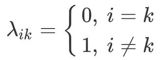
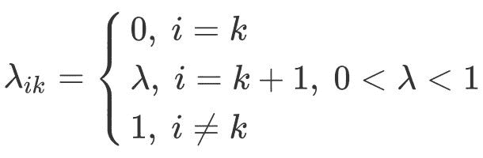

# 如何在机器学习中应用贝叶斯决策理论

> 原文：<https://blog.paperspace.com/bayesian-decision-theory-machine-learning/>

在之前的一篇文章中，我们详细讨论了贝叶斯决策理论背后的理论。在本文中，我们将看到如何将贝叶斯决策理论应用于不同的分类问题。我们将讨论像做分类问题的损失和风险这样的概念，以及它们是如何一步一步地完成的。为了处理分类中的不确定性，还讨论了“拒绝类”。任何具有弱后验概率的样本被分配到拒绝类。我们将通过分析样品被归类为不合格品的条件来得出结论。

这篇文章的大纲如下:

*   贝叶斯决策理论快速回顾
*   二元类贝叶斯决策理论
*   多类贝叶斯决策理论
*   损失和风险
*   0/1 损失
*   计算风险的示例
*   拒绝类别
*   何时将样品归类为不合格品？
*   结论

让我们开始吧。

## **贝叶斯决策理论快速回顾**

在之前的一篇文章中，我们详细讨论了贝叶斯决策理论，包括先验概率、似然概率和后验概率。后验概率根据以下等式计算:

$ $ P(C _ I | X)= \ frac { P(C _ I)P(X | C _ I)} { P(X)} $ $

分母中的证据$P(X)$可以计算如下:

$ $ p(x)=\sum_{i=1}^{k}p(x|c_i)p(c_i)$ $

因此，第一个等式可以写成如下形式:

$ $ p(c_i|x)=\frac{p(c_i)p(x|c_i)}{\sum_{k=1}^{k}p(x|c_k)p(c_k)} $ $

我们还证明了先验概率的总和必须是 1:

$$ \sum_{i=1}^{K}P(C_i)=1 $$

后验概率也是如此:

$$ \sum_{i=1}^{K}P(C_i|X)=1 $$

我们通过将贝叶斯决策理论的概念映射到机器学习的上下文来结束第一篇文章。根据这一讨论，已经表明先验、可能性和证据在做出考虑以下方面的良好预测中起着重要作用:

*   先验概率$P(C_i)$反映了如何通过来自类$C_i$的样本来训练模型。
*   似然概率$P(X|C_i)$是指模型在将样本$X$分类为类$C_i$时的知识。
*   证据项$P(X)$显示了模型对样本$X$的了解程度。

现在我们讨论一下如何用贝叶斯决策理论做分类问题。

## **二元类贝叶斯决策理论**

对于二元分类问题，两个类别的后验概率计算如下:

$ $ p(c_1|x)=\frac{p(c_1)p(x|c_1)}{\sum_{k=1}^{k}p(x|c_k)p(c_k)}
\ \
p(c_2|x)=\frac{p(c_2)p(x|c_2)}{\sum_{k=1}^{k}p(x|c_k)p(c_k)} $ $

根据具有最高后验概率的类别对样本进行分类。

对于二分类问题，只有一类的后验概率就足够了。这是因为所有后验概率的总和是 1:

$ $ P(C1 | X)+P(C2 | X)= 1
\ \
P(C1 | X)= 1-P(C2 | X)
\ \
P(C2 | X)= 1-P(C1 | X)$ $

给定一个类别的后验概率，那么第二个类别的后验概率也是已知的。例如，如果类$C_1$的后验概率为 0.4，则另一类$C_2$的后验概率为:

$$ 1.0-0.4=0.6 $$

也可以计算所有类别的后验概率，并比较它们以确定输出类别。

$ $ C1 \ space if \ space P(C1 | X)> P(C2 | X)
\ \
C2 \ space if \ space P(C2 | X)>P(C1 | X)$ $

## **多类贝叶斯决策理论**

对于多类分类问题，计算每个类的后验概率。根据概率最高的类别对样本进行分类。

假设有 3 个类别，下面是每个类别的后验概率:

$ $ p(c_1|x)=\frac{p(c_1)p(x|c_1)}{\sum_{k=1}^{k}p(x|c_k)p(c_k)}
\ \
p(c_2|x)=\frac{p(c_2)p(x|c_2)}{\sum_{k=1}^{k}p(x|c_k)p(c_k)}
\ \
p(c_3|x)=\frac{p(c_3)p(x|c_3)}{\sum_{k=1}^{k}p(x|c_k)p(c_k)} $ $

基于这 3 个类别的后验概率，输入样本$X$被分配给具有最高后验概率的类别。

$ $ max \ space[P(C1 | X)，P(C2 | X)，P(C3 | X)]$ $

如果 3 个类别的概率分别为 0.2、0.3 和 0.5，则输入样本被分配给第三个类别$C_3$。

$ $ Choose \ space C _ I \ space \ if \ space P(C _ I | X)= max _ K \ space P(C _ K | X)，\space k=1:K $$

## **损失和风险**

对于属于类别$C_k$的给定样本，贝叶斯决策理论可以采取**动作**，该动作将样本分类为属于具有最高后验概率的类别$\alpha_i$的样本。

当$i=k$时，动作(即分类)是正确的。换句话说:

$$ C_k=\alpha_i $$

预测的类$\alpha_i$可能与正确的类$C_k$不同。这种错误的行动(即分类)的结果，是有损失的。损失表示为λ$ \λ$:

$松动$

其中$i$是预测类的索引，而$k$是正确类的索引。

由于采取错误行动(即分类)的可能性，存在采取错误**行动**的**风险**(即成本)。风险$R$的计算方法如下:

$ r($ a _ { I } \ x)= = = sum _ { k } \ lambda _ { I } p(c _ k \ x)中的一个值

目标是选择降低风险的类别。这是制定如下:

$ $ Choose \ space \ alpha _ I \ space \ so \ space that \ space R(\ alpha _ I | X)= min _ K \ space R(\ alpha _ K | X)，\space k=1:K $$

请注意，损失是显示单个预测是正确还是不正确的指标。根据损失，计算风险(即成本)，这是一个显示整体模型预测正确与否的指标。风险越低，模型就越擅长预测。

## 0/1 损失

有不同的方法来计算损失。一种方法是使用“0/1 损失”。当预测正确时，则损失为 0 美元(即没有损失)。当有一个错误的预测时，那么损失总是 1 美元。

0/1 损失建模如下，其中$i$是错误类别的索引，$k$是正确类别的索引。

请记住，风险的计算方法如下:

$ r($ a _ { I } \ x)= = = sum _ { k } \ lambda _ { I } p(c _ k \ x)中的一个值

基于 0/1 损失，损失仅为 0 美元或 1 美元。因此，损失项$\lambda$可以从风险等式中删除。当$k=i$时，通过从总和中排除后验概率，风险计算如下:

$$ R(\alpha_i|X) = \sum_{k=1，k\not=i}^{K} P(C_k|X) $$

每当`i not equal k`，那么就有一个错误的分类(动作)，损失为 1。因此，错误类别的后验概率会增加风险。

如果我们不删除$\lambda$，那么它将当前类$i$的后验概率乘以 0。因此我们将其排除在求和之外。去除$\lambda$后，重要的是手动**从求和中排除**当前类$i$的后验概率。这就是$k=i$时求和不包括后验概率的原因。

前面的等式计算除了类$i$的后验概率之外的所有后验概率之和。因为所有后验概率的总和是 1，所以下面的等式成立:

$$ [\sum_{k=1，k\not=i}^{k} p(c _ k | x)]+p(c _ I | x)= 1 $ $

将所有类别(除了类别$i$)的后验概率之和放在一边，结果如下:

$$ \sum_{k=1，k\not=i}^{k} p(c _ k | x)= 1-p(c _ I | x)$ $

因此，将样本归类为类别$i$的风险变为:

$$ R(\alpha_i|X) = 1-P(C_i|X) $$

根据这个等式，**当选择具有最高后验概率的类别时**风险最小。因此，我们应该致力于最大化后验概率。

作为总结，假设使用 0/1 损失，以下是计算采取行动的风险的不同方法:

$ $ r(\ alpha _ I | x)= \sum_{k=1}^{k}\lambda_{ik} p(c _ k | x)
\ \ r(\ alpha _ I | x)= \sum_{k=1,k\not=i}^{k} p(c _ k | x)
\ \ r(\ alpha _ I | x)= 1-p(c _ I | x)$ $

以下是关于 0/1 损失的一些说明:

*   基于 0/1 损失，所有不正确的动作(即分类)被给予$1$的相等损失，并且所有正确的分类没有损失(例如$0$损失)。例如，如果有 4 个错误分类，则总损失为 4 美元(1)=4 美元。
*   给所有不正确的预测分配相等的损失是不完美的。损失应该与错误类别的后验概率成比例地增加。例如，后验概率为 0.8 的错误预测情况下的损失应该高于后验概率仅为 0.2 时的损失。
*   0/1 损失将 0 损失分配给正确的预测。然而，当后验概率较低时，可能会给正确的预测增加损失。例如，假设正确的类别是以 0.3 的后验概率预测的，这是很小的。损失函数可以添加损失来惩罚低置信度的预测，即使它们是正确的。

## 计算风险的示例

假设只有两类，$ C1 $和$ C2 $，它们的后验概率是:

$ $ P(C1 | X)= 0.1
\ \
P(C2 | X)= 0.9 $ $

我们如何选择预测类？请记住，目标是选择风险最小的类别。其表述如下:

$ $ Choose \ space \ alpha _ I \ space \ so \ space that \ space R(\ alpha _ I | X)= min _ K \ space R(\ alpha _ K | X)，\space k=1:K $$

因此，为了决定选择哪一类，我们可以很容易地计算预测$ C1 $和$ C2 $时的风险。请记住，风险的计算方法如下:

$$ R(\alpha_i|X) = 1-P(C_i|X) $$

对于$C_1$而言，其后验概率为`0.1`，因此将样本$X$归类为类$C_1$的风险为`0.9`。

$ $ R(\ alpha _ 1 | X)= 1-P(C _ 1 | X)= 1-0.1 = 0.9 $ $

对于$C_2$来说，它的后验概率是`0.9`，因此将样本$X$归类为类$C_2$的风险是`0.1`。

$ $ R(\ alpha _ 2 | X)= 1-P(C2 | X)= 1-0.9 = 0.1 $ $

将输入样本分类为$C_1$和$C_2$的风险分别为 0.9 和 0.1。因为目标是选择最小化风险的类，所以选择的类是$C_2$。换句话说，输入样本$X$被归类为类$C_2$。

## 拒绝类别

以前有错误动作(即分类)时，其后验概率并入风险。但是，还是采取了错误的行动。有时候，我们根本不需要采取错误的行动。

例如，假设一名员工根据邮政编码发送信件。有时，员工可能会采取错误的行动，将信封送到错误的家庭。我们需要避免这种行为。这可以通过将新的**拒绝**类添加到可用类集合中来实现。

现在有$K+1$个类，而不是只有$K$个类。$K+1$类是**拒绝**类，从$k=1$到$k=K$的类是正常类。拒绝类的损失等于$\lambda$，介于 0 和 1 之间(不含 1)。

拒绝操作的索引为$k+1$如下所示:

$$ C_{reject}=\alpha_{K+1} $$

当拒绝类存在时，以下是正确类为$k$时选择类$i$的 0/1 损失函数:

将$X$归类为剔除类别的风险是:

$ $ r(\ alpha _ { k+1 } | x)= \sum_{k=1}^{k}\lambda p(c _ k | x)$ $

求和运算符可以分解如下:

$ $ R(\ alpha _ { k+1 } | X)= \ lambda P(C _ 1 | X)+\ lambda P(C _ 2 | X)+...+ \lambda P(C_K|X) $$

通过去掉$\lambda$作为公因数，结果是:

$ $ R(\ alpha _ { K+1 } | X)= \ lambda[P(C _ 1 | X)+P(C _ 2 | X)+...+ P(C_K|X)] $$

因为所有(从 1 到 K)后验概率之和是 1，所以下面成立:

$ $ P(C1 | X)+P(C2 | X)+...+ P(C_K|X)=1 $$

因此，根据**拒绝**类别对$X$进行分类的风险是$\lambda$:

$$ R(\alpha_{K+1}|X) = \lambda $$

请记住，选择$i$类而不是剔除类的风险是:

$ $ r(\ alpha _ { I } | x)= \sum_{k=1}^{k}\lambda_{ik} p(c _ k | x)= \ sum _ { k = 1，\ for all k \ not = i}^{k} p(c _ k | x)= 1-p(c _ I | x)$ $

## 何时将样品归类为不合格品？

这是一个重要的问题。**什么时候我们应该将样品归类为$i$类，或剔除类？**

当以下两个条件成立时，选择类别$C_i$:

1.  将样本分类为类别$C_i$的后验概率高于所有其他类别的后验概率。
2.  类别$C_i$的后验概率高于阈值$1-\lambda$。

这两种情况建模如下:

$ $ Choose \ space C _ I \ space \ if \ space[P(C _ I | X)> P(C _ { k，k\not=i}|X)] \space 和\ space[P(C _ I | X)> P(C _ { Reject } | X)]
\ \
否则，\ space Choose \ space Reject \ space \ class $ $

由于以下两个原因，条件$0 < \lambda < 1$必须得到满足:

1.  如果$\lambda=0$，则阈值为$1-\lambda = 1-0 = 1$，这意味着只有当后验概率高于 1 时，样本才被分类为类$C_i$类。结果，所有样本被分类为**拒绝**类，因为后验概率不能高于 1。
2.  如果$\lambda=1$，则阈值为$1-\lambda = 1-1 = 0$，这意味着只有当后验概率高于 0 时，样本才被分类为类$C_i$类。结果，大多数样本将被分类为属于类别$C_i$因为大多数后验概率高于 0。只有后验概率为 0 的样本被分配到剔除类别。

## **结论**

在这两篇文章中，以一步一步的方式详细介绍了贝叶斯决策理论。第一篇文章介绍了如何使用先验概率和似然概率来形成理论。在本文中，我们看到了如何将贝叶斯决策理论应用于二分类和多分类问题。我们描述了如何计算二元和多元损失，如何根据后验概率得出预测类别，以及如何计算风险/成本。最后，引入拒绝类来处理不确定性。