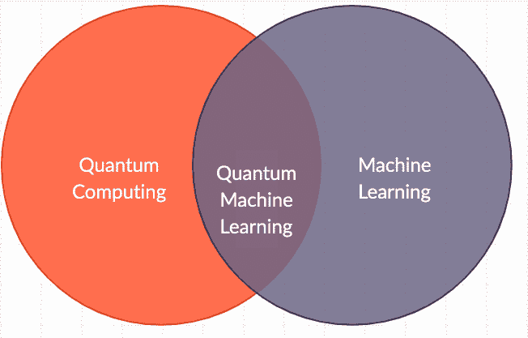
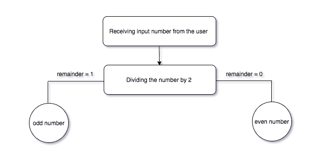
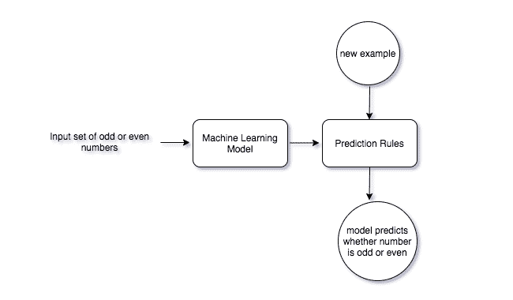
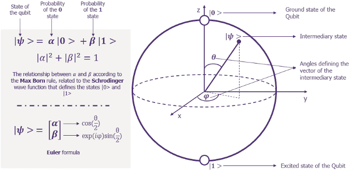
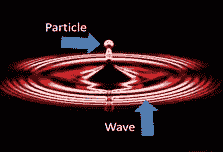
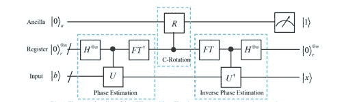
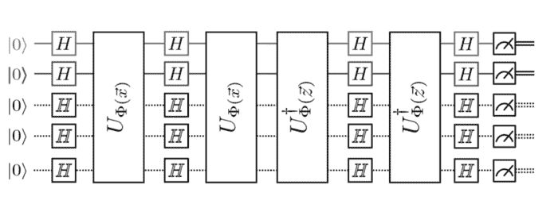
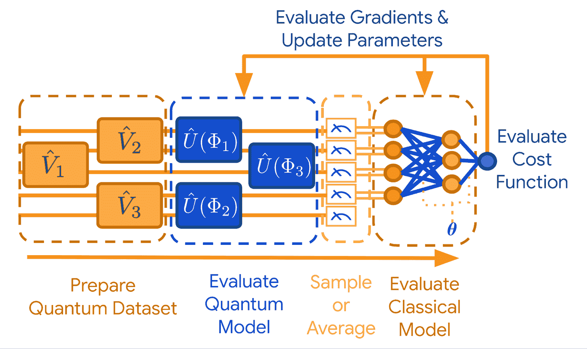
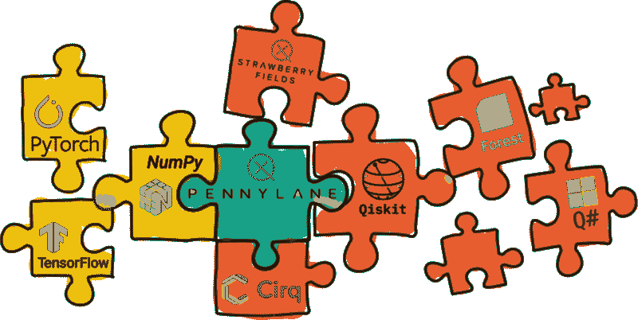
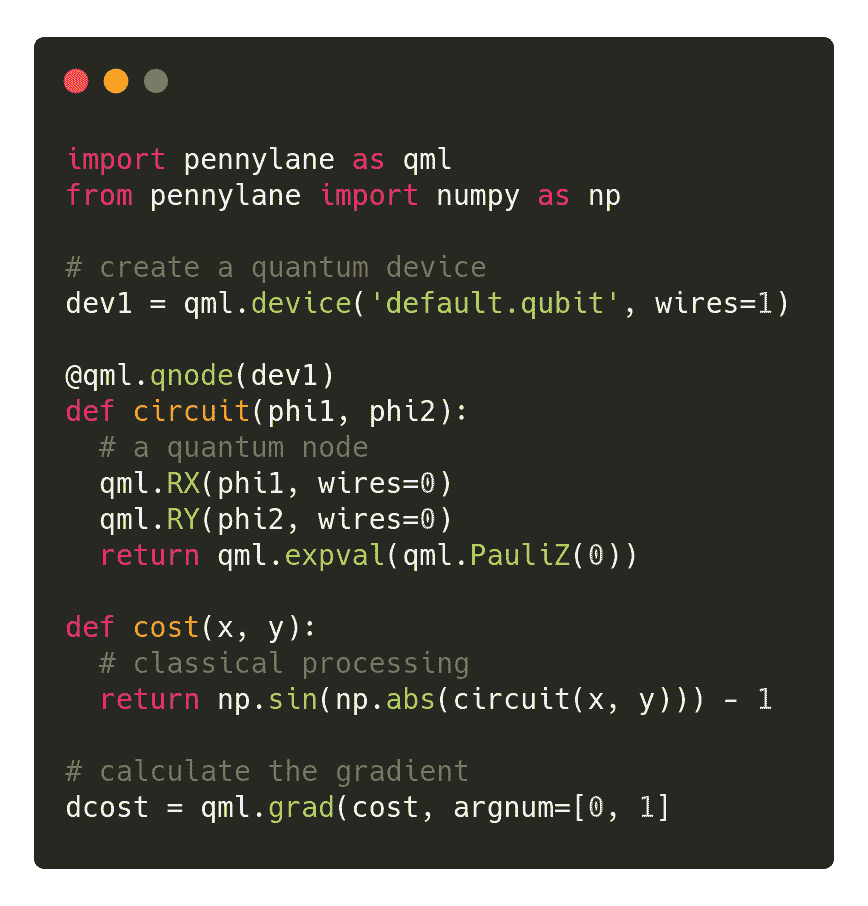

# 量子机器学习入门指南

> 原文：<https://blog.paperspace.com/beginners-guide-to-quantum-machine-learning/>

作为一名数据科学家和研究人员，我总是试图找到每天遇到的问题的答案。在处理现实世界的问题时，我遇到了时间和计算上的许多复杂性。已经有很多经典的机器学习和深度学习算法不起作用的情况，我的电脑最终崩溃了。

在封锁期间，我偶然发现了一个很酷的新科幻系列，叫做 Hulu 上的 *Devs* 。 *Devs* 探索世界各地正在发生的量子计算和科学研究。这让我想到了量子理论，量子计算是如何产生的，以及量子计算机如何用于预测未来。

经过进一步研究，我发现了量子机器学习(QML)，这在当时对我来说是一个非常新的概念。这个领域既令人兴奋又有用；它可以帮助解决计算和时间复杂性的问题，就像我面临的那些问题。因此，我选择 QML 作为进一步研究的主题，并决定与大家分享我的发现。

量子机器学习是一个刚刚开始发展的理论领域。它位于量子计算和机器学习的交叉点。

量子机器学习的主要目标是通过将我们从量子计算中了解的知识应用到机器学习中来加快速度。量子机器学习理论从经典机器学习理论中汲取元素，并从这个角度看待量子计算。

## 内容

这篇文章将涵盖以下主要话题:

1.  经典编程与经典机器学习和量子机器学习的比较
2.  量子计算的所有基本概念
3.  量子计算如何改进经典的机器学习算法

## 经典编程 vs .经典机器学习 vs .量子机器学习

为了比较经典编程、经典机器学习和量子机器学习，让我们考虑确定一个数是偶数还是奇数的简单问题。

解决方案很简单:首先你需要从用户那里得到一个数字，然后你把这个数字除以 2。如果你得到一个余数，那么这个数是奇数。如果你得不到余数，那么这个数就是偶数。

如果您想使用传统的编程方法编写这个特定的程序，您将遵循三个步骤:

1.  获取输入
2.  处理输入
3.  产生输出

这是经典编程范例的工作流程。

The workflow of classical programming using the above example 

处理是通过我们为数字分类(偶数或奇数)定义的规则来完成的。

同样，让我们看看如何使用机器学习方法来解决这个特殊的问题。在这种情况下，事情有点不同。首先，我们创建一组输入和输出值。在这里，方法是将输入和预期输出一起输入到机器学习模型，该模型应该学习规则。有了机器学习，我们不会告诉计算机如何解决问题；我们设置了一个场景，在这个场景中，程序会自己学习这样做。

从数学上来说，我们的目标是找到 *f* ，给定 *x* 和 *y* ，这样:

> y = f(x)

The workflow of Classical Machine Learning using the above example

让我们转向量子计算。每当你想到“量子”这个词，它可能会引发原子或分子的想法。量子计算机也是由类似的想法组成的。在传统的计算机中，处理发生在比特级。在量子计算机的例子中，有一种特定的行为控制着系统；即量子物理学。在量子物理学中，我们有各种各样的工具用来描述不同原子之间的相互作用。在量子计算机的情况下，这些原子被称为“量子比特”(我们将在后面详细讨论)。一个量子位同时扮演着粒子和波的角色。与粒子(或比特)相比，波分布存储了大量数据。

损失函数用于检查机器学习解决方案的准确性。在训练机器学习模型并获得其预测时，我们经常观察到所有的预测都不正确。损失函数由一些数学表达式表示，其结果显示了算法错过目标的程度。

量子计算机也旨在减少损失函数。它有一种称为量子隧道的特性，可以搜索整个损失函数空间，找到损失最低的值，从而使算法以最快的速度发挥最佳性能。

## 量子计算的基础

在深入研究量子机器学习之前，读者应该熟悉基本的量子计算术语，这里将讨论这些术语。

### 布雷克记号

在量子力学和量子物理学中，“Bra-ket”符号或“Dirac”符号用于写方程。读者(尤其是初学者)一定知道这个，因为他们在阅读涉及量子计算的研究论文时会碰到。

该符号使用尖括号和竖线来构造“bras”和“kets”。

一首《偈》大概是这样的:**| v \8592;**。数学上，它表示复向量空间 *V* 中的向量 **v** 。在物理上，它代表了一个量子系统的状态。

一个“胸罩”长这样: **〈f|** 。数学上，它表示一个线性函数 *f: V → C* ，即把 *V* 中的每个向量映射到复平面 *C* 中的一个数的线性映射。

让一个线性函数 **〈f|** 作用于一个矢量**| v÷T3，写作:**

> □c

波函数和其他量子态可以用 Bra-ket 符号表示为复态中的矢量。量子叠加也可以用这个符号来表示。其他应用包括波函数归一化，以及与线性算子相关的测量。

### “量子位”的概念和叠加态

量子计算使用的是“*量子位”*，而不是经典计算机使用的“*位”*。一个比特指的是一个*二进制数字*，它构成了经典计算的基础。术语“量子位”代表*量子二进制数字。*虽然比特只有两种状态——0 和 1——但量子比特可以同时有多种状态。该值介于 0 和 1 之间。

为了更好地理解这个概念，举一个抛硬币的例子。一枚硬币有两面，正面(1)或反面(0)。在扔硬币的时候，我们不知道它是哪一边的，直到我们停下来或者它掉在地上。看看下面的抛硬币。你能说出它有哪一面吗？它根据你的视角显示 0 和 1；只有当你停下来看的时候，它才显示出一面。量子位的情况类似。

这就是所谓的**叠加** 的两种状态。这意味着测量 0 或 1 的概率通常既不是 0.0 也不是 1.0。换句话说，quibit 有可能同时处于不同的状态。在抛硬币的情况下，当我们得到结果(正面或反面)时，叠加态就崩溃了。

### 布洛赫球

布洛赫球是量子位的数学表示。它用一个正常长度为 1 的二维向量来表示一个量子位的状态。这个向量有两个元素:实数α和复数β。

The Bloch Sphere ([source](https://medium.com/meetech/highlighting-quantum-computing-for-machine-learning-1f1abd41cb59))

一个量子位可以被认为是两个状态的叠加，可以用下面的语句来表示，如上图所示:

> |ψ〉 = α |0〉 + β |1〉

由于光学的历史原因，布洛赫球也称为庞加莱球，专门代表不同类型的偏振。存在六种常见的极化类型，称为[琼斯矢量](https://en.wikipedia.org/wiki/Jones_calculus#Jones_vectors)。的确，[亨利·庞加莱](https://en.wikipedia.org/wiki/Henri_Poincar%C3%A9)在 19 世纪末第一个提出使用这种几何表示法，作为[斯托克斯参数](https://en.wikipedia.org/wiki/Stokes_parameters)的三维表示法。

### 量子退相干

量子位的叠加会导致像量子退相干这样的问题。这些是由于系统中的噪声而随机自然发生的不必要的崩溃。最终，这会导致计算错误。如果你认为一个量子位处于叠加态，而它并不处于叠加态，我们对它进行操作，它会给你一个不同于你预期的答案。这就是为什么我们会多次反复运行同一个程序，类似于训练一个机器学习模型。

#### 是什么导致了量子退相干？

量子系统需要与环境隔离，因为与环境接触是导致量子退相干的原因。

量子位被冷却到接近绝对零度。当量子位与环境相互作用时，来自环境的信息漏入其中，而来自量子位内部的信息则泄漏出去。泄漏出来的信息很可能是未来或当前计算所需要的，而泄漏进来的信息是随机噪声。

这个概念与热力学第二定律非常相似，该定律指出:

> “一个孤立系统的总熵永远不会随时间而减少，当且仅当所有过程都是可逆的时，它才是常数。孤立系统自发地向热力学平衡演化，即熵最大的状态。”

因此，量子系统需要处于相干状态。与较大的物体，如一本书或一张桌子相比，量子退相干在微小的粒子中更明显。事实上，所有的材料都有一个特定的波长，但是物体越大，它的波长就越小。

### 量子纠缠

量子纠缠的概念是指如果我们取两个量子比特，它们总是处于两个态的叠加状态。这里有一个例子。假设有一个盒子，里面有一副手套。随机从盒子里拿出一只手套。然后盒子被带到另一个房间。取出的手套被发现是右撇子，所以我们自动知道仍在盒子里的手套是左撇子。

量子位也是如此。如果一个处于向上旋转位置，则另一个自动处于向下旋转位置。不存在两个量子位处于相同状态的情况。换句话说，他们总是纠缠不清。这就是所谓的量子纠缠。

### 双重原则

量子位同时展现了波和粒子的特性。事实上，所有的物体都是如此，但在原子大小的物体中，如量子位，它们可以被观察得更清楚。波粒二象性使量子位能够通过干涉相互作用。

### 量子加速

量子相干性有助于量子计算机以经典计算机无法做到的方式处理信息。量子算法执行逐步过程来解决问题，例如搜索数据库。它可以胜过最著名的经典算法。这种现象被称为量子加速。

## 量子计算如何改进经典机器学习

现在你已经了解了量子计算的一些基本概念，让我们讨论一下量子计算机用来解决机器学习问题的一些方法。下面列出了我们将要研究的技术:

*   量子机器学习解决线性代数问题
*   量子主成分分析
*   量子支持向量机和核方法
*   量子优化
*   深度量子学习

### 1)量子机器学习解决线性代数问题

通过对高维向量空间中的向量执行矩阵运算来解决各种各样的数据分析和机器学习问题。

在量子计算中，量子位的量子状态是二维复向量空间中的一个向量。在这个空间中会发生很多矩阵变换。量子计算机可以解决常见的线性代数问题，例如傅立叶变换，寻找特征向量和特征值，以及在 a 中为多项式的时间内求解二维向量空间上的线性方程组(并且由于量子加速比经典计算机快很多)。其中一个例子是哈罗、哈西迪姆和劳埃德(HHL)算法。

[The circuit diagram of the HHL Algorithm](https://www.osapublishing.org/oe/fulltext.cfm?uri=oe-27-3-3369&id=404549)

### 2)量子主成分分析

主成分分析是一种降维技术，用于降低大型数据集的维数。降维是以准确性为代价的，因为我们需要决定在不丢失重要信息的情况下消除哪些变量。如果做得正确，它会使机器学习任务变得更加舒适，因为它更方便处理更小的数据集。

例如，如果我们有一个有十个输入属性的数据集，那么主成分分析可以由经典计算机有效地执行。但是，如果输入数据集有一百万个特征，传统的主成分分析方法将会失败，因为我们很难可视化每个变量的重要性。

经典计算机的另一个问题是特征向量和特征值的计算。输入的维数越高，相应的特征向量和特征值的集合就越大。量子计算机通过使用量子随机存取存储器(QRAM)随机选择一个数据向量，可以非常高效、非常高速地解决这个问题。它使用量子位将向量映射成量子态。

量子主成分分析后得到的概括向量具有对数量子位。选择的随机向量形成密集矩阵。这个矩阵实际上是协方差矩阵。

通过对数据进行重复采样，并使用一种称为密度矩阵求幂的技巧，结合量子相位估计算法(计算矩阵的特征向量和特征值)，我们可以获得任何数据向量的量子版本，并将其分解为其主分量。因此，计算复杂度和时间复杂度都以指数方式降低。

[Quantum Circuit to perform Principal Component Analysis](https://link.springer.com/article/10.1007/s11128-019-2364-9)

### 3)量子支持向量机

[支持向量机](https://blog.paperspace.com/implementing-support-vector-machine-in-python-using-sklearn/)是一种经典的机器学习算法，用于分类和回归。对于分类任务，它用于将可线性分离的数据集分类到它们各自的类中。假设，如果数据不是线性可分的，那么它的维数增加，直到它是线性可分的。

在经典计算机中，SVM 只能在特定的维数下执行。过了一个特定的极限，就会很难，因为这样的计算机没有足够的处理能力。

然而，量子计算机可以以指数级更快的速度执行支持向量算法。叠加纠缠的原理让它高效工作，更快出结果。

[Quantum Circuit to perform SVM](https://medium.com/@patrick.huembeli/introduction-into-quantum-support-vector-machines-727f3ccfa2b4)

### 4)量子优化

如果你试图用最少的资源产生最好的产出，这就是优化。在机器学习模型中使用优化来改进学习过程，以便它可以提供最充分和最准确的估计。

优化的主要目标是最小化损失函数。更大的损失函数意味着将有更不可靠和更不精确的输出，这可能是昂贵的并导致错误的估计。

机器学习中的大多数方法需要迭代优化它们的性能。量子优化算法在解决机器学习中的优化问题方面提出了改进。量子纠缠的性质使得能够产生以量子状态编码的本溶液的多个副本。它们用于在机器学习算法的每一步改进该解决方案。

### 5)深度量子学习

量子计算可以与深度学习相结合，以减少训练神经网络所需的时间。通过这种方法，我们可以为深度学习和执行底层优化引入新的框架。我们可以在实际的、真实世界的量子计算机上模拟经典的深度学习算法。

当实现多层感知器架构时，计算复杂度随着神经元数量的增加而增加。专用 GPU 集群可用于提高性能，显著减少训练时间。然而，与量子计算机相比，即使这样也会增加。

量子计算机本身的设计方式是，硬件可以模仿神经网络，而不是经典计算机中使用的软件。在这里，量子位充当神经元，构成神经网络的基本单元。因此，包含量子位的量子系统可以充当神经网络，并可以以超过任何经典机器学习算法的速度用于深度学习应用。

[Deep Quantum Learning](https://ai.googleblog.com/2020/03/announcing-tensorflow-quantum-open.html)

## 量子机器学习的模拟

PennyLane 是一款来自 [Xanadu](http://xanadu.io) 的开源软件，用于执行量子机器学习的模拟。它将经典的机器学习包与量子模拟器和硬件相结合。

[PennyLane works with all the basic python packages](https://pennylane.ai/)

PennyLane 支持不断增长的生态系统，包括各种各样的量子硬件和机器学习库。

> “虽然社区仍在致力于容错量子计算，但 PennyLane 和硬件产品允许企业客户今天就开始利用量子计算”

——内森·基洛兰，Xanadu 软件和算法主管。

[Basic PennyLane code snippet](https://pennylane.ai/)

## 结论

在这篇文章中，我们看了量子计算的基础知识，它可以用来实现机器学习。

量子机器学习是一个不断发展的领域，研究人员表示，到 21 世纪 30 年代中期，量子计算机将变得流行，人们将开始使用它们。

在这里，我们首先将经典编程与经典机器学习和量子机器学习进行了对比。我们发现量子机器学习算法是其中最好的。

然后，我们深入研究了量子计算的基础知识。我们讨论了:

*   bra-ket 符号，用于写量子物理中的方程。
*   量子位的概念和控制量子位状态的叠加定理。
*   布洛赫球，在数学上用来表示量子位的状态
*   量子退相干及其原因
*   量子纠缠的一个例子
*   对象的双重原则
*   量子加速

现在，读者已经熟悉了基本的量子计算术语，我们通过使用以下方法来研究量子计算如何增强经典机器学习:

*   量子机器学习解决线性代数问题，
*   量子主成分分析，
*   量子支持向量机和核方法，
*   量子优化，以及
*   深度量子学习。

在所有这些技术中，我们研究了量子系统如何比经典系统工作得更好。

我们还看到并简要了解了 PennyLane，这是一种用于模拟量子机器学习算法的开源软件。

简而言之，量子计算的未来将见证我们解决当今世界面临的一些最复杂的问题。

量子机器学习有巨大的机会颠覆许多行业。金融、制药和安全行业将在最短的时间内看到最大的变化。

虽然一些专家警告说这种能力可能会被用于危险的目的，但电气和电子工程师协会(IEEE )量子计算标准工作组主席威廉·赫尔利认为好处会超过坏处。据他说:

> “对于任何新的技术进步，我们总是有理由降低乐观情绪。尽管如此，我对量子计算的潜在积极成果感到非常兴奋。从发现疾病的新疗法到帮助发现新粒子，我认为这是我整个职业生涯中最兴奋的一次。我们应该像关注负面结果一样关注正面结果。”

换句话说，量子机器可以让我们过上更好的生活，如果有效使用，可以消除我们增强机器学习算法的道路上的许多障碍。

## 参考

本文是对各种来源进行研究的结果，列举如下:

1.  [量子机器学习和 PennyLane 作者 Maria Schuld | QWorld](https://www.youtube.com/watch?v=pe1d0RyCNxY&t=799s)
2.  [量子位和门——量子计算机编程](https://www.youtube.com/watch?v=lB_5pC1MkGg&t=1231s)
3.  [强调机器学习的量子计算](https://medium.com/meetech/highlighting-quantum-computing-for-machine-learning-1f1abd41cb59)
4.  [量子计算和量子信息](http://csis.pace.edu/~ctappert/cs837-19spring/QC-textbook.pdf)
5.  [pennylane.ai](https://pennylane.ai/)