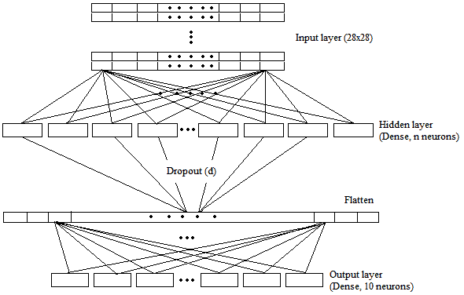
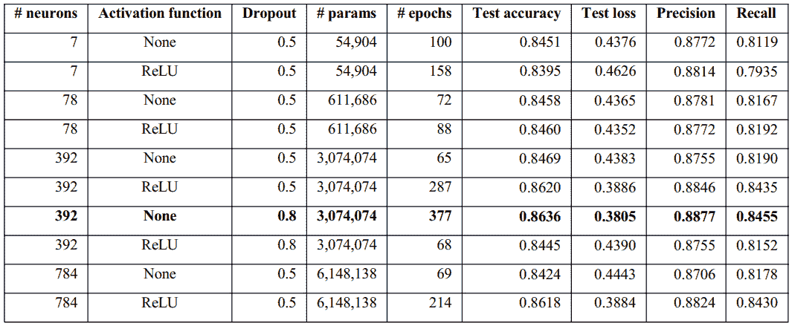
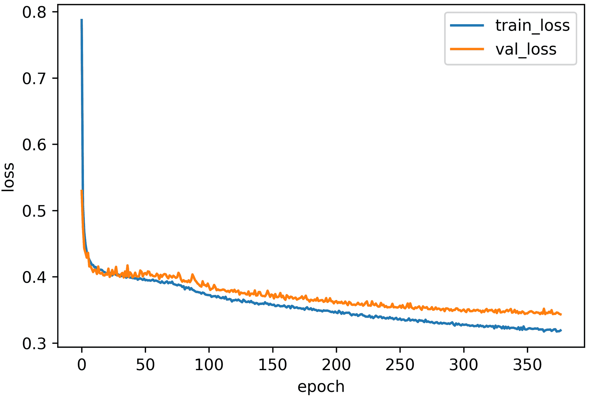
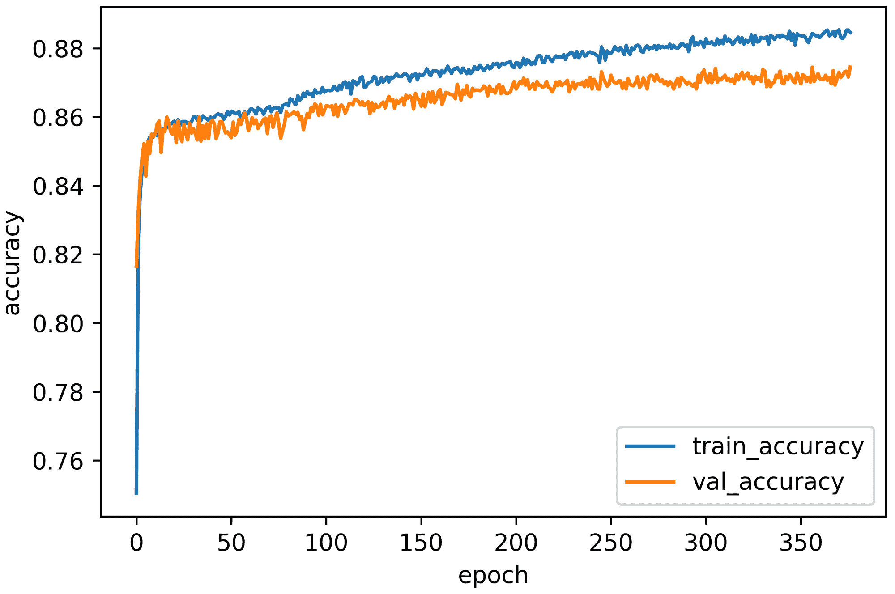
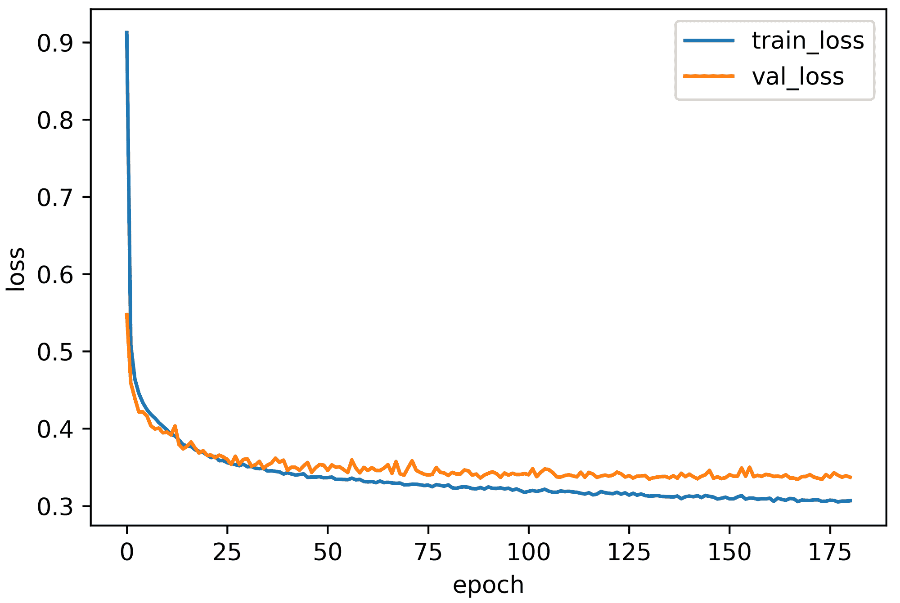
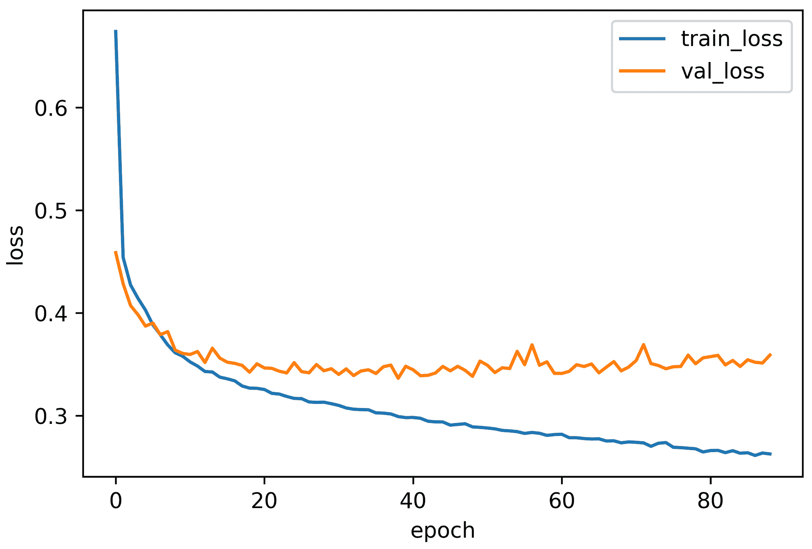

# 用 Keras 微调浅层网络进行有效的图像分类

> 原文：<https://blog.paperspace.com/fine-tuning-shallow-networks-keras/>

具有广泛深度架构的神经网络通常包含数百万个参数，这使得训练它们在计算上既昂贵又耗时。在本教程中，我们将使用 DenseNet 实现最先进的图像分类性能，最初只有一个隐藏层。在这项研究中，我们系统地调整了隐藏层中神经元的数量，并在基准图像分类数据集上训练了我们的模型。这项研究表明，建立更深层次的神经网络并不总是必要的；相反，更重要的是关注每层神经元的正确数量。

您可以跟随代码并从 [ML Showcase](https://ml-showcase.paperspace.com/projects/fine-tuning-shallow-neural-networks-with-keras) 中免费运行它。

## 介绍

2012 年，Krizhevsky 等人推出了用于图像分类的 Alex net ＄[ 1]＄,它拥有 66 万个神经元，6100 万个参数和 6 亿个连接。作者花了六天时间在两个 Nvidia Geforce GTX 580 GPU 上并行训练他们的网络超过 90 个时代。后来，在 2014 年，西蒙扬等人推出了 VGG-16。它总共包含 138M 个参数。从那时起，设计越来越复杂的神经网络结构，结合大量的参数，已经成为一种趋势。

### 动机

创建更深层次的神经网络需要更复杂的硬件，如高 GPU 内存，这可能很昂贵。训练一个网络几天或几周也不总是可行的。在这项研究中，我们调整了神经元的数量、不同的激活功能、辍学率，并且只有一层，试图获得 AlexNet 级别的准确性。我们在肖等人介绍的时尚基准数据集上进行了实验。

### 目标

本实验的主要目标是在不影响性能的情况下，用尽可能少的参数确定最佳神经网络架构。此外，这项工作还揭示了具有最佳神经元数量的隐藏层的能力。此外，我们尽力保持我们的方法尽可能简单，没有花哨的阶段，如图像放大，图像放大，或其他。标准 AlexNet 需要 256×256 RGB 图像，但我们应用了 28×28 灰度图像，并比较了性能，以便在低质量数据集上对浅层网络稳定性有一个适当的了解。这项研究对于提高低内存资源的性能尤为重要，因为即使是 256×256 灰度图像数据集也需要大量内存。

## 资料组

时尚-MNIST 数据集包含 60，000 个训练和 10，000 个测试 28×28 像素灰度图像，跨越 10 个类别$[3]$。据马等报道，AlexNet 在时尚数据集上的准确率为 86.43% $[4]$。

关于 AlexNet 输入的说明(从[到此处](https://www.learnopencv.com/understanding-alexnet/#:~:text=The%20input%20to%20AlexNet%20is,of%20size%20256%C3%97256.)):

> AlexNet 的输入是大小为 256×256 的 RGB 图像。这意味着训练集中的所有图像和所有测试图像的大小都需要为 256×256。

> 如果输入图像不是 256×256，则需要将其转换为 256×256，然后再用于训练网络。为此，将较小的尺寸调整为 256，然后裁剪生成的图像以获得 256×256 的图像。
> ...
> 如果输入图像是灰度图像，则通过复制单通道以获得 3 通道 RGB 图像，将其转换为 RGB 图像。

我们将在本文中为每一步提供相应的代码片段。我们将 Keras 用于实现目的。注意你可以在 Gradient 上免费运行代码[。](https://ml-showcase.paperspace.com/projects/fine-tuning-shallow-neural-networks-with-keras)

导入数据集

```py
import keras

(x_train, y_train), (x_test, y_test) = keras.datasets.fashion_mnist.load_data()

print('x_train.shape =',x_train.shape)
print('y_train.shape =',y_train.shape)
print('x_test.shape =',x_test.shape)
print('y_test.shape =',y_test.shape) 
```

预期产出:

```py
x_train.shape = (60000, 28, 28)
y_train.shape = (60000,)
x_test.shape = (10000, 28, 28)
y_test.shape = (10000,) 
```

获取数据集中的类的数量

```py
import numpy as np

num_classes = np.unique(y_test).shape[0]
print('num_classes =', num_classes) 
```

预期产出:

```py
num_classes = 10 
```

#### 数据准备

归一化数据集中＄[ 0，1]$范围内的每个图像矩阵中的值:

```py
x_train_norm = x_train/255
x_test_norm = x_test/255 
```

密集网络期望输入形状为(batch_size，width，height，channel)。因此，扩展了训练和测试数据集的维度:

```py
final_train_imageset = np.expand_dims(x_train_norm, axis = 3)
final_test_imageset = np.expand_dims(x_test_norm, axis = 3)

y_train2 = np.expand_dims(y_train, axis = 1)
y_test2 = np.expand_dims(y_test, axis = 1)

print('final_train_imageset.shape =', final_train_imageset.shape)
print('final_test_imageset.shape =', final_test_imageset.shape)
print('y_train2.shape =', y_train2.shape)
print('y_test2.shape =', y_test2.shape) 
```

预期产出:

```py
final_train_imageset.shape = (60000, 28, 28, 1)
final_test_imageset.shape = (10000, 28, 28, 1)
y_train2.shape = (60000, 1)
y_test2.shape = (10000, 1) 
```

为了使用[分类交叉熵](https://keras.io/api/losses/probabilistic_losses/#categorical_crossentropy-function)作为损失函数，我们必须对标签应用一键编码。

```py
final_train_label = keras.utils.to_categorical(y_train2, num_classes)
final_test_label = keras.utils.to_categorical(y_test2, num_classes)

print('final_train_label.shape =',final_train_label.shape)
print('final_test_label.shape =',final_test_label.shape) 
```

预期产出:

```py
final_train_label.shape = (60000, 10)
final_test_label.shape = (10000, 10) 
```

## 通用 DenseNet 结构

我们首先只用一个隐藏层进行了彻底的实验。在本文的后面，我们将向两个性能最佳的单层架构添加另一个隐藏层。

### 单层 DenseNet



Fig 1\. A generic Dense network with single hidden layer.

在图 1 中，我们已经可视化了带有一个隐藏层的通用 DenseNet 结构。它包含三层:输入层、隐藏层和输出层。在输入层，28×28 像素的图像被提供给网络。输出层具有对应于十个类别的十个神经元。我们根据图像中的总像素数来调整隐藏层中神经元的数量。一幅图像有 28×28 (784)个像素。我们开始用相当于总像素数 1%的神经元数量( *n* )来训练我们的模型，也就是只有 7 个神经元(784×0.01)。然后，我们逐渐增加了 78 (10%)、392 (50%)和 784 (100%)个神经元。隐藏层的输出在输出层之前被展平。

设置必要的参数和变量:

```py
percentile = 1.0 # 1.0, 0.5, 0.1, 0.01

NUM_NEURONS = (x_train.shape[1]*x_train.shape[2])*percentile
NUM_LAYERS = 1
BATCH_SIZE = 128
NUM_EPOCHS = 3000
LEARNING_RATE = 0.0001
EPSILON = 1e-4
DROPOUT = 0.5 # 0.5, 0.8

LOSS = 'categorical_crossentropy'
DENSE_ACTIVATION_FUNCTION = 'default' # default, relu, LeakyReLU, PReLU, ELU
FINAL_ACTIVATION_FUNCTION = 'softmax'
early_stop_after_epochs = 50 # stop after 50 consecutive epochs with no improvement
validation_split = 0.1

checkpointer_name = "weights.Dense.Fashion.nLayers"+str(NUM_LAYERS)+".nNeurons"+str(NUM_NEURONS)+".act."+DENSE_ACTIVATION_FUNCTION+".p"+str(percentile)+".dropout"+str(DROPOUT)+".batch"+str(BATCH_SIZE)+".hdf5" 
```

总的来说，我们对隐藏层使用了 50%的落差( *d* )。然而，在两种情况下，我们应用了 80%的压降来减少过度拟合。每个隐藏单元在没有任何激活功能的情况下进行测试，并且有一个 ReLU 激活。在最后一层，我们应用 softmax 激活作为分类器。此外，在所有情况下，我们用零初始化偏差，并使用`glorot_uniform`作为内核初始化器。它有助于网络更快地收敛到最优解。所有的任务都是用 Keras 函数 API 实现的。

选择激活功能列表:

```py
def dense_activation():
    if DENSE_ACTIVATION_FUNCTION == 'relu':
        keras.layers.ReLU(max_value=None, negative_slope=0, threshold=0)
    elif DENSE_ACTIVATION_FUNCTION == 'LeakyReLU':
        keras.layers.LeakyReLU(alpha=0.3)
    elif DENSE_ACTIVATION_FUNCTION == 'PReLU':
        keras.layers.PReLU(tf.initializers.constant(0.3)) # "zeros"
    elif DENSE_ACTIVATION_FUNCTION == 'ELU':
        keras.layers.ELU(alpha=1.0)
    elif DENSE_ACTIVATION_FUNCTION == 'default':
        return None 
```

对于隐层中相应的 7、78、392 和 784 个神经元，可训练参数的总数约为 54K、611K、3M 和 6.1M。没有不可训练的参数。我们抽取 10%的训练数据进行验证，并继续训练每个模型，直到有 50 个连续的时期验证损失没有改善。

型号代码:

```py
from keras.layers import *
from keras.models import * #Model, load_model

input_shape = final_train_imageset.shape[1:]

# Input tensor shape
inputs = Input(input_shape)

x = inputs
for _ in range(NUM_LAYERS):
    x = Dense(NUM_NEURONS, activation=dense_activation())(x)
    x = Dropout(DROPOUT)(x)

x = Flatten()(x)
outputs = Dense(num_classes, activation=FINAL_ACTIVATION_FUNCTION)(x)

model = Model(inputs=inputs, outputs=outputs)
model.summary() 
```

结构应该如下所示:

```py
Model: "functional_9"
_________________________________________________________________
Layer (type)                 Output Shape              Param #   
=================================================================
input_6 (InputLayer)         [(None, 28, 28, 1)]       0         
_________________________________________________________________
dense_8 (Dense)              (None, 28, 28, 784)       1568      
_________________________________________________________________
dropout_4 (Dropout)          (None, 28, 28, 784)       0         
_________________________________________________________________
flatten_4 (Flatten)          (None, 614656)            0         
_________________________________________________________________
dense_9 (Dense)              (None, 10)                6146570   
=================================================================
Total params: 6,148,138
Trainable params: 6,148,138
Non-trainable params: 0
_________________________________________________________________ 
```

定义一些广泛使用的优化器:

```py
optimizer_1 = keras.optimizers.RMSprop(lr = LEARNING_RATE, epsilon=EPSILON)
optimizer_2 = keras.optimizers.Adam(lr = LEARNING_RATE, epsilon=EPSILON, beta_1=0.9, beta_2=0.999, amsgrad=False)
optimizer_3 = keras.optimizers.SGD(lr = LEARNING_RATE, momentum=0.85) 
```

让我们选择 Adam optimizer 并编译模型:

```py
model.compile(
    optimizer=optimizer_2, # 'Adam'
    loss=LOSS,
    metrics=['accuracy', 'Precision', 'Recall']
) 
```

设置模型检查指针:

```py
from tensorflow.keras.callbacks import EarlyStopping, ModelCheckpoint

checkpointer_best = ModelCheckpoint(filepath = checkpointer_name, 
                                    monitor='val_loss', 
                                    save_weights_only=False,
                                    mode='auto',  
                                    verbose = 2, 
                                    save_best_only = True
                                    )

early_stopping = EarlyStopping(monitor='val_loss', patience=early_stop_after_epochs) 
```

训练模型:

```py
list_callbacks = [checkpointer_best, early_stopping]

history = model.fit(final_train_imageset, final_train_label, 
                        shuffle=True, 
                        batch_size = BATCH_SIZE, 
                        epochs = NUM_EPOCHS,
                        validation_split = validation_split,
                        callbacks=list_callbacks
                    ) 
```

### 单层 DenseNet 的性能评价

现在，加载训练好的模型，并使用测试集进行评估:

```py
model_loaded = load_model(checkpointer_name)
result = model_loaded.evaluate(final_test_imageset, final_test_label) 
```

我们在表 1(下面)中总结了我们的实验结果。



Table 1\. Performance evaluation for the applied single-layer models in comparison to AlexNet (accuracy 86.43%).

由于单层模型中最高的测试准确度(86.20%)和最低的测试损失(0.39)是用 392 个神经元(具有 ReLU 激活)实现的，因此我们用 392 个神经元训练模型，其中 80%的神经元在激活和未激活的情况下都丢失。需要注意的一点是，就测试准确性而言，第二好的模型也是 392 个神经元；但是，没有激活(84.69%)。

最后，对于丢失率为 80%的 392 个隐藏神经元，在没有激活的 377 个时期内，相应的测试准确度、测试丢失率、精确度和召回率分别为 86.36%、0.38%、88.77%和 84.55%。然而，在 ReLU 激活的情况下，仅 68 个时期的相应结果分别为 84.45%、0.44%、87.55%和 81.52%。

总的来说，由 392 个隐藏单元组成的模型实现了最佳性能，其中 80%的丢失没有任何激活功能。性能( **86.36%** 测试准确率)与 AlexNet 的准确率水平(86.43%)相差无几。

让我们绘制学习曲线:

```py
import matplotlib.pyplot as plt

plt.plot(history.history['loss'])
plt.plot(history.history['val_loss'])
plt.title(title)
plt.ylabel('loss')
plt.xlabel('epoch')
plt.legend(['train_loss','val_loss'], loc = 'best') 
```



Fig 2\. Training loss vs. validation loss for the single-layer model with 392 neurons and 80% dropout.

此外，在培训时可视化培训和验证准确性趋势:

```py
plt.plot(history.history['accuracy'])
plt.plot(history.history['val_accuracy'])
plt.title(title)
plt.ylabel('accuracy')
plt.xlabel('epoch')
plt.legend(['train_accuracy','val_accuracy'], loc = 'best') 
```



Fig 3\. Training accuracy vs. validation accuracy for the single-layer model with 392 neurons with 80% dropout.

### 多层 DenseNet

现在，我们已经用单个隐藏层对网络中的神经元数量进行了调整，让我们添加另一个隐藏层。这里，我们研究了两个不同的双隐藏层网络。第一个包含 78 个神经元，第二个在每个隐藏层包含 392 个神经元。

### 多层 DenseNet 的性能评估

对于第一种架构，测试损失、测试准确度、精确度和召回率分别为 0.3691、**、86.71%** 、89%和 84.72%。图 4 显示了该网络的训练与验证曲线。



Fig 4\. Training loss versus validation loss for the model with 2 layers (78 neurons and 50% dropout in each layer).

相反，第二种网络架构的性能分别为 0.3721、**、86.66%** 、88.87%和 84.91%。图 5 展示了学习曲线(验证损失)与训练损失曲线的对比。



Fig 5\. Training loss versus validation loss for model with 2 layers (392 neurons and 50% dropout in each layer).

请注意，虽然单个隐藏层中的几个实现几乎达到了 AlexNet 级别的精度，但是两个具有双隐藏层的实现都克服了 AlexNet 的性能。此外，添加更多的神经元并不总能得到更好的结果，并且会使神经网络更容易受到过拟合的影响。

## 对未来贡献的建议

在这项工作中，我们体验了浅层网络中隐藏神经元学习数据的强大能力。我们将单隐层和双隐层模型与更深的 AlexNet 架构进行了比较。尽管如此，这些结果应该用其他基准[数据集](https://www.tensorflow.org/datasets/catalog/overview#image_classification)进一步深入研究。此外，我们可以检查这些行为是否适用于低得多的维度的图像。我们应该另外构建一个相似类型的浅层卷积模型来观察效果。考虑具有正确配置的最佳数量的神经元，我们希望这种类型的浅层模型将在很大程度上消除我们对重量级模型的需要，从而降低昂贵的硬件要求和时间复杂性。

## 参考

1.  Krizhevsky，a .，Sutskever，I .，& Hinton，G. E. (2012 年)。基于深度卷积神经网络的图像网分类。神经信息处理系统进展(第 1097-1105 页)。
2.  Simonyan 和 a . zisser man(2014 年)。用于大规模图像识别的非常深的卷积网络。arXiv 预印本 arXiv:1409.1556。
3.  肖，h .，拉苏尔，k .，，沃尔格拉夫，R. (2017)。Fashion-mnist:一种用于机器学习算法基准测试的新型图像数据集。arXiv 预印本 arXiv:1708.07747。
4.  马，李，夏，杨，张(2020)。自主深度学习:用于图像分类的遗传 DCNN 设计器。神经计算，379，152-161。