# 评估深度学习模型:混淆矩阵、准确度、精确度和回忆

> 原文：<https://blog.paperspace.com/deep-learning-metrics-precision-recall-accuracy/>

在计算机视觉中，目标检测是在图像中定位一个或多个目标的问题。除了传统的对象检测技术，像 R-CNN 和 [YOLO](https://blog.paperspace.com/how-to-implement-a-yolo-object-detector-in-pytorch/) 这样的高级深度学习模型可以对不同类型的对象进行令人印象深刻的检测。这些模型接受图像作为输入，并返回每个检测到的对象周围的边界框的坐标。

本教程讨论混淆矩阵，以及如何计算精度，召回和准确性。在另一个教程中，将讨论地图。

具体来说，我们将涵盖:

*   二元分类的混淆矩阵
*   多类分类的混淆矩阵
*   用 Scikit-learn 计算混淆矩阵
*   准确度、精确度和召回率
*   精准还是召回？
*   结论

## **二元分类的混淆矩阵**

在二元分类中，每个输入样本被分配到两个类别之一。通常这两个类被赋予类似于 *1* 和 *0* 或*正* 和*负*的标签。更具体地说，这两个类标签可能是类似于*恶性* 或*良性*(例如，如果问题是关于癌症分类)，或者*成功*或*失败*(例如，如果是关于对学生考试成绩进行分类)。

假设有一个二元分类问题，类别*为正*和*为负*。以下是用于训练模型的七个样本的标签示例。这些被称为样本的**地面真相标签**。

```py
positive, negative, negative, positive, positive, positive, negative
```

请注意，类别标签用于帮助我们人类区分不同的类别。对模型非常重要的是一个数字分数。当向模型输入单个样本时，模型不一定返回类别标签，而是返回分数。例如，当这七个样本被输入到模型中时，它们的类得分可能是:

```py
0.6, 0.2, 0.55, 0.9, 0.4, 0.8, 0.5
```

根据分数，每个样本被赋予一个类别标签。我们如何将这些分数转换成标签？我们通过使用阈值来做到这一点。该阈值是模型的超参数，可以由用户定义。例如，阈值可以是 0.5，那么任何大于或等于 0.5 的样本都被赋予*正*标签。否则，就是*负*。以下是样品的**预测标签**:

```py
positive (0.6), negative (0.2), positive (0.55), positive (0.9), negative (0.4), positive (0.8), positive (0.5)
```

为了比较，这里既有基本事实也有预测标签。乍一看，我们可以看到 4 个正确的预测和 3 个错误的预测。请注意，更改阈值可能会产生不同的结果。例如，将阈值设置为 0.6 只会留下两个不正确的预测。

```py
Ground-Truth: positive, negative, negative, positive, positive, positive, negative
Predicted   : positive, negative, positive, positive, negative, positive, positive
```

为了提取关于模型性能的更多信息，使用混淆矩阵。混淆矩阵有助于我们直观地看到模型在区分两个类别时是否“混淆”。如下图所示，这是一个 2×2 矩阵。两行和列的标签为*正*和*负*以反映两个类别标签。在此示例中，行标签表示实际标签，而列标签表示预测标签。这是可以改变的。

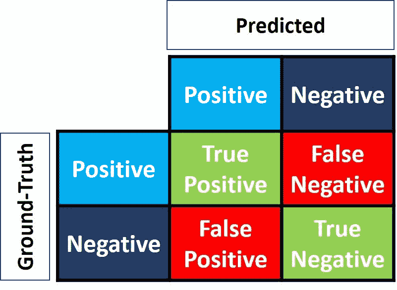

矩阵的 4 个元素(红色和绿色的项目)代表 4 个度量标准，用于计算模型做出的正确和错误预测的数量。每个元素都有一个由两个单词组成的标签:

1.  *真*或*假*
2.  *正*或*负*

当预测是正确的(即，在预测和基本事实标签之间存在匹配)时为*真*，当预测和基本事实标签之间存在不匹配时为*假*。*正*或*负*指预测标签。

综上，每当预测错了，第一个字就是*假*。否则，就是*真*。目标是最大化带有单词*真* ( *真正*和*真负*)的度量，最小化其他两个度量(*假正*和*假负*)。因此，混淆矩阵中的四个度量是:

1.  左上(**真阳性**):模型**正确**将一个*阳性*样本归类为*阳性*的次数？
2.  右上(**假阴性**):模型**有多少次错误地**将一个*阳性*样本归类为*阴性*？
3.  左下(**假阳性**):模型**有多少次错误地**将一个*阴性*样本归类为*阳性*？
4.  右下(**真阴性**):模型**正确**将一个*阴性*样本归类为*阴性*的次数是多少？

我们可以为之前看到的七个预测计算这四个指标。下图给出了由此产生的混淆矩阵。

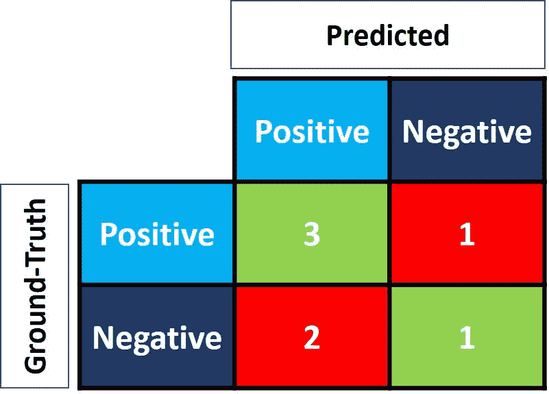

这就是如何计算二进制分类问题的混淆矩阵。现在让我们看看如何计算一个多类问题。

## **多类分类的混淆矩阵**

如果我们有两节以上的课呢？对于多类分类问题，我们如何计算混淆矩阵中的这四个度量？简单！

假设有 9 个样本，其中每个样本属于三个类别之一:*白色*、*黑色*或*红色*。这是 9 个样本的基本数据。

```py
Red, Black, Red, White, White, Red, Black, Red, White
```

当样本被输入模型时，这里是预测的标签。

```py
Red, White, Black, White, Red, Red, Black, White, Red
```

为了便于比较，这里它们是并排的。

```py
Ground-Truth: Red, Black, Red,   White, White, Red, Black, Red,   White
Predicted:    Red, White, Black, White, Red,   Red, Black, White, Red
```

在计算混淆矩阵之前，必须指定一个目标类。我们把*红*类设为目标。该班标记为*正*，其他班标记为*负*。

```py
Positive, Negative, Positive, Negative, Negative, Positive, Negative, Positive, Negative
Positive, Negative, Negative, Negative, Positive, Positive, Negative, Negative, Positive
```

现在又只有两类(*正*和*负*)。因此，混淆矩阵可以像上一节那样计算。注意，这个矩阵只是针对*红*类。

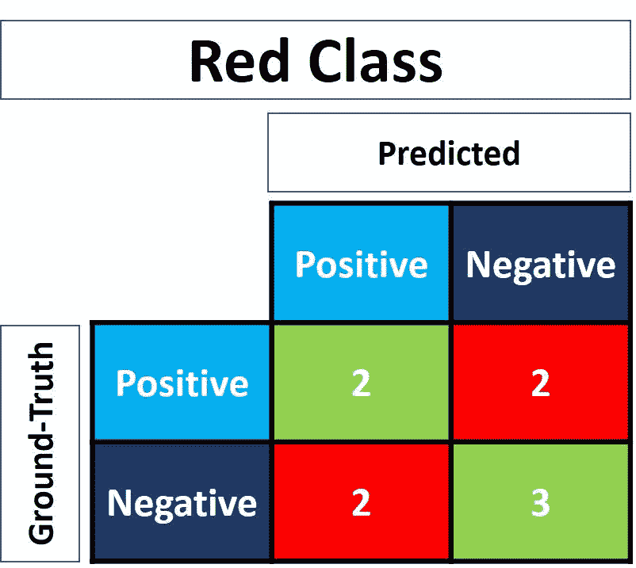

对于*白色*类，将其每次出现替换为*正*，所有其他类标签替换为*负*。替换后，这里是地面真相和预测标签。下图显示了*白*类的混淆矩阵。

```py
Negative, Negative, Negative, Positive, Positive, Negative, Negative, Negative, Positive
Negative, Positive, Negative, Positive, Negative, Negative, Negative, Positive, Negative
```

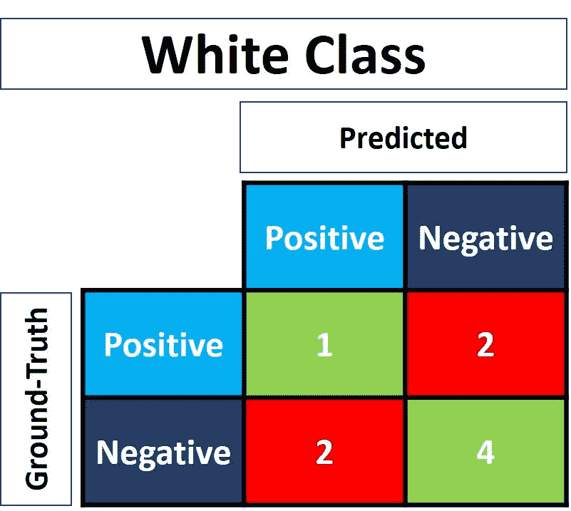

同样，这里是*黑*类的混淆矩阵。

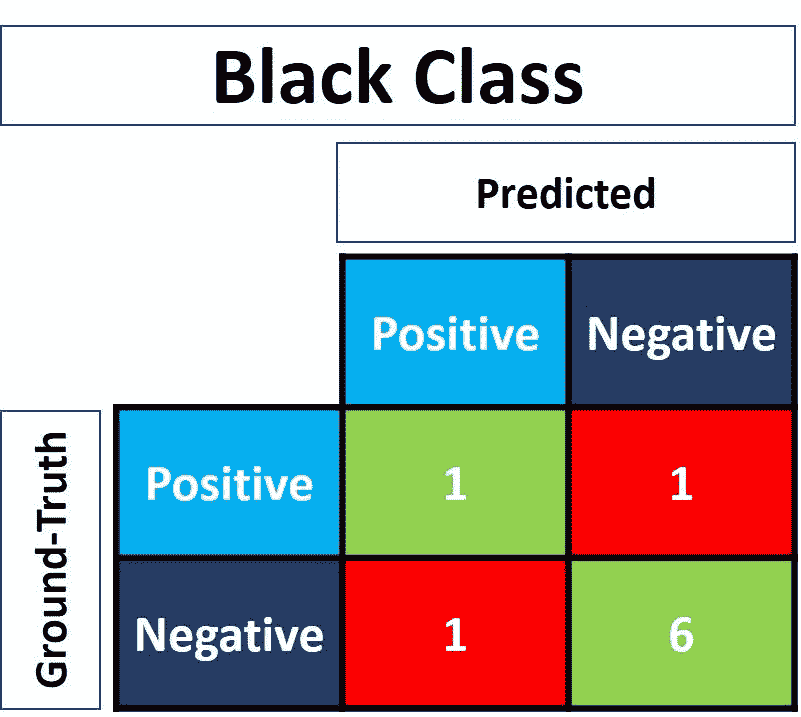

## **用 Scikit-Learn 计算混淆矩阵**

Python 中流行的 Scikit-learn 库有一个名为`metrics`的模块，可以用来计算混淆矩阵中的度量。

对于二元类问题，使用`confusion_matrix()`函数。在其可接受的参数中，我们使用以下两个:

1.  真相标签。
2.  `y_pred`:预测标签。

下面的代码为我们之前讨论的二进制分类示例计算混淆矩阵。

```py
import sklearn.metrics

y_true = ["positive", "negative", "negative", "positive", "positive", "positive", "negative"]
y_pred = ["positive", "negative", "positive", "positive", "negative", "positive", "positive"]

r = sklearn.metrics.confusion_matrix(y_true, y_pred)
print(r)
```

```py
array([[1, 2],
       [1, 3]], dtype=int64)
```

请注意，度量的顺序与之前讨论的不同。例如，*真正*指标在右下角，而*真负*在左上角。为了解决这个问题，我们可以翻转矩阵。

```py
import numpy

r = numpy.flip(r)
print(r)
```

```py
array([[3, 1],
       [2, 1]], dtype=int64)
```

为了计算多类分类问题的混淆矩阵，使用了`multilabel_confusion_matrix()`函数，如下所示。除了`y_true`和`y_pred`参数，第三个名为`labels`的参数接受一个类标签列表。

```py
import sklearn.metrics
import numpy

y_true = ["Red", "Black", "Red",   "White", "White", "Red", "Black", "Red",   "White"]
y_pred = ["Red", "White", "Black", "White", "Red",   "Red", "Black", "White", "Red"]

r = sklearn.metrics.multilabel_confusion_matrix(y_true, y_pred, labels=["White", "Black", "Red"])
print(r)
```

```py
array([
    [[4 2]
     [2 1]]

    [[6 1]
     [1 1]]

    [[3 2]
     [2 2]]], dtype=int64)
```

该函数计算每个类的混淆矩阵，并返回所有矩阵。矩阵的顺序与`labels`参数中标签的顺序相匹配。为了调整矩阵中指标的顺序，我们将像以前一样使用`numpy.flip()`函数。

```py
print(numpy.flip(r[0])) # White class confusion matrix
print(numpy.flip(r[1])) # Black class confusion matrix
print(numpy.flip(r[2])) # Red class confusion matrix
```

```py
# White class confusion matrix
[[1 2]
 [2 4]]

# Black class confusion matrix
[[1 1]
 [1 6]]

# Red class confusion matrix
[[2 2]
 [2 3]]
```

在本教程的剩余部分，我们将只关注两个类。下一节讨论基于混淆矩阵计算的三个关键指标。

## **准确度、精确度和召回率**

正如我们已经看到的，混淆矩阵提供了四个不同的单独指标。基于这四个指标，可以计算其他指标，这些指标提供了有关模型行为的更多信息:

1.  准确(性)
2.  精确
3.  回忆

接下来的小节将分别讨论这三个指标。

### **精度**

准确性是一个度量标准，通常描述模型在所有类别中的表现。当所有类都同等重要时，这是很有用的。它的计算方法是正确预测数与预测总数之比。

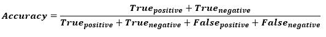

以下是如何根据之前计算的混淆矩阵，使用 Scikit-learn 计算准确度。变量`acc`保存将*真阳性*和*真阴性*之和除以矩阵中所有值之和的结果。结果是`0.5714`，这意味着该模型在做出正确预测时是`57.14%`准确的。

```py
import numpy
import sklearn.metrics

y_true = ["positive", "negative", "negative", "positive", "positive", "positive", "negative"]
y_pred = ["positive", "negative", "positive", "positive", "negative", "positive", "positive"]

r = sklearn.metrics.confusion_matrix(y_true, y_pred)

r = numpy.flip(r)

acc = (r[0][0] + r[-1][-1]) / numpy.sum(r)
print(acc)
```

```py
0.571
```

`sklearn.metrics`模块有一个叫`accuracy_score()`的函数，也可以计算精度。它接受基本事实和预测标签作为参数。

```py
acc = sklearn.metrics.accuracy_score(y_true, y_pred)
```

请注意，准确性可能是欺骗性的。一种情况是当数据不平衡时。假设总共有 600 个样本，其中 550 个属于*阳性*类，只有 50 个属于*阴性*类。由于大多数样本属于一个类别，该类别的准确度将高于另一个类别。

如果该模型对*阳性*类做出了总共 530/550 的正确预测，相比之下，对*阴性*类的正确预测仅为 5/50，那么总准确度为`(530 + 5) / 600 = 0.8917`。这意味着该模型的准确率为 89.17%。考虑到这一点，您可能会认为，对于任何样本(无论其类别如何)，该模型都有可能在 89.17%的情况下做出正确的预测。这是无效的，尤其是当你考虑到模型表现不佳的*负*类时。

### **精度**

精度计算为正确分类的*阳性*样本数与分类为*阳性*的样本总数之比(正确或不正确)。精度衡量模型将样本分类为阳性的准确性。

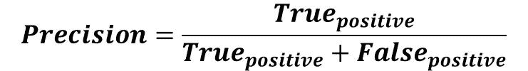

当模型做出许多不正确的*正*分类，或很少正确的*正*分类时，这增加了分母并使精度变小。另一方面，在以下情况下精度较高:

1.  模型做出许多正确的*正*分类(最大化*真正*)。
2.  该模型做出更少的错误*阳性*分类(最小化*假阳性*)。

想象一个被别人信任的男人；当他预言某事时，其他人相信他。精密就像这个人。当精度较高时，当模型预测样本为*正*时，可以信任模型。因此，精度有助于了解模型在表示样本为*阳性*时的准确性。

基于前面的讨论，下面是精度的定义:

> **精度反映了模型将样本分类为阳性的可靠程度**。

在下图中，绿色标记表示样本被归类为*阳性*，红色标记表示样本为*阴性*。该模型将两个*阳性*样本正确分类，但将一个*阴性*样本错误分类为*阳性*。因此，*真阳性*率为 2，*假阳性*率为 1，精度为`2/(2+1)=0.667`。换句话说，当模型说样本为*阳性*时，其可信度为 66.7%。

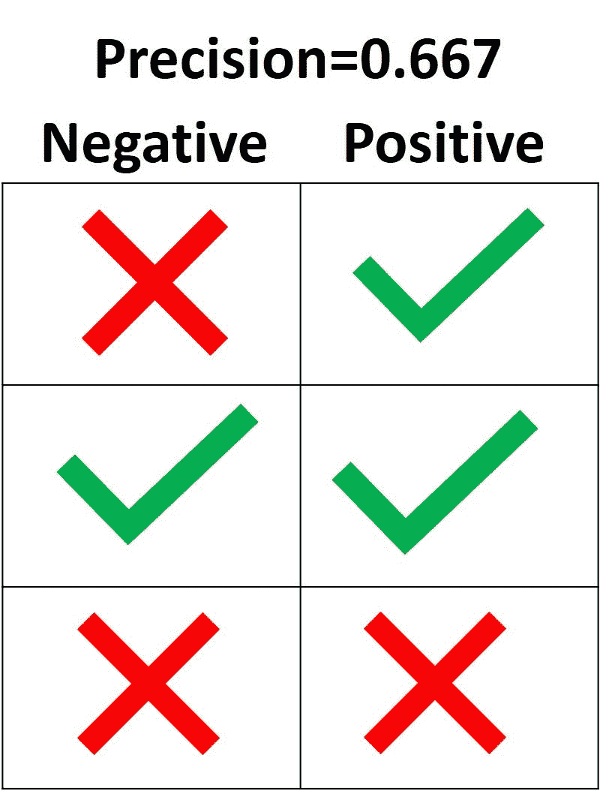

**精度的目标是将所有*阳性*样本归类为*阳性*，而不会将一个阴性样本误归类为*阳性*。**根据下图，如果所有三个*阳性*样本分类正确，但一个*阴性*样本分类错误，则精度为`3/(3+1)=0.75`。因此，当模型说一个样本是阳性时，它是 75%准确的。

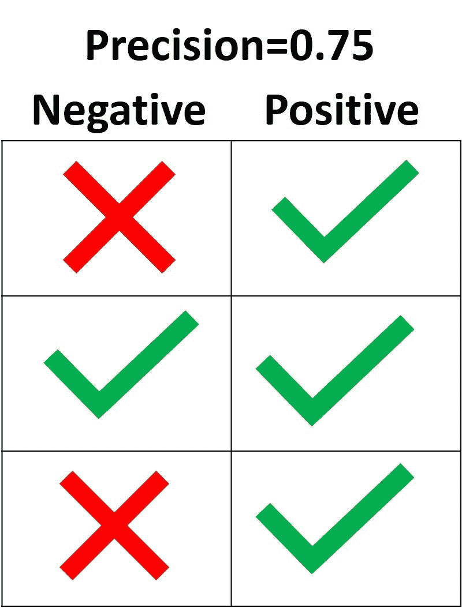

获得 100%精度的唯一方法是将所有的*阳性*样本归类为*阳性*，此外不要将一个*阴性*样本误归类为*阳性*。

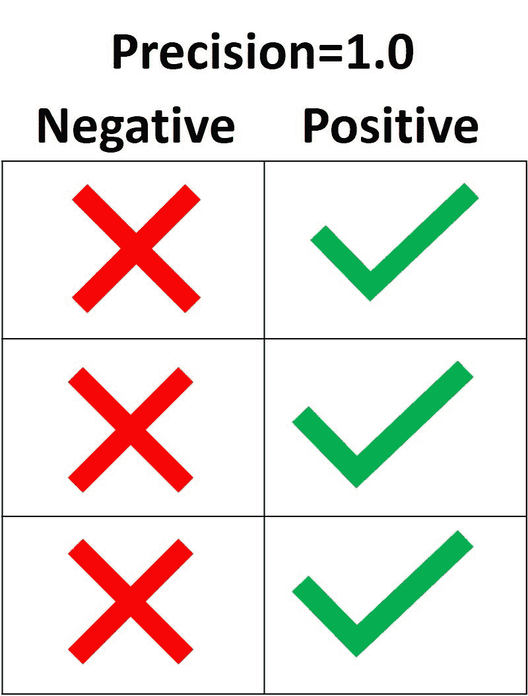

在 Scikit-learn 中，`sklearn.metrics`模块有一个名为`precision_score()`的函数，它接受实际和预测标签并返回精度。`pos_label`参数接受*正*类的标签。默认为`1`。

```py
import sklearn.metrics

y_true = ["positive", "positive", "positive", "negative", "negative", "negative"]
y_pred = ["positive", "positive", "negative", "positive", "negative", "negative"]

precision = sklearn.metrics.precision_score(y_true, y_pred, pos_label="positive")
print(precision)
```

```py
0.6666666666666666
```

### **回忆**

召回的计算方法是被正确归类为*阳性*的*阳性*样本数与*阳性*样本总数之比。召回测量模型检测*阳性*样本的能力。召回率越高，检测到的阳性样本越多。

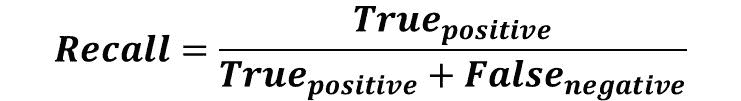

召回只关心阳性样本如何分类。这与阴性样本的分类方式无关，例如精度。当模型将所有阳性样本分类为*阳性*时，那么即使所有阴性样本被错误地分类为*阳性*，召回率也将是 100%。让我们看一些例子。

在下图中，有 4 种不同的情况(A 到 D ),并且都有相同的回忆，即`0.667`。每种情况的不同之处仅在于如何对阴性样本进行分类。例如，案例 A 将所有阴性样本正确分类为阴性，但案例 D 将所有阴性样本错误分类为阳性。不管阴性样本如何分类，召回只关心阳性样本。

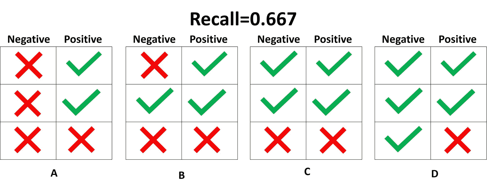

在上面显示的 4 个病例中，只有 2 个阳性样本被正确分类为阳性。因此，*真正的*率是 2。*假阴性*率为 1，因为只有一个阳性样本被归类为阴性。结果召回的是`2/(2+1)=2/3=0.667`。

因为阴性样本被归类为阳性还是阴性并不重要，所以最好完全忽略阴性样本，如下图所示。计算召回率时只需要考虑正样本。

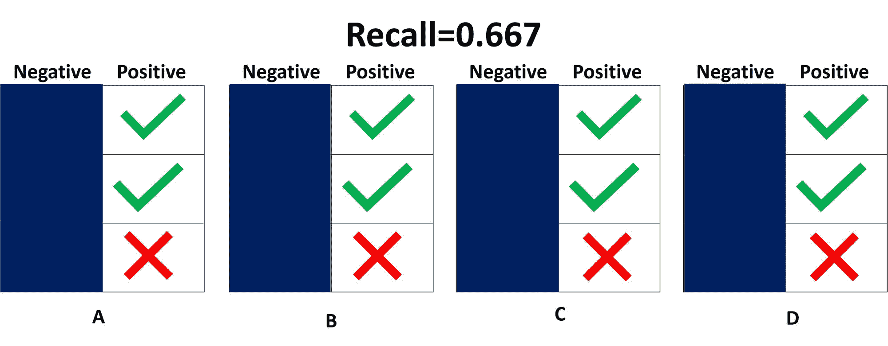

召回高或低意味着什么？当召回率较高时，意味着模型可以将所有阳性样本正确分类为*阳性*。因此，该模型检测阳性样本的能力是可信的。

在下图中，召回率为 1.0，因为所有阳性样本都被正确归类为*阳性*。*真阳性*率为 3，*假阴性*率为 0。因此，召回等于`3/(3+0)=1`。这意味着模型检测到了*所有*阳性样本。因为召回忽略了如何对阴性样本进行分类，仍可能有许多阴性样本被分类为阳性(即高*假阳性*率)。召回没有考虑到这一点。

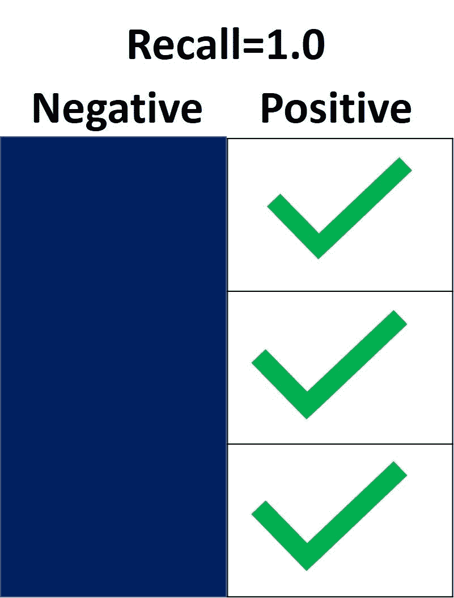

另一方面，当未能检测到任何阳性样本时，召回率为 0.0。在下图中，所有阳性样本都被**错误地**归类为*阴性*。这意味着模型检测到 0%的阳性样本。*真阳性*率为 0，*假阴性*率为 3。因此，召回等于`0/(0+3)=0`。

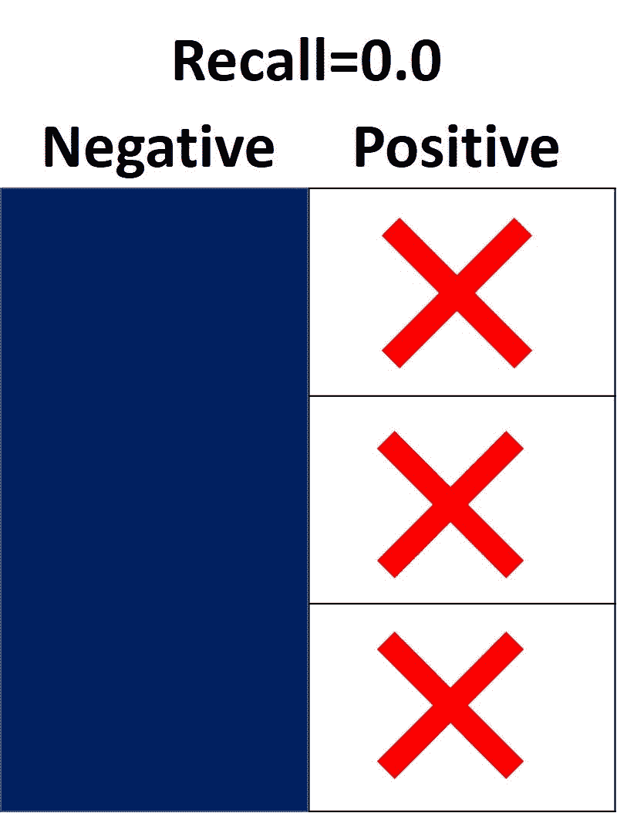

当召回值介于 0.0 和 1.0 之间时，该值反映了模型正确分类为*阳性*的阳性样本的百分比。例如，如果有 10 个阳性样本，召回率为 0.6，这意味着模型正确分类了 60%的阳性样本(即`0.6*10=6`阳性样本被正确分类)。

类似于`precision_score()`函数，`sklearn.metrics`模块中的`recall_score()`函数计算召回。下一个代码块显示了一个示例。

```py
import sklearn.metrics

y_true = ["positive", "positive", "positive", "negative", "negative", "negative"]
y_pred = ["positive", "positive", "negative", "positive", "negative", "negative"]

recall = sklearn.metrics.recall_score(y_true, y_pred, pos_label="positive")
print(recall)
```

```py
0.6666666666666666
```

定义了精确度和召回率之后，让我们快速回顾一下:

*   精度衡量模型在对正样本进行分类时的可信度，召回衡量模型正确分类了多少正样本。
*   精度考虑了阳性和阴性样本的分类方式，但召回在其计算中仅考虑阳性样本。换句话说，精确度依赖于负样本和正样本，但是召回率仅依赖于正样本(并且独立于负样本)。
*   精度考虑样本何时被分类为*阳性*，但不关心正确分类*所有*阳性样本。召回关心的是正确分类*所有*阳性样本，但不关心一个阴性样本是否被分类为阳性。
*   当一个模型具有高召回率但低精确度时，那么该模型正确地分类了大多数阳性样本，但是它具有许多假阳性(即，将许多*阴性*样本分类为*阳性*)。当一个模型具有高精度但低召回率时，那么该模型在将一个样本分类为*阳性*时是准确的，但它只能对少数阳性样本进行分类。

以下是一些测试你理解能力的问题:

1.  如果召回率为 1.0，数据集有 5 个阳性样本，那么模型正确分类了多少个阳性样本？(`5`)
2.  假设当数据集有 30 个阳性样本时，召回率为 0.3，那么模型正确分类了多少个阳性样本？(`0.3*30=9`样本)
3.  如果召回率为 0.0，数据集有 14 个阳性样本，那么模型正确分类了多少个阳性样本？(`0`)

## **精确还是回忆？**

使用精确还是召回取决于所解决问题的类型。如果目标是检测所有阳性样本(不关心阴性样本是否会被误分类为阳性)，那么使用 recall。如果问题对将样本归类为一般的*阳性*敏感，即包括被错误归类为*阳性*的*阴性*样本，则使用 precision。

想象一下，给你一张图像，要求你检测图像中的所有汽车。您使用哪种度量标准？因为目标是检测所有汽车，所以使用 recall。这可能会将一些对象误分类为汽车，但它最终会检测到所有的目标对象。

现在假设给你一张乳房 x 光照片，要求你检测是否有癌症。您使用哪种度量标准？因为它对错误地将图像识别为癌症非常敏感，所以我们必须确定何时将图像分类为*阳性*(即患有癌症)。因此，精度是首选指标。

## **结论**

本教程讨论了混淆矩阵以及如何在二进制和多类分类问题中计算其 4 个度量(真/假阳性/阴性)。使用 Scikit-learn 中的`metrics`模块，我们看到了如何在 Python 中计算混淆矩阵。

基于这 4 个指标，我们开始讨论准确度、精确度和召回率。每个指标都是基于几个例子定义的。`sklearn.metrics`模块用于计算它们中的每一个。

基于这里给出的概念，在下一个教程中，我们将看到如何使用精确度-召回曲线、平均精确度和平均精确度(mAP)。