# 深度学习中的梯度下降和优化

> 原文：<https://blog.paperspace.com/optimization-in-deep-learning/>

许多深度学习模型训练管道下面最常见的方法是梯度下降。但是普通梯度下降会遇到几个问题，比如陷入局部极小值或者爆炸和消失梯度的问题。为了解决这些问题，随着时间的推移，已经设计了梯度下降的几种变体。我们将在本文中查看最常见的一些，并针对一些优化问题对它们进行基准测试。

您可以跟随本教程中的代码，并从 [ML Showcase](https://ml-showcase.paperspace.com/projects/optimizers-in-deep-learning) 中免费运行它。

## 梯度下降

在深入研究优化器之前，我们先来看看梯度下降。梯度下降是一种优化算法，通过在与最陡上升相反的方向上移动来迭代地减少损失函数。在给定初始点的情况下，任何曲线上最陡上升的方向都是通过计算该点的坡度来确定的。与之相反的方向会把我们带到最小最快的地方。

在数学上，这是一种最小化目标函数 *J* (𝜃)的方法，其中𝜃代表模型的参数。深度架构通过遵循前馈机制进行预测，其中每一层都将前一层的输出作为输入，并使用由𝜃表示的参数(或者许多熟悉神经网络优化的人会称之为*权重*和*偏差*)，并最终输出传递到下一层的转换后的特征。将最终层的输出与我们期望的真实输出进行比较，并计算损失函数。然后使用反向传播来更新这些参数，反向传播使用梯度下降来找到应该更新参数的确切方式。这些参数的更新取决于优化算法的梯度和学习速率。

基于梯度下降的参数更新遵循以下规则:

*θ=θ∏j(θ)*

其中 *η* 为学习率。

1D 函数相对于其输入的梯度的数学公式如下:


虽然这对于连续函数是准确的，但是在计算神经网络的梯度时，我们将主要处理离散函数，并且计算极限并不像上面显示的那样简单。

上述方法(前向差分)被证明是不太准确的，因为截断误差的量级是 *O(h)* 。相反，使用中心差分方案，如下所示:

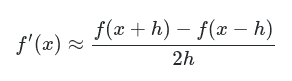

在中心差分法中，截断误差的量级为 *O(h2)。*截断误差基于两个公式的泰勒展开式。这里的和这里的可以很好地解释这一点。

## 梯度下降变体

梯度下降优于其他迭代优化方法，如 [Newton Rhapson](https://en.wikipedia.org/wiki/Newton%27s_method) 方法，因为 Newton 方法在每个时间步使用一阶和二阶导数，这使得其在规模上的操作效率低下。

有几种梯度下降尝试解决香草算法的某些限制，如随机梯度下降和允许在线学习的小批量梯度下降。普通梯度下降法计算整个数据集的梯度，而批量梯度下降法允许我们在处理几批数据的同时更新梯度，从而在处理大型数据集时提高内存效率。

## 香草梯度下降

让我们从如何实现香草和动量梯度下降开始，看看算法是如何工作的。然后，我们将在等高线图上可视化 2D 函数的梯度更新，以更好地理解算法。

更新将不会基于一个损失函数，而只是朝着与最陡上升相反的方向迈出一步。为了得到最陡上升的方向，我们将首先编写函数来计算函数的梯度，给出需要计算梯度的点。我们还需要另一个参数来定义我们的数值微分步骤的大小，用 *h* 表示。

采用多个坐标作为输入的函数的数值微分的中心差分方案可以如下实现。

```py
import numpy as np

def gradient(f, X, h):
    grad = []
    for i in range(len(X)):
        Xgplus = np.array([x if not i == j else x + h for j, x in enumerate(X)])
        Xgminus = np.array([x if not i == j else x - h for j, x in enumerate(X)])
        grad.append(f(*Xgplus) - f(*Xgminus) / (2 * h))
    return np.array(grad) 
```

普通梯度下降更新将如下所示:

```py
def vanilla_update(epoch, X, f, lr, h):
    grad = gradient(f, X, h)
    X1 = np.zeros_like(X)
    for i in range(len(X)):
        X1[i] = X[i] - lr * grad[i]
    print('epoch: ', epoch, 'point: ', X1, 'gradient: ', grad)
    return X1 
```

你可以把学习率想象成梯度更新的步长。

我们将在 Ackley 函数上测试我们的算法，Ackley 函数是测试优化算法的流行函数之一。阿克利的函数看起来像这样。

```py
import numpy as np

def ackleys_function(x, y):
    return - 20 * np.exp(- 0.2 * np.sqrt(0.5 * (x ** 2 + y ** 2))) \
           - np.exp(0.5 * (np.cos(2 * np.pi * x) + np.cos(2 * np.pi * y))) \
           + np.e + 20 
```

现在，为了最终测试我们的香草梯度下降:

```py
if __name__ == '__main__':
    h = 1e-3
    f = ackleys_function
    point = np.array([-2., -2.])
    i = 0
    lr = 0.00001
    while True:
        new_point = vanilla_update(i+1, point, f, lr, h)
        plt.plot(*point, 'ro', ms=1)
        if np.sum(abs(new_point - point)) < h:
            print('Converged.')
            break
        point = new_point
        i += 1 
```

我们使用的收敛标准很简单。如果该点的坐标的绝对值没有显著变化，如由 *h* 的值所确定的，我们停止该算法。

## 动量梯度下降

对于陡坡，动量梯度下降比普通梯度下降更快地帮助我们加速下坡。这是通过使用动量项来实现的。你可以认为它是根据梯度的大小和方向来调整梯度步长的速度。梯度更新中的动量因子是直到最后一个时间步长的梯度移动平均值，乘以一个小于 1 的常数，该常数保证整个速度项在极高的斜率下收敛。这有助于我们在更新参数时避免极端跳跃。

为了实现动量更新，除了计算当前点的梯度之外，还必须存储先前步骤的梯度，用于动量步骤的计算。参数 *m* 定义为动量，函数可以实现如下。

```py
def momentum_update(epoch, X, f, lr, m, h, vel=[]):
    grad = gradient(f, X, h)
    X1 = np.zeros_like(X)
    for i in range(len(X)):
        vel[i] = m * vel[i] + lr * grad[i]
        X1[i] = X[i] - vel[i]
    print('epoch: ', epoch, 'point: ', X1, 'gradient: ', grad, 'velocity: ', vel)
    return X1, vel 
```

最终的循环将如下所示:

```py
if __name__ == '__main__':
    h = 1e-3
    f = ackleys_function
    point = np.array([-2., -2.])
    vel = np.zeros_like(point)
    i = 0
    lr = 0.00001
    m = 0.9
    grads = []
    while True:
        new_point, vel = momentum_update(i+1, point, f, lr, m, h, vel=vel)
        plt.plot(*point, 'bo', ms=1)
        if np.sum(abs(new_point - point)) < h:
            print('Converged.')
            break
        point = new_point
        i += 1 
```

## 梯度下降可视化

获取 3D 函数的绘图:

```py
from matplotlib import pyplot as plt
from mpl_toolkits import mplot3d

def get_scatter_plot(X, Y, function):
    Z = function(X, Y)
    fig = plt.figure()
    cm = plt.cm.get_cmap('viridis')
    plt.scatter(X, Y, c=Z, cmap=cm)
    plt.show()
    return fig

def get_contours(X, Y, function):
    Z = function(X, Y)
    fig = plt.figure()
    contours = plt.contour(X, Y, Z, colors='black',
                           linestyles='dashed',
                           linewidths=1)
    plt.clabel(contours, inline=1, fontsize=10)
    plt.contourf(X, Y, Z)
    plt.xlabel('X')
    plt.ylabel('Y')
    plt.show()
    return fig

def get_3d_contours(X, Y, function):
    Z = function(X, Y)
    fig = plt.figure()
    ax = plt.axes(projection='3d')
    cm = plt.cm.get_cmap('viridis')
    ax.contour3D(X, Y, Z, 100, cmap=cm)
    ax.set_xlabel('x')
    ax.set_ylabel('y')
    ax.set_zlabel('z')
    plt.show()
    return fig

def get_surface_plot(X, Y, function):
    Z = function(X, Y)
    fig = plt.figure()
    ax = plt.axes(projection='3d')
    cm = plt.cm.get_cmap('viridis')
    ax.plot_surface(X, Y, Z, rstride=1,
                    cstride=1, cmap=cm)
    ax.set_xlabel('x')
    ax.set_ylabel('y')
    ax.set_zlabel('z')
    plt.show()
    return fig

if __name__ == '__main__':
    x = np.linspace(-1, 1, 1000)
    X, Y = np.meshgrid(x, x)
    get_scatter_plot(X, Y, ackleys_function)
    get_contours(X, Y, ackleys_function)
    get_3d_contours(X, Y, ackleys_function)
    get_surface_plot(X, Y, ackleys_function) 
```

可视化看起来像这样。

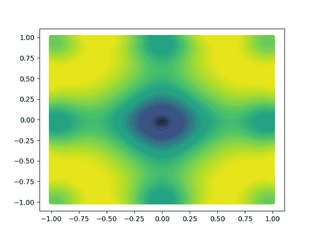

2D Ackley's function

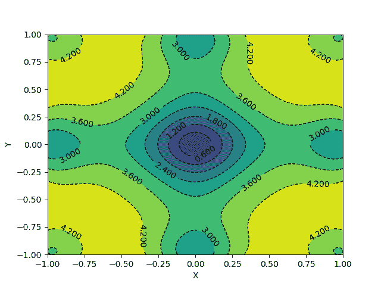

2D contours of Ackley's function

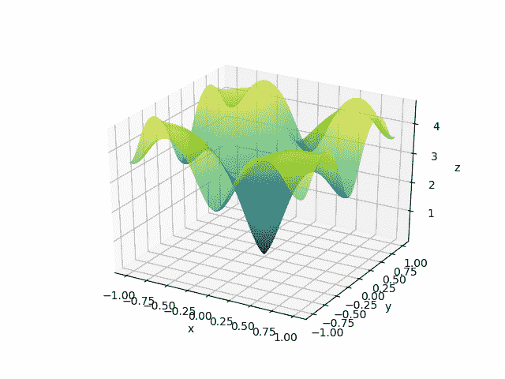

Surface plot for Ackley's function

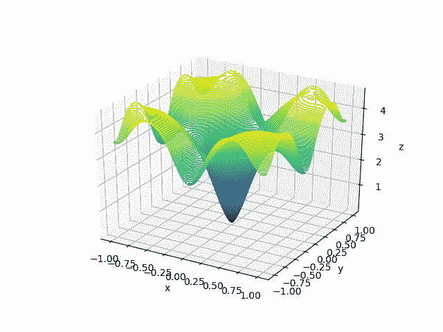

3D contours for Ackley's function

这里， *X* 和 *Y* 恰好是一个网格而不是 1D 阵列。我们可以使用 numpy 函数`np.meshgrid`创建一个 meshgrid。

您还可以利用令人惊叹的 VisPy 库快速创建 3D 可视化效果，并实时研究它们。

```py
import sys
from vispy import app, scene

def get_vispy_surface_plot(x, y, function):
    canvas = scene.SceneCanvas(keys='interactive', bgcolor='w')
    view = canvas.central_widget.add_view()
    view.camera = scene.TurntableCamera(up='z', fov=60)
    X, Y = np.meshgrid(x, y)
    Z = function(X, Y)
    p1 = scene.visuals.SurfacePlot(x=x, y=y, z=Z, color=(0.3, 0.3, 1, 1))
    view.add(p1)
    scene.Axis(font_size=16, axis_color='r',
                     tick_color='r', text_color='r',
                     parent=view.scene)
    scene.Axis(font_size=16, axis_color='g',
                     tick_color='g', text_color='g',
                     parent=view.scene)
    scene.visuals.XYZAxis(parent=view.scene)
    canvas.show()
    if sys.flags.interactive == 0:
        app.run()
    return scene, app 
```

这应该给你一个画布来玩这个情节。

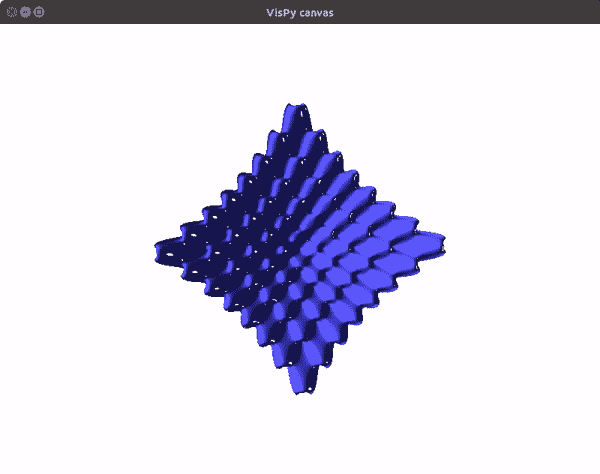

要在等高线图上显示普通梯度下降的梯度下降更新，请使用以下代码。

```py
if __name__ == '__main__':

    x = np.linspace(-2, 2, 1000)

    h = 1e-3

    f = ackleys_function

    a, b = np.meshgrid(x, x)
    Z = f(a, b)
    contours = plt.contour(a, b, Z, colors='black',
                           linestyles='dashed',
                           linewidths=1)
    plt.clabel(contours, inline=1, fontsize=10)
    plt.contourf(a, b, Z)
    plt.xlabel('X')
    plt.ylabel('Y')

    point = np.array([-2., -2.])

    i = 0
    lr = 0.00001
    while True:
        new_point = vanilla_update(i+1, point, f, lr, h)
        plt.plot(*point, 'ro', ms=1)
        if np.sum(abs(new_point - point)) < h:
            print('Converged.')
            break
        point = new_point
        i += 1

    plt.show() 
```

该算法需要 139 个历元才能收敛，梯度更新如下所示:

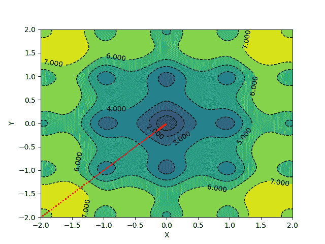

对于应用动量更新和绘图，您可以使用以下代码:

```py
if __name__ == '__main__':

    x = np.linspace(-2, 2, 1000)

    h = 1e-3

    f = ackleys_function

    a, b = np.meshgrid(x, x)
    Z = f(a, b)
    contours = plt.contour(a, b, Z, colors='black',
                           linestyles='dashed',
                           linewidths=1)
    plt.clabel(contours, inline=1, fontsize=10)
    plt.contourf(a, b, Z)
    plt.xlabel('X')
    plt.ylabel('Y')

    point = np.array([-2., -2.])
    vel = np.zeros_like(point)

    i = 0
    lr = 0.00001
    m = 0.1
    grads = []
    while True:
        new_point, vel = momentum_update(i+1, point, f, lr, m, h, vel=vel)
        plt.plot(*point, 'bo', ms=1)
        if np.sum(abs(new_point - point)) < h:
            print('Converged.')
            break
        point = new_point
        i += 1
    plt.show() 
```

在相同的学习速率和动量为 0.1 的情况下，上述更新方案在 127 个时期内收敛。

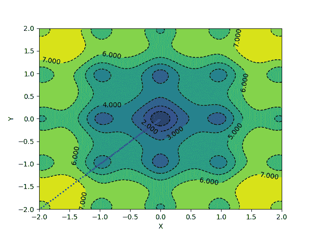

## 流行的梯度下降实现

梯度下降算法有几种实现，它们都有解决特定问题的小调整。

一些流行的梯度下降算法包括:

1.  **内斯特罗夫动量** -正如我们所讨论的，在基于动量的梯度下降中，速度项由一个移动平均值组成，直到前一个时间步长。在内斯特罗夫动量法中，考虑了当前的时间步长，为算法提供了一种如何调整下一个时间步长的更新的预测能力。下一步的梯度是通过考虑动量在下一次更新之后找到近似位置来计算的。
2.  **Adam** -自适应矩估计，也称为 Adam optimizer，通过查看从梯度和常数参数计算的一阶和二阶矩来计算每个优化步骤的自适应学习率。它的一部分类似于动量，但 Adam 在基于动量的优化速度较高的情况下表现更好，因为它根据二阶矩为梯度步长提供了相反的力。该算法使用去偏差机制来确保它不会总是收敛到微不足道的值。
3.  与频繁出现的特征相比，AdaGrad 通过向不频繁出现的特征分配更高的权重来计算自适应学习率。它累积平方梯度的方式与动量累积梯度的方式相同。这使得优化器能够更好地处理稀疏数据。Adagrad 用于训练手套单词向量。
4.  **AdaMax**-Adam 算法可以修改为根据 L2 范数值来缩放二阶矩，而不是使用原始值。但是参数也是平方的。不使用平方项，可以使用任何指数 *n* 。虽然对于更大的值，这样的梯度更新往往是不稳定的，但是如果参数 *n* 趋于无穷大，那么它为我们提供了稳定的解决方案。根据梯度的这种正则化获得的速度项然后被用于更新模型的权重。
5.  AdamW 优化器本质上是 Adam，它使用 L2 正则化权重。L2 正则化的常见实现用衰减的权重修改梯度值，而在 AdamW 实现中，正则化在梯度更新步骤期间完成。这个轻微的变化似乎以一种显著的方式改变了结果。
6.  与 Adagrad 一样，AdaDelta 使用累积的平方梯度，但只在一组步骤窗口中使用。渐变不是存储的，而是动态计算的。因此，在每一步中，由于仅依赖于先前的平均值和当前的梯度，存储器的利用被优化。

了解流行的梯度下降算法更多数学细节的资源可以在[这里](https://ruder.io/optimizing-gradient-descent/)找到。其中一些的实现可以在[这里](https://wiseodd.github.io/techblog/2016/06/22/nn-optimization/)找到。

## 基准优化器

让我们看看这些优化器是如何相互竞争的。我们将使用 CIFAR10 数据集进行基准测试。你也可以跟随来自 [ML Showcase](https://ml-showcase.paperspace.com/projects/optimizers-in-deep-learning) 的代码，并在 Gradient 上免费运行它。

让我们导入开始我们的培训脚本所需的所有东西。我们将使用 PyTorch 优化器及其 ResNet18 实现。我们将使用 Matplotlib 来可视化我们的结果。

```py
import torch
from torch import nn
from torch import optim
from torch.utils.data import RandomSampler, DataLoader

from torchvision import models
from torchvision import transforms
from torchvision.datasets import CIFAR10 as cifar
from torchvision import datasets

import time
import pickle
import random
import numpy as np
from tqdm import tqdm
from matplotlib import pyplot as plt
```

为了确保我们的结果是可重复的，让我们为 torch、NumPy 和 Python random 模块设置 PRNG 种子。

然后，我们创建一个扩充和规范化的数据集。CIFAR 数据集用于创建我们的训练和测试数据加载器。

```py
torch.manual_seed(0)
torch.cuda.manual_seed(0)
np.random.seed(0)
random.seed(0)

DATA_PATH = 'cifar'

trans = transforms.Compose([            [
                transforms.RandomHorizontalFlip(),
                transforms.RandomCrop(32, padding=4),
                transforms.ToTensor(),
                transforms.Normalize(
                    mean=[n/255\. for n in [129.3, 124.1, 112.4]], 
                    std=[n/255\. for n in [68.2,  65.4,  70.4]]
                )
        ])

train = cifar(DATA_PATH, train=True, transform=trans, download=False)
test = cifar(DATA_PATH, train=False, transform=trans, download=False)

batch_size = 64
train_size = len(train)
test_size = len(test)

train_dataloader = DataLoader(train, shuffle=True, batch_size=batch_size)
test_dataloader = DataLoader(test, shuffle=False, batch_size=batch_size)
```

我们将为此任务训练一个 ResNet18 模型。ResNet18 模型默认输出 1000 个特征。为了使其适用于我们的数据集，我们添加了一个具有 1000 个输入要素和 10 个输出要素的线性图层。

```py
class Cifar10_Resnet18(nn.Module):

    def __init__(self,):
        super(Cifar10_Resnet18, self).__init__()
        self.base = models.resnet18(pretrained=True)
        self.classification = nn.Linear(in_features=1000, out_features=10)

    def forward(self, inputs):
        out = self.base(inputs)
        out = self.classification(out)
        return out
```

如果使用 GPU，请将设备设置为 CUDA 类型。

```py
device = torch.device(type='cuda')
```

让我们定义一个所有优化器的字典，这样我们就可以创建一个循环来遍历所有优化器。字典的值是定义放入字符串的优化器的命令。稍后我们将使用`eval`函数来实现优化器。

```py
optimizers = {
        'SGD': 'optim.SGD(model.parameters(), lr=0.01, momentum=0.9)',
        'Adam': 'optim.Adam(model.parameters())',
        'Adadelta': 'optim.Adadelta(model.parameters())',
        'Adagrad': 'optim.Adagrad(model.parameters())',
        'AdamW': 'optim.AdamW(model.parameters())',
        'Adamax': 'optim.Adamax(model.parameters())',
        'ASGD': 'optim.ASGD(model.parameters())',
    }
```

主训练循环训练每个优化器 50 个时期，并通知我们关于训练准确性、验证准确性、训练损失和测试损失的信息。我们使用`CrossEntropyLoss`作为我们的损失标准，最后我们将所有的度量保存为 pickle 文件。对于每个优化器，都会初始化一个新的模型，然后我们使用`eval`函数根据未训练的模型参数定义优化器。

```py
epochs = 50

optim_keys = list(optimizers.keys())

train_losses = []
train_accuracies = []
test_losses = []
test_accuracies = []

for i, optim_key in enumerate(optim_keys):
    print('-------------------------------------------------------')
    print('Optimizer:', optim_key)
    print('-------------------------------------------------------')
    print("{:<8} {:<25} {:<25} {:<25} {:<25} {:<25}".format('Epoch', 'Train Acc', 'Train Loss', 'Val Acc', 'Val Loss', 'Train Time'))

    model = Cifar10_Resnet18()
    model.to(device)

    optimizer = eval(optimizers[optim_key])
    criterion = nn.CrossEntropyLoss()

    model.train()

    optim_train_acc = []
    optim_test_acc = []
    optim_train_loss = []
    optim_test_loss = []

    for epoch in range(epochs):

        start = time.time()

        epoch_loss = []
        epoch_accuracy = []

        for step, batch in enumerate(train_dataloader):

            optimizer.zero_grad()

            batch = tuple(t.to(device) for t in batch)
            images, labels = batch

            out = model(images)

            loss = criterion(out, labels)

            confidence, predictions = out.max(dim=1)
            truth_values = predictions == labels
            acc = truth_values.sum().float().detach().cpu().numpy() / truth_values.shape[0]

            epoch_accuracy.append(acc)
            epoch_loss.append(loss.float().detach().cpu().numpy().mean())

            loss.backward()
            optimizer.step()

        optim_train_loss.append(np.mean(epoch_loss))
        optim_train_acc.append(np.mean(epoch_accuracy))

        test_epoch_loss = []
        test_epoch_accuracy = []

        end = time.time()

        model.eval()
        for step, batch in enumerate(test_dataloader):

            batch = tuple(t.to(device) for t in batch)
            images, labels = batch

            out = model(images)

            loss = criterion(out, labels)

            confidence, predictions = out.max(dim=1)
            truth_values = predictions == labels
            acc = truth_values.sum().float().detach().cpu().numpy() / truth_values.shape[0]

            test_epoch_accuracy.append(acc)
            test_epoch_loss.append(loss.float().detach().cpu().numpy().mean())

        optim_test_loss.append(np.mean(test_epoch_loss))
        optim_test_acc.append(np.mean(test_epoch_accuracy))

        print("{:<8} {:<25} {:<25} {:<25} {:<25} {:<25}".format(epoch+1, 
                                                                np.mean(epoch_accuracy), 
                                                                np.mean(epoch_loss), 
                                                                np.mean(test_epoch_accuracy), 
                                                                np.mean(test_epoch_loss), 
                                                                end-start))

    train_losses.append(optim_train_loss)
    test_losses.append(optim_test_loss)
    train_accuracies.append(optim_train_acc)
    test_accuracies.append(optim_train_acc)

train_accuracies = dict(zip(optim_keys, train_accuracies))
test_accuracies = dict(zip(optim_keys, test_accuracies))
train_losses = dict(zip(optim_keys, train_losses))
test_losses = dict(zip(optim_keys, test_losses))

with open('train_accuracies', 'wb') as f:
    pickle.dump(train_accuracies, f)
with open('train_losses', 'wb') as f:
    pickle.dump(train_losses, f)
with open('test_accuracies', 'wb') as f:
    pickle.dump(test_accuracies, f)
with open('test_losses', 'wb') as f:
    pickle.dump(test_losses, f)
```

我们可以使用下面的代码来绘制结果。

```py
x = np.arange(epochs) + 1

for optim_key in optim_keys:
    plt.plot(x, train_accuracies[optim_key], label=optim_key)

plt.title('Training Accuracies')
plt.legend()
plt.show()

for optim_key in optim_keys:
    plt.plot(x, train_losses[optim_key], label=optim_key)

plt.title('Training Losses')
plt.legend()
plt.show()

for optim_key in optim_keys:
    plt.plot(x, test_accuracies[optim_key], label=optim_key)

plt.title('Testing Accuracies')
plt.legend()
plt.show()

for optim_key in optim_keys:
    plt.plot(x, test_losses[optim_key], label=optim_key)

plt.title('Testing Losses')
plt.legend()
plt.show()
```

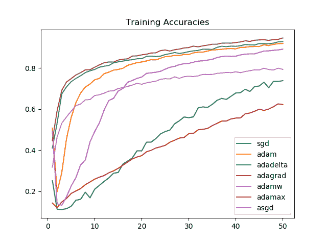

我们看到，对于我们选择的任务，Adamax 始终比所有其他优化器执行得更好。其次是 SGD、Adam 和 AdamW，分别是训练精度。

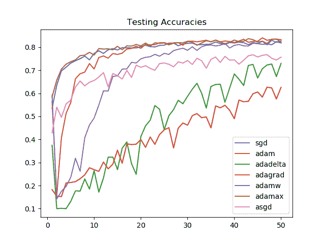

对于看不见的数据，在 50 个时期之后，Adamax、SGD、Adam 和 AdamW 的模型性能是相似的。Adamax 和 SGD 在最初几个时期的改进最大。

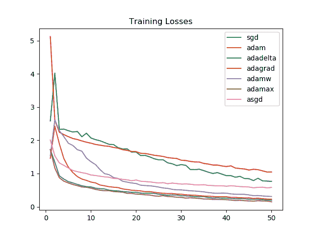

SGD 和 Adamax 再次看到了持续的强劲表现，这也反映在训练精度上。


然而，验证集的失败让亚当和亚当成为了胜利者。对于 SGD 和 Adamax，损失在接近结束时增加，表明需要早期停止机制。

从图中可以清楚地看到，对于我们选择的任务，Adagrad 和 Adadelta 线性提高，但性能不如 Adammax、SGD、Adam 或 AdamW。

## 优化器的更多基准测试

其他鲜为人知的优化器包括:

1.  准双曲 Adam 将动量更新和平方梯度更新从更新机制中分离出来，而是使用准双曲公式。这在分母中使用当前和先前梯度的加权平均值，减去一个常数，以及当前和先前平方梯度的另一个加权平均值，减去另一个常数。
2.  **YellowFin** -在 YellowFin 中，通过最小化局部二次函数，在每次迭代中调整学习速率和动量值，调整后的超参数有助于保持恒定的收敛速率。
3.  **妖** -衰减动量是一种动量法则，可以应用于任何带动量的梯度下降算法。衰减动量规则通过衰减梯度转移到未来时间步长的“能量”来降低速度值，方法是用当前时间步长与最终时间步长的比率对其进行加权。通常不需要超参数调整，因为动量通常在最终优化迭代时衰减到 0。当衰减被延迟时，该算法执行得更好。

要更深入地研究这些稍微不太流行的梯度下降算法，请查看本文。为了比较上面提到的一些优化器，他们使用了 6 个测试问题:

1.  CIFAR10 - ResNet18
2.  CIFAR100 - VGG16
3.  STL100 - Wide ResNet 16-8
4.  时尚主义者的帽子
5.  PTB - LSTM
6.  MNIST - VAE

并测试了以下自适应学习率优化器:

1.  圣经》和《古兰经》传统中）亚当（人类第一人的名字
2.  阿姆斯特拉德
3.  亚当斯
4.  柴达木
5.  黄鳍金枪鱼
6.  恶魔

结果可通过下表进行总结:

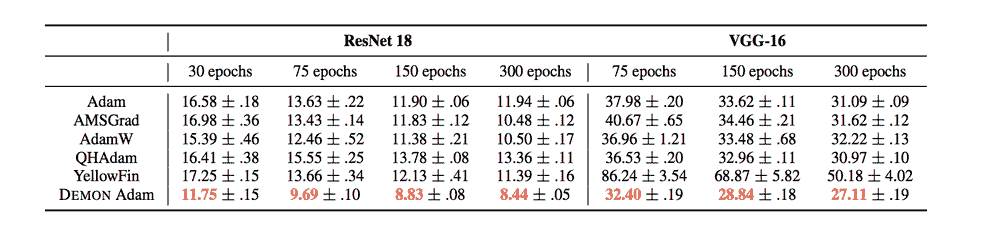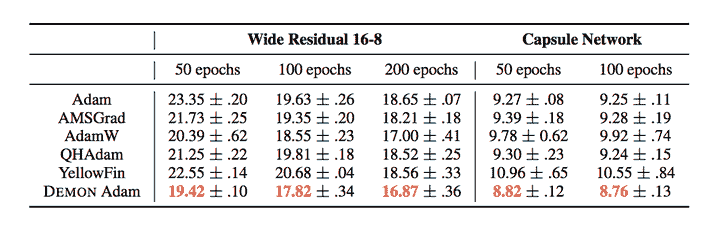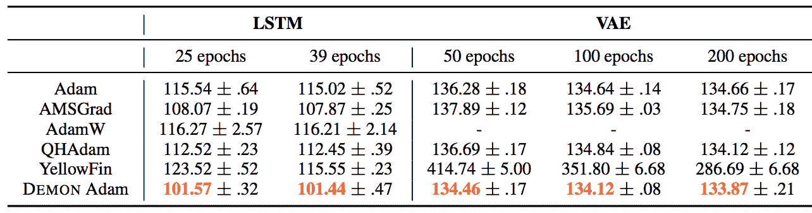

它们还在下面的图中展示了几个时期的训练和验证损失。

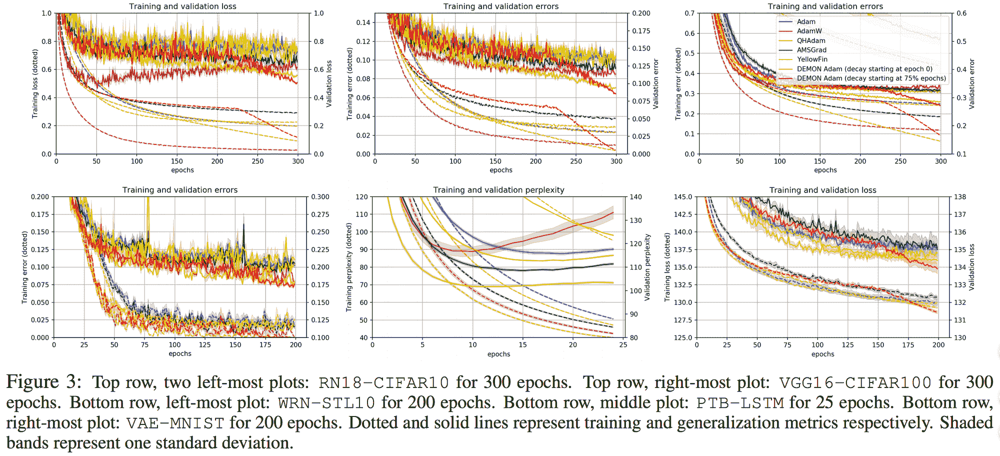

对于相同的任务，他们还测试了非自适应学习率优化器，例如:

1.  SGDM
2.  阿格米
3.  QHM
4.  恶魔 SGDM

对于 CIFAR10 - ResNet18 任务，结果如下:

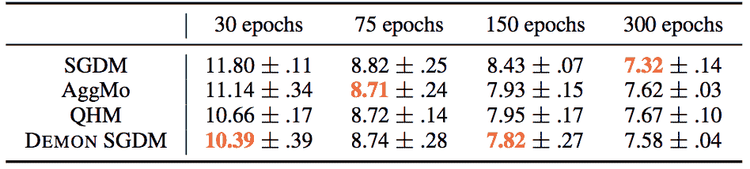

而对于其他任务:

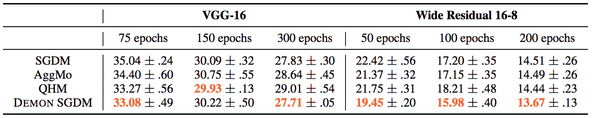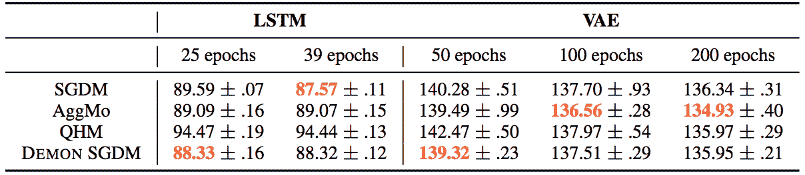

损失图如下所示:

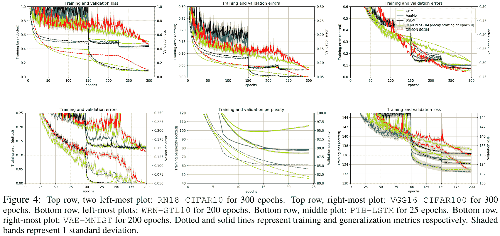

还有其他几种优化方法，如基于[遗传算法](https://en.wikipedia.org/wiki/Genetic_algorithm)的方法或概率优化方法，如[模拟退火](https://en.wikipedia.org/wiki/Simulated_annealing)，它们可以在某些情况下很好地替代梯度下降。例如，在强化学习中，需要通过几种策略优化算法进行离散优化。一些建立在经典强化算法基础上的算法可以在这里找到。

## 摘要

我们研究了梯度下降，并在 Python 中从头开始实现了香草和动量更新机制。我们还将 Ackley 函数的梯度更新可视化为沿等高线图的移动。我们使用 CIFAR10 数据集对图像分类任务的几个优化器进行了基准测试，并为此训练了一个 ResNet18。结果表明，Adamax、SGD、AdamW 和 Adam 表现良好，而 Adagrad 和 Adadelta 表现不佳。然后，我们看了几个不太流行的基于梯度下降的优化器，它们目前正在深度学习中使用。最后，我们看了我们讨论的几个优化器在不同任务上的表现，包括为卷积架构、LSTMs 和可变自动编码器调整权重。