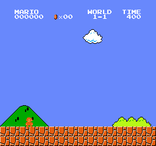
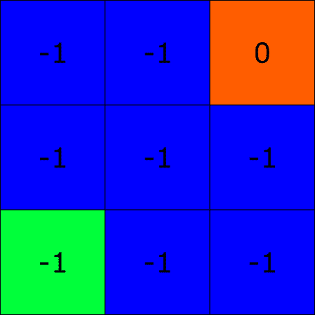
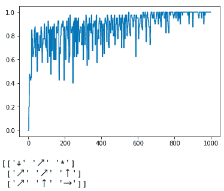
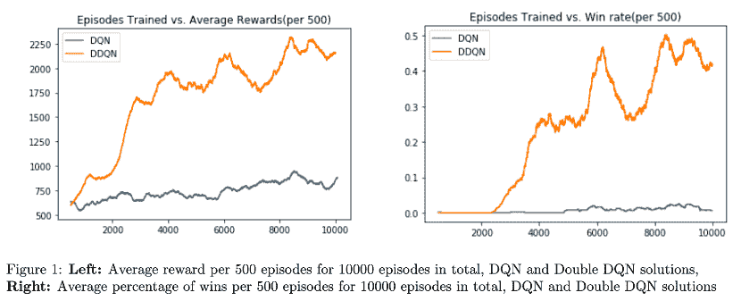

# 玩超级马里奥兄弟双深 Q 网络

> 原文：<https://blog.paperspace.com/building-double-deep-q-network-super-mario-bros/>

尽管神经网络很酷，但我第一次感觉自己在构建真正的人工智能并不是在处理图像分类或回归问题时，而是在我开始进行深度强化学习时。在这篇文章中，我想与你分享我的经历。在本教程结束时，您将拥有一个能够通过超级马里奥兄弟(NES)第一关的 PyTorch 强化学习代理。

本教程分为 3 个部分:

1.  强化学习简介
2.  超级马里奥兄弟(NES)环境
3.  建立一个可以通过这种环境的代理

你可以在 [ML Showcase](https://ml-showcase.paperspace.com/projects/super-mario-bros-double-deep-q-network) 上免费运行代码。

在本教程结束时，您将已经构建了一个可以完成此任务的代理:



Look at Mario go!

**先决条件**

*   具备深度学习和卷积神经网络的工作知识
*   [有 Python 3+和一个 Jupyter 笔记本](https://gradient.paperspace.com/free-gpu)
*   可选:舒适地使用 [PyTorch](https://blog.paperspace.com/pytorch-101-understanding-graphs-and-automatic-differentiation/)

## 什么是强化学习？

强化学习是一系列学习算法，其中代理通过与环境交互来从环境中学习。它学什么？非正式地说，代理学习采取行动，使其从当前状态达到最佳状态。

我发现例子总是有帮助的。检查以下 3×3 网格:



这个网格是我们代理的环境。这个环境中的每个方块称为一个状态，一个环境总是有一个 ***开始*** 和 ***结束*** 状态，你可以看到它们分别以**绿色**和**红色**突出显示。很像人类，我们的代理人将在一个叫做**插曲**的过程中从重复中学习。在一集的开始，一个代理将从*开始*状态开始，并且它将一直进行动作，直到到达*结束*状态。一旦代理到达*结束*状态，该片段将终止，并且新的片段将从代理再次从*开始*状态开始。

这里我只是给了你一个网格，但你可以想象更现实的例子。想象你在一家杂货店，你看着你的购物清单:你需要买干迷迭香。当你进入商店时，你的开始状态将是你的位置。第一次尝试寻找迷迭香时，你可能会有点迷路，你可能不会直接穿过商店找到“香草和香料”通道。但是在接下来的每一次拜访中，你会越来越好地找到它，直到当你走进去的时候，你可以直接移动到正确的通道。

当一个代理降落在一个州时，它会累积与该州相关的奖励，一个好的代理希望沿着一集**最大化** **累积折扣奖励**(我稍后会解释**折扣**是什么意思)。假设我们的代理可以垂直、水平和对角移动。基于这些信息，您可以看到代理到达最终状态的最佳方式是斜向移动(直接向它移动)，因为它会累积奖励 **-1 + 0 = -1** 。如果代理人以任何其他方式向最终状态移动，它将累积小于-1 的奖励。例如，如果代理向右、向右、向上移动，然后再向上移动一次，它将获得-1 + (-1) + (-1) + 0 = -3 的回报，小于-1。因此，对角移动被称为**最优策略π[*]** ，其中 **π** 是一个函数，它接受一个状态并输出代理将从该给定状态采取的动作。您可以从逻辑上推导出这个简单网格的最佳策略，但是我们如何使用强化学习来解决这个问题呢？由于这篇文章是关于深度 q 学习的，我们首先需要理解**状态-动作值。**

## **Q-学习**

我们提到，对于上述网格问题中的每个状态，代理可以移动到任何触及当前状态的状态；所以我们对每个状态的动作集是垂直的、水平的和对角线的。一个**状态-动作值**是处于一个特定状态并从该状态采取一个特定动作的**质量。**除了结束状态，每个单独的状态和动作对都应该有一个值。我们将这些状态-动作值表示为 **Q(s，a)** (状态-动作对的**质量**)，所有的状态-动作值一起形成一个叫做**Q-表的东西。**一旦 Q 表被学习，如果代理处于特定状态 **s** ，它将从 **s** 采取动作 **a** ，使得 **Q(s，a)** 具有最高值。数学上，如果一个代理处于状态 **s，**它将花费 **argmax[a] Q(s，a)** 。但是这些价值观是如何习得的呢？Q-learning 使用了 **Bellman-update 方程**的变体，更具体地说，是一种**时间差异学习。**

Q-学习更新方程为:

Q(s[t] 、a[t] )←Q(s[t] 、a[t])+α(r[t+1]+

本质上，这个等式表明，处于状态**s[t]并采取行动**a[t]的质量不仅仅由你从采取该行动中获得的直接回报来定义，还由你在到达状态 **s[t+1]** 后所能采取的最佳行动来定义γ参数被称为**折现因子**，是一个介于 0 和 1 之间的值，它定义了未来状态的重要性。α值被称为**学习率**，它告诉我们 Q 值更新到多大。这应该让你回想起我提到过强化学习代理的目标是最大化**累积的折扣奖励。******

如果我们把这个等式改写成:

Q(s[t] 、a[t] )←Q(s[t] 、a[t])+s

你会注意到，当δ≈0 时，算法收敛，因为我们不再更新 Q(s[t] ，a[t] )。这个值δ被称为**时间差误差**，Q-learning 的工作是使该值变为 0。

现在，让我们用 Q-learning 来解决 Python 中的网格问题。解决网格问题的主要函数是:

```py
def train_agent():
    num_episodes = 2000
    agent = Agent()
    env = Grid()
    rewards = []
    for _ in range(num_episodes):
        state = env.reset()
        episode_reward = 0
        while True:
            action_id, action = agent.act(state)
            next_state, reward, terminal = env.step(action)
            episode_reward += reward

            agent.q_update(state, action_id, reward, next_state, terminal)
            state = next_state

            if terminal:
                break
        rewards.append(episode_reward)

    plt.plot(rewards)
    plt.show()
    return agent.best_policy()

print(train_agent())
```

这个想法很简单。给定一个状态，代理采取具有最高值的动作，并且在采取该动作之后，使用上面的贝尔曼方程更新 Q 表。下一个状态成为当前状态，代理继续使用这种模式。如果代理降落在终端状态，那么新的一集开始。 **Q 表更新方法简单来说就是**:

```py
class Agent():
    ...
    def q_update(self, state, action_id, reward, next_state, terminal):
        ...
        if terminal:
            target = reward
        else:
            target = reward + self.gamma*max(self.q_table[next_state])

        td_error = target - self.q_table[state, action_id]
        self.q_table[state, action_id] = self.q_table[state, action_id] + self.alpha*td_error
    ...
```

跑了 1000 集，我得到的最终方针是:


Normalized rolling average reward plot over 1000 episodes, and policy table for Q-learning

您可能会注意到有些箭头没有意义。例如，如果你在网格的左上方，代理不是应该向右移动而不是向下吗？只要记住，Q-learning 是一个贪婪的算法；代理没有足够的时间到达左上方，以从该位置找出最佳策略。重要的是，从一开始，它就发现最好的策略是对角移动。

### **双 Q 学习**

Q-learning 有一个我们需要处理的主要问题:**高估偏差，**这意味着学习到的 Q 值实际上比它们应该的要高。数学上，max[a] Q(s[t+1] ，a)收敛于 E(max[a] Q(s[t+1] ，a))，高于 max[a](E(Q(s[t+1]，a))的真实 Q 值(此处不做证明)。为了获得更精确的 Q 值，我们使用了一种叫做双 Q 学习的方法。在双 Q 学习中，我们有两个 Q 表:一个用于采取行动，另一个专门用于 Q 更新方程。双 Q 学习更新方程为:

Q*(s[t] ，a[t] )←Q*(s[t] ，a[t])+α(r[t+1]+

其中 Q* 是被更新的 Q 表，Q^T 是目标表。Q^T 每隔 *n* 步复制 Q* 的值。

下面是演示这些变化的一些代码片段:

```py
class AgentDoubleQ():
    ...
    def q_update(self, state, action_id, reward, next_state, terminal):
        state = state[0]*3 + state[1]
        next_state = next_state[0]*3 + next_state[1]
        if terminal:
            target = reward
        else:
            target = reward + self.gamma*max(self.q_target[next_state])

        td_error = target - self.q_table[state, action_id]
        self.q_table[state, action_id] = self.q_table[state, action_id] + self.alpha*td_error

    def copy(self):
        self.q_target = copy.deepcopy(self.q_table)
    ...
```

```py
def train_agent_doubleq():
    ...
    while True:
        action_id, action = agent.act(state)
        next_state, reward, terminal = env.step(action)

        num_steps += 1
        if num_steps % agent.copy_steps == 0:
            agent.copy()

        episode_reward += reward

        agent.q_update(state, action_id, reward, next_state, terminal)
        state = next_state

        if terminal:
            break
    ...
```

下面是 1000 集以上的归一化滚动平均奖励图。



Normalized rolling average reward plot over 1000 episodes, and policy table for double Q-learning

从这个图中，可能很难看出双 Q 学习比 Q 学习有什么优势，但那是因为我们的**状态空间**真的很小(只有 9 个状态)。当我们得到更大的状态空间时，双 Q 学习真的有助于加速收敛。

## 超级马里奥兄弟(NES)

现在你已经对强化学习有了一个简要的概述，让我们来构建我们的代理，它可以通过超级马里奥兄弟(NES)的第一关。我们将使用建在开放体育馆顶部的`gym-super-mario-bros`图书馆。对于那些不熟悉 **gym** 的人来说，它是一个极其流行的 Python 库，为 ML 爱好者提供了一套强化学习的环境。下面是实例化我们的环境并查看每个状态的大小以及动作空间的代码片段:

```py
import gym_super_mario_bros

env = gym_super_mario_bros.make('SuperMarioBros-1-1-v0')
print(env.observation_space.shape)  # Dimensions of a frame
print(env.action_space.n)  # Number of actions our agent can take
```

你会看到观察空间形状是 240 × 256 × 3 (240 和 256 分别代表高度和宽度，3 代表 3 个颜色通道)。代理可以采取 256 种不同的可能操作。在双深度 Q 学习中，减少状态和动作空间的大小加快了我们模型的收敛。gym 的一个很好的部分是我们可以使用 gym 的`Wrapper` 类来改变最初给我们的默认设置。下面我定义了几个类来帮助我们的代理学习得更快。

```py
def make_env(env):
    env = MaxAndSkipEnv(env)
    env = ProcessFrame84(env)
    env = ImageToPyTorch(env)
    env = BufferWrapper(env, 4)
    env = ScaledFloatFrame(env)
    return JoypadSpace(env, RIGHT_ONLY)
```

该功能对我们的环境应用 6 种不同的转换:

1.  代理所做的每一个动作都在 4 帧中重复
2.  每一帧的尺寸减小到 84×84
3.  框架被转换为 PyTorch 张量
4.  缓冲器仅收集每四个帧
5.  帧被归一化，使得像素值在 0 和 1 之间
6.  动作的数量减少到 5(这样代理只能向右移动)

## **为超级马里奥兄弟(NES)建立代理**

让我们最后来看看是什么让深度 Q-learning 变得“深”。从我们设置环境的方式来看，一个状态是一系列 **4** 连续的 **84×84** 像素帧，我们有 **5** 个可能的动作。如果我们要为这个环境制作一个 Q 表，该表将具有 **5×256^(84×84×4)** 值，因为每个状态有 5 个可能的动作，每个像素具有 0 到 255 之间的强度，并且在一个状态中有 84×84×4 个像素。显然，存储这么大的 Q 表是不可能的，所以我们不得不求助于**函数逼近**，其中我们使用神经网络来逼近 Q 表；也就是说，我们将使用神经网络**将一个状态映射到它的状态-动作值**。

在表格(基于表格的)双 Q 学习中，回想一下更新等式是:

```py
q*(s, a); q(s, a)
```

r[t+1]+[γ_max_a]Q[θ](s[t+1]，a)被认为是我们的目标，Q* (s[t] ，a[t] 是我们的网络预测的值。使用某种基于距离的损失函数(均方误差、Huber 损失等)。)，我们可以使用梯度下降来优化深度 Q 网络的权重。

在开始我们如何训练我们的代理的细节之前，让我们首先建立我们将用作函数逼近器的 DQN 架构。

```py
class DQNSolver(nn.Module):

    def __init__(self, input_shape, n_actions):
        super(DQNSolver, self).__init__()
        self.conv = nn.Sequential(
            nn.Conv2d(input_shape[0], 32, kernel_size=8, stride=4),
            nn.ReLU(),
            nn.Conv2d(32, 64, kernel_size=4, stride=2),
            nn.ReLU(),
            nn.Conv2d(64, 64, kernel_size=3, stride=1),
            nn.ReLU()
        )

        conv_out_size = self._get_conv_out(input_shape)
        self.fc = nn.Sequential(
            nn.Linear(conv_out_size, 512),
            nn.ReLU(),
            nn.Linear(512, n_actions)
        )

    def _get_conv_out(self, shape):
        o = self.conv(torch.zeros(1, *shape))
        return int(np.prod(o.size()))

    def forward(self, x):
        conv_out = self.conv(x).view(x.size()[0], -1)
        return self.fc(conv_out) 
```

我们的 DQN 是一个具有 3 个卷积层和两个线性层的卷积神经网络。它需要两个参数:`input_shape` 和`n_actions`。当然我们会提供的输入形状是 **4×84×84，**还有 **5 个动作。**我们选择使用卷积神经网络，因为它们非常适合基于图像的回归。

既然我们已经建立了我们的神经网络架构，让我们来看看代码的“主要功能”。

```py
def run():
    env = gym_super_mario_bros.make('SuperMarioBros-1-1-v0')
    env = make_env(env)  # Wraps the environment so that frames are grayscale 
    observation_space = env.observation_space.shape
    action_space = env.action_space.n
    agent = DQNAgent(state_space=observation_space,
                     action_space=action_space,
                     max_memory_size=30000,
                     batch_size=32,
                     gamma=0.90,
                     lr=0.00025,
                     exploration_max=0.02,
                     exploration_min=0.02,
                     exploration_decay=0.99)

    num_episodes = 10000
    env.reset()
    total_rewards = []

    for ep_num in tqdm(range(num_episodes)):
        state = env.reset()
        state = torch.Tensor([state])
        total_reward = 0
        while True:
            action = agent.act(state)

            state_next, reward, terminal, info = env.step(int(action[0]))
            total_reward += reward
            state_next = torch.Tensor([state_next])
            reward = torch.tensor([reward]).unsqueeze(0)

            terminal = torch.tensor([int(terminal)]).unsqueeze(0)
            agent.remember(state, action, reward, state_next, terminal)
            agent.experience_replay()

            state = state_next
            if terminal:
                break

        total_rewards.append(total_reward)

        print("Total reward after episode {} is {}".format(ep_num + 1, total_rewards[-1]))
        num_episodes += 1 
```

看起来和网格问题的主函数几乎一模一样，对吧？您可能看到的唯一区别是`remember` 和`experience_replay` 方法。在典型的监督学习中，神经网络**使用批量数据**来更新其权重。在深度 Q-learning 中，想法是相同的，除了这些批量数据被称为批量**体验**，其中体验是一个**(状态、动作、奖励、下一状态、终端)**元组。不要像我们在网格问题中那样丢弃经验，我们可以将它们存储在一个缓冲区中，以便稍后使用`remember` 方法。在`experience_replay` 方法中，代理只需对一批经验进行采样，并使用双 Q 更新方程来更新网络权重。

现在，让我们回顾一下我们的代理的最重要的方法:`remember`、`recall`和`experience_replay`。

```py
class DQNAgent:
    ...
    def remember(self, state, action, reward, state2, done):
        self.STATE_MEM[self.ending_position] = state.float()
        self.ACTION_MEM[self.ending_position] = action.float()
        self.REWARD_MEM[self.ending_position] = reward.float()
        self.STATE2_MEM[self.ending_position] = state2.float()
        self.DONE_MEM[self.ending_position] = done.float()
        self.ending_position = (self.ending_position + 1) % self.max_memory_size  # FIFO tensor
        self.num_in_queue = min(self.num_in_queue + 1, self.max_memory_size)

    def recall(self):
        # Randomly sample 'batch size' experiences
        idx = random.choices(range(self.num_in_queue), k=self.memory_sample_size)

        STATE = self.STATE_MEM[idx].to(self.device)
        ACTION = self.ACTION_MEM[idx].to(self.device)
        REWARD = self.REWARD_MEM[idx].to(self.device)
        STATE2 = self.STATE2_MEM[idx].to(self.device)
        DONE = self.DONE_MEM[idx].to(self.device)

        return STATE, ACTION, REWARD, STATE2, DONE

    def experience_replay(self):

        if self.step % self.copy == 0:
            self.copy_model()

        if self.memory_sample_size > self.num_in_queue:
            return

        STATE, ACTION, REWARD, STATE2, DONE = self.recall()

        self.optimizer.zero_grad()
        # Double Q-Learning target is Q*(S, A) <- r + γ max_a Q_target(S', a)
        target = REWARD + torch.mul((self.gamma * 
        self.target_net(STATE2).max(1).values.unsqueeze(1)), 
        1 - DONE)

        current = self.local_net(STATE).gather(1, ACTION.long()) # Local net approximation of Q-value

        loss = self.l1(current, target)
        loss.backward() # Compute gradients
        self.optimizer.step() # Backpropagate error

        ...
    ...
```

这是怎么回事？在`remember`方法中，我们只是将一个体验推送到缓冲区，这样我们就可以在以后使用该数据。缓冲区的大小是固定的，因此它有一个 deque 数据结构。`recall`方法只是从记忆中取样一批经验。在`experience_replay`方法中，你会注意到我们有两个 Q 网络:**目标网络**和**本地网络。**这类似于网格问题的目标和本地 Q 表。我们将本地权重复制为目标权重，从我们的内存缓冲区中采样，并应用双 Q 学习更新方程。**这种方法可以让我们的代理学习。**

## **运行代码**

你可以在 [ML Showcase](https://ml-showcase.paperspace.com/projects/super-mario-bros-double-deep-q-network) 上免费运行全部代码。

代码提供了允许用户运行深度 Q 学习或双重深度 Q 学习的选项，但为了便于比较，这里有一些比较 DQN 性能和 DDQN 性能的图表:



你会注意到 10000 集的 DQN 和仅仅 1000 集的 DDQN 的表现是一样的(看左边的平均奖励剧情)。单一 DQN 的代码仅用于教育目的；我强烈建议你坚持训练 DDQN。

## **结论**

恭喜你！如果你和我一样，看到马里奥持续通过这一关会让你有一种冲动，你会想跳到新的深度强化学习项目。有些话题我在这篇文章中没有涉及，比如**价值迭代、策略上与策略外学习、马尔可夫决策过程**等等。然而，这篇文章旨在让人们对深度强化学习提供的可怕机会感到兴奋。保重，在我的下一篇文章中再见！