# NumPy 优化的基本要素第 3 部分:理解 NumPy 的内部结构、跨越、重塑和转置

> 原文：<https://blog.paperspace.com/numpy-optimization-internals-strides-reshape-transpose/>

在 NumPy 优化系列的前两部分中，我们主要介绍了如何通过用循环代替矢量化代码来提高代码速度。我们介绍了[矢量化和广播](https://blog.paperspace.com/numpy-optimization-vectorization-and-broadcasting/)的基础知识，然后用它们来[优化 K-Means 算法](https://blog.paperspace.com/speed-up-kmeans-numpy-vectorization-broadcasting-profiling/)的实现，与基于循环的实现相比，速度提高了 70 倍。

按照第 1 部分和第 2 部分的格式，第 3 部分(这一部分)将重点介绍一些带有一些理论的 NumPy 特性——即 NumPy 的内部、步长、整形和转置。第 4 部分将介绍这些工具在实际问题中的应用。

在之前的文章中，我们讨论了如何处理循环。在这篇文章中，我们将关注另一个经常降低 NumPy 代码速度的瓶颈:**不必要的复制和内存分配**。最大限度地减少这两个问题的能力不仅加快了代码的速度，还可以减少程序占用的内存。

我们将从一些可能导致不必要的数据复制和内存分配的基本错误开始。然后，我们将深入研究 NumPy 如何在内部存储它的数组，如何执行整形和转置等操作，并详细介绍一种无需键入一行代码就能计算此类操作结果的可视化方法。

在第 4 部分中，我们将使用我们在这一部分中学到的东西来优化对象检测器的输出管道。但是让我们把那个留到以后。

在我们开始之前，这里是本系列的前几部分的链接。

[NumPy Optimization: Vectorization and Broadcasting | Paperspace BlogIn Part 1 of our series on writing efficient code with NumPy we cover why loops are slow in Python, and how to replace them with vectorized code. We also dig deep into how broadcasting works, along with a few practical examples.Paperspace BlogAyoosh Kathuria](https://blog.paperspace.com/numpy-optimization-vectorization-and-broadcasting/)[Using NumPy to Speed Up K-Means Clustering by 70x | Paperspace BlogIn this part we’ll see how to speed up an implementation of the k-means clustering algorithm by 70x using NumPy. We cover how to use cProfile to find bottlenecks in the code, and how to address them using vectorization.Paperspace BlogAyoosh Kathuria](https://blog.paperspace.com/speed-up-kmeans-numpy-vectorization-broadcasting-profiling/)

那么，我们开始吧。

## 预分配预分配预分配！

我在迁移到 NumPy 的早期犯的一个错误，也是我看到许多人犯的一个错误，就是使用*循环-追加*范例。那么，我这么说到底是什么意思呢？

考虑下面这段代码。它在循环的每次迭代中向列表中添加一个元素。

```py
li = []
import random

for i in range(10000):
	# Something important goes here
    x = random.randint(1,10)
    li.append(x)
```

上面的脚本仅仅创建了一个包含从 0 到 9 的随机整数的列表。然而，我们添加到列表中的东西可能是循环的每次迭代中发生的一些复杂操作的结果，而不是一个随机数。

`append`是 Python 中的一个摊销`O(1)`操作。简而言之，平均来说，不管你的清单有多大，`append`都需要一定的时间。这就是为什么在 Python 中你会经常看到这个方法被用来添加到列表中。见鬼，这种方法如此受欢迎，你甚至会发现它被部署在生产级代码中。我称之为*循环附加*范例。虽然它在 Python 中运行良好，但在 NumPy 中就不一样了。

当人们切换到 NumPy 时，他们必须做一些类似的事情，这是他们有时会做的事情。

```py
# Do the operation for first step, as you can't concatenate an empty array later
arr = np.random.randn(1,10)

# Loop
for i in range(10000 - 1):
        arr = np.concatenate((arr, np.random.rand(1,10)))
```

或者，您也可以使用`np.append`操作来代替`np.concatenate`。实际上，`np.append`内部用的是`np.concatenate`，所以它的性能是以`np.concatenate`的性能为上限的。

然而，这并不是进行这种操作的好方法。因为`np.concatenate`和`append`不一样，不是常数时间函数。事实上，它是一个线性时间函数，因为它包括在内存中创建一个新数组，然后将两个数组的内容复制到新分配的内存中。

但是为什么 NumPy 不能按照`append`的工作方式实现一个常量时间`concatenate`？这个问题的答案在于列表和 NumPy 数组是如何存储的。

### 列表和数组存储方式的区别

Python `list`由指向对象的引用组成。虽然引用是以连续的方式存储的，但是它们指向的对象可以在内存中的任何地方。

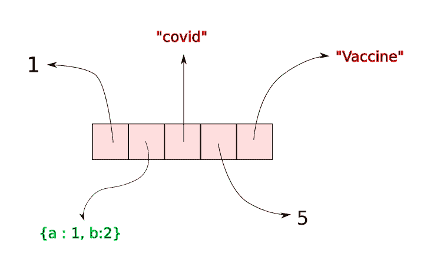

A python list is made of reference to the objects, which are stored elsewhere in the memory.

每当我们创建 Python 列表时，都会为组成列表的引用分配一定量的连续空间。假设一个列表有`n`个元素。当我们在一个列表上调用`append`时，python 只是在连续空间中的$ {n + 1}^{th} $槽处插入一个对对象(被追加)的引用。

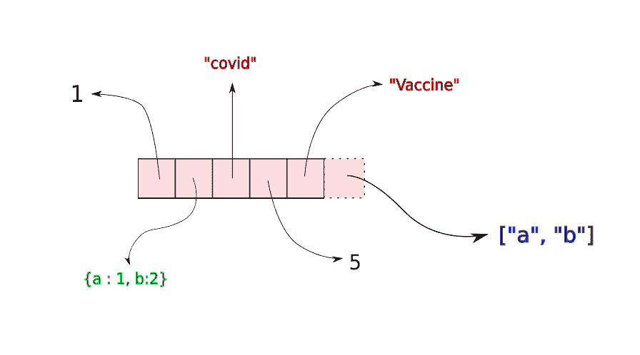

An append operation merely involves adding a reference to wherever the appended object is stored in the memory. No copying is involved.

一旦这个连续的空间填满，一个新的、更大的内存块被分配给这个列表，并为新的插入留出空间。列表中的元素被复制到新的内存位置。虽然将元素复制到新位置的时间不是恒定的(它会随着数组的大小而增加)，但是复制操作通常非常少见。因此，在平均情况下， append 花费的时间是常数，与数组的大小无关

然而，对于 NumPy，数组基本上是作为组成数组的连续对象块来存储的。与 Python 列表不同，在 Python 列表中我们只有引用，实际的对象存储在 NumPy 数组中。

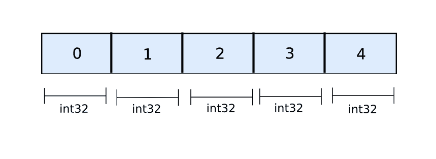

Numpy Arrays are stored as objects (32-bit Integers here) in the memory lined up in a contiguous manner

一旦数组被初始化，NumPy 数组的所有空间都被预先分配。

```py
a = np.zeros((10,20)) # allocate space for 10 x 20 floats
```

Python 列表中没有*动态调整大小*。当你在两个数组上调用`np.concatenate`时，一个全新的数组被分配，两个数组的数据被复制到新的内存位置。这使得`np.concatenate`比 append 慢，即使它是在 c 中执行的。

为了避免这个问题，您应该尽可能地为数组预分配内存。在循环体之前预先分配数组，并在循环过程中简单地使用切片来设置数组的值。下面是上面代码的一个变种。

```py
arr = np.zeros((10000,10))

for i in range(10000):
    arr[i] = np.random.rand(1,10)
```

这里，我们只分配一次内存。唯一涉及的复制是将随机数复制到分配的空间，而不是每次迭代都在内存中移动数组。

### 计时代码

为了查看预分配数组的速度优势，我们使用`timeit`对两个片段进行计时。

```py
%%timeit -n 100

arr = np.random.randn(1,10)
for i in range(10000 - 1):
        arr = np.concatenate((arr, np.random.rand(1,10))) 
```

输出是

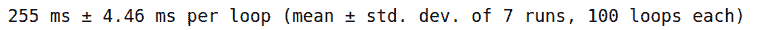

而对于具有预分配的代码。

```py
%%timeit -n 10

arr = np.zeros((10000,10))

for i in range(10000):
    arr[i] = np.random.rand(1,10)
```

我们获得了大约 25 倍的速度提升。

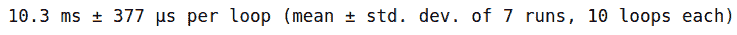

## 视图和副本

这是另一个看似无害的错误，实际上会降低代码的速度。考虑到你必须对一个连续索引的数组进行切片。

```py
a = np.arange(100)

sliced_a = a[10:20]
```

然而，您可以用下面的代码片段实现同样的效果。

```py
a = np.arange(100)

sliced_a = a[range(10,20)]
```

这被称为*花式索引*，其中你传递一个列表或元组作为索引，而不是普通的切片。当我们想要得到一个由不连续的索引组成的列表时，这是很有用的，就像通过做`arr[[2,7,11]]`得到一个数组的 2^{nd}$、$7^{th}$和$11^{th}的索引一样。

但是，你认为两者在计算速度上是一样的吗？让我们给他们计时。

```py
a = np.arange(100)

%timeit -n 10000 a[10:20]
%timeit -n 10000 a[range(10,20)]
```

这是我的输出。

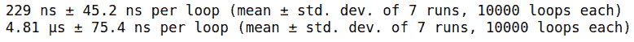

我们看到不同顺序的运行时间！普通切片版本需要大约 229 纳秒，而*花式索引*需要大约 4.81 微秒，即 4810 纳秒，即*花式索引*慢了大约 20 倍！

发生这种情况是因为普通切片只需返回一个新的偏移量。您不需要创建数据的副本，因为切片中的数据序列与原始数组保持一致，因此您可以简单地更改数组的起始点。

然而，当一个人进行*花式索引时，*一个副本被创建。为什么？因为 NumPy 数组在内存中被实现为连续块。当我们索引类似于`a[[2,7,11]]`的东西时，索引`2`、`7`和`11`处的对象以不连续的方式存储。除非进行复制，否则新数组的元素不能连续排列。

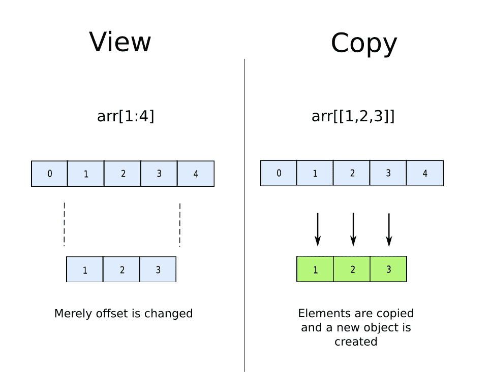

Difference between a View and a Copy in NumPy

这里的教训是，如果你有连续的索引要切片，总是选择普通切片而不是花哨的索引。

在下一节中，我们将解释 NumPy 的内部结构，数组是如何存储的，当我们改变或转置操作时会发生什么。

## NumPy 内部

在 NumPy 中，不管数组的形状如何，内部数组都存储为连续的对象块。然而，帮助我们像处理多维数组一样处理它们的是一种叫做**的东西。**

例如，考虑下面的数组。

```py
[[ 0  1  2  3]
 [ 4  5  6  7]
 [ 8  9 10 11]]
```

这个数组基本上存储在内存中，如下所示。

```py
[ 0  1  2  3  4  5  6  7  8  9 10 11] 
```

为了模拟连续对象块的尺寸，NumPy 使用跨距。我们对每个维度都有一个跨度。例如，对于上面的数组，步幅是`(32, 8)`。但是大踏步实际上意味着什么呢？

这意味着如果你想去二维数组的索引`[1,3]`，你将不得不去从开始算起`1 * 32 + 3 * 8`或`56`字节的内存位置。每个整数占用 32 位或 8 字节的内存。这意味着`56`字节从开始就对应着`7`整数。因此，当我们查询索引`[1,3]`时，我们得到的是`7`整数之后的整数，即索引号`8`，其值为 7。

```py
print(arr[1,3])
# Output -> 7
```

换句话说，一个维度的 stride 基本上告诉您，在保持其他元素不变的情况下，要到达该维度中的下一个元素，必须跳过连续内存中的多少物理内存块。例如，考虑索引`[0][2]`。为了跳转到第一维度`[1][2]`的下一个元素，我们必须在内存中跳转 32 位。类似地，我们在物理内存中跳转 8 位来索引`[0][3]`。

## 重塑

事实上，NumPy 在内部将数组存储为连续的数组，这允许我们仅仅通过修改 NumPy 数组的跨度来*改变其维度。例如，如果我们采用上面的数组，并将其重新整形为`[6, 2]`，步长将变为`[16,8]`，而内部连续内存块将保持不变。*

```py
a = np.arange(12).reshape(3,4)
print(a)

# Output 
[[ 0  1  2  3]
 [ 4  5  6  7]
 [ 8  9 10 11]]

b = a.reshape(6,2)
print(b)

#Output 
[[ 0  1]
 [ 2  3]
 [ 4  5]
 [ 6  7]
 [ 8  9]
 [10 11]]
```

我们也可以创造维度。例如，我们也可以将原始数组整形为`[2, 2, 3]`。这里大步换到`[48, 24, 8]`。

```py
c = a.reshape(2,2,3)
print(c)

#Output
[[[ 0  1  2]
  [ 3  4  5]]

 [[ 6  7  8]
  [ 9 10 11]]]
```

利用 NumPy 存储其数组的方式，我们可以 *r* e *整形* NumPy 数组，而不会产生任何显著的计算成本，因为它只涉及改变数组的步长。以连续方式存储在存储器中的数组不会改变。所以整形不需要复制。

为了更好地利用这个特性，我们必须理解整形是如何工作的。给定一个数组和一个目标形状，我们必须能够计算出重新整形后的数组是什么样子。这将引导我们思考一个可以通过一个或多个整形操作实现的解决方案。

### 整形是如何进行的？

我们现在详细讨论重塑是如何工作的。当试图解释 NumPy 中的形状如何工作时，许多人坚持将数组想象成网格和立方体。

然而，一旦你超越三维，观想就变得很成问题。虽然我们可以在二维和三维阵列中使用立方体，但对于更高维的阵列，我们必须想出别的办法。

所以我建议，把数组想象成一棵树。树的每一级都代表一个原始顺序的维度。例如，我们上面提到的数组可以表示如下。

```py
[[ 0  1  2  3]
 [ 4  5  6  7]
 [ 8  9 10 11]]
```

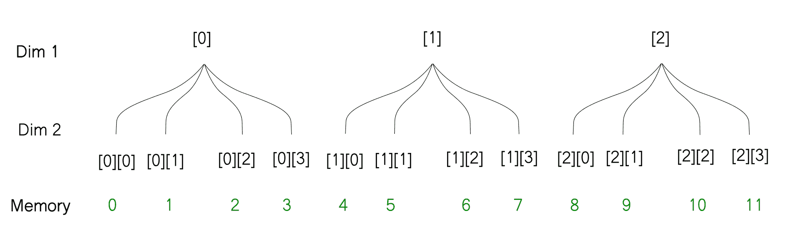

有了这种表示，就很容易知道当你改变一个数组的形状时会发生什么。需要注意的是，整形不会改变数组在内存中的存储方式。因此，当您重塑数组时，树叶的排序方式不会改变，只有树枝的排序方式会改变。例如，当我们将上面的数组从`[3, 4]`整形为`[6,2]`时，我们可以用树形图来想象整形操作。

```py
# Reshaped array -> [6, 2]

[[ 0  1]
 [ 2  3]
 [ 4  5]
 [ 6  7]
 [ 8  9]
 [10 11]]
```

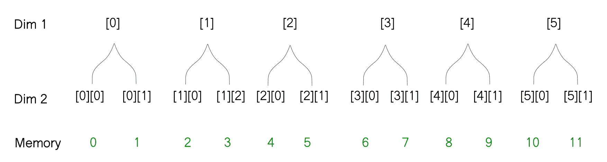

这里有一个例子，我们将数组整形为`[2, 2, 3]`。

```py
[[[ 0  1  2]
  [ 3  4  5]]

 [[ 6  7  8]
  [ 9 10 11]]]
```

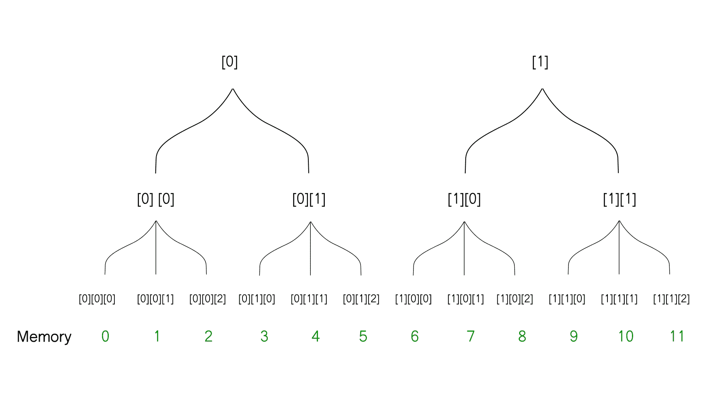

## 置换

另一个允许我们改变数组形状的操作是`transpose`函数。它本质上使我们能够交换数组的维数。我们同样使用`transpose`操作。

转置函数的参数基本上是从`[0, 1, 2 .... n]`到新的索引排列的索引映射。例如，如果我有一个形状为`[5 2 4]`的数组，那么使用`transpose(2, 0, 1)`使它成为`[4 5 2]`，因为索引 0，1，2 分别被映射到它们的新位置。

```py
c = a.transpose(1,0)

[[ 0  4  8]
 [ 1  5  9]
 [ 2  6 10]
 [ 3  7 11]] 
```

操作*转置*本身不需要任何复制，因为它仅仅涉及交换步幅。我们的原始阵列的步幅是`[32,8]`，而转置阵列的步幅是`[8, 32]`。

然而，一旦我们交换了步长，数组就不再以所谓的*行主*格式存储。大多数 NumPy 操作被设计成在*行主*阵列上工作。因此，有许多操作(如`flatten`)在转置数组上执行时，需要创建一个新的数组。解释*行主*和*列主*超出了本文的范围。不过这里给好奇的灵魂一个参考。

[](https://eli.thegreenplace.net/2015/memory-layout-of-multi-dimensional-arrays)[Memory layout of multi-dimensional arrays - Eli Bendersky’s websiteEli Bendersky's website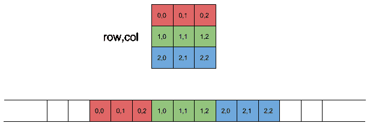](https://eli.thegreenplace.net/2015/memory-layout-of-multi-dimensional-arrays)

创建新数组时，存储为连续块的元素的顺序会发生变化。考虑我们使用映射`(0, 1)`转置的二维数组。在新创建的数组中，与索引`[a][b]`对应的元素与原始数组中与索引`[b][a]`对应的元素交换。

回到树形可视化，这是上面的转置操作看起来的样子。

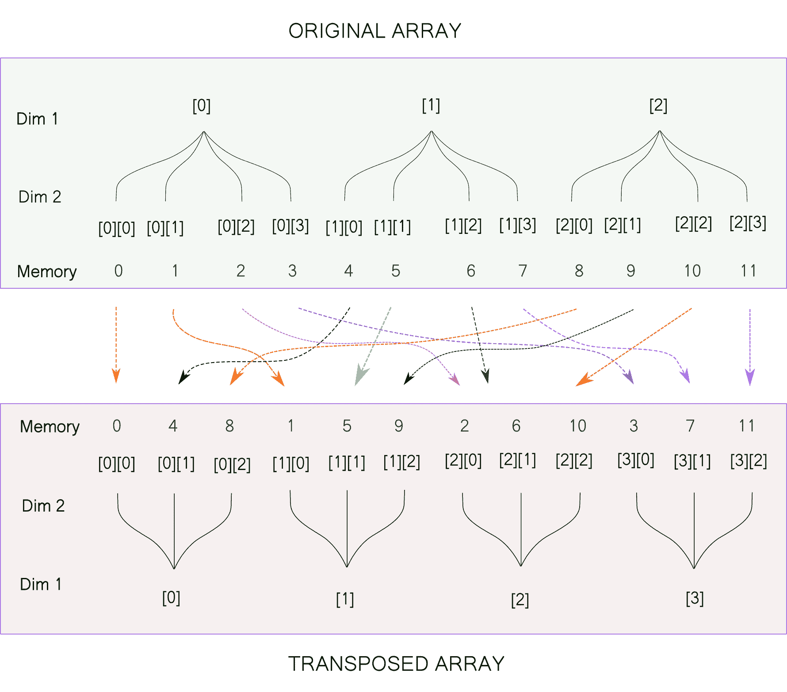

转置后的数组的形状为`[4,3]`。我们之前已经将我们的原始数组调整为`[4,3]`。请注意，尽管形状相同，但这两个数组是不同的。这是由于存储器中元素的顺序对于整形操作不变，而对于转置操作却变了。

继续看一个更复杂的例子，让我们考虑一个三维数组，在这个数组中我们交换了不止一组维度。用树形图来展示它会有点复杂，所以我们将使用代码来演示这个概念。我们对随机数组使用转置映射`(2, 0, 1)`。

```py
a = np.random.randint(100, size = (5, 7, 6))
b = a.transpose(2,0,1)
```

如上所述，对应于索引`[i][j][k]`的任何元素将与对应于索引`[k][i][j]`的元素交换。我们可以用上面的数组试试。

```py
print(a[1,2,3] == b[3,1,2])
# output -> True 

print(a[3,4,2] == b[2,3,4])
# output -> True 
```

## 结论

这就是这篇文章的内容。在这篇文章中，我们讨论了一些重要的话题，比如跨步、重塑和移调。为了在 NumPy 的这些方面建立一个命令，我鼓励你思考类似于这篇文章中的例子，然后将结果与你所学的相比较。

正如本文开头所承诺的，在下一部分中，我们将使用整形和转置操作的混合来优化基于深度学习的对象检测器的输出管道。到那时，快乐的编码！

## 参考

[IPython Cookbook - 4.5\. Understanding the internals of NumPy to avoid unnecessary array copyingIPython Cookbook,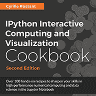4.5\. Understanding the internals of NumPy to avoid unnecessary array copying](https://ipython-books.github.io/45-understanding-the-internals-of-numpy-to-avoid-unnecessary-array-copying/)[](https://scipy-lectures.org/advanced/advanced_numpy/index.html)[2.2\. Advanced NumPy — Scipy lecture notes](https://scipy-lectures.org/advanced/advanced_numpy/index.html)[](https://scipy-lectures.org/advanced/advanced_numpy/index.html)