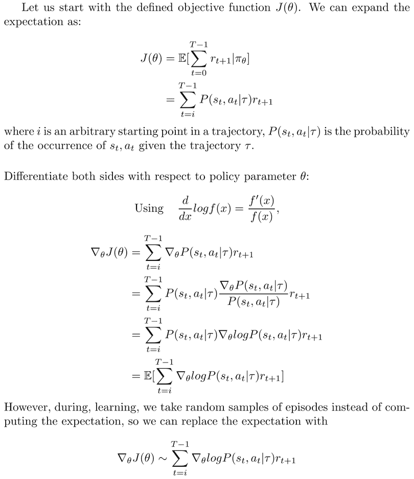
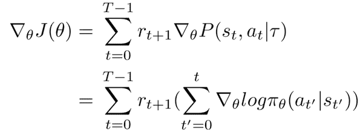
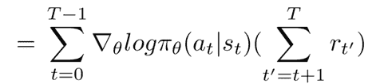
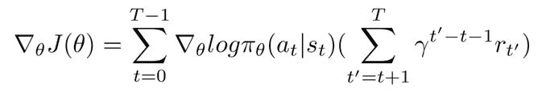
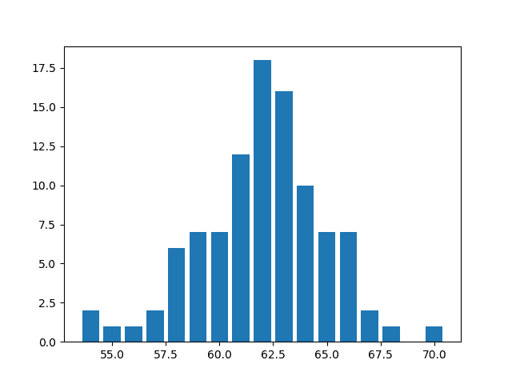

# 神经结构搜索第 4 部分:强化梯度和评估

> 原文：<https://blog.paperspace.com/neural-architecture-search-reinforce-gradient/>

到目前为止，我们已经建立了神经结构搜索(NAS)管道的两个主要组件。在本系列的第二部分中，我们创建了一个模型生成器，它获取编码序列并从中创建 MLP 模型，编译它们，从先前训练的架构中转移权重，并训练新的架构。在本系列的[第三部分](https://blog.paperspace.com/neural-architecture-search-controllers/)中，我们着眼于为我们的神经架构搜索工具构建控制器，该工具使用 LSTM 控制器对架构序列进行采样。我们还研究了如何在控制器中加入精度预测器。

在这个系列的最后一部分，我们将看看如何让这两个组件一起工作。我们将涵盖自定义损失函数以及如何使用增强梯度来训练我们的控制器。我们还将实现我们的搜索逻辑，并查看一些评估工具。

本教程将涵盖:

*   管道
*   训练模型
*   记录模型度量
*   控制器的数据准备
*   加固坡度
*   培训管制员
*   评估模型指标
*   了解结果

## 管道

正如我们在本系列的前几部分中所讨论的，我们看到整个管道包括以下步骤-

1.  使用控制器生成代表有效 MLP 架构的编码序列。
2.  将编码序列转换成实际的 MLP 模型。
3.  训练表示 MLP 模型并记录其验证准确性。
4.  利用这种验证准确性和编码的模型架构来训练控制器本身。
5.  重复一遍。

我们已经看到了控制器如何完成第一步，以及模型生成器如何完成第二步和第三步。我们还编写了训练控制器的函数。但是缺少了一个重要的部分。在我们的控制器中，我们以一种将损失函数作为输入的方式编写训练函数。

在我们进入所有这些之前，让我们开始构建我们的主 MLPNAS 类。这个类继承了我们在上一部分中编写的控制器类，并且还将 MLPGenerator 类初始化为一个对象。这两个类将相互交互来执行架构搜索。

导入常量文件后，我们将用以下常量初始化它-

*   数据集中目标类的数量。
*   每个控制器时期必须采样多少个架构(假设这是控制器的批量大小)
*   总共有多少个控制器时代
*   在每个控制器历元上训练控制器多少个历元
*   训练每个生成的架构需要多少个时期
*   计算折扣奖励所需的 alpha 值(稍后将详细介绍)

```py
class MLPNAS(Controller):

    def __init__(self, x, y):

        self.x = x
        self.y = y
        self.target_classes = TARGET_CLASSES
        self.controller_sampling_epochs = CONTROLLER_SAMPLING_EPOCHS
        self.samples_per_controller_epoch = SAMPLES_PER_CONTROLLER_EPOCH
        self.controller_train_epochs = CONTROLLER_TRAINING_EPOCHS
        self.architecture_train_epochs = ARCHITECTURE_TRAINING_EPOCHS
        self.controller_loss_alpha = CONTROLLER_LOSS_ALPHA

        self.data = []
        self.nas_data_log = 'LOGS/nas_data.pkl'
        clean_log()

        super().__init__()

        self.model_generator = MLPGenerator()

        self.controller_batch_size = len(self.data)
        self.controller_input_shape = (1, MAX_ARCHITECTURE_LENGTH - 1)
        if self.use_predictor:
            self.controller_model = self.hybrid_control_model(self.controller_input_shape, self.controller_batch_size)
        else:
            self.controller_model = self.control_model(self.controller_input_shape, self.controller_batch_size) 
```

## 训练 MLP 模型

我们使用控制器作为序列生成的模型必须转换成可以训练和评估的 MLP 模型。这些培训和评估指标需要被记录，因为验证的准确性将反馈到我们的奖励函数中。除了这些模型的真实指标之外，如果您使用准确性预测器，我们还需要预测给定序列的验证准确性。

假设控制器正在生成序列，并考虑我们在本系列的第二部分中编写并在上面的 MLPNAS 类中初始化的 MLP 生成器代码，我们可以编写下面提到的架构的创建和训练。我们为分类任务训练我们生成的架构，并且使用分类交叉熵函数，除非类的数量是 2。如果是这种情况，我们使用二进制交叉熵函数。每当一个新的架构将要被训练的时候，我们就洗牌，并返回被训练的模型的历史。mlp_generator 使用的函数将在本系列的第二部分中介绍。

```py
# create architectures using encoded sequences we got from the controller
def create_architecture(self, sequence):

    # define loss function according to number of target labels
    if self.target_classes == 2:
	    self.model_generator.loss_func = 'binary_crossentropy'

    # create the model using the model generator
    model = self.model_generator.create_model(sequence, np.shape(self.x[0]))

    # compile said model
    model = self.model_generator.compile_model(model)
    return model

# train the generated architecture
def train_architecture(self, model):

    # shuffle the x and y data
    x, y = unison_shuffled_copies(self.x, self.y)

    # train the model
    history = self.model_generator.train_model(model, x, y, self.architecture_train_epochs)
    return history 
```

在我们研究如何记录指标，以便我们能够轻松地访问它，并捕获模型所需的所有内容之前，让我们看看控制器如何适应整个 MLPNAS 管道。

## 存储培训指标

在存储训练指标时，我们需要考虑每个模型被训练的时期数。如果它被训练超过 1 个时期，我们取所有时期的验证准确度的移动平均值。我们可以使用其他策略，比如给予前几个纪元更高的权重来获得奖励，这样它们将有助于优化学习速度更快的架构。

如果准确度预测器是流水线的一部分，则预测的准确度也被附加到每个 MLP 模型训练条目。

```py
 def append_model_metrics(self, sequence, history, pred_accuracy=None):

        # if the MLP models are trained only for a single epoch
        if len(history.history['val_accuracy']) == 1:

            # if an accuracy predictor is used
            if pred_accuracy:
                self.data.append([sequence,
                                  history.history['val_accuracy'][0],
                                  pred_accuracy])

            # if no accuracy predictor data available
            else:
                self.data.append([sequence,
                                  history.history['val_accuracy'][0]])
            print('validation accuracy: ', history.history['val_accuracy'][0])

        # if the MLP models are trained for more than one epoch
        else:

            # take a moving average of validation accuracy across epochs
            val_acc = np.ma.average(history.history['val_accuracy'],
                                    weights=np.arange(1, len(history.history['val_accuracy']) + 1),
                                    axis=-1)

            # add predicted accuracies if available else don't
            if pred_accuracy:
                self.data.append([sequence,
                                  val_acc,
                                  pred_accuracy])
            else:
                self.data.append([sequence,
                                  val_acc])
            print('validation accuracy: ', val_acc)
```

## 为控制器准备数据

我们通过填充序列来训练编码序列上的控制器，通过将每个序列中的最后一个元素与序列的其余部分分开来将它们分成输入和标签。

我们还返回这些序列的验证精度，因为它们将帮助我们确定控制器训练的奖励以及精度预测器的目标。这个数据是从我们在 MLPNAS 类中初始化的 self.data 列表中获取的，并按照上一节中的详细描述进行填充。

```py
 def prepare_controller_data(self, sequences):

        # pad generated sequences to maximum length
        controller_sequences = pad_sequences(sequences, maxlen=self.max_len, padding='post')

        # split into inputs and labels for LSTM controller
        xc = controller_sequences[:, :-1].reshape(len(controller_sequences), 1, self.max_len - 1)
        yc = to_categorical(controller_sequences[:, -1], self.controller_classes)

        # get validation accuracies for each for reward function
        val_acc_target = [item[1] for item in self.data]
        return xc, yc, val_acc_target
```

## 使用增强渐变

正如我们在本系列的第一部分中看到的，有几种方法可以优化控制器——遗传算法、博弈论等。在这个实现中，我们将利用一些所谓的加强梯度。

强化梯度是一种政策优化方法，它利用蒙特卡罗抽样和预期回报优化来实现更好的结果。

在我们的 NAS 框架中，我们可以假设状态是 LSTM 控制器的状态，动作是所述控制器预测的序列中的下一个元素，策略是在给定状态的情况下确定动作的概率分布。如果您记得我们编写的函数，该函数用于在给定前一个序列的情况下对序列的下一个元素进行采样，您将会看到，在将前一个序列作为输入提供给 LSTM 后，我们得到的概率数组(softmax 分布)就是策略。我们使用概率抽样来得到我们的行动。概率抽样鼓励探索。

强化梯度是优化政策梯度的一种方式。

[本文](https://medium.com/@thechrisyoon/deriving-policy-gradients-and-implementing-reinforce-f887949bd63)给出了推导加固梯度的综合指南。该方法的概述如下-

对应于我们的网络的策略的概率项可以使用条件概率、应用对数函数和关于参数的微分而被分成其相应的项。



这给了我们以下结果:



这里 pi 代表参数θ处的策略。

我们扩展这个结果，最后得到以下结果



表达式的左侧是给定对应于时间 t 的状态 s 中的动作 a 的策略的对数可能性(由 pi 表示),或控制器的 softmax 分布。

表达式的右边(括号中的总和)是考察我们的代理人得到的报酬的项。我们想在我们的表达式中加入一个折扣因子，以给予眼前的回报比未来的回报更大的权重。右边的项，从 *t* 开始直到剧集结束的奖励总和项，为此目的被乘以伽马项，该伽马项被提升到等于*t’-t-1*的指数。

最终表达式因此变成



其中等式右边右端的总和是折扣奖励。

## 实施增强梯度

为了实现加强梯度，我们编写了一个自定义的损失函数，实现了上面提到的对数概率和折扣奖励的乘积。

我们定义一个函数来计算折扣奖励，该函数迭代地将 gamma 值增加到计数器，并与该步骤的奖励相乘。迭代加法的次数取决于特定动作的 t 值。获得折扣奖励后，我们根据其 z 值(通过减去平均值并除以标准偏差计算)对其进行归一化，并在我们的自定义损失函数中使用该数组作为折扣奖励。

折扣奖励本身取决于奖励，我们将奖励定义为减去基线的特定网络的验证准确性。有一个基线(在我们的例子中，0.5)可以确保准确率低于 50%的网络受到惩罚，而准确率高于 50%的网络受到奖励。当然，您可以在自己的实现中更改该值以获得更高的精度。

```py
 def get_discounted_reward(self, rewards):

        # initialise discounted reward array
        discounted_r = np.zeros_like(rewards, dtype=np.float32)

        # every element in the discounted reward array
        for t in range(len(rewards)):
            running_add = 0.
            exp = 0.

            # will need us to iterate over all rewards from t to T
            for r in rewards[t:]:
                running_add += self.controller_loss_alpha**exp * r
                exp += 1

            # add values to the discounted reward array
            discounted_r[t] = running_add

        # normalize discounted reward array
        discounted_r = (discounted_r - discounted_r.mean()) / discounted_r.std()
        return discounted_r

	# loss function based on discounted reward for policy gradients
    def custom_loss(self, target, output):

        # define baseline for rewards and subtract it from all validation accuracies to get reward. 
        baseline = 0.5
        reward = np.array([item[1] - baseline for item in self.data[-self.samples_per_controller_epoch:]]).reshape(
            self.samples_per_controller_epoch, 1)

        # get discounted reward
        discounted_reward = self.get_discounted_reward(reward)

        # multiply discounted reward by log likelihood of actions to get loss function
        loss = - K.log(output) * discounted_reward[:, None]
        return loss
```

在 Keras 中编写自定义损失函数时，我们必须确保输入始终是目标和输出，即使我们不会使用任何目标值来训练我们的控制器。我们得到输出的负对数(可能行动的 softmax 分布),并将其乘以折扣奖励。这个损失函数然后在我们的训练过程中被我们选择的优化器优化。

## 培训管制员

一旦我们有了损失函数，当训练控制器时，我们唯一需要关心的是控制器是否使用精度预测器。如果是，我们使用我们在系列的第三部分中定义的混合控制模型。如果没有，我们使用简单的控制模型。

混合控制器也将把预测的精度作为输入。我们不为精度预测器写一个单独的损失函数。相反，均方误差损失用于精度预测。

```py
 def train_controller(self, model, x, y, pred_accuracy=None):
        if self.use_predictor:
            self.train_hybrid_model(model,
                                    x,
                                    y,
                                    pred_accuracy,
                                    self.custom_loss,
                                    len(self.data),
                                    self.controller_train_epochs)
        else:
            self.train_control_model(model,
                                     x,
                                     y,
                                     self.custom_loss,
                                     len(self.data),
                                     self.controller_train_epochs)
```

## 主 NAS 环路

我们已经编写了最终运行整个 NAS 管道所需的所有功能。

主函数看起来像这样:

```py
 def search(self):

        # for every controller epoch
        for controller_epoch in range(self.controller_sampling_epochs):

            # generate sequences
            sequences = self.sample_architecture_sequences(self.controller_model, self.samples_per_controller_epoch)

            # if using a predictor, predict their accuracies
            if self.use_predictor:
                pred_accuracies = self.get_predicted_accuracies_hybrid_model(self.controller_model, sequences)

            # for each sequence generated in a controller epoch
            for i, sequence in enumerate(sequences):

                # create an MLP model 
                model = self.create_architecture(sequence)

                # train said MLP model
                history = self.train_architecture(model)

                # log the model metrics
                if self.use_predictor:
                    self.append_model_metrics(sequence, history, pred_accuracies[i])
                else:
                    self.append_model_metrics(sequence, history)

            # prepare data for the controller
            xc, yc, val_acc_target = self.prepare_controller_data(sequences)

            # train the controller
            self.train_controller(self.controller_model,
                                  xc,
                                  yc,
                                  val_acc_target[-self.samples_per_controller_epoch:])

        # save all the NAS logs in a pickle file
        with open(self.nas_data_log, 'wb') as f:
            pickle.dump(self.data, f)

        return self.data
```

## 常数

在试验我们的 NAS 方法的性能时，可能需要改变许多参数。为了使常量更容易访问，我们创建了一个单独的文件来保存所有必要的参数。您可能已经注意到，我们到目前为止编写的所有脚本都利用了某些初始化值。这些值将从我们下面定义的常量文件中导入。

```py
########################################################
#                   NAS PARAMETERS                     #
########################################################
CONTROLLER_SAMPLING_EPOCHS = 10
SAMPLES_PER_CONTROLLER_EPOCH = 10
CONTROLLER_TRAINING_EPOCHS = 10
ARCHITECTURE_TRAINING_EPOCHS = 10
CONTROLLER_LOSS_ALPHA = 0.9

########################################################
#               CONTROLLER PARAMETERS                  #
########################################################
CONTROLLER_LSTM_DIM = 100
CONTROLLER_OPTIMIZER = 'Adam'
CONTROLLER_LEARNING_RATE = 0.01
CONTROLLER_DECAY = 0.1
CONTROLLER_MOMENTUM = 0.0
CONTROLLER_USE_PREDICTOR = True

########################################################
#                   MLP PARAMETERS                     #
########################################################
MAX_ARCHITECTURE_LENGTH = 3
MLP_OPTIMIZER = 'Adam'
MLP_LEARNING_RATE = 0.01
MLP_DECAY = 0.0
MLP_MOMENTUM = 0.0
MLP_DROPOUT = 0.2
MLP_LOSS_FUNCTION = 'categorical_crossentropy'
MLP_ONE_SHOT = True

########################################################
#                   DATA PARAMETERS                    #
########################################################
TARGET_CLASSES = 3

########################################################
#                  OUTPUT PARAMETERS                   #
########################################################
TOP_N = 5
```

从一个数据集切换到另一个数据集时，唯一需要更改的是数据集中存在的目标类的数量。

## 运行 MLPNAS

就是这样。现在我们所要做的就是对我们选择的数据集运行算法！这是最终文件 run.py 的样子。

```py
import pandas as pd

from utils import *
from mlpnas import MLPNAS
from CONSTANTS import TOP_N

# read the data
data = pd.read_csv('DATASETS/wine-quality.csv')

# split it into X and y values
x = data.drop('quality_label', axis=1, inplace=False).values
y = pd.get_dummies(data['quality_label']).values

# let the search begin
nas_object = MLPNAS(x, y)
data = nas_object.search()

# get top n architectures (the n is defined in constants)
get_top_n_architectures(TOP_N)
```

如您所见，我们有一个最终函数来获取我们尚未详述的前 n 个架构。

## 评估和可视化

当浏览我们从架构搜索中获得的所有数据时，可以进行一些基本的可视化和评估。出于本文的目的，我们将尝试理解:

1.  什么是最好的架构，它们承诺的精度是多少？
2.  在控制器迭代过程中，精度是如何提高的？
3.  我们在搜索中测试的架构的精度分布如何？

我们可以通过使用 Python 中的`mtime`来查看最近的日志。我们还可以隔离最新的事件 ID，并相应地检索我们最近一次运行的 NAS 数据。

```py
def get_latest_event_id():
    all_subdirs = ['LOGS/' + d for d in os.listdir('LOGS') if os.path.isdir('LOGS/' + d)]
    latest_subdir = max(all_subdirs, key=os.path.getmtime)
    return int(latest_subdir.replace('LOGS/event', ''))
```

一旦您有了最新的事件 ID，您就可以根据验证准确性来加载和排序数据，以找出哪些数据比其他数据做得更好。

```py
########################################################
#                 RESULTS PROCESSING                   #
########################################################

def load_nas_data():
    event = get_latest_event_id()
    data_file = 'LOGS/event{}/nas_data.pkl'.format(event)
    with open(data_file, 'rb') as f:
        data = pickle.load(f)
    return data

def sort_search_data(nas_data):
    val_accs = [item[1] for item in nas_data]
    sorted_idx = np.argsort(val_accs)[::-1]
    nas_data = [nas_data[x] for x in sorted_idx]
    return nas_data
```

您可以利用这些经过排序的数据来找出排名前 *n* 的架构。您还可以使用存储的数据来查找解码时编码的架构序列是什么样子，以及它们的验证准确性如何。

```py
def get_top_n_architectures(n):
    data = load_nas_data()
    data = sort_search_data(data)
    search_space = MLPSearchSpace(TARGET_CLASSES)
    print('Top {} Architectures:'.format(n))
    for seq_data in data[:n]:
        print('Architecture', search_space.decode_sequence(seq_data[0]))
        print('Validation Accuracy:', seq_data[1])
```

下面是一个运行输出的示例，它使用了一次性架构方法，但没有使用精度预测器。

```py
Architecture [(128, 'relu'), (3, 'softmax')]
Validation Accuracy: 0.7023747715083035
Architecture [(512, 'relu'), (3, 'softmax')]
Validation Accuracy: 0.6857143044471741
Architecture [(512, 'sigmoid'), (64, 'sigmoid'), (3, 'softmax')]
Validation Accuracy: 0.6775510311126709
Architecture [(32, 'elu'), (3, 'softmax')]
Validation Accuracy: 0.6745825615796176
Architecture [(8, 'elu'), (16, 'tanh'), (3, 'softmax')]
Validation Accuracy: 0.6664564111016014
```

结果可能因随机数生成器种子而异，建议在运行这些算法之前设置种子，以获得可重复的结果。这些结果是在训练 100 个体系结构和每 10 个体系结构后训练控制器后获得的。运行算法的时间越长，测试的架构越多，结果就越好。

通过查看原始的、未分类的数据，可以发现关于我们搜索的本质的其他事情。在下面的第一个函数`get_nas_accuracy_plot()`中，我们绘制了精度在几次迭代中的变化。

在第二个示例中，`get_accuracy_distribution()`，我们将精度按其最接近的整数值进行分类，并得到一个条形图，显示落入不同整数分类的架构数量，范围从 0 到 100。

```py
def get_nas_accuracy_plot():
    data = load_nas_data()
    accuracies = [x[1] for x in data]
    plt.plot(np.arange(len(data)), accuracies)
    plt.show()

def get_accuracy_distribution():
    event = get_latest_event_id()
    data = load_nas_data()
    accuracies = [x[1]*100\. for x in data]
    accuracies = [int(x) for x in accuracies]
    sorted_accs = np.sort(accuracies)
    count_dict = {k: len(list(v)) for k, v in groupby(sorted_accs)}
    plt.bar(list(count_dict.keys()), list(count_dict.values()))
    plt.show()
```

相同的运行为我提供了以下准确度分布。



Accuracies are on the x-axis, and % architectures falling in the accuracy bins on the y-axis.

上述功能只是为了让您开始评估 NAS 方法。您还可以定义更多的评估方法，例如通过找出哪些层被预测为第一层或第二层，哪些隐藏层对精度的影响最大等来了解模型预测。

## 结论

这就是我们 4 部分系列的结尾。在第 1 部分中，我们看到了神经结构搜索研究目前所处位置的全面概述。我们看到了 NAS 在更广泛的意义上是如何工作的，人们通常用来解决问题的不同方法有哪些，对于同样的问题有哪些鲜为人知的方法，它们的性能如何，等等。我们还看了几篇解决 NAS 算法计算效率这一重要问题的论文。

在第 2 部分中，我们将自动设计 MLP 的简单问题作为一个实现练习来处理。我们构建我们的搜索空间和一个生成器，该生成器将获取搜索空间中设计的编码序列，并将其转换为可以训练和评估的 Keras 架构。我们也探索一次性学习。

第 3 部分讨论控制器，即生成这些编码序列的机制。除了建立一个 LSTM 控制器，我们还着眼于准确性预测，以及它们如何在一个混合控制器模型中联系在一起。

最后，在本文中，我们通过实施增强梯度作为控制器优化方法，将所有这些部分联系在一起。我们还看了一些 NAS 评估技术。我们着眼于实现定制的损失函数，理解折扣奖励，并把它们结合起来，只用最后几行代码就可以运行搜索。我们还研究了一些可视化和分析我们从 MLP 的 NAS 中获得的结果的基本方法。

完整的代码实现可以在[这里](https://github.com/codeaway23/MLPNAS)找到。

我希望你喜欢这个系列。