# 用 PyTorch 上的 GPT-2 生成文本摘要

> 原文：<https://blog.paperspace.com/generating-text-summaries-gpt-2/>

在这篇文章中，我将描述一个抽象的文本摘要方法，在$[1]中首次提到，用来训练一个文本摘要器。然后，我们将看到如何在 CNN/Daily Mail 文本摘要数据集上微调预训练的基于 Transformer 解码器的语言模型(GPT、GPT-2 和现在的 GPT-3)。在不添加任何新参数的情况下，我们将在对来自训练数据集的 3000 个示例进行 5 个时期的训练后，获得一个非常强大的抽象文本摘要器。

## 介绍

当你希望机器学习传达文本的意思时，它可以做两件事之一:重新表述信息，或者只向你展示内容中最重要的部分。第一种方法被称为**抽象概括**，而第二种被称为**提取概括**。这两项任务都不容易，即使在当前的技术水平下，这两项任务也有其自身的局限性。摘要通常不能以自然的方式组织句子，因此所创建的摘要的可读性是不可接受的，并且很多时候甚至不能传达内容的要旨。同时，目前最先进的深度学习模型如 [GPT-3](https://arxiv.org/abs/2005.14165) 、 [GPT-2](https://openai.com/blog/better-language-models/) 、[伯特](https://ai.googleblog.com/2018/11/open-sourcing-bert-state-of-art-pre.html)等。帮助我们在可读性方面生成类似人类的摘要，但是它们的正确性经常是有问题的。在这里，我们将重点关注用后一种方法实现可接受的结果。

带有 RNNs 或[变形金刚](https://blog.paperspace.com/introducing-paperspace-hugging-face/)的 [Seq2Seq](https://google.github.io/seq2seq/) 架构在困难的自然语言处理任务中非常流行，比如机器翻译或文本摘要。Seq2Seq 架构上也做了很多改进，像[注意](https://blog.paperspace.com/attention-mechanisms-in-computer-vision-cbam/)(选择更相关的内容)、复制和覆盖机制(复制不太频繁的令牌，阻止重复)等。在这里，我们将使用标准语言模型目标，在 [CNN/Daily Mail 数据集](https://github.com/abisee/cnn-dailymail)上微调预训练的 GPT/GPT-2 网络，以利用此类模型的强大文本生成能力。

## 数据集准备

我使用了 See 等人提供的非匿名的 [CNN/Daily Mail](https://github.com/abisee/cnn-dailymail) 数据集$[2]$用于将新闻文章总结为 2-3 句话。一个干净的和标记化的版本可以在[这里](https://github.com/JafferWilson/Process-Data-of-CNN-DailyMail) $[3]$。为了将这些数据提供给 GPT/GPT-2 模型，我执行了一些专门针对 GPT 模型的预处理步骤。

由于 GPT 模型对上下文大小有限制(GPT 和 GPT-2 分别有 512 和 1024 个令牌)，我只选择了那些在使用 GPT 令牌化器进行令牌化后最多有 512 和 1024 个令牌的文件。图 1 显示了 CNN 和 Daily Mail 数据集的文件大小分布(总字数)。为了进行训练，我只从 CNN 和 Daily Mail 的数据集中选择了 1500 个具有相关数量令牌的文件。

为了使这个实验在计算上更有效，我没有在完整的数据集上训练模型。为了加快数据加载过程，我将标记化的文章和摘要保存在。json 文件，带有用于训练的属性“id”、“article”和“abstract”。我的实验是在免费的[渐变社区笔记本](https://gradient.paperspace.com/free-gpu)上完成的。可以找到要创建的脚本。json 文件和 NumPy 矩阵的数据分别是[这里的](https://github.com/SKRohit/Generating_Text_Summary_With_GPT2/blob/master/prepare_data.py)和[这里的](https://github.com/SKRohit/Generating_Text_Summary_With_GPT2/blob/master/prepare_np_data.py)。

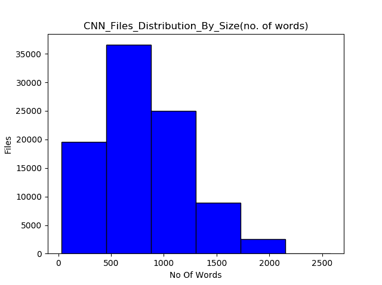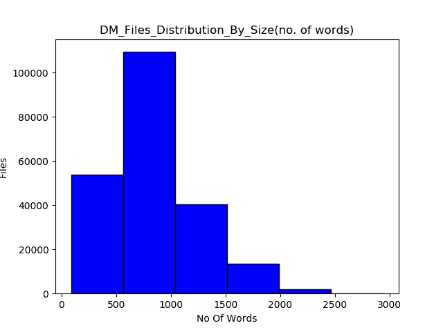

Figure 1\. Distribution of CNN/Daily Mail file sizes

这是我的`Dataset`类，它从。json 文件:

```py
class GPT21024Dataset(Dataset):

    def __init__(self, root_dir, ids_file, mode='train',length=None):
        self.root_dir = root_dir
        self.tokenizer = add_special_tokens()
        with open(ids_file,'r') as f:
            if mode=='train':
                self.idxs = json.load(f)['train_ids']
            elif mode=='valid':
                self.idxs = json.load(f)['valid_ids']
            else:
                self.idxs = json.load(f)['test_ids']
        if len == None:
            self.len = len(self.idxs)
        else:
            self.len = length

    def __len__(self):
        return self.len

    def __getitem__(self,idx):
        idx = self.idxs[idx]
        file_name = os.path.join(self.root_dir,str(idx)+".json")
        with open(file_name,'r') as f:
              data = json.load(f)
        text = self.tokenizer.encode(self.tokenizer.pad_token)*1024
        content = data['article'] + self.tokenizer.encode(self.tokenizer.sep_token) + data['abstract']
        text[:len(content)] = content
        text = torch.tensor(text)
        sample = {'article': text, 'sum_idx': len(data['article'])}
        return sample
```

## 方法

在深入研究微调细节之前，让我们首先了解一般语言模型背后的基本思想，特别是 GPT 风格的语言模型。

语言模型是一种概率模型，它在给定序列中前面的标记的情况下预测该序列中的下一个标记。它根据在训练中看到的文本示例，学习一个句子或一系列标记出现的概率。它可以用下面的条件概率来表示:

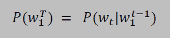

[Source](https://dl.acm.org/doi/10.5555/944919.944966)


[Source](https://dl.acm.org/doi/10.5555/944919.944966)

GPT/GPT-2 是[变压器](https://ml-showcase.paperspace.com/projects/hugging-face)模型的变体，它只有变压器网络的解码器部分。它使用多头掩蔽自我关注，这允许它在时间步长 *t* 只查看第一个 *i* 标记，并使它们能够像传统的单向语言模型一样工作。然而，这些模型[不是像 rnn 那样顺序处理令牌，而是并行处理令牌](http://jalammar.github.io/illustrated-gpt2/)，即通过一次预测所有时间步长的令牌。这种模型可以表示为:

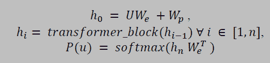

[Source](https://s3-us-west-2.amazonaws.com/openai-assets/research-covers/language-unsupervised/language_understanding_paper.pdf)

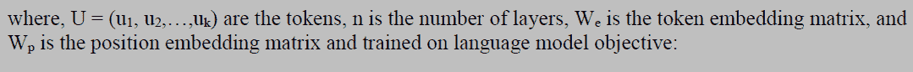

[Source](https://s3-us-west-2.amazonaws.com/openai-assets/research-covers/language-unsupervised/language_understanding_paper.pdf)

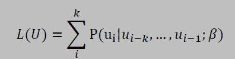

[Source](https://s3-us-west-2.amazonaws.com/openai-assets/research-covers/language-unsupervised/language_understanding_paper.pdf)

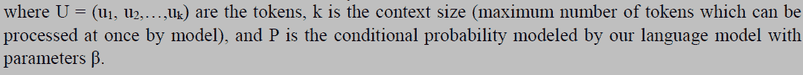

[Source](https://s3-us-west-2.amazonaws.com/openai-assets/research-covers/language-unsupervised/language_understanding_paper.pdf)

## 微调细节

我使用[拥抱面部变形库](https://ml-showcase.paperspace.com/projects/hugging-face) $[4]$来实现 GPT-2，因为它们超级简单的 API 可以帮助人们专注于模型训练的其他方面，如超参数优化等。事实证明，这在许多微调任务中更有价值。让我们首先加载所有的依赖项:

```py
import argparse
from datetime import datetime
import json
import os
import pickle
import random
import sys
import time

import numpy as np
from pytorch_transformers import GPT2Tokenizer
import torch
from torch.nn import CrossEntropyLoss
import torch.nn.functional as F
from torch.utils.data import DataLoader, RandomSampler, SequentialSampler
from tqdm import tnrange, tqdm
from pytorch_transformers import ConstantLRSchedule, GPT2Config, GPT2LMHeadModel,AdamW, GPT2Tokenizer, WarmupLinearSchedule
from tensorboardX import SummaryWriter

from dataset import GPT21024Dataset 
from utils import add_special_tokens, beam_search, generate_beam_sample, generate_sample, sample_seq, set_seed, top_k_top_p_filtering
```

在训练示例中，我用分隔符(`<|sep|>`)、中间的分隔符(用填充符(`<|pad|>`)和另一个分隔符连接源(摘要)和目标(文章)，对于 GPT 和 GPT-2，上下文大小分别达到 512 和 1024。这种添加定界符的方法已经在 GPT 的论文中针对不同的 NLP 任务进行了探索，例如文本蕴涵等。可以使用 GPT 记号赋予器的`add_special_tokens` 方法向其添加新的分隔符或特殊记号:

```py
def add_special_tokens():
	""" Returns GPT2 tokenizer after adding separator and padding tokens """
	tokenizer = GPT2Tokenizer.from_pretrained('gpt2')
	special_tokens = {'pad_token':'<|pad|>','sep_token':'<|sep|>'}
	num_add_toks = tokenizer.add_special_tokens(special_tokens)
	return tokenizer
```

像 Seq2Seq 模型一样，我也考虑了目标(摘要)序列的交叉熵损失，因为考虑源(文章)和目标序列的交叉熵损失不会改变性能。我忽略了填充标记的损失，这提高了生成的摘要的质量。我尝试在每 15 步后逐层解冻，而不是一次微调所有权重。与完全微调相比，由于逐层解冻，训练和验证损失减少，但是生成的摘要的质量并没有最终更好，这可能是由于过度拟合。我还发现，如果仅在 3000 个例子(文章摘要对)上训练超过 5 个时期，GPT 和 GPT-2 都是过度拟合的。我注意到模型越大，生成的摘要质量越好。GPT-2 345M 生成了最好的摘要。您可以在下面找到一些示例生成的摘要。

我还试验了不同的超参数，如学习率、学习率调度器、优化器、时期数、`gradient_accumulation_steps`、`max_grad_norm`等。并且发现使用 5e-5 的学习速率，具有 200 个预热步骤的线性预热调度器，AdamW 优化器，总共 5 个时期(超过 5 个导致过拟合)，`gradient_accumulation_steps`为 32，`max_grad_norm`为 1 似乎对于 GPT 和 GPT-2 模型都是最好的。但是，在我看来，仍然可以对超参数优化进行更彻底的分析，可以增加训练数据集的大小来改进模型。下面是我的`train`函数，你可以在这里找到完整的训练脚本[:](https://github.com/SKRohit/Generating_Text_Summary_With_GPT2/blob/master/train_gpt2_summarizer.py)

```py
def train(args, model, tokenizer, train_dataset, valid_dataset, ignore_index):
	""" Trains GPT2 model and logs necessary details.
		Args:
			args: dict that contains all the necessary information passed by user while training
 			model: finetuned gpt/gpt2 model
			tokenizer: GPT/GPT2 tokenizer
			train_dataset: GPT21024Dataset object for training data
			ignore_index: token not considered in loss calculation
	"""
    writer = SummaryWriter('./logs')
    train_sampler = RandomSampler(train_dataset)
    train_dl = DataLoader(train_dataset,sampler=train_sampler,batch_size=args.batch_size,num_workers=args.num_workers)
    loss_fct = CrossEntropyLoss(ignore_index=ignore_index) #ignores padding token for loss calculation
    optimizer = AdamW(model.parameters(),lr=args.lr)
    scheduler = WarmupLinearSchedule(optimizer,100,80000)

    global_step = 0
    tr_loss, logging_loss = 0.0, 0.0
    model.zero_grad()
    train_iterator = tnrange(int(args.num_train_epochs), desc="Epoch")
    set_seed(args)
    for _ in train_iterator:
        epoch_iterator = tqdm(train_dl, desc="Training")
        for step, batch in enumerate(epoch_iterator):
            inputs, labels = torch.tensor(batch['article']), torch.tensor(batch['article'])
            inputs = inputs.to(args.device)
            labels = labels.to(args.device)
            model.train()
            logits = model(inputs)[0]
            idx = batch['sum_idx'].item() # index of separator token
            # only consider loss on reference summary just like seq2seq models
            shift_logits = logits[..., idx:-1, :].contiguous()
            shift_labels = labels[..., idx+1:].contiguous()
            loss = loss_fct(shift_logits.view(-1, shift_logits.size(-1)), shift_labels.view(-1))
            loss = loss/args.gradient_accumulation_steps
            loss.backward()
            torch.nn.utils.clip_grad_norm_(model.parameters(), args.max_grad_norm)
            tr_loss += loss.item()
            if (step + 1) % args.gradient_accumulation_steps == 0:
                optimizer.step()
                scheduler.step()  # Update learning rate schedule
                model.zero_grad()
                global_step += 1
                writer.add_scalar('lr', scheduler.get_lr()[0], global_step)
                writer.add_scalar('loss', (tr_loss - logging_loss)/args.gradient_accumulation_steps, global_step)
                logging_loss = tr_loss
                print("loss:", loss.item(), end='\n\n')
                if (step + 1)/args.gradient_accumulation_steps == 1.0:
                	print('After 1st update: ', end='\n\n')
                	generate_sample(valid_dataset, tokenizer, num=2, eval_step=False)

            if (step + 1) % (10*args.gradient_accumulation_steps) == 0:
                results = evaluate(args, model, valid_dataset, ignore_index, global_step)
                for key, value in results.items():
                    writer.add_scalar('eval_{}'.format(key), value, global_step)
                print('After', global_step+1,'updates: ', end='\n\n')
                generate_sample(valid_dataset, tokenizer, num=2, eval_step=True) 
```

上述`train`函数中的大部分代码都是不言自明的。我想指出的一点是，由于 GPT/GPT-2 非常大，我只能在 16GB 的 Nvidia V100 上容纳 1 或 2 的批量大小(取决于型号大小)。因此，为了增加批量大小，我使用了在更新权重之前为 *n* 步数累积[梯度](https://medium.com/huggingface/training-larger-batches-practical-tips-on-1-gpu-multi-gpu-distributed-setups-ec88c3e51255)的想法，其中 *n* 将是我们的批量大小。

在生成摘要时，我分别用不同的`top_k`、`top_p`、温度和波束宽度值尝试了[核采样](https://arxiv.org/abs/1904.09751)和波束搜索，发现`top_k` = 10、`top_p` = 0.5 和温度= 0.8 生成了不错的核采样摘要，而波束宽度为 3 则很适合波束搜索。下面是使用核采样生成给定长度的样本摘要的代码，其中`top_k_top_p_filtering`函数执行核过滤。

```py
def top_k_top_p_filtering(logits, top_k=0, top_p=0.0, filter_value=-float('Inf')):
    """ Filter a distribution of logits using top-k and/or nucleus (top-p) filtering
        Args:
            logits: logits distribution shape (vocabulary size)
            top_k > 0: keep only top k tokens with highest probability (top-k filtering).
            top_p > 0.0: keep the top tokens with cumulative probability >= top_p (nucleus filtering).
                Nucleus filtering is described in Holtzman et al. (http://arxiv.org/abs/1904.09751)
        From: https://gist.github.com/thomwolf/1a5a29f6962089e871b94cbd09daf317
    """
    assert logits.dim() == 1  # batch size 1 for now - could be updated for more but the code would be less clear
    top_k = min(top_k, logits.size(-1))  # Safety check
    if top_k > 0:
        # Remove all tokens with a probability less than the last token of the top-k
        indices_to_remove = logits < torch.topk(logits, top_k)[0][..., -1, None]
        logits[indices_to_remove] = filter_value

    if top_p > 0.0:
        sorted_logits, sorted_indices = torch.sort(logits, descending=True)
        cumulative_probs = torch.cumsum(F.softmax(sorted_logits, dim=-1), dim=-1)

        # Remove tokens with cumulative probability above the threshold
        sorted_indices_to_remove = cumulative_probs > top_p
        # Shift the indices to the right to keep also the first token above the threshold
        sorted_indices_to_remove[..., 1:] = sorted_indices_to_remove[..., :-1].clone()
        sorted_indices_to_remove[..., 0] = 0

        indices_to_remove = sorted_indices[sorted_indices_to_remove]
        logits[indices_to_remove] = filter_value
    return logits

def sample_seq(model, context, length, device, temperature=1, top_k=0, top_p=0.0):
	""" Generates a sequence of tokens 
		Args:
			model: gpt/gpt2 model
			context: tokenized text using gpt/gpt2 tokenizer
			length: length of generated sequence.
			device: torch.device object.
			temperature >0: used to control the randomness of predictions by scaling the logits before applying softmax.
			top_k > 0: keep only top k tokens with highest probability (top-k filtering).
			top_p > 0.0: keep the top tokens with cumulative probability >= top_p (nucleus filtering).
	"""
    context = torch.tensor(context, dtype=torch.long, device=device)
    context = context.unsqueeze(0)
    generated = context
    with torch.no_grad():  
        for _ in tnrange(length):
            inputs = {'input_ids': generated}
            outputs = model(**inputs)  # Note: we could also use 'past' with GPT-2/Transfo-XL/XLNet (cached hidden-states)
            next_token_logits = outputs[0][0, -1, :] / temperature
            filtered_logits = top_k_top_p_filtering(next_token_logits, top_k=top_k, top_p=top_p)
            next_token = torch.multinomial(F.softmax(filtered_logits, dim=-1), num_samples=1)
            generated = torch.cat((generated, next_token.unsqueeze(0)), dim=1)
    return generated 
```

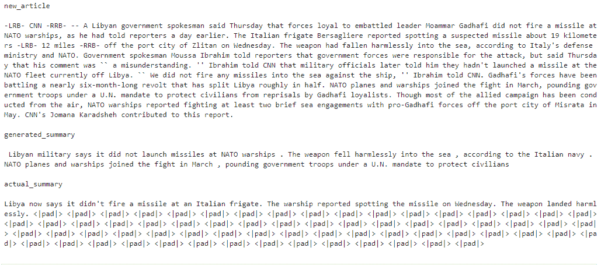

Sample generated summary 1

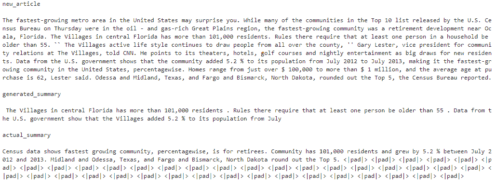

Sample generated summary 2

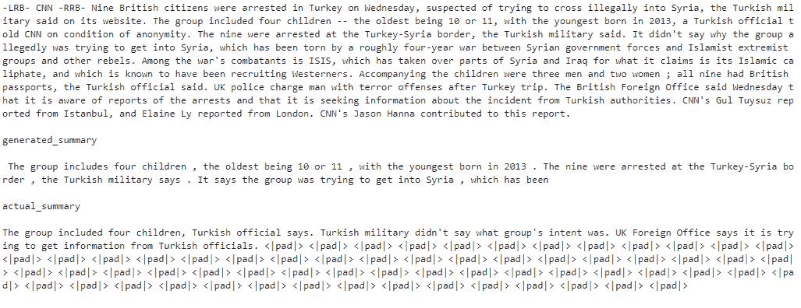

Sample generated summary 3

### 限制

在将这种技术应用到现实世界的用例之前，我们必须意识到这种方法的局限性，以及一般的抽象概括模型。抽象摘要技术通常面临生成事实上不正确的摘要，或者语法上正确但没有任何意义的摘要的问题。例如:

> 伊朗在与美国达成核协议后赢得了世界杯。该协议有望结束伊朗在多年严重制裁下的国际孤立。

在最近由 [OpenAI](https://openai.com/blog/fine-tuning-gpt-2/) 和 [Salesforce](https://arxiv.org/abs/1908.08960) (独立)发表的研究中，他们发现在 [CNN/Daily Mail](https://github.com/abisee/cnn-dailymail) 数据集上生成的摘要最多只有 70%的正确率，与使用的模型无关。然而，斯坦福大学[和佛罗里达大学](https://arxiv.org/abs/1911.02541)最近的一项工作提出了一种补救方法，即使用强化学习，对照参考摘要对生成的摘要进行事实检查。然而，这种方法仍然仅限于少数特定类型的数据集。

### 结果

经过 5 个时期 3000 个训练数据点的训练(在 Nvidia V100 上可以在 90 分钟内完成)，这证明了使用 GPT-2 在小数据集上进行文本摘要的快速有效的方法。随着模型大小的增加，可以很容易地看到生成的摘要的质量的提高。此外，事实的不准确性和摘要的抽象性随着大型模型而减少，这可能是因为大型模型的记忆能力增加了。所生成的摘要表明，与其他文本摘要模型一样，微调后的模型正试图隐式地利用“[倒金字塔](https://www.aclweb.org/anthology/D19-1051)结构。此外，我注意到在 5 个时期后，摘要的抽象性更差，对于 GPT-2 (345 米)这可能是由于过度拟合。在下面的图 2 中，我展示了不同 GPT 模型生成的摘要的实际准确性之间的比较。

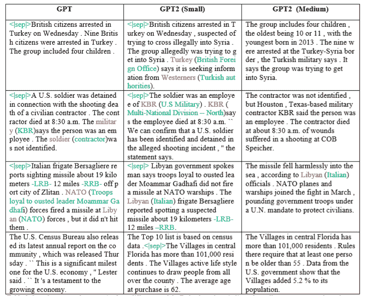

Figure 2\. Sample generated summaries from different models. Red color tokens indicate generated words or phrases which were factually incorrect. Green color words or phrases are appropriately copied replacements, and blue color tokens indicate unwanted generated tokens.

### 尾注

在这篇文章中，我们看到了基于 Transformer 解码器的语言模型，如 GPT/GPT-2，这些模型在大型数据集上进行了预训练，可以很容易地进行微调，以实现仅使用最少数据的抽象摘要的良好结果。这种方法利用了迁移学习的力量，这种力量在 Transformer 架构的许多其他自然语言处理任务中已经看到。由于这种方法需要最少的数据量，它可以应用于各种其他狭窄领域和低资源语言。所提出的方法产生的摘要与输入文档一致(在大多数情况下)，并且具有高流畅性，正如基于 GPT 的模型所期望的那样(尽管一些产生的摘要的事实正确性存在问题)。最近由 [OpenAI](https://openai.com/blog/fine-tuning-gpt-2/) 和 [Salesforce](https://arxiv.org/abs/1908.08960) 所做的工作表明，这是一个独立于抽象概括模型的普遍问题。这个文本摘要项目的完整代码可以在[这里](https://github.com/SKRohit/Generating_Text_Summary_With_GPT2)找到。

### 参考

1.  [使用单个预先训练的变换器的高效文本摘要示例](https://arxiv.org/abs/1905.08836)
2.  [CNN-每日邮报数据集准备](https://github.com/abisee/cnn-dailymail)
3.  [符号化的 CNN-每日邮报数据集](https://github.com/JafferWilson/Process-Data-of-CNN-DailyMail)
4.  [抱脸变形金刚](https://github.com/huggingface/transformers)