# NumPy 优化的基本要素第 1 部分:理解向量化和广播

> 原文：<https://blog.paperspace.com/numpy-optimization-vectorization-and-broadcasting/>

如果你在机器学习、数据科学或深度学习等领域工作，加速线性代数计算的库是一个主要工具。NumPy 是 Num 的缩写，可能是最有名的一个，你可能已经用过了。然而，仅仅使用 NumPy 数组代替普通的 Python 列表很难体现 NumPy 必须提供的功能。

在本系列中，我将介绍如何使用 NumPy 加速您的代码的最佳实践，如何利用矢量化和广播等特性，何时放弃专用特性以支持普通 Python 产品，以及一个案例研究，其中我们将使用 NumPy 编写 K-Means 聚类算法的快速实现。

就这一部分而言，我将涵盖:

1.  如何正确计时您的代码，以比较普通 Python 和优化 NumPy 代码。
2.  Why are loops slow in Python?
3.  什么是矢量化，以及如何对代码进行矢量化。
4.  什么是广播，并举例说明其应用。

> **注意:**虽然本教程涵盖了 NumPy，但是这些技术也可以扩展到其他一些线性代数库，比如 PyTorch 和 TensorFlow。我还想指出，这篇文章绝不是对 NumPy 的介绍，而是假设读者对这个库有基本的了解。

[Introduction to NumPy | CodecademyGet acquainted with NumPy, a Python library used to store arrays of numbers, and learn basic syntax and functionality.Codecademy](https://www.codecademy.com/learn/intro-statistics-numpy/modules/dspath-intro-numpy)

## 为您的代码计时

为了真正体会 NumPy 提供的速度提升，我们必须想出一种方法来测量一段代码的运行时间。

为此我们可以使用 Python 的`time`模块。

```py
import time 

tic = time.time()

# code goes here

toc = time.time()

print("Time Elapsed: ", toc - tic)
```

这种方法的问题是只测量一段代码一次并不能给我们一个可靠的运行时间估计。例如，由于背景中的各种过程，对于特定的迭代，代码可能运行得更慢或更快。因此，谨慎的做法是计算多次运行的平均运行时间，以获得可靠的估计。为了实现这一点，我们使用 Python 的`timeit`模块。

```py
import timeit 

setup = '''
import numpy as np 
'''

snippet = 'arr = np.arange(100)'

num_runs = 10000

time_elapsed = timeit.timeit(setup = setup, stmt = snippet, number = num_runs)

print("Time Elapsed: ", time_elapsed / num_runs)
# Output -> Time Elapsed:  5.496922000020277e-07 
```

`timeit.timeit`方法有三个参数:

1.  `setup`是一个字符串，包含运行我们的代码片段所需的导入。
2.  `stmt`是描述我们代码片段的字符串。
3.  `number`是实验必须运行的运行次数。

`timeit`也可以用来测量函数的运行时间，但仅限于不带任何参数的函数。为此，我们可以将函数名(不是函数调用)传递给`timeit.timeit`方法。

```py
import timeit 

setup = '''
import numpy as np 
'''

def fn():
    return np.arange(100)

num_runs = 10000

time_elapsed = timeit.timeit(setup = setup, stmt = fn, number = num_runs)

print("Time Elapsed: ", time_elapsed / num_runs)
```

如果你使用的是 iPython 控制台或者 Jupyter 笔记本，可以使用`%timeit` magic 命令。输出比普通的`timeit.timeit`调用更加详细。

```py
%timeit arr = np.arange(100)

# output -> 472 ns ± 7 ns per loop (mean ± std. dev. of 7 runs, 1000000 loops each) 
```

## 关于循环的一句话

每当人们寻找代码中的瓶颈时，尤其是 python 代码，循环通常是一个可疑点。与 C/C++等语言相比，Python 循环相对较慢。虽然有很多原因导致这种情况，但我想把重点放在一个特殊的原因上:**Python 的动态类型特性。**

Python 首先逐行检查代码，将代码编译成字节码，然后执行它来运行程序。假设代码包含一个循环遍历列表的部分。Python 是动态类型的，这意味着它不知道列表中存在什么类型的对象(是整数、字符串还是浮点)。事实上，这些信息基本上存储在每个对象本身中，Python 在实际遍历列表之前无法提前知道这一点。因此，在每次迭代中，python 必须执行一系列检查，比如确定变量的类型、解析变量的范围、检查任何无效的操作等等。

与 C 语言相比，C 语言只允许数组包含一种数据类型，这一点编译器提前就知道了。这开启了许多优化的可能性，而这在 Python 中是不可能的。由于这个原因，我们看到 python 中的循环通常比 C 中的慢得多，嵌套循环是事情变得非常慢的地方。

## …向量化…

好吧！所以循环会降低代码的速度。那么现在该怎么办呢？如果我们可以将列表限制为只有一种我们可以让 Python 提前知道的数据类型，会怎么样呢？那么我们能不能跳过 Python 所做的一些每次迭代的类型检查来加速我们的代码呢？NumPy 做了类似的事情。NumPy 允许数组只有一种数据类型，并将数据存储在内存的连续块中。利用这一事实，NumPy 将这类数组上的大多数操作委托给经过优化、预先编译的 C 代码。

事实上，您在 python 代码中使用 NumPy 调用的大多数函数仅仅是 C 中底层代码的包装器，大部分繁重的工作都是在 C 中完成的。通过这种方式，NumPy 可以将循环的执行转移到 C 中，这在循环方面比 Python 高效得多。请注意，这只能在数组强制数组元素为同一类型时才能实现。否则，就不可能将 Python 数据类型转换成在幕后执行的原生 C 数据类型。

我们举个例子。让我们编写一小段代码，它接受两个数组并执行元素级乘法。我们将代码放在一个函数中，只是为了方便以后对代码计时。

```py
def multiply_lists(li_a, li_b):
    for i in range(len(li_a)):
    	li_a[i] * li_b[i] 
```

不要担心每次迭代都没有存储值。这个练习的目的是仅仅看到某些操作的性能，而不是真正关心结果。我们只想看看特定数量的乘法运算是如何进行的。

然而，如果我们使用 NumPy 数组，我们就不需要编写循环。我们可以简单地这样做，如下所示。

```py
arr_a = np.array(li_a)
arr_b = np.array(li_b)

def multiply_arrays(arr_a, arr_b):
	arr_a * arr_b
```

这是怎么发生的？这是因为在内部，NumPy 将循环委托给预编译、优化的 C 代码。这个过程叫做乘法运算符的*向量化*。从技术上来说，函数的术语*矢量化意味着该函数现在同时应用于许多值，而不是单个值，这是 python 代码的外观(循环仍然执行，但在 C 中)*

既然我们已经使用了一个矢量化的函数来代替循环，它是否能提高我们的速度呢？我们运行重复实验 5 次(`-r`标志)，每次运行代码执行 10000 次(`-n`标志)。

```py
%timeit -n 10000 -r 5 multiply_lists(li_a, li_b)
%timeit -n 10000 -r 5 multiply_arrays(arr_a, arr_b) 
```

以下是我的输出。

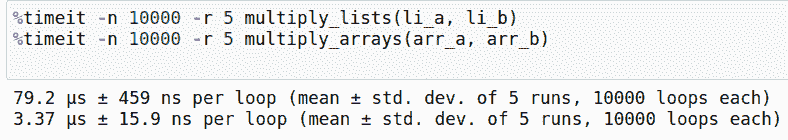

根据处理能力和后台运行的其他任务，机器上的时间可能会有所不同。但是，当使用 NumPy 的矢量化解决方案时，您会注意到相当大的加速，大约是 20-30 倍。

请注意，我在这里使用了`%timeit`魔法，因为我正在 Jupyter 细胞中进行实验。如果您使用普通的 python 代码，那么您将不得不使用`timeit.timeit`函数。`timeit.timeit`函数的输出仅仅是总时间除以迭代次数。

```py
import timeit
total_time = timeit.timeit("multiply_lists(li_a, li_b)", "from __main__ import multiply_lists, li_a, li_b", number = 10000)

time_per_run = total_time / 10000

print(time_per_run)
```

另外，从现在开始，当我提到短语*矢量化循环时，*我的意思是获取一个循环，并使用 NumPy 的矢量化函数之一实现相同的功能。

除了对在两个大小相等的数组上执行操作的循环进行矢量化之外，我们还可以对在数组和标量之间执行操作的循环进行矢量化。例如，循环:

```py
prod = 0
for x in li_a:
	prod += x * 5
```

可以矢量化为:

```py
np.array(li_a) * 5
prod = li_a.sum()
```

### 一个实例:图像间的 L2 距离

现在让我们举一个实际的例子。这是你在使用基于视觉的机器学习时经常会遇到的情况。假设你有两幅图像，你想计算它们之间的 L2 距离。这可以描述为

$$ L2(I_1，I _ 2)= \ sum _ { x } \ sum _ { y } \ sum _ { z }(I _ 1[x，y，z] - I_2[x,y,z])^2 $$

这仅仅意味着获得 RGB 图像中每个像素的平方差，然后将这些差相加。我们比较了基于循环和矢量化实现的运行时间。但是请注意，在之前的比较中，我们对循环版本使用了 Python 列表，对矢量化版本使用了 NumPy 数组。会不会是 NumPy 数组而不是矢量化造成了这种差异(也就是说，使用 NumPy 数组的 python 循环会不会同样快？)

为了验证这一点，在本例中，我们将对循环和矢量化版本都使用 NumPy 数组，以了解真正给我们带来速度优势的是什么。循环操作需要使用三重嵌套循环，这是事情变得非常慢的地方。(通常，循环嵌套越深，执行速度越慢)

```py
# Used to load images
import cv2 

# load the images
image1 = cv2.imread("image1.jpeg").astype(np.int32)
image2 = cv2.imread("image2.jpeg").astype(np.int32)

# Define the function that implements the loop version
def l2_loop(image1, image2):
    height, width, channels = image1.shape
    distance = 0

    for h in range(height):
        for w in range(width):
            for c in range(channels):
                distance += (image1[h][w][c] - image2[h][w][c])**2

# Define the vectorised version
def l2_vectorise(image1, image2):
    ((image1 - image2)**2).sum()
```

现在让我们测量我们的脚本运行 100 次以上所花费的时间，重复 3 次。运行基于循环的版本可能需要一段时间。

```py
%timeit -n 100 -r 3 l2_loop(image1, image2)
%timeit -n 100 -r 3 l2_vectorise(image1, image2)
```


我们看到矢量化版本比循环版本快大约 2500 倍。还不错！

## 广播

如果我们要对一个循环进行矢量化，处理大小不同的数组，会发生什么呢？

让我们从一个非常简单的例子开始。假设我有一个形状为`(3,4)`的矩阵，包含 3 行 4 列。现在，假设我想向网格中的每一列添加一个列向量。为了说明这一点，这是我正在努力实现的目标。

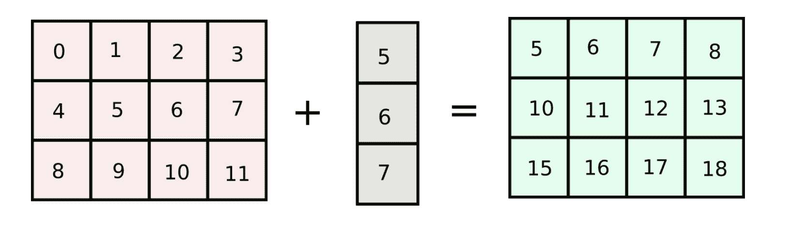

这可以通过几种方式来实现。我们可以循环矩阵的列，并添加每一列。

```py
arr = np.arange(12).reshape(3,4)

col_vector = np.array([5,6,7])

num_cols = arr.shape[1]

for col in range(num_cols):
	arr[:, col] += col_vector 
```

av

然而，如果我们的原始数组`arr`中的列数增加到一个非常大的数字，上面描述的代码将运行缓慢，因为我们在 Python 中循环遍历列数。做一个和原数组大小相等，列相同的矩阵怎么样？(我们将这种方法称为*列堆叠*方法)

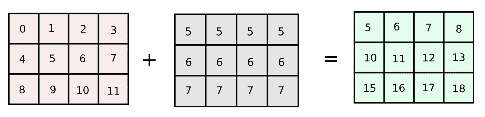

```py
arr = np.arange(12).reshape(3,4)
add_matrix = np.array([col_vector,] * num_cols).T

arr += add_matrix 
```

这给了我们一个更快的解决方案。虽然这种方法在 2 维数组的情况下工作得很好，但是对更高维的数组应用同样的方法可能有点棘手。

然而，好消息是 NumPy 为我们提供了一个名为 **Broadcasting** 的特性，它定义了如何在大小不等的数组上执行算术运算。根据[广播](https://numpy.org/doc/stable/user/basics.broadcasting.html)上的 SciPy docs 页面，

> 在某些约束条件下，较小的阵列在较大的阵列中“广播”,以便它们具有兼容的形状。广播提供了一种向量化数组操作的方法，因此循环在 C 而不是 Python 中发生

在幕后，NumPy 做了一些类似于我们的*列堆叠*方法的事情。然而，我们不必担心在多个方向上显式地堆叠数组。

现在让我们了解 NumPy 的广播规则。这些就是上面的定义所说的*某些约束*。两个阵列必须满足这些条件，较小的阵列才能通过较大的阵列进行*广播*。

### 广播规则

在我们开始之前，我们需要知道的一个重要定义是 NumPy 中数组的排名。*秩*是 NumPy 数组的总维数。例如，形状(3，4)的数组的*秩*为 2，形状(3，4，3)的数组的*秩*为 3。现在谈谈规则。

1.  为了判断哪两个数组适合于运算，NumPy 从数组的尾部开始逐维比较这两个数组的形状。(从右到左)
2.  如果两个维度都相等，或者其中一个为 1，则称这两个维度相容。
3.  如果两个维度不相等，并且都不是 1，那么 NumPy 将抛出一个错误并停止。

### 秩相等的数组

我们首先考虑我们正在处理的两个数组的秩相同的情况。下图演示了哪些数组是兼容的，哪些是不兼容的。

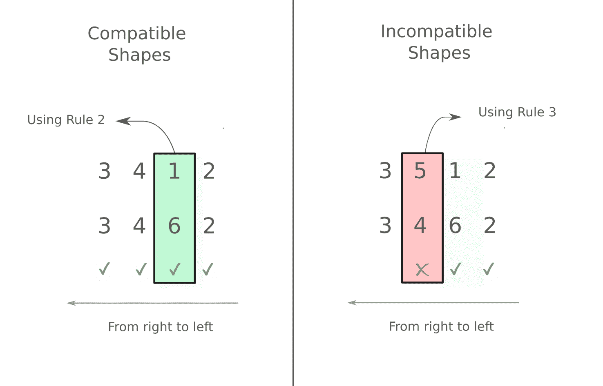

如你所见，我们从左到右工作。在右边的第二个例子中，我们从左边开始，但是当我们到达第二维度时(两个数组分别为 4 和 5。)，我们看到有一个区别，两者都不是 1。因此，试图对它们进行操作会导致错误

```py
arr_a = np.random.rand(3,4,6,2) # random array of shape (3,4,6,2)
arr_b = np.random.rand(3, 5, 1, 2)

arr_a + arr_b   # op throws an error 
```

在左边的第一个例子中，我们在第三维度遇到了不同的维度(两个数组分别为 1 和 6)。然而，根据规则 2，这些维度是相容的。其他维度都是一样的。所以我们可以用这两个数组进行算术运算。

```py
arr_a = np.random.rand(3,4,6,2) # random array of shape (3,4,6,2)
arr_b = np.random.rand(3, 4, 1, 2) 

arr_a + arr_b   # op goes through without throwing an error. 
```

### 不等秩数组

在满足某些条件的情况下，具有不相等秩的阵列也可以被操作**。同样，我们应用从左到右移动并比较两个数组的规则。让我们考虑下面的例子。**

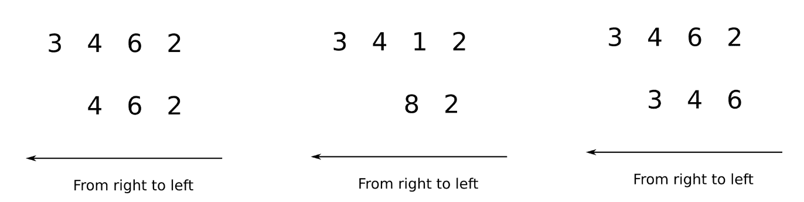

在上图中，我们看到在第一种情况下，第一个数组的秩为 4，而第二个数组的秩为 3。我们可以从左到右比较 3 维，之后第二个数组就没有维度了。为了比较两个这样的数组，Numpy *将尺寸为 1 的*前向维度附加到较小的数组，使得它的秩等于较大的数组。所以上面所有的比较都可以当作。

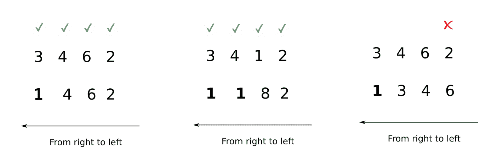

现在，可以很容易地进行比较。

请注意，我用斜体表示添加了的*，因为这只是一种可视化 NumPy 正在做什么的方式。在内部，没有附加。*

### 广播期间会发生什么

虽然很容易理解当两个维度相似时如何执行运算，但现在让我们理解当其中一个维度为 1 时如何执行运算(规则 2)。

为此，考虑我们上面的例子，我们想给矩阵的所有列添加一个列向量。数组的形状是`(3,4)`和`(3,)`，根据广播规则不能添加。然而，如果我们将形状`(3,)`的列向量整形为`(3, 1)`，这两个形状就变得兼容了。

```py
col_vector = col_vector.reshape((3, 1)) # reshape the array
arr += col_vector                      # addition goes through!
```

但是等等，到底发生了什么？第二次元，`arr`和`col_vector`的 4 和 1 分别是怎么调和的？

在这种情况下，NumPy 将执行操作**，就好像大小为`(3, 1)`的第二个数组**是形状为`(3,4)`的数组一样。大小为 1 的维度中的值(在这种情况下，原始数组的第二维是形状为`(3, **1**)`)现在将在 4 个维度中重复，以创建形状为(3，4)的数组。为了理解这一点，考虑第二个数组，以及它的第二维的值。

```py
print(col_vector[0, :])       # output -> [5]
print(col_vector[1, :])       # output -> [6]
print(col_vector[2, :])       # output -> [7] 
```

现在，形状为(3，4)的新创建的数组将在其第二维中具有重复的值。为了帮助我们的想象，我们使用函数`np.brodcast_to`,它让我们了解新的*广播的*数组是如何创建的。

```py
broadcasted_col_vector = np.broadcast_to(col_vector, (3,4))

print(broadcasted_col_vector[0,:])   # output -> [5, 5, 5, 5]
print(broadcasted_col_vector[1,:])   # output -> [6, 6, 6, 6]
print(broadcasted_col_vector[2,:])   # output -> [7, 7, 7, 7] 
```

如您所见，第二维度中的值(其原始大小为 1)已经重复了 4 次，从而创建了大小为 4 的维度。

为了形象地表示正在发生的事情，该数组在其第二维上重复 4 次，以创建一个相等的数组。

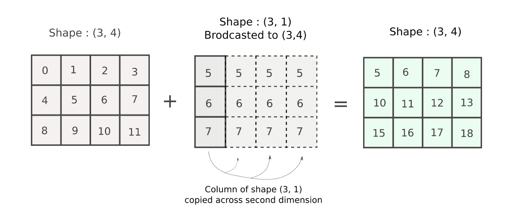

这正是我们在*列堆栈*操作中所做的！加法的结果就是我们想要的！

让我们考虑形状(3，4，5)和(1，4，5)的三维数组的情况

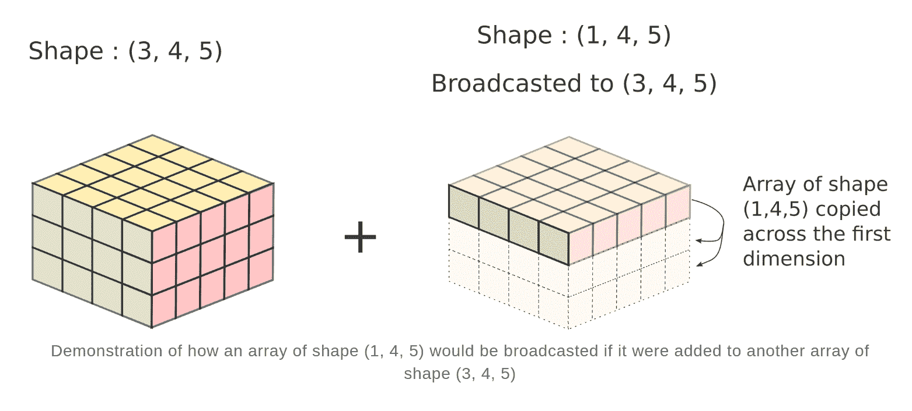

实际上，并没有创建新的数组。重复的数组仅仅是一种想象操作将如何执行的心理工具。相反，计算在多个维度上重复，而不创建新的数组。这类似于*将大小为 1 的第一数组的维度的值*跨越多个位置广播到大小大于 1 的第二数组的维度的值。因此，这个过程被称为广播。

### 一个实际的例子:给图像添加颜色

假设您有一个图像，对于每个像素，您希望将红色值增加 10，绿色值增加 5，蓝色值增加 15。

这可以通过广播很容易地实现。如果我们使用 OpenCV 读取图像，那么图像被表示为具有形状(H，W，C)的矩阵。我们来读一个图像吧！

```py
img = cv2.imread("image1.jpeg")
print(img.shape)

# output -> (768, 1024, 3)
```

现在，通道被编码在这个数组的第三维中。我们想给`img[ : , : ,0]`描述的第一通道、`img[ : , : ,1]`描述的第二通道、`img[ : , : ,2]`描述的第三通道分别加上 10、5、15。使用下面这段代码可以很容易地做到这一点。

```py
add_color = [10, 5, 15]
img += add_color
```

我们图像的形状是`(768, 1024, 3)`，而我们的颜色向量的形状是`(3,)`。此外，该数组的大小将调整为`(1, 1, 3)`，随后，每个颜色值将分别通过 R、G、B 通道广播。

然而，深度学习的一些应用要求图像以格式`[C, H, W`存储。在这种情况下，我们的图像将具有形状`(3, 768, 1024)`。为了做同样的操作，我们将不得不把我们的颜色向量重新塑造成形状(`3, 1, 1)`以便它是兼容的。然后，我们可以很容易地将两者相加。

```py
img = img.transpose((2, 0, 1))           # change shape to (3, 768, 1024)
add_color = add_color.reshape((3,1,1,))
img += add_color
```

## 将循环可视化为数组

当涉及到向量化和广播时，有一件事一直在帮助我，那就是将循环中发生的任何事情可视化为在数组上执行的操作

假设，我们有两个大小不等的数组。我们想对两个数组的每个元素组合取一个乘积，然后求和。例如，对于数组`[1, 2, 3]`和`[4, 5]`，总和为

$$ 1*4 + 2 * 4 + 3 * 4 + 1*5 + 2*5 + 3 * 5 $$

使用循环，这就是我们的做法，

```py
sum  = 0

arr1 = np.array([1, 2, 3])
arr2 = np.array([4, 5])

for i in arr1:
	for j in arr2:
    	sum += i*j
```

够简单了吧？但这是一个嵌套循环，如果这些数组的大小变得太大，那么运行时间也会增加。

我们如何摆脱这两个循环，并提出一个矢量化的解决方案。为此，请注意循环变量`i`和`j`在做什么。`i`从 1 到 3，而`j`从 4 到 5。在循环中，我们有`[i,j]`的每一种可能的组合，我们将它们相乘，然后求和。

我们能不能有一个二维数组，它的索引`[i,j]`代表每个这样的组合的乘积？如果是的话，我们可以用一个 NumPy 数组来表示这个数组，我们可以不用循环，只需对数组的元素求和！这就是数组的样子。

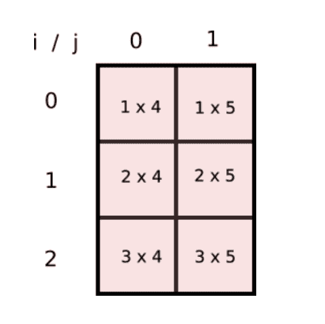

这不过是两个数组的乘积..

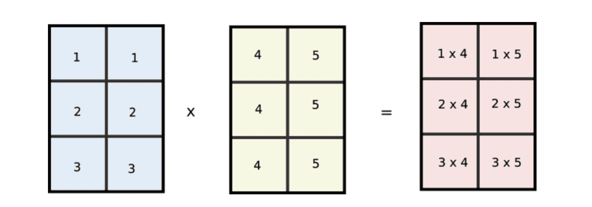

但是，请注意`i`的值是如何在第一个数组的列中重复的，而`j`的值是如何在第二个数组的行中重复的。这看起来眼熟吗？请注意，如果我们将原来的`arr1`和`arr2`数组分别整形为`[3,1]`和`[1,2]`，并将这两个数组相乘，那么它们将如下所示进行广播。

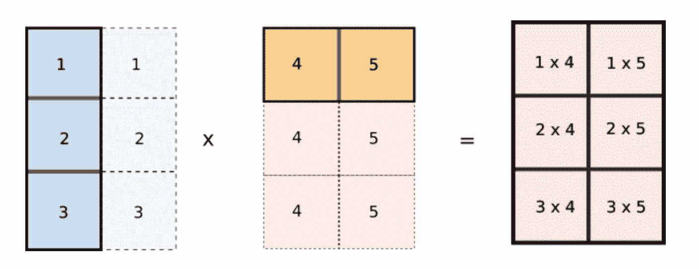

这正是我们想要的！我们现在可以用代码实现它。

```py
arr1 = arr1[:, None]    # reshape to (3, 1)
arr2 = arr2[None, :]    # reshape to (1, 2)

sum = (arr1 * arr2).sum()
```

## 结论

唷！那是一个详细的帖子！说实话，向量化和广播是在 NumPy 中编写高效代码的两个基石，这就是为什么我认为这些主题值得进行这么长时间的讨论。我鼓励你拿出玩具示例来更好地理解概念。

在下一部分中，我们将使用本文中介绍的内容，通过矢量化和广播来优化 K-Means 聚类算法(使用 Python 列表和循环实现)的简单实现，实现 70 倍的加速！

在那之前，编码快乐！