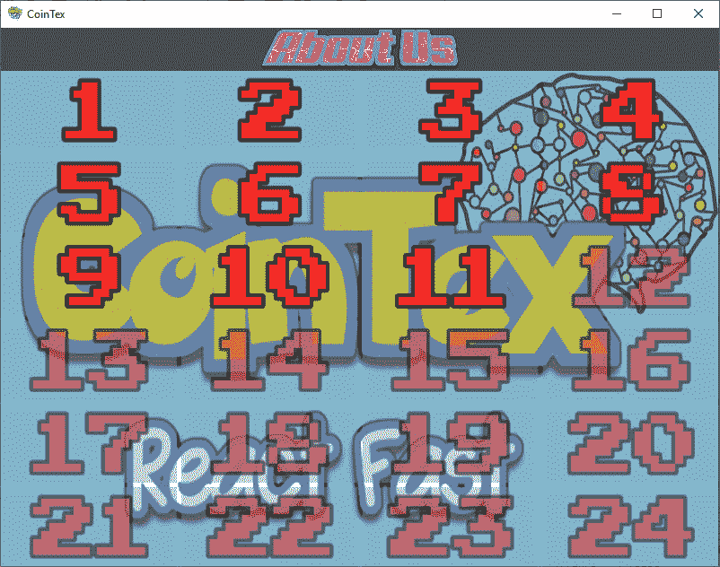
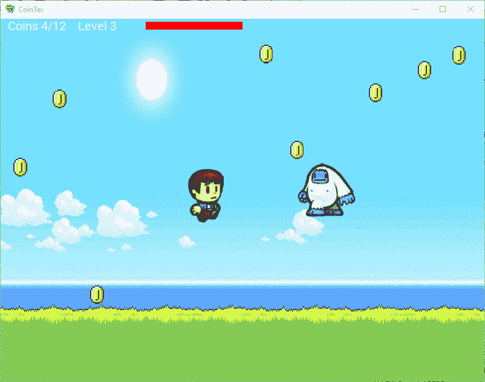
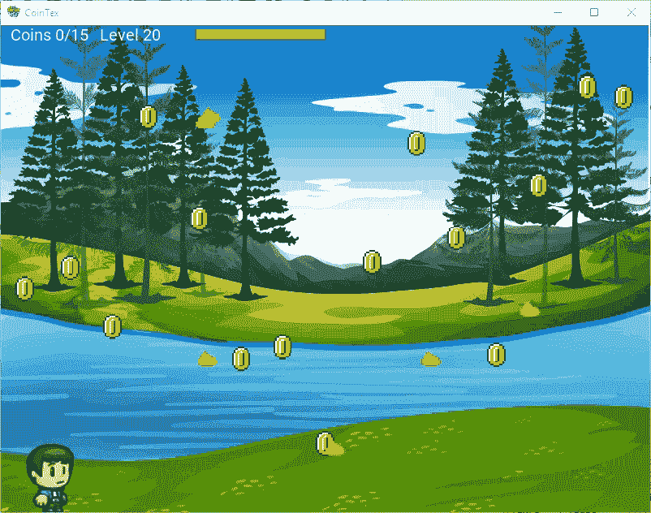
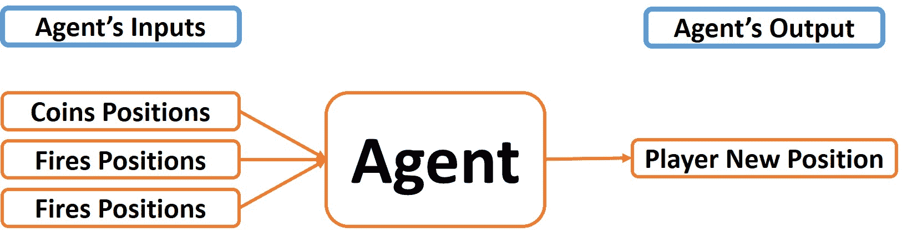
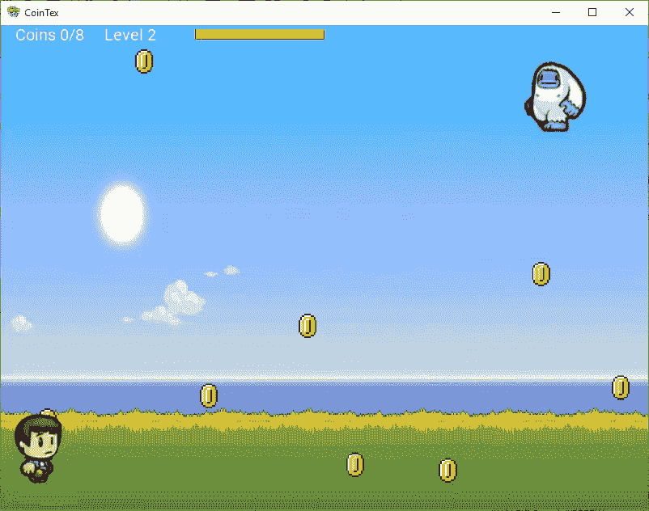
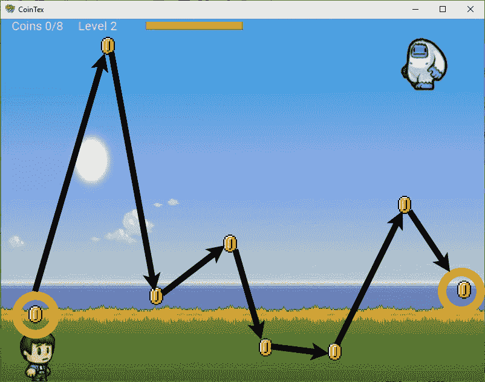
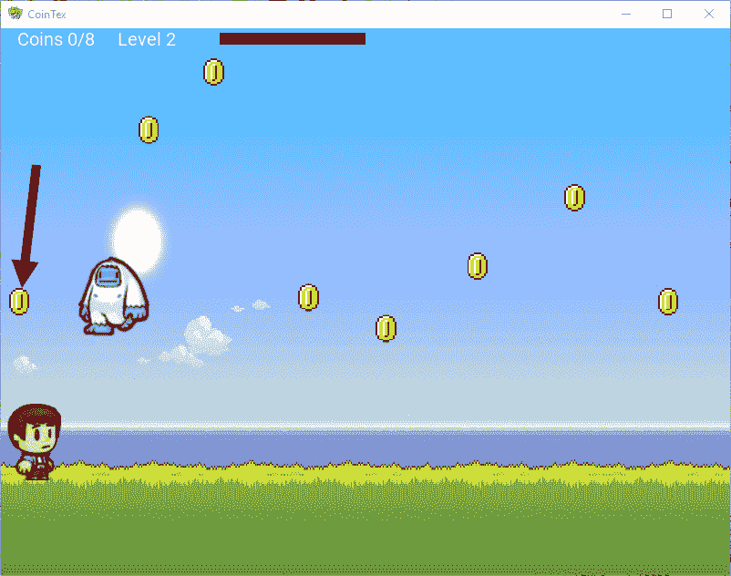

# 用遗传算法构建 CoinTex 游戏代理

> 原文：<https://blog.paperspace.com/building-agent-for-cointex-using-genetic-algorithm/>

游戏可以有复杂的环境，其中许多不同的因素有助于作出决定。人工智能的整个领域都致力于构建能够做出正确决策的游戏代理，就像专业人员一样玩游戏。

在本教程中，我们将看到如何仅使用遗传算法构建一个游戏代理来玩一个名为 [CoinTex](https://play.google.com/store/apps/details?id=coin.tex.cointexreactfast&hl=en) 的游戏，该游戏是在 Kivy Python 框架中开发的。CoinTex 的目标是收集随机分布的硬币，同时避免与火和怪物(随机移动)发生冲突。CoinTex 的源代码可以在 GitHub 上找到[。](https://github.com/ahmedfgad/CoinTex)

遗传算法是这里使用的唯一人工智能；没有其他机器/深度学习模型与之一起使用。我们将使用 [PyGad](https://blog.paperspace.com/genetic-algorithm-applications-using-pygad/) 实现遗传算法。本教程首先快速概述 CoinTex，然后简要解释遗传算法，以及如何使用它来创建播放代理。最后，我们将看到如何在 Python 中实现这些思想。

遗传算法代理的源代码可以从[这里](https://github.com/ahmedfgad/CoinTex/tree/master/PlayerGA)获得，你可以从[这里](https://github.com/ahmedfgad/CoinTex/tree/master/PlayerGA/TutorialProject)下载本教程中使用的代码。

本教程的大纲如下:

*   CoinTex 概述
*   游戏是如何运作的？
*   获取屏幕引用
*   获取硬币位置
*   获得怪物位置
*   获得射击位置
*   安装 [PyGAD](https://blog.paperspace.com/genetic-algorithm-applications-using-pygad/)
*   代理是如何工作的？
*   构建生成回调函数
*   使用 PyGAD 创建遗传算法的实例
*   进一步阅读

> 要直接跳到涉及遗传算法的部分，[点击这里](#genetic)。

## **CoinTex 概述**

CoinTex 是一款开源的跨平台 Python 3 游戏，使用 Kivy 框架创建。游戏的源代码可以在 [GitHub](https://github.com/ahmedfgad/CoinTex) 上获得——也可以随意下载和运行游戏。


CoinTex 是作为《使用 Kivy 和 Android Studio 用 Python 构建 Android 应用程序[一书的一部分开发的。CoinTex 在第 5 章和第 6 章中从头到尾都有记录，所以本教程不会涵盖关于开发游戏的所有内容；只是可能有助于使用遗传算法构建代理的细节。](https://www.amazon.com/Building-Android-Python-Using-Studio/dp/1484250303)

游戏中的单个 Python 脚本叫做`main.py`。这个游戏有一个名为`CointexApp`的类，它扩展了 Kivy 框架的`kivy.app.App`类。游戏的 GUI (widget tree)内置在一个名为`cointex.kv`的 KV 文件中。

要运行游戏，只需运行`main.py` Python 脚本。要从 Mac/Linux 终端运行游戏，请使用`python3`，而不是`python`，因为 CoinTex 是用 Python 3 开发的。

运行一个 Kivy 应用程序就是创建一个扩展基类`kivy.app.App`的类的新实例，并调用它的`run()`方法。下面是在`main.py`文件末尾运行游戏的代码行。变量`app`是`CointexApp`类的一个实例。

```py
app = CointexApp()
app.run()
```

运行游戏后，会出现如下所示的窗口。游戏目前有 24 个关卡。击败前一关后，一个关卡被激活。在下面的例子中，我只通过了 10 级，因此这 10 级加上下一级，11 级被激活。



一旦选择了一个级别，就会出现一个新的屏幕。接下来的窗口显示第三层的屏幕截图。玩家通过触摸屏幕来移动，这使得角色移动到被触摸的位置。

在屏幕的顶部有一个标签，除了显示关卡中的硬币总数外，还显示收集到的硬币数量。你可以看到我刚刚从总共 12 枚硬币中收集了 4 枚。在它旁边，你可以看到当前的等级数，以及红色条显示的玩家的健康状况。一旦不再有生命值，玩家就死了。

要通过关卡，必须收集所有的硬币。一旦通过一关，下一关就被激活。



怪物的移动是随机的，屏幕上硬币的分布也是随机的。这意味着每次游戏中硬币的位置会有所不同。玩家在收集硬币时面临两个障碍:怪物和火，它们以预定的路径被扔过屏幕。下图显示了第 20 层的一些火灾。



下一节给出了一些关于游戏动作回调函数的简单细节，从开始游戏到关卡完成或者玩家死亡。

## 这个游戏是如何运作的？

游戏运行后，第一个要调用的方法是`on_start()`。该方法基于传递的最后一个级别激活级别，之后激活级别的网格打开。

一旦用户选择了一个级别，在输入之前，回调方法`screen_on_pre_enter()`被调用。在这种方法中，硬币在屏幕上的位置是随机选择的。

进入一个级别后，调用方法`screen_on_enter()`。这个方法启动怪物和火的运动。负责启动怪物移动的方法叫做`start_monst_animation()`，负责开火的方法叫做`start_fire_animation()`。怪物/火运动一旦开始，它们就不会停止，除非角色死亡或者关卡完成。

一旦怪物/火焰移动，那么一个新的位置被分配给它的`pos_hint`属性。在名为`cointex.kv`的 KV 文件中，有一个分配给每个怪物/火焰的回调方法，当`pos_hint`属性发生变化时调用该方法。怪物的回调方法被命名为`monst_pos_hint()`。对于火，这种方法被命名为`fire_pos_hint()`。

在每个回调方法中，怪物和火的位置与玩家的位置进行比较。如果玩家离怪物/火太近，那么就会发生碰撞，玩家的生命值会降低。如果生命值变成 0，玩家就会死亡。玩家的任务是收集所有的硬币，同时保持其生命值在 0 以上。

`pos_hint`属性将一个字典作为一个值，该字典包含下面列出的两个条目。这两个项目的按键是`'x'`和`'y'`。它们的值指定小部件的 x 轴和 y 轴位置。它们的值在 0.0 之间。还有 1.0。

```py
pos_hint = {'x': 0.2, 'y': 0.4}
```

对于 x 轴，值为 0.0。表示在屏幕的最左侧，而 1.0 表示在屏幕的最右侧。对于 y 轴，为 0.0。表示屏幕底部，而 1.0 表示屏幕顶部。当小部件位于屏幕中央时，`pos_hint`属性的值就是`{'x': 0.5, 'y': 0.5}`。

类似于怪物/火焰，玩家也有一个`pos_hint`属性。更改时，调用名为`char_postion_hint()`的回调方法。这种方法通过比较玩家的位置和所有未收集的硬币来检查是否发生碰撞。一旦玩家碰撞到硬币，硬币就会被收集。

根据上面的讨论，玩家应该收集所有的硬币，同时避免与怪物和火碰撞。

考虑构建一个自己玩游戏的代理，代理应该完成两个任务:

1.  代理人应该将玩家的位置改变到更靠近硬币的位置来收集硬币。
2.  代理人要把玩家的位置换到远离怪物和火焰的地方，以免被杀死。

因此，有助于代理做出决策的输入是:

1.  硬币位置。
2.  怪物的位置[如果有的话]。
3.  火场位置[如果有的话]。

代理的输出是新玩家的位置。

请注意，有些级别可能有怪物，火，两者兼而有之，或者没有。

下图总结了代理的输入和输出。



在讨论如何获得硬币、怪物和火焰的位置之前，下一节讨论如何获得对关卡屏幕的引用。

## **获取屏幕参考**

每一关都有对应的 Kivy 画面。该屏幕包含所有关于关卡的信息。这包括关于玩家、硬币、怪物、火等等的信息。因此，要获得关于某个级别的一些信息，首先要做的是获得对该级别的引用。

通常，对级别的引用根据下一行返回，其中`app`是使用此行`app = CointexApp()`创建的`CointexApp`类的实例。`lvl_num`是指从 1 开始的级数。

```py
curr_screen = app.root.screens[lvl_num]
```

一旦屏幕引用可用，就可以访问任何类型的信息。

接下来的 3 个部分讨论了如何获得硬币、怪物和火焰的位置。

## **获取硬币位置**

在屏幕内，有一个名为`coins_ids`的字典，它保存着**未收集的**硬币的位置。被收集的硬币从字典中删除。

字典根据下一行从当前屏幕返回。

```py
coins = curr_screen.coins_ids
```

字典中的每一项都包含了硬币的位置。下一个代码返回字典中第一个硬币的位置。

```py
curr_coin = coins[list(coins.keys())[0]]
curr_coin_center = [curr_coin.pos_hint['x'], curr_coin.pos_hint['y']]
```

这是需要知道的硬币进行。下一节讨论如何获得怪物的位置。

## **获得怪物位置**

对于每个屏幕，都有一个名为`num_monsters`的属性来保存屏幕上怪物的数量。下一行打印该属性的值。

```py
print(curr_level.num_monsters)
```

怪物的部件被赋予一个这样的 ID，其中`monst_num`是屏幕中怪物的编号，`lvl_num`是等级编号。

```py
monster{monst_num}_image_lvl{lvl_num}
```

比如 5 屏/关卡第一个怪物的名字是 **monster1_image_lvl5** 。

下一行返回给定怪物编号和等级编号的怪物的引用。

```py
monster_image = curr_screen.ids['monster'+str(monst_num)+'_image_lvl'+str(lvl_num)]
```

下一段代码创建了一个名为`monsters_pos`的列表，它保存了屏幕中所有编号为`lvl_num`的怪物的位置。

```py
monsters_pos = []
for i in range(curr_screen.num_monsters):
    monster_image = curr_screen.ids['monster'+str(i+1)+'_image_lvl'+str(lvl_num)]
    monsters_pos.append([monster_image.pos_hint['x'], monster_image.pos_hint['y']])
```

通过获得怪物的位置，代理将能够建议一个远离它们的位置，以避免杀死玩家。

下一节讨论获取火灾的位置。

## **获取射击位置**

火的待遇和怪物差不多。唯一的变化是使用了**火**这个词，而不是**怪物**。下一个代码创建了一个名为`fires_pos`的列表，它保存了编号为`lvl_num`的屏幕中所有火的位置。

```py
fires_pos = []
for i in range(curr_screen.num_fires):
    fire_image = curr_screen.ids['fire'+str(i+1)+'_lvl'+str(lvl_num)]
    fires_pos.append([fire_image.pos_hint['x'], fire_image.pos_hint['y']])
```

基于硬币、怪物和火的位置，代理将能够选择玩家的新位置，该位置考虑收集硬币而不与怪物或火碰撞。

通过为代理准备所有需要的输入，接下来是讨论使用遗传算法为 CoinTex 构建一个游戏代理的想法。

建议先对遗传算法有个概念再看下一节。阅读教程[遗传算法优化简介](https://towardsdatascience.com/introduction-to-optimization-with-genetic-algorithm-2f5001d9964b)开始学习。

## 代理是如何工作的？

玩游戏的代理只使用遗传算法来构建。遗传算法本身被用来做出决定，告诉球员移动到哪里。没有使用机器/深度学习模型。

游戏代理的任务是收集所有的硬币，同时避免与怪物和火的碰撞。这一节讨论代理人如何决定玩家移动到的下一个位置，考虑硬币、怪物和火的位置。

让我们首先讨论代理如何使用硬币的位置来决定玩家的下一个位置。

如下面的 GIF 图片所示，屏幕上有不止一枚硬币。代理不会一次考虑所有硬币。相反，代理人只设置 1 个硬币作为目标。在收集到这个硬币后，一个新的硬币被设置为目标。这个过程一直持续到收集到所有的硬币。



通常，代理从左到右收集硬币，但这可能会根据怪物和火的位置而变化。

下图显示了收集硬币的顺序，其中第一个目标硬币用橙色圆圈突出显示，最后一个硬币用红色圆圈突出显示。

在收集当前的目标硬币后，代理设置一个新硬币作为目标。该过程通过收集当前的目标硬币并将新硬币设置为目标来继续，直到收集到所有硬币。



假设第一枚硬币的位置是`(x, y)=(0.1, 0.15)`，那么基于遗传算法的当前群体中可用的解决方案，代理选择将玩家放置在尽可能接近目标硬币的位置的解决方案。这是通过计算群体中每个解/位置和目标硬币位置之间的距离来实现的。

假设变量`solution`是保存来自群体的位置的列表，并且变量`curr_coin_center`是目标硬币的位置的列表，则距离计算如下:

```py
output = abs(solution[0] - curr_coin_center[0]) + abs(solution[1] - curr_coin_center[1])
```

假设人口中有 4 个解决方案，如下所列。

```py
Solution 1 : 0.2, 0.3
Solution 2 : 0.1, 0.9
Solution 3 : 0.7, 0.4
Solution 4 : 0.8, 0.7
```

如下计算，这 4 个解与目标硬币位置`(0.1, 0.15)`之间的距离分别为 0.25、0.95、0.85 和 1.25。基于这些距离，首选解决方案是第一个解决方案`(0.6, 0.3)`，因为它具有最小的距离(0.25)。因此，玩家的下一个位置将是`(0.6, 0.3)`。

```py
Solution 1 : abs(0.2 - 0.1) + abs(0.3 - 0.15) = 0.1 + 0.15 = 0.25
Solution 2 : abs(0.1 - 0.1) + abs(0.9 - 0.15) = 0.2 + 0.75 = 0.95
Solution 3 : abs(0.7 - 0.1) + abs(0.4 - 0.15) = 0.6 + 0.25 = 0.85
Solution 4 : abs(0.8 - 0.1) + abs(0.7 - 0.15) = 0.7 + 0.55 = 1.25
```

记住，遗传算法的适应度函数应该是最大化函数，以便具有更高适应度值的解决方案是优选的。由于这个原因，计算的距离是颠倒的。下一个代码显示了如何计算适应值(反向距离)。适应性值保存在变量`output`中。

```py
output = abs(solution[0] - curr_coin_center[0]) + abs(solution[1] - curr_coin_center[1])
output = 1.0 / output
```

下面列出了 4 种解决方案的适合度值。根据反向距离，群体的最佳解仍然是值为 4.0 的第一个解。这意味着玩家的新位置是`(0.6, 0.3)`。

```py
Solution 1 : 1 / 0.25 = 4.0
Solution 2 : 1 / 0.95 = 1.05
Solution 3 : 1 / 0.85 = 1.18
Solution 4 : 1 / 1.25 = 0.8
```

根据上面的讨论，很清楚硬币位置是如何用来决定玩家的下一个位置的。但是硬币的位置不是唯一的因素，还有怪物和火的位置。

代理的目标不仅是收集硬币，而且要避免与怪物和火的碰撞。下图中的箭头标记了代理要收集的目标硬币。如果代理人选择[从人群中]最接近硬币的解决方案，那么它可能会与怪物相撞，导致玩家的生命值下降，并可能杀死它。因此，代理人在决定玩家的下一个位置时应该考虑怪物的位置。



为了避免到达可能导致玩家健康减少的位置，接近至少一个怪物的解的健康值通过减少它们的值来惩罚。这就是怪物的位置如何帮助决定玩家的下一个位置。

假设`monsters_pos`是一个包含所有怪物位置的嵌套列表，下面是计算解决方案和怪物位置之间的距离并更新`output`变量中计算的适应值的代码。

如果解在怪物周围 0.3 宽 0.3 高的一个方框内，那么适应度值减少 300，将解标记为危险。否则，适应值增加 100，以将该解决方案标记为安全。用户可以自由选择其他值，并查看它们如何影响代理。

```py
for monst_pos in monsters_pos:
    char_monst_h_distance = abs(solution[0] - monst_pos[0])
    char_monst_v_distance = abs(solution[1] - monst_pos[1])
    if char_monst_h_distance <= 0.3 and char_monst_v_distance <= 0.3:
        output -= 300
    else:
        output += 100
```

火的待遇和怪物差不多。假设嵌套列表`fires_pos`保存所有火的位置，那么下一个代码基于火的位置更新适合度值。如果遗传算法建议的解在火堆周围 0.3 宽 0.3 高的一个方框内，那么适应度值减少 300。否则增加 100。

```py
for fire_pos in fires_pos:
    char_fire_h_distance = abs(solution[0] - fire_pos[0])
    char_fire_v_distance = abs(solution[1] - fire_pos[1])
    if char_fire_h_distance <= 0.3 and char_fire_v_distance <= 0.3:
        output -= 300
    else:
        output += 100
```

在讨论了代理如何使用硬币、怪物和火的位置来计算解决方案的适应值之后，下面是将本节中讨论的代码放在单个块中的代码。

```py
# solution: A potential position to the player suggested by the genetic algorithm.
# curr_coin_center: The position of the targeted coin.
# monsters_pos: A nested list of the monsters' positions.
# fires_pos: A nested list of the fires' positions.

output = abs(solution[0] - curr_coin_center[0]) + abs(solution[1] - curr_coin_center[1])
output = 1.0 / output

for monst_pos in monsters_pos:
    char_monst_h_distance = abs(solution[0] - monst_pos[0])
    char_monst_v_distance = abs(solution[1] - monst_pos[1])
    if char_monst_h_distance <= 0.3 and char_monst_v_distance <= 0.3:
        output -= 300
    else:
        output += 100

for fire_pos in fires_pos:
    char_fire_h_distance = abs(solution[0] - fire_pos[0])
    char_fire_v_distance = abs(solution[1] - fire_pos[1])
    if char_fire_h_distance <= 0.3 and char_fire_v_distance <= 0.3:
        output -= 300
    else:
        output += 100
```

现在，代理如何工作的一切都很清楚了。下一步是使用遗传算法构建代理。

在这个项目中，遗传算法是使用名为 [PyGAD](https://pygad.readthedocs.io) 的库构建的。下一节讨论安装 [PyGAD](https://pygad.readthedocs.io) 。

## **安装 PyGAD**

必须安装 PyGAD 才能继续这个项目。你可以从 PyPI 下载它的[轮子文件，或者使用`pip`安装程序，如下所示。](https://files.pythonhosted.org/packages/ac/5a/13560027da388e6596ff17f525cb4876a3b9fd333ac71fe2452b76a09bce/pygad-2.4.0-py3-none-any.whl)

```py
pip install pygad>=2.4.0
```

对于 Linux/Mac，使用`pip3`，因为 PyGAD 是用 Python 3 开发的。[查看文档](https://pygad.readthedocs.io)了解关于 PyGAD 中参数、类和子模块的更多信息。你也可以查看我的教程，使用 PyGAD 的 [5 个遗传算法应用，它更深入地介绍了这个库，并展示了如何在 5 个不同的用例中使用它。](https://blog.paperspace.com/genetic-algorithm-applications-using-pygad)

使用遗传算法解决的每个问题都有一个适应度函数。这是一个必须仔细设计的关键参数，因为它用于判断解决方案是好是坏。

## **建立适应度函数**

遗传算法中的适应度函数是接受由算法产生的解作为输入并返回适应度值作为输出的函数。适应值越高，解决方案越好。

在 PyGAD 中，fitness 函数是一个常规的 Python 函数，它接受两个参数作为输入:

1.  解决方法。
2.  总体解的指数。

该函数应该返回一个代表解的适合度值的数值。用户的工作是适当地构建适应度函数，以便它表示问题被很好地解决了。

以下是为 PyGAD 构建健身函数的模板:

```py
def fitness_function(solution, solution_idx):
    ...

    fitness = ...

    return fitness
```

如前所述，代理人根据硬币、怪物和火的当前位置决定玩家的下一个位置。适应度函数使用这些位置来计算适应度值。

下面列出了适应度函数的完整实现。请注意，其 90%的代码前面已经讨论过了。

第一行返回对当前级别屏幕的引用。变量`lvl_num`的值在`screen_on_enter()`回调方法中设置，这将在后面讨论。

返回保存所有未收硬币位置的字典`coins_ids`。如果至少有一枚未回收的硬币，则该函数会继续计算适合度值。目标硬币的字典项目被返回到`curr_coin`变量中，然后该变量用于计算进入`curr_coin_center`变量的硬币中心。

该函数的剩余代码根据目标硬币、怪物和火的位置计算适应值。在函数结束时，返回计算出的适应值。

```py
def fitness_func(solution, solution_idx):
    curr_screen = app.root.screens[lvl_num]

    coins = curr_screen.coins_ids
    if len(coins.items()) == 0:
        return 0

    curr_coin = coins[list(coins.keys())[0]]

    curr_coin_center = [curr_coin.pos_hint['x'], curr_coin.pos_hint['y']]

    output = abs(solution[0] - curr_coin_center[0]) + abs(solution[1] - curr_coin_center[1])
    output = 1.0 / output

    monsters_pos = []
    for i in range(curr_screen.num_monsters):
        monster_image = curr_screen.ids['monster'+str(i+1)+'_image_lvl'+str(lvl_num)]
        monsters_pos.append([monster_image.pos_hint['x'], monster_image.pos_hint['y']])

    for monst_pos in monsters_pos:
        char_monst_h_distance = abs(solution[0] - monst_pos[0])
        char_monst_v_distance = abs(solution[1] - monst_pos[1])
        if char_monst_h_distance <= 0.3 and char_monst_v_distance <= 0.3:
            output -= 300
        else:
            output += 100

    fires_pos = []
    for i in range(curr_screen.num_fires):
        fire_image = curr_screen.ids['fire'+str(i+1)+'_lvl'+str(lvl_num)]
        fires_pos.append([fire_image.pos_hint['x'], fire_image.pos_hint['y']])

    for fire_pos in fires_pos:
        char_fire_h_distance = abs(solution[0] - fire_pos[0])
        char_fire_v_distance = abs(solution[1] - fire_pos[1])
        if char_fire_h_distance <= 0.3 and char_fire_v_distance <= 0.3:
            output -= 300
        else:
            output += 100

    fitness = output
    return fitness
```

在 PyGAD 中，`pygad.GA`类的构造函数中有一个名为`fitness_func`的参数，它接受预先准备好的适应度函数。

在构建了适应度函数之后，在下一节中还要创建另一个函数。这个函数在每次生成完成后被调用。

## **构建生成回调函数**

本节讨论构建一个回调函数，在完成遗传算法的一代后调用。我们来讨论一下为什么需要这样的功能。

对于每一代，PyGAD 使用适应度函数来计算群体中所有解的适应度值。一代完成后，一定有办法在上一代进化的种群中找到最佳解。这个最佳方案是用来移动玩家的。

在 PyGAD 的`pygad.GA`类中，有一个名为`callback_generation`的参数，它接受在每一代之后调用的函数。该函数必须接受一个引用`pygad.GA`类实例的参数。

在这个项目中，这个函数将用于寻找遗传算法创建的最佳解决方案，并根据解决方案的位置移动玩家。下面列出了该函数的实现。

简单地说，如果还有一些硬币需要收集，并且适应值与上一代中的最佳值不同，该函数会将玩家移动到当前代中最佳解决方案的位置。

调用`pygad.GA`类中的`best_solution()`方法来获取当前代中最佳解决方案的信息。`best_solution()[0]`返回最佳解，`best_solution()[1]`返回最佳解的适应度值。

在函数外部，定义了一个名为`last_fitness`的全局变量。它被赋予上一代中的最佳解的适应度。

基于当前和前几代中最佳解决方案的适应值，在`fitness_change`变量中计算适应值的变化。如果`fitness_change`的值为 0，那么就没有必要移动玩家。

一旦没有更多的硬币要收集，或者当角色被杀死时，该方法返回字符串`stop`，这反过来停止遗传算法。

调用`CointexApp`类中定义的方法`start_char_animation()`将玩家移动到最佳解决方案的位置。它接受当前的屏幕号和位置。

```py
last_fitness = 0
def callback_generation(ga_instance):
    global last_fitness

    best_sol_fitness = ga_instance.best_solution()[1]
    fitness_change = best_sol_fitness - last_fitness
    curr_screen = app.root.screens[lvl_num]

    last_fitness = best_sol_fitness

    coins = curr_screen.coins_ids

    if len(coins.items()) == 0 or curr_screen.character_killed:
        # After either the level is completed or the character is killed, then stop the GA by returning the string "stop".
        return "stop"
    elif len(coins.items()) != 0 and fitness_change != 0:
        best_sol = ga_instance.best_solution()[0]
        app.start_char_animation(lvl_num, [float(best_sol[0]),  float(best_sol[1])])
```

一旦适应度和回调函数准备好了，就该使用 PyGAD 创建一个遗传算法的实例并运行它了。这将在下一节讨论。

## **使用 PyGAD 创建遗传算法的实例**

PyGAD 有一个名为`GA`的类，用于创建遗传算法的实例。在 PyGAD 2.4.0 中，`pygad.GA`类的构造函数接受 20 个参数。在这些参数中，下一段代码使用这个项目所需的参数来创建一个实例。

请注意，`fitness_func`参数被赋予之前创建的适应度函数。同样，`callback_generation`参数接受生成回调函数。

`num_genes`参数被赋予值 2，因为每个解只有 2 个值(玩家的 x 和 y 位置)。

`random_mutation_min_val`和`random_mutation_max_val`参数被赋予值 0.0 和 1.0，因为 x 和 y 位置被限制在该范围内。将`mutation_by_replacement`参数设置为`True`以保持 x 和 y 位置在 0.0 到 1.0 的范围内是很重要的。

`delay_after_gen`参数用于指定玩家每两次后续移动之间的延迟秒数。如果玩家在时间 0.0 移动并且`delay_after_gen`参数设置为 0.3 秒，那么玩家的下一个位置将在 0.3 秒后指定。

请注意，这 0.3 秒并没有浪费，而是用来启动动画，将玩家移动到选定的位置。为了获得最佳体验，分配给`delay_after_gen`参数的时间应该等于动画角色所经过的时间。动画时间在`char_anim_duration`属性中的每个级别都可用。

有关`pygad.GA`类构造函数中参数的详细信息，请查阅 [PyGAD 文档](https://pygad.readthedocs.io/en/latest/README_pygad_ReadTheDocs.html#init)。

```py
import pygad

ga_instance = pygad.GA(num_generations=9999,
                       num_parents_mating=300, 
                       fitness_func=fitness_func,
                       sol_per_pop=1000, 
                       num_genes=2,
                       init_range_low=0.0,
                       init_range_high=1.0,
                       random_mutation_min_val=0.0,
                       random_mutation_max_val=1.0,
                       mutation_by_replacement=True,
                       callback_generation=callback_generation,
                       delay_after_gen=app.root.screens[lvl_num].char_anim_duration) 
```

运行创建的`pgad.GA`类的实例，然后调用`run()`方法。

```py
ga_instance.run()
```

在应用程序的主线程中运行遗传算法以避免处理它并不是一个好主意。相反，在新线程中运行该算法。下一段代码创建一个名为`CollectCoinThread`的新线程，它创建并运行`pygad.GA`类的实例。

这个调用的构造函数接受一个名为`screen`的参数，该参数指向当前屏幕/级别。

```py
import threading

class CollectCoinThread(threading.Thread):

    def __init__(self, screen):
        super().__init__()
        self.screen = screen

    def run(self):
        ga_instance = pygad.GA(num_generations=9999,
                               num_parents_mating=300, 
                               fitness_func=fitness_func,
                               sol_per_pop=1000, 
                               num_genes=2,
                               init_range_low=0.0,
                               init_range_high=1.0,
                               random_mutation_min_val=0.0,
                               random_mutation_max_val=1.0,
                               mutation_by_replacement=True,
                               callback_generation=callback_generation,
                               delay_after_gen=self.screen.char_anim_duration)
        ga_instance.run()
```

下一节将讨论当关卡/屏幕启动时，如何启动遗传算法。

## **启动遗传算法**

要回答的一个重要问题是从哪里开始`CollectCoinThread`线程？答案在`CointexApp`类的`screen_on_enter()`回调方法中。当一个屏幕(即关卡)打开时，调用`screen_on_enter()`方法。

在这个方法的末尾，只需放置下一个代码。它创建一个名为`lvl_num`的全局变量来保存当前级别/屏幕的编号。然后，创建了一个新的`CollectCoinThread`线程实例。最后，线程通过调用`start()`方法启动。

```py
global lvl_num

lvl_num = screen_num

collectCoinThread = CollectCoinThread(screen=curr_screen)
collectCoinThread.start()
```

此时，项目已经完成。下一节将提到 GitHub 项目，该项目包含 CoinTex 和代理的代码。

## **GitHub 上的项目**

CoinTex 的源代码可以在 [ahmedfgad/CoinTex](https://github.com/ahmedfgad/CoinTex) GitHub 项目中获得。

遗传算法代理的源代码可以在[Ahmed gad/CoinTex/player ga](https://github.com/ahmedfgad/CoinTex/tree/master/PlayerGA)目录下获得。此目录可能会在发布教程后更新。教程中讨论的确切代码可以在[ahmedfgad/CoinTex/player ga/tutorial project](https://github.com/ahmedfgad/CoinTex/tree/master/PlayerGA/TutorialProject)目录下找到。

## **延伸阅读**

*   文章:[遗传算法优化简介](https://towardsdatascience.com/introduction-to-optimization-with-genetic-algorithm-2f5001d9964b)
*   教程: [5 使用 PyGAD 的遗传算法应用](https://blog.paperspace.com/genetic-algorithm-applications-using-pygad)
*   教程:[遗传算法在 Python 中的实现](https://towardsdatascience.com/genetic-algorithm-implementation-in-python-5ab67bb124a6)
*   书:[使用深度学习的实用计算机视觉应用与 CNN](https://www.amazon.com/Practical-Computer-Vision-Applications-Learning/dp/1484241665)
*   教程: [Python for Android:开始构建 Kivy 跨平台应用](https://www.linkedin.com/pulse/python-android-start-building-kivy-cross-platform-applications-gad)
*   Book: [在 Android Studio 中使用 Kivy 用 Python 构建 Android 应用程序](https://www.amazon.com/Building-Android-Python-Using-Studio/dp/1484250303)

## **结论**

该教程讨论了如何使用遗传算法为一个名为 [CoinTex](https://github.com/ahmedfgad/CoinTex) 的游戏创建一个游戏代理。这款游戏是开源的，跨平台的，使用 Kivy 用 Python 开发，[可用于 Android](https://play.google.com/store/apps/details?id=coin.tex.cointexreactfast&hl=en) 。

[PyGAD](https://pygad.readthedocs.io/) ，一个开源的 Python 库，用于实现遗传算法。

我们看到，我们的代理可以有效地工作，即使在困难的水平，有许多硬币，怪物，和火。