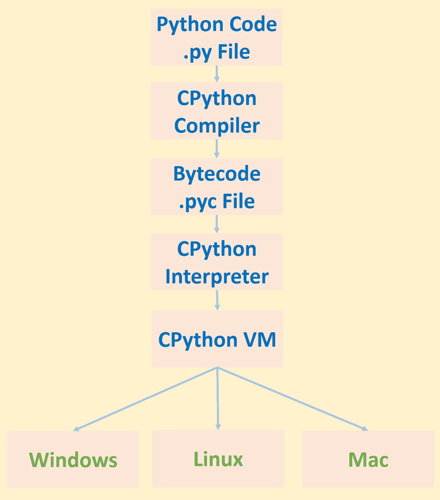
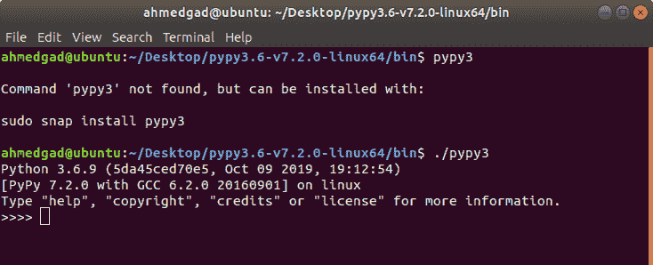
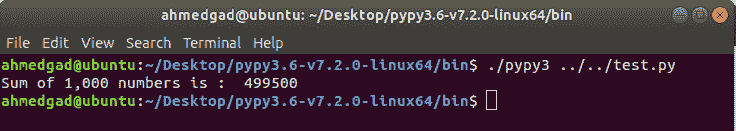

# PyPy 入门

> 原文：<https://blog.paperspace.com/getting-started-with-pypy/>

Python 编程语言是一种可以用多种方式实现的接口。一些例子包括使用 C 语言的 CPython，使用 Java 实现的 Jython 等等。

尽管是最流行的，CPython 并不是最快的。PyPy 是另一种 Python 实现，既兼容又快速。PyPy 依赖于实时(JIT)编译，这大大减少了长时间运行操作的执行时间。

在本教程中，将为初学者介绍 PyPy，以突出它与 CPython 的不同之处。我们还将讨论它的优点和局限性。然后我们将看看如何下载并使用 PyPy 来执行一个简单的 Python 脚本。PyPy 支持数百个 Python 库，包括 [NumPy](https://blog.paperspace.com/numpy-optimization-vectorization-and-broadcasting/) 。

具体来说，本教程涵盖以下内容:

*   python 的快速概述
*   PyPy 及其特性介绍
*   PyPy 限制
*   在 Ubuntu 上运行 PyPy
*   PyPy 与 CPython 的执行时间

让我们开始吧。

## **CPython 的快速概述**

在讨论 PyPy 之前，了解 CPython 的工作原理是很重要的。我之前的名为[用 Cython](https://blog.paperspace.com/boosting-python-scripts-cython) 提升 Python 脚本的教程详细介绍了 CPython 的工作原理，但是在这里快速回顾一下要点也无妨。下面你可以看到一个使用 CPython 实现的 Python 脚本的执行管道的可视化。



给定一个 Python `.py`脚本，首先使用 CPython 编译器将源代码编译成字节码。字节码被生成并保存在扩展名为`.pyc`的文件中。然后在虚拟环境中使用 CPython 解释器执行字节码。

使用编译器将源代码转换成字节码有很多好处。如果不使用编译器，那么解释器将通过逐行翻译成机器码来直接处理源代码。这样做的缺点是必须应用一些过程来将源代码的每一行翻译成机器代码，并且这些过程将对每一行重复。例如，语法分析将独立于其他行应用于每一行，因此解释器需要花费大量时间来翻译代码。编译器解决了这个问题，因为它能够一次处理所有代码，因此语法分析将只应用一次，而不是应用于每一行代码。因此，编译器生成的字节码很容易解释。注意，编译整个源代码在某些情况下可能没有帮助，我们将在讨论 PyPy 时看到一个明显的例子。

字节码生成后，由运行在虚拟机上的解释器执行。虚拟环境是有益的，因为它将 CPython 字节码与机器隔离开来，从而使 Python 跨平台。

不幸的是，仅仅使用编译器来生成字节码不足以加速 CPython 的执行。解释器的工作原理是每次执行代码时，将代码翻译成机器代码。因此，如果一个行`L`需要`X`秒来执行，那么执行它 10 次将会有`X*10`秒的开销。对于长时间运行的操作，这在执行时间上代价太高。

基于 CPython 的弊端，我们现在来看看 PyPy。

## **PyPy 及其特性介绍**

PyPy 是一个类似于 CPython 的 Python 实现，既兼容又快速。“兼容”意味着 PyPy 与 CPython 兼容，因为您可以在 PyPy 中使用几乎所有的 CPython 语法。有一些兼容性的差异，这里提到的[就是](https://pypy.org/compat.html)。PyPy 最强大的优势就是速度。PyPy 比 CPython 快很多；稍后我们将看到 PyPy 执行速度快 7 倍的测试。在某些情况下，它甚至可能比 CPython 快几十倍或几百倍。那么 PyPy 是如何实现它的速度的呢？

### **速度**

PyPy 使用实时(JIT)编译器，能够显著提高 Python 脚本的速度。CPython 中使用的编译类型是超前的(AOT)，这意味着所有的代码在执行之前都会被转换成字节码。JIT 只是在运行时翻译代码，只是在需要的时候。

源代码可能包含根本不执行的代码块，但这些代码块仍在使用 AOT 编译器进行翻译。这导致处理时间变慢。当源代码很大并且包含数千行时，使用 JIT 会有很大的不同。对 AOT 来说，整个源代码都需要翻译，因此需要很多时间。对于 JIT，只执行代码中需要的部分，这样速度会快很多。

PyPy 翻译了一部分代码后，就会被缓存。这意味着代码只被翻译一次，以后再使用这个翻译。每次执行代码时，CPython 解释器都要重复翻译，这也是它运行缓慢的另一个原因。

### **毫不费力**

PyPy 不是提升 Python 脚本性能的唯一方法，但却是最简单的方法。例如，Cython 可以用来提高向变量分配 C 类型的速度。问题是 Cython 要求开发人员手动检查源代码并进行优化。这很烦人，而且随着代码大小的增加，复杂性也在增加。当使用 PyPy 时，您只需更快地运行常规 Python 代码，无需任何努力。

### **无堆叠**

标准 Python 使用 C 栈。这个堆栈存储相互调用的函数序列(递归)。因为堆栈的大小是有限的，所以函数调用的次数也是有限的。

PyPy 使用了[无栈 Python](https://wiki.python.org/moin/StacklessPython) ，这是一个**不使用 C 栈**的 Python 实现。相反，它将函数调用存储在对象旁边的堆中。堆的大小大于栈的大小，因此你可以做更多的函数调用。

无栈 Python 也支持微线程，比普通的 Python 线程要好。在单个无堆栈 Python 线程中，您可以运行数千个任务，称为“小任务”，所有这些任务都在同一个线程上运行。

使用微线程允许运行并发任务。并发意味着两个任务通过共享相同的资源同时工作。一个任务运行一段时间，然后停下来为第二个任务腾出空间。请注意，这与并行不同，并行涉及同时单独运行两个任务。

使用微线程减少了创建的线程数量，从而减少了操作系统管理所有这些线程的开销。因此，通过在两个线程之间交换来加速执行比在两个微线程之间交换更耗时。

使用无堆栈 Python 也为实现延续打开了大门。延续允许我们保存任务的状态，并在以后恢复它以继续它的工作。注意，无栈 Python 与标准 Python 没有什么不同；它只是增加了更多的功能。标准 Python 中可用的一切也将在无堆栈 Python 中可用。

在讨论了 PyPy 的好处之后，我们在下一节讨论它的局限性。

## **PyPy 限制**

虽然您可以在任何机器和任何 CPU 架构上使用 CPython，但是 PyPy 的支持相对有限。

下面是 PyPy ( [来源](https://pypy.org/features.html))支持和维护的 CPU 架构:

*   x86 (IA-32)和 x86_64
*   ARM 平台(ARMv6 或 ARMv7，带 VFPv3)
*   aarh64 足球俱乐部
*   PowerPC 64 位，小端和大端
*   系统 Z (s390x)

PyPy 不能在所有的 Linux 发行版上工作，所以你必须小心使用一个受支持的版本。在不受支持的发行版上运行 PyPy Linux 二进制文件将会返回错误。PyPy 只支持 Python 2 和 Python 3 的一个版本，分别是 PyPy 2.7 和 PyPy 3.6。

如果在 PyPy 中执行的代码是纯 Python，那么 PyPy 提供的速度通常是显而易见的。但是如果代码包含 C 扩展，比如 NumPy，那么 PyPy 实际上可能会增加时间。PyPy 项目正在积极开发中，因此将来可能会为 C 扩展提供更好的支持。

许多流行的 Python 框架都不支持 PyPy，比如 Kivy。Kivy 允许 CPython 在所有平台上运行，包括 Android 和 iOS。这意味着 PyPy 不能在移动设备上运行。

现在我们已经看到了 PyPy 的优点和局限性，让我们来看看如何在 Ubuntu 上运行 PyPy。

## **在 Ubuntu 上运行 PyPy**

您可以在 Mac、Linux 或 Windows 上运行 PyPy，但是我们将讨论在 Ubuntu 上运行它。再次提及 PyPy Linux 二进制文件仅在特定的 Linux 发行版上受支持是非常重要的。您可以在[这个页面](https://pypy.org/download.html)上查看可用的 PyPy 二进制文件及其支持的发行版。例如，PyPy(Python 2.7 或 Python 3.6)仅支持 Ubuntu 的三个版本:18.04、16.04 和 14.04。如果你有最新版本的 Ubuntu(19.10)，那么你不能在上面运行 PyPy。尝试在不受支持的发行版上运行 PyPy 将返回以下错误:

`pypy: error while loading shared libraries ...`

我只是简单的用一个虚拟机运行 Ubuntu 18.04。

PyPy 二进制文件以压缩文件的形式出现。你需要做的就是解压你下载的文件。在解压缩的目录中有一个名为`bin`的文件夹，在其中可以找到 PyPy 可执行文件。我使用的是 Python 3.6，因此这个文件被命名为`pypy3`。对于 Python 2.7，它只是被称为`pypy`。

对于 CPython，如果想从终端运行 Python 3，只需输入命令`python3`。要运行 PyPy，只需发出命令`pypy3`。

在终端中输入`pypy3`命令可能会返回`Command 'pypy3' not found`消息，如下图所示。原因是 PyPy 的路径没有添加到 path 环境变量中。实际运行的命令是`./pypy3`，考虑到终端的当前路径在 PyPy 的`bin`目录中。点`.`表示当前目录，添加`/`是为了访问当前目录中的内容。发出`./pypy3`命令成功运行 Python，如下所示。



现在，您可以像往常一样使用 Python，充分利用 PyPy 的优势。例如，我们可以创建一个简单的 Python 脚本，对 1，000 个数字求和，并使用 PyPy 执行它。代码如下。

```py
nums = range(1000)
sum = 0
for k in nums:
    sum = sum + k
print("Sum of 1,000 numbers is : ", sum)
```

如果这个脚本被命名为`test.py`，那么您可以简单地使用下面的命令运行它(假设 Python 文件位于 PyPy 的`bin`文件夹中，这与`pypy3`命令的位置相同)。

```py
./pypy3 test.py
```

下图显示了执行前面代码的结果。



## **PyPy 与 CPython 的执行时间**

为了比较 PyPy 和 CPython 对 1，000 个数字求和的运行时间，代码被更改为测量时间，如下所示。

```py
import time

t1 = time.time()
nums = range(1000)
sum = 0
for k in nums:
    sum = sum + k
print("Sum of 1,000 numbers is : ", sum)
t2 = time.time()
t = t2 - t1
print("Elapsed time is : ", t, " seconds")
```

与 CPython 的`0.0002`秒相比，PyPy 的时间接近`0.00045`秒(我在我的 Core i7-6500U 机器上运行代码@ 2.5GHz)。在这种情况下，与 PyPy 相比，CPython 花费的时间更少，这是意料之中的，因为这个任务实际上不是一个长时间运行的任务。如果代码改为添加 100 万个数字，而不是 1000 个，那么 PyPy 将最终获胜。在这种情况下，Pypy 需要`0.00035`秒，CPython 需要`0.1`秒。PyPy 的好处现在很明显。这应该让您了解 CPython 在执行长时间运行的任务时要慢多少。

## **结论**

本教程介绍了 PyPy，这是最快的 Python 实现。PyPy 的主要优点是它的实时(JIT)编译，它提供了对编译后的机器码的缓存以避免再次执行。PyPy 的局限性也得到了强调，主要的一点是它对于纯 Python 代码来说工作得很好，但是对于 C 扩展来说效率不高。

我们还看到了如何在 Ubuntu 上运行 PyPy，并比较了 CPython 和 PyPy 的运行时间，突出了 PyPy 对于长时间运行任务的效率。与此同时，对于短期运行的任务，CPython 仍可能击败 PyPy。在以后的文章中，我们将探索 PyPy、CPython 和 Cython 之间的更多比较。