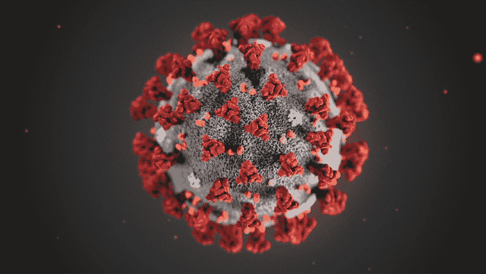
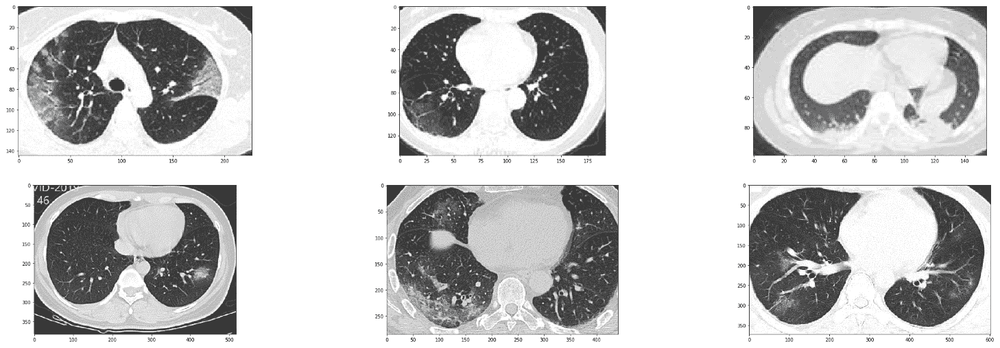
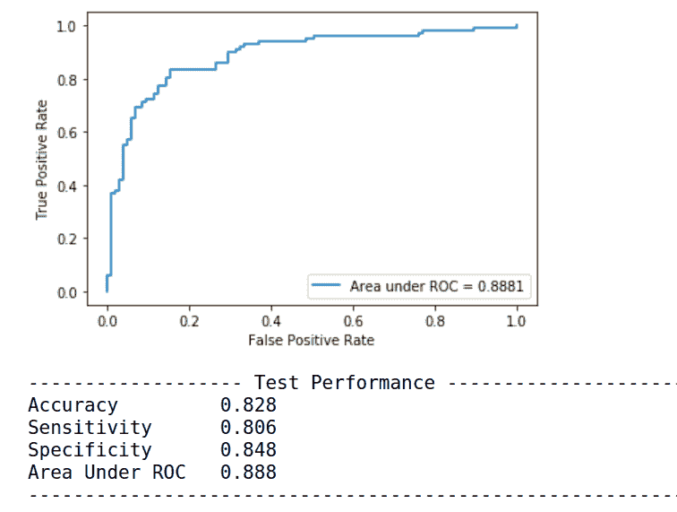
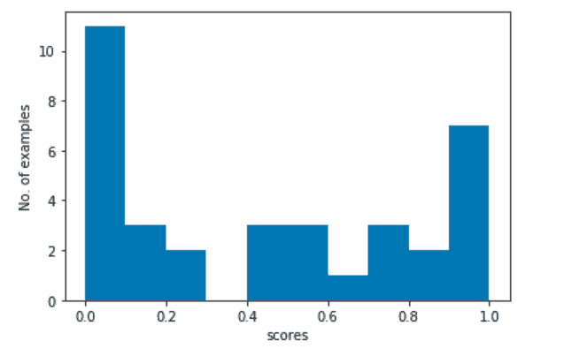
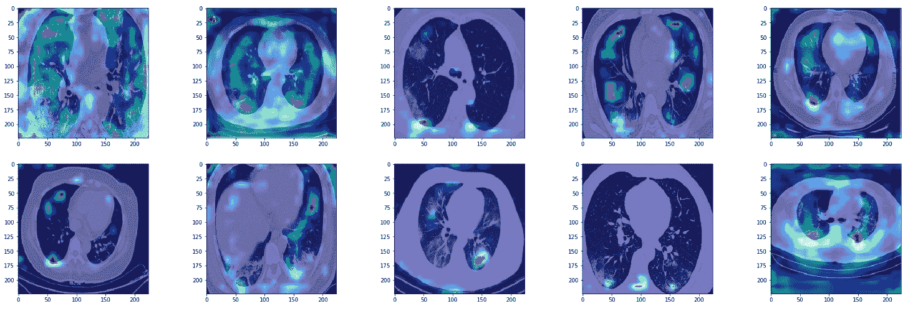
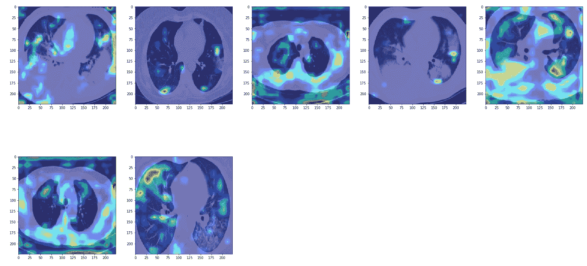
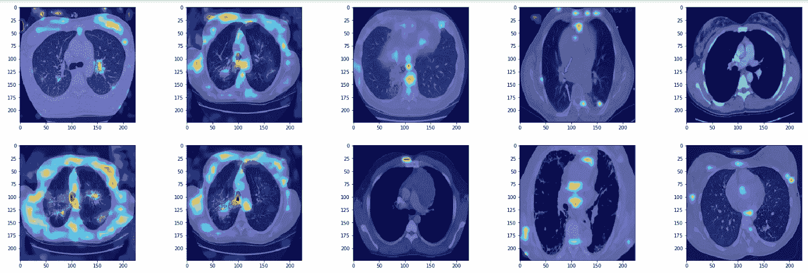
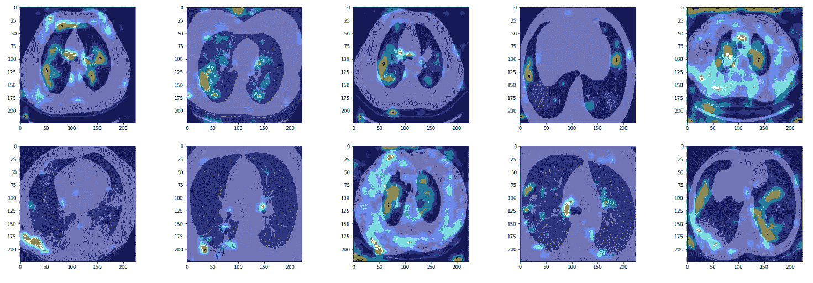
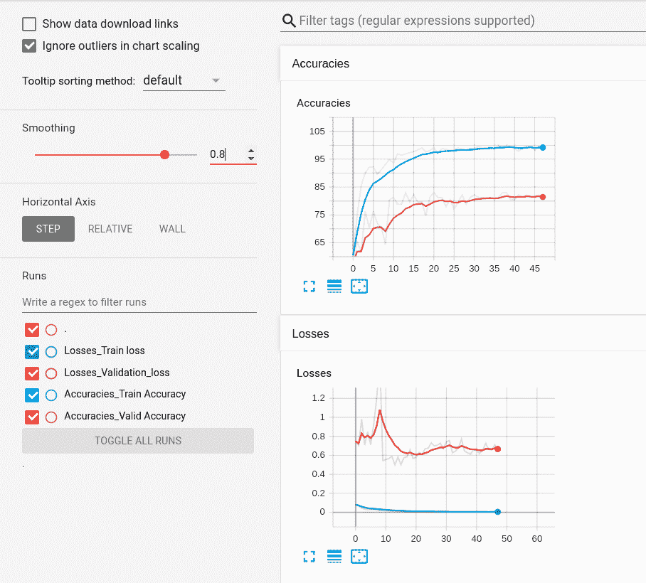

# 用人工智能对抗冠状病毒，第 2 部分:使用 PyTorch 构建 CT 扫描新冠肺炎分类器

> 原文：<https://blog.paperspace.com/fighting-coronavirus-with-ai-building-covid-19-classifier/>

您可以跟随本教程的代码，并在 ML Showcase 的免费 GPU 上运行它。

新冠肺炎继续对世界各地的医疗系统和经济造成严重破坏。超过 50 万人死亡，1140 万人患病，超过 10 亿人失业，新冠肺炎疫情可以说是 21 世纪最大的危机。我们还见证了世界以前所未有的规模联合起来抗击疫情——无论是加快疫苗试验、大规模生产口罩和呼吸机，还是在封锁期维持国家运转的巨大经济刺激。

话虽如此，我确信机器学习社区可以发挥作用。其实这就是这个系列的全部。在最后一部分的[中，我概述了深度学习是如何被用来开发更好的新冠肺炎测试方法的。我所涉及的所有文献都使用了从医院获得的医学数据，而这些数据在公共领域是不可获得的，这使得很难进行任何形式的指导。然而，这种情况已经改变。](https://blog.paperspace.com/fighting-corona-virus-with-ai-medical-imaging-testing/)

[Improving Coronavirus Testing with Deep Learning | Paperspace BlogThis post will cover how testing is done for the coronavirus, why it’s important in battling the pandemic, and how deep learning tools for medical imaging can help us improve the quality of COVID-19 testing.Paperspace BlogAyoosh Kathuria](https://blog.paperspace.com/fighting-corona-virus-with-ai-medical-imaging-testing/)[A Review of Active COVID-19 Research and Datasets | Paperspace BlogThe economy has come to a halt; people are quarantined; work is stagnating; andgovernments fear the public health crisis this could turn into. The deadlycoronavirus (SARS-CoV-2, or COVID-19 for “coronavirus disease 2019”) isspreading fast. It’s 2020 but even with the most advanced technology avai…Paperspace BlogVihar Kurama](https://blog.paperspace.com/fighting-covid-19-using-artificial-intelligence-and-data/)

最近，加州大学圣地亚哥分校开源了一个数据集，其中包含新冠肺炎患者的肺部 CT 扫描图像，这是公共领域的第一次。在这篇文章中，我们将使用 PyTorch 构建一个分类器，该分类器获取患者的肺部 CT 扫描，并将其分类为新冠肺炎阳性或阴性。

所以，让我们开始吧！

## 首先要做的是...

我们首先导入代码所需的模块，设置 GPU，并设置 TensorBoard 目录来记录我们的培训指标。

```py
import torch
import torch.nn as nn
from torch.utils.data import Dataset, DataLoader
from torchvision import transforms as transforms
from skimage.util import montage
import os
import cv2 
import random
import matplotlib.pyplot as plt 
import torch.optim as optim
from PIL import Image
from sklearn.metrics import classification_report, roc_auc_score, roc_curve, confusion_matrix
from torch.utils.tensorboard import SummaryWriter
import glob
import shutil
import numpy as np
from torchvision.models import vgg19_bn
import numpy as np
import seaborn as sns

random.seed(0)

log_dir = "~/logs"
writer = SummaryWriter(log_dir)
device = "cuda:0" if torch.cuda.is_available() else "cpu"
```

## 创建数据集

我们将在 GitHub 上使用由加州大学圣地亚哥分校[提供的新冠肺炎 CT 扫描。该数据集包含取自各种放射学/医学杂志的图像，如 medRxiv、bioRxiv、NEJM、JAMA、Lancet。](https://github.com/UCSD-AI4H/COVID-CT)

我们首先通过克隆 GitHub repo 来获取数据。从命令行运行:

```py
git clone https://github.com/UCSD-AI4H/COVID-CT
```

下载完数据后，将光盘放入`COVID-CT`文件夹，提取包含图像的 zip 文件。

```py
cd COVID-CT/Images-processed/
unzip CT_COVID.zip 
unzip CT_NonCOVID.zip

#cd back to the main folder
cd ..
```

### 关于数据集

在我们开始构建分类器之前，让我记下数据的结构。我们有新冠肺炎阳性患者扫描的阳性类别，而阴性类别包含健康患者和患有可能导致肺部混浊的其他(非新冠肺炎)疾病的患者的混合物。

为了训练一个稳健的分类器，我们还必须有关于非新冠肺炎患者的信息。这很重要，因为医生从来不会直接派人去做 CT 扫描。事实上，由于肺炎是一种临床诊断，接受 ct 扫描的人很可能患有呼吸道疾病，如病毒性/细菌性肺炎/链球菌等。，已经。我们很少看到健康的病人被送去做 CT 扫描。

因此，一个实用的分类器必须区分，比如说，新冠肺炎诱发的肺炎和其他类型的肺炎。然而，该数据集中的负类是混合的，并且包含健康的肺，以及患有其他疾病(如癌症)的患者的肺。那么说这些有什么意义呢？重点是你应该把这个分类器作为一个教育目的。然而，任何你想在野外使用的分类器都需要更多的有区别的数据。

考虑到这一点，让我们来看看数据集中的一些例子。

### 数据集的样本图像

我们首先从新冠肺炎阳性病例开始。

```py
covid_files_path = 'Images-processed/CT_COVID/'
covid_files      = [os.path.join(covid_files_path, x) for x in os.listdir(covid_files_path)]
covid_images    =  [cv2.imread(x) for x in random.sample(covid_files, 5)]

plt.figure(figsize=(20,10))
columns = 5
for i, image in enumerate(covid_images):
    plt.subplot(len(covid_images) / columns + 1, columns, i + 1)
    plt.imshow(image)
```



Corona positive cases of CT scans from the dataset. 

通过将变量`covid_files_path`的值改为`Images-processed/CT_NonCOVID`，我们同样可以看到非电晕情况的随机样本。


Non-Corona positive cases of CT scans from the dataset. 

## 加载数据

数据集分为三部分:训练集(425 个示例)、验证集(118 个示例)和测试集(203 个示例)。文件夹`Data-split`中提供了此拆分的信息。该文件夹包含文本文件，这些文件解释了哪些文件属于每个分割。

我们编写一个函数来读取这些文件，并将它们放入字符串列表中。

```py
def read_txt(txt_path):
    with open(txt_path) as f:
        lines = f.readlines()
    txt_data = [line.strip() for line in lines]
    return txt_data
```

然后我们创建了`COVIDCTDataset`类，它基本上是`torch.utils.data.Dataset`类的子类。

```py
class CovidCTDataset(Dataset):
    def __init__(self, root_dir, classes, covid_files, non_covid_files, transform=None):
        self.root_dir = root_dir
        self.classes = classes
        self.files_path = [non_covid_files, covid_files]
        self.image_list = []

        # read the files from data split text files
        covid_files = read_txt(covid_files)
        non_covid_files = read_txt(non_covid_files)

        # combine the positive and negative files into a cummulative files list
        for cls_index in range(len(self.classes)):

            class_files = [[os.path.join(self.root_dir, self.classes[cls_index], x), cls_index] \
                            for x in read_txt(self.files_path[cls_index])]
            self.image_list += class_files

        self.transform = transform

    def __len__(self):
        return len(self.image_list)

    def __getitem__(self, idx):
        path = self.image_list[idx][0]

        # Read the image
        image = Image.open(path).convert('RGB')

        # Apply transforms
        if self.transform:
            image = self.transform(image)

        label = int(self.image_list[idx][1])

        data = {'img':   image,
                'label': label,
                'paths' : path}

        return data
```

数据集返回包含图像张量、标签张量和批处理中包含的图像路径列表的字典。

### 输入预处理和数据扩充

对于训练数据:

1.  在保持纵横比的同时，将图像的短边尺寸调整为 256
2.  随机裁剪图像尺寸的 50%到 100%,长宽比随机从原始长宽比的 75%到 133%。最后，裁剪的大小调整为 224 × 224
3.  以 0.5 的概率水平翻转图像
4.  将图像归一化为平均值为 0，标准偏差为 1

用于测试:

1.  将图像大小调整为 224 × 224。
2.  归一化图像，使平均值为 0，标准偏差为 1

```py
normalize = transforms.Normalize(mean=[0,0,0], std=[1,1,1])
train_transformer = transforms.Compose([
    transforms.Resize(256),  
    transforms.RandomResizedCrop((224),scale=(0.5,1.0)),
    transforms.RandomHorizontalFlip(),
    transforms.ToTensor(),
    normalize
])

val_transformer = transforms.Compose([
    transforms.Resize((224,224)),
    transforms.ToTensor(),
    normalize
])
```

定义了`Dataset`和`DataLoader`类后，现在让我们实例化它们。对于非 COVID 病例，我们使用标签`0`，而对于 COVID 阳性病例，我们使用`1`。

```py
batchsize = 8

trainset = CovidCTDataset(root_dir='Images-processed/',
                          classes = ['CT_NonCOVID', 'CT_COVID'],
                          covid_files='Data-split/COVID/trainCT_COVID.txt',
                          non_covid_files='Data-split/NonCOVID/trainCT_NonCOVID.txt',
                          transform= train_transformer)
valset = CovidCTDataset(root_dir='Images-processed/',
                          classes = ['CT_NonCOVID', 'CT_COVID'],
                          covid_files='Data-split/COVID/valCT_COVID.txt',
                          non_covid_files = 'Data-split/NonCOVID/valCT_NonCOVID.txt',
                          transform= val_transformer)
testset = CovidCTDataset(root_dir='Images-processed/',
                          classes = ['CT_NonCOVID', 'CT_COVID'],
                          covid_files='Data-split/COVID/testCT_COVID.txt',
                          non_covid_files='Data-split/NonCOVID/testCT_NonCOVID.txt',
                          transform= val_transformer)

train_loader = DataLoader(trainset, batch_size=batchsize, drop_last=False, shuffle=True)
val_loader = DataLoader(valset, batch_size=batchsize, drop_last=False, shuffle=False)
test_loader = DataLoader(testset, batch_size=batchsize, drop_last=False, shuffle=False)
```

我们使用 8 的小批量。

### 性能指标

正如我们在[第 1 部分](https://blog.paperspace.com/fighting-corona-virus-with-ai-medical-imaging-testing/)中提到的，精确度可能不足以确定分类器的功效。因此，我们需要计算灵敏度、特异性、ROC 下面积等指标。我们编写函数`compute_metrics`来计算这些度量和其他一些对以后的分析有用的量。

```py
def compute_metrics(model, test_loader, plot_roc_curve = False):

    model.eval()

    val_loss = 0
    val_correct = 0

    criterion = nn.CrossEntropyLoss()

    score_list   = torch.Tensor([]).to(device)
    pred_list    = torch.Tensor([]).to(device).long()
    target_list  = torch.Tensor([]).to(device).long()
    path_list    = []

    for iter_num, data in enumerate(test_loader):

        # Convert image data into single channel data
        image, target = data['img'].to(device), data['label'].to(device)
        paths = data['paths']
        path_list.extend(paths)

        # Compute the loss
        with torch.no_grad():
            output = model(image)

        # Log loss
        val_loss += criterion(output, target.long()).item()

        # Calculate the number of correctly classified examples
        pred = output.argmax(dim=1, keepdim=True)
        val_correct += pred.eq(target.long().view_as(pred)).sum().item()

        # Bookkeeping 
        score_list   = torch.cat([score_list, nn.Softmax(dim = 1)(output)[:,1].squeeze()])
        pred_list    = torch.cat([pred_list, pred.squeeze()])
        target_list  = torch.cat([target_list, target.squeeze()])

    classification_metrics = classification_report(target_list.tolist(), pred_list.tolist(),
                                                  target_names = ['CT_NonCOVID', 'CT_COVID'],
                                                  output_dict= True)

    # sensitivity is the recall of the positive class
    sensitivity = classification_metrics['CT_COVID']['recall']

    # specificity is the recall of the negative class 
    specificity = classification_metrics['CT_NonCOVID']['recall']

    # accuracy
    accuracy = classification_metrics['accuracy']

    # confusion matrix
    conf_matrix = confusion_matrix(target_list.tolist(), pred_list.tolist())

    # roc score
    roc_score = roc_auc_score(target_list.tolist(), score_list.tolist())

    # plot the roc curve
    if plot_roc_curve:
        fpr, tpr, _ = roc_curve(target_list.tolist(), score_list.tolist())
        plt.plot(fpr, tpr, label = "Area under ROC = {:.4f}".format(roc_score))
        plt.legend(loc = 'best')
        plt.xlabel('False Positive Rate')
        plt.ylabel('True Positive Rate')
        plt.show()

    # put together values
    metrics_dict = {"Accuracy": accuracy,
                    "Sensitivity": sensitivity,
                    "Specificity": specificity,
                    "Roc_score"  : roc_score, 
                    "Confusion Matrix": conf_matrix,
                    "Validation Loss": val_loss / len(test_loader),
                    "score_list":  score_list.tolist(),
                    "pred_list": pred_list.tolist(),
                    "target_list": target_list.tolist(),
                    "paths": path_list}

    return metrics_dict
```

## 定义模型

我们现在定义我们的模型。我们使用预训练的 VGG-19 与批量标准化作为我们的模型。然后，我们将其最终的线性层替换为输出端有 2 个神经元的层，并在我们的数据集上执行迁移学习。

我们使用交叉熵损失作为我们的目标函数。

```py
model = vgg19_bn(pretrained=True)
model.classifier[6] = nn.Linear(4096, 2)
model.to(device)
```

现在，您还可以尝试其他型号，如 ResNet、DenseNet 等。，尤其是如果你正在寻找更轻的模型，因为 VGG-19 有更多的参数比 ResNet 或 DenseNet。我选择 VGG 是因为它通常会带来更直观的激活地图。

如果您想要使用另一个模型，请确保您替换了最后一层，以获得两个输出。

## 训练超参数

我们现在设置训练超参数。我们使用 0.01 的初始学习率。我们使用动量值为 0.9 的随机梯度下降。

```py
learning_rate = 0.01
optimizer     = optim.SGD(model.parameters(), lr = learning_rate, momentum=0.9) 
```

### 提前停止

我们实现了一个名为`EarlyStopping`的类，它保存了损失和准确性的运行平均值。这将有助于我们实施，嗯，你猜对了——提前停止。

这个类保持了损失和精度的移动平均值。如果度量没有提高超过由`patience`定义的设定的历元数，那么方法`stop`返回:

**0** ，如果没有因为准确性或损失而耗尽耐心

**1** ，如果对准确性和损失都已经没有耐心了

**2** ，如果只是为了准确性而耗尽了耐心

**3** ，如果已经因为失去而耗尽了耐心

请注意，术语*耐心已经耗尽*对于一个指标来说意味着该指标在一定数量的时期内没有改善。

```py
from collections import deque

class EarlyStopping(object):
    def __init__(self, patience = 8):
        super(EarlyStopping, self).__init__()
        self.patience = patience
        self.previous_loss = int(1e8)
        self.previous_accuracy = 0
        self.init = False
        self.accuracy_decrease_iters = 0
        self.loss_increase_iters = 0
        self.best_running_accuracy = 0
        self.best_running_loss = int(1e7)

    def add_data(self, model, loss, accuracy):

        # compute moving average
        if not self.init:
            running_loss = loss
            running_accuracy = accuracy 
            self.init = True

        else:
            running_loss = 0.2 * loss + 0.8 * self.previous_loss
            running_accuracy = 0.2 * accuracy + 0.8 * self.previous_accuracy

        # check if running accuracy has improved beyond the best running accuracy recorded so far
        if running_accuracy < self.best_running_accuracy:
            self.accuracy_decrease_iters += 1
        else:
            self.best_running_accuracy = running_accuracy
            self.accuracy_decrease_iters = 0

        # check if the running loss has decreased from the best running loss recorded so far
        if running_loss > self.best_running_loss:
            self.loss_increase_iters += 1
        else:
            self.best_running_loss = running_loss
            self.loss_increase_iters = 0

        # log the current accuracy and loss
        self.previous_accuracy = running_accuracy
        self.previous_loss = running_loss        

    def stop(self):

        # compute thresholds
        accuracy_threshold = self.accuracy_decrease_iters > self.patience
        loss_threshold = self.loss_increase_iters > self.patience

        # return codes corresponding to exhuaustion of patience for either accuracy or loss 
        # or both of them
        if accuracy_threshold and loss_threshold:
            return 1

        if accuracy_threshold:
            return 2

        if loss_threshold:
            return 3

        return 0

    def reset(self):
        # reset
        self.accuracy_decrease_iters = 0
        self.loss_increase_iters = 0

early_stopper = EarlyStopping(patience = 5)
```

## 训练循环

如果对运行验证损失的耐心耗尽，但不是对运行准确性的耐心耗尽，我们将我们的学习率乘以 0.1。如果对运行确认损失和运行准确性的耐心耗尽，我们停止训练。

这种策略的原因在于交叉熵损失的性质，其中较高的验证损失不一定对应于较低的准确性。为什么？因为交叉熵损失的一个微妙之处是它更喜欢高置信度的预测。因此，对其预测不太有信心的更精确的模型可能比具有较低精确度但非常有信心预测的模型具有更高的损失。因此，我们只在精度也停止增加时才决定停止。

我们最多训练 60 个纪元。

### 关于批量的一个注记

如你所见，我使用了 8 的批量大小。然而，为了获得好的结果，你必须使用更大的批量，比如 64 或 128。我的 RTX 2060 只能装 8 件。为了实质上实现大小为 64 的批量更新，我们可以在 8 次迭代上累积梯度(8(批量)* 8(迭代)= 64)，并且仅在那时执行梯度更新。这样做的基本模板非常简单。

```py
loss += one_iter_loss / 8
if i %% 8 == 0:
	loss.backward() 
```

我们将损失除以 8，因为我们添加了 8 次迭代的更新，并且我们需要重新调整损失。

以下是训练循环的代码。这是一大段代码，所以我加入了注释，这样你可以很容易地理解。

```py
best_model = model
best_val_score = 0

criterion = nn.CrossEntropyLoss()

for epoch in range(60):

    model.train()    
    train_loss = 0
    train_correct = 0

    for iter_num, data in enumerate(train_loader):
        image, target = data['img'].to(device), data['label'].to(device)     

        # Compute the loss
        output = model(image)
        loss = criterion(output, target.long()) / 8

        # Log loss
        train_loss += loss.item()
        loss.backward()

        # Perform gradient udpate
        if iter_num % 8 == 0:
            optimizer.step()
            optimizer.zero_grad()

        # Calculate the number of correctly classified examples
        pred = output.argmax(dim=1, keepdim=True)
        train_correct += pred.eq(target.long().view_as(pred)).sum().item()

    # Compute and print the performance metrics
    metrics_dict = compute_metrics(model, val_loader)
    print('------------------ Epoch {} Iteration {}--------------------------------------'.format(epoch,
                                                                                                 iter_num))
    print("Accuracy \t {:.3f}".format(metrics_dict['Accuracy']))
    print("Sensitivity \t {:.3f}".format(metrics_dict['Sensitivity']))
    print("Specificity \t {:.3f}".format(metrics_dict['Specificity']))
    print("Area Under ROC \t {:.3f}".format(metrics_dict['Roc_score']))
    print("Val Loss \t {}".format(metrics_dict["Validation Loss"]))
    print("------------------------------------------------------------------------------")

    # Save the model with best validation accuracy
    if metrics_dict['Accuracy'] > best_val_score:
        torch.save(model, "best_model.pkl")
        best_val_score = metrics_dict['Accuracy']

    # print the metrics for training data for the epoch
    print('\nTraining Performance Epoch {}: Average loss: {:.4f}, Accuracy: {}/{} ({:.0f}%)\n'.format(
        epoch, train_loss/len(train_loader.dataset), train_correct, len(train_loader.dataset),
        100.0 * train_correct / len(train_loader.dataset)))

    # log the accuracy and losses in tensorboard
    writer.add_scalars( "Losses", {'Train loss': train_loss / len(train_loader), 'Validation_loss': metrics_dict["Validation Loss"]},
                                   epoch)
    writer.add_scalars( "Accuracies", {"Train Accuracy": 100.0 * train_correct / len(train_loader.dataset),
                                       "Valid Accuracy": 100.0 * metrics_dict["Accuracy"]}, epoch)

    # Add data to the EarlyStopper object
    early_stopper.add_data(model, metrics_dict['Validation Loss'], metrics_dict['Accuracy'])

    # If both accuracy and loss are not improving, stop the training
    if early_stopper.stop() == 1:
        break

    # if only loss is not improving, lower the learning rate
    if early_stopper.stop() == 3:
        for param_group in optimizer.param_groups:
            learning_rate *= 0.1
            param_group['lr'] = learning_rate
            print('Updating the learning rate to {}'.format(learning_rate))
            early_stopper.reset() 
```

当这个网络训练时，你可以通过进入目录`logs`并运行 TensorBoard 来查看 TensorBoard 中绘制的训练/验证准确度和损失。

```py
cd logs
tensorboard --logdir .
```

## 测试性能

对于测试，您可以使用以下任一选项:

1.  最新型号
2.  加载具有最佳验证精度的模型，并存储为`best_model.pkl`。要加载它，使用`model = torch.load('best_model.pkl`
3.  此处提供预先训练的模型。下载模型并使用`model = torch.load('pretrained_covid_model.pkl')`。从[这里](https://drive.google.com/file/d/11UUIpfpSnJdZ2axT4hlQAJliLf4U-FNk/view?usp=sharing)下载预训练模型。

一旦您加载了模型，您就可以使用下面的代码来计算性能指标。

```py
model = torch.load("pretrained_covid_model.pkl" )

metrics_dict = compute_metrics(model, test_loader, plot_roc_curve = True)
print('------------------- Test Performance --------------------------------------')
print("Accuracy \t {:.3f}".format(metrics_dict['Accuracy']))
print("Sensitivity \t {:.3f}".format(metrics_dict['Sensitivity']))
print("Specificity \t {:.3f}".format(metrics_dict['Specificity']))
print("Area Under ROC \t {:.3f}".format(metrics_dict['Roc_score']))
print("------------------------------------------------------------------------------")
```

运行这段代码会产生:



ROC Curve and Test performance of the model

你也可以打印模型的混淆矩阵。

```py
conf_matrix = metrics_dict["Confusion Matrix"]
ax= plt.subplot()
sns.heatmap(conf_matrix, annot=True, ax = ax, cmap = 'Blues'); #annot=True to annotate cells

# labels, title and ticks
ax.set_xlabel('Predicted labels');ax.set_ylabel('True labels'); 
ax.set_title('Confusion Matrix'); 
ax.xaxis.set_ticklabels(['CoViD', 'NonCoViD']); ax.yaxis.set_ticklabels(['CoViD', 'NonCoViD']);
```


### 识别错误

我们现在来看看我们的模型所犯的错误。我们首先得到错误分类的例子的指数。然后，我们查看分配给错误分类示例的分数，并绘制直方图。

```py
targets = np.array(metrics_dict['target_list'])
preds   = np.array(metrics_dict['pred_list'])
scores  = np.array(metrics_dict['score_list'])

misclassified_indexes = np.nonzero(targets != preds)
misclassified_scores = scores[misclassified_indexes[0]]

# plot the historgram of misclassified scores
plt.hist(misclassified_scores)
plt.xlabel("scores")
plt.ylabel("No. of examples")
plt.show()
```



我们绘制分数来观察我们的模型所犯错误的性质。分数接近 0.5(我们的阈值)的例子的错误意味着我们的模型对这些例子是不明确的。我们也看到两端的尖峰，0.0 和 1.0。这意味着模型对这些例子的错误分类非常有信心。

## 使用 Grad-CAM 可视化激活

梯度加权类激活映射，或更简单的 Grad-CAM，帮助我们获得*网络正在看到的*，并帮助我们看到在给定图像作为输入的特定层中哪些神经元正在放电。

我们首先从克隆实现 Grad-CAM 的必要回购开始。

```py
!git clone https://github.com/jacobgil/pytorch-grad-cam
!mv pytorch-grad-cam gradcam
```

现在我们定义一个名为`do_grad_cam`的函数，它获取图像的路径并输出一个带有 Grad-CAM 遮罩的图像。

```py
from gradcam.gradcam import *

def do_grad_cam(path):

    # Initialise the grad cam object. 
    # we use model.features as the feature extractor and use the layer no. 35 for gradients. 
    grad_cam = GradCam(model=model, feature_module=model.features, \
                           target_layer_names=["35"], use_cuda=True)

    # read in the image, and prepare it for the network
    orig_im = cv2.imread(path)
    img = Image.fromarray(orig_im)
    inp = val_transformer(img).unsqueeze(0)

    # main inference
    mask = grad_cam(inp, None)

    # create the heatmap 
    heatmap = cv2.applyColorMap(np.uint8(255 * mask), cv2.COLORMAP_JET)
    heatmap = np.float32(heatmap) / 255

    #add the heatmap to the original image
    cam = heatmap + np.float32(cv2.resize(orig_im, (224,224))/255.)
    cam = cam / np.max(cam)

    # BGR -> RGB since OpenCV operates with BGR values. 
    cam = cam[:,:,::-1] 

    return cam 
```

现在，让我们使用 grad cam 功能来可视化一些真阳性、真阴性、假阳性和假阴性的示例。

### 真阳性

```py
true_positives = np.logical_and(preds == 1, targets == 1)
true_positives = np.logical_and(true_positives, scores > 0.9)
true_positives_indices = np.nonzero(true_positives)
true_positives_paths = [metrics_dict['paths'][i] for i in true_positives_indices[0]]

true_positive_images    =  [do_grad_cam(x) for x in random.sample(true_positives_paths, 10)]

plt.figure(figsize=(30,15))
columns = 5
for i, image in enumerate(true_positive_images):
    plt.subplot(len(true_positive_images) / columns + 1, columns, i + 1)
    plt.imshow(image)
```



我们看到该模型能够关注毛玻璃畸形，这是 COVID 感染患者的 CT 扫描的特征。然而，我们也看到，有时网络聚焦于肺的边界(灰色)来做出决定。我不是放射科医生，我不能说我们是否应该查看边界来做出决定，但如果不是，那么这是值得进一步检查的事情。

### 假阳性



在这些例子中，我们看到网络再次聚焦于不透明度，但它并没有足够的效率来从 COVID 肺炎中识别对应于非 COVID 肺炎的不透明度。

### 真正的否定



在真正的阴性情况下，网络似乎更关注肺部边界，而不是肺部阴影。它看到的不透明物不是很致密，不像毛玻璃。同样，由于我不是放射科医师，我可能完全偏离了轨道，但似乎该模型依赖于不透明的稀缺程度来做出负面预测。

### 假阴性



最后，在假阴性中，网络能够检测到不透明性，但将其归类为阴性。似乎这个网络对不透明性有一些限制。在这种情况下，似乎网络认为他们是非 COVID 肺炎。特别是，对于第 2 行第 2 列和第 1 行第 3 列中的图像，网络几乎没有任何东西可以处理。

我们看到的另一个假象是网络聚焦在图像的边缘，这可能是由于过度拟合造成的。

### 改进的余地

虽然该模型确实给出了不错的指标，但我们可以进一步改进它。这里有一些我们可以研究的途径。

1.  **获取更多数据:**数据集只有 746 个示例，对于在其上训练的模型来说太小，无法在现实世界中部署。从精度和损失的 TensorBoard 记录可以明显看出，模型过度拟合数据集。



列车精度几乎达到 100 %,而列车损耗大约为 0.01。然而，验证精度徘徊在 80 左右，验证损失在 0.6 左右。添加更多数据会有所帮助。我们既可以获得数据，也可以使用 GANs 来创建更多的医疗数据，这种方法已在下面的文章中进行了概述。

[Learning More with Less: GAN-based Medical Image AugmentationConvolutional Neural Network (CNN)-based accurate prediction typicallyrequires large-scale annotated training data. In Medical Imaging, however, bothobtaining medical data and annotating them by expert physicians arechallenging; to overcome this lack of data, Data Augmentation (DA) usingGenerati…arXiv.orgChanghee Han](https://arxiv.org/abs/1904.00838)

2.**获取差异化数据:**正如我之前观察到的，阴性类别的数据是健康患者和非 COVID 疾病患者的混合。如果我们有标签将健康患者与不健康的非 COVID 患者分开，性能会好得多。这可能是我们的模型将非 COVID 不透明度误认为 COVID 不透明度的原因。

3.**使用更好的表示:**虽然迁移学习是一种非常成功的技术，但在日常用品数据集 ImageNet 上预先训练的模型上执行医学图像应用可能不是最佳的。因此，您可能想要学习一些医疗任务本身的表示。以下论文的作者采用了这种方法，通过使用称为 [MoCo](https://arxiv.org/abs/1911.05722) 的自我对比表示学习技术来学习 LUNA16 数据集上的表示，该方法实现了 86%的更高准确率。

[Sample-Efficient Deep Learning for COVID-19 Diagnosis Based on CT ScansCoronavirus disease 2019 (COVID-19) has infected more than 1.3 million individuals all over the world and caused more than 106,000 deaths. One major hurdle in controlling the spreading of this disease is the inefficiency and shortage of medical tests. There have been increasing efforts on developing…medRxivFind this author on Google Scholar](https://www.medrxiv.org/content/10.1101/2020.04.13.20063941v1)

4.**使用更好的网络:**虽然我们使用了普通的 VGG-19，但人们可以使用高级架构来学习分类器。例如，一篇论文使用了 SqueezeNet 中的 Fire 模块的修改和贝叶斯优化来实现 83%的准确率。

[A Light CNN for detecting COVID-19 from CT scans of the chestOVID-19 is a world-wide disease that has been declared as a pandemic by theWorld Health Organization. Computer Tomography (CT) imaging of the chest seemsto be a valid diagnosis tool to detect COVID-19 promptly and to control thespread of the disease. Deep Learning has been extensively used in med…arXiv.orgMatteo Polsinelli](https://arxiv.org/abs/2004.12837)

虽然所有这些都是令人兴奋的事情，我们将这些留给另一篇文章。

## 结论

在这篇文章中，我们创建了一个简单的基于 CNN 的分类器，将肺部 CT 分为 COVID 相关和非 COVID 相关。我们达到了 82.8%的准确率。更重要的是，这篇文章将为您提供开始试验 COVID-CT 数据集的基本代码设置，以便您可以开始修改代码以获得更好的性能。

包含所有代码的 Jupyter 笔记本可以免费运行，也可以从 [ML Showcase](https://console.paperspace.com/gcn-team/notebook/pr86bmca9) 下载。

有关冠状病毒的更多帖子，请查看:

*   我的第一篇关于使用深度学习改进新冠肺炎测试的文章
*   [对活跃的新冠肺炎研究小组和数据集的回顾](https://blog.paperspace.com/fighting-covid-19-using-artificial-intelligence-and-data/)
*   新冠肺炎:我们拥有的数据，以及我们如何使用这些数据