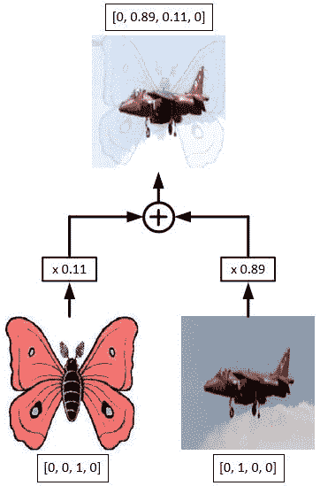
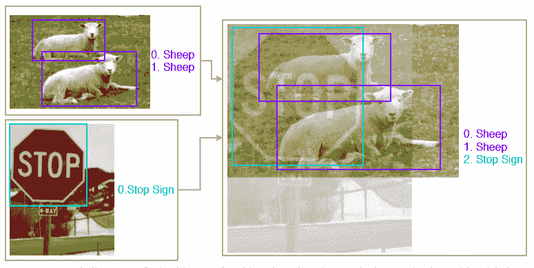
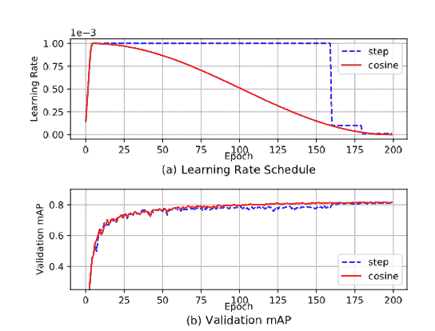
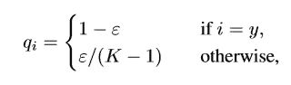
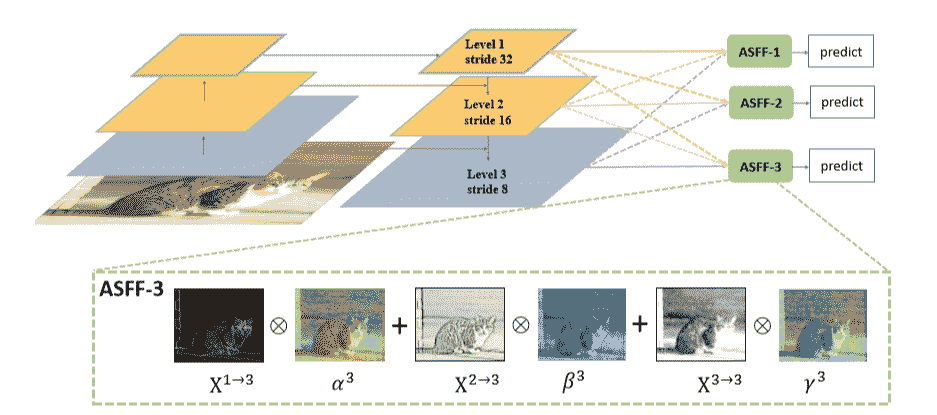
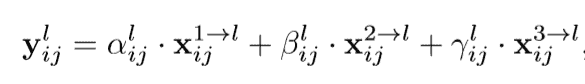
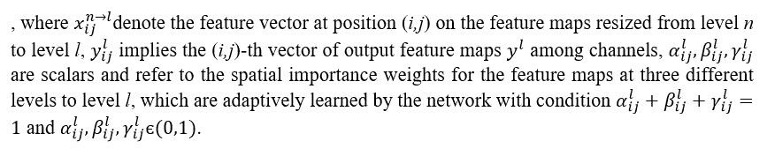
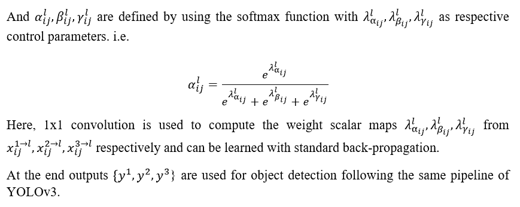

# 如何提高 YOLOv3

> 原文：<https://blog.paperspace.com/improving-yolo/>

YOLOv3 是一种流行的快速对象检测算法，但遗憾的是不如 RetinaNet 或更快的 RCNN 准确，你可以在下图中看到。在这篇文章中，我将讨论最近的对象检测文献中提出的两种简单而强大的方法来改进 YOLOv3。这些是:1) [用于对象检测的不同训练试探法](https://arxiv.org/abs/1902.04103)，以及 2) [特征金字塔的自适应空间融合](https://arxiv.org/abs/1911.09516)。我们将一个一个来看。让我们深入研究一下。


Source: [YOLOv3 paper](https://arxiv.org/abs/1804.02767)

## 用于对象检测的不同训练启发法

随着精细训练程序的使用，图像分类网络的性能有了很大的提高。关于这些训练技巧的简单讨论可以在[这里找到](http://openaccess.thecvf.com/content_CVPR_2019/papers/He_Bag_of_Tricks_for_Image_Classification_with_Convolutional_Neural_Networks_CVPR_2019_paper.pdf)来自 [CPVR](http://openaccess.thecvf.com/content_CVPR_2019/papers/He_Bag_of_Tricks_for_Image_Classification_with_Convolutional_Neural_Networks_CVPR_2019_paper.pdf) 2019。类似地，对于对象检测网络，一些人提出了不同的训练试探法(1)，例如:

*   保持几何对齐的图像混淆
*   使用余弦学习率调度程序
*   同步批处理规范化
*   数据扩充
*   标签平滑

这些修改将 YOLOv3 的 mAP@(.5:.9)分数从 33.0 提高到 37.0，而在推断期间没有任何额外的计算成本，并且在训练期间计算成本的增加可以忽略不计(1)。可以在[这里](https://gluon-cv.mxnet.io/model_zoo/detection.html#id81)找到经过预训练重量的改良 YOLOv3。为了理解这些启发背后的直觉，我们将一个一个地看它们。

### 图像 _ 混合

先说 [mixup](https://arxiv.org/abs/1710.09412) 训练。在图像分类网络中，图像混合只是两幅图像的像素的线性插值(例如下面的左图)。用于图像分类的混合算法中的混合比率的分布是从一个[贝塔分布](https://en.wikipedia.org/wiki/Beta_distribution)，B(0.2，0.2)中得出的，该分布也用于混合使用相同比率的独热图像标签。为了执行混合，两个图像必须具有相同的尺寸，因此它们通常被调整大小，然而这将需要图像中存在的对象的边界框也被调整大小。为了避免这种麻烦，使用了一种新的图像混合策略。它从两个图像中取出一个最大宽度和最大高度的图像，像素值等于 0 到 255，并向其添加两个图像的线性插值。对于这种混合策略，从β分布 B(1.5，1.5)获得混合比率，因为(1)发现对于对象检测，B(1.5，1.5)给出视觉上连贯的混合图像和经验上更好的地图分数。对象标签被合并为一个新数组。这将在下面演示。现在我们有一种混合方法用于图像分类，另一种用于物体检测。



Left: image classification mixup ([source](https://www.google.com/imgres?imgurl=https%3A%2F%2Fgitcdn.xyz%2Fcdn%2FTony607%2Fblog_statics%2Fb9663d6ce0ee992013f1335fbdfc076c8335b8f2%2Fimages%2Fmixup%2Fmixup-example.png&imgrefurl=https%3A%2F%2Fwww.dlology.com%2Fblog%2Fhow-to-do-mixup-training-from-image-files-in-keras%2F&tbnid=ZjhtaHe7WRwk9M&vet=12ahUKEwiCsO-SrevoAhUB6zgGHdRuAfIQMygJegUIARDfAQ..i&docid=YQ4FG31r9BbsaM&w=362&h=549&q=mixup%20image%20classification&ved=2ahUKEwiCsO-SrevoAhUB6zgGHdRuAfIQMygJegUIARDfAQ)). Right: object detection mixup ([source](https://arxiv.org/abs/1902.04103)).

目标在训练图像中的自然同现在目标检测网络的性能中起着重要作用。例如，一个碗、一个杯子和一个冰箱应该比一个冰箱和一只大象更频繁地出现在一起。这使得在其典型环境之外检测物体变得困难。使用具有增加的混合比率的图像混合使得网络对于这种检测问题更加鲁棒。Mixup 还充当正则化器，并强制网络支持简单的线性行为。

```py
def object_det_mix_up_(image1, image2, mixup_ratio):

    '''
    image1, image2: images to be mixed up, type=ndarray
    mixup_ratio: ratio in which two images are mixed up
    Returns a mixed-up image with new set of smoothed labels
    '''

    height = max(image1.shape[0], image2.shape[0])
    width = max(image1.shape[1], image2.shape[1])
    mix_img = np.zeros((height, width, 3),dtype=np.float32)
    mix_img[:image1.shape[0], :image1.shape[1], :] = image1.astype(np.float32)\
                                                     * mixup_ratio
    mix_img[:image2.shape[0], :image2.shape[1], :] += image2.astype(np.float32)\
                                                     * (1-mixup_ratio)
    return mix_img 
```

Image mixup code

### 学习率调度程序

大多数流行的对象检测网络(更快的 RCNN，YOLO 等。)使用学习率计划程序。根据(1)，所产生的急剧学习速率转变可能导致优化器在接下来的迭代中重新稳定学习势头。使用带有适当预热(两个时期)的余弦调度器(学习率缓慢下降)可以比使用步进调度器提供更好的验证精度，如下所示。



Comparison of step scheduler vs cosine scheduler on the PASCAL VOC 2007 test set ([source](https://arxiv.org/abs/1902.04103))

### 分类标题标签平滑

在标签平滑中，我们使用以下公式将我们的独热编码标签转换为平滑概率分布:



[source](https://arxiv.org/abs/1902.04103)

其中 K 为类数，ε为小常数，q 为地面真值分布。这通过降低模型的置信度来起到正则化的作用。

### 同步批处理规范化

在当前的深度卷积架构中，批量规范化被认为是一个重要的层。它负责加速训练过程，并通过标准化隐藏层的激活使网络对权重初始化不那么敏感。由于大的输入图像大小、特征金字塔架构的存在以及大量的候选对象提议(在多级网络的情况下)，单个 GPU 上可以容纳的批量大小变得非常小(即，每批少于 8 个左右的图像)。

在分布式训练范例中，隐藏的激活在每个 GPU 内被规范化。这会导致计算有噪声的均值和方差估计，从而阻碍整个批量标准化过程。[同步批处理标准化](https://arxiv.org/pdf/1711.07240.pdf)因此被建议通过考虑多个 GPU 上的激活来帮助增加批处理大小，以便计算统计估计值。因此，这使得计算的噪声更小。

使用 NVIDIA 的 [Apex](https://github.com/NVIDIA/apex) 库在 PyTorch 中进行混合精度和分布式训练，可以轻松实现同步批量标准化。我们还可以使用`convert_syncbn_model`方法将 PyTorch 中的任何标准`BatchNorm`模块转换为`SyncBatchNorm`，该方法递归遍历传递的模块及其子模块，用`apex.parallel.SyncBatchNorm`替换`torch.nn.modules.batchnorm._BatchNorm`的所有实例，其中`apex.parallel.SyncBatchNorm`是 PyTorch 模块，用于在 NVIDIA GPUs 上执行同步批处理规范。

```py
import apex
sync_bn_model = apex.parallel.convert_syncbn_model(model) 
```

Converting standard batch normalization to synchronized batch normalization in PyTorch using Apex

### 数据扩充

数据增强技术似乎也改进了目标检测模型，尽管它们对单级检测器的改进大于多级检测器。根据(1)，这背后的原因是在像 fast-RCNN 这样的多级检测器中，从大量生成的 ROI 中采样一定数量的候选对象提议，通过重复裁剪特征图上的相应区域来产生检测结果。由于这种裁剪操作，多阶段模型代替了随机裁剪输入图像的操作，因此这些网络不需要在训练阶段应用大量的几何放大。

根据经验，像随机裁剪(带约束)、扩展、水平浮动、调整大小(带随机插值)和颜色抖动(包括亮度、色调、饱和度和对比度)这样的增强方法在训练期间效果更好。在测试过程中，通过随机选择一种流行的插值技术来调整图像的大小，然后进行归一化。

```py
def horizontal_flip(image, boxes):
	''' 
    Flips the image and its bounding boxes horizontally
    '''

    _, width, _ = image.shape
    if random.randrange(2):
        image = image[:, ::-1]
        boxes = boxes.copy()
        boxes[:, 0::2] = width - boxes[:, 2::-2]
    return image, boxes

def random_crop(image, boxes, labels, ratios = None):
	''' 
    Performs random crop on image and its bounding boxes 
    '''

    height, width, _ = image.shape

    if len(boxes)== 0:
        return image, boxes, labels, ratios

    while True:
        mode = random.choice((
            None,
            (0.1, None),
            (0.3, None),
            (0.5, None),
            (0.7, None),
            (0.9, None),
            (None, None),
        ))

        if mode is None:
            return image, boxes, labels, ratios

        min_iou, max_iou = mode
        if min_iou is None:
            min_iou = float('-inf')
        if max_iou is None:
            max_iou = float('inf')

        for _ in range(50):
            scale = random.uniform(0.3,1.)
            min_ratio = max(0.5, scale*scale)
            max_ratio = min(2, 1\. / scale / scale)
            ratio = math.sqrt(random.uniform(min_ratio, max_ratio))
            w = int(scale * ratio * width)
            h = int((scale / ratio) * height)

            l = random.randrange(width - w)
            t = random.randrange(height - h)
            roi = np.array((l, t, l + w, t + h))

            iou = matrix_iou(boxes, roi[np.newaxis])

            if not (min_iou <= iou.min() and iou.max() <= max_iou):
                continue

            image_t = image[roi[1]:roi[3], roi[0]:roi[2]]

            centers = (boxes[:, :2] + boxes[:, 2:]) / 2
            mask = np.logical_and(roi[:2] < centers, centers < roi[2:]) \
                     .all(axis=1)
            boxes_t = boxes[mask].copy()
            labels_t = labels[mask].copy()
            if ratios is not None:
                ratios_t = ratios[mask].copy()
            else:
                ratios_t=None

            if len(boxes_t) == 0:
                continue

            boxes_t[:, :2] = np.maximum(boxes_t[:, :2], roi[:2])
            boxes_t[:, :2] -= roi[:2]
            boxes_t[:, 2:] = np.minimum(boxes_t[:, 2:], roi[2:])
            boxes_t[:, 2:] -= roi[:2]

            return image_t, boxes_t,labels_t, ratios_t 
```

Several data augmentations to be applied during training

```py
def preproc_for_test(image, input_size, mean, std):
	''' 
    Data Augmentation applied during testing/validation 
    :image: an ndarray object
    :input_size: tuple of int with two elements (H,W) of image
    :mean: mean of training dataset or image_net rgb mean
    :std: standard deviation of training dataset or imagenet rgb std 
    '''

    interp_methods = [cv2.INTER_LINEAR, cv2.INTER_CUBIC, cv2.INTER_AREA, cv2.INTER_NEAREST, cv2.INTER_LANCZOS4]
    interp_method = interp_methods[random.randrange(5)]
    image = cv2.resize(image, input_size,interpolation=interp_method)
    image = image.astype(np.float32)
    image = image[:,:,::-1]
    image /= 255.
    if mean is not None:
        image -= mean
    if std is not None:
        image /= std
    return image.transpose(2, 0, 1)
```

Data augmentation to be applied for testing/validation

除了上述试探法，在输入图像的不同比例下训练 YOLOv3 模型，如{ 320 x 320352 x 352384 x 384416 x 416448 x 448480 x 480512 x 512544 x 544576 x 576608 x 608 }，降低了过度拟合的风险，并提高了模型的泛化能力，就像标准的 YOLOv3 训练一样。这些变化极大地提高了 YOLOv3 的性能，但接下来我们将研究另一种方法，称为要素金字塔的自适应空间融合。如果与这些训练试探法相结合，这种技术可以使 YOLOv3 的性能甚至比更快的 RCNN 或 Mask RCNN (2)等基线更好。

## 特征金字塔的自适应空间融合

使用特征金字塔的对象检测网络在不同尺度的特征或者不同尺度的特征的融合下进行预测。例如，YOLOv3 以 32、16 和 8 三种不同的步幅进行预测。换句话说，如果给定一个 416 x 416 T1 的输入图像，它将对 T2 13 x 13 T3、T4 26 x 26 T5 和 T6 52 x 52 T7 进行预测。

低分辨率特征语义价值高，高分辨率特征语义价值低。低分辨率特征图还包含覆盖图像更大区域的网格单元，因此更适合检测更大的对象。相反，来自较高分辨率特征地图的网格单元更适合于检测较小的物体。这意味着仅使用一个尺度的特征来检测不同尺度的对象是困难的。为了解决这个问题，可以在不同的尺度上分别进行检测，以检测不同尺度的对象，如在单次检测器( [SSD](https://towardsdatascience.com/review-ssd-single-shot-detector-object-detection-851a94607d11) )架构中。然而，尽管该方法在计算上需要很少的额外成本，但它仍然是次优的，因为高分辨率特征图不能充分地从图像中获得语义特征。像 RetinaNet、YOLOv3 等架构。因此组合高和低语义值特征来创建语义和空间强的特征。对这些特征执行检测在速度和准确性之间呈现了更好的折衷。

不同分辨率特征的组合是通过按元素方式连接或添加它们来完成的。一些人已经提出了一种方法来组合这些特征地图，使得只有来自每个比例特征地图的相关信息被保留用于组合(2)。下图对此进行了总结。简而言之，不是像在标准 YOLOv3 中那样对每个级别的特征进行预测，而是首先对来自三个级别的特征进行重新缩放，然后在每个级别进行自适应组合，然后对这些新特征执行预测/检测。

为了更好地理解这一点，我们将看看这种方法的两个重要步骤:1)相同的重新缩放和 2)自适应特征融合。



Illustration of Adaptive Spatial Fusion of Feature Pyramids ([source](https://arxiv.org/abs/1911.09516))

### 相同的重新标度

每个级别的所有要素都将被重新缩放，并且它们的通道数也将被调整。假设大小为*416×416*的输入图像已经作为输入给出，我们必须将级别 2 的特征(其中特征图大小为*26×26*，通道数为 512)与级别 3 的更高分辨率特征(分辨率为*52×52*，通道数为 256)进行组合。然后，该层将被下采样到*26×26*，同时通道的数量增加到 512。另一方面，较低分辨率级别 1 的特征(分辨率*13×13*，通道数 1024)将被上采样到*26×26*，而通道数将减少到 512。

对于上采样，首先应用一个 *1 x 1* 卷积层来压缩特征的通道数，然后通过插值来进行放大。对于 1/2 比率的下采样，步长为 2 的*3×3*卷积层用于同时修改通道数量和分辨率。对于 1/4 的比例，在 2 步卷积之前使用 2 步最大池层。下面的代码使用 PyTorch 定义并执行这些操作。

```py
def add_conv(in_ch, out_ch, ksize, stride, leaky=True):
    """
    Add a conv2d / batchnorm / leaky ReLU block.
    Args:
        in_ch (int): number of input channels of the convolution layer.
        out_ch (int): number of output channels of the convolution layer.
        ksize (int): kernel size of the convolution layer.
        stride (int): stride of the convolution layer.
    Returns:
        stage (Sequential) : Sequential layers composing a convolution block.
    """
    stage = nn.Sequential()
    pad = (ksize - 1) // 2
    stage.add_module('conv', nn.Conv2d(in_channels=in_ch,
                                       out_channels=out_ch, kernel_size=ksize, stride=stride,
                                       padding=pad, bias=False))
    stage.add_module('batch_norm', nn.BatchNorm2d(out_ch))
    if leaky:
        stage.add_module('leaky', nn.LeakyReLU(0.1))
    else:
        stage.add_module('relu6', nn.ReLU6(inplace=True))
    return stage
```

Adds a convolutional block with a sequence of conv, batchnorm and relu layers

```py
def scaling_ops(level, x_level_0, x_level_1, x_level_2):
	"""
    Performs upscaling/downscaling operation for each level of features
    Args:
        level (int): level number of features.
        x_level_0 (Tensor): features obtained from standard YOLOv3 at level 0.
        x_level_1 (Tensor): features obtained from standard YOLOv3 at level 1.
        x_level_2 (Tensor): features obtained from standard YOLOv3 at level 2.
    Returns:
        resized features at all three levels and a conv block
    """
    dim = [512, 256, 256]
    inter_dim = dim[level]
    if level==0:
        stride_level_1 = add_conv(256, inter_dim, 3, 2)
        stride_level_2 = add_conv(256, inter_dim, 3, 2)
        expand = add_conv(inter_dim, 1024, 3, 1)

        level_0_resized = x_level_0
        level_1_resized = stride_level_1(x_level_1)
        level_2_downsampled_inter = F.max_pool2d(x_level_2, 3, stride=2, padding=1)
        level_2_resized = stride_level_2(level_2_downsampled_inter)
    elif level==1:
        compress_level_0 = add_conv(512, inter_dim, 1, 1)
        stride_level_2 = add_conv(256, inter_dim, 3, 2)
        expand = add_conv(inter_dim, 512, 3, 1)

        level_0_compressed = compress_level_0(x_level_0)
        level_0_resized = F.interpolate(level_0_compressed, scale_factor=2, mode='nearest')
        level_1_resized = x_level_1
        level_2_resized = stride_level_2(x_level_2)
    elif level==2:
        compress_level_0 = add_conv(512, inter_dim, 1, 1)
        expand = add_conv(inter_dim, 256, 3, 1)

        level_0_compressed = compress_level_0(x_level_0)
        level_0_resized = F.interpolate(level_0_compressed, scale_factor=4, mode='nearest')
        level_1_resized = F.interpolate(x_level_1, scale_factor=2, mode='nearest')
        level_2_resized = x_level_2

    return level_0_resized, level_1_resized,level_2_resized, expand
```

Performs upscaling or downscaling given the level number and set of features

### 自适应特征融合

重新调整要素后，通过对所有三个重新调整的要素地图的每个像素进行加权平均来合并要素(假设所有通道的权重相同)。这些权重是在我们训练网络时动态学习的。这个等式可以更好地解释它:



[source](https://arxiv.org/abs/1911.09516)



[source](https://arxiv.org/abs/1911.09516)



[source](https://arxiv.org/abs/1911.09516)

这里使用 PyTorch 定义这些操作。

```py
def adaptive_feature_fusion(level, level_0_resized, level_1_resized,level_2_resized, expand):
	"""
    Combines the features adaptively.
    Args:
        level (int): level number of features.
        level_0_resized (Tensor): features obtained after rescaling at level 0.
        level_1_resized (Tensor): features obtained after rescaling at at level 1.
        level_2_resized (Tensor): features obtained after rescaling at at level 2.
        expand (Sequential): a conv block
    Returns:
        out (Tensor): new combibed feature on which detection will be performed.
    """
    dim = [512, 256, 256]
    inter_dim = dim[level]
    compress_c = 16  
    weight_level_0 = add_conv(inter_dim, compress_c, 1, 1)
    weight_level_1 = add_conv(inter_dim, compress_c, 1, 1)
    weight_level_2 = add_conv(inter_dim, compress_c, 1, 1)

    weight_levels = nn.Conv2d(compress_c*3, 3, kernel_size=1, stride=1, padding=0)
    level_0_weight_v = weight_level_0(level_0_resized)
    level_1_weight_v = weight_level_1(level_1_resized)
    level_2_weight_v = weight_level_2(level_2_resized)
    levels_weight_v = torch.cat((level_0_weight_v, level_1_weight_v, level_2_weight_v),1)
    levels_weight = weight_levels(levels_weight_v)
    levels_weight = F.softmax(levels_weight, dim=1)

    fused_out_reduced = level_0_resized * levels_weight[:,0:1,:,:]+\
                        level_1_resized * levels_weight[:,1:2,:,:]+\
                        level_2_resized * levels_weight[:,2:,:,:]

    out = expand(fused_out_reduced)
    return out 
```

Performs Adaptive Feature Fusion given rescaled features

根据(2)，新适应的特征过滤掉不同尺度上的不一致性(使用自适应空间融合权重)，这是具有特征金字塔的单次检测器的主要限制。当与使用上述训练试探法训练的 YOLOv3 模型一起使用时，它显著提高了(在 COCO test-dev 2014 上，给出的 mAP@(.5:.95)为 42.4，而 YOLOv3 基线 mAP@(.5:.95)为 33.0)(2)在推断期间，YOLOv3 基线的计算成本仅略有增加(也在 COCO test-dev 2014 上测量)，即从 YOLOv3 基线的 52 FPS(每秒帧数)提高到 45.5 FPS (1)。此外，还集成了其他几个模块，如 [DropBock](https://arxiv.org/abs/1810.12890) 、 [RFB](https://arxiv.org/abs/1711.07767) 等。在自适应特征融合之上，可以超越(2)更快的 RCNN 和掩模 RCNN 基线。你可以在这里下载预先训练好的重量。

## 尾注

在本文中，我们看到了如何通过使用简单的对象检测训练试探法和自适应特征融合的新技术，在不增加或仅少量增加推理成本的情况下，显著改善 YOLOv3 基线。这些方法需要最少的架构更改，并且可以轻松集成。上面提到的训练试探法也可以直接用于微调预训练的 YOLOv3 模型。改进后的 YOLOv3 无疑在速度和精度之间提供了更好的平衡。您可以在这里找到使用上述方法对您的自定义数据[进行微调的完整代码。](https://github.com/SKRohit/Improving-YOLOv3)

[SKRohit/Improving-YOLOv3Few training heuristics and small architectural changes that can significantly improve YOLOv3 performance with tiny increase in inference cost. - SKRohit/Improving-YOLOv3GitHubSKRohit](https://github.com/SKRohit/Improving-YOLOv3)

### 参考

1.  [用于训练目标检测神经网络的一包赠品](https://arxiv.org/abs/1902.04103)
2.  [学习空间融合进行单镜头物体检测](https://arxiv.org/abs/1911.09516)