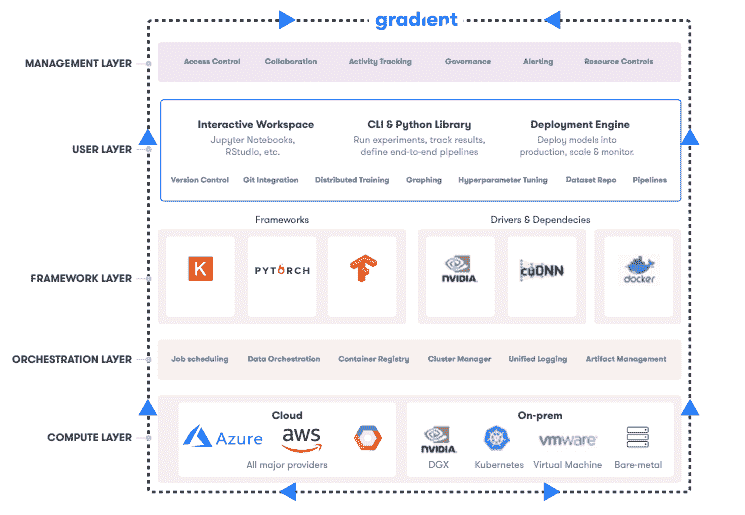
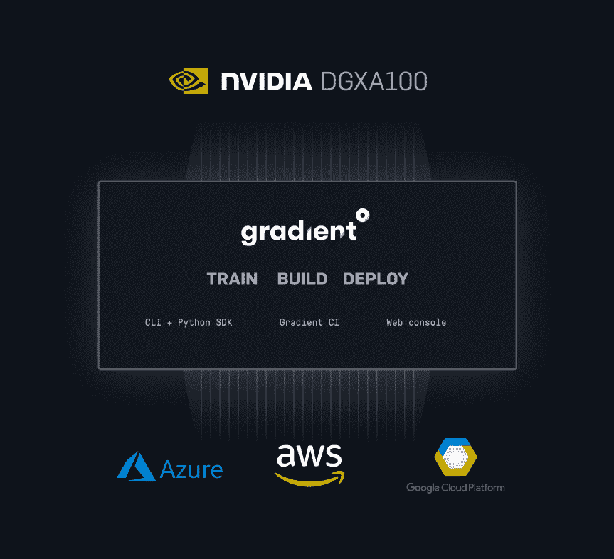

# Paperspace 加入英伟达 DGX 计划

> 原文：<https://blog.paperspace.com/paperspace-joins-nvidia-dgx-program/>

今天，我们很高兴终于向您展示了我们在过去几个月里与 NVIDIA 的同事们一起工作的成果。

有了 [Gradient](https://gradient.paperspace.com/) ，我们的开发者第一 ML 平台，指导方法一直是:我们如何让开发 ML 模型像构建现代 web 应用程序一样简单？以及我们可以建立什么工具来使来自不同领域的软件开发人员在机器学习和深度学习方面取得成功？

Layers of abstraction within a machine learning workflow.

如果你关注 Gradient 有一段时间了，你会知道我们也支持在机器学习中使用敏捷方法。我们相信像 CI/CD 这样的[最佳实践对于机器学习的大规模采用是必不可少的，并且](https://blog.paperspace.com/ci-cd-for-machine-learning-ai/)[已经提出了像 MLOps 这样的其他实用概念](https://blog.paperspace.com/what-is-mlops/)。

迄今为止，我们已经帮助数万名研究人员、数据科学家和人工智能工程师在商用云资源的基础上构建确定性和可再现的工作流。我们的工具为数千名设计师、工程师、研究人员等开启了基于云的 GPU 和尖端分布式处理。今年早些时候，我们启动了第*百万台*虚拟机！

Gradient 的核心任务之一是为机器学习工程师抽象出复杂的计算基础设施。我们的用户喜欢 Gradient 的可移植性，并要求更多的方法来将 ML 工作负载从单个工作站扩展到云。

云原生方法意味着 Gradient 可以轻松支持 GCP、AWS 和 Azure，我们刚刚[**推出了一个开源安装程序**](https://gradient.paperspace.com/gradient-installer) ，可以在你能想象的任何其他环境上运行 Gradient——从你的本地计算机到云。

今天，我们很高兴地宣布与 NVIDIA 正式合作，这是由我们在企业中实现人工智能的共同愿景推动的。

通过这种合作关系，我们已经为 NVIDIA 的任何 DGX 系统开发了开箱即用的一流梯度支持。

这是一件大事，原因如下:

1.  英伟达制造了许多当今最强大的人工智能芯片，DGX 是一个世界级的严肃人工智能计算平台
2.  Gradient 现已完全支持开箱即用，并已通过 NVIDIA 的仔细测试，以确保从安装到生产推断的一流体验
3.  此版本可让您轻松地将云资源连接到任何内部部署的 DGX 系统，为您的数据带来强大的计算能力，并通过统一的管理体验释放整个组织的协作和可见性

作为 DGX 就绪软件计划的创始成员，我们很高兴能够为英伟达 DGX 深度学习架构提供全面验证的支持。

英伟达 DGX 软件产品管理高级总监 John Barco 说:

> “我们开发了 NVIDIA DGX 就绪软件程序，以加速企业中的人工智能开发。Paperspace 开发了一种独特的 CI/CD 方法来构建机器学习模型，简化了过程，并利用了英伟达 DGX 系统的强大功能。”

如果您想了解更多信息，[我们很乐意与您聊天](https://info.paperspace.com/contact-sales)。我们的 Gradient Enterprise 支持团队为 DGX 客户提供设置帮助、解决方案架构和增强支持，因此请[联系](https://info.paperspace.com/contact-sales)。

这是一项鼓舞人心的努力，旨在打造能够让一代建设者受益的技术，我们怀着极大的自豪感承担这项工作。我们很高兴与 NVIDIA 发展这种合作关系，我们迫不及待地想向您展示我们的合作成果。

