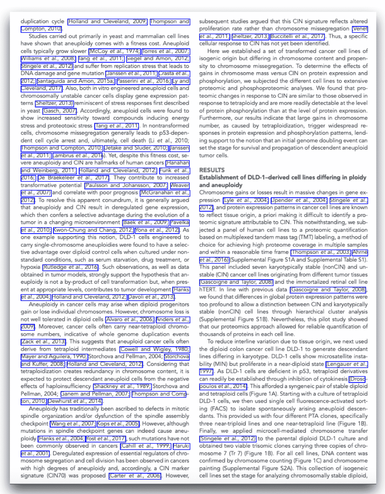
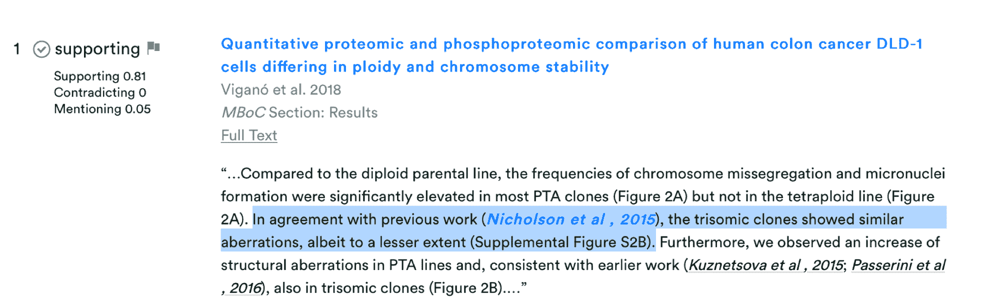
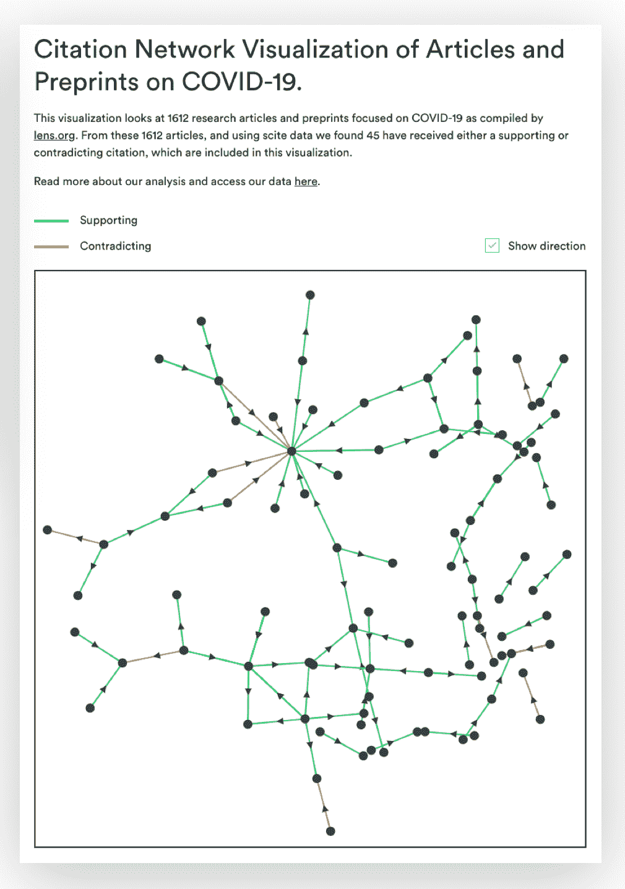

# 将噪音转化为信号:利用人工智能获得科学研究的背景

> 原文：<https://blog.paperspace.com/interview-with-josh-nicholson-scite-ai/>

Josh Nicholson 是 scite ( [www.scite.ai](http://www.scite.ai) )的联合创始人兼首席执行官，该公司正在使用深度学习来分析科学文献的整体，以更好地衡量科学工作的准确性。

我们很高兴能和他坐下来，了解更多关于他非凡而雄心勃勃的机器学习项目。

***Paperspace*** :你是如何产生 scite 的？

***【尼克尔森***:scite 的想法来自于这样一种观察，即[癌症研究](https://www.nature.com/articles/483531a)在独立测试时往往无法重现。这个问题在其他领域也存在，不仅仅是癌症研究。我们想找到一种方法来使科学研究更加可靠，机器学习使我们能够大规模地分析文献。

***Paperspace*** :到目前为止，你对多少篇科学文章进行了分析？

***尼克尔森:*** 到目前为止，我们已经分析了 16，158，032 篇文章中的 526，695，986 条引用语句，这个数字每天都在快速攀升。

**:scite 如何帮助读者评价一篇科技文章？**

**尼克尔森 :通过 scite，我们正在努力引入智能引用。这些引用提供了每个引用的上下文及其含义。例如，我们想知道引用是否提供了支持或反驳的证据——而不仅仅是它之前被引用、浏览或下载的次数。这使得人们可以查看一项研究，并快速确定它是否得到了支持或反驳。**

*****Paperspace*** :你从哪里获得数据来训练你的模型并创建引用图？**

*****尼克尔森*** : scite 通过与领先的学术出版商合作，利用开放获取的文章以及未开放的内容，如威利、IOP、洛克菲勒大学出版社、卡尔格、BMJ 等。**

*****Paperspace*** :模型是如何工作的？**

*****尼克尔森*** : 在我们确定了引用及其上下文之后，我们的深度学习模型将引用语句分为三类:支持、反驳或提及。该模型已经在来自各种科学领域的数万个人工注释片段上进行了训练。**

********

*****paper space***:**您的主要模型是否全天候运行？正在进行多少调优？****

*******【尼克尔森*** :它尽可能有效地运行，因为我们不断吸收新文章，并分析从中提取的引用语句。我们正在努力使这个过程完全自动化，这样一旦我们收到一篇新文章，它就会被处理并添加到数据库中。这些大部分是由 CPU 以及我们自己拥有和运行的 GPU 在云中完成的。****

******:**每天都有那么多关于新冠肺炎的新信息出现。scite 如何跟上海量的入站数据？********

*********【尼克尔森】*** : 起初我们并没有真正关注新冠肺炎的研究，因为我不认为我们能提供什么。一篇新论文不会仅仅因为太新而被引用。然而，考虑到人们现在每天都在发布新的内容，某些出版物在几天内就会收到引用，而通常需要几个月或几年。例如，[这篇预印本](https://scite.ai/reports/10.1101/2020.02.16.20023671)着眼于新冠肺炎与信号分子关系的严重性，仅在五天后得到了另一篇预印本的支持，我们能够用 scite 捕获该预印本。******

********

******:你最近通过机器学习模型运行了维基百科中的每一条引文。是什么让你想进行这项研究，你有什么发现？******

*********【尼克尔森】*** : 我们决定这样做是因为维基百科往往是许多试图更好地理解某些东西的人的第一站，也是唯一一站。[我们发现](https://www.biorxiv.org/content/10.1101/2020.04.08.031765v2)大多数被引用的文章(58%)未经后续研究证实或测试，而其余的在矛盾或支持证据方面表现出很大的可变性(2- 40%)。这听起来很糟糕，但实际上与一般的科学文章没有太大的不同。事实上，维基百科上的科学文章比整个科学文献获得了更多的支持性引用。******

****我们发现真正有趣的是，文章引用的参考文献在文献中实际上并没有得到支持。例如，维基百科的文章*自杀和互联网*指出:“一项调查发现，与没有报告更严重自杀风险症状的在线用户相比，出于自杀相关目的上网的有自杀风险的个人更不愿意寻求帮助，也更少获得社会支持。”这句话引用了[的一份科学报告，该报告与另一份](https://scite.ai/reports/examining-suicide-risk-individuals-who-go-RyyzV5)的报告相矛盾，这只能通过查看 scite 才能看到。拥有这篇维基百科文章的额外信息可能会影响行为选择，这些行为选择可能会对大量人群产生潜在的生死后果。****

*******Paperspace*** :这个模型运行了多长时间？****

****尼科尔森 :我们花了大约一天的时间对大约 1500 万条引用语句进行分类，但这项研究对我们来说很容易完成，因为我们采用了已经完成的分类，然后只查看了维基百科中的文章。****

*******Paperspace*** :你对 scite 的目标是什么？****

****我希望 scite 将有助于改变科学家的行为方式，奖励那些做出足够强的工作的人，以便其他人可以验证它，并奖励更多的公开辩论。科学从本质上影响着我们生活的方方面面，我们的使命是让科学更加可靠。****

*****如需了解更多关于 scite 的信息，请访问:*[*【https://scite.ai/】*](https://scite.ai/)****