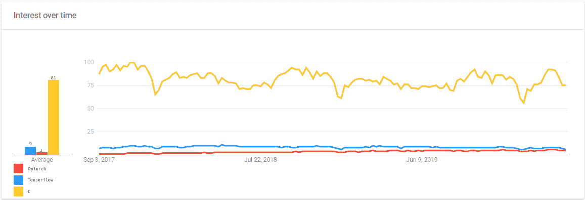
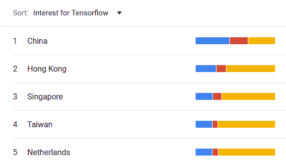
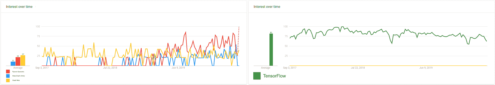
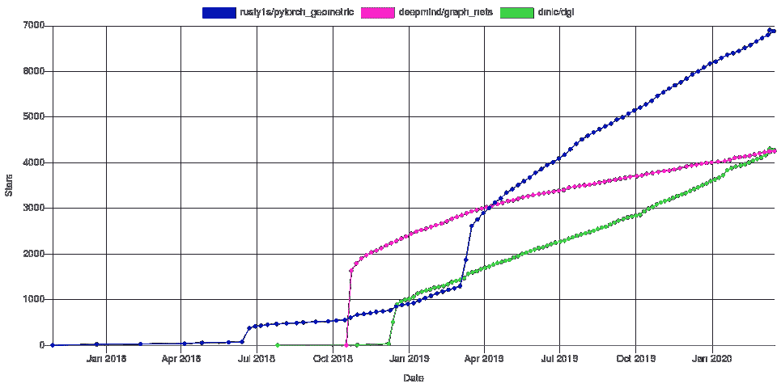
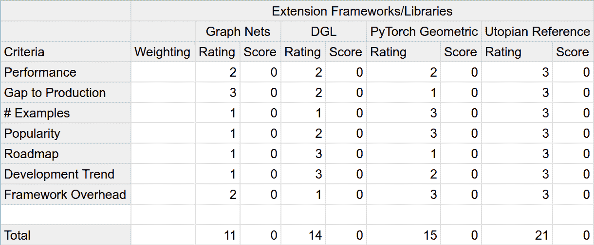
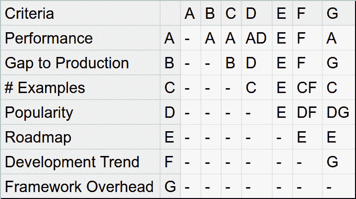
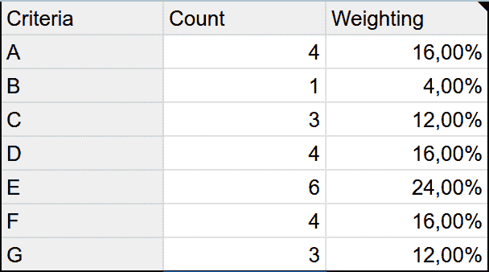
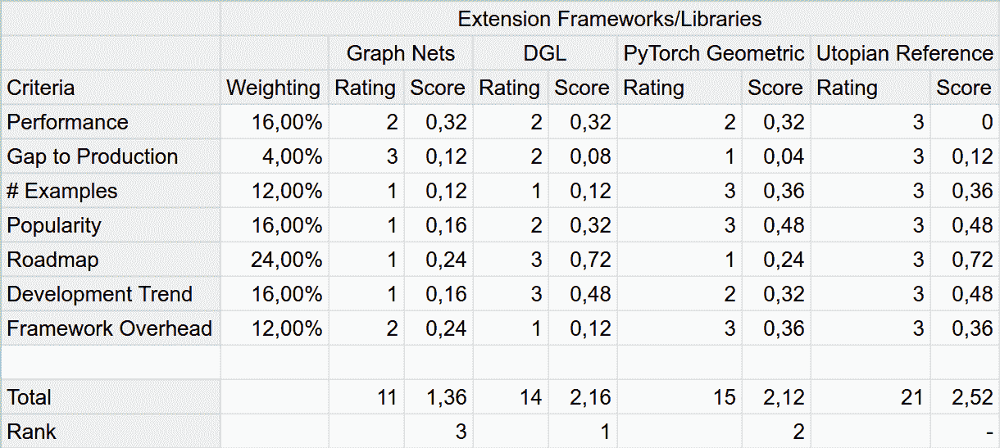

# 几何深度学习库比较

> 原文：<https://blog.paperspace.com/geometric-deep-learning-framework-comparison/>

在我们上一篇介绍几何深度学习的帖子[中，我们将该主题置于当前深度学习淘金热的背景下。至关重要的是，我们概述了是什么使 GDL 在其潜力方面脱颖而出。对于这篇文章来说，知道 GDL 是在不规则的数据结构上执行的深度学习就足够了，例如图形，网格和点云。](https://blog.paperspace.com/introduction-to-geometric-deep-learning/)

我们还展示了相关的任务，在这些任务上，采用 GDL 方法可以实现最先进的性能。尽管在各种任务上表现良好，但 GDL 的不规则数据结构不容易适应现有的深度学习框架。这种不适合需要开发新的库来进行有效和高效的计算。我们将简要介绍 GDL 图书馆如何对这种不规则数据和计算建模的一些相关细节，重点关注这对最终用户的影响。

最后，正如文章标题所承诺的，我们将简要讨论和比较 GDL 目前的主要图书馆。基于示例性用例，通过[形态分析](https://en.wikipedia.org/wiki/Morphological_analysis_(problem-solving))来执行比较。我们提供了用于此分析的工具，您可以根据您的使用情形和需求轻松定制它们。最后，我们将讨论这两个库之间的一些关键差异，并给出三种典型用例使用哪个库的建议:科学研究、生产级开发和业余爱好。

这些部分如下:

*   实施细节
*   PyTorch 几何
*   深度图形库
*   图形网
*   形态分析
*   荣誉奖
*   主要差异
*   我应该选择哪一个？

## 介绍

深度学习的进步引发了许多创新，其中之一是专门针对该领域的软件开发框架的创建。[框架和库的列表是广泛的](https://en.wikipedia.org/wiki/Comparison_of_deep-learning_software)，它们的主要焦点各不相同，但是它们之间仍然有共同点。大多数都提供了一组基本的层和功能，支持 CPU 上的多线程和将并行计算卸载到 GPU，同时依靠自动微分来快速计算反向传播的梯度。

但是深度学习框架在多大程度上渗透了软件开发过程？为了回答这个问题，我们需要一个这些框架相关性的代理。对于软件开发人员来说，不管他们的背景如何，使用搜索引擎来帮助在项目前和项目期间收集信息是司空见惯的，我们将使用 Google Trends 作为相关性的代理。我们将[搜索词与搜索主题](https://support.google.com/trends/answer/4359550)进行了比较，因此请记住，在后者中隐藏了更多的术语(例如，对于 C 编程语言)。下图中的值是标准化的网络搜索，以便更好地比较不同的主题，并在全球范围内汇总。从图表中可以明显看出，人们对此很感兴趣，如果考虑到我们正在将框架与通用编程语言进行比较，这种兴趣就更大了。

Google Trends for "PyTorch" and "TensorFlow" search terms, and "C" search topic (programming language) / [Google Trends Query](https://trends.google.com/trends/explore?date=2017-09-03%202020-03-28&q=Tensorflow,Pytorch,%2Fm%2F01t6b)

有趣的是，当接近前一个查询的特定国家时，这幅图发生了很大的变化。在中国，上面的框架甚至占了上风，如下图所示。

由于百度在中国拥有更大的市场份额，而且这些结果只涉及谷歌网络搜索，我们不得不对此数据持保留态度。此外，还有替代的、同样有价值的代理，例如来自 StackOverflow 或 GitHub 公共存储库数据的调查数据。网络搜索数据的优势在于，它非常接近人们对什么感兴趣的无偏见观点。一项调查有太多的偏差，在解释数据时必须加以考虑。关于 GitHub，仅仅依靠公开数据会扭曲我们的观点，因为这将只包含开源项目，而开源项目只占整个画面的一小部分。

GDL 图书馆在深度学习框架中表现如何？

*Left:* Google Trends for "pytorch geometric", "deep graph library", and "graph nets" search terms / [Google Trends Query](https://trends.google.com/trends/explore?date=2017-09-03%202020-03-28&q=Deep%20Graph%20Library,Pytorch%20Geometric,Graph%20Nets)  | *Right:* Google Trends as in Left graph with additional "tensorflow" search term / [Google Trends Query](https://trends.google.com/trends/explore?date=2017-09-03%202020-03-28&q=Deep%20Graph%20Library,Pytorch%20Geometric,Graph%20Nets,Tensorflow)

从上面的图表中，很明显，在深度学习社区中，GDL 图书馆仍然处于早期采用的微小利基中，正如几乎没有网络搜索的时期所证明的那样。在与 TensorFlow 的对比图中，他们的网络搜索几乎没有进展。关于单个 GDL 图书馆之间的兴趣，从 2019 年初开始，竞争和整体兴趣值明显上升。从 2019 年 5 月起，利率也将略微保持不变。这种步伐的改变并非巧合，因为 PyTorch Geometric 和 Deep Graph Library 都在当时的研讨会上正式推出，并附有研讨会论文出版物。

考虑到谷歌的趋势信息，为什么还要麻烦 GDL 呢？

好吧，你是想成为第 10 万个进行神经风格转换的人，还是走在深度学习发展的前沿？如果你对后者的回答是肯定的，请继续读下去。

## GDL 图书馆

布朗斯坦等人在 2017 年的开创性工作中提到，GDL 的计算框架是 GDL 领域的未来需求之一。[3]

从下图中可以看出，这篇文章所围绕的库是在不久之后开发的。PyTorch 几何的命名也凸显了文章的影响。

这里有两件事值得注意:

*   新近性:这些库已经开发了两年多了；这对于一个同样年轻的领域来说，不算什么。
*   受欢迎程度:PyTorch Geometric 已经拥有其母框架 PyTorch 收集的 GitHub 星星的五分之一。这与我们的谷歌趋势结果相矛盾吗？一点也不，可能会有一个很大的早期用户群体。

在接下来的章节中，我们将简要介绍这些库的实现细节，总结每一个，执行一个典型的形态分析，并为您提供必要的工具来执行您的特定用例。

Development of GitHub stars / [CodeTabs](https://codetabs.com/github-stars/github-star-history.html)

### 实施细节

Or: How to efficiently exploit these data structures for deep learning?

当前的框架针对在欧几里德网格状数据上运行算法进行了优化，通过使用 GPU 或其他特定硬件来加速这些操作。现有的方法之一是尝试将类似图形的数据放入符合当前优化操作的数据结构中，如 Conv2D。例如，在“mesh CNN:a network with a edge”中，Hanocka 等人将网格和它们使用的特征转换为张量，以便能够使用 PyTorch 的正常操作。[7]
当然，这种方法会产生数据争论的开销，并且不能保证最佳性能。此外，如果试图遵循不是为这些数据结构开发的工具的要求，人们可能会错过创新的改进。巴塔格利亚等人引入的全局图属性，对于表示多体机械系统的图来说可能是引力场，就是一个很好的例子。

#### 消息传递方案

在这个比较中提到的所有库的一个共同属性是，它们依赖于消息传递方案(如 Gilmer 等人所介绍的)来对图执行卷积和其他操作。[2]为了深入了解这到底意味着什么，巴塔格利亚等人和费等人提供了详细的解释，我建议你去看看。[1][4]此外，对于那些通过例子学得更好的人来说，[这里有一个关于这个方案在实践中如何通过知识图工作的详细解释](https://github.com/graknlabs/kglib/tree/master/kglib/kgcn#how-does-message-passing-work)。

关于这些库的实现细节，在这种情况下还有一件更重要的事情需要注意。**GPU 上的聚集分散**操作用于加速遵循消息传递方案接口的方法。在技术实现上，它固有地存在一些缺点。通常，当使用随机过程执行实验时，最好为随机数生成器设置一个种子，以保证在开发过程中或测试他人执行的实验时结果的可再现性。其中，这确保了对于每个训练迭代，权重被初始化为相同的。更重要的是，这还意味着使用相同特定架构、超参数集和数据集的相同手动种子的不同训练会话将**总是**返回相同的结果。

Fey 等人在介绍他们的扩展库的研讨会论文中将此放在聚集分散操作的上下文中:

> 此外，应该注意，分散操作在 GPU 上本质上是不确定的。尽管我们没有观察到任何用于推断的偏差，但是在相同的手动种子中，训练结果会有所不同。

### PyTorch 几何

[PyTorch geometry](https://pytorch-geometric.readthedocs.io/en/latest/)是 py torch 的扩展库，可以对非欧几里德数据执行常规的深度学习任务。其名称中的“几何”是指由 Bronstein 等人[4][3]
创造的领域定义。为什么它是一个扩展库而不是框架？嗯，它完全符合 PyTorch API，只是扩展和改进了新用例的功能。

它源于多特蒙德大学的研究，主要由博士生 Matthias Fey 开发，除了开发这个库，他还开发了该领域的 SOTA 方法。[4][6]

这种与科学研究的接近性体现在大量最近研究的示例实现中，以及用于快速原型制作或结果复制的基准数据集中。此外，自 2019 年 4 月初以来，它已经成为官方 [PyTorch 生态系统](https://pytorch.org/ecosystem/)的一部分，并在[主项目的登陆页面](https://pytorch.org/)占据显著位置。这种变化可以在之前的 GitHub stars 历史图表中通过其斜率的显著增加看到。

### 图形网

Graph Nets 也是一个扩展库。作为 DeepMind 团队的内部项目，它与巴塔格利亚等人关于该主题的论文一起被开源。[1]

虽然它与 TensorFlow API 配合得很好，但它依赖于 DeepMind 的[十四行诗](https://github.com/deepmind/sonnet)，这使得它不太可能被纳入 TensorFlow 的生态系统(像 PyTorch Geometric 一样)。此外，尽管它是开源的，但它是内部开发的，很少对公共存储库进行更新。然而，有明显的迹象表明，通过 TensorFlow 2.0 的[更新的例子，开发正在稳步地私下继续。](https://github.com/deepmind/graph_nets/issues/86#issuecomment-579849135)

### 深度图形库

这个库没有扩展任何现有的深度学习框架。相反，它在其架构设计中紧密遵循了 API 和范式 [NetworkX](https://networkx.github.io/) ，并提供了一个后端不可知的库。[5]

可以把它看作是图形深度学习的 Keras，其中有一组 API 函数可以使用不同的后端框架。它起源于美国和上海的 NYU 和 AWS 在 Yann LeCun 的指导下进行的研究，并在合作中不断发展。目前的活跃贡献者团队由大约 12 人组成，和 AWS 的项目负责人分别是[王敏杰](https://jermainewang.github.io/)和(从官方 GitHub 知识库公开统计和 [DGL 的关于页面](https://www.dgl.ai/pages/about.html)检索的信息)。

在当前的稳定版本 v0.4.1 中，PyTorch 和 MxNet 都作为后端框架提供，而 TensorFlow 支持仍处于试验阶段。随着即将发布的 v0.5.0，TensorFlow 将被纳入稳定版本。

### 形态分析

在本节中，我们将非常依赖 Fil Salustri 的 [DesignWIKI](https://deseng.ryerson.ca/dokuwiki/start) ，并参考相关文章以获得对过程和背景理论的更详细解释。此外，对于这一部分，我将从爱好开发者的角度进行分析。在这一部分的最后将会有更多的提示，告诉你如何调整分析以适应你的用例，以及工业或科学应用可能会改变什么。

我们想要的是一组规则，它们快速地**和**可靠地引导我们找到用例的最佳库或框架。如果您有一套要求来使整个过程更加正式，并且您的结果更具可重复性，那就更好了。

因为我们要比较的东西非常复杂，而且没有明显的方法可以用来相互比较，所以我们想把在它们之间进行选择的任务分解成小步骤。熟悉算法设计的人会看到对[除法&征服范式](https://en.wikipedia.org/wiki/Divide-and-conquer_algorithm)的熟悉。幸运的是，我们可以通过使用一种叫做[加权决策矩阵](https://deseng.ryerson.ca/dokuwiki/design:weighted_decision_matrix) (WDM)的简单方法来实现我们的目标。来自前面提到的维基条目的介绍:“一个*加权决策矩阵*是一个用来比较不同重要性水平的多个标准的备选方案的工具。”

太好了，这听起来正是我们要找的。第一步是定义比较备选方案的标准。

对于我的用例，我将标准设置如下:

*   性能:每个时间框架内我们可以进行多少次训练迭代？
*   生产差距:为训练有素的模型服务有多容易，是否有必要的基础设施？
*   示例数量:有多少个应用程序示例可以开始使用？
*   受欢迎程度:对更大的社区有显著的兴趣吗？
*   路线图:未来发展的计划是否清晰公开地传达了？
*   发展趋势:是否有持续发展，是否有积极的维护者？
*   框架开销:我要投入多少时间学习使用扩展库？

下一步是创建 WDM，并填写我们选择使用的标准的每个备选方案的分数。为什么我们不先计算一下每个标准的相对重要性呢？这样，我们可以保护自己免受不太重要的标准的影响。否则，我们会倾向于不去想太多，可能会得出错误的结论。对于每个标准的评分，李克特量表通常是推荐的选择。在我们的例子中，分数是相对的，可能的分数{1，2，3}可以被解释为具有一个特性的排名:如果差距足够大，第二名可能仍然没有被占据。

在对示例场景中的每个备选方案进行评级后，这是结果矩阵。

Preliminary Decision Matrix

在这一步之后，我们需要为每个标准设置相对重要性级别，在本例中，我们将通过执行[成对比较](https://deseng.ryerson.ca/dokuwiki/design:pairwise_comparison)来完成。和 WDM 一样，我们将把一个大而复杂的任务分解成一堆小而简单的任务。这部分也是你自己的经验和知识发挥作用的点。考虑到我们的要求，对于每个独特的标准组合，我们将决定哪一个对我们更重要，并记录这个决定。我们将通过使用电子表格应用程序来执行这一比较。下图是我们正在经历的例子的结果。
注意，每当两个字母在同一个单元格中，这意味着两个标准同等重要。此外，空单元格会导致遗漏不相关的信息。我们对标准本身的比较或者非唯一的比较不感兴趣。

Pairwise Comparison Table

现在我们简单地统计一下每个字符在表格中出现的次数。对于当前的例子，这导致了以下结果。

Weightings and counts sorted by criterion

为了计算我们标准的权重，我们将根据计数求解一个简单的线性方程，如下所示:

`100% = 4x + x + 3x + 4x + 6x + 4x + 3x`

从这个等式可以得出`x = 4%`,我们可以将它乘以每个标准的计数来得到它的权重。
在谷歌电子表格中，一切都为你准备好了，你可以玩这些数字。公式也很容易根据您的需要进行调整。

现在我们可以将权重代入已经准备好的 WDM，看看它是否会以任何方式改变我们的结果。

Complete Weighted Decision Matrix

确实如此。有趣的是，包括我们的分数的加权增加了图形网和其他选择之间的差距。这种增长是 it 在本示例场景中不太重要的标准上表现出色的直接结果，例如生产差距。

另一方面，验证计算 WDM 和最小化偏差的步骤选择顺序，也是生产差距将我们的获胜者与亚军区分开来。如果我们在计算完权重后对备选方案进行评分，我们可能会得出不同的结论。

概括来说，为了打造 WDM，我们:

1.  定义了一套相关且定义明确的标准
2.  通过使用相对等级量表，根据这些标准对每个备选方案进行评分
3.  通过使用成对比较计算每个标准的权重
4.  计算每个备选方案的最终得分

此外，您选择的标准应该尽可能地相互独立。最重要的是，不要屈服于以不同的顺序完成程序，或者在计算出总分后改变权重。通过以正确的方式执行流程，我们可以最大限度地减少决策中的偏差，这一点至关重要。为了完成您的用例的分析，可以通过 Google Sheets 上下文菜单随意复制[形态分析 Google 电子表格](https://docs.google.com/spreadsheets/d/1RNASfYA5LBwIZfinWxBOuFqV4oUnr2pmjYyaceCtn5w/edit?usp=sharing):*文件- >制作副本*

按照受影响标准的顺序，对用于分析的数据有一些说明。在 Fil Salustri 的设计网站上表演 WDM 的原始帖子依赖于一个真实的参考替代方案。在我们看来，这个参考是乌托邦式的，是一个完美选择的上限。使用基线替代方案也是可能的，并且非常适合这种方法。对于 GDL 来说，这可能代表了你的解决方案，试图将非欧几里德数据融入现有的数据结构，并使用没有任何扩展的常用深度学习框架。这样，分析将帮助您衡量额外的开销是否值得——可能是值得的。

我们自己没有执行任何基准测试，而是依赖于关于替代方案的公开文献。出于这个原因，我们假设在本分析中，业余爱好者的性能大致相同，因为据我所知，唯一可用的结果是 DGL 和 PyTorch Geometric 的比较。如果你有多余的时间，一定要执行一些你自己的基准。一个有用的资源是 PyTorch 几何文档中列出的外部资源列表。

PyTorch 的服务模型有其他选择，但与 Tensorflow 相比，这些选择会带来额外的成本，这就是图网的要点。大多数情况下，模型可以包含在代码中进行推理，而不需要任何进一步的特性。对于更复杂的服务场景，可以使用 ONNX 来转换 PyTorch 模型，以便与 Tensorflow 服务一起使用。最后， [MLFlow](https://mlflow.org/) 是一个后端不可知的替代方案，用于“...管理 ML 生命周期，包括实验、再现性和部署。”

细心的读者可能也注意到了分析中有一些细微的不一致。如果我们仔细观察我们进行的成对比较，我们做出的一些决定之间有一个矛盾的联系。根据我们的比较，这不可能是真的。换句话说，如果框架开销比生产差距更重要，而生产差距又比示例数量更重要，而示例数量本身又比框架开销更重要，那么我们就没有[总顺序](https://en.wikipedia.org/wiki/Total_order)。Fil Salustri 在[的原始帖子中也提到了这个错误，并将其称为箭头悖论。](https://deseng.ryerson.ca/dokuwiki/design:pairwise_comparison)

最后，您可以包含一些额外的标准，或者与已经包含的标准进行交换。

*   数据集集成:为特定任务导入和使用基准数据集有多容易？
*   (开发)失败的单点:如果首席开发人员突然离开，图书馆的开发会受到什么影响？

前者对于总体基准测试非常有用，尤其是在开发新方法并需要针对最先进的技术进行评估时，对于科学研究非常有用。PyTorch Geometric 非常适合这一点，因为它既提供了该领域论文中方法的各种实现，又具有迄今为止与标准数据集的最佳集成。对于需要可靠开源解决方案的工业应用来说，后者可能是成败的标准。如果项目背后的开发团队过于头重脚轻，一个关键人物的离开可能会导致开发中的重大缺口，在最糟糕的情况下，会导致开发完全停止。在持续开发和交付是必须的情况下，这种风险通常是不能冒的。

### 荣誉奖

主要面向中国读者:
[Euler](https://github.com/alibaba/euler) 是一个扩展框架，类似于 DGL，使用 TensorFlow 或者 X-DeepLearning(阿里)作为后端。根据文件，PyTorch 的支持已经在它的路线图上，有可能使它与 DGL 竞争，至少在中国市场上。尽管代码和文档都是英文的，但是关于问题和请求的交流都是中文的，这使得它对于不会说中文的人来说很难接受。
[NeuGraph](https://arxiv.org/abs/1810.08403) 是由北京大学和微软亚洲研究院的研究人员在中国开发的进一步框架。由于在公共渠道上没有可用的开源实现，在可预见的未来，开发似乎一直在内部进行。

### 主要差异

这三个被分析的框架之间存在一些关键的差异，在某些情况下，这可能会迫使做出特定的选择。首先，目前只有 Graph Nets 使用 TensorFlow 作为后端。如果您的解决方案严重依赖 TensorFlow 环境。使用 TensorFlow 作为后端的可能性将在 DGL 的 v0.5 中提供。尽管如此，Graph Nets 仍然是列出的备选方案中唯一有潜力成为 TensorFlow 生态系统的一部分的。
此外，如果您只想重现最近一篇论文中方法的结果，或者用您的数据进行测试，Pytorch Geometric 可能是正确的选择。它拥有来自该领域论文的惊人数量的已实现算法，加上与标准基准数据集的轻松集成，使其在快速开发和验证方面脱颖而出。
DGL 是唯一一个拥有清晰的公开路线图的公司，并且拥有众多积极参与项目的开发人员。

### 我应该选择哪一个？

首先，如前所述，确定哪一个库最适合您的最佳方法是使用我们提供的工具自己进行分析。

有了这个免责声明，下面是一些常见用例的建议:

*   科学研究:PyTorch Geometric 是由一名博士生开发的，他正在研究该领域的 SOTA 算法。这个图书馆可能是你最好的选择。从通用基准数据集的集成到其他论文的实现，如果您希望针对 SOTA 快速测试您的新发现，它允许无缝集成。
*   生产就绪的开发:在这里，它不是那么清晰。随着最新版本和对 TensorFlow 的全面支持，很难决定是使用 DGL 还是图网。随着 AWS 的深入参与，DGL 很可能很快就会为大规模应用程序提供高级支持。否则，如果你渴望能够将 Deepmind 的最新研究应用到你的应用程序中，那么 Graph Nets 将是唯一的选择。
*   业余爱好者:如果你对测试图形神经网络感兴趣，没有任何附加条件，最快的方法，那么 PyTorch Geometric 是最好的。您可以查看和调整的示例实现数量之多令人震惊。DGL 紧随其后，需要更多的时间投入。此外，它显示了公共路线图和支持的长期承诺，可能是您未来应用程序的宝贵工具。

参考文献:
1。彼得·w·巴塔格利亚等人，《关系归纳偏差、深度学习和图形网络》 *arXiv 预印本 arXiv:1806.01261* (2018)。
2。量子化学的神经讯息传递。*第 34 届*
*机器学习国际会议论文集——第 70 卷*。JMLR。org，2017。
3。几何深度学习:超越欧几里得数据。 *IEEE 信号处理杂志* 34.4 (2017): 18-42。
4。菲，马提亚斯和简·埃里克·连森。"快速图形表示学习与 PyTorch 几何." *arXiv 预印本 arXiv:1903.02428* (2019)。
5。王，闵杰，等，“深度图库:面向图的高效可扩展深度学习” *arXiv 预印本 arXiv:1909.01315* (2019)。
6。《SplineCNN:用连续 B 样条核的快速几何深度学习》*IEEE 计算机视觉和模式识别会议论文集*。2018.
7。《网状 CNN:一个有边缘的网络》*美国计算机学会图形汇刊(TOG)* 38.4 (2019): 1-12。