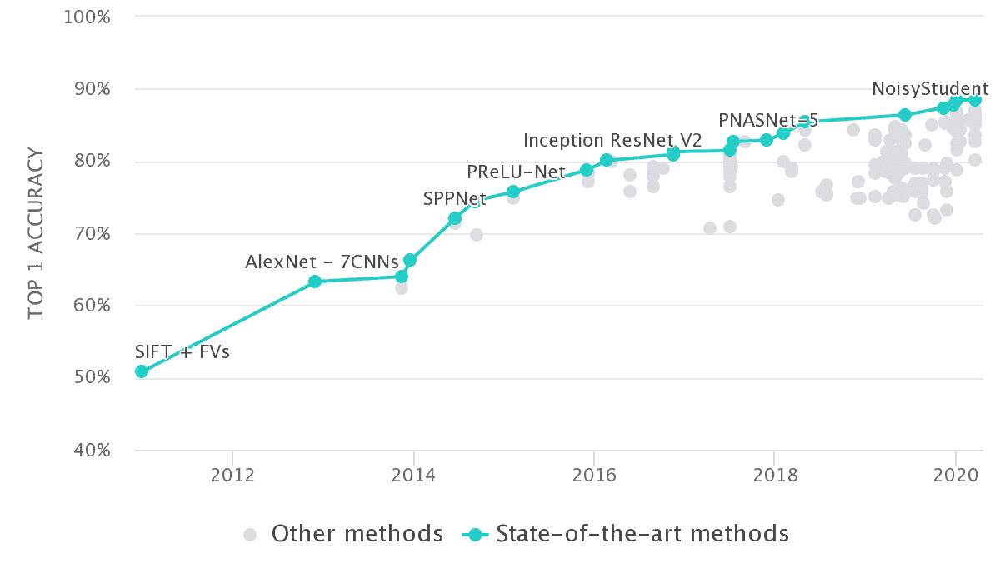
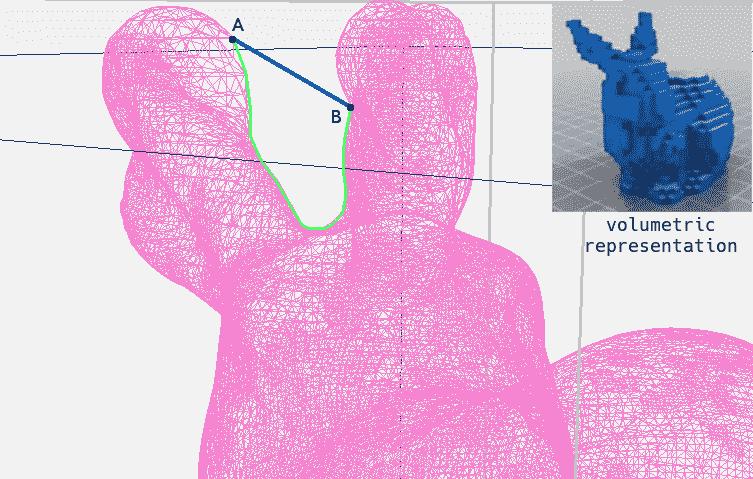
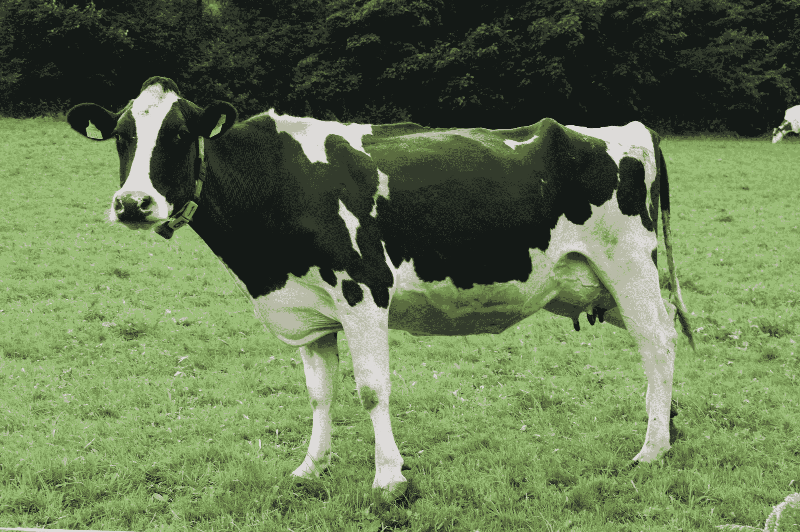
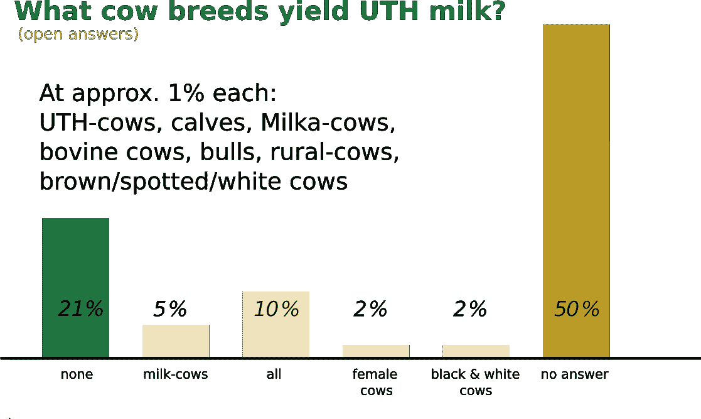
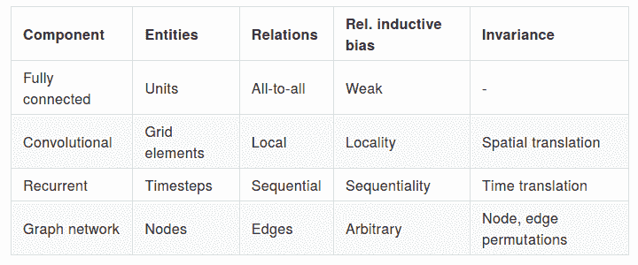

# 几何深度学习简介

> 原文：<https://blog.paperspace.com/introduction-to-geometric-deep-learning/>

计算机视觉的最新进展主要来自于新的深度学习方法，即依赖大量数据对特定任务进行训练的分层机器学习模型。由此带来的性能改进的幅度和速度引发了对其他科学领域类似应用的淘金热。

在许多其他研究领域中，这些发展催生了几何深度学习领域(GDL)。我们将解释 GDL 的“几何”代表什么，同时在关系归纳偏差的背景下解释它，这是一个由 DeepMind 的研究人员在该领域创造的统计推理术语。

计算机科学中的一些主题令人兴奋，但只有很小范围的有用任务可以用它们来执行。GDL 不在其中；我们将深入研究它擅长的许多任务中的一些。

这些部分如下:

*   介绍
*   几何深度学习
*   统计推理
*   有趣的用例
    *   图形分割
    *   图形分类
    *   真实用例
*   结论

## 介绍

在过去十年中，机器和深度学习领域取得了重大进展，这在很大程度上归功于快速增长的计算能力和可用数据，以及 80 年代和 90 年代开发的算法的新应用(例如反向传播和 LSTMs)。这一发展的最大受益者之一是表征学习领域，它被放在监督学习的子领域中。表示学习，通常被称为特征学习，是机器学习(ML)的一个子领域，涉及在没有人工干预的情况下为任务找到最佳数据表示的算法。在许多应用程序中，它是特征工程的直接替代，特征工程是与开发特征和描述符有关的领域，以最好地执行其他 ML 任务。

一个突出的例子是深度卷积神经网络(CNN)用于图像分类和对象检测等任务，在基准测试中实现了比传统算法高得多的性能。在深度 CNN 出现之前，这个过程通常包括两个阶段。首先从图像中提取手工制作的特征，然后根据这些特征执行特定的任务。大多数成功的传统算法依赖于这种模式的变体，执行这些步骤中的一个或两个。随着深度 CNN 的出现，出现了向端到端(E2E)学习的转变，这意味着学习被分析数据的底层表示是以完全数据驱动的方式完成的，即，没有专家输入或操纵。

这种方法第一次(成功地)在更广泛的背景下展示是由 Krizhevsky 等人(T1)完成的。在 2012 年的 ImageNet 竞赛中，他们在功能工程方面大大超过了最先进的(SOTA)[6]。这在下面的图表中很明显，从“SIFT + FVs”和“AlexNet”之间的性能跳跃中可以看出。此外，之后的所有方法都建立在这一创新的基础上，以进一步提高基准测试的性能。

Figure 1\. ImageNet Classification Challenge / [PapersWithCode](https://paperswithcode.com/sota/image-classification-on-imagenet)

深度学习中的“深度”是指神经网络中采用的连续层的数量。关于 E2E 学习的有效性，有趣的是观察各层在每个阶段学到了什么。对于应用于图像的 CNN，网络以 E2E 方式学习的数据表示依赖于与专家所做的相似的方面:通过对浅层中更高层次的特征(边缘、拐角)和深层中更具体的组成特征(结构)做出反应。使用深度学习(DL)的首次突破也激发了 ML 的其他子领域尝试利用这些关于表征学习的新知识。使用神经网络进行价值函数逼近的深度强化学习是许多例子中的一个。

在下一节中，我们将看看一个最近蓬勃发展的研究领域，它有着相似的起源，也是本文的主题。

### 几何深度学习

布朗斯坦等人在其 2017 年的文章“ [**几何深度学习**:超越欧几里德数据](https://scholar.google.com/scholar_url?url=https://ieeexplore.ieee.org/abstract/document/7974879/&hl=en&sa=T&oi=gsb&ct=res&cd=0&d=16083123238264716705&ei=GXlqXrGmLYWtmwHg-qrIDw&scisig=AAGBfm1gRjBDiV1FG-cQyo_FQAsLM-BWNQ)【5】中首次引入了几何深度学习(GDL)这个术语。
这个标题很能说明问题；GDL 定义了新兴的研究领域，在非欧几里德数据上使用深度学习。非欧数据到底是什么？排除法的一个解释是，对于非欧几里德数据，两点**之间的最短有效路径不是**它们之间的欧几里德距离。我们将使用一个网格，或者一个在计算机图形领域非常普遍的图形特殊化来形象化这一点。在下图中，我们可以看到将经典的斯坦福兔子表示为网格(非欧几里得)或类似网格的体积(欧几里得)之间的区别，在这种情况下，通过离散化的体素。A 点和 B 点之间的欧几里德距离是它们之间最短的直线路径的长度，在图像上显示为蓝线。两点之间的示例性测地线距离将更类似于绿线的长度。测地距离是高维最短路径概念的推广，而图的测地距离定义通常是节点之间的最短路径。

Euclidean and Geodesic distances; blue and green respectively.

以非欧几里得方式解释网格的优点是测地线距离对于在网格上执行的任务更有意义。可以这样想:在深度 CNN 中，我们依赖可能彼此相关的相邻像素。为了在图上再现类似的设置，我们需要考虑“接近度”的重新表述。

当然，我们可以将固有的非欧几里德数据转换成欧几里德数据，但这包括效率和性能损失的高成本。斯坦福大学的 ShapeNet 数据集在零件分类和分割方面的进展证明了这一点。在 Chang 等人提出的基准上获得良好结果的第一个神经网络依赖于网格的体积表示和深度信念网络来处理它们。[4]

这种方法的一个大问题是如何用离散化来权衡运行时效率，因为问题的规模是立方的。此外，在 3D 体素上使用卷积带来了在空的 3D 空间上执行计算的显著开销的问题。由于许多不同的对象都表示在同一个体素空间中，因此没有简单的方法来防止这些空洞的计算发生。

当前的 SOTA 方法直接在网格结构上执行上述任务，或者将它们转换成点云，实现了远为优越的性能和运行时间。[3][9]

不要担心，在这篇文章的剩余部分，你不需要[图论](https://en.wikipedia.org/wiki/Graph_theory)的知识，但是你应该仔细阅读，以便能够使用我们很快就会看到的[软件库](https://blog.paperspace.com/geometric-deep-learning-framework-comparison/)。为了更好地介绍图形和基础理论，你需要了解 GDL 的基本概念，你可以参考[瓦伊德希·乔希](https://medium.com/basecs/a-gentle-introduction-to-graph-theory-77969829ead8)的《【】图论简介》。要深入了解理解该领域中开发的算法所需的进一步理论，请参考吴等人的调查论文“[关于图形神经网络的全面调查](https://scholar.google.com/scholar_url?url=https://arxiv.org/abs/1901.00596&hl=en&sa=T&oi=gsb&ct=res&cd=0&d=10891000151054490378&ei=EnhqXsWNKaawmgHg6buAAg&scisig=AAGBfm0QsxkbBpCfZZ9llLilC6K87W1ZTw)”。此外，他们的调查论文中介绍的分类法可以帮助突出与深度学习中其他领域的相似之处。

当然，最好的情况是，您已经根据自己掌握的数据识别出可能的用例，或者反过来；基于 GDL 解决您当前问题所需的数据。

我们提到了 GDL 属于非欧几里得数据，并且还提出了一些例子和定义。值得注意的是，在本文中，我们不会涵盖点云，点云有其自身的优势，但在我们可以做出的假设方面与图形和网格有很大不同。

### 统计推理

总的来说，我们想要区分演绎推理和归纳推理。在演绎推理中，我们试图使用一般术语来提出具体的主张或得出特定的结论。这方面的一个例子是将“所有的人都会死”和“约翰·多伊是一个人”这两个断言结合起来，得出以下结论:“约翰·多伊必须死”(最终)。归纳推理则反其道而行之，试图从具体的术语中推断出一般的想法或结论。我们将用一个当代的例子来形象化这个推理，这个例子来自德国一项关于青少年与自然疏离程度的研究。给读者一个快速测试:什么类型的奶牛只产 UHT(长寿)奶？

Photo by [Screenroad](https://unsplash.com/@screenroad?utm_source=ghost&utm_medium=referral&utm_campaign=api-credit) / [Unsplash](https://unsplash.com/?utm_source=ghost&utm_medium=referral&utm_campaign=api-credit)

如果你的答案是“没有”，那么你符合 21%的受访青少年。结果汇总如下:

Got Milk? / German 2010 DJV youth report [2]

这里有大量的结果需要分析，但是我们将保持 1%的人认为奶牛产 UHT 奶。我们将从儿童的角度用归纳推理的方式解释这个结论，如下:“UHT 奶是一种特殊类型的奶”，“Milka-cows 是一种特殊品种的牛”，从而得出“Milka-cows 产出 UHT 奶。”问题是根本没有奶牛这种东西。 [Milka 是来自德国的巧克力品牌](https://www.milka.de/)。他们的 CI 的主色调是紫色，相应地，他们的品牌吉祥物是一头带有白色斑点的紫色奶牛。对这些孩子来说，读一本关于“真正的”奶牛的漫画书，或者参观一个农场，就足以改变他们的看法。根据他们掌握的信息，他们得出了错误的结论。[2]

从德国城市儿童的例子中可以看出，归纳推理的结果可以通过学习者接触到的模式或者通过改变学习者对任务的解释来改变。了解 UHT 牛奶是一种工业产品也会有助于演绎推理。不考虑这个信息应该是常识的事实，如果这个问题没有被作为一个开放的答案提出，结果可能会有所不同。在这种情况下，提问的方式可以被视为**感应偏差**。

为了总结这一点，我们先借用汤姆·米切尔的书《机器学习》:

> 因此，我们将学习者的归纳偏差定义为一组足以证明其归纳推理为演绎推理的附加假设。

基本上，通过仔细设计我们算法的归纳偏差，我们可以通过归纳推理达到与演绎推理相等的结果。这是可取的，因为演绎推理是我们能做的最好的，被证明是正确的。

巴塔格利亚等人。al 将这个定义扩展到**关系**归纳偏差，归纳偏差“对学习过程中实体间的关系和交互
施加约束”[1]在他们的工作中，他们将当前的神经网络组件与该定义联系起来，并以如下方式进行总结:

Relational inductive bias by neural network component type / Table transcribed from [1]

上表已经直接提到了深度 CNN 的两个基本属性:局部统计和对空间平移的不变性。此外，通过在深度 CNN 中堆叠卷积层，我们诱导网络学习不同抽象层次上的特征。这种层次构成也是深度 CNN 的第三个主要属性。这意味着，通过顺序组合图层，我们可以获得一个特征层次，从而更好地定量表示受监督的任务。总的来说，这三个方面使得深度 CNN 能够很好地对图像领域进行概括。基本上，对于深度 CNN，我们似乎已经找到了我们选择约束的假设和我们需要与学习算法相适应的参数的最佳点，从而实现了良好的泛化。

> 不出所料，通过梯度下降来拟合参数模型，当你所拟合的已经是解决方案的模板时，效果最好。当然，convnets 是这种情况的一个实例(但这是一种好的方式，因为他们的假设可以推广到所有的视觉数据)。
> 
> — François Chollet (@fchollet) [June 1, 2019](https://twitter.com/fchollet/status/1134965806851166208?ref_src=twsrc%5Etfw)