# 使用 PoseNet 为 Android 创建一个类似 Snapchat 的眼睛过滤器

> 原文：<https://blog.paperspace.com/posenet-snapchat-eye-filter-android/>

PoseNet 是一个计算机视觉深度学习模型，用于估计一个人的物理位置。基于 MobileNet，它可以部署到移动设备上，响应输入图像所需的时间甚至更少。

在上一个教程中，我们看到了如何使用 PoseNet 模型来检测人体的各个关键点的位置，例如眼睛、耳朵和鼻子。基于这些检测到的关键点，我们可以应用像 Snapchat 这样的流行应用程序中可用的效果。在本教程中，我们将继续在图像上应用眼睛过滤器的项目。

大纲如下:

*   项目管道的快速概述
*   准备过滤器
*   定位左眼和右眼的关键点
*   加载和绘制眼睛过滤器
*   动态设置眼睛过滤器的大小
*   完成`PosenetActivity.kt`的实施

让我们开始吧。

## **项目管道快速概览**

这个项目由两部分组成:使用 PoseNet 的关键点检测(我们在之前的教程中已经介绍过了)，并将其应用到创建眼睛过滤器的用例中。

下图总结了我们在上一个教程中完成的内容。我们首先加载、裁剪和调整图像大小，使其大小与模型输入的大小相匹配。该图像然后被馈送到 PoseNet 模型，用于预测关键点位置。


在某些情况下，模型可能无法准确检测身体部位，或者图像可能根本不包含人。这就是为什么每个关键点都有一个相关的分数(在`0.0`和`1.0`之间)，代表模型的置信度。例如，如果分数高于`0.5`，则关键点将被接受以进行进一步处理。在上一个教程中，我们看到了如何用高于`0.5`的置信度在检测到的关键点上画圆。

当前教程在上一个教程停止的地方继续；检测完所有的关键点后，我们将会锁定眼睛的位置。加载并准备好过滤器图像后，将其放置在目标关键点上。这将在下面演示。

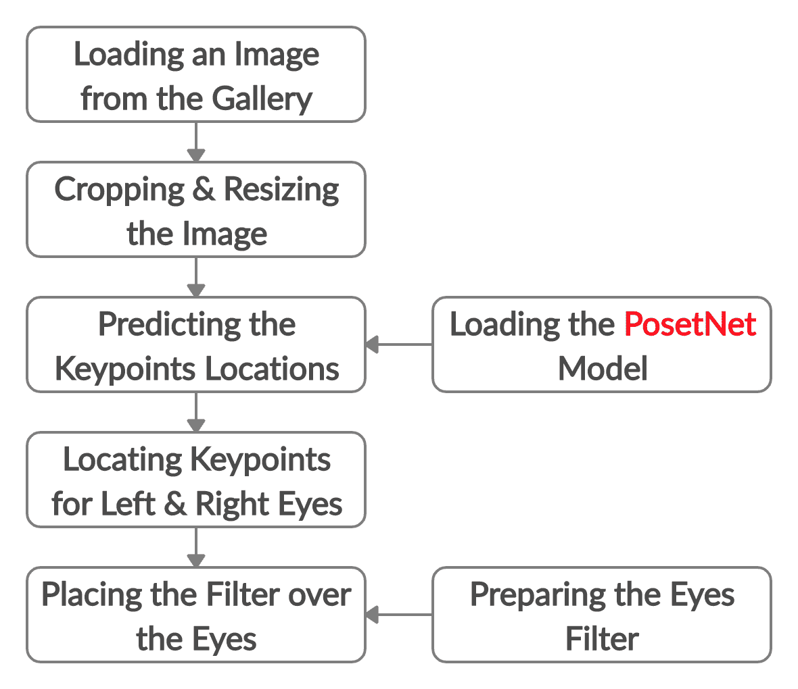

我们将从下载和准备过滤器图像开始。

## **准备眼部滤镜**

眼睛过滤器只是一个放在我们的目标图像上的图像。您可以使用任何您想要的滤镜图像，但是您需要遵循我们将在这里讨论的准备它的说明。

我们将使用的过滤器可以从[CleanPNG.com](https://www.cleanpng.com/png-eye-monster-mash-clip-art-monster-eyes-cliparts-924187/preview.html)下载。它不仅仅是一个单目过滤器，而是如下所示的九个不同潜在过滤器的集合。

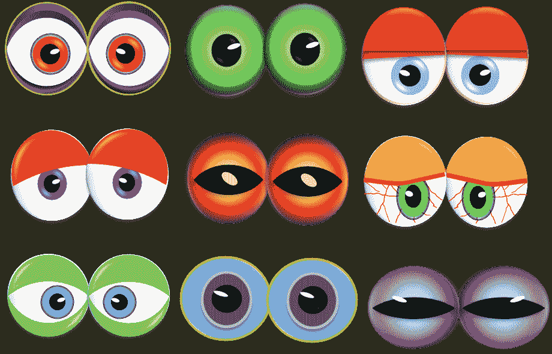

让我们从左上角开始。

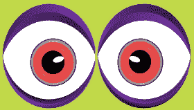

左眼和右眼看起来是相连的，所以为了方便起见，我们将它们分开。这是左眼:

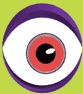

这是正确的:

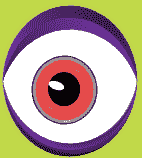

准备好过滤器后，我们将回顾如何定位由 PoseNet 模型返回的左眼和右眼的关键点。

## **定位左眼和右眼的关键点**

在之前教程中讨论的 Android Studio 项目中，活动`PosenetActivity.kt`有一个名为`processImage()`的方法，负责准备图库图像(即裁剪和调整大小)、预测关键点位置以及绘制它们的所有工作。它的实现如下所示。

```py
private fun processImage(bitmap: Bitmap) {
  // Crop bitmap.
  val croppedBitmap = cropBitmap(bitmap)

  // Created scaled version of bitmap for model input.
  val scaledBitmap = Bitmap.createScaledBitmap(croppedBitmap, MODEL_WIDTH, MODEL_HEIGHT, true)

  // Perform inference.
  val person = posenet.estimateSinglePose(scaledBitmap)

  // Draw keypoints over the image.
  val canvas = Canvas(scaledBitmap)
  draw(canvas, person, scaledBitmap)
}
```

对象`person`保存了关于检测到的关键点的信息，包括它们的位置、置信度得分以及它们所代表的身体部位。这个对象作为参数与画布和位图一起提供给了`draw()`方法。

这里是`draw()`方法在关键点位置画圆的最小代码。变量`MODEL_WIDTH`和`MODEL_HEIGHT`分别代表模型的输入宽度和高度。在 Android Studio 项目的`Constants.kt`文件中，两者都被赋予了值`257`。

```py
private fun draw(canvas: Canvas, person: Person, bitmap: Bitmap) {
    setPaint()

    val widthRatio = canvas.width.toFloat() / MODEL_WIDTH
    val heightRatio = canvas.height.toFloat() / MODEL_HEIGHT

    // Draw key points over the image.
    for (keyPoint in person.keyPoints) {
        if (keyPoint.score > minConfidence) {
            val position = keyPoint.position
            val adjustedX: Float = position.x.toFloat() * widthRatio
            val adjustedY: Float = position.y.toFloat() * heightRatio
            canvas.drawCircle(adjustedX, adjustedY, circleRadius, paint)
        }
    }
}
```

下图显示了绘制关键点后的图像。

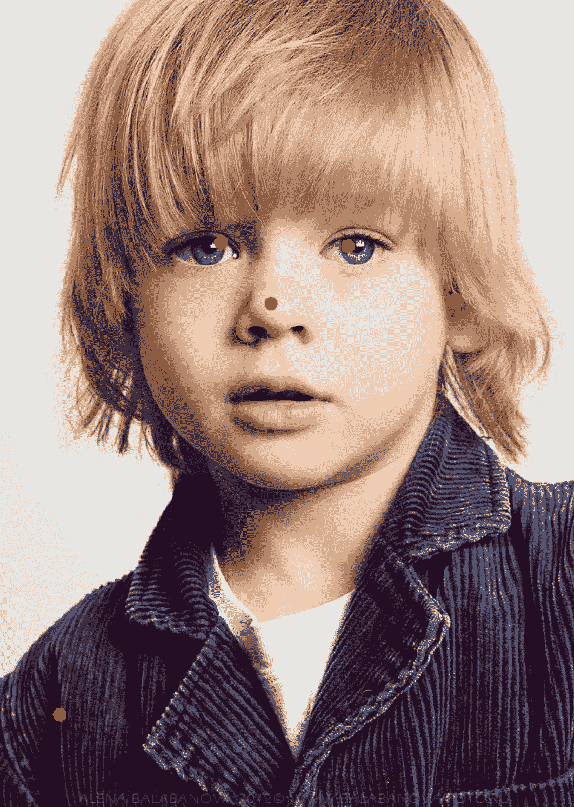

Source: [Fashion Kids](http://www.fkids.ru/). Image direct link is [here](http://static.fkids.ru/photo/2012/02/7985/Ilja-Belskii4140704.jpg).

从`person`对象中，我们可以检索模型返回的所有`17`关键点的以下信息:

1.  身体部位:`keyPoint.bodyPart`
2.  地点:`keyPoint.position.x`
3.  置信度:`keyPoint.position.y`

下一个`for`循环将此信息打印为日志消息。

```py
for (keyPoint in person.keyPoints) {
    Log.d("KEYPOINT", "Body Part : " + keyPoint.bodyPart + ", Keypoint Location : (" + keyPoint.position.x.toFloat().toString() + ", " + keyPoint.position.y.toFloat().toString() + "), Confidence" + keyPoint.score);
}
```

我们对所有的关键点都不感兴趣，只对眼睛感兴趣。在这个循环中，我们可以使用下面的`if`语句来检查左眼:

```py
if (keyPoint.bodyPart == BodyPart.LEFT_EYE) {
}
```

然后是右眼。

```py
if (keyPoint.bodyPart == BodyPart.RIGHT_EYE) {
}
```

注意，前面两个`if`语句只是检查身体部分，忽略了置信度得分。下面的代码也考虑了置信度得分。请注意，`minConfidence`变量在`PosenetActivity.kt`中定义，其值为`0.5`，这意味着关键点必须具有`0.5`或更高的置信度才能被接受。

```py
for (keyPoint in person.keyPoints) {
    if (keyPoint.bodyPart == BodyPart.LEFT_EYE && keyPoint.score > minConfidence) {
    }

    if (keyPoint.bodyPart == BodyPart.RIGHT_EYE && keyPoint.score > minConfidence) {
    }
}
```

现在我们可以定位眼睛，我们将看到如何加载过滤器。

## **加载并绘制眼图滤镜**

两只眼睛的滤镜将作为资源图像添加到 Android Studio 项目中。只需复制两张图片并粘贴到项目的`drawable`文件夹中。为了方便定位图像，选择`Android`视图，然后导航到`app/res/drawable`目录，如下图所示。在我的例子中，我将这两个图像命名为`left.png`和`right.png`。

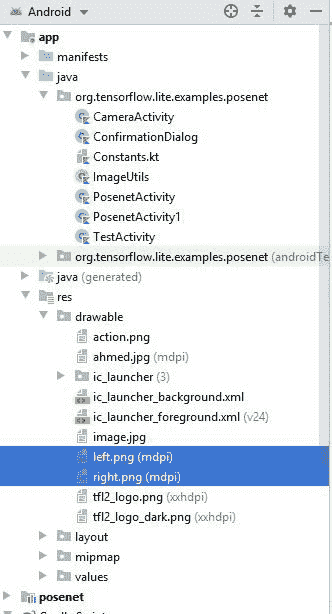

下一行使用`decodeResource()`方法加载图像。要加载左眼滤镜，只需将当前 ID `R.drawable.right`替换为`R.drawable.left`。记得根据您为两个图像选择的名称替换单词`right`和`left`。

```py
var filterImage = BitmapFactory.decodeResource(context?.getResources(), R.drawable.right)
```

加载左眼和右眼滤镜后，在将它们绘制到图像上之前，我们需要调整它们的大小。下一行使用`Bitmap.createScaledBitmap()`方法将每个调整到`(100, 100)`。

```py
filterImage = Bitmap.createScaledBitmap(filterImage, 100, 100, true)
```

最后，根据下面的代码在画布上绘制过滤器。从`x`和`y`坐标中减去的值`50`用于将尺寸为`(100, 100)`的滤光器置于眼睛的中心。

```py
canvas.drawBitmap(
    filterImage,
    keyPoint.position.x.toFloat() * widthRatio - 50,
    keyPoint.position.y.toFloat() * heightRatio - 50,
    null
)
```

我们现在已经在图像上加载、调整和绘制了滤镜。下面列出了`draw()`方法的完整实现，包括`if`语句。

```py
private fun draw(canvas: Canvas, person: Person, bitmap: Bitmap) {
    setPaint()

    val widthRatio = canvas.width.toFloat() / MODEL_WIDTH
    val heightRatio = canvas.height.toFloat() / MODEL_HEIGHT

    // Draw key points over the image.
    for (keyPoint in person.keyPoints) {
        if (keyPoint.bodyPart == BodyPart.LEFT_EYE) {
            var filterImage = BitmapFactory.decodeResource(context?.getResources(), R.drawable.left)
            filterImage = Bitmap.createScaledBitmap(filterImage, 100, 100, true)
            canvas.drawBitmap(
                filterImage,
                keyPoint.position.x.toFloat() * widthRatio - 50,
                keyPoint.position.y.toFloat() * heightRatio - 50,
                null
             )
         }

         if (keyPoint.bodyPart == BodyPart.RIGHT_EYE) {
             var filterImage = BitmapFactory.decodeResource(context?.getResources(), R.drawable.right)
             filterImage = Bitmap.createScaledBitmap(filterImage, 100, 100, true)
             canvas.drawBitmap(
                 filterImage,
                 keyPoint.position.x.toFloat() * widthRatio - 50,
                 keyPoint.position.y.toFloat() * heightRatio - 50,
                 null
             )
        }
    }
}
```

下图显示了滤镜如何查看图像。结果看起来相当不错。

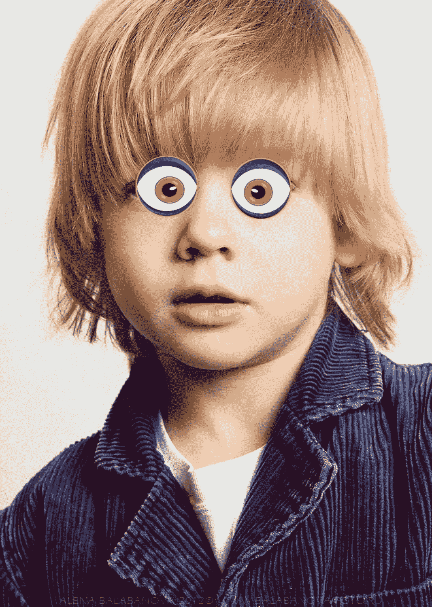

让我们用下面的图片再试一次。


Source: [Fashion Kids](http://www.fkids.ru/profiles/7985.html). Direct link to the image is [here](http://static.fkids.ru/photo/2012/02/7985/Ilja-Belskii8520393.jpg)..

下图显示了如何应用过滤器。在这种情况下，过滤器太大了。

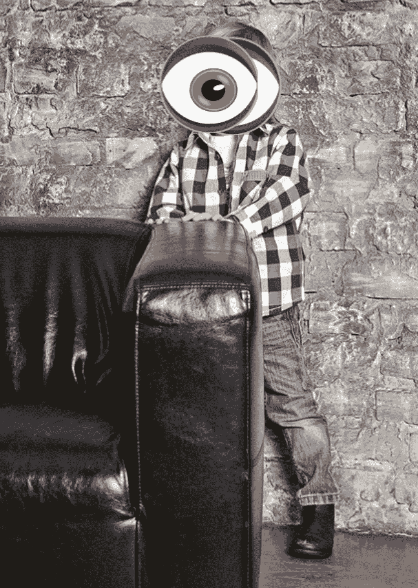

问题是滤镜的大小永远是`(100, 100)`，与眼睛大小无关。在某些情况下，就像上图中的一个，眼睛可能远离相机，因此它们的尺寸远小于`(100, 100)`。因此，滤镜不仅覆盖眼睛，还可能覆盖整张脸。

我们将在下一节通过根据两眼之间的距离调整眼睛滤镜的大小来解决这个问题。

## **动态设置眼睛滤镜大小**

为了相对于眼睛大小来调整过滤器图像的大小，两只眼睛的`X`位置将被保存到一个数组中。下一行创建了一个名为`eyesXLocation`的数组来保存眼睛的`X`位置。

```py
var eyesXLocation = FloatArray(2)
```

使用下面给出的`for`循环，与两只眼睛相关的两个关键点的`X`位置将被提取并保存到数组中。

```py
for (keyPoint in person.keyPoints) {
    if (keyPoint.bodyPart == BodyPart.LEFT_EYE) {
        eyesXLocation[0] = keyPoint.position.x.toFloat() * widthRatio
    }

    if (keyPoint.bodyPart == BodyPart.RIGHT_EYE) {
        eyesXLocation[1] = keyPoint.position.x.toFloat() * widthRatio
    }
}
```

基于存储在`eyesXLocation`数组中的值，将根据下一行计算两眼之间的水平绝对距离。

```py
var eyeFilterSize = abs(eyesXLocation[1] - eyesXLocation[0])
```

下一张图应该有助于阐明距离是如何计算的。关键点位置用红色圆圈标记。关键点之间的距离是连接它们的红线的长度。如果线的长度是`L`，那么眼睛过滤器的尺寸将是`(L, L)`。在这里，`L`是变量`eyeFilterSize`。每个眼睛过滤器以关键点为中心。

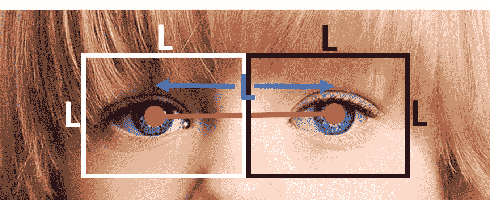

`eyeFilterSize`中的值将被提供给`Bitmap.createScaledBitmap()`方法，以调整加载的过滤器图像的大小，如下所示。

```py
filterImage = Bitmap.createScaledBitmap(
    filterImage,
    eyeFilterSize.toInt(),
    eyeFilterSize.toInt(),
    true
)
```

下面显示了`draw()`方法的新实现。

```py
private fun draw(canvas: Canvas, person: Person, bitmap: Bitmap) {
    setPaint()

    val widthRatio = canvas.width.toFloat() / MODEL_WIDTH
    val heightRatio = canvas.height.toFloat() / MODEL_HEIGHT

    var eyesXLocation = FloatArray(2)
    for (keyPoint in person.keyPoints) {
        if (keyPoint.bodyPart == BodyPart.LEFT_EYE) {
            eyesXLocation[0] = keyPoint.position.x.toFloat() * widthRatio
        }

        if (keyPoint.bodyPart == BodyPart.RIGHT_EYE) {
            eyesXLocation[2] = keyPoint.position.x.toFloat() * widthRatio
        }
    }

    var eyeFilterSize = abs(eyesXLocation[1] - eyesXLocation[0])

    // Draw key points over the image.
    for (keyPoint in person.keyPoints) {
        if (keyPoint.bodyPart == BodyPart.LEFT_EYE) {
            var filterImage = BitmapFactory.decodeResource(context?.getResources(), R.drawable.left)
            filterImage = Bitmap.createScaledBitmap(
                filterImage,
                eyeFilterSize.toInt(),
                eyeFilterSize.toInt(),
                true
            )
            canvas.drawBitmap(
                filterImage,
                keyPoint.position.x.toFloat() * widthRatio - eyeFilterSize / 2,
                keyPoint.position.y.toFloat() * heightRatio - eyeFilterSize / 2,
                null
            )
        }

        if (keyPoint.bodyPart == BodyPart.RIGHT_EYE) {
            var filterImage = BitmapFactory.decodeResource(context?.getResources(), R.drawable.right)
            filterImage = Bitmap.createScaledBitmap(
                filterImage,
                eyeFilterSize.toInt(),
                eyeFilterSize.toInt(),
                true
            )
            canvas.drawBitmap(
                filterImage,
                keyPoint.position.x.toFloat() * widthRatio - eyeFilterSize / 2,
                keyPoint.position.y.toFloat() * heightRatio - eyeFilterSize / 2,
                null
            )
        }
    }
}
```

这是用之前的图片测试应用程序的结果。过滤器的大小现在更适合眼睛的大小。

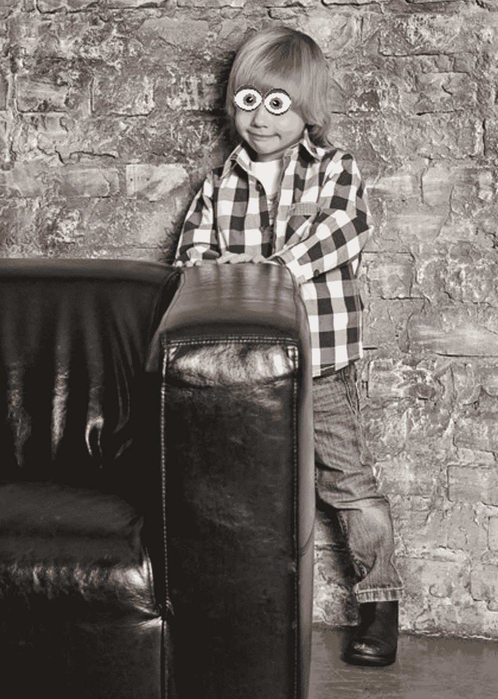

注意，基于眼睛关键点之间的距离动态计算过滤器尺寸也有助于使过滤器完全覆盖眼睛。这可以在下图中看到。

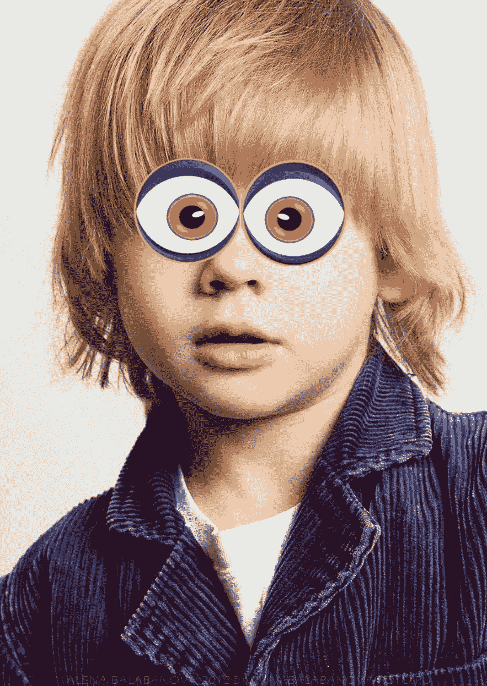

现在，我们可以自动调整任何过滤器，以适应图像。在我们结束教程之前，让我们看看如何使用其他眼睛过滤器。

## **使用不同的眼睛过滤器**

我们可以很容易地改变我们使用的过滤器。您需要做的就是将图像作为资源文件添加到 Android Studio 项目中，并将其加载到`draw()`方法中。让我们使用下面的心脏图像代替前面的过滤器。

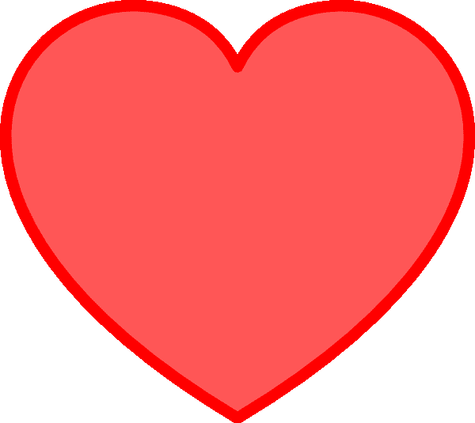

Image source: [Clipart Library](http://clipart-library.com/clipart/di9Krgb4T.htm). The direct link of the image is [here](http://clipart-library.cimg/di9Krgb4T.png).

下载完图片后，只需按照下图将其作为可绘制资源添加到 Android Studio 项目中即可。我将资源文件命名为`heart.png`。

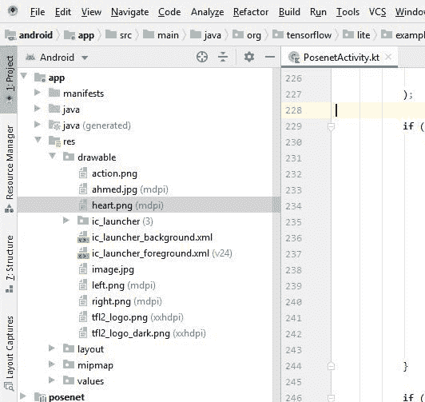

现在，根据下一行，我们将使用`draw()`方法来加载它，以代替前面的过滤器。

```py
var filterImage = BitmapFactory.decodeResource(context?.getResources(), R.drawable.heart)
```

如果您想使用另一个过滤器，只需将其作为资源添加，并将其 ID 提供给`decodeResource()`方法。

下图显示了使用心脏过滤器后的结果。

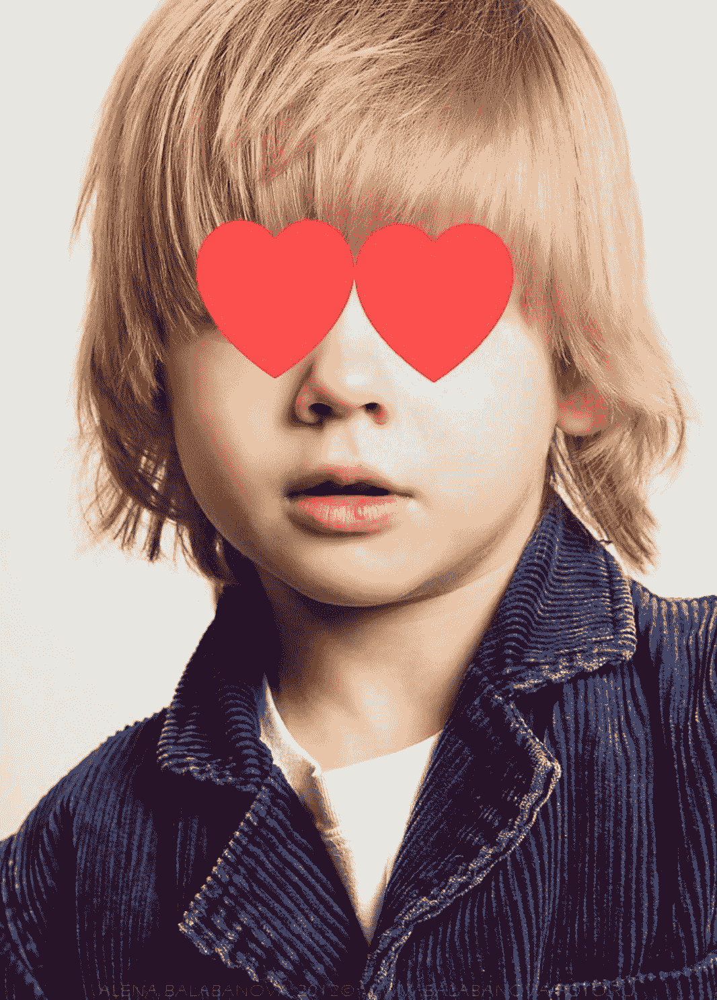

## **完成`PosenetActivity.kt`的实施**

下面列出了`PosenetActivity.kt`的完整代码。你也可以在这里下载项目[。](https://drive.google.com/file/d/1-h4Y2eqDZ77aCiTmzEACdpR_UxuSC_0b/view?usp=sharing)

```py
package org.tensorflow.lite.examples.posenet

import android.app.Activity
import android.app.AlertDialog
import android.app.Dialog
import android.content.Intent
import android.content.pm.PackageManager
import android.graphics.*
import android.os.Bundle
import android.support.v4.app.ActivityCompat
import android.support.v4.app.DialogFragment
import android.support.v4.app.Fragment
import android.util.Log
import android.util.SparseIntArray
import android.view.LayoutInflater
import android.view.Surface
import android.view.View
import android.view.ViewGroup
import android.widget.Toast
import kotlinx.android.synthetic.main.activity_posenet.*
import kotlin.math.abs
import org.tensorflow.lite.examples.posenet.lib.BodyPart
import org.tensorflow.lite.examples.posenet.lib.Person
import org.tensorflow.lite.examples.posenet.lib.Posenet
import android.provider.MediaStore
import android.graphics.Bitmap

class PosenetActivity :
    Fragment(),
    ActivityCompat.OnRequestPermissionsResultCallback {

    val REQUEST_CODE = 100

    /** Threshold for confidence score. */
    private val minConfidence = 0.5

    /** Radius of circle used to draw keypoints.  */
    private val circleRadius = 8.0f

    /** Paint class holds the style and color information to draw geometries,text and bitmaps. */
    private var paint = Paint()

    /** An object for the Posenet library.    */
    private lateinit var posenet: Posenet

    override fun onCreateView(
        inflater: LayoutInflater,
        container: ViewGroup?,
        savedInstanceState: Bundle?
    ): View? = inflater.inflate(R.layout.activity_posenet, container, false)

    override fun onStart() {
        super.onStart()

        posenet = Posenet(this.context!!)

        selectImage.setOnClickListener(View.OnClickListener {
            val intent = Intent(Intent.ACTION_PICK)
            intent.type = "image/jpg"
            startActivityForResult(intent, REQUEST_CODE)
        })
    }

    override fun onActivityResult(requestCode: Int, resultCode: Int, data: Intent?) {
        if (resultCode == Activity.RESULT_OK && requestCode == REQUEST_CODE) {
            imageView.setImageURI(data?.data) // handle chosen image

            val imageUri = data?.getData()
            val bitmap = MediaStore.Images.Media.getBitmap(context?.contentResolver, imageUri)

            processImage(bitmap)
        } else {
            Toast.makeText(context, "No image is selected.", Toast.LENGTH_LONG).show()
        }
    }

    override fun onDestroy() {
        super.onDestroy()
        posenet.close()
    }

    override fun onRequestPermissionsResult(
        requestCode: Int,
        permissions: Array<String>,
        grantResults: IntArray
    ) {
        if (requestCode == REQUEST_CAMERA_PERMISSION) {
            if (allPermissionsGranted(grantResults)) {
                ErrorDialog.newInstance(getString(R.string.request_permission))
                    .show(childFragmentManager, FRAGMENT_DIALOG)
            }
        } else {
            super.onRequestPermissionsResult(requestCode, permissions, grantResults)
        }
    }

    private fun allPermissionsGranted(grantResults: IntArray) = grantResults.all {
        it == PackageManager.PERMISSION_GRANTED
    }

    /** Crop Bitmap to maintain aspect ratio of model input.   */
    private fun cropBitmap(bitmap: Bitmap): Bitmap {
        val bitmapRatio = bitmap.height.toFloat() / bitmap.width
        val modelInputRatio = MODEL_HEIGHT.toFloat() / MODEL_WIDTH
        var croppedBitmap = bitmap

        // Acceptable difference between the modelInputRatio and bitmapRatio to skip cropping.
        val maxDifference = 1e-5

        // Checks if the bitmap has similar aspect ratio as the required model input.
        when {
            abs(modelInputRatio - bitmapRatio) < maxDifference -> return croppedBitmap
            modelInputRatio < bitmapRatio -> {
                // New image is taller so we are height constrained.
                val cropHeight = bitmap.height - (bitmap.width.toFloat() / modelInputRatio)
                croppedBitmap = Bitmap.createBitmap(
                    bitmap,
                    0,
                    (cropHeight / 5).toInt(),
                    bitmap.width,
                    (bitmap.height - cropHeight / 5).toInt()
                )
            }
            else -> {
                val cropWidth = bitmap.width - (bitmap.height.toFloat() * modelInputRatio)
                croppedBitmap = Bitmap.createBitmap(
                    bitmap,
                    (cropWidth / 5).toInt(),
                    0,
                    (bitmap.width - cropWidth / 5).toInt(),
                    bitmap.height
                )
            }
        }
        Log.d(
            "IMGSIZE",
            "Cropped Image Size (" + croppedBitmap.width.toString() + ", " + croppedBitmap.height.toString() + ")"
        )
        return croppedBitmap
    }

    /** Set the paint color and size.    */
    private fun setPaint() {
        paint.color = Color.RED
        paint.textSize = 80.0f
        paint.strokeWidth = 5.0f
    }

    private fun draw(canvas: Canvas, person: Person, bitmap: Bitmap) {
        setPaint()

        val widthRatio = canvas.width.toFloat() / MODEL_WIDTH
        val heightRatio = canvas.height.toFloat() / MODEL_HEIGHT

        var eyesXLocation = FloatArray(2)
        for (keyPoint in person.keyPoints) {
            if (keyPoint.bodyPart == BodyPart.LEFT_EYE) {
                eyesXLocation[0] = keyPoint.position.x.toFloat() * widthRatio
            }

            if (keyPoint.bodyPart == BodyPart.RIGHT_EYE) {
                eyesXLocation[2] = keyPoint.position.x.toFloat() * widthRatio
            }
        }

        var eyeFilterSize = abs(eyesXLocation[1] - eyesXLocation[0])

        // Draw key points over the image.
        for (keyPoint in person.keyPoints) {
            if (keyPoint.bodyPart == BodyPart.LEFT_EYE) {
                var filterImage = BitmapFactory.decodeResource(context?.getResources(), R.drawable.left)
                filterImage = Bitmap.createScaledBitmap(
                    filterImage,
                    eyeFilterSize.toInt(),
                    eyeFilterSize.toInt(),
                    true
                )
                canvas.drawBitmap(
                    filterImage,
                    keyPoint.position.x.toFloat() * widthRatio - eyeFilterSize / 2,
                    keyPoint.position.y.toFloat() * heightRatio - eyeFilterSize / 2,
                    null
                )
            }

            if (keyPoint.bodyPart == BodyPart.RIGHT_EYE) {
                var filterImage = BitmapFactory.decodeResource(context?.getResources(), R.drawable.right)
                filterImage = Bitmap.createScaledBitmap(
                    filterImage,
                    eyeFilterSize.toInt(),
                    eyeFilterSize.toInt(),
                    true
                )
                canvas.drawBitmap(
                    filterImage,
                    keyPoint.position.x.toFloat() * widthRatio - eyeFilterSize / 2,
                    keyPoint.position.y.toFloat() * heightRatio - eyeFilterSize / 2,
                    null
                )
            }
        }
    }

    /** Process image using Posenet library.   */
    private fun processImage(bitmap: Bitmap) {
        // Crop bitmap.
        val croppedBitmap = cropBitmap(bitmap)

        // Created scaled version of bitmap for model input.
        val scaledBitmap = Bitmap.createScaledBitmap(croppedBitmap, MODEL_WIDTH, MODEL_HEIGHT, true)
        Log.d(
            "IMGSIZE",
            "Cropped Image Size (" + scaledBitmap.width.toString() + ", " + scaledBitmap.height.toString() + ")"
        )

        // Perform inference.
        val person = posenet.estimateSinglePose(scaledBitmap)

        // Making the bitmap image mutable to enable drawing over it inside the canvas.
        val workingBitmap = Bitmap.createBitmap(croppedBitmap)
        val mutableBitmap = workingBitmap.copy(Bitmap.Config.ARGB_8888, true)

        // There is an ImageView. Over it, a bitmap image is drawn. There is a canvas associated with the bitmap image to draw the keypoints.
        // ImageView ==> Bitmap Image ==> Canvas

        val canvas = Canvas(mutableBitmap)

        draw(canvas, person, mutableBitmap)
    }

    /**
     * Shows an error message dialog.
     */
    class ErrorDialog : DialogFragment() {

        override fun onCreateDialog(savedInstanceState: Bundle?): Dialog =
            AlertDialog.Builder(activity)
                .setMessage(arguments!!.getString(ARG_MESSAGE))
                .setPositiveButton(android.R.string.ok) { _, _ -> activity!!.finish() }
                .create()

        companion object {

            @JvmStatic
            private val ARG_MESSAGE = "message"

            @JvmStatic
            fun newInstance(message: String): ErrorDialog = ErrorDialog().apply {
                arguments = Bundle().apply { putString(ARG_MESSAGE, message) }
            }
        }
    }

    companion object {
        /**
         * Conversion from screen rotation to JPEG orientation.
         */
        private val ORIENTATIONS = SparseIntArray()
        private val FRAGMENT_DIALOG = "dialog"

        init {
            ORIENTATIONS.append(Surface.ROTATION_0, 90)
            ORIENTATIONS.append(Surface.ROTATION_90, 0)
            ORIENTATIONS.append(Surface.ROTATION_180, 270)
            ORIENTATIONS.append(Surface.ROTATION_270, 180)
        }

        /**
         * Tag for the [Log].
         */
        private const val TAG = "PosenetActivity"
    }
}
```

## **结论**

本教程延续了上一教程中开始的项目，允许在图像上添加眼睛滤镜。

基于使用 PoseNet 深度学习模型检测到的关键点，可以定位左眼和右眼。在被定位之后，加载过滤器图像并准备在被检测的眼睛上绘制。

为了使过滤器图像的大小取决于眼睛的大小，计算两只眼睛之间的距离并用于调整过滤器的大小。