# 用数据和人工智能对抗新冠肺炎:活跃研究小组和数据集综述

> 原文：<https://blog.paperspace.com/fighting-covid-19-using-artificial-intelligence-and-data/>

经济已经停止了；人被隔离；工作停滞不前；政府担心这会变成公共健康危机。致命的冠状病毒(新型冠状病毒，或“冠状病毒疾病 2019”的新冠肺炎)正在快速传播。现在是 2020 年，但即使有最先进的技术，我们也无法阻止它。到目前为止，这里有超过 100 万的病例和 60，000 例死亡病例。正如人们所说，预防胜于治疗:是时候呆在家里照顾自己了。在这篇文章中，我们将看到人工智能如何帮助人们跟踪、控制和找到治疗新冠肺炎的方法。

在过去的十年里，我们在计算机科学和人工智能领域看到了大量的研究和积极的成果。数学和算法已经存在很长时间了；这种爆炸的真正原因是数据的可用性、更高的计算能力、开源工具和框架。从制造业和能源到医疗保健和教育，人工智能已经彻底改变了所有这些行业。

让我们从数据科学的角度出发，了解问题到底是什么。

## 问题——新冠肺炎！

2019 年 12 月底，中国卫生部门报告了武汉市大量急性呼吸综合征病例。2020 年 2 月 11 日，世界卫生组织(世卫组织)将这种病毒命名为新冠肺炎病毒。这种病毒通过感染者咳嗽、打喷嚏或说话时产生的呼吸道飞沫在密切接触的人之间传播。这些飞沫可以被吸入，落在嘴、眼睛或鼻子里，甚至通过触摸自己的脸被带到这些地方。通常报告的症状包括发烧、干咳和疲劳。在轻微的情况下，人们可能只是流鼻涕或喉咙痛。与此同时，世界各地的计算机科学家和机器学习研究人员一直在热情合作，广泛开展工作，以找到解决冠状病毒相关问题的方法，要么通过**汇编数据集，要么通过构建算法**从中学习。

目前还没有针对这种病毒的疗法或疫苗，但我们可以通过呆在家里、经常洗手/消毒以及避免去公共场所来阻止它的传播。如果你感到不适或生病，确保你自我隔离。

在下一部分，我们将看到不同的研究小组如何使用人工智能来解决这个问题。

## 基于人工智能的系统检测新冠肺炎

### 1.DAMO 研究院(阿里巴巴集团)在 CT 扫描中发现冠状病毒病例

2 月初，阿里巴巴研究院(DAMO 研究院)提出了一个基于人工智能的解决方案，可以在 20 秒内以 96%的准确率检测到新冠肺炎。该网络是一个深度计算机视觉模型，它将患者的 CT 扫描作为输入，并输出他们是否显示冠状病毒的迹象。该模型通过 5000 多个训练样本进行了微调，并部署在中国超过 26 家医院。到目前为止，它已经帮助诊断了超过 30，000 个病例[3]。

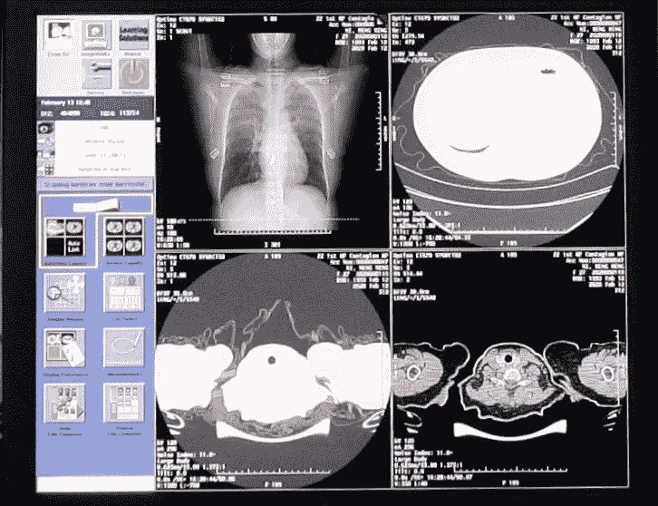

AI-Based Software developed by DAMO Academy [3]

同一个小组还开发了一个基于预训练模型的 NLP 解决方案，用于分析新冠肺炎的医疗报告以寻找治疗方法。他们的模型在 2020 年 3 月 3 日荣登 [GLUE 基准排名](https://gluebenchmark.com/leaderboard)榜首，这是一个被视为 NLP 相关任务最重要的基准测试的行业表格。它目前正被中国不同城市的 CDC 用于病历文本分析和流行病学调查[4]。

### 2.肺部感染量化

为了减少 CT 扫描的分析时间，研究人员建立了一个使用深度学习的系统来量化新冠肺炎引起的肺部感染[5]。核心思想是开发一个基于深度学习的模型，用于自动分割和量化受影响的区域，以及胸部 CT 扫描的整个肺部。

作者开发了一个名为 VB-NET 的网络，它是对 V-Net [6]的改进。他们声称，由于其特殊的瓶颈结构，他们提出的模型比原始的 V-NET 更快。下面是该建筑的图像。

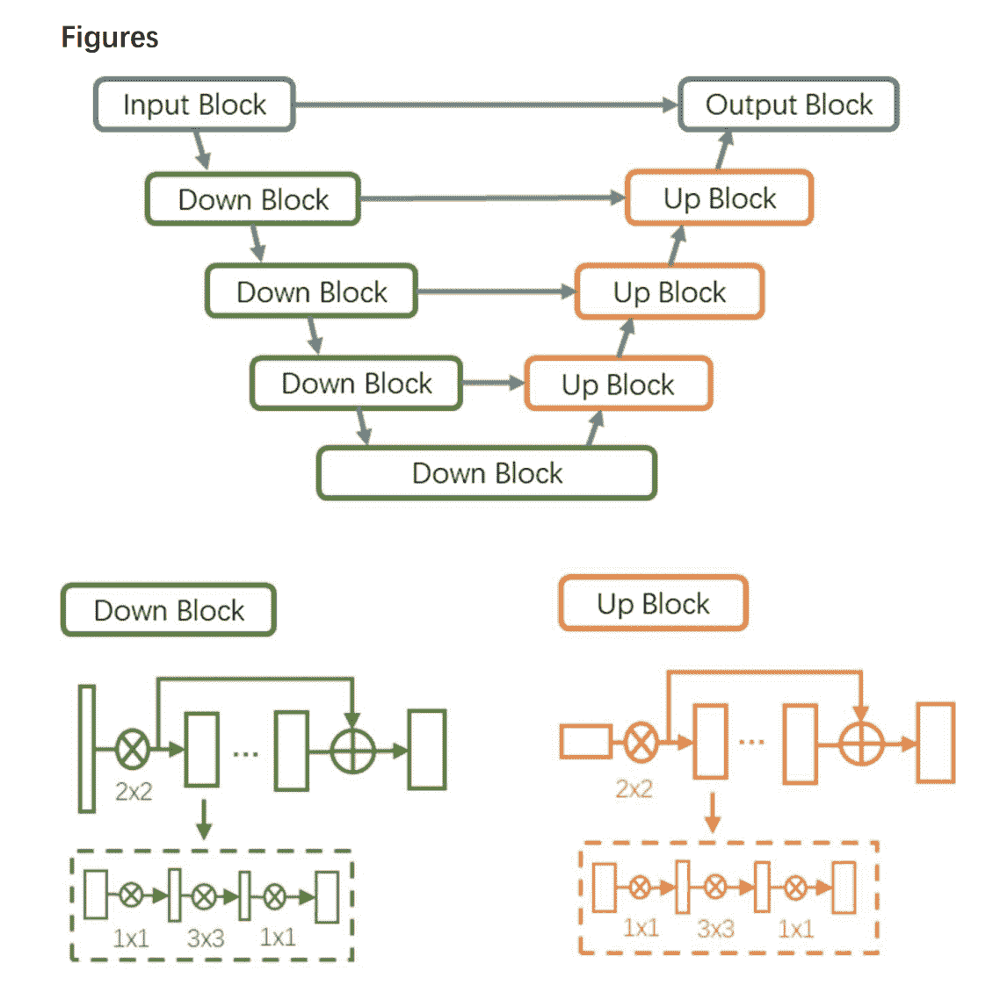

VB-Net Architecture [5]

如图所示，瓶颈架构是一个堆叠的三层结构。它使用(1 x 1 x 1 *)* 、(3 x 3 x 3)和(1 x 1 x 1)卷积核从图像中提取特征。为了训练这个网络，作者使用了一种叫做**人在回路策略**的特殊策略。在这种策略中，为了节省爆发期间放射科医生的时间，训练数据被分成几个批次:

1.  第一批包含由放射科医师手动绘制轮廓的 CT 数据。
2.  接下来，分割网络对该批次进行训练，并且创建初始模型。
3.  然后，将该初始模型应用于下一批中的分割感染区域，并且放射科医师手动校正由分割网络提供的分割结果。
4.  这些结果作为新的训练数据，增加了训练数据集以及网络的准确性。

该网络对 249 名新冠肺炎患者进行了训练，并使用 300 名新新冠肺炎患者进行了验证。为了评估结果，VB-Net 使用了**骰子相似系数** (DSC)和**皮尔逊相关系数**。这些指标在自动分割和手动分割之间产生了 91.6%±10.0%。

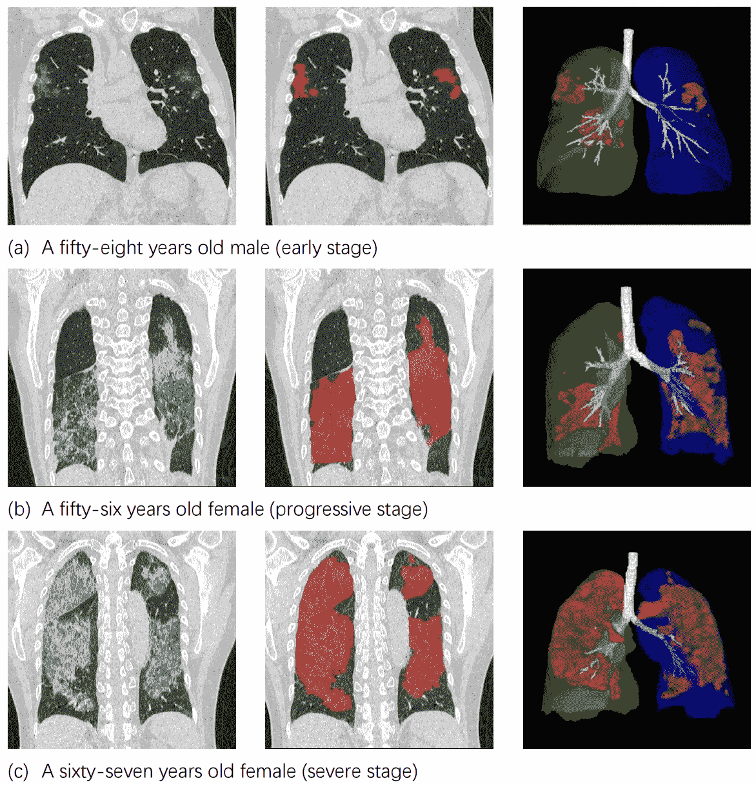

Results from VB-NET. In the last column the CT Images have the overlaid Segmentation, and a 3D surface rendering of segmented infections

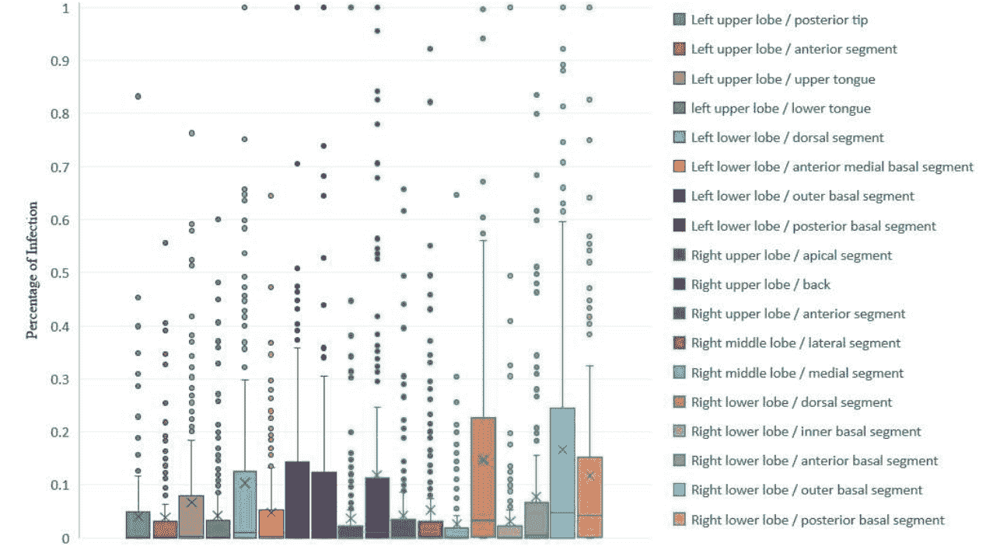

Results from VB-NET. The whisker plots of infected areas in bronchopulmonary segments

### 3.用于大规模筛查的异常呼吸模式分类

根据临床研究，已经观察到患有新冠肺炎的人具有不同的呼吸模式。注意到这一点，华东师范大学的研究人员与其他研究机构合作开发了一种基于深度学习的算法，可以根据呼吸特征帮助诊断、预后和筛查受感染的患者。

具有双向和注意力机制的 GRU 神经网络被用于使用深度相机对六种临床上显著的呼吸模式进行分类。这六种呼吸模式分别是:正常呼吸、呼吸急促、呼吸缓慢、Biots、Cheyne-Stokes 和中枢性呼吸暂停。

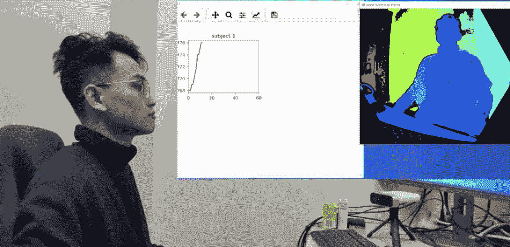

Real-Time Respiratory Patterns Classification for COVID-19 [7]

这项研究包括四个核心步骤:

1.  开发用于生成模拟数据的呼吸模拟模型。
2.  使用深度相机获取真实世界的数据。
3.  建立并验证双 GRU 模型。
4.  进行对比实验。

在第一步中，作者使用数学正弦波近似受试者的呼吸周期。由于呼吸是一个吸气和呼气的循环过程，它的图形形式通过波的上升和下降来反映。

在第二步中，为了记录受试者呼吸时的深度图像，Kinect v2 深度相机用于捕捉真实数据。选择了三个感兴趣的区域，即胸部、腹部和肩部，每次捕捉一分钟的特定呼吸模式。下图显示了如何通过相机捕捉数据。

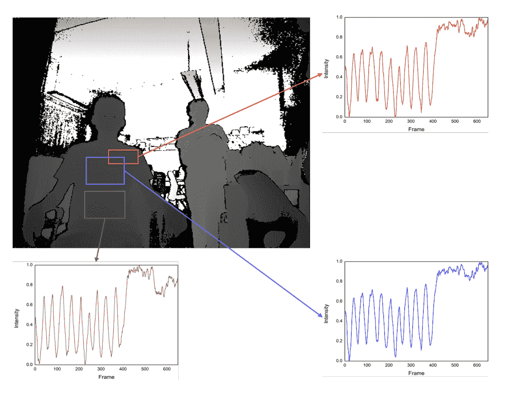

Actual Measured Central-Apnea Waveforms [7]

对于步骤 3 中的呼吸模式分类任务，作者使用了 BI-AT-gru。BI-AT-GRU 网络基本上是对 GRU 的改进，增加了双向和注意力机制。GRU 网络是 LSTM 的简化变体。为了让你有个概念，下面是网络设置的图像。

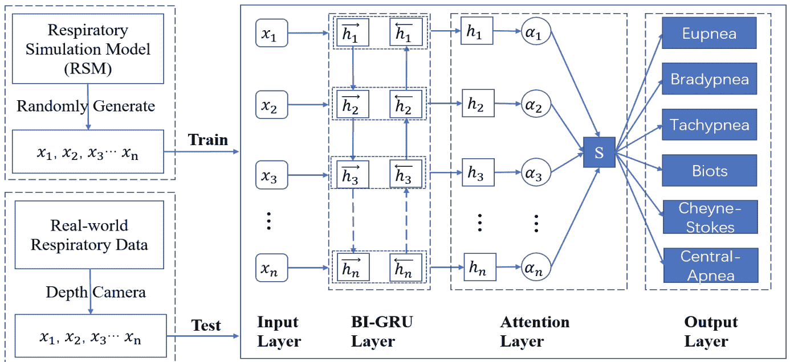

最后，结果表明，所提出的模型能够以 94.5%、94.4%、95.1%和 94.8%的准确度、精确度、召回率和 F1 分数对所提到的六种呼吸模式进行分类。

### 4.卷积神经网络用于新冠肺炎和肺炎筛查

卷积神经网络是识别不同图像中模式的简单技巧。为了加快中国的筛查过程，几个研究小组合作开发了一个基于 CNN 的深度学习模型，以通过 CT 扫描识别早期新冠肺炎。为了进行这项研究，总共收集了 618 次肺部 CT 扫描。

下图解释了从输入到输出的管道。

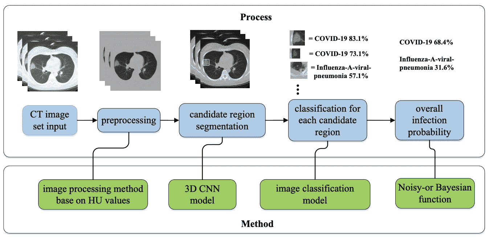

为了确定 CT 扫描中感染的位置，作者研究了新冠肺炎的几个特征，包括:

1.  毛玻璃外观
2.  显著的周边分布
3.  不止一个独立的感染病灶

基于不同感染的外观和产生的结构，图像分类模型应该能够区分疾病。

网络结构由两个 3d CNN 分类模型组成。第一种是用于特征提取的经典 ResNet-18 网络。接下来，使用一些池操作来降低数据的维度，以防止过度拟合并提高泛化能力。最后，三个完全连接的层输出最终的分类结果，以及置信度得分。训练是在与 NVIDIA GeForce GTX 1080 Ti 连接的英特尔 i7-8700k CPU 上进行的。用一个共同的**交叉熵**损失函数对网络进行 1000 次迭代训练。下面是 CNN 架构的图像。

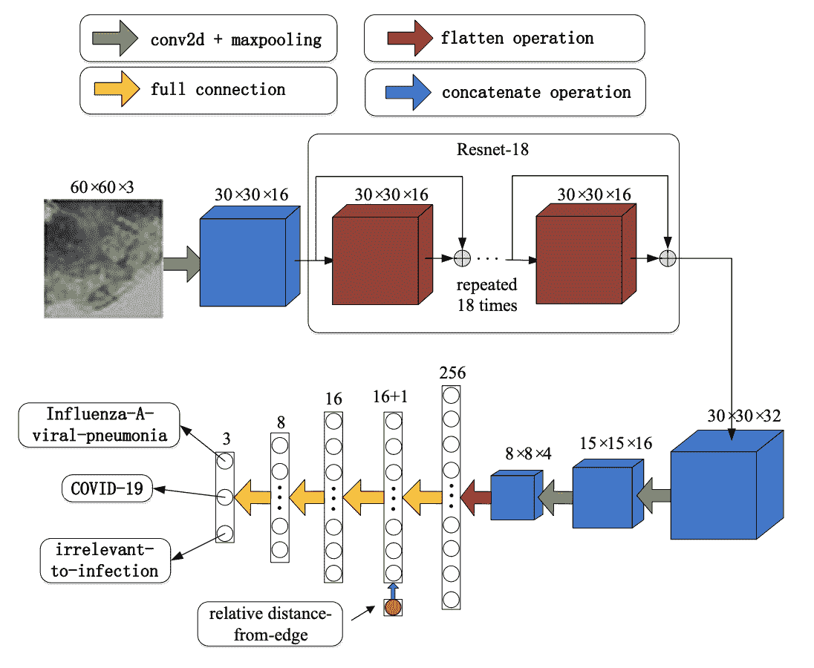

Network structure of the location-attention oriented model

该模型能够以 86.7 %的准确率识别早期阶段的新冠肺炎[8]。

### 5.使用深度学习进行 CT 图像分析的新冠肺炎识别和患者监测

这项研究主要由位于波士顿的 RADLogics 公司与世界各地的许多其他研究小组合作进行。主要目的是建立一种基于人工智能的自动化 CT 图像分析工具，可以在冠状病毒阳性患者的检测中实现高精度，并在整个治疗过程中对他们进行监控。这项研究通过对由感染引起的体积和直径(来自 ct 扫描)方面的较小混浊进行定量测量，为患者提供了及时的分析。他们还提出了一种“**电晕评分**”来连续测量疾病随时间的进展。

以下是他们检测病毒的步骤:

*   首先，使用在 6，150 幅图像上训练的 U-Net 架构分割 CT 扫描的肺部区域。
*   接下来，使用在 ImageNet 数据集上预先训练的 Resnet-50-2D 卷积网络，从分割的肺图像中检测新冠肺炎相关异常。
*   为了将一个病例标记为阳性，首先，计算阳性检测的切片在肺的总切片中的比率(“阳性比率”)。接下来，如果正比率超过预定义的阈值，则做出肯定的情况判定。
*   在该病例被检测为阳性后，作者建议对结节状和局灶性弥漫性不透明进行 3D 分析(以下以绿色和红色显示)。
*   最后，作者使用了一个异常定位步骤，其中产生网络激活图。Grad-CAM 技术用于创建更合适的可视化效果。

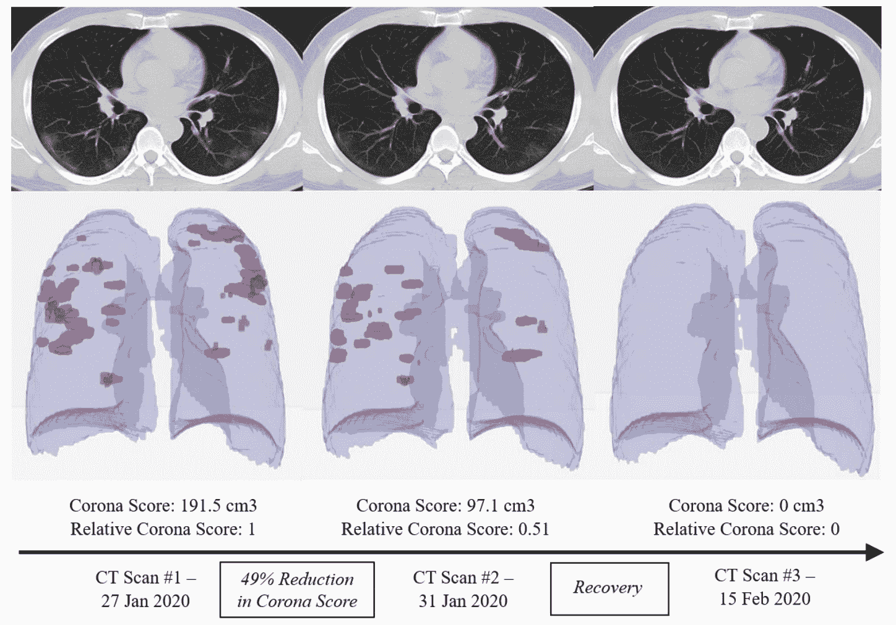

Monitoring COVID-19 in a patient over time

在中国对照和感染患者的数据集上，训练的网络的结果是 0.996 AUC (95%CI: 0.989-1.00)。他们报道了两个可能的工作点:98.2%的敏感性和 92.2%的特异性(高敏感性点)，或 96.4%的敏感性和 98%的特异性(高特异性点)。可以在这里找到原论文[。](https://arxiv.org/pdf/2003.05037.pdf)

### 6.新冠肺炎药物筛选

人工智能不仅可用于诊断冠状病毒，还可用于筛选药物。中国的几个研究小组合作研究深度学习如何比传统方法更快地找到药物。

在研究了可从 [GISAID 数据库](https://www.gisaid.org/)获得的 RNA 序列后，作者得出结论，新冠肺炎与 SARS-CoV-1 高度同源。他们通过将 RNA 序列翻译成蛋白质序列，然后使用同源建模(比较蛋白质并构建它们的原子分辨率)建立 3D 蛋白质模型，找到了这种同源性。使用 DFCNN(深度完全卷积神经网络)来识别和排列蛋白质-配体相互作用，以快速进行虚拟筛选，因为不需要对接或分子动力学模拟。为了澄清，分子动态模拟是指用于分析原子和分子的物理运动的计算机模拟方法；对接是指有意移除零件以进行分析。利用这些技术*，*，作者能够通过对四个化合物数据库进行药物筛选来确定治疗新冠肺炎的潜在药物。

提议的 DFCNN 架构在来自 [PDBbind 数据库](http://www.pdbbind.org.cn/)的蛋白质-配体数据集上进行训练。该模型能够预测三种得分高于 0.997 的潜在药物，以及三种得分高于 0.99 的药物。

下面是整体工作流程的截图。

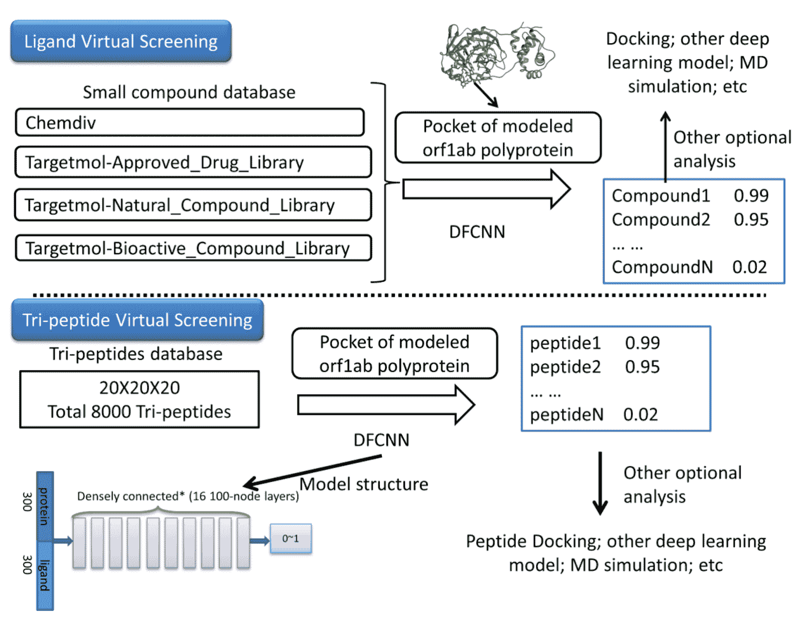

The workflow of virtual screening of chemical compounds for COVID-19 proposed by [Haiping Zhang](https://sciprofiles.com/profile/973672) and team.

### 7.用α折叠进行蛋白质结构的计算预测

DeepMind 是全球顶尖的研究公司之一。2019 年 4 月 2 日，他们向《自然》杂志提交了他们关于“利用深度学习的潜力改进蛋白质结构预测”的研究。2019 年 12 月被接受并出版。2020 年 1 月 15 日，他们在一篇名为 **AlphaFold:使用人工智能进行科学发现**的博客文章中回顾了这项研究，该研究目前正在帮助识别与新冠肺炎相关的蛋白质结构。

这项研究主要解决蛋白质折叠的问题。你可以把蛋白质想象成复杂的大分子。它们的三维结构随着它们执行不同的操作而改变。作者给了我们一个例子，说明为什么识别蛋白质的结构是至关重要的。下面是文章中的几行文字:

> 我们的免疫系统所利用的抗体蛋白呈“Y 形”,并形成独特的钩子。通过锁定病毒和细菌，这些抗体蛋白可以检测并标记致病微生物，以将其清除。**【11】**

**这解释了为什么蛋白质折叠对我们至关重要。但是我们怎么做呢？深度学习在哪里起作用？我们来分析一下。这种蛋白质是通常在 DNA 中编码的氨基酸的组合。但是 DNA 不包含关于蛋白质结构的信息。使用传统技术，在达到真正的三维结构之前，需要花费很长时间来计算一个典型蛋白质的所有可能构型。**

**那么我们如何从复杂的蛋白质序列中解读三维结构呢？五十年前，这些是通过使用显微镜和 X 射线人工确定的，这涉及到大量的反复试验。但是有了像 AlphaFold 这样的深度学习和研究，我们现在可以更容易地识别蛋白质的三维结构。**

**Alphafold 的工作分为两个阶段。在第一阶段，使用标准生物学技术，通过重复替换现有蛋白质片段来产生新的蛋白质片段。这些结构在生成式对抗性神经网络(GAN)的帮助下不断得到改进。GAN 输出的蛋白质结构具有两种特性:**

1.  **氨基酸对之间的距离**
2.  **连接这些氨基酸的化学键之间的角度**

**在第二阶段，通过梯度下降算法改进距离和角度，直到它们达到最佳分数。下面是 AlphaFold 整个工作流程的图片。**

**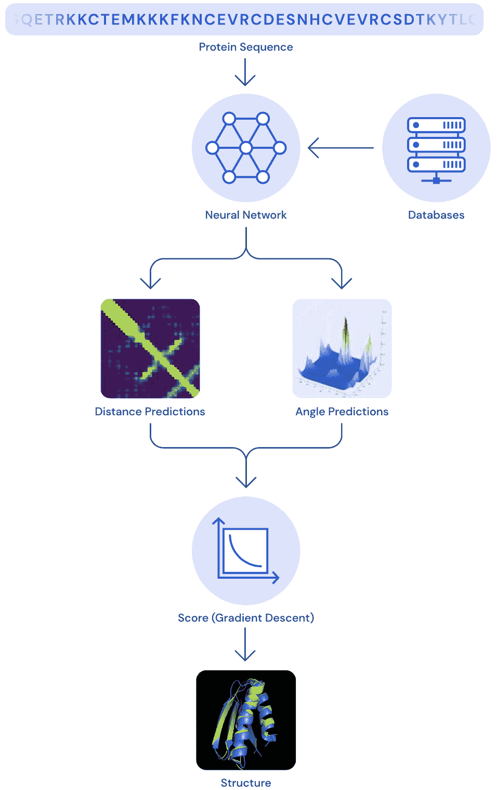

Working of AlphaFold [12]** 

**同一个团队使用 AlphaFold 系统预测了 3D 新冠肺炎蛋白质结构。用来理解新冠肺炎的先决条件数据是从一个开放存取的数据库中收集的。然而，作者引用说，这并没有得到实验验证。但它有助于研究病毒是如何发挥作用的。下面是预测的 3D 渲染的 SARS-COV-2 膜蛋白的图像:**

**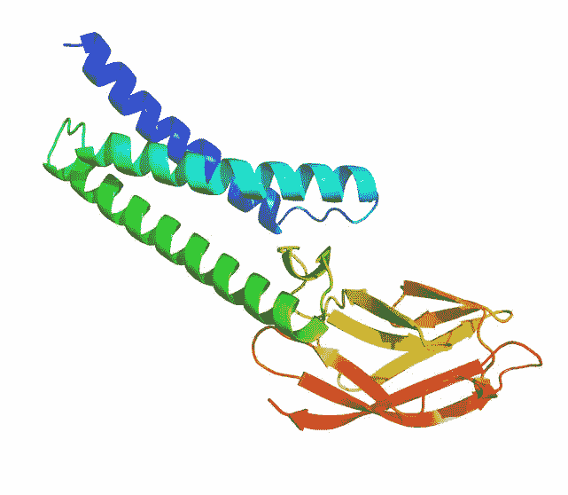

Rendering of COVID-19 Protein Membrane [12]** 

### **8.重度新冠肺炎患者的危险度预测**

**在这项研究中，作者提出了基于三个指标的预后预测模型，这些模型将预测死亡风险和识别危重病例的临床途径。作者使用了 2779 份电子病历，包括他们在 2020 年 1 月 10 日至 2 月 18 日在中国武汉同济医院的医疗状况。**

**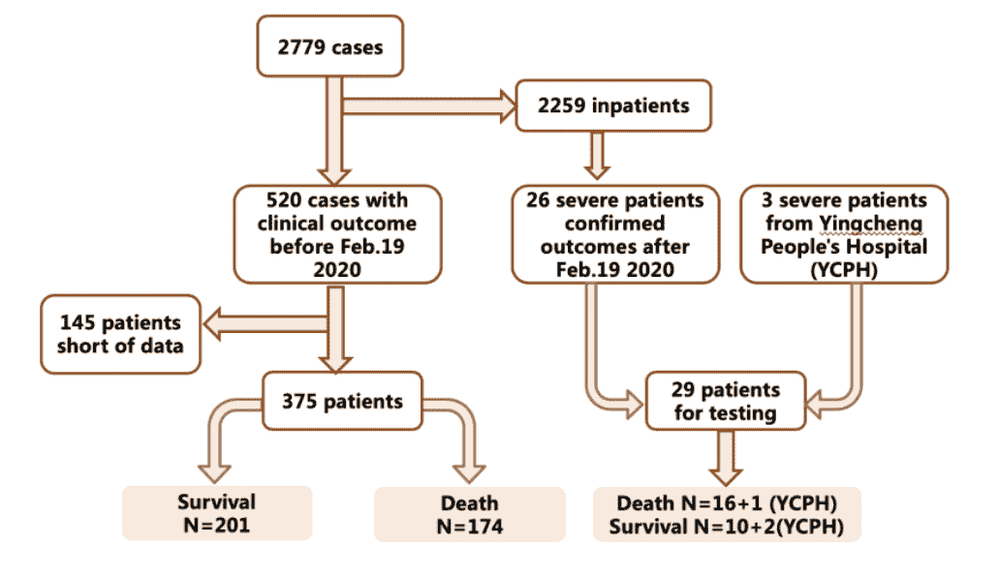

Image explaining how the patients are enrolled and classified [10]** 

**构建这个机器学习模型包括以下三个步骤:**

1.  **数据预处理:作者从他们最近的可用数据中导入了所有的临床测量数据作为特征，并添加了两个新标签:生存和死亡。这些患者的临床测量包括输入数据中超过 35 个特征，包括性别、武汉居住地、家族聚集性、发热、咳嗽、疲劳、胸闷、淋巴细胞等。如果有任何不完整的临床测量，那么这些值被设置为-1。**
2.  **数据分割:根据传统的 ML 指南，数据被分成 70%用于训练，30%用于测试。**
3.  **训练:在这一步中，作者选择多树 XGBoost 算法来使用输入数据预测患者的严重程度。树的深度设置为 4，学习率为 0.2。正则化参数 subsample 和 colsample_bytree 的值分别被设置为 1、0.9 和 0.9。这是为了减少过度拟合。**

**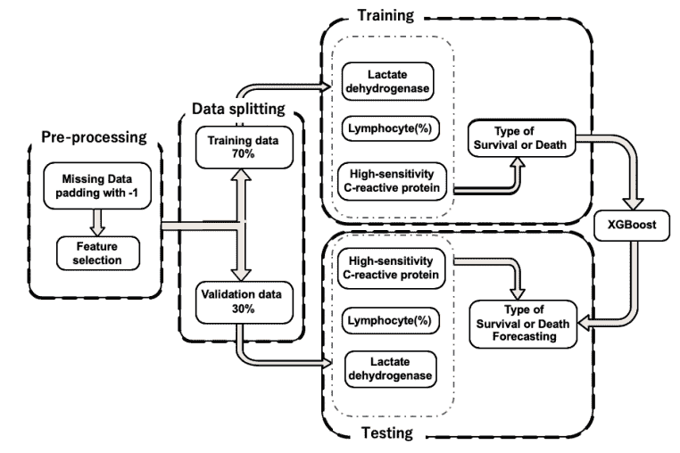

XGBoost Machine Learning Algorithm for Severity Detection of COVID-19** 

**使用该管道，该模型能够实现 90%以上的准确性，从而实现早期检测、早期干预，并降低受新冠肺炎影响的高危患者的死亡率。**

## **新冠肺炎数据集**

**在前面的章节中，我们已经看到了使用机器学习和人工智能对抗新冠肺炎的不同方法和技术。这些都有一个共同点:数据！数据越多，算法越来越好。为了帮助理解新冠肺炎，几家公司和开源组织开发了不同的数据集。下面是一些个人和团队如何利用现有数据应对新冠肺炎病毒传播及其后果的案例。**

1.  **监测医务人员防护设备的分发**
2.  **寻找新冠肺炎的平均潜伏期和恢复期**
3.  **跨大洲的实时可视化和监控**
4.  **新冠肺炎症状的快速诊断**
5.  **为前线医护人员提供人工智能援助**
6.  **医院病床管理**
7.  **x 光或计算机断层扫描的诊断**
8.  **使用集群网络的患者跟踪**
9.  **疫苗或解毒剂蛋白质预测**
10.  **连续患者监护**

**以下是一些被广泛使用的数据集的链接:**

1.  **新冠肺炎开放研究数据集挑战赛(CORD-19 ): CORD-19 是艾伦人工智能研究所与几家公司和组织合作开发的数据集。它由超过 45，000 篇学术文章组成，其中 33，000 篇为全文，内容涉及新冠肺炎、新型冠状病毒和相关冠状病毒。**
2.  **[新冠肺炎韩国数据集](https://github.com/ThisIsIsaac/Data-Science-for-COVID-19):这是大韩民国的一个开源数据集，用于跟踪 COVID 阳性患者的旅行史。使用这个数据集，开发了一个基于 ML 和 web 的平台来可视化患者路线。**
3.  **【2019 年新型冠状病毒数据集:该数据集包含来自不同地区的病例数、死亡数和恢复数的每日信息，包括时间戳。**
4.  **[COVID19 ChextXRay 数据集](https://github.com/ieee8023/covid-chestxray-dataset):该数据包含新冠肺炎病例的胸部 x 光片。感谢约瑟夫·保罗·寇恩让这个数据集在 Github 上公开。利用这一点，人们可以尝试建立一个使用 X 射线检测新冠肺炎的神经网络分类器(然而，请注意，数据对于创建有效的模型来说是非常有限的)。然而，人们不应该在没有临床研究的情况下宣称模型的诊断性能。**

## **摘要**

**人工智能已经彻底改变了许多行业，现在正被用来彻底改变对抗新型冠状病毒(新冠肺炎)的战斗。虽然人工智能社区正在紧张地工作，以提供有助于遏制病毒后果的应用程序，但人工智能系统仍处于初级阶段，这些措施的结果还需要时间才能看到。这个悲惨的故事还远没有结束。然而，社区已经取得了很大的进步，下一个重大突破也不远了。**

## **参考**

1.  **[世界卫生组织](https://twitter.com/WHO/status/1227248333871173632?s=20)**
2.  **[https://www.newscientist.com/term/covid-19/](https://www.newscientist.com/term/covid-19/)-[新冠肺炎](https://www.newscientist.com/term/covid-19/)**
3.  **[DAMO 学院的人工智能系统如何检测冠状病毒病例](https://www.alizila.com/how-damo-academys-ai-system-detects-coronavirus-cases/)**
4.  **[用技术对抗冠状病毒:阿里巴巴 NLP 研究的又一突破](https://www.alibabacloud.com/blog/fighting-coronavirus-with-technology-another-breakthrough-for-alibaba-in-nlp-research_595973)**
5.  **[利用深度学习对 CT 图像中新冠肺炎肺部感染进行量化](https://arxiv.org/pdf/2003.04655v2.pdf)**
6.  **[V-Net:用于体积医学图像分割的全卷积神经网络](https://arxiv.org/pdf/1606.04797.pdf)**
7.  **[异常呼吸模式分类器可能有助于以准确和不引人注目的方式对新冠肺炎病毒感染者进行大规模筛查](https://arxiv.org/pdf/2002.05534v1.pdf)**
8.  **[深度学习系统筛查冠状病毒疾病 2019 肺炎](https://arxiv.org/ftp/arxiv/papers/2002/2002.09334.pdf)**
9.  **[基于深度学习的新型冠状病毒 2019-NovCov 药物筛选](https://www.preprints.org/manuscript/202002.0061/v1)**
10.  **[使用三种临床特征预测严重新冠肺炎感染患者的危急程度:基于机器学习的武汉临床数据预后模型](https://www.medrxiv.org/content/10.1101/2020.02.27.20028027v2.full.pdf+html)**
11.  **[AlphaFold:利用人工智能进行科学发现](https://deepmind.com/blog/article/AlphaFold-Using-AI-for-scientific-discovery)**
12.  **[与新冠肺炎相关的蛋白质结构的计算预测](https://deepmind.com/research/open-source/computational-predictions-of-protein-structures-associated-with-COVID-19)**
13.  **计算机科学家正在构建解决新冠肺炎问题的算法**