# 分类中的梯度推进:不再是黑箱！

> 原文：<https://blog.paperspace.com/gradient-boosting-for-classification/>

机器学习算法需要的不仅仅是拟合模型和进行预测来提高准确性。大多数在行业或竞赛中获胜的模型都使用了集合技术或特征工程来表现得更好。

与特征工程相比，集成技术由于其易用性而特别受欢迎。有多种集成方法已被证明在与高级机器学习算法一起使用时可以提高准确性。一种这样的方法是**梯度增强**。虽然梯度增强经常被当作一个黑盒来讨论，但在本文中，我们将一步一步地、直观地、广泛地揭开梯度增强的秘密，这样你就能真正理解它是如何工作的。

在本文中，我们将讨论以下主题:

*   什么是梯度增强？
*   分类中的梯度推进
    *   直观的理解:可视化梯度增强
    *   数学上的理解
*   Python 中梯度推进的实现
*   比较和对比 AdaBoost 和梯度增强
*   梯度增强的优点和缺点
*   结论

## 什么是梯度增强？

先来简单回顾一下**系综学习**。顾名思义，集成学习涉及通过使用“较弱”模型的集合(或“集成”)来构建强模型。梯度提升属于提升方法的范畴，其从每个弱学习器迭代学习以建立强模型。它可以优化:

*   回归
*   分类
*   等级

本文的范围将特别限于分类。

助推背后的想法来自直觉，薄弱的学习者可以被修改，以变得更好。 [AdaBoost](https://blog.paperspace.com/adaboost-optimizer/) 是第一个 boosting 算法。 [Leo Breiman (1997)](https://statistics.berkeley.edu/sites/default/files/tech-reports/486.pdf) 首先将 AdaBoost 和相关算法纳入统计框架，这为其他研究人员如 [Jerome H. Friedman](https://statweb.stanford.edu/~jhf/ftp/trebst.pdf) 将这项工作修改为开发回归的梯度推进算法奠定了基础。随后，许多研究人员为机器学习和统计的更多领域开发了这种 boosting 算法，远远超出了回归和分类的最初应用。

梯度增强中的术语“梯度”指的是同一函数有两个或多个导数的事实(我们将在后面更详细地讨论这一点)。梯度提升是一种*迭代函数梯度算法*，即通过迭代选择指向负梯度的函数来最小化损失函数的算法；无力的假设。

## 分类中的梯度推进

多年来，梯度推进已经在各种技术领域中得到应用。该算法起初看起来可能很复杂，但在大多数情况下，我们只使用一个预定义的配置进行分类，一个用于回归，当然可以根据您的要求进行修改。在这篇文章中，我们将重点放在分类问题的梯度推进。我们将从直观和数学的角度来看这个算法是如何在幕后工作的。

梯度增强有三个主要部分:

*   **损失函数** -损失函数的作用是评估模型在给定数据下进行预测的能力。这可能因手头的问题而异。例如，如果我们试图根据一些输入变量预测一个人的体重(回归问题)，那么损失函数将有助于我们找到预测体重和观察体重之间的差异。另一方面，如果我们试图根据一个人的个性来对他是否喜欢某部电影进行分类，我们将需要一个损失函数来帮助我们了解我们的模型在对喜欢或不喜欢某些电影的人进行分类时有多准确。
*   弱学习者(Weak Learner)-弱学习者是指对我们的数据进行分类，但做得很差的人，可能比随机猜测好不了多少。换句话说，它的错误率很高。这些是典型的[决策树](https://blog.paperspace.com/decision-trees/)(也称为决策树桩，因为它们没有典型的决策树复杂)。
*   **加法模型** -这是一种迭代和连续的方法，一次一步地添加树(弱学习者)。在每次迭代之后，我们需要更接近我们的最终模型。换句话说，每次迭代都应该减少损失函数的值。

### 直观的理解:可视化梯度增强

我们先来看一个最常见的二分类机器学习问题。它旨在根据一些特征预测泰坦尼克号上乘客的命运:他们的年龄、性别等。为了方便起见，我们将只选取数据集的一个子集，并选择某些列。我们的数据集看起来像这样:

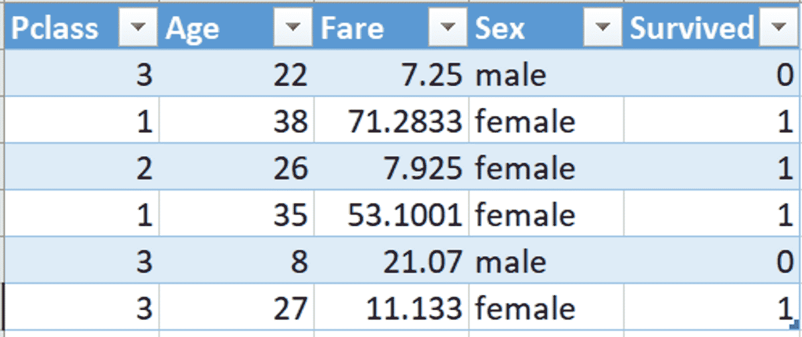

Titanic Passenger Data

*   Pclass 或乘客等级是明确的:1、2 或 3。
*   年龄是泰坦尼克号上乘客的年龄。
*   *票价*是客运票价。
*   *性别*是人的性别。
*   *生还*指人是否在坠机中幸存；如果没有，则为 0，如果有，则为 1。

现在我们来看看梯度提升算法是如何解决这个问题的。

我们从一个叶节点开始，它预测每个乘客的初始值。对于一个分类问题，将是目标值的 log(odds)。log(odds)相当于分类问题中的平均值。由于我们的案例中有 4 名乘客幸存，2 名乘客未能幸存，因此一名乘客幸存的可能性为:


这成为我们最初的叶子。


Initial Leaf Node

使用 log(odds)进行分类的最简单方法是将其转换为概率。为此，我们将使用以下公式:


> 注意:请记住，我们在这里将所有数据四舍五入到小数点后一位，因此对数(赔率)和概率是相同的，这可能并不总是如此。

如果幸存的概率大于 0.5，那么我们首先将训练数据集中的每个人都归类为幸存者。(0.5 是用于基于概率做出分类决策的常见阈值；请注意，阈值很容易被当成其他东西。)

现在我们需要计算**伪残差**，即观察值和预测值之间的差值。让我们在图上画出残差。

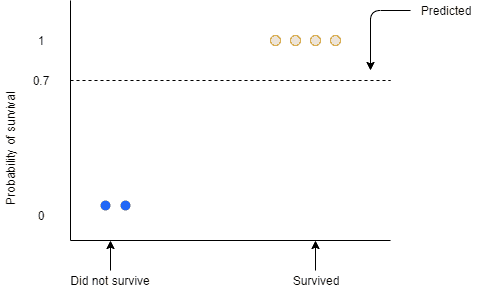

蓝色和黄色的点是观察值。蓝点是没有幸存的概率为 0 的乘客，黄点是幸存的概率为 1 的乘客。这里的虚线表示预测概率为 0.7

我们需要找到剩余部分:

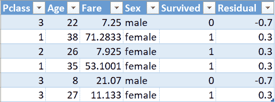

这里，1 表示是，0 表示否。

我们将使用这个残差来得到下一棵树。我们考虑的是剩余价值而不是实际价值，这似乎很荒谬，但我们应该向前看。

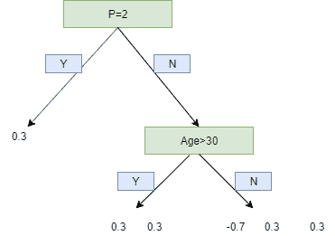

Branching out data points using the residual values

我们在这里使用两个叶子的限制来简化我们的示例，但实际上，梯度增强的范围在 **8 个叶子到**32 个叶子之间。

由于叶子的限制，一个叶子可以有多个值。预测是根据对数(赔率)进行的，但这些树叶是从导致差异的概率中得出的。所以，我们不能仅仅把之前得到的单叶和这棵树相加来得到新的预测，因为它们来自不同的来源。我们必须使用某种转换。用于分类的梯度增强中最常见的变换形式是:


这个方程的分子是特定叶子的残差的和。

分母是(每个残差的先前预测概率)* (1 -相同的先前预测概率)的和。

这个公式的推导将在本文的数学部分解释。

现在，让我们将公式付诸实践:

第一片叶子只有一个残差值 0.3，因为这是第一棵树，所以前一个概率将是来自初始叶子的值，因此，对所有残差值都是一样的。因此，


对于第二片叶子，


同样，对于最后一片叶子:


现在，转换后的树看起来像这样:

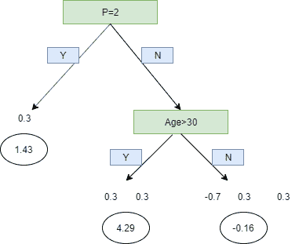

Transformed tree

现在，我们已经转换了它，我们可以用我们的新树添加我们的初始线索，学习率。


**学习率**用于衡量新树的贡献。这使得预测朝着正确的方向前进了一小步。经验证据已经证明，与第一步中的完美预测相比，在正确的方向上采取许多小步骤会导致使用测试数据集(即模型从未见过的数据集)进行更好的预测。学习率通常是 0.1 这样的小数字

我们现在可以计算新的对数(赔率)预测，从而计算新的概率。

例如，对于第一个乘客，老树= 0.7。对于所有记录保持不变的学习率等于 0.1，并且通过缩放新树，我们发现其值为-0.16。因此，在公式中代入我们得到:


类似地，我们替换并找到每个乘客的新日志(赔率),从而找到概率。使用新的概率，我们将计算新的残差。

这个过程一直重复，直到我们指定了最大数量的树或者残差变得非常小。

### 数学上的理解

既然我们已经直观地了解了梯度推进算法如何处理分类问题，那么填补我们在上一节中留下的大量空白将非常重要，这可以通过数学地理解该过程来完成。

我们将一次一步地完成每一步，并试图理解它们。

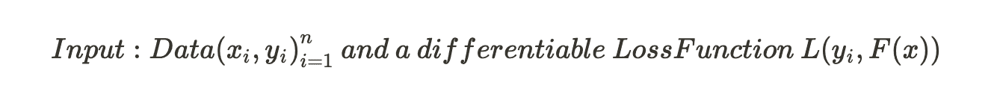

Xi——这是我们输入模型的输入变量。

这是我们要预测的目标变量。

给定预测概率，我们可以预测数据的对数似然性

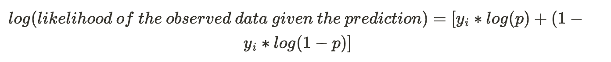

yi 是观察值(0 或 1)。

p 是预测的概率。

目标是最大化对数似然函数。因此，如果我们使用 **log(likelihood)** 作为损失函数，其中较小的值代表更好的拟合模型，则:


现在对数(可能性)是预测概率 p 的函数，但我们需要它是预测对数(几率)的函数。所以，让我们试着转换公式:

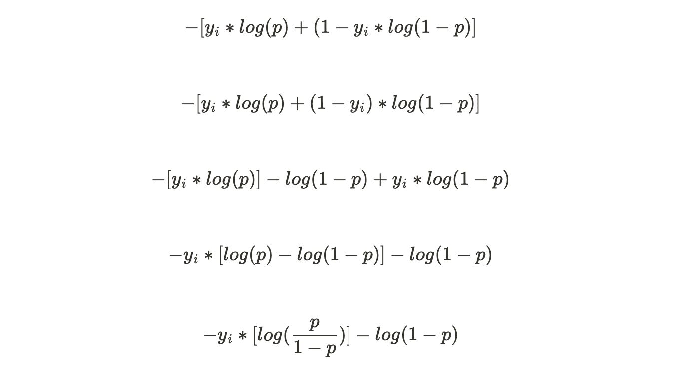

我们知道:


替代，


现在，

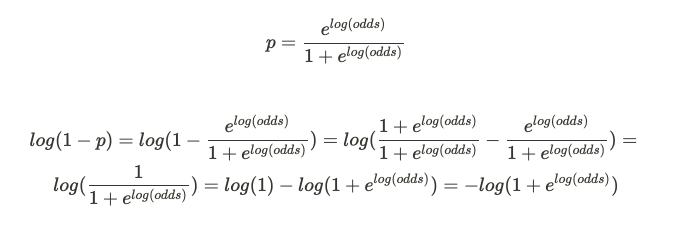

因此，


现在我们已经把 p 转换成 log(odds)，这就成了我们的**损失函数**。

我们必须证明这是可微的。

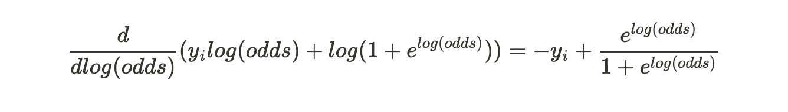

这也可以写成:


现在我们可以进入模型构建的实际步骤。

**步骤 1:用常量值初始化模型**


这里，yi 是观察值，L 是损失函数，γ是 log(赔率)的值。

我们对损失函数求和，即我们对每个观察值的损失函数求和。

arg min/gamma 意味着我们需要找到一个 log(odds)值来最小化这个和。

然后，我们对每个损失函数求导:

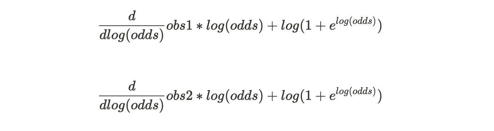

...诸如此类。

**第二步:对于 m = 1 到 M:**

(一)


这一步需要你用给定的公式计算残差。我们已经发现损失函数为:


因此，


(B)将回归树拟合到残差值并创建终端区域


因为一个分支的叶子是有限的，所以在一个特定的末端区域可能有不止一个值。

在我们的第一棵树中，m=1，j 将是每个终端节点的唯一编号。所以 R11，R21 等等。

(三)

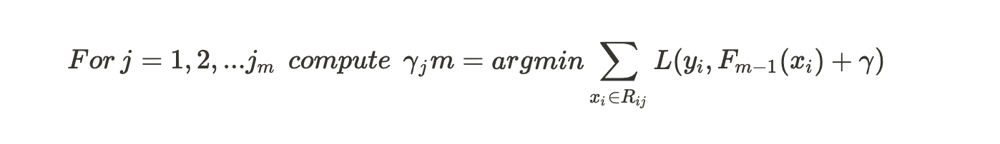

对于新树中的每一片叶子，我们计算输出值 gamma。求和应该只针对那些生成该叶的记录。理论上，我们可以找到关于伽马的导数，以获得伽马的值，但这可能是非常令人厌倦的，因为我们的损失函数中包含大量变量。

代入上述等式中的损失函数和 i=1，我们得到:

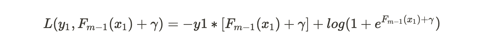

我们使用二阶泰勒多项式来近似这个损失函数:

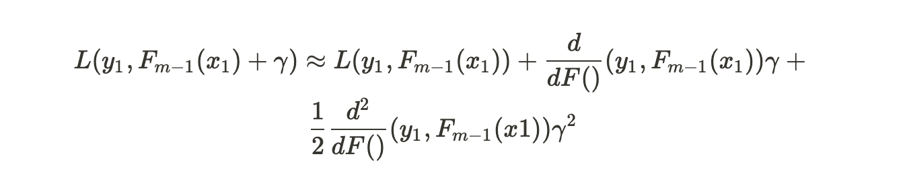

在我们的近似值中有三项。对γ求导得到:

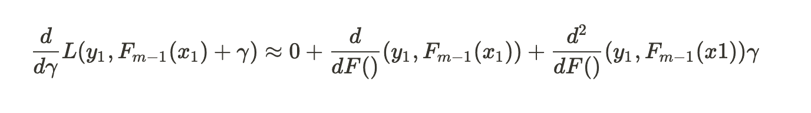

等于 0，从两边减去一阶导数。


那么，伽马将等于:


伽马方程可能看起来很庞大，但简单来说，它就是:


我们将只替换损失函数的导数的值

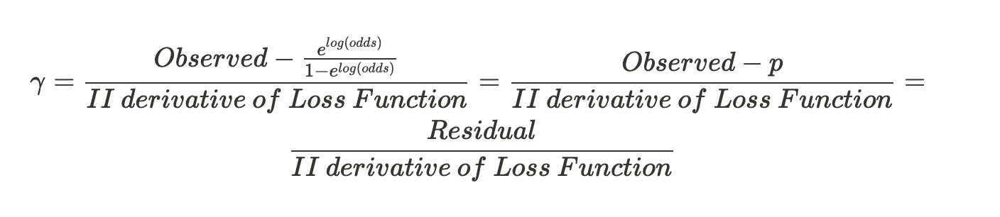

现在我们将求解损失函数的二阶导数。经过一些繁重的计算，我们得到:


我们简化了分子和分母。最终的伽玛解决方案看起来像:


我们试图找到伽马值，当加到最近的预测日志(赔率)时，使我们的损失函数最小化。当我们的终端区域只有一个残差值，因此只有一个预测的概率时，这个伽玛是有效的。但是，回想一下我们上面的例子，由于梯度增强中的受限叶，一个末端区域可能有许多值。那么概括的公式将是:


因此，我们已经计算了树中每个叶子的输出值。

(四)


这个公式要求我们现在更新我们的预测。在第一遍中，m =1，我们将替换 F0(x)，所有样本的共同预测，即初始叶值加上 nu，nu 是从我们先前构建的树到输出值的学习速率。求和是针对单个样本在多个叶中结束的情况。

现在，我们将使用这个新的 F1(x)值来获得每个样本的新预测。

新的预测值应该会让我们更接近实际值。要注意的是，与我们考虑的一棵树相反，梯度增强构建了许多树，M 可以大到 100 或更大。

这就完成了第 2 步中的 for 循环，我们为梯度增强的最后一步做好了准备。

**第三步:输出**


如果我们得到一个新的数据，那么我们将使用这个值来预测乘客是否幸存。这将为我们提供这个人幸存的概率。将其代入“p”公式:


如果结果值高于我们的阈值，那么这个人就活了下来，否则就不行。

## 使用 Python 实现梯度增强

我们将使用 [Kaggle](https://www.kaggle.com/c/titanic/data) 中可用的完整 Titanic 数据集。为了方便起见，数据集已经分为训练集和测试集。

第一步是导入我们在这个过程中需要的库。

```py
import pandas as pd
from sklearn.ensemble import GradientBoostingClassifier
import numpy as np
from sklearn import metrics 
```

然后，我们将加载我们的训练和测试数据

```py
train = pd.read_csv("train.csv")
test= pd.read_csv("test.csv")
```

让我们打印出每一列的数据类型

```py
train.info(), test.info()
```

```py
<class 'pandas.core.frame.DataFrame'>
RangeIndex: 891 entries, 0 to 890
Data columns (total 12 columns):
PassengerId    891 non-null int64
Survived       891 non-null int64
Pclass         891 non-null int64
Name           891 non-null object
Sex            891 non-null object
Age            714 non-null float64
SibSp          891 non-null int64
Parch          891 non-null int64
Ticket         891 non-null object
Fare           891 non-null float64
Cabin          204 non-null object
Embarked       889 non-null object
dtypes: float64(2), int64(5), object(5)
memory usage: 83.6+ KB
<class 'pandas.core.frame.DataFrame'>
RangeIndex: 418 entries, 0 to 417
Data columns (total 11 columns):
PassengerId    418 non-null int64
Pclass         418 non-null int64
Name           418 non-null object
Sex            418 non-null object
Age            332 non-null float64
SibSp          418 non-null int64
Parch          418 non-null int64
Ticket         418 non-null object
Fare           417 non-null float64
Cabin          91 non-null object
Embarked       418 non-null object
dtypes: float64(2), int64(4), object(5)
memory usage: 36.0+ KB 
```

将 PassengerID 设置为我们的索引

```py
# set "PassengerId" variable as index
train.set_index("PassengerId", inplace=True)
test.set_index("PassengerId", inplace=True)
```

我们生成训练目标集和训练输入集，并检查形状。除了“幸存”列之外的所有变量都成为输入变量或特征，只有“幸存”列成为我们的目标变量，因为我们试图基于乘客的信息来预测乘客是否幸存。

联接训练和测试数据集以获得训练测试数据集

```py
train_test =  train.append(test)
```

下一步是在将数据输入模型之前对其进行预处理。

我们进行以下预处理:

1.  删除“姓名”、“年龄”、“SibSp”、“船票”、“船舱”、“烤盘”等栏目。
2.  用 pandas.get_dummies 将对象转换为数字。
3.  用值 0.0 填充空值，这是分类变量中最常见的情况。
4.  用 MinMaxScaler()方法转换数据。
5.  将训练集随机分成训练和验证子集。

```py
# delete columns that are not used as features for training and prediction
columns_to_drop = ["Name", "Age", "SibSp", "Ticket", "Cabin", "Parch"]
train_test.drop(labels=columns_to_drop, axis=1, inplace=True)
```

```py
train_test_dummies = pd.get_dummies(train_test, columns=["Sex"])
train_test_dummies.shape
```

检查数据中缺少的值:

```py
train_test_dummies.isna().sum().sort_values(ascending=False)
```

```py
Embarked      2
Fare          1
Sex_male      0
Sex_female    0
Pclass        0
dtype: int64 
```

让我们来处理这些缺失的值。对于“已装船”，我们将估算最常发生的值，然后创建虚拟变量，对于“票价”，我们将估算 0。

```py
train_test_dummies['Embarked'].value_counts()
train_test_dummies['Embarked'].fillna('S',inplace=True) # most common
train_test_dummies['Embarked_S'] = train_test_dummies['Embarked'].map(lambda i: 1 if i=='S' else 0)
train_test_dummies['Embarked_C'] = train_test_dummies['Embarked'].map(lambda i: 1 if i=='C' else 0)
train_test_dummies['Embarked_Q'] = train_test_dummies['Embarked'].map(lambda i: 1 if i=='Q' else 0)
train_test_dummies.drop(['Embarked'],axis=1,inplace=True)
```

```py
train_test_dummies.fillna(value=0.0, inplace=True)
```

最后一次检查我们是否处理了所有丢失的值。

```py
train_test_dummies.isna().sum().sort_values(ascending=False) 
```

```py
Embarked_Q    0
Embarked_C    0
Embarked_S    0
Sex_male      0
Sex_female    0
Fare          0
Pclass        0
dtype: int64 
```

所有丢失的值似乎都被处理了。

之前，我们已经生成了我们的目标集。现在我们将生成我们的特征集/输入集。

```py
X_train = train_test_dummies.values[0:891]
X_test = train_test_dummies.values[891:] 
```

在我们拟合我们的模型之前，是时候进行最后一步了，这将是转换我们的数据，使一切都达到一个特定的比例。

```py
from sklearn.preprocessing import MinMaxScaler
scaler = MinMaxScaler()
X_train_scale = scaler.fit_transform(X_train)
X_test_scale = scaler.transform(X_test)
```

我们现在必须将数据集分为训练和测试两部分。训练来训练我们的模型，测试来检查我们的模型与数据集的吻合程度。

```py
from sklearn.model_selection import train_test_split
X_train_sub, X_validation_sub, y_train_sub, y_validation_sub = train_test_split(X_train_scale, y_train, random_state=0)
```

现在，我们训练我们的梯度增强算法，并检查从 0 到 1 的不同学习速率下的准确性。

```py
learning_rates = [0.05, 0.1, 0.25, 0.5, 0.75, 1]
for learning_rate in learning_rates:
    gb = GradientBoostingClassifier(n_estimators=20, learning_rate = learning_rate, max_features=2, max_depth = 2, random_state = 0)
    gb.fit(X_train_sub, y_train_sub)
    print("Learning rate: ", learning_rate)
    print("Accuracy score (training): {0:.3f}".format(gb.score(X_train_sub, y_train_sub)))
    print("Accuracy score (validation): {0:.3f}".format(gb.score(X_validation_sub, y_validation_sub)))
```

```py
 ('Learning rate: ', 0.05)
Accuracy score (training): 0.808
Accuracy score (validation): 0.834
('Learning rate: ', 0.1)
Accuracy score (training): 0.799
Accuracy score (validation): 0.803
('Learning rate: ', 0.25)
Accuracy score (training): 0.811
Accuracy score (validation): 0.803
('Learning rate: ', 0.5)
Accuracy score (training): 0.820
Accuracy score (validation): 0.794
('Learning rate: ', 0.75)
Accuracy score (training): 0.822
Accuracy score (validation): 0.803
('Learning rate: ', 1)
Accuracy score (training): 0.822
Accuracy score (validation): 0.816 
```

这就完成了我们的代码。此处使用的参数的简要说明。

*   **n_estimators :** 要执行的升压阶段的数量。梯度增强对过度拟合相当稳健，因此较大的数量通常会产生较好的性能。
*   **learning_rate :** 学习率将每棵树的贡献缩小`learning_rate`。在 learning_rate 和 n_estimators 之间有一个折衷。
*   **max_features :** 寻找最佳分割时要考虑的特征数量。
*   **max_depth :** 单个回归估计量的最大深度。最大深度限制了树中节点的数量。调整此参数以获得最佳性能；最佳值取决于输入变量的相互作用。
*   **random _ state:**random _ state 是随机数生成器使用的种子。

超调这些参数以获得最佳精度。

## 比较和对比 AdaBoost 和 GradientBoost

AdaBoost 和 Gradient Boost 都是从弱学习者集合中顺序学习的。从这些弱学习者的加法模型中获得强学习者。这里的主要焦点是从迭代中每一步的缺点中学习。

AdaBoost 要求用户指定一组弱学习器(或者，它会在真正的学习过程之前随机生成一组弱学习器)。它增加错误预测实例的权重，并减少正确预测实例的权重。因此，弱学习者更关注困难的例子。在被训练之后，弱学习者根据其表现被添加到强学习者中(所谓的阿尔法权重)。它表现得越高，对学习能力强的人的贡献就越大。

另一方面，梯度增强不会修改样本分布。弱学习者训练强学习者的剩余错误，而不是训练新采样的分布。这是另一种方式给予困难的例子更多的重视。在每次迭代中，计算伪残差，并将弱学习器拟合到这些伪残差。然后，弱学习器对强学习器的贡献不是根据其在新分布的样本上的性能来计算的，而是使用梯度下降优化过程。计算出的贡献是最小化强学习者的整体误差的贡献。

**Adaboost** 更多的是关于“**投票** **权重****渐变** **boosting** 更多的是关于“**添加** **渐变** **优化**”。

## 梯度增强的优点和缺点

梯度增强的优点是:

*   通常提供无可匹敌的预测准确性。
*   大量的灵活性-可以优化不同的损失函数，并提供了几个超级参数调整选项，使函数拟合非常灵活。
*   不需要数据预处理——通常适用于分类值和数值。
*   处理缺失数据-不需要插补。

很棒，对吧？让我们也看看一些缺点。

*   梯度推进模型将继续改进，以尽量减少所有误差。这可能会过分强调异常值，导致过度拟合。
*   计算成本高-通常需要很多树(> 1000)，这会耗费大量时间和内存。
*   高灵活性导致许多参数相互作用并严重影响该方法的行为(迭代次数、树深度、正则化参数等)。).这需要在调优期间进行大范围的网格搜索。
*   本质上较少解释，尽管这可以通过各种工具轻松解决。

## 结论

本文提出了梯度推进算法的理论和实践方法。梯度推进已被反复证明是在分类和回归中建立预测模型的最强有力的技术之一。因为分级提升算法很容易在训练数据集上过度拟合，所以可以利用不同的约束或正则化方法来增强算法的性能并对抗过度拟合。惩罚学习、树约束、随机抽样和收缩可以用来对抗过度拟合。

许多现实生活中的机器学习挑战已经通过梯度推进得到解决。

希望这篇文章鼓励你深入探索梯度推进，并开始将它们应用到现实生活中的机器学习问题中，以提高你的准确性！

### 参考

1.  [使用 Scikit 学习 Python 中的梯度增强分类器](https://stackabuse.com/gradient-boosting-classifiers-in-python-with-scikit-learn/)
2.  [使用 AdaBoost 和梯度增强进行增强——数据科学家的成就](https://medium.com/diogo-menezes-borges/boosting-with-adaboost-and-gradient-boosting-9cbab2a1af81)
3.  [梯度推进第一部分:回归主要思路](https://www.youtube.com/watch?v=3CC4N4z3GJc)
4.  [梯度推进机](http://uc-r.github.io/gbm_regression)
5.  [使用 AdaBoost 和梯度增强进行增强——数据科学家的成就](https://medium.com/diogo-menezes-borges/boosting-with-adaboost-and-gradient-boosting-9cbab2a1af81)
6.  [3.2.4.3.6。巩恩.合着.梯度助推器-scikit-learn 0 . 22 . 2 documentation](https://scikit-learn.org/stable/modules/generated/sklearn.ensemble.GradientBoostingRegressor.html)
7.  [回归问题的梯度推进示例|回归算法基础](https://acadgild.com/blog/gradient-boosting-for-regression-problems)
8.  [渐变增强的简单介绍](http://www.ccs.neu.edu/home/vip/teach/MLcourse/4_boosting/slides/gradient_boosting.pdf)
9.  [机器学习基础知识——梯度推进& XGBoost](https://shirinsplayground.netlify.com/2018/11/ml_basics_gbm/)
10.  [了解梯度增压机](https://towardsdatascience.com/understanding-gradient-boosting-machines-9be756fe76ab)