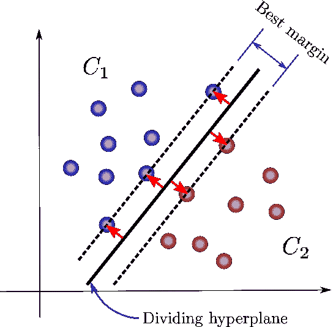
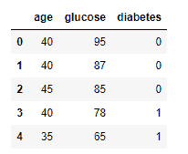
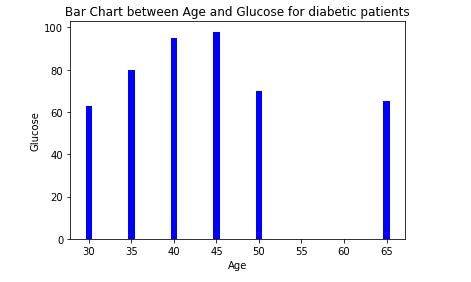
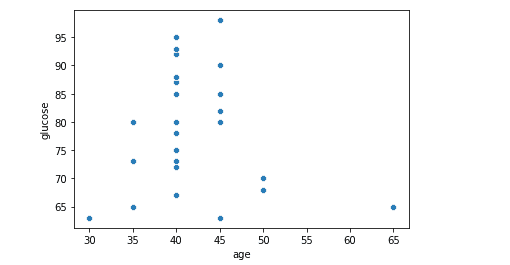
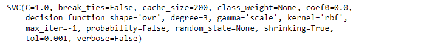
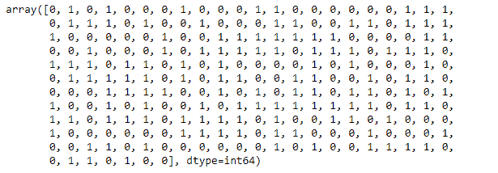

# 如何用 Scikit-Learn 实现支持向量机

> 原文：<https://blog.paperspace.com/implementing-support-vector-machine-in-python-using-sklearn/>

在本教程中，我们将介绍:

1.  支持向量机算法简介
2.  使用 Python 和 Sklearn 实现 SVM

所以，让我们开始吧！

## 支持向量机简介

支持向量机(SVM)是一种监督机器学习算法，可用于分类和回归问题。SVM 即使在数据量有限的情况下也能表现得很好。

在这篇文章中，我们将专门学习支持向量机分类。让我们先来看看支持向量机算法的一些一般用例。

### 用例

**疾病分类:**例如，如果我们有关于患有糖尿病等疾病的患者的数据，我们可以预测新患者是否可能患有糖尿病。

**文本的分类:**首先我们需要将文本转换成向量表示。然后，我们可以将支持向量机算法应用于编码文本，以便将其分配到特定的类别。

**图像分类:**图像被转换成包含像素值的矢量，然后 SVM 分配一个类别标签。

现在让我们了解一些与 SVM 相关的关键术语。

### 关键术语



Source: [Oscar Contreras Carrasco](https://towardsdatascience.com/@OscarContrerasC?source=post_page-----fc7c1565e3----------------------)

**支持向量**:支持向量是距离超平面较近的数据点，如上图所示。使用支持向量，该算法最大化了类别之间的界限或间隔。如果支持向量改变，超平面的位置也将改变。

**超平面:**二维中的超平面简单来说就是一条最好地分隔数据的直线。这条线是类之间的判定边界，如上图所示。对于三维数据分布，超平面将是二维表面，而不是直线。

**Margin:** 这是每个支持向量之间的距离，如上图所示。该算法旨在最大化利润。寻找最大余量(以及最佳超平面)的问题是一个优化问题，可以通过优化技术来解决。

**内核:**内核是一种应用于数据点的函数，用于将原始非线性数据点映射到高维空间，在高维空间中它们是可分离的。在许多情况下，不会有一个线性的决策边界，这意味着没有一条直线将两个类别分开。内核解决了这个问题。有很多种内核函数可用。RBF(径向基函数)核通常用于分类问题。

理解了这些关键术语后，让我们开始研究数据。

## 探索性数据分析

首先，我们将导入所需的库。我们正在导入`numpy`、`pandas`和`matplotlib`。除此之外，我们还需要从`sklearn.svm`进口 SVM。

我们还将使用来自`sklearn.model_selection`的`train_test_split`，以及来自`sklearn.metrics`的`accuracy_score`。我们将使用`matplotlib.pyplot`进行可视化。

```py
import numpy as np
import pandas as pd
from sklearn.model_selection import train_test_split
from sklearn.svm import SVC
from sklearn.metrics import accuracy_score
import matplotlib.pyplot as plt
```

一旦库被导入，我们需要从 CSV 文件读取数据到 Pandas 数据框。让我们检查前 10 行数据。

该数据是为潜在糖尿病患者检查的数据的集合。为简单起见，我们考虑两个特征年龄和血糖水平以及一个二元目标变量。值 1 表示糖尿病，0 表示没有糖尿病。

```py
df = pd.read_csv('SVM-Classification-Data.csv')
df.head()
```



Support Vector Machine Classification Data

为了更好地了解数据，我们绘制了一个数据条形图，如下所示。条形图是一种用矩形条表示分类数据的图表，矩形条的高度代表它们所具有的值。条形图可以垂直或水平绘制。

下图是年龄和血糖栏之间的垂直图表。



Bar Chart

为了更好地了解异常值，我们也可以看看散点图。下面是数据中出现的特征的散点图。



探索完数据后，我们可能想做一些如下的数据预处理任务。

### 数据预处理:

在将数据输入支持向量分类模型之前，我们需要做一些预处理。

这里我们将创建两个变量 x 和 y。x 代表模型的特征，y 代表模型的标签。我们将创建 x 和 y 变量，方法是从数据集中取出它们，并使用 sklearn 的`train_test_split`函数将数据分成训练集和测试集。

```py
x = df.drop('diabetes',axis=1)
y = df['diabetes']
x_train, x_test, y_train, y_test = train_test_split(x, y, test_size=0.25, random_state=42)
```

请注意，测试大小为 0.25 表示我们使用了 25%的数据进行测试。`random_state`确保再现性。对于`train_test_split`的输出，我们得到`x_train`、`x_test`、`y_train`和`y_test`的值。我们将使用 x_train 和 y_train 来训练模型，然后我们将一起使用 x_test 和 y_test 来测试模型。

数据预处理完成后，现在是定义和拟合模型的时候了。

### 定义并拟合模型

我们将创建一个`model`*变量并实例化 SVC 类。在此之后，我们将训练模型，但在此之前，让我们讨论支持向量分类器模型的一些重要参数，如下所列。*

***内核 **:**** `kernel`是指用于模式分析的算法类。这是一个字符串参数，是可选的。默认值是 RBF。常见的可能值有“线性”、“多边形”、“rbf”、“sigmoid”、“预计算”。*

*线性核是最常用的核之一。当数据是线性可分离的时使用，这意味着数据可以用一条线来分离。*

*当数据不是线性可分时，使用 RBF 核。支持向量机的 RBF 核创建给定特征的非线性组合，并将给定数据样本转换到更高维的特征空间，在该空间中，我们可以使用线性决策边界来分离类别。*

***正则化 C **:**** `C`是一个正则化参数。正则化与 c 成反比，它必须是正的。*

***次数 **:**** 次数是多项式核函数的次数。它被所有其他内核忽略，比如 linear。*

***V**erbos**e**:**这将启用详细输出。Verbose 是一个通用编程术语，用于生成大部分日志输出。Verbose 的意思是要求程序告诉所有关于它一直在做什么的事情。***

***Random _ State:**Random _ State 是随机数生成器使用的种子。这用于确保再现性。换句话说，为了在拟合期间获得确定性行为，`random_state`必须是固定的。*

```py
*`SupportVectorClassModel = SVC()
SupportVectorClassModel.fit(x_train,y_train)`*
```

*在我们定义了上面的模型之后，我们需要使用给定的数据来训练模型。为此我们使用了如上图所示的`fit()`*方法。该方法传递了两个参数，这是我们感兴趣的数据(在本例中，年龄和血糖以及数据集的 diebetes 训练部分)。**

**一旦模型被正确训练，它将输出 SVC 实例，如下面单元格的输出所示。**

****

**模型训练完成将自动引导您尝试一些预测。**

### **使用模型预测**

**一旦模型经过训练，它就可以进行预测了。我们可以在模型上使用`predict`方法，并将`x_test`作为参数传递，以获得作为`y_pred`的输出。**

**请注意，预测输出是一个对应于输入数组的实数数组。**

```py
**`y_pred = SupportVectorClassModel.predict(x_test)`**
```

**

Support Vector Machine Prediction** 

**一旦预测完成，我们自然会测试模型的准确性。**

### **评估模型**

**现在是时候检查我们的模型在测试数据上的表现了。为此，我们通过发现模型产生的准确性来评估我们的模型。**

**我们将使用 accuracy_score 函数，并将两个参数 y_test 和 y_pred 传递给该函数。**

```py
**`accuracy = accuracy_score(y_test,y_pred)*100
99.19678714859438`**
```

**正如你在上面看到的，这个模型的精确度大约是 99.19%。**

### **尾注**

**在本教程中，我们学习了什么是支持向量机算法及其使用案例。对于这个问题，我们还讨论了各种探索性的数据分析图，如条形图和散点图。**

**最后实现了支持向量分类算法并打印了预测结果。**

**我希望你喜欢这篇文章，如果需要的话，你可能会在将来的项目中使用它。**

**快乐学习！**