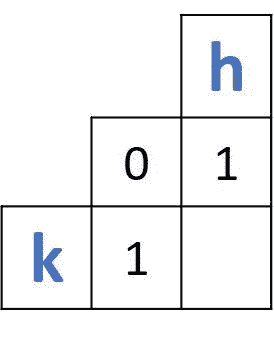

# 实现单词自动完成和自动更正的 Levenshtein 距离

> 原文：<https://blog.paperspace.com/implementing-levenshtein-distance-word-autocomplete-autocorrect/>

Levenshtein 距离是一种文本相似性度量，它比较两个单词并返回代表它们之间距离的数值。距离反映了将一个单词转换为另一个单词所需的单个字符编辑的总数。两个词越相似，它们之间的距离就越小，反之亦然。这个距离的一个常见用途是文本处理器或聊天应用程序的自动完成或自动更正功能。

之前我们讨论了[Levenshtein 距离如何工作](https://blog.paperspace.com/measuring-text-similarity-using-levenshtein-distance/)，我们考虑了几个使用动态编程方法的例子。

在本教程中，Levenshtein 距离将使用动态编程方法在 Python 中实现。我们将创建一个具有自动完成和自动更正功能的简单应用程序，它使用 Levenshtein 距离来选择词典中“最接近”的单词。

本教程涵盖的部分如下:

*   创建`distances`矩阵
*   初始化`distances`矩阵
*   打印`distances`矩阵
*   计算所有前缀之间的距离
*   自动完成/自动更正的字典搜索

让我们开始吧。

## **创建距离矩阵**

使用动态编程方法计算 Levenshtein 距离，创建一个 2d 矩阵，保存两个被比较单词的所有前缀之间的距离(我们在[第 1 部分](https://blog.paperspace.com/measuring-text-similarity-using-levenshtein-distance/)中看到了这一点)。因此，首先要做的是创建这个二维矩阵。

我们将创建一个名为`levenshteinDistanceDP()`的函数，它接受名为`token1`和`token2`的两个参数，代表两个单词。它返回一个表示它们之间距离的整数。该函数的标题如下:

```py
levenshteinDistanceDP(token1, token2)
```

给定两个长度为`m`和`n`的单词，根据上一教程中讨论的步骤，首先要做的是根据第一个单词是代表行还是代表列来创建一个大小为`(m+1, n+1)`或`(n+1, m+1)`的二维整数矩阵。哪个单词用于什么并不重要，但是您确实需要保持一致，因为代码的其余部分取决于这个选择。

下一行在名为`distances`的变量中创建了这样一个矩阵(在本例中，第一个字代表行，第二个字代表列)。注意，字符串的长度是使用`length()`函数返回的。

```py
distances = numpy.zeros((len(token1) + 1, len(token2) + 1))
```

## **初始化距离矩阵**

下一步是用从`0`开始的整数初始化矩阵的第一行和第一列。我们将使用下面所示的`for`循环来实现这一点，它使用了一个名为`t1`(`token1`的快捷键)的变量，该变量从 0 开始，到第二个单词的长度结束。注意，**行索引**固定为`0`，变量`t1`用于定义**列索引**。通过这样做，第一行被从`0`开始的值填充。

```py
for t1 in range(len(token1) + 1):
    distances[t1][0] = t1
```

为了初始化`distances`矩阵的第一列，使用另一个`for`循环，如下所示。与之前的循环相比，有两个变化。第一个是循环变量被命名为`t2`而不是`t1`，以反映它从`0`开始直到参数`token2`结束。第二个变化是`distances`数组的列索引现在固定为`0`，而循环变量`t2`用于定义行的索引。这样，第一列由从`0`开始的值初始化。

```py
for t2 in range(len(token2) + 1):
    distances[0][t2] = t2
```

## **打印距离矩阵**

在初始化了`distances`数组的第一行和第一列之后，我们将使用一个名为`printDistances()`的函数，通过两个`for`循环来打印它的内容。它接受三个参数:

1.  **距离**:保存距离的二维矩阵。
2.  **token1Length** :第一个单词的长度。
3.  **token2Length** :第二个字的长度。

```py
def printDistances(distances, token1Length, token2Length):
    for t1 in range(token1Length + 1):
        for t2 in range(token2Length + 1):
            print(int(distances[t1][t2]), end=" ")
        print()
```

下面是到目前为止的完整实现。在传递单词`kelm`和`hello`后调用`levenshteinDistanceDP()`函数，这在之前的教程中使用过。因为我们还没有完成，它将返回`0`。

```py
import numpy

def levenshteinDistanceDP(token1, token2):
    distances = numpy.zeros((len(token1) + 1, len(token2) + 1))

    for t1 in range(len(token1) + 1):
        distances[t1][0] = t1

    for t2 in range(len(token2) + 1):
        distances[0][t2] = t2

    printDistances(distances, len(token1), len(token2))
    return 0

def printDistances(distances, token1Length, token2Length):
    for t1 in range(token1Length + 1):
        for t2 in range(token2Length + 1):
            print(int(distances[t1][t2]), end=" ")
        print()

levenshteinDistanceDP("kelm", "hello")
```

在`levenshteinDistanceDP()`函数内部，调用`printDistances()`函数根据下一行打印`distances`数组。

```py
printDistances(distances, len(token1), len(token2))
```

这是输出。

```py
0 1 2 3 4 5 
1 0 0 0 0 0 
2 0 0 0 0 0 
3 0 0 0 0 0 
4 0 0 0 0 0 
```

至此，`distances`矩阵成功初始化。在下一节中，我们将计算两个单词的所有前缀之间的距离。

## **计算所有前缀之间的距离**

为了计算两个单词的所有前缀之间的距离，使用两个`for`循环来遍历矩阵中的每个单元(不包括第一行/列)。

```py
for t1 in range(1, len(token1) + 1):
    for t2 in range(1, len(token2) + 1):
```

在循环内部，计算两个单词的所有前缀组合的距离。根据上一教程中的讨论，两个前缀之间的距离是基于一个 *2 x 2* 矩阵计算的，如下图所示。这样的矩阵总是有三个已知值和一个要计算的缺失值。



如果位于被比较的两个前缀末尾的两个字符相等，则距离等于 *2 x 2* 矩阵左上角的值。这在下一个`if`语句中实现。

```py
if (token1[t1-1] == token2[t2-1]):
    distances[t1][t2] = distances[t1 - 1][t2 - 1]
```

如果两个字符不相等，则当前单元格中的距离等于在加上成本`1`后*2×2*矩阵中三个现有值的最小值。一个`else`块被添加到前面的`if`语句中，以根据下面的代码计算这样的距离。

```py
if (token1[t1-1] == token2[t2-1]):
    distances[t1][t2] = distances[t1 - 1][t2 - 1]
else:
    a = distances[t1][t2 - 1]
    b = distances[t1 - 1][t2]
    c = distances[t1 - 1][t2 - 1]

if (a <= b and a <= c):
    distances[t1][t2] = a + 1
elif (b <= a and b <= c):
    distances[t1][t2] = b + 1
else:
    distances[t1][t2] = c + 1
```

下面是添加这个`if-else`块后的两个`for`循环。

```py
for t1 in range(1, len(token1) + 1):
    for t2 in range(1, len(token2) + 1):
        if (token1[t1-1] == token2[t2-1]):
            distances[t1][t2] = distances[t1 - 1][t2 - 1]
        else:
            a = distances[t1][t2 - 1]
            b = distances[t1 - 1][t2]
            c = distances[t1 - 1][t2 - 1]

        if (a <= b and a <= c):
            distances[t1][t2] = a + 1
        elif (b <= a and b <= c):
            distances[t1][t2] = b + 1
        else:
            distances[t1][t2] = c + 1
```

此时，`levenshteinDistanceDP()`函数除了返回计算出的两个单词之间的距离外，几乎已经完成。这个距离位于`distances`矩阵的右下角，按照这条线返回。

```py
return distances[len(token1)][len(token2)]
```

`levenshteinDistanceDP()`函数的实现现在已经 100%完成。这是完整的代码。

```py
def levenshteinDistanceDP(token1, token2):
    distances = numpy.zeros((len(token1) + 1, len(token2) + 1))

    for t1 in range(len(token1) + 1):
        distances[t1][0] = t1

    for t2 in range(len(token2) + 1):
        distances[0][t2] = t2

    a = 0
    b = 0
    c = 0

    for t1 in range(1, len(token1) + 1):
        for t2 in range(1, len(token2) + 1):
            if (token1[t1-1] == token2[t2-1]):
                distances[t1][t2] = distances[t1 - 1][t2 - 1]
            else:
                a = distances[t1][t2 - 1]
                b = distances[t1 - 1][t2]
                c = distances[t1 - 1][t2 - 1]

                if (a <= b and a <= c):
                    distances[t1][t2] = a + 1
                elif (b <= a and b <= c):
                    distances[t1][t2] = b + 1
                else:
                    distances[t1][t2] = c + 1

    printDistances(distances, len(token1), len(token2))
    return distances[len(token1)][len(token2)]
```

下一行调用`levenshteinDistanceDP()`函数打印`distances`矩阵并返回两个单词之间的最终距离。

```py
distance = levenshteinDistanceDP("kelm", "hello")
```

输出应该如下所示。

```py
0 1 2 3 4 5 
1 1 2 3 4 5 
2 2 1 2 3 4 
3 3 2 1 2 3 
4 4 3 2 2 3 

3
```

“凯尔姆”和“你好”之间的距离是 3。

在下一节中，我们将在这个函数的基础上构建，允许用户输入一个单词，并将返回最接近的单词(基于字典搜索)。

## **词典搜索自动补全和自动更正**

Levenshtein 距离的一个应用是通过自动纠正打字错误或完成单词来帮助作者写得更快。在本节中，我们将使用一个小版本的英语词典(仅包含 1000 个常用单词)来完成这项任务。该词典可在[此链接](https://gist.github.com/deekayen/4148741)下载。它是一个文本文件，我们将从中读取并提取每个单词，然后调用`levenshteinDistanceDP()`函数，最后返回最匹配的单词。当然，您总是可以用自己选择的全尺寸字典来扩展这个实现。

下面的代码块创建了一个名为`calcDictDistance()`的函数，它接受两个参数，读取字典，并计算搜索词与字典中所有词之间的距离。

第一个参数名为`word`,表示要与字典中的单词进行比较的搜索单词。第二个参数名为`numWords`，它接受要过滤的匹配单词的数量。

目前，`calcDictDistance()`函数只是使用`open()`函数读取指定路径的文本文件。变量`line`迭代保存使用`readLines()`方法返回的字典中的每一行(即单词)。`calcDictDistance()`函数还没有返回任何东西，但是我们很快会修改它，返回一个包含最匹配单词的列表。

```py
def calcDictDistance(word, numWords):
    file = open('1-1000.txt', 'r') 
    lines = file.readlines() 

    for line in lines: 
        print(line.strip()) 
```

接下来是将搜索词与字典中的每个词进行比较，计算一个距离，并将所有距离存储在一个名为`dictWordDist`的列表中。它的长度是 1000，因为字典包含 1000 个单词。

`dictWordDist`列表属于`String`类型，包含距离和由`-`分隔的字典单词。例如，如果搜索词与词“follow”之间的距离是 2，那么保存在`dictWordDist`列表中的条目将是`2-follow`。稍后，使用`split()`方法将距离从单词中分离出来。

```py
def calcDictDistance(word, numWords):
    file = open('1-1000.txt', 'r') 
    lines = file.readlines() 
    file.close()
    dictWordDist = []
    wordIdx = 0

    for line in lines: 
        wordDistance = levenshteinDistanceMatrix(word, line.strip())
        if wordDistance >= 10:
            wordDistance = 9
        dictWordDist.append(str(int(wordDistance)) + "-" + line.strip())
        wordIdx = wordIdx + 1
```

这个函数现在可以过滤`dictWordDist`列表，根据距离返回最匹配的单词。完整的功能如下所示。定义了一个名为`closestWords`的列表来保存最匹配的单词。它的长度被设置为`numWords`参数中的值。

对`dictWordDist`列表进行排序，将最匹配的单词放在列表的顶部。在一个迭代次数等于`numWords`参数值的`for`循环中，`dictWordDist`列表被索引以返回一个包含距离和由`-`分隔的单词的字符串。

```py
def calcDictDistance(word, numWords):
    file = open('1-1000.txt', 'r') 
    lines = file.readlines() 
    file.close()
    dictWordDist = []
    wordIdx = 0

    for line in lines: 
        wordDistance = levenshteinDistanceMatrix(word, line.strip())
        if wordDistance >= 10:
            wordDistance = 9
        dictWordDist.append(str(int(wordDistance)) + "-" + line.strip())
        wordIdx = wordIdx + 1

    closestWords = []
    wordDetails = []
    currWordDist = 0
    dictWordDist.sort()
    print(dictWordDist)
    for i in range(numWords):
        currWordDist = dictWordDist[i]
        wordDetails = currWordDist.split("-")
        closestWords.append(wordDetails[1])
    return closestWords
```

然后使用`split()`方法分割这个字符串，该方法返回一个包含两个元素的列表:第一个是距离，第二个是单词。这个单词被插入到由`calcDictDistance()`函数返回的`closestWords`列表中。现在这个功能被认为是完整的。

下面是一个调用`calcDictDistance()`函数的例子。搜索词是`pape`，匹配数是`3`。

```py
print(calcDictDistance("pape", 3))
```

上面代码的输出如下所示。Levenshtein 距离成功地帮助提出了好的建议，尤其是前两个词。通过这样做，用户不必输入完整的单词，只需输入一些区分该单词的字符，程序就能给出有助于自动完成或自动纠正的建议。

```py
page
paper
age
```

## **结论**

本教程讨论了使用动态编程方法的 Levenshtein 距离的 Python 实现。我们首先创建了一个名为`levenshteinDistanceDP()`的函数，其中创建了一个 2d 距离矩阵来保存两个单词的所有前缀之间的距离。这个函数接受这两个单词作为输入，并返回一个代表它们之间距离的数字。

创建另一个名为`calcDictDistance()`的函数来构建 Levenshtein 距离的有用应用程序，其中用户提供一个单词，程序基于字典搜索返回最匹配的单词。这有助于在用户键入时自动完成或自动更正文本。