# 基于 Levenshtein 距离的文本相似性度量

> 原文：<https://blog.paperspace.com/measuring-text-similarity-using-levenshtein-distance/>

在文字处理或文本聊天应用程序中，用户经常会犯一些无意的拼写错误。可以简单到写“helo”(单个“l”)，而不是“hello”。幸运的是，现在这样的应用程序可以检测出拼写错误，因为英语词典中不存在单词“helo”。例如，拼错的单词会用红色下划线突出显示。

由于人工智能(AI)的进步，这种应用不仅仅是检测拼写错误；他们现在也可以提出解决问题的建议，或者自动提出建议。此外，应用程序足够智能，可以只根据前几个字符来建议自动补全单词。这样的建议是怎么提出来的？我们将在本教程中看到如何实现。

本教程讨论 Levenshtein 距离，它计算两个单词之间的距离，并返回一个表示它们相似程度的数字。距离越小(即返回的数字越小)，它们就越相似。所以通过比较单词“helo”和字典中的单词，我们可以找到最接近的匹配，“hello”，这将是一个建议的修复。

本教程通过一个**逐步动态编程示例**来阐明 **Levenshtein 距离**是如何计算的。然后在 **Python** 中实现距离。

本教程涵盖的部分如下:

*   Levenshtein 距离是如何工作的？
*   利用动态规划逐步计算 Levenshtein 距离
*   用 Python 实现 Levenshtein 距离

## Levenshtein 距离是如何工作的？

Levenshtein 距离是单词之间的相似性度量。给定两个单词，距离测量将一个单词转换成另一个单词所需的编辑次数。有三种技术可用于编辑:

1.  插入
2.  删除
3.  替换(替代)

这三个操作中的每一个都会使距离增加 1。让我们把事情简单化。

### 一个普遍的例子

给定两个单词， **hello** 和 **hello** ，Levenshtein 距离为零，因为这两个单词是相同的。

对于 **helo** 和 **hello** 这两个词，很明显少了一个字符“l”。因此，要将单词 **helo** 转换为 **hello** ，我们需要做的就是**插入**那个字符。在这种情况下，距离为 1，因为只需要一次编辑。

另一方面，对于两个单词 **kelo** 和 **hello** ，不仅仅需要插入字符“l”。我们还需要将字符“k”替换为“h”。经过这样的编辑，单词 **kelo** 被转换成 **hello** 。因此，距离为 2，因为应用了两个操作:替换和插入。

对于 **kel** 和 **hello** 这两个词，我们必须先将“k”替换为“h”，然后在末尾加上一个缺少的“l”再加上一个“o”。因此，距离为 3，因为应用了三个操作。

请注意，前面的讨论不是战略性的。我们遵循预定义的步骤，这些步骤可以应用于任何两个单词，将一个单词转换成另一个单词。我们现在要讨论的策略是如何使用动态规划计算距离矩阵。给定两个单词 *A* 和 *B* ，距离矩阵保存单词 *A* 的所有前缀和单词 *B* 的所有前缀之间的距离。

### 战略性的例子

对于 **kelo** 这个词，可能的前缀有 **k** 、**柯**、 **kel** 、 **kelo** 共四个前缀。对于 **hello** 这个词，前缀是 **h** 、 **he** 、 **hel** 、 **hell** 、 **hello** 共五个前缀。距离矩阵计算两个单词中所有前缀之间的距离。这将创建一个 4 行 5 列的矩阵(或 5 行 4 列，取决于您选择哪个单词代表行，哪个单词代表列，见下图)。

从单词 **kelo** 的第一个前缀 **k** 开始，我们将它与单词 **hello** 的所有五个前缀进行比较。第一个会是 **h** 。 **k** 和 **h** 之间的 Levenshtein 距离是多少？因为我们需要做的就是用 **h** 代替字符 **k** ，那么距离就是 1。让我们转到单词 **hello** 中的下一个前缀，也就是 **he** 。

**k** 和 **he** 之间的 Levenshtein 距离是多少？因为前缀 **k** 包含单个字符，而 **he** 包含多个字符，所以我们可以 100%确定需要插入一个新字符。为了将 **k** 转换为 **he** ，首先将字符 **k** 替换为 **h** ，然后我们添加 **e** 。为了将 **k** 变换为 **he** ，因此距离为 2。

现在是第三个前缀。 **k** 和 **hel** 的距离是多少？我们将做和上面一样的事情，但是我们也需要添加另一个角色， **l** 。因此，最终距离为 3。

这个过程一直持续到我们计算出单词 **kelo** 或 **k** 的第一个前缀和第二个单词 **hello** 的所有 5 个前缀之间的距离。距离只是 1、2、3、4 和 5；它们只是增加 1(这是有意义的，因为我们必须为每个后续前缀多添加一个字符)。

请注意，第一个距离为 1 只是因为前两个前缀中的前两个字符(“k”和“h”)不匹配。如果这两个单词是 **helo** 和 **hello** ，那么前两个前缀(h 和 h)匹配，因此第一个距离将是 0。因此，helo (h)的第一个前缀和 hello 中的 5 个前缀之间的距离将是 0、1、2、3 和 4。

在计算了第一个单词的第一个前缀和第二个单词的所有前缀之间的距离之后，该过程继续计算第一个单词的剩余前缀和第二个单词的前缀之间的距离。

下一节讨论如何使用动态规划方法计算距离矩阵。

## **准备距离矩阵**

在本节中，我们将准备距离矩阵，该矩阵将用于使用动态编程方法计算两个单词 **kelm** 和 **hello** 之间的距离。下一节将介绍填充这样一个矩阵的步骤。

重要的是要知道，动态编程通过将复杂的问题分解成许多简单的问题来解决它。解决了这样简单的问题，复杂的问题也就迎刃而解了。

第一步是初始化距离矩阵，如下表所示。除去用作标签的行和列，矩阵大小为*5×6*。行数 5 等于第一(4)个单词的字符数+1。列数也是如此。

代表两个单词之间距离的值是位于第五行(索引 4，从 0 开始)和第六列(索引 5)的矩阵右下角的值。

矩阵额外的行和列保存从 0 开始并递增 1 的数字。为什么要多加这么一行一列呢？

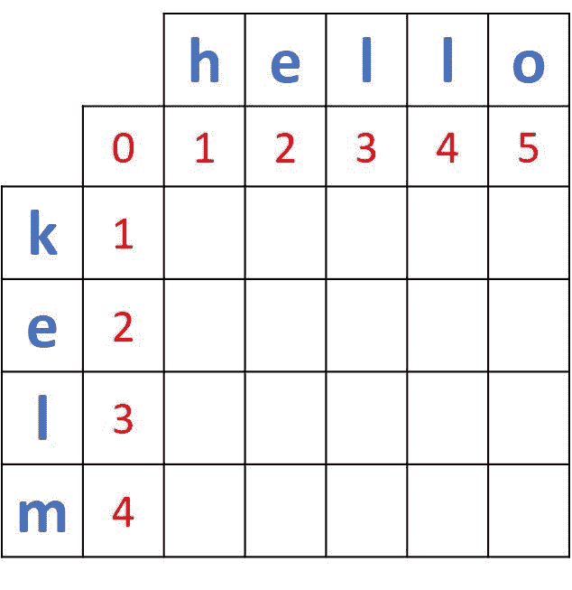

简而言之，添加额外的行和列有助于应用动态编程来计算距离。现在来讨论一下长答案。

记住动态编程就是把一个复杂的问题分解成许多简单的问题。在我们的例子中，复杂的问题是通过填充上面的矩阵来计算 Levenshtein 距离。那么简单的问题呢？

简单的问题是只使用大小为 *2 x 2* 的矩阵，类似于下面给出的矩阵。由于用从`0`开始的数字初始化最左边的列和最上面的行，将总是有三个已经存在的元素，并且只有一个丢失的元素，该元素将总是对应于右下角的元素。

缺失元素的值可以根据这两个选项中的一个来计算(基于被比较的两个前缀是否相似):

1.  3 个现有元素中的最小值:`min(5, 2, 3)=2`。以防两个前缀相同。
2.  3 个现有元素的最小值+ 1 : `min(5, 2, 3) + 1 = 2 + 1 = 3`。以防两个前缀不同。

如果两个前缀相同，则无需做任何事情，因此不会增加额外的成本。当前缀不同时，要应用一个操作(插入、删除或替换)。这就是为什么要增加一笔`1`的额外费用。

通过以这种方式计算所有缺失的元素，将计算出整个距离矩阵。

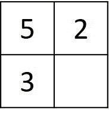

回到我们的问题，这就是为什么我们在距离矩阵中添加额外的行和列。假设要计算两个单词(k 和 h)的前两个前缀之间的距离。根据上面解释的动态编程方法，必须有三个已知值和一个缺失值(在下图中用红色标记)。通过比较 3 个现有值，将计算第四个值。

如果额外的行和列不存在，那么将有 4 个未知值，并且先前的方法在这种情况下将不适用。如果这样的行和列存在，那么将只缺少 1 个值，这就是使用动态编程解决问题的预期结果。

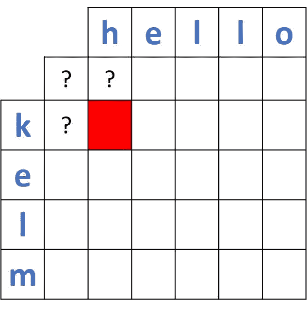

在明确了矩阵中附加行和列的目的之后，是时候填充距离矩阵以获得代表两个单词之间距离的值了。

## **使用动态编程逐步计算 Levenshtein 距离**

在本节中，将填写距离矩阵，以找出位于右下角的两个单词之间的距离。

第一个要计算的距离是两个单词的前两个前缀之间，分别是 **k** 和 **h** 。该操作涉及的 *2 x 2* 矩阵如下图所示。因为两个前缀不同，所以它们之间的距离计算为 3 个现有值(0、1 和 1) + 1 中的最小值。所以，距离是`min(0, 1, 1) + 1 = 0 + 1 = 1`。

距离矩阵由每个计算的距离更新。电流矩阵如下所示。

让我们计算一下第一个单词的第一个前缀 **k** 和第二个单词的第二个前缀**和**之间的距离。如前所述，距离是 2，对于接下来的前缀，我们只需加 1 就可以得到距离 3、4 和 5。这是用这些距离更新后的距离矩阵。

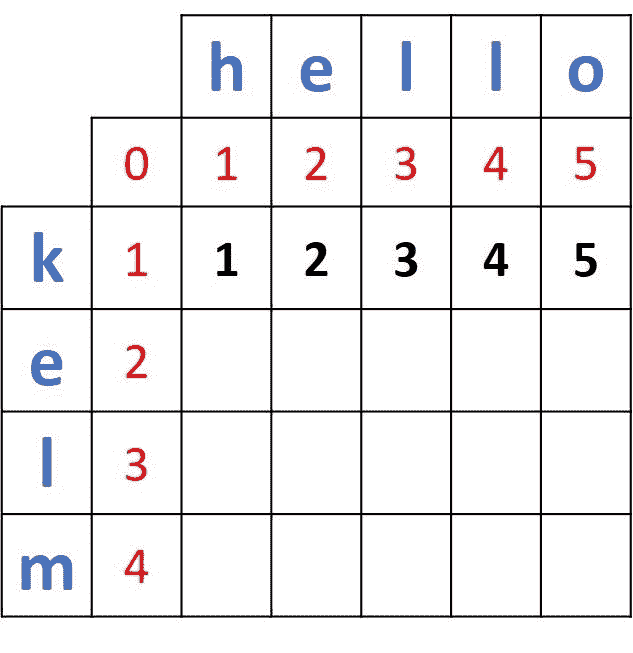

在填充了与单词 **kelo** 的前缀 **k** 对应的行之后，接下来我们将填充与第二个前缀: **ke** 对应的第二行。注意，第二行的标签只是 **e** ，而不是 **ke** 但是它暗示了 ke。例如，第二行的第一个缺失值表示将 **ke** 转换为 **h** 的距离，第二个缺失值表示将 **ke** 转换为 **he** 的距离，第三个缺失值表示将 **ke** 转换为 **hel** 的距离，以此类推。原因是 e 和单词 hello 中前缀之间的距离是根据为前缀 k 计算的距离计算的。

为了计算 **e** 和 **h** 之间的距离，将使用的 2x2 矩阵根据下图高亮显示。因为前缀 e 和 h 不同，所以合成距离等于`min(1, 1, 2) + 1 = 1 + 1 = 2`。

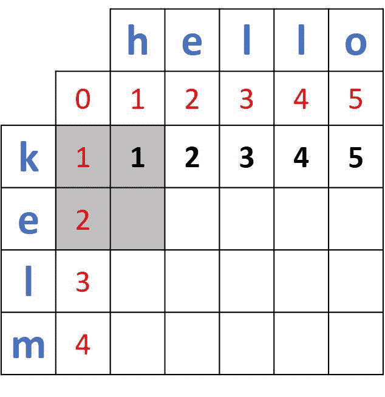

这是添加最近计算的距离后的新矩阵。

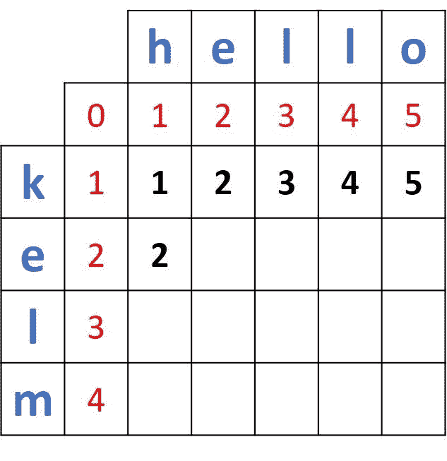

接下来比较 e(来自第一个单词)和 e(来自第二个单词)，这里是突出显示的 2x2 矩阵。

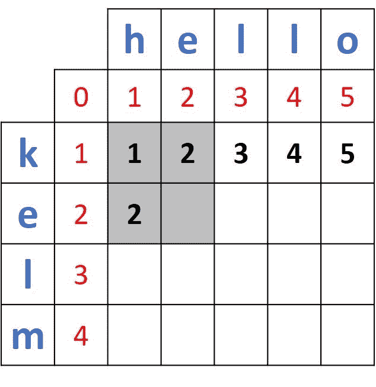

因为两条边(e 和 e)是相同的，所以距离将被计算为 2x2 矩阵中 3 个现有值的最小值。于是，结果就是`min(1, 2, 2) = 1`。下图显示了用新计算的距离更新后的矩阵。

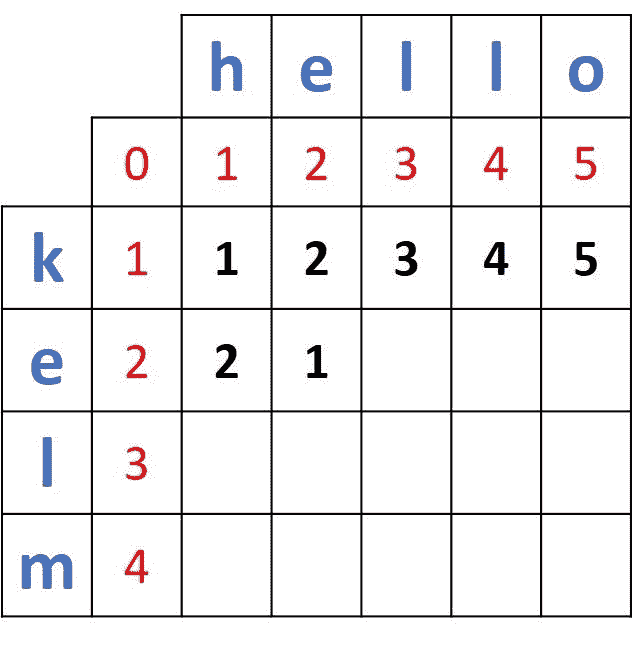

该过程继续，直到对应于“e”的行的所有单元都被填充。

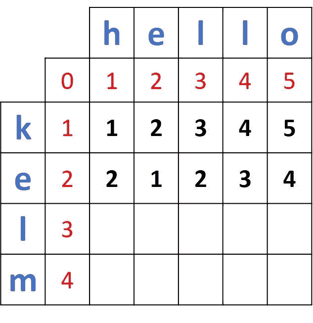

继续这样，完整的距离矩阵如下所示。两个完整单词**凯尔姆**和**你好**之间的距离位于右下角，距离的路径用蓝色标出。右下角单元格的值为 **3** ，这意味着将 **kelm** 转换为 **hello** 需要 3 次编辑。这 3 个编辑是:

1.  用 **h** 替换 **k** 。
2.  用 **l** 替换 **m** 。
3.  插入 **o** 。

这标志着这个例子的结束。

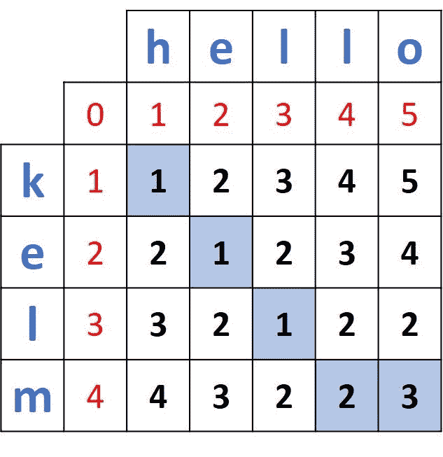

在不展示步骤的情况下，这里是另一个距离矩阵，用于测量单词 **sittmg** 和 **setting** 之间的距离。

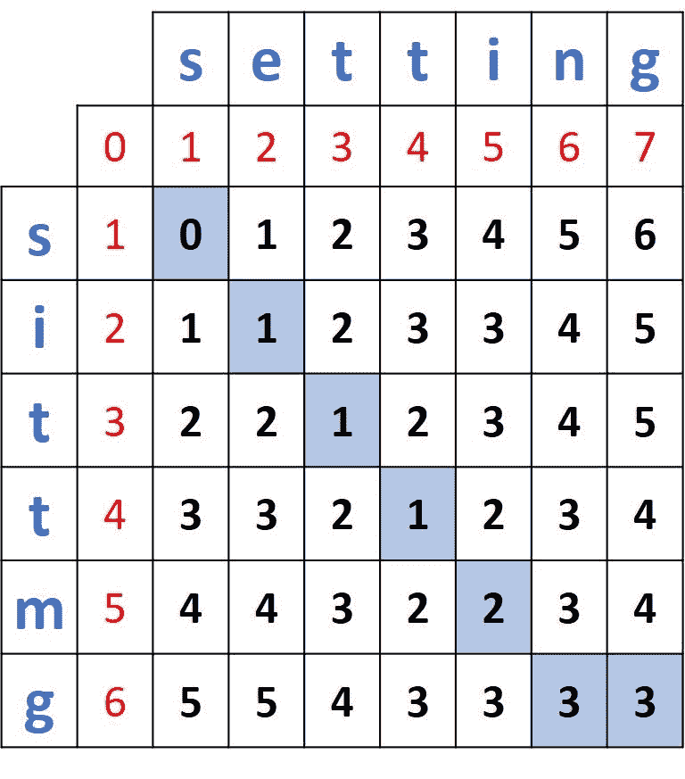

## **结论**

本教程讨论了 Levenshtein 距离，它通过计算将一个单词转换为另一个单词所需的单字符编辑次数来测量两个单词之间的距离。三种可能的编辑是插入、删除和替换。

通过一个实例，说明了用动态规划法计算距离矩阵的具体步骤。该问题被分成计算一个*2×2*矩阵的最小值的小问题。

在下一篇文章中，我们将看到如何使用 Python 实现 Levenshtein 距离。