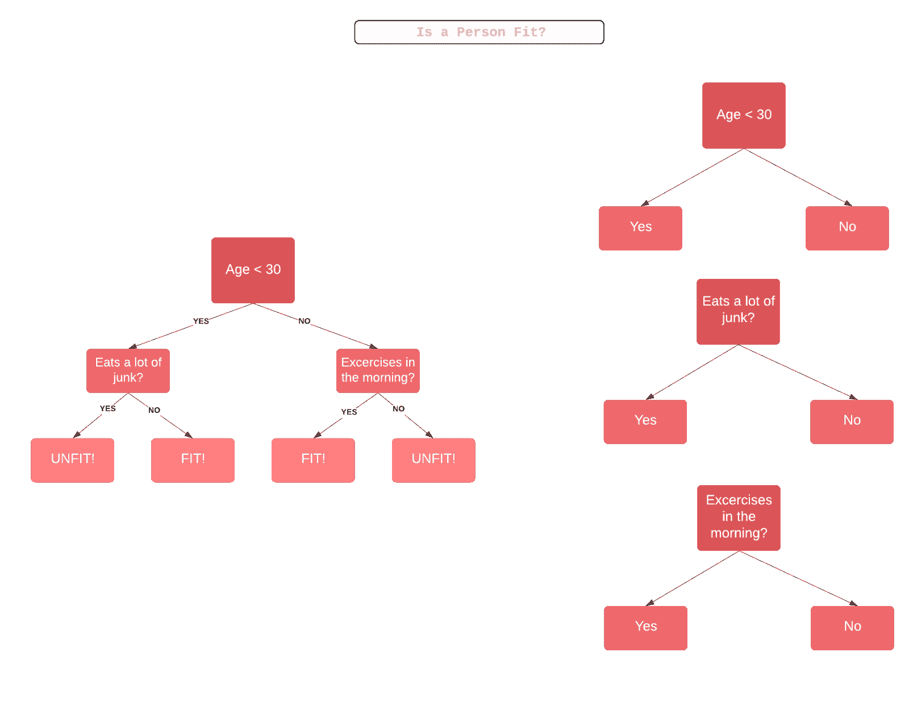
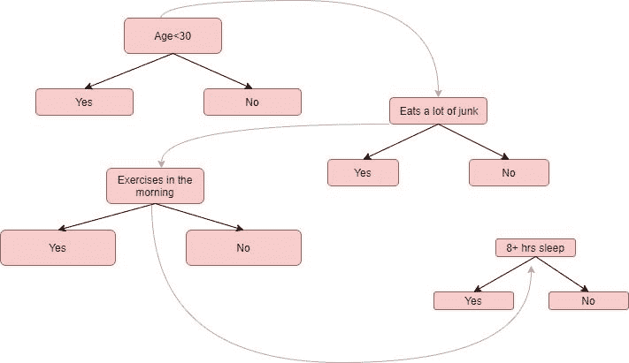
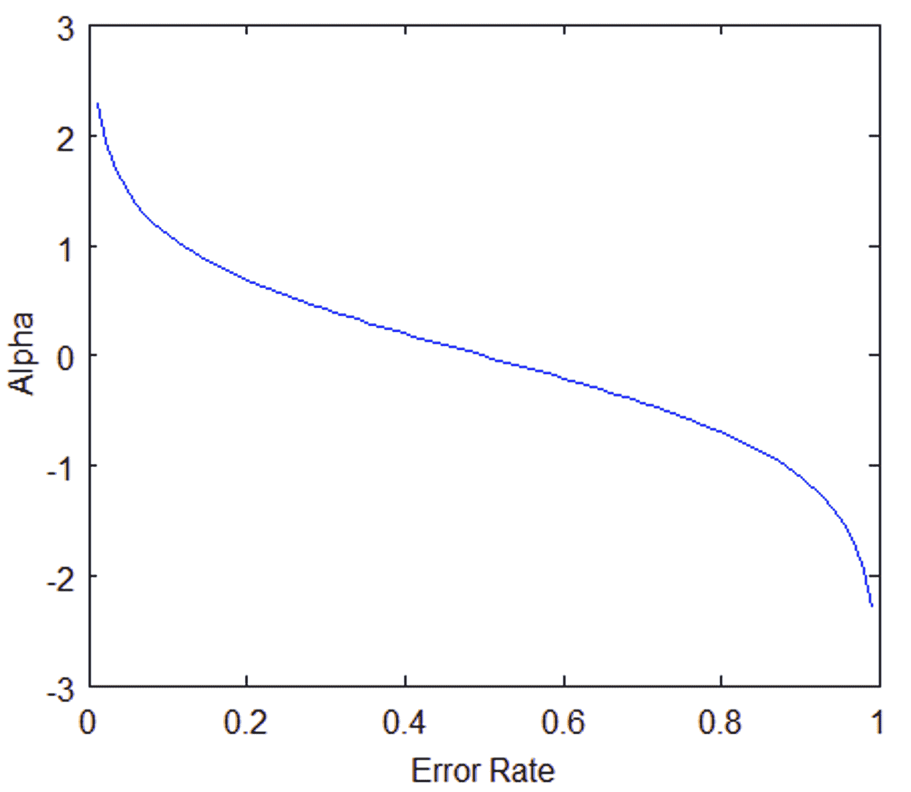

# AdaBoost 指南:助推力挽狂澜

> 原文：<https://blog.paperspace.com/adaboost-optimizer/>

今天，机器学习是重大创新的前提，并有望继续让公司通过准确的预测做出最佳决策。但是，当这些算法的错误敏感度很高且无法解释时，会发生什么呢？

这就是集合学习拯救世界的时候！

AdaBoost 是一种集成学习方法(也称为“元学习”)，最初是为了提高二元分类器的效率而创建的。AdaBoost 使用迭代方法从弱分类器的错误中学习，并将它们变成强分类器。

在本文中，我们将了解以下模块:

*   什么是集成学习？
    *   集合方法的类型
    *   集成方法中的增强
    *   升压算法的类型
*   解开 AdaBoost
*   AdaBoost 的伪代码
*   用 Python 实现 AdaBoost
*   AdaBoost 的优缺点
*   总结和结论

您可以在 [ML Showcase](https://ml-showcase.paperspace.com/projects/ensemble-methods-scikit-learn) 上免费运行本教程的代码。

## 什么是集成学习？

集成学习将几种基本算法结合起来，形成一种优化的预测算法。例如，用于分类的典型[决策树](https://blog.paperspace.com/decision-trees/)采用几个因素，将它们转化为规则问题，并给定每个因素，要么做出决定，要么考虑另一个因素。如果有多个决策规则，决策树的结果可能会变得模糊，例如，如果做出决策的阈值不明确，或者我们输入了新的子因素进行考虑。这是一个人可以随意使用的集合方法。集成方法不是寄希望于一棵决策树来做出正确的判断，而是采用几棵不同的树，并将它们聚合成一个最终的强预测器。

### 集合方法的类型

集合方法可用于各种原因，主要用于:

*   减少差异*(装袋)*
*   降低偏置*(升压)*
*   改进预测*(堆叠)*

集合方法也可以分为两组:

*   **顺序学习器**，不同的模型顺序生成，前一个模型的错误由后一个学习。这旨在通过给错误标记的例子更高的权重来利用模型之间的依赖性(*例如 AdaBoost* )。
*   **并行学习器**，并行生成基础模型。这通过平均化错误来利用模型之间的独立性(*例如[随机森林](https://blog.paperspace.com/random-forests/)T5)。*

### 集成方法中的增强

就像人类从错误中学习，并试图在生活中不再重复错误一样， **Boosting** 算法试图从几个较弱模型的错误中建立一个强学习器(预测模型)。首先，从训练数据创建一个模型。然后，通过尝试减少前一个模型的误差，从前一个模型创建第二个模型。模型会依序加入，每个模型都会修正其前一个模型，直到训练资料预测完美，或加入了最大数量的模型为止。

Boosting 基本上是试图减少当模型无法识别数据中的相关趋势时出现的偏差误差。这是通过评估预测值和实际值之间的差异来实现的。

### 升压算法的类型

1.  **AdaBoost ( **Ada** 感受性**助推** ing)**
2.  **梯度树提升**
3.  **XGBoost**

**在本文中，我们将关注 AdaBoost 的细节，这可能是最流行的升压方法。**

## **解开 AdaBoost**

**AdaBoost ( **Ada** 感受性 **Boost** ing)是一种非常流行的 boosting 技术，旨在组合多个弱分类器来构建一个强分类器。[最初的 AdaBoost 论文](https://www.semanticscholar.org/paper/Experiments-with-a-New-Boosting-Algorithm-Freund-Schapire/68c1bfe375dde46777fe1ac8f3636fb651e3f0f8)由 Yoav Freund 和 Robert Schapire 撰写。**

**单个分类器可能无法准确预测对象的类别，但是当我们将多个弱分类器分组，每个弱分类器从其他错误分类的对象中逐步学习时，我们可以建立一个这样的强模型。这里提到的分类器可以是任何基本的分类器，从决策树(通常是默认的)到逻辑回归，等等。**

**现在我们可能会问，**什么是“弱”量词？**弱分类器是一种性能优于随机猜测的分类器，但在为对象指定类别时性能仍然很差。例如，弱分类器可能预测 40 岁以上的人不能跑马拉松，但低于该年龄的人可以。现在，您可能获得了 60%以上的准确率，但是您仍然会对许多数据点进行错误分类！**

**AdaBoost 本身不是一个模型，而是可以应用在任何分类器之上，从其缺点中学习并提出一个更准确的模型。因此，它通常被称为“**最佳开箱即用分类器**”。**

**让我们试着理解 AdaBoost 是如何处理决策树桩的。**决策树桩**就像随机森林中的树木，但不是“完全成长”它们有**一节和**两片叶子。AdaBoost 使用的是这种树桩的森林，而不是树木。**

**单靠树桩不是做决定的好方法。一棵成熟的树结合了所有变量的决策来预测目标值。另一方面，树桩只能用一个变量来做决定。让我们通过查看几个变量来尝试并逐步理解 AdaBoost 算法的幕后，以确定一个人是否“适合”(健康状况良好)。**

### **AdaBoost 工作原理的示例**

****步骤 1:** 基于加权样本，在训练数据之上制作弱分类器(例如决策树桩)。这里，每个样本的权重表明了正确分类的重要性。最初，对于第一个树桩，我们给所有样本相同的权重。**

**第二步:我们为每个变量创建一个决策树桩，看看每个树桩如何将样本分类到它们的目标类别。例如，在下图中，我们检查了年龄、吃垃圾食品和锻炼。我们会查看每个残肢有多少样本被正确或错误地分类为适合或不适合。**

****步骤 3:** 将更多的权重分配给未正确分类的样本，以便它们在下一个决策树桩中被正确分类。权重也是根据分类器的准确率分配给每个分类器的，也就是说准确率高=权重高！**

****步骤 4:** 从步骤 2 开始重复，直到所有数据点都被正确分类，或者达到最大迭代级别。**

**

*Fully grown decision tree (left) vs three decision stumps (right)*** ****

****注意**:有些树桩在分类中比其他树桩更有发言权。**

## **AdaBoost 背后的数学**

**拽头发的部分来了。让我们一步一步、一个等式一个等式地分解 AdaBoost，以便更容易理解。**

**让我们首先考虑一个数据集中有 N 个点或行的数据集。**

****

**在这种情况下，**

*   **n 是实数的维数，也就是数据集中属性的数量**
*   ***x* 是数据点的集合**
*   ***y* 是为-1 或 1 的目标变量，因为它是一个二元分类问题，表示第一类或第二类(例如，适合与不适合)**

**我们计算每个数据点的加权样本。AdaBoost 为每个训练示例分配权重，以确定其在训练数据集中的重要性。当分配的权重较高时，该组训练数据点可能在训练集中具有更大的发言权。类似地，当分配的权重较低时，它们在训练数据集中的影响最小。**

**最初，所有数据点将具有相同的加权样本 *w* :**

****

**其中 N 是数据点的总数。**

**加权样本的总和始终为 1，因此每个单独权重的值将始终介于 0 和 1 之间。此后，我们使用以下公式计算该分类器在分类数据点时的实际影响:**

****

***Alpha* 是这个残肢在最终分类中会有多大的影响。*总误差*只不过是该训练集的错误分类总数除以训练集大小。我们可以通过插入范围从 0 到 1 的各种总误差*值*来绘制*α*的曲线图。**

**

Alpha vs Error Rate (Source: [Chris McCormick](http://mccormickml.com/2013/12/13/adaboost-tutorial/))** 

**请注意，当一个决策树桩做得很好，或者没有错误分类(一个完美的树桩！)这导致错误率为 0 和相对较大的正 alpha 值。**

**如果残肢只是分类一半正确一半不正确(0.5 的错误率，不比随机猜测好！)那么 alpha 值将为 0。最后，当树桩不停地给出错误分类的结果时(只要做树桩说的相反的事情！)那么α将是一个大的负值。**

**在插入每个树桩的*总误差*的实际值后，是时候更新我们最初为每个数据点取的 *1/N* 的样本权重了。我们将使用以下公式来实现这一点:**

****

**换句话说，新的样本重量将等于旧的样本重量乘以欧拉数，提高到正负α(我们刚刚在上一步中计算)。**

**α的两种情况(正或负)表明:**

*   **当预测和实际输出一致时(样本被正确分类)，Alpha 为正。在这种情况下，我们减少了样品的重量，因为我们已经做得很好了。**
*   **当预测输出与实际类别不一致时(即样本被错误分类)，Alpha 为负。在这种情况下，我们需要增加样本重量，以便在下一个树桩中不会重复相同的错误分类。这就是树桩如何依赖于它们的前辈。**

## **AdaBoost 的伪代码**

```py
`Initially set uniform example weights.

for Each base learner do:
Train base learner with a weighted sample.
Test base learner on all data.
Set learner weight with a weighted error.
Set example weights based on ensemble predictions.
end for` 
```

## **用 Python 实现 AdaBoost**

******第一步:导入模块******

**和往常一样，构建模型的第一步是导入必要的包和模块。**

**在 Python 中，我们有来自 scikit-learn 库中的`AdaBoostClassifier`和`AdaBoostRegressor`类。对于我们的例子，我们将导入`AdaBoostClassifier`(因为我们的例子是一个分类任务)。`train_test_split`方法用于将我们的数据集分成训练集和测试集。我们还导入了`datasets`，从中我们将使用[虹膜数据集](https://scikit-learn.org/stable/auto_examples/datasets/plot_iris_dataset.html)。**

```py
`from sklearn.ensemble import AdaBoostClassifier
from sklearn import datasets
from sklearn.model_selection import train_test_split
from sklearn import metrics` 
```

******第二步:探索数据******

**您可以使用任何分类数据集，但这里我们将使用传统的 Iris 数据集来解决多类分类问题。该数据集包含关于不同类型鸢尾花的四个特征(萼片长度、萼片宽度、花瓣长度、花瓣宽度)。目标是从三种可能性中预测花的类型:Setosa、Versicolour 和 Virginica。该数据集可在 scikit-learn 库中获得，或者您也可以从 [UCI 机器学习库](https://archive.ics.uci.edu/ml/datasets/Iris)下载。**

**接下来，我们通过使用 load_iris()方法从 datasets 包中加载数据来准备好数据。我们将数据赋给 iris 变量。**

**此外，我们将数据集分成输入变量 X，它包含萼片长度、萼片宽度、花瓣长度和花瓣宽度。**

**y 是我们的目标变量，或者我们必须预测的类别:鸢尾、杂色鸢尾或海滨鸢尾。下面是我们数据的一个例子。**

```py
`iris = datasets.load_iris()
X = iris.data
y = iris.target
print(X)
print(Y)

Output:

[[5.1 3.5 1.4 0.2]
 [4.9 3\.  1.4 0.2]
 [4.7 3.2 1.3 0.2]
 [4.6 3.1 1.5 0.2]
 [5.8 4\.  1.2 0.2]
 [5.7 4.4 1.5 0.4]
. . . . 
. . . .
]
[0 0 0 0 0 0 0 0 0 0 0 0 0 0 0 0 0 0 0 0 0 0 0 0 0 0 0 0 0 0 0 0 0 0 0 0 
0 0 0 0 0 0 0 0 0 0 0 0 0 0 1 1 1 1 1 1 1 1 1 1 1 1 1 1 1 1 1 1 1 1 1 1 
1 1 1 1 1 1 1 1 1 1 1 1 1 1 1 1 1 1 1 1 1 1 1 1 1 1 1 1 2 2 2 2 2 2 2 2 
2 2 2 2 2 2 2 2 2 2 2 2 2 2 2 2 2 2 2 2 2 2 2 2 2 2 2 2 2 2 2 2 2 2 2 2 
2 2 2 2 2 2]`
```

******第三步:拆分数据******

**将数据集分割成训练和测试数据集是一个好主意，这样可以查看我们的模型是否正确地对看不见的数据上的数据点进行了分类。**

```py
`X_train, X_test, y_train, y_test = train_test_split(X, y, test_size=0.3)` 
```

**在这里，我们将数据集分为 70%的训练和 30%的测试，这是一个常见的场景。**

******第四步:拟合模型******

**构建 AdaBoost 模型。AdaBoost 默认采用决策树作为学习器模型。我们创建一个 AdaBoostClassifier 对象，并将其命名为 **abc** 。AdaBoost 的几个重要参数是:**

*   ****base_estimator:** 用于训练模型的弱学习器。**
*   ****n_estimators:** 每次迭代中要训练的弱学习器的数量。**
*   ****learning_rate:** 对弱学习者的权重有贡献。它使用 1 作为默认值。**

```py
`abc = AdaBoostClassifier(n_estimators=50,
                         learning_rate=1)` 
```

**然后，我们继续让我们的对象 abc 适合我们的训练数据集。我们称之为模型。**

```py
`model = abc.fit(X_train, y_train)`
```

******第五步:进行预测******

**我们的下一步将是看看我们的模型预测我们的目标值的好坏。**

```py
`y_pred = model.predict(X_test)`
```

**在这一步中，我们进行样本观察，并对看不见的数据进行预测。此外，我们在模型上使用 predict()方法来检查它所属的类。**

******第六步:评估** ing **模型******

**模型精度将告诉我们我们的模型预测正确类别的次数。**

```py
`print("Accuracy:", metrics.accuracy_score(y_test, y_pred))

Output:
Accuracy:0.8666666666666667`
```

**你得到了 86.66%的准确率——还不错。你可以尝试各种其他基础学习者，如支持向量机，逻辑回归，这可能会给你更高的准确性。**

## **AdaBoost 的优缺点**

**AdaBoost 有很多优点，主要是它更容易使用，不像 SVM 算法那样需要调整参数。作为奖励，你也可以使用 SVM AdaBoost。理论上，AdaBoost 不容易过拟合，尽管没有具体的证据证明这一点。这可能是因为参数没有被联合优化的原因——阶段式估计减慢了学习过程。要深入理解其背后的数学原理，你可以跟随这个[链接](https://jeremykun.com/2015/09/21/the-boosting-margin-or-why-boosting-doesnt-overfit)。**

**AdaBoost 可用于提高弱分类器的准确性，从而使其更加灵活。它现在已经扩展到了二元分类之外，并且在文本和图像分类中也有使用案例。**

**AdaBoost 的一些缺点是:**

**助推技术循序渐进地学习，确保你有高质量的数据是很重要的。AdaBoost 对噪声数据和异常值也非常敏感，因此如果您计划使用 AdaBoost，强烈建议您消除它们。**

**AdaBoost 也被证明比 XGBoost 慢。**

## **总结和结论**

**在本文中，我们讨论了理解 AdaBoost 算法的各种方法。我们首先向您介绍集成学习，它有多种类型，以确保您了解 AdaBoost 的确切位置。我们讨论了该算法的优缺点，并给出了一个使用 Python 实现该算法的快速演示。**

**如果使用准确，AdaBoost 就像是提高我们分类算法准确性的福音。这是第一个成功提升二进制分类的算法。AdaBoost 越来越多地用于行业，并在面部识别系统中找到了自己的位置，以检测屏幕上是否有人脸。**

**希望这篇文章能够激发你的好奇心，让你更深入地研究 AdaBoost 和其他各种 Boosting 算法。**

### **参考**

**[https://medium . com/machine-learning-101/https-medium-com-savan Patel-chapter-6-AdaBoost-classifier-b 945 f 330 af 06](https://medium.com/machine-learning-101/https-medium-com-savanpatel-chapter-6-adaboost-classifier-b945f330af06)**

**[https://machine learning mastery . com/Boosting-and-AdaBoost-for-machine-learning/#:~:target text = Boosting 是一个通用系综，第一个模型的错误](https://machinelearningmastery.com/boosting-and-adaboost-for-machine-learning/#:~:targetText=Boosting)。**

**[http://mccormickml.com/2013/12/13/adaboost-tutorial/](http://mccormickml.com/2013/12/13/adaboost-tutorial/)**

**[https://towards data science . com/boosting-and-AdaBoost-clearly-explained-856 e 21152 d3e](https://towardsdatascience.com/boosting-and-adaboost-clearly-explained-856e21152d3e)**

**[https://blog . statsbot . co/Ensemble-learning-D1 DCD 548 e 936 #:~:target text = Ensemble % 20 methods % 20 are % 20 meta-algorithms，或% 20 improve % 20 predictions % 20(stacking)。](https://blog.statsbot.co/ensemble-learning-d1dcd548e936#:~:targetText=Ensemble%20methods%20are%20meta-algorithms,or%20improve%20predictions%20(stacking).)**

**[http://rob.schapire.net/papers/explaining-adaboost.pdf](http://rob.schapire.net/papers/explaining-adaboost.pdf)**

**[https://hacker noon . com/under-the-hood-of-AdaBoost-8eb 499d 78 eab](https://hackernoon.com/under-the-hood-of-adaboost-8eb499d78eab)**