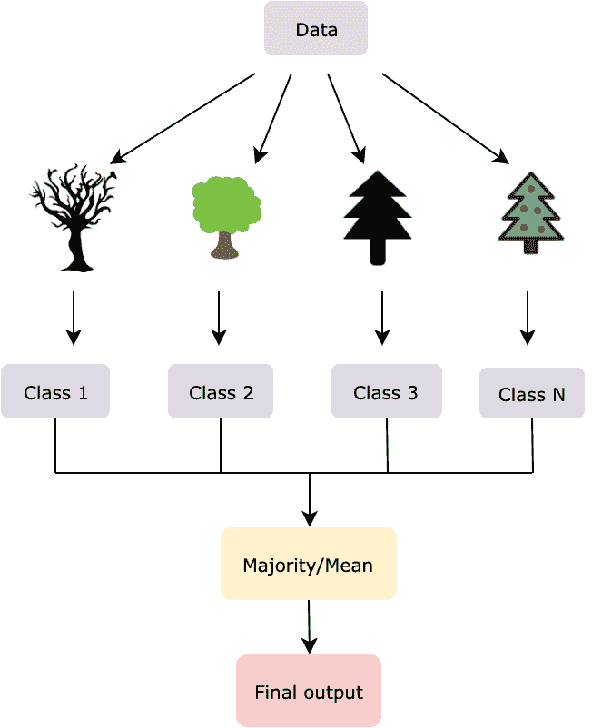
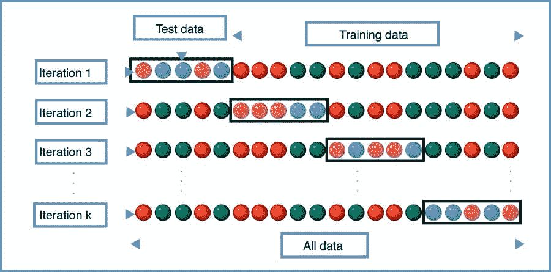
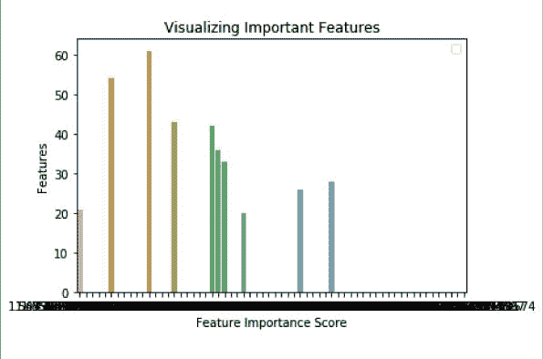

# 随机森林指南:巩固决策树

> 原文：<https://blog.paperspace.com/random-forests/>

**随机森林**算法是最流行的机器学习算法之一，用于分类和回归。执行这两项任务的能力使它独一无二，并增强了它在无数应用程序中的广泛使用。它还在大多数情况下保证了高精度，使其成为最受欢迎的分类算法之一。随机森林由[树**决定**树**树**树](https://blog.paperspace.com/decision-trees/)组成。它的树越多，算法就越复杂。它从树汇集的投票中选择最佳结果，使它变得健壮。让我们看看随机森林工作的内部细节，然后使用 scikit-learn 库用 Python 编写同样的代码。

在本文中，我们将了解以下模块:

*   为什么是随机森林？
    *   决策树的缺点
    *   随机森林的诞生
*   一个实时例子
*   决策树和随机森林的区别
*   随机森林的应用
*   挖掘和理解逻辑
    *   随机森林，一块一块的
    *   计算特征重要性(特征工程)
    *   解码超参数
*   算法编码
*   优点和缺点
*   总结和结论


## 为什么是随机森林？

随机森林是一种**监督机器学习**分类算法。在监督学习中，算法是用带标签的数据训练的，这些数据指导你完成训练过程。使用随机森林算法的主要优势是它支持分类和回归的能力。

如前所述，随机森林使用许多决策树来给你正确的预测。人们普遍认为，由于许多树木的存在，这可能会导致过度适应。然而，这看起来并不像是一个障碍，因为只有最好的预测(投票最多的)会从可能的输出类中挑选出来，从而确保平滑、可靠和灵活的执行。现在，让我们看看随机森林是如何创建的，以及它们是如何克服决策树中存在的缺点而进化的。

### 决策树的缺点

[决策树](https://blog.paperspace.com/decision-trees/)是一个分类模型，它制定了一些特定的规则集，这些规则表明了数据点之间的关系。我们基于一个属性分割观察值(数据点),使得结果组尽可能不同，并且每个组中的成员(观察值)尽可能相似。换句话说，类间距离需要低，类内距离需要高。这是通过各种技术实现的，如信息增益、基尼指数等。

有一些差异会阻碍决策树的顺利实现，包括:

*   当决策树非常深时，可能会导致过度拟合。随着分割节点决策的进展，每个属性都被考虑在内。它试图做到尽善尽美，以便准确地拟合所有的训练数据，因此学习了太多关于训练数据的特征，降低了它的概括能力。
*   决策树是贪婪的，倾向于寻找局部最优解，而不是考虑全局最优解。在每一步，它都使用某种技术来寻找最佳分割。但是，本地的最佳节点可能不是全局的最佳节点。

为了解决这些问题，兰登森林公司来了。

### 随机森林的诞生

创建一个这些树的**组合**似乎是解决上述缺点的一种补救措施。随机森林最初是由[田锦浩](https://web.archive.org/web/20160417030218/http://ect.bell-labs.com/who/tkh/publications/papers/odt.pdf)于 1995 年在贝尔实验室提出的。

大量的采油树可以通过减少在考虑单个采油树时通常出现的误差来超越单个采油树。当一棵树出错时，另一棵树可能表现良好。这是随之而来的一个额外的优势，这种组合被称为随机森林。

随机分割的数据集分布在所有树中，其中每个树集中于它已经被提供的数据。从每棵树上收集投票，选择最受欢迎的类作为最终输出，这是为了分类。在回归中，对所有输出取平均值，并将其视为最终结果。

与决策树不同，在决策树中，性能最佳的功能被作为分割节点，在随机森林中，这些功能是随机选择的。只考虑选择的特征包，并使用随机阈值来创建决策树。



Random Forest

算法是**装袋**的扩展。在 Bagging 技术中，从给定的数据集创建几个数据子集。这些数据集被分离并单独训练。在随机森林中，随着数据的划分，特征也被划分，并且不是所有的特征都用于生长树。这种技术被称为**特征装袋**。每棵树都有自己的一组特征。

## 一个实时例子

考虑一个案例，你想建立一个网站，有一个特定的主题供你选择。比方说，你联系了你的一个朋友来评论这个问题，你决定继续下去。然而，这个结果偏向于你所依赖的一个决定，并且没有探索各种其他的可能性。这就是使用决策树的地方。如果你就同样的问题咨询了一些人，并让他们投票选出最佳主题，那么之前产生的偏见就不会在这里出现了。这是因为在前一种情况下，最推荐的主题优先于唯一可用的选项。这似乎是一个偏差较小且最可靠的输出，是典型的随机森林方法。在下一节中，让我们来看看决策树和随机森林之间的区别。

## 决策树和随机森林的区别

与基于给定数据生成规则的决策树不同，随机森林分类器随机选择特征来构建几个决策树，并对观察到的结果进行平均。此外，过拟合问题是通过获取几个随机的数据子集并将它们提供给各种决策树来解决的。

然而，与随机森林相比，决策树的计算速度更快，因为它易于生成规则。在随机森林分类器中，需要考虑几个因素来解释数据点之间的模式。

## 随机森林的应用

随机森林分类器被用于跨越不同部门的若干应用中，如银行、医药、电子商务等。由于其分类的准确性，其使用逐年增加。

*   顾客行为的识别。
*   遥感。
*   研究股票市场趋势。
*   通过找出共同的模式来识别病理。
*   对欺诈行为和非欺诈行为进行分类。

## 挖掘和理解逻辑

和任何机器学习算法一样，随机森林也包括两个阶段，**训练**和**测试**。一个是森林的创建，另一个是从输入模型的测试数据中预测结果。让我们看看构成伪代码主干的数学。

### 随机森林，一块一块的

**训练**:对于*中的*B*1，2，… B，* ( *B* 为随机森林中的决策树数量)

*   首先，应用 bagging 生成随机数据子集。给定训练数据集， *X* 和 *Y* ，通过替换采样来完成打包，来自 *X，Y，*的 n 个训练示例通过将它们表示为， *X_b* 和 *Y_b* 。
*   从提供的所有功能中随机选择 *N* 个功能。
*   从 *N* 个特征中计算最佳分割节点 *n* 。
*   使用考虑的分割点分割节点。
*   重复以上 3 个步骤，直到生成 *l* 个节点。
*   重复上述 4 个步骤，直到生成 B 个树。

*   **测试**:训练阶段完成后，通过平均所有回归树的输出来预测未知样本的输出，*x’*，


或者在分类的情况下，收集每棵树的投票，将投票最多的类作为最终预测。

可以基于数据集的大小、交叉验证或外差来选择随机森林中的最佳树数( *B* )。让我们来理解这些术语。

**交叉验证**一般用于减少机器学习算法中的过拟合。它获取训练数据，并在 k 表示的多次迭代中使用各种测试数据集对其进行测试，因此得名 **k 倍**交叉验证。这可以告诉我们基于 *k* 值的树的数量。



Cross-validation (Source: https://en.wikipedia.org/wiki/Cross-validation_(statistics))

**出袋误差**是在每个训练样本 x_i 上的平均预测误差，仅使用那些在其引导样本中没有 x_i 的树。这类似于**留一交叉验证**方法。

### 计算特征重要性(特征工程)

从这里开始，让我们了解如何使用 Python 中的 scikit-learn 库对 Random Forest 进行编码。

首先，测量特征的重要性可以更好地概述哪些特征实际上会影响预测。Scikit-learn 提供了一个很好的特性指示器，表示所有特性的相对重要性。这是使用**基尼指数**或**平均杂质减少量** **(MDI)** 计算的，该指数衡量使用该特征的树节点在一个森林中的所有树中减少杂质的程度。

它描述了每个特性在训练阶段所做的贡献，并对所有分数进行了缩放，使其总和为 1。反过来，这有助于筛选出重要的特性，并删除那些对模型构建过程影响不大(没有影响或影响较小)的特性。仅考虑几个特征的原因是为了减少过度拟合，这通常在有大量属性时实现。

### 解码超参数

Scikit-learn 提供了一些与随机森林分类器一起使用的功能或参数，以提高模型的速度和准确性。

*   **n_estimators:** 表示随机森林中树木的数量。树的数量越多，消耗更高计算能力的结果越稳定和可靠。默认值在 0.20 版中为 10，在 0.22 版中为 100。
*   **标准:**衡量分割质量的函数(基尼/熵)。默认值是基尼。
*   **max_depth:** 树的最大深度。这样一直持续到所有的叶子都是纯净的。默认值为无。
*   ******max_features:** 每次分割时要寻找的特征数量。默认值为自动，即 sqrt(特征数量)。****
*   **min_samples_leaf:** 出现在叶节点的最小样本数。默认值为 1。
*   **n _ jobs:**fit 和 predict 函数并行运行的作业数量。默认值为无，即只有 1 个作业。
*   **oob_score:** 是否使用 OOB (out-of-bag)抽样来提高泛化精度。默认值为 False。

## 算法编码

**第一步:探索数据**

首先从 **sklearn** 包中的**数据集**库中，导入 **MNIST** 数据。

```py
from sklearn import datasets

mnist = datasets.load_digits()
X = mnist.data
Y = mnist.target
```

然后通过打印数据集的**数据**(输入)和**目标**(输出)来浏览数据。

```py
Output:

[[ 0\.  0\.  5\. 13\.  9\.  1\.  0\.  0\.  0\.  0\. 13\. 15\. 10\. 15\.  5\.  0\.  0\.  3.
  15\.  2\.  0\. 11\.  8\.  0\.  0\.  4\. 12\.  0\.  0\.  8\.  8\.  0\.  0\.  5\.  8\.  0.
   0\.  9\.  8\.  0\.  0\.  4\. 11\.  0\.  1\. 12\.  7\.  0\.  0\.  2\. 14\.  5\. 10\. 12.
   0\.  0\.  0\.  0\.  6\. 13\. 10\.  0\.  0\.  0.]]
[0] 
```

输入有 64 个值，表示数据中有 64 个属性，输出类标签为 0。为了证明这一点，观察存储数据和目标的 **X** 和 **y** 的形状。

```py
print(mnist.data.shape)
print(mnist.target.shape)

Output:

(1797, 64)
(1797,) 
```

数据集中有 1797 个数据行和 64 个属性。

****第二步:数据预处理****

这一步包括使用**熊猫**创建一个**数据帧**。**目标**和**数据**分别存储在 **y** 和 **X** 变量中。 **pd。序列**用于获取 **int** 数据类型的 1D 数组。这些是属于**类别**数据的一组有限的值。 **pd。DataFrame** 将数据转换成一组表格值。 **head()** 返回数据帧的前五个值。让我们打印它们。

```py
import pandas as pd

y = pd.Series(mnist.target).astype('int').astype('category')
X = pd.DataFrame(mnist.data)

print(X.head())
print(y.head())

Output:

   0    1    2     3     4     5    6    7    8    9  ...    54   55   56  \
0  0.0  0.0  5.0  13.0   9.0   1.0  0.0  0.0  0.0  0.0 ...   0.0  0.0  0.0   
1  0.0  0.0  0.0  12.0  13.0   5.0  0.0  0.0  0.0  0.0 ...   0.0  0.0  0.0   
2  0.0  0.0  0.0   4.0  15.0  12.0  0.0  0.0  0.0  0.0 ...   5.0  0.0  0.0   
3  0.0  0.0  7.0  15.0  13.0   1.0  0.0  0.0  0.0  8.0 ...   9.0  0.0  0.0   
4  0.0  0.0  0.0   1.0  11.0   0.0  0.0  0.0  0.0  0.0 ...   0.0  0.0  0.0   

    57   58    59    60    61   62   63  
0  0.0  6.0  13.0  10.0   0.0  0.0  0.0  
1  0.0  0.0  11.0  16.0  10.0  0.0  0.0  
2  0.0  0.0   3.0  11.0  16.0  9.0  0.0  
3  0.0  7.0  13.0  13.0   9.0  0.0  0.0  
4  0.0  0.0   2.0  16.0   4.0  0.0  0.0  

[5 rows x 64 columns]
0    0
1    1
2    2
3    3
4    4
dtype: category
Categories (10, int64): [0, 1, 2, 3, ..., 6, 7, 8, 9] 
```

使用从 **sklearn** 下的 **model_selection** 包导入的 **train_test_split** 将输入( **X** )和输出( **y** )分离成训练和测试数据。 **test_size** 表示 70%的数据点属于训练数据，30%属于测试数据。

```py
from sklearn.model_selection import train_test_split

X_train, X_test, y_train, y_test = train_test_split(X, y, test_size=0.3) 
```

**X_train** 是训练数据中的输入。

**X_test** 是测试数据中的输入。

**y_train** 是训练数据中的输出。 **y_test** 是测试数据中的输出。

**步骤 3:创建分类器**

使用从 **sklearn** 中的**系综**包中获取的 **RandomForestClassifier** 在训练数据上训练模型。 **n_estimators** 参数表示随机森林中要包含 100 棵树。 **fit()** 方法是通过在 **X_train** 和 **y_train** 上训练模型来拟合数据。

```py
from sklearn.ensemble import RandomForestClassifier

clf=RandomForestClassifier(n_estimators=100)
clf.fit(X_train,y_train) 
```

使用应用于 **X_test** 数据的 **predict()** 方法预测输出。这给出了存储在 **y_pred** 中的预测值。

```py
y_pred=clf.predict(X_test)
```

使用从 **sklearn** 中的**度量**包导入的 **accuracy_score** 方法检查准确性。根据实际值( **y_test** )和预测值( **y_pred** )来估计精度。

```py
from sklearn.metrics import accuracy_score

print("Accuracy: ", accuracy_score(y_test, y_pred))

Output:

Accuracy:  0.9796296296296296 
```

这给出了 **97.96%** 作为训练的随机森林分类器的估计精度。的确是个好成绩！

**步骤 4:估计特征重要性**

在前面的章节中，已经提到特征重要性是随机森林分类器的一个重要特征。现在让我们来计算一下。

**feature_importances_** 由 **sklearn** 库提供，作为 **RandomForestClassifier** 的一部分。提取值，然后按降序排序，首先打印最重要的值。

```py
feature_imp=pd.Series(clf.feature_importances_).sort_values(ascending=False)
print(feature_imp[:10])

Output:

21    0.049284
43    0.044338
26    0.042334
36    0.038272
33    0.034299
dtype: float64 
```

左栏表示属性标签，即第 26 个属性、第 43 个属性等等，右栏是表示特征重要性的数字。

**步骤 5:可视化特征重要性**

导入库 **matplotlib.pyplot** 和 **seaborn** 来可视化上述特征重要性输出。给出输入和输出值，其中 **x** 由特征重要性值给出， **y** 分别是 64 个属性中最重要的 10 个特征。

```py
import matplotlib.pyplot as plt
import seaborn as sns

%matplotlib inline
sns.barplot(x=feature_imp, y=feature_imp[:10].index)
plt.xlabel('Feature Importance Score')
plt.ylabel('Features')
plt.title("Visualizing Important Features")
plt.legend()
plt.show() 
```



Features vs Feature Importance Score

## 优点和缺点

虽然随机森林可用于分类和回归，但它在以下方面优于其他算法:

*   这是一种稳健且通用的算法。
*   它可用于处理给定数据中缺失的值。
*   它可以用来解决无监督的最大似然问题。
*   理解算法是一件轻而易举的事。
*   默认超参数用于给出良好的预测。
*   解决了过拟合问题。
*   它可以用作特征选择工具。
*   它能很好地处理高维数据。

一些不利因素伴随着优势，

*   这在计算上是昂贵的。
*   这很难解释。
*   大量的树木需要大量的时间。
*   创建预测通常很慢。

## 总结和结论

Random Forest 的简单性、多样性、健壮性和可靠性胜过其他可用的算法。通过调整超参数和选择关键特征，它为提高模型的精度提供了很大的空间。

本文从描述决策树如何经常充当绊脚石，以及随机森林分类器如何拯救开始。继续，差异和实时应用的探索。后来，通过同时探索其中的数学味道，伪代码被分解成不同的阶段。在下一节中，我们将介绍实际的编码经验。

还有很多，随机森林是解决机器学习可解决问题的一种方式。

### 参考

[https://towards data science . com/understanding-random-forest-58381 e 0602d 2](https://towardsdatascience.com/understanding-random-forest-58381e0602d2)

[https://synced review . com/2017/10/24/how-random-forest-algorithm-works-in-machine-learning/](https://syncedreview.com/2017/10/24/how-random-forest-algorithm-works-in-machine-learning/)

[https://builtin.com/data-science/random-forest-algorithm](https://builtin.com/data-science/random-forest-algorithm)

[https://www . data camp . com/community/tutorials/random-forests-classifier-python](https://www.datacamp.com/community/tutorials/random-forests-classifier-python)

[https://en.wikipedia.org/wiki/Random_forest](https://en.wikipedia.org/wiki/Random_forest)

[https://en.wikipedia.org/wiki/Out-of-bag_error](https://en.wikipedia.org/wiki/Out-of-bag_error)

[https://sci kit-learn . org/stable/modules/generated/sk learn . ensemble . randomforestclassifier . html](https://scikit-learn.org/stable/modules/generated/sklearn.ensemble.RandomForestClassifier.html)