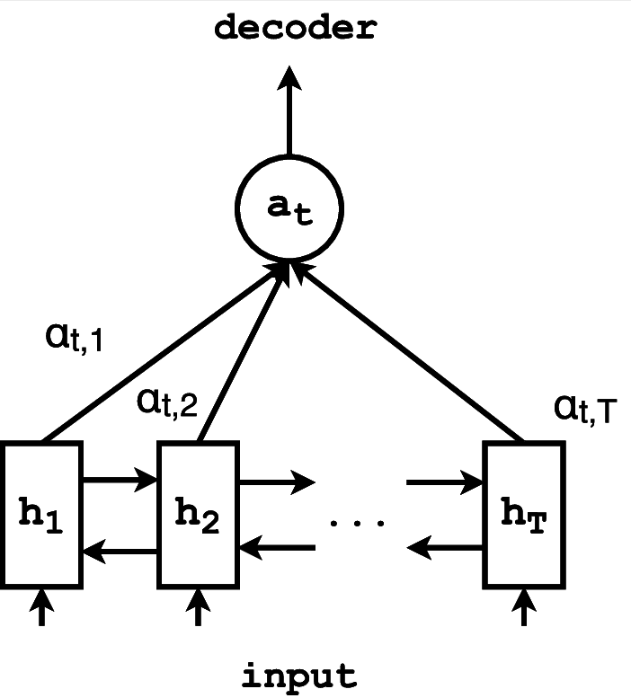
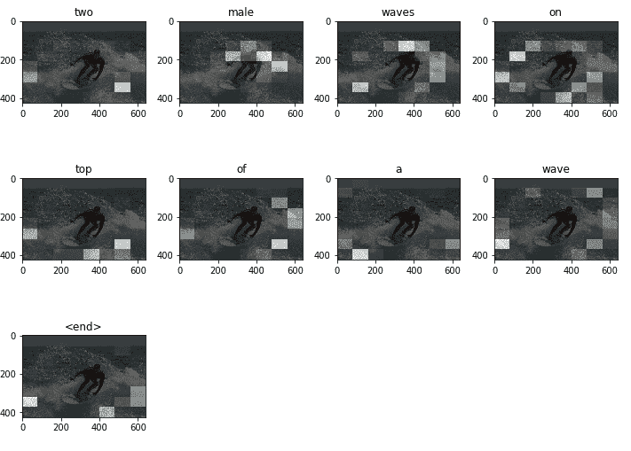

# 人工智能图像字幕

> 原文：<https://blog.paperspace.com/image-captioning-with-ai/>

在人工智能领域，一个真正引起许多人注意的应用是图像字幕。如果你仔细想想，似乎没有办法告诉一堆数字来为一幅图像提供一个准确描述它的标题。现在，借助深度学习的力量，我们可以比我们想象的更准确地实现这一点。

为图像编写标题的问题有两个方面:你需要通过提取相关特征来理解图像的含义，还需要将这些特征转换成人类可读的格式。在本教程中，我们将分别研究这两个阶段，然后将各个部分连接在一起。我们将从特征提取阶段开始。

本教程的灵感来自于关于图像字幕的 TensorFlow 教程。对于本教程，我们将使用 [COCO](http://cocodataset.org/#home) 数据集(CommonOobjects inContext)，它由超过 200k 个带标签的图像组成，每个图像配有五个标题。

您可以使用免费的 GPU 和 Jupyter 笔记本在 [ML Showcase](https://ml-showcase.paperspace.com/projects/image-captioning-with-keras) 上运行本教程的代码。

## 步骤 1:图像特征提取

对于给定的图像，总是有可能存在几乎不能以任何方式描述图像的冗余元素。例如，赛马图像上的水印实际上并不能告诉我们图像本身的任何信息。我们需要一种算法，能够提取有用的特征，并省去多余的特征，比如本例中的水印。几年前，我可能不会写这篇教程，因为用于特征提取的方法需要大量的数学和特定领域的专业知识。随着深度学习方法的出现，现在可以用最少的努力和时间来执行特征提取，同时仅用在许多图像上训练过的单个神经网络来实现更强的鲁棒性。

但是，等等，我们如何获得如此大量的图像来制作一个令人难以置信的基于神经网络的特征提取器呢？感谢[迁移学习](https://machinelearningmastery.com/transfer-learning-for-deep-learning/)，或者使用预先训练的模型对新的和不同的问题进行推理的能力，我们不需要一张图片就可以开始。有许多规范的卷积网络模型已经在数百万张图像上进行了训练，比如 [ImageNet](http://www.image-net.org/) 。我们所要做的就是切掉这些网络中与任务相关的部分，这样我们就有了一个非常强大的特征提取器。

当我们实际上更深入地挖掘这些网络的层时，我们观察到每一层在训练期间以某种方式被分派任务来提取特定的特征。因此，我们在一个网络中有一堆特征提取器。在本教程中，我们将使用由 Google 开发的强大模型 Inception v3 作为我们的特征提取器。我们只需要三行 Keras 代码就可以获得这个模型。

```py
image_model = tf.keras.applications.InceptionV3(include_top=False,
                                                weights='imagenet')
new_input = image_model.input
hidden_layer = image_model.layers[-1].output 
```

由于无论历元或迭代如何，每个影像都将具有唯一的要素表示，因此建议将所有影像通过要素提取器运行一次，并将提取的要素缓存在磁盘上。这节省了大量时间，因为我们不需要在每个时期通过特征提取器执行前向传播。特征提取过程的概括工作流程如下:

*   获得特征提取模型(在这种情况下，我们使用 Inception V3)
*   使用`tf.data`加载图像数据集
*   缓存所有图像通过特征提取器一次获得的所有特征

在代码中，这看起来像:

```py
def load_image(image_path):
    img = tf.io.read_file(image_path)
    img = tf.image.decode_jpeg(img, channels=3)
    img = tf.image.resize(img, (299, 299))
    img = tf.keras.applications.inception_v3.preprocess_input(img)
    return img, image_path

encode_train = sorted(set(img_name_vector))

# use the tf.data api to load image dataset from directory into batches
image_dataset = tf.data.Dataset.from_tensor_slices(encode_train)
image_dataset = image_dataset.map(
  load_image, num_parallel_calls=tf.data.experimental.AUTOTUNE).batch(16)

# iterate through batches of image dataset and extract features using our feature extractor(image_features_extract_model) by doing a forward propagation.
# this is going to take some time
for img, path in image_dataset:
  batch_features = image_features_extract_model(img)
  batch_features = tf.reshape(batch_features,
                              (batch_features.shape[0], -1, batch_features.shape[3]))

# iterate through batches of features obtained from feature extractor and store in a serialized format.
for bf, p in zip(batch_features, path):
    path_of_feature = p.numpy().decode("utf-8")
    np.save(path_of_feature, bf.numpy())
```

现在我们已经完成了字幕任务的第一阶段，我们进入第二阶段，处理文本。这个阶段还使用神经网络，特别是用一些机制改进的递归神经网络(RNN ),以增加将特征翻译成语言的鲁棒性。

## 第二步:解码阶段

### 自然语言处理

我必须承认，这是最乏味的部分，但我们将保持简单明了。这里我们要做的第一件事是用四个简单的步骤处理我们的文本数据集:

*   修剪和简化数据集
*   将文本数据标记化
*   填充单词序列
*   使用`tf.data` API 对数据集进行批处理，并将其分成训练集和验证集

让我们看看实现这一点的代码。

**注意:阅读代码中的注释，了解每一行的解释。**

```py
top_k = 5000

# Create a tokenizer object from keras
tokenizer = tf.keras.preprocessing.text.Tokenizer(num_words=top_k,
                                                  oov_token="<unk>",
                                                  filters='!"#$%&()*+.,-/:;=?@[\]^_`{|}~ ')
# Creates a vocabulary with words from the caption dataset
tokenizer.fit_on_texts(train_captions)

# Convert each word into a unique integer
train_seqs = tokenizer.texts_to_sequences(train_captions)

# Assign token for pad
tokenizer.word_index['<pad>'] = 0
tokenizer.index_word[0] = '<pad>'

# Pads sentences. How? It calcuates the length of the longest sentence and fills the deficit of the other shorter sentences with zeros. This is to make batching possible.
cap_vector = tf.keras.preprocessing.sequence.pad_sequences(train_seqs, padding='post')

# Split each dataset into training and validation sets. Note that we're splitting both the image dataset and caption dataset.
# An image in image_name_train will correspond to its caption in cap_train.
img_name_train, img_name_val, cap_train, cap_val = train_test_split(img_name_vector,
                                                                    cap_vector,
                                                                    test_size=0.2,
                                                                    random_state=0)
dataset = tf.data.Dataset.from_tensor_slices((img_name_train, cap_train))

# Load the serialized numpy files that we stored on disk earlier
def map_func(img_name, cap):
    img_tensor = np.load(img_name.decode('utf-8')+'.npy')
    return img_tensor, cap

# Use map to load the numpy files in parallel
dataset = dataset.map(lambda item1, item2: tf.numpy_function(
          map_func, [item1, item2], [tf.float32, tf.int32]),
          num_parallel_calls=tf.data.experimental.AUTOTUNE)
BATCH_SIZE = 64
BUFFER_SIZE = 1000

# Shuffle and batch
dataset = dataset.shuffle(BUFFER_SIZE).batch(BATCH_SIZE)

# Prefetching ensures that resources don't go idle during training process. To put this another way, while the model is executing time step t, the input pipeline is loading data for time step t+1.
dataset = dataset.prefetch(buffer_size=tf.data.experimental.AUTOTUNE)
```

既然我们已经建立了所有的数据集，让我们继续建立我们的第二个网络，一个语言模型。之前我提到过，我们的模型将通过一个注意力机制得到增强。这就是我们现在要做的。

### 注意机制

注意力机制的整个概念非常直观。注意力机制变得非常流行的一个热门领域是神经机器翻译，机器翻译中注意力机制背后的想法与图像字幕中的想法非常相似。在机器翻译中，我们试图将一个句子从一种语言翻译成另一种语言，当解码单个单词(在输出句子中)时，我们希望“注意”输入句子中与我们正在解码的单个单词语义相关的一些特定单词。



Source: [Neural Morphological Analysis: Encoding-Decoding Canonical Segments](https://www.researchgate.net/publication/312417239_Neural_Morphological_Analysis_Encoding-Decoding_Canonical_Segments)

如果你想更多地了解注意力机制是如何工作的，或者如果你在理解下面的代码方面有任何困难，请查看我之前关于[神经机器翻译](https://blog.paperspace.com/neural-machine-translation-with-tensorflow/)的帖子。

```py
# Bahdanau is one variant of the attention mechanism.
# The other variant is the Luong attention.

class BahdanauAttention(tf.keras.Model):
  def __init__(self, units):
    super(BahdanauAttention, self).__init__()
    self.W1 = tf.keras.layers.Dense(units)
    self.W2 = tf.keras.layers.Dense(units)
    self.V = tf.keras.layers.Dense(1)

  def call(self, features, hidden):
    # features(CNN_encoder output) shape == (batch_size, 64, embedding_dim)

    # hidden shape == (batch_size, hidden_size)
    # hidden_with_time_axis shape == (batch_size, 1, hidden_size)
    hidden_with_time_axis = tf.expand_dims(hidden, 1)

    # score shape == (batch_size, 64, hidden_size)
    score = tf.nn.tanh(self.W1(features) + self.W2(hidden_with_time_axis))
                      (batch_size,64,hidden_size) + (batch_size,1,hidden_size)
    # attention_weights shape == (batch_size, 64, 1)
    # You get 1 at the last axis because you are applying score to self.V
    attention_weights = tf.nn.softmax(self.V(score), axis=1)

    # context_vector shape after sum == (batch_size, hidden_size)
    context_vector = attention_weights * features
    context_vector = tf.reduce_sum(context_vector, axis=1)

    return context_vector, attention_weights
```

回想一下，我们的特征提取器的输出是形状 *batch_size*8*8*2048* (这是紧接在分类层之前的初始网络的最后一层的输出形状)。我们要把这个折叠成一个*【batch _ size * 64 * 2048】(8 * 8 = 64)*特征张量，通过一个具有 ReLU 激活函数的单层线性网络传递。这应该输出一个形状为*batch _ size * 64 * embedding _ size*的张量，其中嵌入大小是我们设置的任意整数(但一定要保持较低)。线性层的输出是我们输入到用注意力机制改造的循环网络中的内容。

```py
class CNN_Encoder(tf.keras.Model):
    def __init__(self, embedding_dim):
        super(CNN_Encoder, self).__init__()
        # shape after fc == (batch_size, 64, embedding_dim)
        self.fc = tf.keras.layers.Dense(embedding_dim)

    def call(self, x):
        x = self.fc(x)
        x = tf.nn.relu(x)
        return x
```

最后让我们把注意力网络和循环网络结合起来。

```py
class RNN_Decoder(tf.keras.Model):
  def __init__(self, embedding_dim, units, vocab_size):
    super(RNN_Decoder, self).__init__()
    self.units = units

    self.embedding = tf.keras.layers.Embedding(vocab_size, embedding_dim)
    self.gru = tf.keras.layers.GRU(self.units,
                                   return_sequences=True,
                                   return_state=True,
                                   recurrent_initializer='glorot_uniform')
    self.fc1 = tf.keras.layers.Dense(self.units)
    self.fc2 = tf.keras.layers.Dense(vocab_size)

    self.attention = BahdanauAttention(self.units)

  def call(self, x, features, hidden):
    # defining attention as a separate model
    context_vector, attention_weights = self.attention(features, hidden)

    # x shape after passing through embedding == (batch_size, 1, embedding_dim)
    x = self.embedding(x)

    # x shape after concatenation == (batch_size, 1, embedding_dim + hidden_size)
    x = tf.concat([tf.expand_dims(context_vector, 1), x], axis=-1)

    # passing the concatenated vector to the GRU
    output, state = self.gru(x)

    # shape == (batch_size, max_length, hidden_size)
    x = self.fc1(output)

    # x shape == (batch_size * max_length, hidden_size)
    x = tf.reshape(x, (-1, x.shape[2]))

    # output shape == (batch_size * max_length, vocab)
    x = self.fc2(x)

    return x, state, attention_weights

  def reset_state(self, batch_size):
    return tf.zeros((batch_size, self.units))

encoder = CNN_Encoder(embedding_dim)
decoder = RNN_Decoder(embedding_dim, units, vocab_size) 
```

现在我们有了一个完整的模型，剩下的步骤就是通常的机器学习训练和验证步骤。我假设你熟悉模型训练和梯度下降(如果不熟悉，查看[这篇文章](https://blog.paperspace.com/intro-to-optimization-in-deep-learning-gradient-descent/))所以从这里我将进入验证阶段。

### 确认

与其他机器学习验证管道不同，在这种情况下，我们不会根据某个指标来验证我们的模型。相反，我们将根据它是否生成了正确的标题来验证我们的模型，最重要的是，它在生成这些标题时是否注意到了正确的特征。我们可以通过将为特定图像生成标题时生成的注意力矩阵权重叠加在图像本身上来实现这一点。这会产生一个带有一些斑点的图像，这些斑点表明网络在生成字幕时关注的是什么。让我们看一些例子。



密切注意上面有“男性”的图像。你可以清楚地看到，大部分的白盒都以不同的强度聚集在冲浪板上的那个人身上。这些白色方框表示网络正在关注图像中的这些区域；强度越大，网络越关注该区域。解码字幕使用贪婪搜索算法，如下面的代码所示。其工作原理是将特定时间步的解码字作为输入输入到下一个时间步。通过使用比贪婪搜索算法更健壮的波束搜索解码器，可以引入解码字幕的进一步改进，但是实现起来有点复杂。下面还包含了显示注意力权重重叠的图像的代码。

```py
def evaluate(image):
    attention_plot = np.zeros((max_length, attention_features_shape))

    hidden = decoder.reset_state(batch_size=1)

    temp_input = tf.expand_dims(load_image(image)[0], 0)
    img_tensor_val = image_features_extract_model(temp_input)
    img_tensor_val = tf.reshape(img_tensor_val, (img_tensor_val.shape[0], -1, img_tensor_val.shape[3]))

    features = encoder(img_tensor_val)

    dec_input = tf.expand_dims([tokenizer.word_index['<start>']], 0)
    result = []

    for i in range(max_length):
        predictions, hidden, attention_weights = decoder(dec_input, features, hidden)

        attention_plot[i] = tf.reshape(attention_weights, (-1, )).numpy()

        predicted_id = tf.random.categorical(predictions, 1)[0][0].numpy()
        result.append(tokenizer.index_word[predicted_id])

        if tokenizer.index_word[predicted_id] == '<end>':
            return result, attention_plot

        dec_input = tf.expand_dims([predicted_id], 0)

    attention_plot = attention_plot[:len(result), :]
    return result, attention_plot

def plot_attention(image, result, attention_plot):
    temp_image = np.array(Image.open(image))

    fig = plt.figure(figsize=(10, 10))

    len_result = len(result)
    for l in range(len_result):
        temp_att = np.resize(attention_plot[l], (8, 8))
        ax = fig.add_subplot(len_result//2, len_result//2, l+1)
        ax.set_title(result[l])
        img = ax.imshow(temp_image)
        ax.imshow(temp_att, cmap='gray', alpha=0.6, extent=img.get_extent())

    plt.tight_layout()
    plt.show() 
```

这是本教程的总结。

## 后续步骤

1.  在不同的数据集上尝试你的模型，比如 [Flickr](https://www.kaggle.com/hsankesara/flickr-image-dataset) 数据集。
2.  将你的知识扩展到不同的领域，比如神经机器翻译。你可以在这里查看我的教程。
3.  尝试不同的架构，比如 transformer network，它也使用注意力(在这种情况下是自我注意力)。