# 2020 年合成媒体指南

> 原文：<https://blog.paperspace.com/2020-guide-to-synthetic-media/>

合成媒体是一个令人兴奋的新研究领域，在过去的几年里取得了巨大的进步。这个领域有可能彻底改变我们创作和消费内容的方式。

这篇文章是关于不同类型的合成媒体的初级读本。然后，我们将更深入地研究合成视频，包括它的应用和对塑造该领域的最新研究的文献综述。

## 什么是合成媒体？

合成媒体包括人工生成的视频、语音、图像或文本，其中人工智能承担了部分(或全部)创作过程。这属于合成、人工或虚拟现实(照片逼真的 AR/VR)的更广泛的领域。这是一个非常新的和令人兴奋的空间。

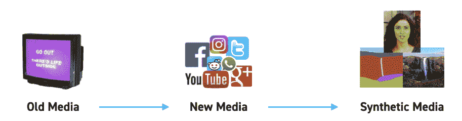

Evolution of Media (Image credit: https://vriparbelli.medium.com/our-vision-for-the-future-of-synthetic-media-8791059e8f3a)

在过去的几年里，深度学习取得了重大的学术进步，而生成性对抗网络(GANs)加速了合成媒体的发展。这导致合成媒体的质量迅速提高，很快它可能就和传统媒体没什么区别了。

## 你为什么要在乎？

因为未来是合成的。

在这十年里，我们的日常生活中会出现大量合成媒体。合成媒体将特别在三个领域带来根本性的转变:**媒体创作**、**许可和所有权**以及**验证。**

在**媒体创造**中，合成媒体有能力彻底革新消费媒体的面貌，改变我们消费和创造的媒体。你可能会想，为什么会这样？合成媒体将大大加快创造力，缩小想法和内容之间的差距。它将带来新的交流和讲故事的方法。它将使内容生产民主化，让我们能够最大限度地发挥人类的创造力。

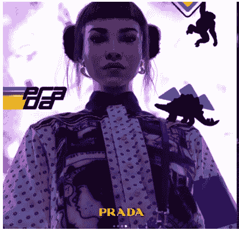

A Virtual Influencer, "Lil Miquela," Endorsing Prada

许可和所有权也将发生巨大变化。必须为合成视频和声音制定新的法律。传统上，演员的报酬来自他们的时间、外貌和个人品牌。在不久的将来，你将能够创作一部由布拉德·皮特主演的电影，而实际上他并不在片场。谁为此获得报酬——布拉德·皮特，还是幕后的技术人员？多少钱？

像 Icons8 和 T2 rose bud AI T3 这样的公司给予用户前所未有的力量，让他们在几分钟内创建自己多样的定制照片。这就不需要像 Shutterstock 或 Getty Images 这样的公司了。Icons8 还有一系列由人工智能生成的[免版税音乐](https://icons8.com/music)。

哪里有好的潜力，哪里就有滥用的潜力。我们需要小心这项技术，并验证所有类型的媒体。像 Deeptrace 和 T2 这样的公司致力于检测有害的合成视频。这将变得更具挑战性，因为真实和合成之间的界限变得模糊。我想象的现实是，每种媒体都将被打上水印和指纹，也就是说，拥有一个经过验证的标签，就像社交媒体上经过验证的账户一样。

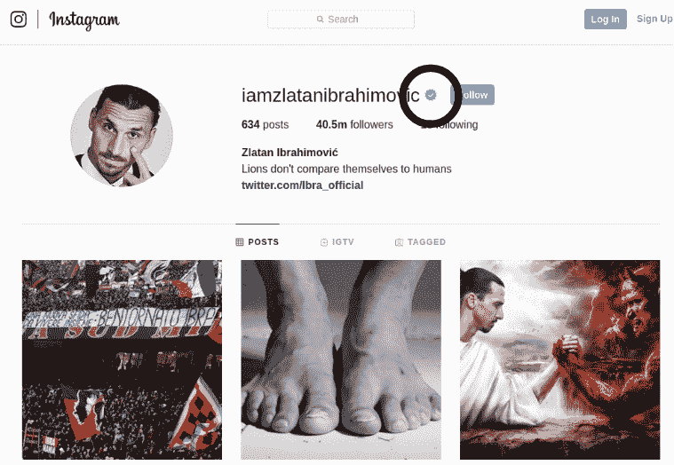

The Verified Instagram Account of Zlatan Ibrahimović

我们正在步入一个激动人心的未来。

在下一部分，我将探索一些流行和值得注意的例子，这样你就可以对 2020 年的合成媒体前景有一个清晰的概念。

## 示例和应用

### 合成现实

[**Lil Miquela**](https://www.instagram.com/lilmiquela/?hl=en) **等虚拟替身。Lil Miquela 是世界上最受欢迎的虚拟影响者，在 Instagram 上拥有 180 万粉丝。她为卡尔文·克莱恩(Calvin Klein)和欧莱雅(Loreal)等品牌拍摄广告，与贝拉·哈迪德和 J·巴尔文(他们是真正的名人)一起出现在[视频](https://www.youtube.com/watch?v=9-KhO0EqMg0)中，她也有自己的[音乐视频。](https://www.youtube.com/watch?v=2gnHYLRtCGk) ***然而，她不是真正的*** 。Lil Miquela 是由来自 Brud 的虚拟特效艺术家团队创建的 3D 模型。像她这样的虚拟影响者(it？)已经变得非常有名，并将继续受欢迎。**

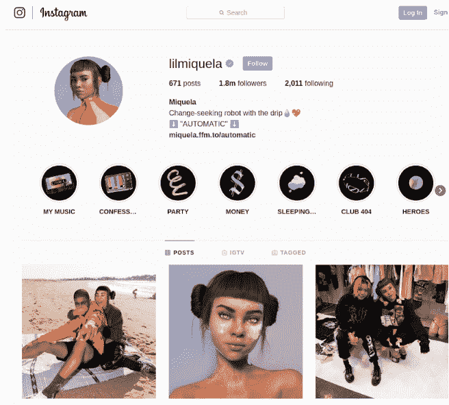

Lil Miquela's Instagram

### 动画/游戏和混合现实

鉴于游戏和混合现实市场的增长速度，用于创建和编辑 2D 和 3D 动画的人工智能工具正在兴起，需求巨大。它们有可能彻底改变创造角色、场景和其他动画/虚拟元素的过程。RADiCAL 就是这样一家公司，它允许用户仅从 iPhone 视频中创建自己的 3D 动画。你通常需要一个非常昂贵的动作捕捉设备，配有紧身衣和动作捕捉相机，才能制作出激进分子提供的东西。**想象一下能够将自己的舞蹈上传到堡垒之夜。**

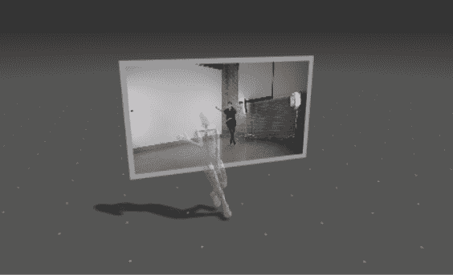

RADiCAL’s Awesome Tech

### 合成视频

目前最流行的合成视频类型是 **Deepfakes** 。这些本质上是面部交换，一个人的脸替换另一个人的脸(就像《T2》中尼古拉斯·凯奇在《川普》中的脸)。这是使用 [GANs](https://blog.paperspace.com/implementing-gans-in-tensorflow/) 完成的。不幸的是，Deepfakes 已经变得几乎臭名昭著，因为它们也可以用来做很多好事。这是在佛罗里达州圣彼得堡的大理博物馆里，萨尔瓦多·达利向人们问好的一个深赝品。像这样的事情通常需要你雇佣一个非常昂贵的 CGI 工作室，但是这里唯一的花费来自开发者和 GPU。

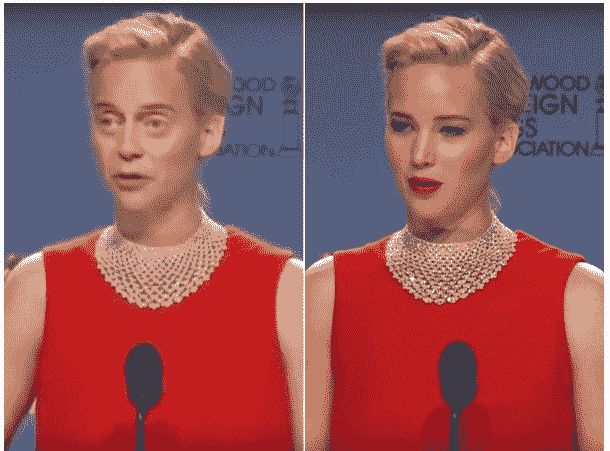

[Jennifer Buscemi](https://www.youtube.com/watch?v=r1jng79a5xc) - One of the more popular Deepfake videos

另一种类型的合成视频涉及**面部重现**，其中源演员控制目标演员的面部。这给了我们不同的[世界领导人演唱约翰·勒诺的《想象》](https://www.youtube.com/watch?v=KHMNPjkd5-0)和[大卫·贝克汉姆讲 9 种不同的语言](https://www.youtube.com/watch?v=QiiSAvKJIHo)。

[https://www.youtube.com/embed/KHMNPjkd5-0?feature=oembed](https://www.youtube.com/embed/KHMNPjkd5-0?feature=oembed)

### 合成图像

图像(以及文本)是最早的合成媒体类型之一，2016 年和 2017 年， [Pix2Pix](https://phillipi.github.io/pix2pix/) 和 [CycleGAN](https://blog.paperspace.com/use-cyclegan-age-conversion-keras-python/) 在深度学习社区引起了轰动。他们应用的一些受欢迎的例子包括 [Edmond De Belamy](https://obvious-art.com/edmond-de-belamy.html) ，一幅由 [Obvious AI](https://obvious-art.com/edmond-de-belamy.html) 创作的画作卖出了近 50 万美元，以及人工生成的[库存图像](https://generated.photos/)，这使得像 Shutterstock 和 Getty Images 这样的公司过时了。

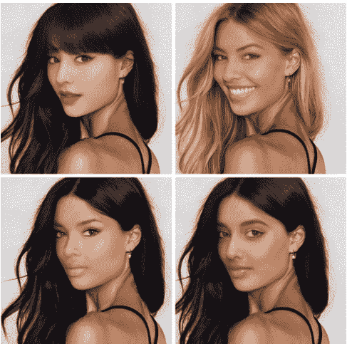

Synthetic Stock photos from Rosebud AI. None of these models are real.

### 
合成音频

从播客到智能音箱，世界正在见证不同形式的音频技术的激增。但是，这需要时间，金钱和努力(配音员，工作室，麦克风和处理等。)来记录任何东西。这使得人工语音技术如文本到语音转换(TTS)和语音克隆变得非常流行。例如，[like . ai](https://www.resemble.ai/)是一家很受欢迎的公司，它允许你克隆自己的声音来创建数字化身。

另一个密切相关的领域是合成音乐。像 [Popgun.ai](https://popgun.ai/) 和 [Jukedeck](https://thenextweb.com/insider/2019/07/24/tiktoks-parent-company-appears-to-have-acquired-ai-music-startup-jukedeck/) (最近被抖音收购)这样的公司帮助用户使用人工智能创作音乐。像这样的技术将帮助每个人唱歌、演奏乐器、作曲和掌握音频，从而真正实现音乐创作的民主化。

* * *

我希望你现在对合成媒体的前景和每种人工生成媒体的应用有一个相当好的理解。在这一系列文章中，我将重点关注合成视频、图像和音频，这里我将特别关注合成视频。在下一节中，我将回顾塑造这一领域的重要论文。

## 合成视频-应用和研究综述

我将介绍合成视频的一些应用和例子，并总结一些使这项技术成为可能的论文。这不是一个详尽的列表，而是我认为最重要的申请和论文的列表。

## 涵盖的应用和出版物

### [1。面部交换(DeepFakes)](#deepfakes)

### [2。视频中的面部重现](#facialreenactvid)

*   [Face2Face:实时人脸捕捉和重现 rgb 视频](#paper1)
*   [深度视频人像](#dvp)

### [3。语音/音频的面部再现](#facialreenactaudio)

*   [合成奥巴马:从音频中学习对口型](#paper3)
*   [神经语音木偶:音频驱动的面部重现](#paper4)

### 4.[全身再现](#fullbody)

*   LumiereNet
*   [大家现在跳舞](#paper6)

## 换脸(Deepfakes)

脸互换(DeepFakes)本质上是脸互换模型。大多数流行的开源软件都是基于 Autoencoder 的(SAE，HAE 等)，很少有基于 GANs 的。

### 这背后的技术是什么？

没有关于 DeepFakes 的正式或开创性论文，因为它们不是来自任何实验室。这里有一个技术背后的解释。让我们以广受欢迎的詹妮弗·布斯米为例。假设我们有他们俩的视频，詹妮弗·劳伦斯和史蒂夫·巴斯米。我们想把史蒂夫·巴斯米的脸(B 面)放到詹妮弗·劳伦斯的脸(A 面)上。我们有两个自动编码器，每个都有一个。

### 培养

两个自动编码器被单独训练，**它们共享同一个编码器，但具有不同的解码器**。公共编码器用两个面来训练，但是面 A 的解码器仅用 A 的面来训练；解码器 B 仅用 B 的面部来训练。

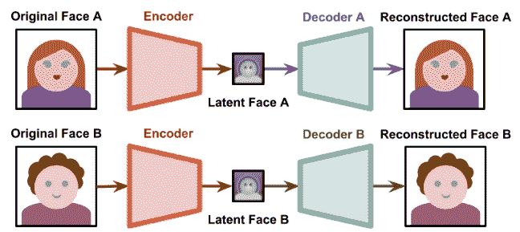

Training phase

### 产生

现在，为了生成一个史蒂夫·巴斯米的脸(脸 B)在詹妮弗·劳伦斯的脸(脸 A)上的深度假像，我们将詹妮弗·劳伦斯的视频传递到编码器中，而不是试图从编码中重建她的脸，我们现在将它传递到解码器 B 以重建史蒂夫的 Buscemi 的脸。最终的结果是史蒂夫·巴斯米的脸出现在詹妮弗·劳伦斯的视频上。

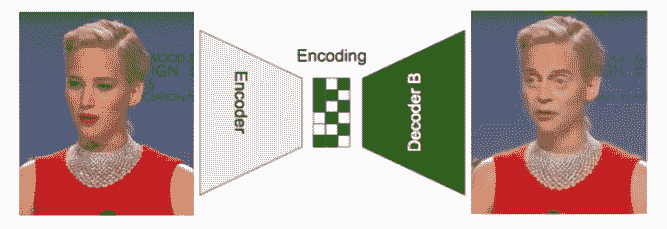

Generation

注意:DeepFakes 已经获得了相当多的恶名，在世界上的一些地方是非法的(例如， [DeepFakes 在中国](https://www.theverge.com/2019/11/29/20988363/china-deepfakes-ban-internet-rules-fake-news-disclosure-virtual-reality)被禁止)——可以说是有充分的理由的。我觉得列举一些检测 DeepFakes 的努力是很重要的:

*   [https://deepfakedetectionchallenge.ai/](https://deepfakedetectionchallenge.ai/)
*   [人脸取证](https://github.com/ondyari/FaceForensics)
*   DeepTrace 由一群弗吉尼亚大学的毕业生创立，是这个领域最有名的公司。

## 视频中的面部重现和视觉配音

**面部重现**是使用源演员的面部来控制目标演员的面部的过程(它实际上是使用任何源来控制面部，其中向量可以是面部、音频或文本。我将在这一节介绍视频驱动的重现，在下一节介绍音频驱动的重现)。人脸再现模型将姿态、旋转和表情从一张脸转移到另一张脸。这使得各种应用成为可能，从创建照片般逼真的虚拟化身，允许名人无缝地用多种语言交谈，以及颠覆视频制作行业的力量。

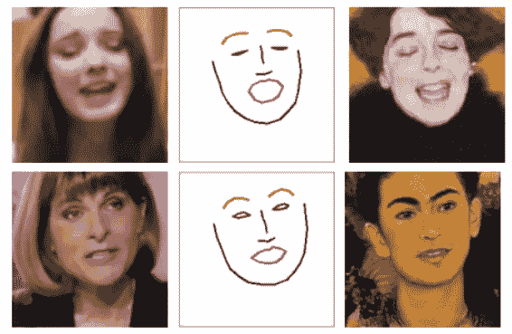

Samsung AI animating portraits

### 什么是视觉配音？

视觉配音是面部重现的一个特殊实例，旨在改变目标演员的嘴部动作以匹配新的音轨，通常由配音演员用外语说出。这主要用于通过将演员的嘴唇与配音同步来提高配音质量。这方面最好的例子就是 Syntheisa.io 让贝克汉姆说 9 种语言。

视觉配音可以是表演驱动的(目标由源演员的动作控制)或语音驱动的(音频驱动)。

## Face 2 Face:RGB 视频的实时人脸捕捉与重现(CVPR 2016) [【论文】](http://www.graphics.stanford.edu/~niessner/papers/2016/1facetoface/thies2016face.pdf)

一段时间以来，计算机视觉社区一直对面部重现感兴趣，通常使用 RDB-D 传感器(如 Kinect)或使用标记设置来实现。来自 TUM 视觉计算小组的这篇论文在 2016 年首次使用源序列对单目目标视频(如 Youtube 视频)进行实时面部重现，该源序列也是单目视频流，使用商用网络摄像头实时捕捉。目标是由源演员制作目标视频的面部表情动画，并以照片般逼真的方式重新渲染经过处理的输出视频。

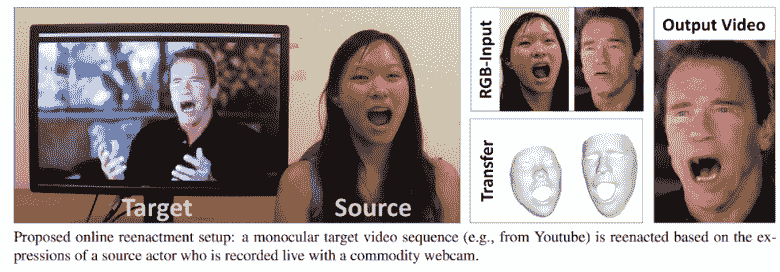

### 方法

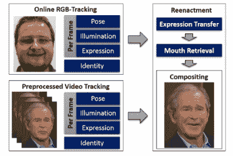

Method Overview

PCA 模型用于参数化人脸。前两个维度代表面部特征，即几何形状和皮肤反射率，第三个维度控制面部表情。

该模型首先重建目标演员的形状身份。

*   该模型对源视频和目标视频进行处理，通过源视频和目标视频之间快速有效的变形传递来实现再现。从目标序列中，最匹配的口腔内部被检索并扭曲以产生精确的匹配。
*   为了创建最终图像，他们使用传递的表情(使用传递的表情系数)重新渲染目标的面部，并将其与目标视频的背景合成(混合)。重新渲染还考虑了目标场景中的估计照明。(参考能量/损耗公式的文件)

嘴唇和牙齿的嘴区域通常很难合成，导致渲染不一致。他们通过引入一种新的嘴部合成方法来克服这一问题，该方法通过从离线样本序列中检索和*扭曲*最佳匹配的嘴部形状来生成逼真的嘴部内部，并且他们保持目标嘴部形状的外观。

### 结果

本文以 1280×720 的分辨率在各种目标 Youtube 视频上展示了高度逼真的再现示例。结果是定性的。

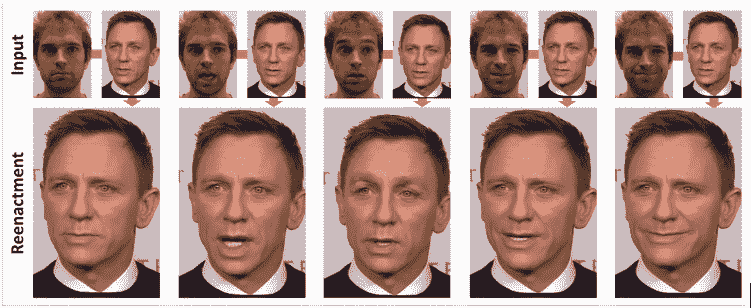

这里有一个[视频](https://www.youtube.com/watch?v=ohmajJTcpNk)有更多的结果。

## 深度视频人像(SIGGRAPH 2019)[【arxiv】](https://arxiv.org/pdf/1805.11714.pdf)

这是一篇有趣的论文，早在 2018 年就在社区中掀起了波澜。与其他仅限于面部表情操作的方法相比，它们是第一个传输完整的 3D 头部姿势、面部表情、眼睛凝视和眨眼的方法。他们也是第一个合成目标人物上半身照片级逼真视频的人，包括逼真的服装和头发。(视频人像是一个人的头部和上半身的视频)。该方法的核心是一个具有新颖时空结构的生成神经网络。(任何时空都处理视频数据，因为视频本质上是随时间变化的图像)。该网络将参数人脸模型的合成渲染作为输入，基于该合成渲染，它为给定的目标演员预测照片般逼真的视频帧。

在 Face2Face 中，只有面部表情可以真实地修改，但不是完整的 3D 头部姿势，也没有一致的上半身/不断变化的背景。

### 方法

该论文将视频肖像合成和再现公式化为*渲染到视频转换*任务。

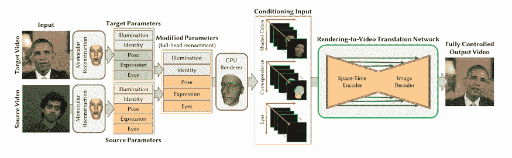

首先，使用人脸重建方法跟踪源和目标演员，该方法使用参数化人脸和光照模型。所得的低维参数向量序列表示每个视频帧的演员身份、头部姿势、表情、眼睛凝视和场景照明。这允许他们将头部姿势、表情和/或眼睛注视参数从源传送到目标。

在下一步中，他们基于修改的参数生成目标演员的新的合成渲染。生成三个不同的条件输入:彩色再现、对应图像和眼睛凝视图像。

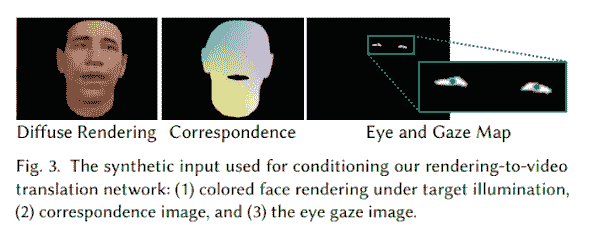

这些渲染作为他们的新渲染到视频翻译网络的条件输入，该网络经过训练，可以将合成输入转换为照片级的输出。

该方法的核心是一个专门为视频人像合成定制的**条件生成对抗网络(cGAN)** 。cGAN 的生成器是一个渲染到视频的翻译网络。渲染到视频转换网络是一个时空编码器(即视频编码器)，带有一个图像解码器，它以新的合成渲染为条件。渲染到视频的转换是以对抗的方式训练的。

鉴别器 D 试图更好地将给定的图像分类为真实的或合成的，而渲染-翻译网络 T 试图在愚弄鉴别器方面进行改进

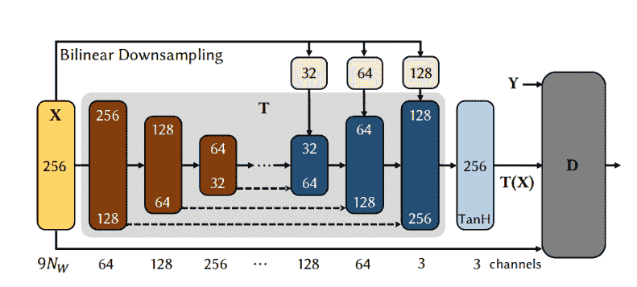

The cGAN

### 结果

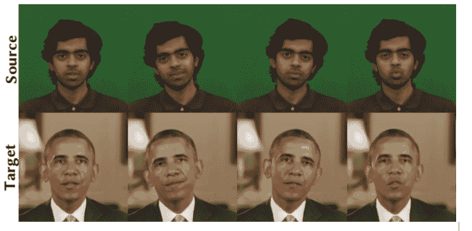

查看[项目网站](https://gvv.mpi-inf.mpg.de/projects/DeepVideoPortraits/)了解更多定性结果。

这里还有一些我觉得有趣的论文。

*   VDub:修改演员的面部视频以进行逼真的视觉配音(EUROGRAPHICS 2015)[【arxiv】](https://gvv.mpi-inf.mpg.de/files/EuroGraphics2015/dubbing_high.pdf)
*   重演:通过边界转移学习重演人脸(ECCV 2018)[【arxiv】](https://arxiv.org/pdf/1807.11079.pdf)[【代码】](https://github.com/wywu/ReenactGAN)
*   延迟神经渲染:使用神经纹理的图像合成(2019)[【arxiv】](https://arxiv.org/pdf/1904.12356.pdf)
*   现实神经说话头部模型的少数镜头对抗学习(ICCV 2019)[【arxiv】](https://arxiv.org/pdf/1905.08233.pdf)[【代码](https://github.com/grey-eye/talking-heads)
*   GANs 的逼真语音驱动的面部动画(2019)[【arxiv】](https://arxiv.org/pdf/1906.06337.pdf)

## 语音/音频的面部再现

来自文本或语音的面部动画基本上是使用文本或语音来控制面部。严格来说，这属于面部重现，但为了简单起见，我根据源驱动程序将其分为几类——源可以是源演员的视频(或者在这种情况下是音频)。

由于(1)将一维信号映射到(3D)时变图像的技术挑战，(2)而且由于人类对嘴部区域的细微细节极其敏感，所以从音频生成嘴部视频的问题相当困难。

**语音/音频的面部重现**首先由 [Bregler 等人](https://www.isca-speech.org/archive_open/archive_papers/avsp97/av97_153.pdf)提出，他们演示了如何在视频中“重写”一个人的嘴唇运动，以匹配一个新的音频轨道，该音频轨道表示为一个音素序列。从那时起，已经有了相当多的进展，我涵盖了 2 个重要的文件。

## 合成奥巴马:从音频中学习对口型(2017)[【arxiv】](https://grail.cs.washington.edu/projects/AudioToObama/siggraph17_obama.pdf)[【代码】](https://github.com/supasorn/synthesizing_obama_network_training)

与上一节中的文章相比，这是一篇相当直截了当的文章。这也是相当有影响力的一个。Supasorn(第一作者)最后做了一个关于他作品的 TED 演讲。

给定巴拉克·奥巴马总统的音频，本文合成了一个高质量的视频，他用准确的口型同步说话，合成到一个目标视频剪辑中。他们在他每周演讲的许多小时(17 小时)的镜头上训练了一个递归神经网络，该网络学习从原始音频特征到嘴型的映射。使用每个时刻的嘴形，他们合成高质量的嘴部纹理，并将其与适当的 3D 姿势合成(混合)。

### 方法

这种方法是基于从嘴巴周围区域的音频合成视频，并使用合成技术从其他库存镜头中借用头部和躯干的其余部分**。**递归神经网络用于从在数百万视频帧上训练的音频合成口型。

**输入音频轨道**是源，**目标视频**是一个库存视频剪辑，它们将合成的嘴部区域合成到其中

为了使问题变得简单，该论文集中于合成面部与语音最相关的部分。对于总统演讲片段来说，奥巴马演讲的内容与嘴周围的区域(嘴唇、脸颊和下巴)关联最强，也与头部运动的方面关联最强——当他暂停演讲时，他的头部停止运动。因此，他们专注于合成他嘴周围的区域，并从素材中借用奥巴马的其他部分(眼睛、头部、上身、背景)。

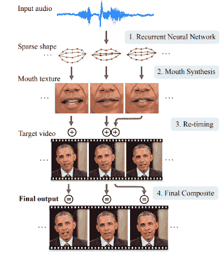

**整体管道工程如下**(如图所示):

*   给定奥巴马的音频，提取音频特征以用作递归神经网络的输入，该神经网络为每个输出视频帧输出稀疏嘴形
*   根据稀疏的嘴部形状，合成嘴部和脸部下部区域的纹理。然后将嘴部纹理混合到修改后的原始视频上，使得头部运动看起来自然，并且与给定的输入语音相匹配
*   在混合过程中，下颌线被扭曲以匹配新说话者的下巴，并且面部被合成为原始姿势中的目标帧。

### 结果

看这个视频定性结果。

[https://www.youtube.com/embed/9Yq67CjDqvw?feature=oembed](https://www.youtube.com/embed/9Yq67CjDqvw?feature=oembed)

## 神经语音木偶:音频驱动的面部重现(2019)[【arxiv】](https://arxiv.org/pdf/1912.05566.pdf)

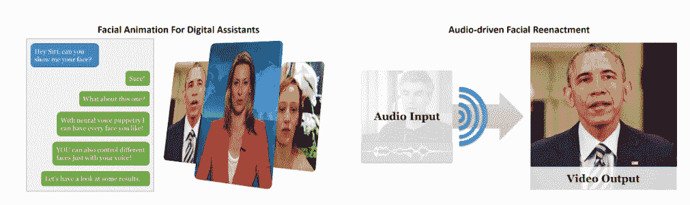

这篇论文于 2019 年 12 月发表，是当前音频驱动面部重现的 SOTA。他们的方法适用于不同的人，允许他们将目标演员的视频与任何未知源演员的声音合成，甚至可以利用标准的文本到语音转换方法生成合成声音*。*神经语音木偶是一种易于使用的音频到视频翻译工具，**不需要单个目标视频的大量视频镜头**或任何手动用户输入。**目标视频相对较短(2-3 分钟)，非常棒。**

### 方法

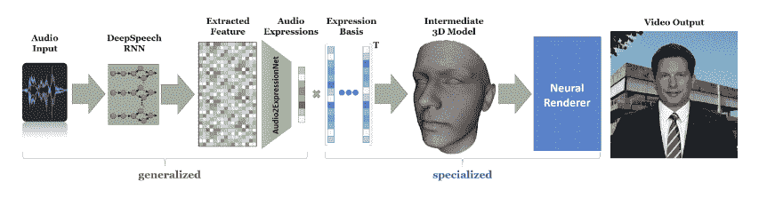

神经语音木偶管道由两个主要部分组成-一个通用网络和一个专用网络。

**广义网络(Audio2Expression Net)预测潜在的表达向量并跨越音频表达空间。为了确保多人之间的通用性，潜在音频表达空间**由所有人共享。音频表达式被解释为 3D 人脸模型装备的 [**【混合形状】**](https://www.youtube.com/watch?v=C29DJYBLh_M) **系数**。这个脸部模型装备是个人专用的，并且在管道的第二部分中被优化。用于训练 Audio2ExpressionNet 的数据集包括 116 个平均长度为 1.7 分钟的视频(总共 302750 帧)。选择训练语料库，使得人们处于中立的情绪中(德国公共电视台的评论员)。

**专业阶段是第二阶段，**捕捉目标人物的特质，即面部动作和外貌。由于每个人都有自己的谈话风格，因此，不同的表达，本文建立了个人特定的表达空间，可以计算每个目标序列。在 2-3 分钟的短视频序列上对空间进行训练(相比之下，最先进的方法需要几个小时)。

通过从音频表情空间(第一阶段)到特定于个人的表情空间(第二阶段)的映射来实现面部再现。给定估计的表情(再现)和提取的音频特征，应用新的延迟神经渲染技术来生成最终的输出图像。(查看[这篇论文](https://arxiv.org/abs/1904.12356)了解更多关于神经纹理和延迟神经渲染的信息)

由于基于音频的表情估计网络在多人中推广，**它可以应用于看不见的演员**。然而，用于新目标视频的特定于个人的渲染网络是从零开始训练的。

### 结果

结果很大程度上是定性的，所以最好看看他们网页上的[视频。这里有几个数字。](https://justusthies.github.io/posts/neural-voice-puppetry/)

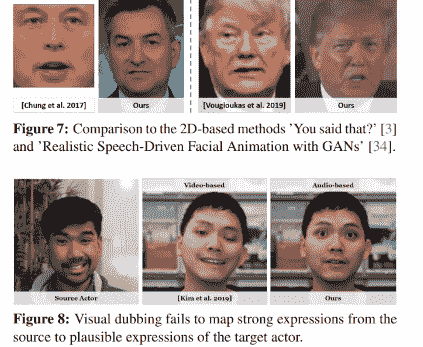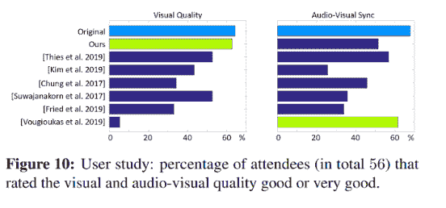

本文展示了优越的视觉和唇同步质量相比，其他人，是目前的 SOTA。

这里有更多有趣的文章和一些代码实现。

*   **你说的？-从音频合成说话人脸的视频** (2017) -音频驱动的面部重现中的开创性论文**[【arxiv】](https://www.robots.ox.ac.uk/~vgg/publications/2019/Jamaludin19/)[【代码】](https://github.com/joonson/yousaidthat)**
*   **ATVGnet -分层跨模态说话人脸生成带动态逐像素丢失**(CVPR 2019**)**[**【arxiv】**](https://www.cs.rochester.edu/u/lchen63/cvpr2019.pdf)**[**CODE】**](https://github.com/lelechen63/ATVGnet)**
*   ****基于文本的正在说话的头部视频编辑[(2019)【arxiv】](https://arxiv.org/pdf/1906.01524.pdf)**——来自斯坦福的优秀论文，允许你编辑视频中的音频，并制作一个新的视频。你可以期待很快在 After Effects 中看到这项技术。**

 **## 全身再现

这似乎还没有一个正式的名称，所以我称之为全身重演。它类似于面部重现，然而在这里，目标演员的整个身体是由一个来源以照片般逼真的方式重现的。

## LumièreNet:由音频合成的讲座视频(2019)[【arxiv】](https://arxiv.org/pdf/1907.02253v1.pdf)

这是一篇来自 Udacity AI 的非常有趣的论文，它可以从音频中生成逼真的教练视频。讲师制作的讲座视频在 MOOCs 中非常受欢迎，但拍摄一个视频需要相当多的资源和流程(即讲师、工作室、设备和制作人员)，并需要大量时间。如果我们可以从现有的视频片段中生成一个新的讲座视频，由文本或音频驱动，会怎么样？这将使视频制作非常灵活，没有必要重新拍摄每个新的视频

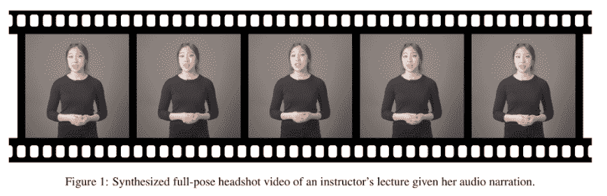

### 方法

他们引入了一种基于姿势估计的潜在表示作为中间代码来合成教练的面部、身体和背景。他们从提取的人体姿势中为一个主题设计这些紧凑而抽象的代码。

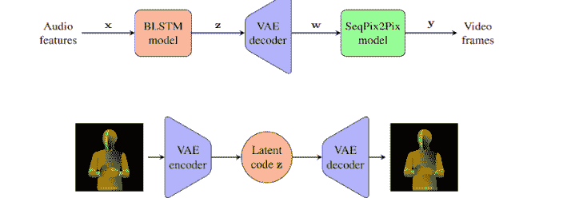

LumièreNet 由三个神经网络模块组成:BLSTM 模型、VAE 模型和 SeqPix2Pix 模型。

*   BLSTM 模型首先将提取的音频特征 x 与中间潜在代码 z 相关联
*   然后，VAE 解码器从 z 构建相应的姿态图形 w
*   最后，SeqPix2Pix 模型产生给定 w 的最终视频帧 y。
*   在训练过程中，LumièreNet 学习了 VAE 模型，通过编码器和解码器为高维密集图像设计紧凑和抽象的潜在代码 z。

### 结果

看看这个[视频](https://vimeo.com/327196781)的定性结果。结果不是最好的，有明显的视听差异。然而，这是对 EdTech 空间的一个很好的补充，我很高兴看到接下来会发生什么。

## 大家现在跳舞(ICCV 2018)[【arxiv】](https://arxiv.org/pdf/1808.07371.pdf)[【代码】](https://github.com/CUHKSZ-TQL/EverybodyDanceNow_reproduce_pytorch)

这篇受欢迎的论文介绍了一种简单的“像我一样做”运动转移方法:给定一个人跳舞的源视频，他们在目标主体表演标准动作几分钟后将该表演转移到目标。他们使用姿势作为中间表示，将这个问题作为视频到视频的翻译来处理。为了传递运动，从源主体提取姿态，并且应用学习的姿态到外观的映射来生成目标主体。

预测两个连续的帧以获得时间上连贯的视频结果，并且引入了用于真实人脸合成的独立流水线(FaceGAN)。虽然这种方法非常简单，但它产生了令人惊讶的令人信服的结果(见视频)。

### 方法

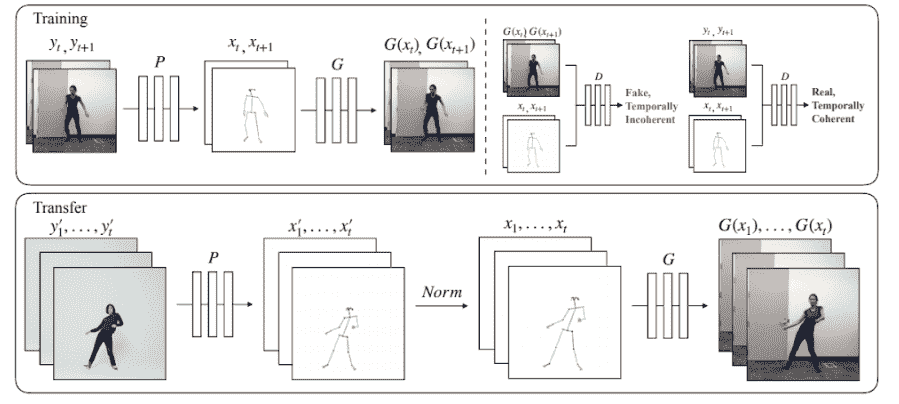

**训练-** 模型使用姿态检测器 P 从目标对象的视频帧中创建姿态简笔画。与对抗鉴别器 D 一起学习映射 G，对抗鉴别器 D 试图区分“真实”对应(xt，xt+1)，(yt，yt+1)和“虚假”序列(xt，xt+1)，(G(xt)，G(xt+1))。转移-姿势检测器 P 用于获得源人的姿势关节，这些姿势关节通过归一化过程(Norm)被转换成为其创建姿势简笔画的目标人的关节。然后应用经过训练的映射 G。

**传送** -姿态检测器 P 用于获得源人的姿态关节，这些关节通过标准化过程(Norm)被转换成目标人的关节，为目标人创建姿态简笔画。然后应用经过训练的映射 G。

### 定性结果

[https://www.youtube.com/embed/PCBTZh41Ris?feature=oembed](https://www.youtube.com/embed/PCBTZh41Ris?feature=oembed)

**更多有趣的论文:**

*   视频转视频合成(2018)[【arxiv】](https://github.com/NVIDIA/vid2vid)[【代码】](https://arxiv.org/pdf/1808.06601.pdf)
*   Speech2Gesture:学习会话手势的个人风格(2019)[【arxiv】](https://arxiv.org/pdf/1906.04160.pdf)[【代码】](https://github.com/amirbar/speech2gesture)

我对我们即将进入的未来非常兴奋。评论/有问题联系我！

**延伸阅读**

*   [https://www . axios . com/synthetic-realities-fiction-stories-fact-misinformation-ed 86 ce 3b-f1 a5-4e7b-ba86-f87a 918d 962 e . html](https://www.axios.com/synthetic-realities-fiction-stories-fact-misinformation-ed86ce3b-f1a5-4e7b-ba86-f87a918d962e.html)
*   斯坦福计算视频处理课程 -优秀资源
*   https://betaworksventures.com/campv1——第一个合成媒体加速器。非常令人兴奋的东西。**