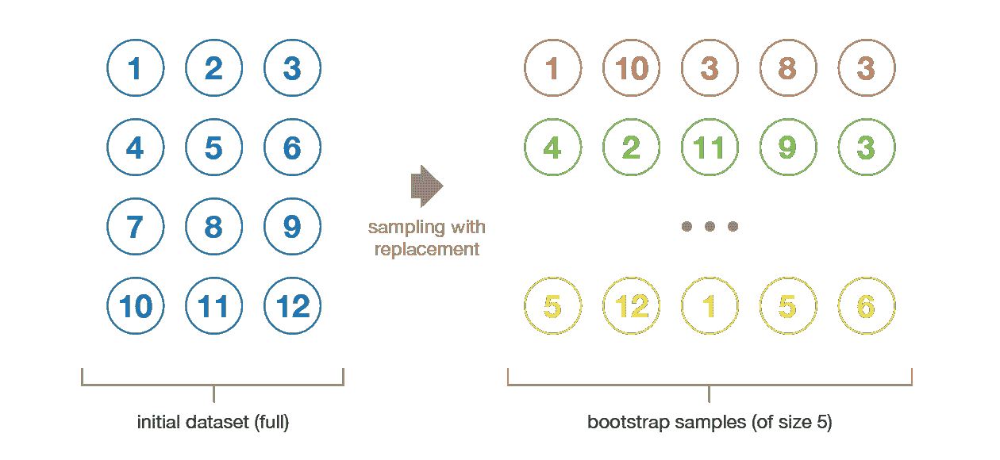
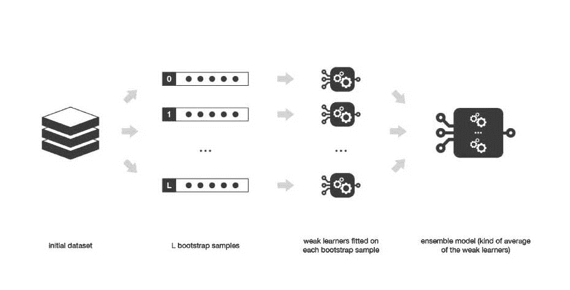

# Bagging 和系综方法介绍

> 原文：<https://blog.paperspace.com/bagging-ensemble-methods/>

偏差-方差权衡是我们在训练机器学习算法时都面临的挑战。Bagging 是一种强大的集成方法，有助于减少方差，并通过扩展，防止过度拟合。集成方法通过使用一组(或“集成”)模型来提高模型精度，当这些模型组合在一起时，其性能优于单独使用的单个模型。

在本文中，我们将了解 bagging 的内部工作原理及其应用，并使用 scikit-learn 库实现 bagging 算法。

特别是，我们将涵盖:

*   集成学习综述
    *   为什么要用集成学习？
    *   集成学习的优势
*   什么是装袋？
    *   拔靴带
    *   基本概念
*   套袋的应用
*   Bagging 算法
*   优点和缺点
*   解码超参数
*   实现算法
*   总结和结论

让我们开始吧。

## 集成学习综述

顾名思义，集成方法是指一组模型一起工作来解决一个共同的问题。集成学习利用几种不同方法的优点来抵消每个模型各自的缺点，而不是依赖单个模型来获得最佳解决方案。得到的集合应该比任何单独的模型更不容易出错。

### 为什么要用集成学习？

将几个弱模型结合起来可以产生我们所说的*强学习者*。

我们可以使用集成方法以两种方式组合不同的模型:或者使用在所有模型中保持相同的单个基础学习算法(一个*同质集成模型*)，或者使用针对每个模型不同的多个基础学习算法(一个*异质集成模型*)。

一般来说，集成学习与决策树一起使用，因为它们是实现正则化的可靠方法。通常，随着决策树中级别数量的增加，模型变得容易受到高方差的影响，并且可能会过度拟合(导致测试数据的高误差)。我们使用具有一般规则(相对于高度特定的规则)的集成技术来实现正则化并防止过度拟合。

### 集成学习的优势

让我们用一个真实的场景来理解集成学习的优势。考虑这样一种情况，您想要预测收到的电子邮件是真实的还是垃圾邮件。你想通过单独看几个属性**来预测类别(正版/垃圾):发件人是否在你的联系人列表中，消息内容是否与金钱勒索有关联，使用的语言是否整洁易懂等等。另外，另一方面，您可能希望使用所有这些属性**来预测电子邮件的类别。显而易见，后一种选择效果很好，因为我们综合考虑所有属性，而在前一种选择中，我们单独考虑每个属性。集体性确保了结果的稳健性和可靠性，因为它是在彻底研究后生成的。****

**这展示了集成学习的优势:**

*   **确保预测的可靠性。**
*   **确保模型的稳定性/稳健性。**

**为了利用这些好处，集成学习通常是大多数用例中最优选的选项。在下一节中，我们来了解一种流行的集成学习技术， **Bagging** 。**

## **什么是装袋？**

**Bagging 又称 **bootstrap aggregating** ，是一个预测模型的多个版本的聚合。每个模型都是单独训练的，并使用平均过程进行组合。bagging 的主要目的是实现比任何模型更小的差异。要理解装袋，我们先来理解术语**自举**。**

### **拔靴带**

**引导是从给定数据集生成引导样本的过程。通过随机抽取替换的数据点来配制样本。**

**

Bootstrapping (Source: [https://towardsdatascience.com/ensemble-methods-bagging-boosting-and-stacking-c9214a10a205](https://towardsdatascience.com/ensemble-methods-bagging-boosting-and-stacking-c9214a10a205))** 

**重新采样的数据包含原始数据中作为一个整体的不同特征。它绘制了数据点中存在的分布，并且也倾向于保持彼此不同，即数据分布必须保持完整，同时保持自举样本之间的不相似性。这反过来有助于开发稳健的模型。**

**自举还有助于避免过度拟合的问题。当在模型中使用不同的训练数据集时，该模型变得对生成错误有弹性，因此，对测试数据表现良好，并因此通过保持其在测试数据中的牢固立足点来减少方差。用不同的变量进行测试不会使模型偏向错误的解决方案。**

**现在，当我们试图建立完全独立的模型时，它需要大量的数据。因此，通过利用所考虑的数据集的近似属性，自举是我们选择的选项。**

### **装袋背后的基本概念**

**这一切都始于 1994 年，当时 Leo Breiman 提出了这种算法，当时被称为“ **Bagging 预测器**”。在装袋中，首先创建引导样本。然后，对每个样本应用回归或分类算法。最后，在回归的情况下，对单个学习者预测的所有输出取平均值。对于分类，要么接受投票最多的类别(**硬投票**，要么将所有类别概率的最高平均值作为输出(**软投票**)。这就是**聚合**发挥作用的地方。**

**数学上，装袋由以下公式表示:**

****

**左边的术语是袋装预测，右边的术语是个体学习者。**

**当学习者不稳定并且倾向于过度适应时，即训练数据的小变化导致预测输出的大变化时，Bagging 工作得特别好。它通过聚合由不同统计属性(如不同的标准差、均值等)组成的个体学习者来有效地减少方差。它适用于高方差模型，如决策树。当与线性回归等低方差模型一起使用时，它不会真正影响学习过程。要选择的基础学习器(树)的数量取决于数据集的特征。使用太多的树不会导致过度拟合，但会消耗大量的计算能力。**

**打包可以并行进行，以检查过多的计算资源。这是它带来的一个优点，并且经常是增加算法在各种领域中的使用的助推器。**

**

Bagging (Source: https://towardsdatascience.com/ensemble-methods-bagging-boosting-and-stacking-c9214a10a205)** 

## **套袋的应用**

**装袋技术用于各种应用中。一个主要优点是，它通过在训练数据中应用不同的组合和重复(在自举样本中的替换)来生成附加数据，从而减少了预测中的方差。以下是广泛使用 bagging 算法的一些应用:**

*   **银行业**
*   **医疗数据预测**
*   **高维数据**
*   **土地覆盖制图**
*   **欺诈检测**
*   **网络入侵检测系统**
*   **像神经科学、修复术等医学领域。**

## **Bagging 算法**

**让我们来看看实现 Bagging 算法的一步一步的过程。**

*   **引导包括装袋过程流程中的第一步，其中数据被分成随机样本。**
*   **然后将另一种算法(例如决策树)应用于这些样本中的每一个。培训同时进行。**
*   **取所有输出的平均值，或者一般来说，计算总输出。**

**就这么简单！现在来说说装袋的利弊。**

## **优点和缺点**

**先说优点。Bagging 是一种完全特定于数据的算法。装袋技术减少了模型过度拟合。在高维数据上也表现不错。此外，数据集中缺失的值不会影响算法的性能。**

**也就是说，它的一个限制是基于子集树的平均预测给出最终预测，而不是输出分类或回归模型的精确值。**

## **解码超参数**

**Scikit-learn 有两个用于打包的类，一个用于回归(`sklearn.ensemble.BaggingRegressor`)，另一个用于分类(`sklearn.ensemble.BaggingClassifier`)。两者都接受各种参数，这些参数可以根据给定的数据提高模型的速度和精度。其中包括:**

****base_estimator:** 对数据集的所有随机子集使用的算法。默认值是决策树。**

****n _ 估计量:**总体中基本估计量的数量。默认值为 10。**

****random_state:** 随机状态生成器使用的种子。默认值为无。**

****n_jobs:** 对于`fit`和`predict`方法，并行运行的作业数量。默认值为无。**

**在下面的代码中，我们还使用了 **K-Folds** 交叉验证。它输出训练/测试指数以生成训练和测试数据。 **n_splits** 参数决定折叠次数(默认值为 3)。**

**为了估计准确性，我们使用 K_Folds 和 **cross_val_score** ，而不是将数据分成训练集和测试集。此方法通过交叉验证来评估分数。下面来看一下`cross_val_score`中定义的参数:**

****估计量:**拟合数据的模型。**

****X:** 输入要拟合的数据。**

****y:** 预测精度的目标值。**

****cv:** 决定交叉验证拆分策略。默认值为 3。**

## **实现 Bagging 算法**

****第一步:导入模块****

**当然，我们从导入构建我们的打包模型所需的必要包开始。我们使用 [Pandas](https://pandas.pydata.org/) 数据分析库来加载我们的数据集。要使用的数据集被称为[皮马印第安人糖尿病数据库](https://www.kaggle.com/uciml/pima-indians-diabetes-database)，用于根据各种诊断措施预测糖尿病的发病。**

**接下来，我们从`sklearn.ensemble`包中导入`BaggingClassifier`，从`sklearn.tree` 包中导入`DecisionTreeClassifier`。**

```py
`import pandas
from sklearn import model_selection
from sklearn.ensemble import BaggingClassifier
from sklearn.tree import DecisionTreeClassifier` 
```

******步骤二:加载数据集******

**我们将从下面提供的 GitHub 链接下载数据集。然后我们将链接存储在一个名为`url`的变量中。我们在一个名为`names`的列表中命名数据集的所有类。我们使用 Pandas 的`read_csv`方法来加载数据集，然后使用参数“names”将类名设置为我们的变量，也称为`names`。接下来，我们使用切片操作加载特征和目标变量，并将它们分别分配给变量 **X** 和 **Y** 。**

```py
`url="https://raw.githubusercontent.com/jbrownlee/Datasets/master/pima-indians-diabetes.data.csv"

names = ['preg', 'plas', 'pres', 'skin', 'test', 'mass', 'pedi', 'age', 'class']
dataframe = pandas.read_csv(url, names=names)
array = dataframe.values
X = array[:,0:8]
Y = array[:,8]`
```

****第三步:加载分类器****

**在此步骤中，我们为所有随机状态设置种子值，以便生成的随机值将保持不变，直到种子值用尽。我们现在声明 **KFold** 模型，其中我们将 **n_splits** 参数设置为 10，并将 **random_state** 参数设置为种子值。这里，我们将使用**分类和回归树算法**构建 bagging 算法。为此，我们导入 **DecisionTreeClassifier** ，将其存储在 **cart** 变量中，并将树数量变量 **num_trees** 初始化为 100。**

```py
`seed = 7
kfold = model_selection.KFold(n_splits=10, random_state=seed)
cart = DecisionTreeClassifier()
num_trees = 100` 
```

****第四步:训练和结果****

**在最后一步中，我们使用 **BaggingClassifier** 通过将参数声明为上一步中定义的值来训练模型。
然后我们通过使用参数来检查模型的性能，Bagging **模型**， **X** ， **Y** ，以及 **kfold** 模型。打印的输出将是模型的准确性。在这个特殊的例子中，大约是 77%。**

```py
`model = BaggingClassifier(base_estimator=cart,n_estimators=num_trees, random_state=seed)

results = model_selection.cross_val_score(model, X, Y, cv=kfold)
print(results.mean())

Output:

0.770745044429255`
```

**当单独使用决策树分类器时，注意到的精确度大约是 66%。因此，Bagging 无疑是对决策树算法的改进。**

## **总结和结论**

**Bagging 通过减少方差来提高模型的精度和准确性，但代价是计算量大。然而，它仍然是建模健壮架构的一盏明灯。一个模型的完美不仅仅是将它的成功归功于所使用的算法，还包括所使用的算法是否正确！**

**这里有一个简短的总结，提到了我们所了解到的值得注意的要点。我们首先了解什么是集成学习，然后介绍 bagging，接着介绍它的应用、工作过程、优缺点和超参数，最后用 Python 对它进行编码。的确，这是提高机器学习技能的好方法！**

### **参考**

**[https://towards data science . com/ensemble-methods-bagging-boosting-and-stacking-c 9214 a10a 205](https://towardsdatascience.com/ensemble-methods-bagging-boosting-and-stacking-c9214a10a205)**

**[https://bradleyboehmke . github . io/HOML/bagging . html # bagging-VIP](https://bradleyboehmke.github.io/HOML/bagging.html#bagging-vip)**

**[https://en.wikipedia.org/wiki/Bootstrap_aggregating](https://en.wikipedia.org/wiki/Bootstrap_aggregating)**

**[https://sci kit-learn . org/stable/modules/generated/sk learn . ensemble . bagging classifier . html](https://scikit-learn.org/stable/modules/generated/sklearn.ensemble.BaggingClassifier.html)**

**[https://sci kit-learn . org/stable/modules/generated/sk learn . model _ selection . cross _ val _ score . html](https://scikit-learn.org/stable/modules/generated/sklearn.model_selection.cross_val_score.html)**