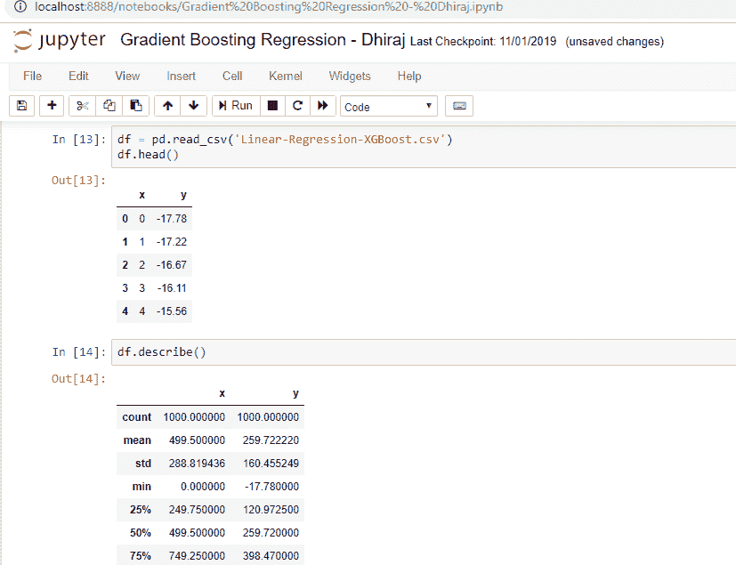
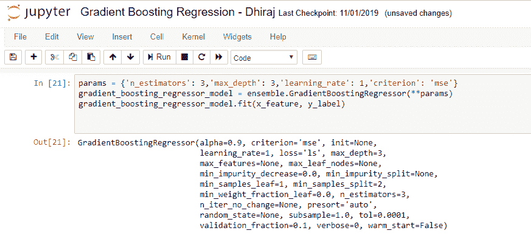
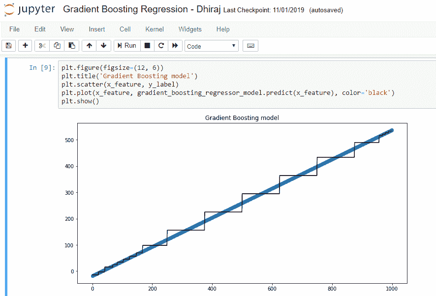
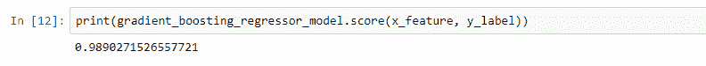

# 在 Python 中实现梯度增强

> 原文：<https://blog.paperspace.com/implementing-gradient-boosting-regression-python/>

您是否正在处理一个回归问题，并在寻找一个高效的算法来解决您的问题？如果是，你必须探索梯度推进回归(或 GBR)。

在本文中，我们将从回归问题的梯度推进的介绍开始，是什么使它如此有利，以及它的不同参数。然后，我们将在 Python 中实现 GBR 模型，使用它进行预测，并对其进行评估。

让我们开始吧。

Photo by [Austin Neill](https://unsplash.com/@arstyy?utm_source=ghost&utm_medium=referral&utm_campaign=api-credit) / [Unsplash](https://unsplash.com/?utm_source=ghost&utm_medium=referral&utm_campaign=api-credit)

## 梯度推进回归简介

机器学习中的“助推”是一种将多个简单模型组合成单个复合模型的方式。这也是为什么 boosting 被称为加法模型，因为简单模型(也称为弱学习器)一次添加一个，同时保持模型中现有的树不变。随着我们结合越来越多的简单模型，完整的最终模型成为更强的预测器。“梯度提升”中的术语“梯度”来自于算法使用梯度下降来最小化损失。

当梯度增强用于预测连续值(如年龄、体重或成本)时，我们使用梯度增强进行回归。这与使用线性回归不同。这与用于分类的配置略有不同，因此在本文中我们将坚持回归。

[决策树](https://medium.com/@dhiraj8899/top-5-advantages-and-disadvantages-of-decision-tree-algorithm-428ebd199d9a)用作梯度提升中的弱学习器。决策树通过将数据转换成树表示来解决机器学习的问题。树表示的每个内部节点表示一个属性，每个叶节点表示一个类标签。损失函数通常是平方误差(特别是对于回归问题)。损失函数需要是可微的。

同样像线性回归一样，我们在梯度推进回归中也有**残差**的概念。梯度推进回归计算当前预测和已知正确目标值之间的差异。
这种差异叫做残差。之后，梯度推进回归训练将特征映射到该残差的弱模型。由弱模型预测的该残差被添加到现有的模型输入，因此该过程将模型推向正确的目标。一次又一次地重复这个步骤改进了整体模型预测。

还应注意，梯度推进回归用于预测连续值，如房价，而梯度推进分类用于预测类别，如患者是否患有特定疾病。

我们实施梯度推进回归所遵循的高级步骤如下:

1.  选择一个弱学习者
2.  使用加法模型
3.  定义损失函数
4.  最小化损失函数

Photo by [Jeremy Bishop](https://unsplash.com/@jeremybishop?utm_source=ghost&utm_medium=referral&utm_campaign=api-credit) / [Unsplash](https://unsplash.com/?utm_source=ghost&utm_medium=referral&utm_campaign=api-credit)

## 梯度增强与 Ada 增强的比较

梯度增强和 Ada 增强都与决策树一起工作，但是梯度增强中的树比 Ada 增强中的树大。

梯度增强和 Ada 增强都可以缩放决策树，但是，与 Ada 增强不同，梯度增强以相同量缩放所有树。

## 梯度增强的优势

**更好的精度:**梯度推进回归一般提供更好的精度。当我们将 GBR 的准确性与其他回归技术(如线性回归)进行比较时，GBR 几乎总是赢家。这就是为什么 GBR 被用于大多数在线黑客马拉松和竞赛。

**更少的预处理:**我们知道，数据预处理是机器学习工作流程中至关重要的步骤之一，如果我们做得不好，就会影响我们的模型准确性。然而，梯度推进回归需要最少的数据预处理，这有助于我们以更低的复杂性更快地实现该模型。虽然预处理在这里不是强制性的，但我们应该注意，我们可以通过花时间预处理数据来提高模型性能。

**更高的灵活性:**梯度推进回归可用于许多超参数和损失函数。这使得该模型高度灵活，可以用来解决各种各样的问题。

**缺失数据:**缺失数据是训练模型时的问题之一。梯度推进回归自己处理缺失数据，不需要我们显式处理。这显然是对其他类似算法的巨大胜利。在该算法中，缺失值被视为包含信息。因此，在树构建期间，通过最小化损失函数并且将缺失值视为可以向左或向右的单独类别来决定节点的分裂决策。

## 梯度增强参数

让我们讨论一下梯度推进回归中使用的几个重要参数。这些是我们可能想要调整的参数，以便从我们的算法实现中获得最佳输出。

Photo by [Drew Patrick Miller](https://unsplash.com/@drewpatrickmiller?utm_source=ghost&utm_medium=referral&utm_campaign=api-credit) / [Unsplash](https://unsplash.com/?utm_source=ghost&utm_medium=referral&utm_campaign=api-credit)

**估计量个数:**表示为 n _ 估计量。
该参数的默认值为 100。
估计器的数量基本上是模型要执行的推进阶段的数量。换句话说，估计数表示森林中树木的数量。更多的树有助于更好地学习数据。另一方面，更多数量的树会导致更长的训练时间。因此，我们需要找到最佳性能的 n 估计量的正确和平衡的值。

**最大深度:**表示为 max_depth。
max _ depth 的默认值为 3，是可选参数。
最大深度是决策树估计器在梯度推进回归器中的深度。我们需要找到这个超参数的最佳值，以获得最佳性能。例如，该参数的最佳值可能取决于输入变量。

**学习率:**表示为 learning_rate。
learning _ rate 的默认值为 0.1，是一个可选参数。
学习率是梯度推进回归器算法中的一个超参数，该算法确定每次迭代的步长，同时向损失函数的最小值移动。

**判据:**表示为判据。
criteria 的默认值为 friedman_mse，可选参数。
标准用于衡量决策树的分割质量。
mse 代表均方误差。

**损失:**表示损失。
loss 的默认值为 ls，可选参数。
该参数表示要优化的损失函数。有各种损失函数，如 ls，代表最小二乘回归。缩写为 lad 的最小绝对偏差是另一个损失函数。第三种损失函数是最小二乘回归和最小绝对偏差的组合。

**子样本:**表示子样本。
子样本的默认值为 1.0，可选参数。
子样本是用于拟合个体树学习者的样本部分。如果二次抽样小于 1.0，这将导致方差减少，偏差增加。

**迭代次数无变化:**用 n_iter_no_change 表示。
子样本的默认值为无，是一个可选参数。
该参数用于决定当验证分数没有随着进一步迭代而提高时，是否使用提前停止来终止训练。
如果启用该参数，则将训练数据的 validation_fraction 大小设置为验证，当验证分数没有提高时，终止训练。

## 获取数据

在我们开始实现模型之前，我们需要获得数据。我在这里上传了一个样本数据[。如果您想在自己的机器上尝试，可以下载本地的数据。](https://github.com/dhirajk100/GBR)

下面是数据描述截图。如你所见，我们有两个变量 x 和 y，x 是自变量，y 是因变量。

Gradient Boosting Regression Data

> 我们将把这些数据拟合成一条直线，它的方程式将是 y = mx+c

**m** 是等斜率， **c** 是直线的 y 截距。

## 培训 GBR 模型

现在是实现模型的时候了。正如您在下面的代码中看到的，我们将从定义参数 n_estimators、max_depth、learning_rate 和 criterion 开始。这些参数的值分别为 3、3、1 和 mse。我们将参数值存储在一个名为 params 的变量中。

我们从 sklearn 导入了 ensemble，并且使用了用 ensemble 定义的 GradientBoostingRegressor 类。

我们正在创建 GradientBoostingRegressor 类的实例 gradient _ boosting _ regressor _ model，方法是将上面定义的参数传递给构造函数。

之后，我们在模型实例 gradient _ boosting _ regressor _ model 上调用 fit 方法。

在下面的单元格 21 中，您可以看到生成了 GradientBoostingRegressor 模型。有许多参数，如 alpha、criterion、init、学习率、损耗、最大深度、最大特征、最大叶节点、最小杂质减少、最小杂质分割、最小样本叶、平均样本分割、最小权重分数叶、n 个估计值、n 个项无变化、预分类、随机状态、子样本、tol、验证分数、详细和热启动，并显示其默认值。

Implementing Gradient Boosting Regression in Python

## 评估模型

让我们评价一下这个模型。在评估模型之前，将我们创建的东西可视化总是一个好主意。因此，我绘制了 x_feature 与其预测值的关系，如下图所示。这让我们更好地理解模型与数据的吻合程度。从下面的图表中可以清楚地看到，看起来我们很合适。我们使用 pyplot 库来创建下图。正如你在下面的代码中看到的，我首先设置了 figsize。之后，使用标题功能，我们需要设置标题的情节。然后，我们需要将特征和标签传递给散布函数。最后使用 plot 函数来传递特征、其对应的预测和要使用的颜色。

Visualize the Gradient Boosting Regression model 

完成上述可视化后，就到了寻找最佳模型如何定量拟合数据的时候了。sklearn 为我们提供了以数字形式评估模型的指标。

正如您在下面看到的，该模型的拟合度得分约为 98.90%。这是一个非常好的分数，正如梯度推进回归模型所预期的那样。

Finding how best model fits the data

## 结束注释:

在本教程中，我们学习了什么是梯度推进回归，使用它的优势是什么。我们还讨论了梯度推进回归中使用的各种超参数。之后，我们加载样本数据，并用这些数据训练一个模型。利用训练好的模型，我们试图可视化和量化该模型与超过 98%的数据的拟合程度。

Photo by [bruce mars](https://unsplash.com/@brucemars?utm_source=ghost&utm_medium=referral&utm_campaign=api-credit) / [Unsplash](https://unsplash.com/?utm_source=ghost&utm_medium=referral&utm_campaign=api-credit)

感谢阅读！快乐机器学习:)