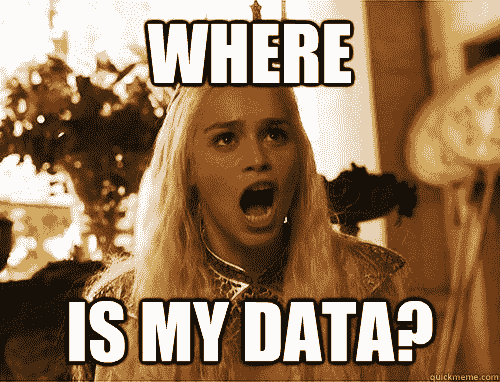
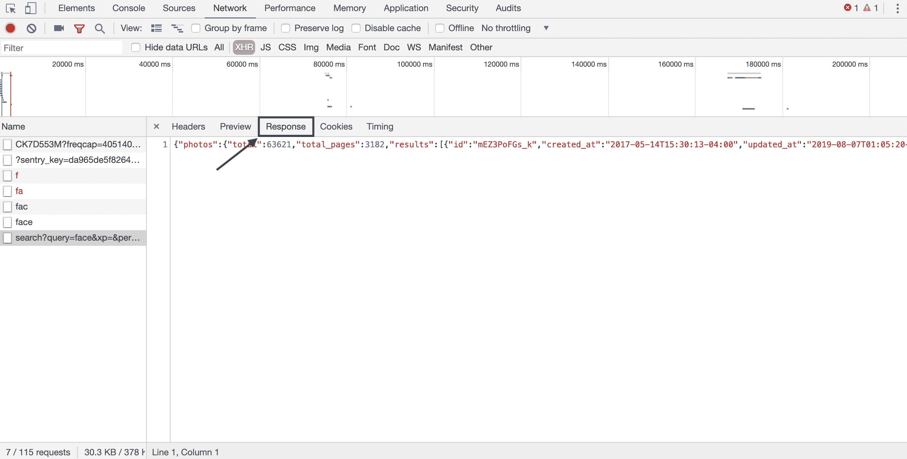

# 为计算机视觉算法建立图像数据集

> 原文：<https://blog.paperspace.com/building-computer-vision-datasets/>

根据我的经验，数据是我们在计算机视觉领域开发任何 ML/AI 管道时面临的最具挑战性的问题之一。这个问题有两个方面:

*   数据收集
*   数据标记

在本帖中，我们将深入探讨这些挑战，并使用最有效的方法和工具来应对它们。

## 数据收集



为了构建您的数据集，我建议使用 web 抓取以高效的方式收集大型图像数据集。这篇文章将帮助你理解如何管理来自 web 的图像数据集，这些数据集受 [creative commons 许可](https://en.wikipedia.org/wiki/Creative_Commons_license)的保护。
在本教程中，我们将学习如何使用 Python 从名为 unsplash 的网站上抓取图像。
以下是本教程的先决条件:

*   Python 的基础知识
*   Python 3.7 环境
*   Python 库:urllib，tqdm，concurrent.futures，requests，BeautifulSoup

我们将从学习如何查询从 [unsplash](https://unsplash.com/) 网站下载的图像开始本教程。

本教程将分为两个部分:

1.  网站查询-了解我们如何获得抓取的 URL
2.  Python 编码——自动化 web 抓取

## 网站查询

*   使用谷歌浏览器前往 https://unsplash.com/。
*   右键单击网页并选择检查选项。
*   选择网络- > XHR 选项。XMLHttpRequest (XHR)是一个对象形式的 API，其方法在 web 浏览器和 web 服务器之间传输数据。
*   这将为我们提供网站 URL，我们需要向其发送请求，以查询用于下载的搜索图像 URL。


*   选择如下所示的“Response”选项，查看 ping 请求 URL 时得到的响应。正如你所看到的，它是 JSON 数据的形式，我们可以使用内置的 JSON 解码器作为`request`库的一部分来读取它。查询要抓取的总页数、图片的 URL 和 id 所需的关键字可以在这里找到。
*   Requests 是一个漂亮而简单的 Python HTTP 库，是为高级用途而构建的。通过利用这个易于使用的 API，它消除了发出 HTTP 请求的复杂性，您可以专注于与网站的交互。



* * *

## Python 编码

现在，让我们深入了解如何编写代码来实现 web 抓取的自动化。

我们将从导入 python 中所有需要的库开始。

```py
import argparse, urllib3, os, requests
from tqdm import trange,tqdm
from concurrent.futures import ProcessPoolExecutor,as_completed
```

如果我们没有这些库中的任何一个，你可以使用“pip3”来下载它们，它是 python 的一个包安装程序。

在我们开始创建端到端优化脚本之前，让我们先测试一下是否可以查询一个图像并下载它。

这里我们从定义网站的`base_url`开始，接下来我们使用`requests`库创建一个`session`。

根据您尝试执行的操作，有许多 HTTP 方法可供您使用。最常见的是 GET 和 POST([https://en . Wikipedia . org/wiki/Hypertext _ Transfer _ Protocol # Request _ methods](https://en.wikipedia.org/wiki/Hypertext_Transfer_Protocol#Request_methods))。对于我们的场景，我们需要使用 GET 方法从指定的网站获取或检索数据/内容。要发出`GET`请求，调用`requests.get()`或`requests.Session().get()`。

如果您向同一个端点发出多个请求，那么最好通过调用``requests.Session()`` 来使用会话，因为它将保持连接之间的 TCP 会话打开，保留一个 cookie jar 并记住每个请求的任何参数，这可以显著提高性能。

```py
website  = "https://www.unsplash.com"
session  = requests.Session()
search   = 'face'
base_url = website+"/napi/search/photos?query={0}&xp=&per_page=20&".format(search)
response = session.get(base_url)
urls=[]
if response.status_code == 200 :
    results = response.json()['results']
    urls    = urls+[(url['id'],url['urls']['raw']) for url in results]
urllib.request.urlretrieve(urls[0][1],'./'+urls[0][0]+'.jpg')
```

当您调用`response.status_code`时，`200 OK`状态表示您的请求成功。还有其他代码(【https://en.wikipedia.org/wiki/List_of_HTTP_status_codes】)可以让你知道你的请求的状态。

一旦`response.status_code == 200`我们就可以使用内置的 JSON 解码器来获得结果字典。字典的关键字可以在上面的网站查询部分找到。

现在我们有了一个示例图像的 URL，我们将使用`urllib`包来下载这个图像。

要获得抓取所需的 URL，您也可以使用漂亮的 soup library 来代替请求。它是一个工具，你可以用它来剖析一个文档，并从 HTML 页面中提取你所需要的内容。然而，与 unsplash 不同，在网站没有后端 api 的情况下，它更有优势。它非常易于使用，并且从易于导航的网页中提取内容。下面是一个关于如何在本教程中使用漂亮的 soup 代替 URL 请求的例子:

```py
from bs4 import BeautifulSoup
import json
urls=[]
if response.status_code == 200 :
    results = BeautifulSoup(response.content,'html.parser')
    results = json.loads(str(results))['results']
    urls    = urls+[(url['id'],url['urls']['raw']) for url in results]
urllib.request.urlretrieve(urls[0][1],'./'+urls[0][0]+'.jpg')
```

让我们使用`concurrent.futures`库来调用`ProcessPoolExecutor`以支持多处理，从而为 web 抓取编写一个端到端的管道来构建数据集。

```py
import argparse, urllib, os, requests
from tqdm import trange,tqdm
from concurrent.futures import ProcessPoolExecutor,as_completed

class _unsplash(object):
    def __init__(self):
        self.website = "https://www.unsplash.com"
        self.session = requests.Session()
    def __call__(self,search,pages=None):
        base_url   = self.website+"/napi/search/photos?query    {0}&xp=&per_page=20&".format(search)
        if not pages:
            pages      = self.session.get(base_url).json()['total_pages']
        urls=[]
        for page in trange(1,pages+5,desc = "Downloading image URLs"):
            search_url  = self.website+"/napi/search/photos?query={0}&xp=&per_page=20&page={1}".format(search,page)
            response    = self.session.get(search_url)
            if response.status_code == 200 :
                results = response.json()['results']
                urls    = urls+[(url['id'],url['urls']['raw']) for url in results]
        return list(set(urls))
unsplash = _unsplash()

class _download_imgs(object):
    def __init__(self,output_dir,query):
        self.query     = query
        self.directory = output_dir+'/'+query
        if not os.path.isdir(self.directory) : os.makedirs(self.directory)
    def __call__(self,urls):
        with ProcessPoolExecutor() as pool:
            downloads = [pool.submit(urllib.request.urlretrieve,url[1],self.directory+'/'+url[0]+'.jpg') for url in urls]
            for download in tqdm(as_completed(downloads),total=len(downloads),desc='Downloading '+self.query+" images...."):
                pass

class _scrape(object):
    def __call__(self,args):
        if args.w.lower() == 'unsplash' : urls = unsplash(args.q.lower(), args.p)
        download_imgs     = _download_imgs(args.o,args.q.lower())
        download_imgs(urls)
scrape=_scrape()

if __name__=='__main__':
    parser = argparse.ArgumentParser(description='Web Scraping')
    parser.add_argument('-w', default='unsplash',choices = ['unsplash'], metavar = 'website', required = False, type = str,
                        help = 'name of the website that you want to scrape data from, example: unsplash')
    parser.add_argument('-q', metavar = 'query', required = True, type = str,
                        help = 'search term for query, example: mushroom')
    parser.add_argument('-o', metavar = 'output directory', required = True, type = str,
                        help = 'Path to the folder where you want the data to be stored, the directory will be created if not present')
    parser.add_argument('-p', metavar = 'no of pages', type = int, help = 'Number of pages to scrape')

    args = parser.parse_args()
    scrape(args) 
```

将上面的脚本保存在 webscrape.py 下，并从命令行运行它。

```py
python webscrape.py -q mushroom -o /Users/spandana/WebScraping/WebScraping/data -p 1
```

现在，您已经准备好使用 web scraping 构建您自己的图像数据集(在 creative commons 许可下)。

## 数据标记

在监督学习中，拥有训练数据的标签以及确保标签中没有任何噪声以构建健壮的计算机视觉算法是很重要的。因此，数据标记有助于我们处理这两种情况:

1.  清理数据集以移除标注噪声
2.  用于生成监督学习标签的图像注释

根据计算机视觉算法的目的，图像注释可以划分如下。

| 图像注释类型 | 描述/示例注释 | 使用案例 |
| --- | --- | --- |
| 2D 包围盒 | 4 点{点:(x1，y1)，(x2，y2)，(x3，y3)，(x4，y4)，标签:'狗' }封装对象 | 目标检测 |
| 3D 边界框 | 4 点{点:(x1，y1，z1)，(x2，y2，z2)，(x3，y3，z3)，(x4，y4，z4)，标签:'汽车' }封装对象 | 深度和距离计算、3D 体积也用于放射学成像的医学图像注释，以区分图像中的各种结构 |
| 线 | 线注释用于绘制车道，以训练用于车道检测的车辆感知模型。与边界框不同，它避免了许多空白和额外的噪点。 | 车道检测作为自主车辆的一部分 |
| 多边形 | 主要用于标注形状不规则的对象。贴标机必须以高精度在帧中生成对象的边界，这给出了关于对象的形状和大小的清晰概念。 | 时尚和服装分类 |
| 关键点 | 多个点和标签，例如:[{点:(x1，y1)，标签:'鼻子' }，{点:(x2，y2)，标签:'外左眼' }] | 人脸标志估计 |
| 语义分割 | 像素级标记，将图像分为多个部分。每个片段通常由唯一的颜色代码表示 | 地理传感(识别土地覆盖类型) |
| 图像分类 | 整个图像只有一个标签，例如:狗 | 动物识别 |

这可以通过三种方式实现:

### 众包

亚马逊(Mechanical Turk)、Figure Eight Inc、谷歌(数据标签服务)、Hive 等公司已经启动了以人为中心的数据标签服务。这使得大量的人能够基于所提供的一组规则/指令来注释数据集。这种方法的处理量更快，但取决于使用它的人数，该过程可能非常昂贵。

### 预训练对象检测算法

这种方法完全消除了循环中的人为因素，并且是数据注释的唯一自动化方式。然而，该过程的主要缺点是数据集的质量可能较低，这取决于训练模型的概化能力。此外，在应用标签不同于训练模型的情况下，该过程将不起作用。

### 开源图像注释工具

有时由于数据的隐私性和敏感性，我们不能将数据集发布到在线平台进行众包源数据注释。在这种情况下，开源图像注释工具非常有用，因为数据只能在办公室网络内本地访问和注释。一些常用的工具有 RectLabel、LabelImg 等。这是一个极其缓慢的过程，因为根据应用程序的不同，很少有人会从事手动注释工作。然而，这产生了具有最小人为错误的高质量数据集。

根据需要标记的数据量及其敏感性，您可以选择上述方法之一进行数据标注。下表总结了三种不同的方法及其优缺点。此时，您已经整理了数据，并找到了标记数据的方法。

| 方法 | 赞成的意见 | 骗局 |
| --- | --- | --- |
| 众包 | 快速过程 | 代价高昂的人工错误 |
| 预训练对象检测算法 | 自动化、成本节约(免费软件)和快速流程 | 低质量标注数据集可能没有所需的类标注作为输出。 |
| 开源图像注释工具 | 节约成本(免费软件)，高质量的标签数据集 | 缓慢的过程 |

根据您拥有和需要标注的数据量，您可以选择上述方法之一进行数据标注。在这一点上，您已经整理了您的数据，并找到了一种方法来标记您的数据，以开始训练您的计算机视觉算法。

参考资料:

[1][https://en.wikipedia.org/wiki/Creative_Commons_license](https://en.wikipedia.org/wiki/Creative_Commons_license)

[2][https://en . Wikipedia . org/wiki/Requests _(软件)](https://en.wikipedia.org/wiki/Requests_(software))

[3][https://en . Wikipedia . org/wiki/Beautiful _ Soup _(HTML _ parser)](https://en.wikipedia.org/wiki/Beautiful_Soup_(HTML_parser))

[3][https://en . Wikipedia . org/wiki/List _ of _ manual _ image _ annotation _ tools](https://en.wikipedia.org/wiki/List_of_manual_image_annotation_tools)

[4]a .科瓦什卡、o .鲁萨科夫斯基、l .飞飞和 k .格劳曼(2016 年)。计算机视觉中的众包。*计算机图形与视觉的基础与趋势*， *10* (3)，177-243。