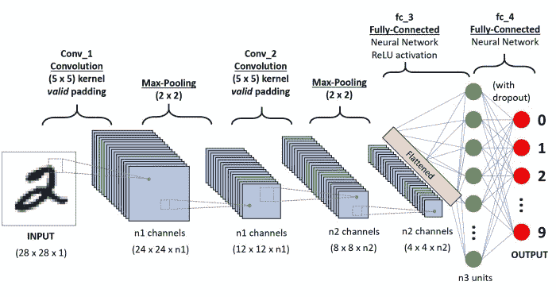

# 部署深度学习模型第 1 部分:准备模型

> 原文：<https://blog.paperspace.com/deploying-deep-learning-models-flask-web-python/>

无论你是在本地工作还是在云上工作，许多机器学习工程师都没有实际部署他们的模型以便在全球范围内使用的经验。在本教程中，我们将看到如何通过在 web 上部署您的项目，将您的作品展示给观众。我们将从创建一个识别手写数字的简单模型开始。然后，我们将一步一步地看到如何使用 Flask(一个用 Python 编写的微型 web 框架)创建一个用于在 web 上部署它的接口。

# 快速建立模型:CNN 与 MNIST

在我们开始将模型部署到生产环境之前，让我们先创建一个可以保存和部署的简单模型。如果你已经建立了自己的模型，可以随意跳到下面的*用 h5py* 保存训练好的模型，或者*创建一个 Flask 应用程序为模型服务*。出于我们的目的，我们将从一个简单的用例开始，使用 MNIST 数据集来识别手写数字，从而创建一个深度学习模型。这将让我们了解如何从头开始定义网络架构，然后训练、评估和保存它们以便部署。

卷积神经网络(CNN)用于手写识别任务，以及大多数图像识别任务。图像首先通过不同的卷积层发送，神经元在卷积层提取和识别特征。每当网络在测试集中遇到与它在训练中学习到的特征相似的模式时，它会将该图像分类到相应的输出标签。



现在让我们使用 Keras 深度学习框架通过 8 个简单的步骤来实现该算法。

## 步骤 1:导入必要的模块和层

我们总是从导入我们将使用的所有模块和函数开始。这个神经网络是在 Keras 中实现的(它预装在 Paperspace 中，但是如果您在本地运行它，您总是可以使用`pip install Keras`从命令行安装 Keras)。接下来，我们导入将用于构建神经网络架构的模型和层，在本例中是 CNN。

```py
# imports

import keras
from keras.datasets import mnist
from keras.models import Sequential
from keras.layers import Dense, Dropout, Flatten
from keras.layers import Conv2D, MaxPooling2D
from keras import backend as K 
```

## 步骤 2:定义超参数

为您的网络选择超参数可能是一项具有挑战性的任务。在不涉及太多理论或测试许多不同值的情况下，这里我们使用批量大小(定义在更新模型权重之前要处理的训练样本的数量)和时期数量(训练集中数据的完整呈现以供学习)的标准值。因为我们考虑数字 1-10，所以有 10 个类。

```py
# Hyperparameters

num_classes = 10
batch_size = 128
epochs = 12 
```

## 步骤 3:加载图像

下一步是加载我们的数据集，并为我们的训练过程设置恒定的图像大小。图像大小固定为(28 x 28)，因为网络输入参数总是不变的(不能用不同的维度训练网络)。我们简单地用步骤 1 中导入的 MNIST 类的加载方法加载我们的 MNIST 数据集。

```py
# Image Resolution

img_rows, img_cols = 28, 28

# Loading the data.

(x_train, y_train), (x_test, y_test) = mnist.load_data() 
```

## 第四步:数据预处理

在这一步中，我们需要确保训练数据经过预处理并调整到相同的方向；如果输入的大小不同，网络的性能将会不准确。我们对每个图像使用简单的整形方法，并在整个数据集上迭代。接下来，我们将受关注的标签分配给训练过程的每幅图像，在这种情况下，我们使用`to_categorical`方法将标签分配给每幅图像。

```py
# Preparing the data

if K.image_data_format() == 'channels_first':
    x_train = x_train.reshape(x_train.shape[0], 1, img_rows, img_cols)
    x_test = x_test.reshape(x_test.shape[0], 1, img_rows, img_cols)
    input_shape = (1, img_rows, img_cols)
else:
    x_train = x_train.reshape(x_train.shape[0], img_rows, img_cols, 1)
    x_test = x_test.reshape(x_test.shape[0], img_rows, img_cols, 1)
    input_shape = (img_rows, img_cols, 1)

x_train = x_train.astype('float32')
x_test = x_test.astype('float32')
x_train /= 255
x_test /= 255
print('x_train shape:', x_train.shape)
print(x_train.shape[0], 'train samples')
print(x_test.shape[0], 'test samples')

y_train = keras.utils.to_categorical(y_train, num_classes)
y_test = keras.utils.to_categorical(y_test, num_classes) 
```

## 步骤 5:定义架构

使用 Keras 框架，我们可以通过顺序添加层来轻松声明模型。我们为此使用了`add()`方法。

```py
# Creating the Model 

model = Sequential()
model.add(Conv2D(32, kernel_size=(3, 3),activation='relu',input_shape=input_shape))
model.add(Conv2D(64, (3, 3), activation='relu'))
model.add(MaxPooling2D(pool_size=(2, 2)))
model.add(Dropout(0.25))
model.add(Flatten())
model.add(Dense(128, activation='relu'))
model.add(Dropout(0.5))
model.add(Dense(num_classes, activation='softmax'))
model.compile(loss=keras.losses.categorical_crossentropy,
              optimizer=keras.optimizers.Adadelta(),
              metrics=['accuracy']) 
```

## 第六步:训练循环

接下来，我们用声明的超参数拟合模型，并启动训练过程。这可以简单地通过使用`model.fit()`方法并传递参数来完成。

```py
# Training the Model

model.fit(x_train, y_train,
          batch_size=batch_size,
          epochs=epochs,
          verbose=1,
          validation_data=(x_test, y_test)) 
```

## 步骤 7:评估模型

```py
# Evaluating the Predictions on the Model

score = model.evaluate(x_test, y_test, verbose=0)
print('Test loss:', score[0])
print('Test accuracy:', score[1]) 
```

## 步骤 8:保存模型

```py
# Saving the model for Future Inferences

model_json = model.to_json()
with open("model.json", "w") as json_file:
    json_file.write(model_json)
# serialize weights to HDF5
model.save_weights("model.h5") 
```

运行该程序并成功完成培训后，您将在同一目录中找到两个文件:

1.  模型. json
2.  型号. h5

*model.h5* 文件是一个保存权重的二进制文件。文件 *model.json* 是您刚刚构建的模型的架构。

# 使用 h5py 保存训练模型

HDF5 库允许用户存储大量数字数据，并使用 NumPy 轻松操作这些数据。例如，您可以将存储在磁盘上的多 TB 数据集切片，就像它们是真正的 NumPy 数组一样。数以千计的数据集可以存储在一个文件中，按照你想要的方式进行分类和标记。

上面添加了`save_weights`方法，以便保存网络使用 h5py 学习的权重。h5py 包是 HDF5 二进制数据格式的 Pythonic 接口。

现在我们已经将模型保存为 HDF5 格式，我们可以随时加载权重，并将其应用于未来的任务。为了加载权重，我们还需要定义相应的模型架构。让我们从之前使用的 JSON 文件开始。一旦模型准备好了训练好的权重，我们就可以用它来进行推理了。

```py
# imports

from keras import model_from_json 

# opening and store file in a variable

json_file = open('model.json','r')
loaded_model_json = json_file.read()
json_file.close()

# use Keras model_from_json to make a loaded model

loaded_model = model_from_json(loaded_model_json)

# load weights into new model

loaded_model.load_weights("model.h5")
print("Loaded Model from disk")

# compile and evaluate loaded model

loaded_model.compile(loss='categorical_crossentropy',optimizer='adam',metrics=['accuracy']) 
```

现在我们已经保存了模型以及从训练中学习到的权重，我们可以使用它们对新数据进行推断。这就是我们如何使训练好的模型可重用。

# 创建一个为模型服务的 Flask 应用程序

为了服务保存的模型，我们将使用 Flask，这是一个用 Python 编写的微型 web 框架(它被称为“微型”框架，因为它不需要特定的工具或库)。

为了创建能够识别不同手写数字的 web 应用程序，我们需要 flask 应用程序中的两条路线:

1.  绘制图像的用户的索引页路径
2.  从我们保存的模型进行推理的预测路线

这些定义如下。

```py
from flask import Flask, render_template, request

@app.route('/')
def index_view():
    return render_template('index.html')

@app.route('/predict/',methods=['GET','POST'])
def predict():
	response = "For ML Prediction"
return response	

if __name__ == '__main__':
    app.run(debug=True, port=8000) 
```

现在，让我们继续实现我们完整的 app . py。predict 函数应该获取用户绘制的图像并将其发送给模型。在我们的例子中，图像是一个包含像素亮度的 NumPy 数组。

```py
from flask import Flask, render_template, request
from scipy.misc import imsave, imread, imresize
import numpy as np
import keras.models
import re
import sys 
import os
import base64
sys.path.append(os.path.abspath("./model"))
from load import * 

global graph, model

model, graph = init()

app = Flask(__name__)

@app.route('/')
def index_view():
    return render_template('index.html')

def convertImage(imgData1):
	imgstr = re.search(b'base64,(.*)',imgData1).group(1)
	with open('output.png','wb') as output:
	    output.write(base64.b64decode(imgstr))

@app.route('/predict/',methods=['GET','POST'])
def predict():
	imgData = request.get_data()
	convertImage(imgData)
	x = imread('output.png',mode='L')
	x = np.invert(x)
	x = imresize(x,(28,28))
	x = x.reshape(1,28,28,1)

	with graph.as_default():
		out = model.predict(x)
		print(out)
		print(np.argmax(out,axis=1))

		response = np.array_str(np.argmax(out,axis=1))
		return response	

if __name__ == '__main__':
    app.run(debug=True, port=8000) 
```

这里我们有加载器函数 load.py:

```py
import numpy as np
import keras.models
from keras.models import model_from_json
from scipy.misc import imread, imresize,imshow
import tensorflow as tf

def init(): 
	json_file = open('model.json','r')
	loaded_model_json = json_file.read()
	json_file.close()
	loaded_model = model_from_json(loaded_model_json)
	#load weights into new model
	loaded_model.load_weights("model.h5")
	print("Loaded Model from disk")

	#compile and evaluate loaded model
	loaded_model.compile(loss='categorical_crossentropy',optimizer='adam',metrics=['accuracy'])
	#loss,accuracy = model.evaluate(X_test,y_test)
	#print('loss:', loss)
	#print('accuracy:', accuracy)
	graph = tf.get_default_graph()

	return loaded_model,graph 
```

在我们深入到部署到云中的最后一步之前，让我们创建一个界面，让用户能够从浏览器中绘制图像。我们将使用 JavaScript 并在 HTML 页面上呈现画布。下面是渲染画布以供绘制的 JavaScript 代码片段。

```py
(function()
{
	var canvas = document.querySelector( "#canvas" );
	var context = canvas.getContext( "2d" );
	canvas.width = 280;
	canvas.height = 280;
	var Mouse = { x: 0, y: 0 };
	var lastMouse = { x: 0, y: 0 };
	context.fillStyle="white";
	context.fillRect(0,0,canvas.width,canvas.height);
	context.color = "black";
	context.lineWidth = 6;
	context.lineJoin = context.lineCap = 'round';
	debug();
	canvas.addEventListener( "mousemove", function( e )
	{
		lastMouse.x = Mouse.x;
		lastMouse.y = Mouse.y;

		Mouse.x = e.pageX - this.offsetLeft;
		Mouse.y = e.pageY - this.offsetTop;

	}, false );

	canvas.addEventListener( "mousedown", function( e )
	{
		canvas.addEventListener( "mousemove", onPaint, false );

	}, false );

	canvas.addEventListener( "mouseup", function()
	{
		canvas.removeEventListener( "mousemove", onPaint, false );

	}, false );

	var onPaint = function()
	{	
		context.lineWidth = context.lineWidth;
		context.lineJoin = "round";
		context.lineCap = "round";
		context.strokeStyle = context.color;

		context.beginPath();
		context.moveTo( lastMouse.x, lastMouse.y );
		context.lineTo( Mouse.x, Mouse.y );
		context.closePath();
		context.stroke();
	};

	function debug()
	{
		/* CLEAR BUTTON */
		var clearButton = $( "#clearButton" );
		clearButton.on( "click", function()
		{
			context.clearRect( 0, 0, 280, 280 );
			context.fillStyle="white";
			context.fillRect(0,0,canvas.width,canvas.height);

		});
		$( "#colors" ).change(function()
		{
			var color = $( "#colors" ).val();
			context.color = color;
		});		
		$( "#lineWidth" ).change(function()
		{
			context.lineWidth = $( this ).val();
		});
	}
}()); 
```

一旦你在 HTML 中使用了这个片段，在本教程结束时，你的目录结构应该是这样的:

ml-in-prod/
app . py
procfile
requirements . txt
runtime . txt【T4/
【model . JSON】
model . h

这就对了。您的应用程序已经启动并运行。在下一个教程中，我们将了解如何将其部署在 Paperspace 云 GPU 上，以使应用程序更加强大、可靠和易于访问。