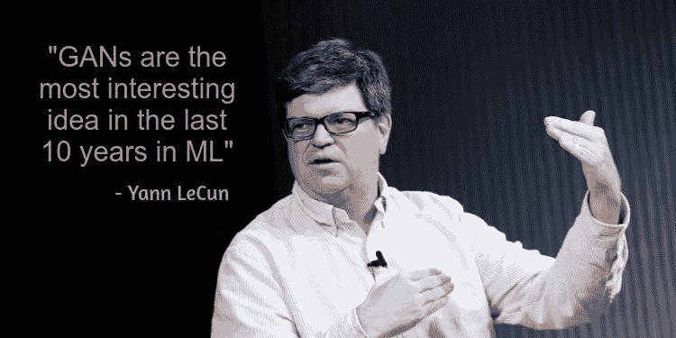
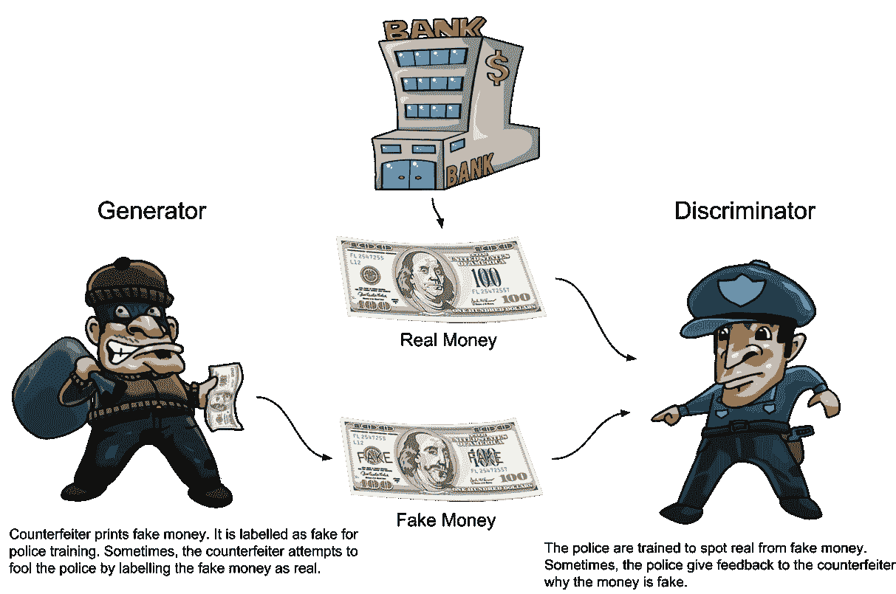
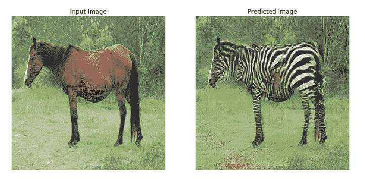
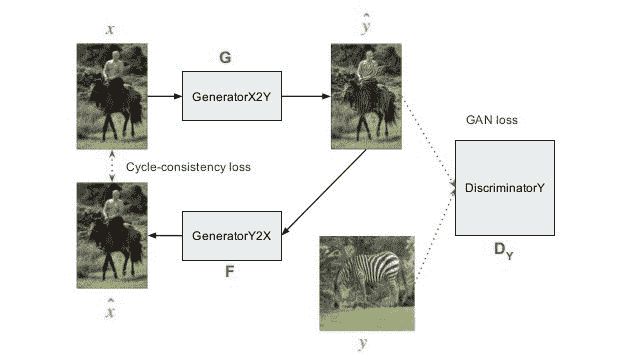
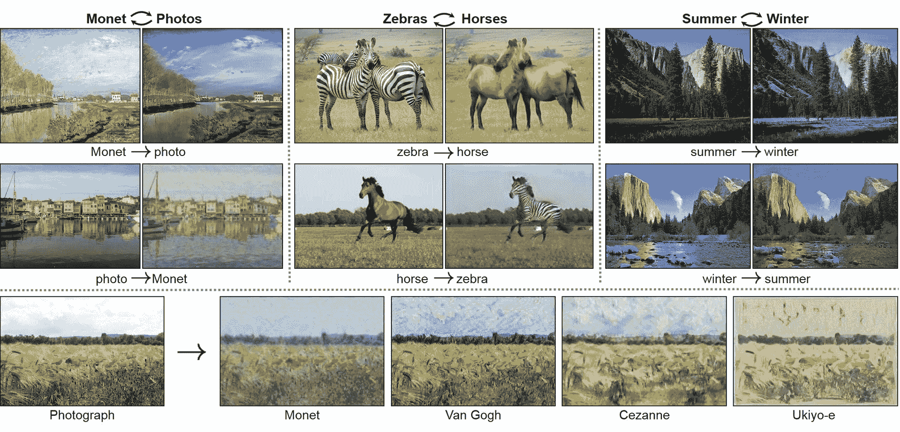
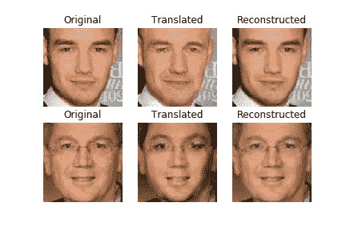
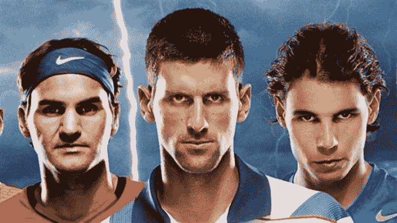

# 为年龄转换实现 CycleGAN

> 原文：<https://blog.paperspace.com/use-cyclegan-age-conversion-keras-python/>

如果你今年在任何社交媒体上，你可能会看到人们上传自己的近照，紧挨着另一张他们 30 年后的照片。


Source: [https://www.boredpanda.com/old-age-filter-photos-faceapp/](https://www.boredpanda.com/old-age-filter-photos-faceapp/?utm_source=google&utm_medium=organic&utm_campaign=organic)

这一切之所以成为可能，是因为一款名为[**face app**](https://play.google.com/store/apps/details?id=io.faceapp)**的应用在全球范围内迅速走红。虽然在过去已经有过不同的尝试来解决面部老化问题，但是他们面临着一些限制，比如需要大量的数据，产生鬼影(看起来不自然)，以及无法进行相反的操作，即从老变年轻。简单地说，结果没有达到我们的期望。**

**随着 GAN 架构最近的成功，我们现在可以产生高分辨率和自然外观的输出。在本教程中，我们将训练当今最有趣的架构之一 CycleGAN 从 20 秒到 50 秒进行正向老化，从 50 秒到 20 秒进行反向老化。让我们开始吧。**

## **生成算法**

**如果你曾经训练过一个神经网络，比如一个简单的分类网络，你可能训练过一个**辨别网络**，它的唯一任务是区分类别(就像狗和猫的分类器)。流行的神经网络架构，如 VGG 和 Resnet 属于这一类。**

**[**生成算法**](https://medium.com/analytics-vidhya/an-introduction-to-generative-deep-learning-792e93d1c6d4) **，**另一方面，是一组有趣的算法，它们能做的远不止简单的分类任务。他们可以生成看起来与模型被训练的领域相似的数据。例如，如果在马的图片上训练模型，生成算法可以创建看起来真实但与训练示例不同的新马。把这想象成人类如何想象世界上的任何事物，只要闭上眼睛思考。**

**

**If Yann Lecun says so, we must nod**** 

## **GANs 如何工作**

**[生成对抗网络](https://arxiv.org/pdf/1406.2661.pdf) (GANs)是最流行的生成算法之一。它们有许多有趣的应用(其中一些在这里被探索[)。GAN 由两个神经网络组成:一个**发生器**和一个**鉴别器**。生成器网络的任务是创建真实的图像，而鉴别器网络必须区分真实图像和由生成器创建的假图像。](https://machinelearningmastery.com/impressive-applications-of-generative-adversarial-networks/)**

**发生器和鉴别器在一场 **minimax** 游戏中相互竞争，直到发生器创建的图像如此逼真，以至于鉴别器无法确定哪个图像是真实的，哪个是人工生成的。在这个阶段达到平衡，训练停止。**

**

Source: [https://dzone.com/articles/working-principles-of-generative-adversarial-netwo](https://dzone.com/articles/working-principles-of-generative-adversarial-netwo)** 

**两个网络同时被训练，直到达到平衡。由于两个网络相互竞争，并试图在每次迭代中自我完善，因此损失不会像一般分类网络那样持续减少。我们将在下面讨论如何监控网络性能。**

**为了实现不同的用例，许多新的架构正在不断开发中，其中比较流行的有 DCGAN、StyleGAN、CGAN、BigGAN 等。对于人脸老化的情况，我们感兴趣的是一种专门从事域名迁移的特殊架构，称为 CycleGAN。它可以从一个域(例如，一匹马)获取图像，并将其转换到另一个域(如斑马)，同时保持输入域的特征(即，看起来与输入马相似)。**

## **CycleGAN 与众不同**

**[CycleGAN](https://arxiv.org/pdf/1703.10593.pdf) 是我们上面讨论的通用 GAN 架构的变体，不同之处在于它有两对发生器和鉴别器。它的开发是为了解决当试图从一个领域翻译到另一个领域时需要大量图像的问题。例如，如果我们想让一个将军甘修改马的图像看起来像斑马，这将需要大量的标记马的图像和相应的相似的斑马图像。这种数据收集不仅麻烦，而且几乎不可能，因为你不可能总是获得不同领域的配对图像。**

**

Source: [https://www.tensorflow.org/tutorials/generative/cyclegan](https://www.tensorflow.org/tutorials/generative/cyclegan)** 

**CycleGAN 解决了需要来自两个域的标记图像的数据集的问题。它通过提出一个简单而聪明的技巧来做到这一点。它不是只有一个从马到斑马的网络，而是有两个网络:一个从马到斑马，另一个从斑马到马。下图展示了这一点。**

****

**考虑两对发生器-鉴别器作为 *G1-D1* 和 *G2-D2* 。 *G1* 将输入的马图像转换成看起来像斑马的图像。然后， *D1* 的任务是考虑来自 *G1* 的图像是真实的斑马，还是来自生成器网络的生成斑马。从 *G1* 生成的图像现在被传递给生成器 *G2* 。 *G2* 的任务是将生成的斑马图像转换成类似马的图像。所以我们拿一匹马，用 *G1* 把它转换成斑马，然后用 *G2* 把它转换回马。然后 *D2* 的任务是从 *G2* 中辨别出图像是一匹真正的马，还是一匹生成的马。**

**现在网络是用多重损失来训练的。我们使用两个发生器-鉴频器对的损耗，就像一般的 GAN 一样，但我们还添加了一个**循环损耗**。当图像在通过两个发生器之后循环返回时，使用该损失；最终图像应该看起来像原始输入图像(即，当从马→斑马→马时，最终的马应该看起来像原始的马)。对这种循环损失的需要来自于我们的要求，即从一个域转换到另一个域的图像应该保留与原始域的区别特征。**

> **如果使用 CycleGAN 从一匹马生成斑马，它不仅应该看起来像斑马，还应该给人与被修改为看起来像斑马的原始马相同的感觉。**

**现在我们可以看到，不需要一个带标签的数据集来将每匹马映射到相应的相似外观的斑马。我们只需要提供一组马的图像和一组斑马的图像，网络会自己学习如何做翻译。由于域转移是双向的，我们也可以用第二个生成器 *G2* 将这些斑马图像转换回马图像。**

**

Use cases of CycleGAN. Source: [https://github.com/hyunbo9/yonsei](https://github.com/hyunbo9/yonsei)** 

## **使用 CycleGAN 改变面部**

**记住这个理论，让我们开始构建应用程序。通过查看上面讨论的架构，我们应该知道如何解决这个问题。我们将从 20-30 岁的人群中获取一组面部图像，从 50-60 岁的人群中获取另一组图像。然后，我们将使用 CycleGAN 进行域名迁移，将 20 岁的人转换为 50 岁的人，反之亦然。**

**完整笔记本请参考 GitHub 库 [CycleGAN 进行年龄换算](https://github.com/Paperspace/FaceApp-with-Deep-Learning)。**

**我们将使用 [UTKFace 数据集](https://susanqq.github.io/UTKFace/)，其中包含超过 20，000 张不同种族和性别的人的面部图像，年龄从 0 岁到 116 岁不等。由于我们只关注 20-30 岁和 50-60 岁的人，我们将过滤图像并删除其他年龄组的图像。**

**我们将使用 CycleGAN Keras [基本代码](https://github.com/eriklindernoren/Keras-GAN/tree/master/cyclegan)，并修改它以适应我们的用例。鉴别器是一个简单的网络，有 4 个卷积层，每个卷积层的步长为 2，还有一个最终的聚合卷积层。因此，如果我们提供大小为(256 x 256)的输入图像，我们将得到(16 x 16)的输出。这融合了 [Pix2Pix](https://phillipi.github.io/pix2pix/) 提出的建议之一，即 [PatchGAN](https://arxiv.org/abs/1611.07004) 鉴别器。PatchGAN 的输出映射到输入图像的一个补片，辨别输入图像的该补片是真的还是假的。在图像被确定为真实的情况下，期望的输出将是(16×16)个数字的矩阵，每个数字等于 1，如果图像被确定为人工生成，则等于 0。**

**这是更有利的，因为现在不是将整个图像分类为一类，而是将图像的多个小块分类为属于或不属于同一类。因此，我们在训练期间提供了更多的信号/梯度/信息，与使用 softmax 输出整个图像相比，可以产生更清晰的特征。**

```py
`def build_discriminator(self):
        def d_layer(layer_input, filters, f_size=4, normalization=True):
            """Discriminator layer"""
            d = Conv2D(filters, kernel_size=f_size, strides=2, padding='same')(layer_input)
            d = LeakyReLU(alpha=0.2)(d)
            if normalization:
                d = InstanceNormalization()(d)
            return d
        img = Input(shape=self.img_shape)
        d1 = d_layer(img, self.df, normalization=False)
        d2 = d_layer(d1, self.df*2)
        d3 = d_layer(d2, self.df*4)
        d4 = d_layer(d3, self.df*8)
        validity = Conv2D(1, kernel_size=4, strides=1, padding='same')(d4)
        return Model(img, validity)` 
```

 **我们从 Keras GAN repo 获得的代码使用了 U-Net 风格的生成器，但需要进行修改。我们将使用一个 ResNet 风格的生成器，因为它在实验后为这个用例提供了更好的结果。生成器的输入是一个大小为(256 x 256)的图像，在这个场景中是一个 20 多岁的人的脸。

通过经过步长为 2 的 2 个卷积层，图像被下采样 4 倍(即 64×64)，之后是 9 个保留大小的剩余块。然后，通过执行转置卷积，我们向上采样回到(256 x 256)的原始大小。我们得到的最终输出应该是同一个人的变形图像，现在看起来就像他们 50 多岁了。

```py
# Resnet style generator
        c0 = Input(shape=self.img_shape)
        c1 = conv2d(c0, filters=self.gf, strides=1, name="g_e1", f_size=7)
        c2 = conv2d(c1, filters=self.gf*2, strides=2, name="g_e2", f_size=3)
        c3 = conv2d(c2, filters=self.gf*4, strides=2, name="g_e3", f_size=3)

        r1 = residual(c3, filters=self.gf*4, name='g_r1')
        r2 = residual(r1, self.gf*4, name='g_r2')
        r3 = residual(r2, self.gf*4, name='g_r3')
        r4 = residual(r3, self.gf*4, name='g_r4')
        r5 = residual(r4, self.gf*4, name='g_r5')
        r6 = residual(r5, self.gf*4, name='g_r6')
        r7 = residual(r6, self.gf*4, name='g_r7')
        r8 = residual(r7, self.gf*4, name='g_r8')
        r9 = residual(r8, self.gf*4, name='g_r9')

        d1 = conv2d_transpose(r9, filters=self.gf*2, f_size=3, strides=2, name='g_d1_dc')
        d2 = conv2d_transpose(d1, filters=self.gf, f_size=3, strides=2, name='g_d2_dc')

        output_img = Conv2D(self.channels, kernel_size=7, strides=1, padding='same', activation='tanh')(d2) 
```

我们将有两对这样的生成器和鉴别器:一对用于前向老化，一对用于后向老化。

## 损失函数

我们终于到了损失函数。鉴别器损耗是我们上面讨论的贴片的均方误差。发电机损耗将是鉴频器损耗的负值，因为发电机试图最大化鉴频器误差。

如前所述，对于 CycleGAN，我们增加了循环损耗。我们将原始图像和回收图像之间的均方误差作为损失项。

> 如果 50 岁的图像被提供作为输入，进行从 20 岁到 50 岁的年龄转换的生成器不应该改变/转换图像。由于输入已经是期望的年龄，在这种情况下，网络应该充当身份。

当然，如果输入图像已经达到了期望的年龄，网络应该知道不做任何修改就返回该图像作为输出。为了确保网络以这种方式运行，一个**身份损失**被添加到损失函数中。这也是输出图像和输入图像之间的均方差。正向和反向发电机都有这个附加损耗项。

总之，我们有一般的发电机和鉴频器损耗，就像传统的氮化镓。此外，当从域 *A* 转换到 *B* ，然后回到域 *A* 时，我们有用于匹配输入的循环损耗。我们也有身份损失，以确保网络不会改变输入，如果它已经属于正确的域(在这种情况下，年龄)。

\ \ Loss = discriminant _ Loss+λ1 * cyclic _ Loss+λ2 * identity _ Loss \ \

这里λ1，λ2 是超参数

```py
valid = np.ones((batch_size,) + self.disc_patch)
fake = np.zeros((batch_size,) + self.disc_patch)
fake_B = self.g_AB.predict(imgs_A)
fake_A = self.g_BA.predict(imgs_B)

dA_loss_real = self.d_A.train_on_batch(imgs_A, valid)
dA_loss_fake = self.d_A.train_on_batch(fake_A, fake)
dA_loss = 0.5 * np.add(dA_loss_real, dA_loss_fake)

dB_loss_real = self.d_B.train_on_batch(imgs_B, valid)
dB_loss_fake = self.d_B.train_on_batch(fake_B, fake)
dB_loss = 0.5 * np.add(dB_loss_real, dB_loss_fake)

# Total disciminator loss
d_loss = 0.5 * np.add(dA_loss, dB_loss)

g_loss = self.combined.train_on_batch([imgs_A, imgs_B],
                                        [valid, valid,
                                        imgs_A, imgs_B,
                                        imgs_A, imgs_B]) 
```

在训练时，我们从 20 岁(图像 A)和 50 岁(图像 B)拍摄一批图像对。生成器 g_AB 将年龄 20 转换为年龄 50，鉴别器 d_A 将其分类为真实图像或生成图像。g_BA 和 d_B 对 50 岁到 20 岁的转换做了类似的工作。图像 A 被传递到 g_AB，并通过 g_BA 进行重建，反之亦然。

我们一起训练鉴别器和生成器的组合模型，并试图同时减少所有 3 种损失，即鉴别损失、循环损失和同一性损失。

## 稳定培训的方法

1.  遵循杰瑞米·霍华德的建议，在训练时使用渐进式调整大小。我不能再强调这件事的重要性了。当我开始用 256 × 256 的大小训练时，我不得不使用批量大小 1，因为否则我的 GPU 会死。看到结果花了很多时间，相信我，你需要修改很多。如果你每次实验都要等几个小时，那就需要很长时间。所以从较小的尺寸开始，比如 64 × 64，然后逐渐增加输入图像的尺寸。这帮助我以 32 的批量运行(快了 32 倍)。这种技巧是可行的，因为网络的初始特征层学习相同的概念，而不管图像大小。
2.  密切关注鉴别器、生成器、循环、身份丢失。如果一个损失超过另一个，试着调整系数λ1，λ2。否则，模型可能会专注于优化一个损失，而牺牲其他损失。例如，如果循环损失占主导地位，则循环图像看起来与输入图像相同，但生成的图像不会如我们所期望的那样，即年龄增长可能没有发生，因为网络将更多的注意力放在循环损失上。

## 排除故障

与传统的分类任务不同，我们不能通过查看损耗来判断网络的性能，也不能说如果损耗降低，模型就会改善，因为在 GAN 中，损耗不会一直降低。一种是试图降低损耗的鉴频器，另一种是工作原理相反的发电机，它试图增加鉴频器损耗，因此损耗以颠倒的方式进行。

但是我们怎么知道网络正在被训练？我们通过在训练过程中观察发电机的输出来做到这一点。在每几次迭代中，对一些图像进行采样，并通过生成器来查看产生了什么结果。如果你觉得结果看起来不吸引人，或者你觉得只有损失得到优化，你可以尝试修补几个部分，修复它，并重新开始训练。

此外，这种查看输出和检查输出的方式比在分类任务中查看一个简单的数字更有价值，也更容易上瘾。当我开发应用程序时，我不能停止等待每几个迭代完成，这样我就可以看到生成的输出，同时为生成器的胜利欢呼(抱歉歧视者)。

在使用上述技术和技巧训练了大约 50 个时期后，结果看起来如下，相当不错



Age conversion

## 现实世界中的用法

正如你在上面看到的，用于训练的图像是完美捕捉的头像，但在现实世界中，可能并不总是有可能获得这样的图像来使用我们的 Cyclegan 进行面部老化。我们需要能够找到一张脸在图像中的位置，并修改图像的这一部分。

为此，我们将在将图像传递给 cyclegan 之前运行人脸检测器。面部检测器给出图像中各种面部的边界框。然后，我们将编写一个脚本，将这些盒子中的作物发送到我们的网络。然后，我们将把输出放回输入图像。这样我们就可以处理来自真实世界的任何图像

为此，我们将使用来自[的 opencv 人脸检测器，这里的](https://github.com/spmallick/learnopencv/blob/master/FaceDetectionComparison/face_detection_opencv_dnn.py)基于 resnet-ssd 架构。

```py
 def detectFaceOpenCVDnn(net, frame, ctype):
    frameOpencvDnn = frame.copy()
    frameHeight = frameOpencvDnn.shape[0]
    frameWidth = frameOpencvDnn.shape[1]
    blob = cv2.dnn.blobFromImage(frameOpencvDnn, 1.0, (frameHeight, frameWidth), [104, 117, 123], False, False)

    net.setInput(blob)
    detections = net.forward()
    bboxes = []
    for i in range(detections.shape[2]):
        confidence = detections[0, 0, i, 2]
        if confidence > conf_threshold:
            x1 = int(detections[0, 0, i, 3] * frameWidth)
            y1 = int(detections[0, 0, i, 4] * frameHeight)
            x2 = int(detections[0, 0, i, 5] * frameWidth)
            y2 = int(detections[0, 0, i, 6] * frameHeight)
            bboxes.append([x1, y1, x2, y2])
            if not(x1<30 or y1<30 or x2>frameWidth-30 or y2>frameHeight-30):
              y1, y2 = y1-20, y2+20
              x1, x2 = x1-20, x2+20
            else:
              continue
            crop_img = frameOpencvDnn[y1:y2, x1:x2]
            crop_img = cv2.cvtColor(crop_img, cv2.COLOR_BGR2RGB).astype("float32")
            cv2.imwrite("cropped"+str(i)+".jpg", crop_img)
            inp = np.array([gan.data_loader.get_img(crop_img)])
            case1 = np.ones(gan.condition_shape)
            case2 = np.zeros(gan.condition_shape)   
            if ctype==0:
              case = case1
            else:
              case = case2
            case1stack = np.array([case]*1)
            old_img = gan.g_AB.predict([inp, case1stack])
            new_img = revert_img(old_img[0], (y2-y1, x2-x1))
            new_img = cv2.cvtColor(new_img, cv2.COLOR_RGB2BGR).astype("float32")
            frameOpencvDnn[y1:y2, x1:x2] = new_img
            scipy.misc.imsave("old"+str(i)+".jpg", new_img)
    return frameOpencvDnn, bboxes

conf_threshold = 0.8
modelFile = "opencv_face_detector_uint8.pb"
configFile = "opencv_face_detector.pbtxt"
net = cv2.dnn.readNetFromTensorflow(modelFile, configFile)
frame = cv2.imread("big3.jpg")
outOpencvDnn, bboxes = detectFaceOpenCVDnn(net,frame,0)
cv2.imwrite("big3_old.jpg", outOpencvDnn)
outOpencvDnn, bboxes = detectFaceOpenCVDnn(net,frame,1)
cv2.imwrite("big3_black.jpg", outOpencvDnn) 
```

### 原象



Source: [https://www.sportskeeda.com/tennis/top-3-tennis-players-of-the-21st-century](https://www.sportskeeda.com/tennis/top-3-tennis-players-of-the-21st-century)

### 年龄转换


正如我们所看到的，对于我们训练的有限数据和图像大小来说，结果相当不错。此外，上面的图像看起来与模型训练的数据有很大不同，但模型仍然工作得很好，因此模型没有过度拟合。通过在更大的图像(UTKFace 为 256x256)和更真实的图像(如上)上训练网络，可以进一步改善结果，然后我们将有一个生产就绪的类似 Faceapp 的应用程序。

## 摘要

我们已经了解了什么是 GAN，以及如何使用变体 CycleGAN 来构建像 **FaceApp** 这样的应用。同样，我们讨论了一些稳定训练的方法。我们设计了一个实验，让发电机有足够的能力执行多项任务。

从这里去哪里？。我们可以在条件部分进行更多的实验，尝试看看我们是否可以同时执行多个任务，尝试看看生成器在不同条件输入下的表现。实验和改进的空间很大。

你也可以看看这个中的[,通过使用变分自动编码器(另一种流行的生成算法)的变体，可以获得类似的结果。](https://arxiv.org/pdf/1702.08423.pdf)**