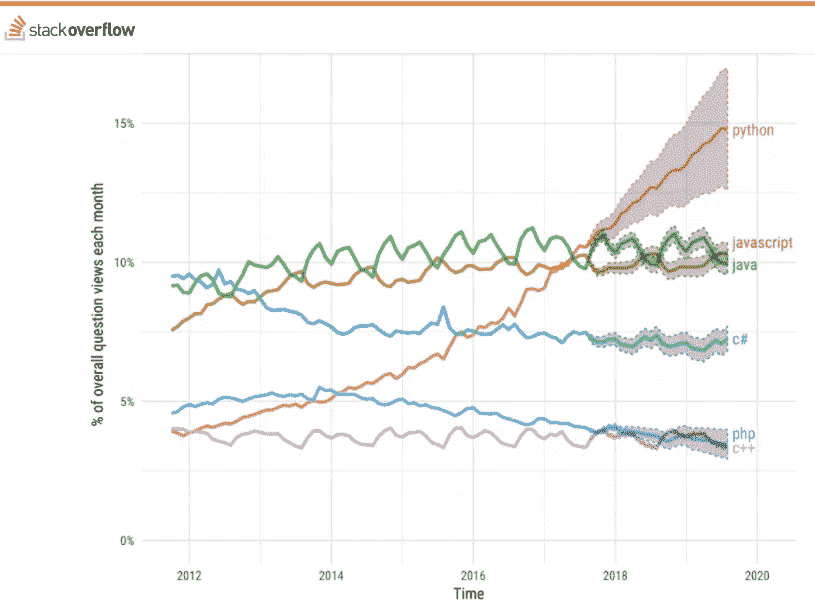
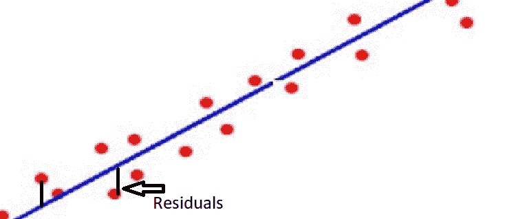
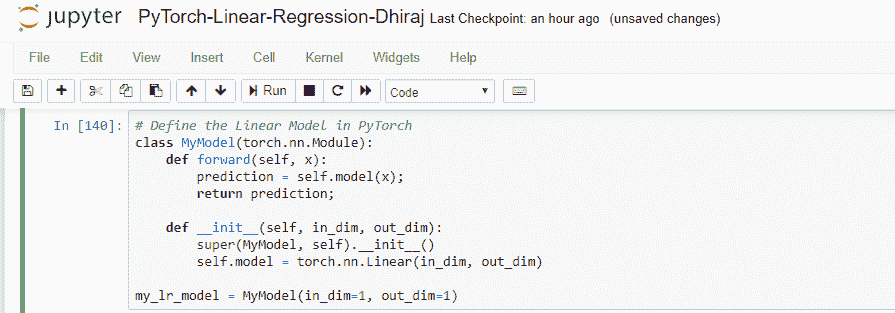
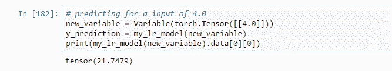

# 为什么 PyTorch 是未来的深度学习框架

> 原文：<https://blog.paperspace.com/why-use-pytorch-deep-learning-framework/>

你正在寻找一个高效的现代框架来创建你的深度学习模型吗？看看 PyTorch 就知道了！

在本文中，我们将介绍 PyTorch，是什么让它如此有优势，以及 PyTorch 与 TensorFlow 和 Scikit-Learn 相比如何。然后，我们将通过构建一个线性回归模型来了解如何使用 PyTorch，并使用它来进行预测。

让我们开始吧。

## PyTorch 简介

PyTorch 是脸书在 2016 年 10 月制作的机器学习框架。它是开源的，基于流行的 [Torch](http://torch.ch/) 库。PyTorch 旨在为深度神经网络实现提供良好的灵活性和高速度。

PyTorch 与其他深度学习框架的不同之处在于，它使用了**动态计算图**。静态计算图(如 TensorFlow 中使用的图)是在运行之前定义的，而动态图是通过正向计算“即时”定义的。换句话说，在每一次迭代中，图形都是从零开始重建的(更多信息，请查看斯坦福 [CS231n 课程](http://cs231n.stanford.edu/slides/2019/cs231n_2019_lecture06.pdf))。

## PyTorch 的优势

虽然 PyTorch 有很多优点，但这里我们将重点介绍几个核心优点。

### 1.蟒蛇的本性

从下图中可以看出，Python 是过去 5-10 年中发展最快的编程语言之一。大多数机器学习和人工智能相关的工作都是使用 Python 完成的。PyTorch 是 Python 的，这意味着 Python 开发人员在用 PyTorch 编码时应该比用其他深度学习框架更舒服。也就是说，PyTorch 也有一个 C++前端。

如果需要，您还可以使用您喜欢的 Python 包(如 NumPy、SciPy 和 Cython)来扩展 PyTorch 功能。



Source: Stack Overflow

### 2.简单易学

与 Python 语言一样，PyTorch 被认为比其他深度学习框架相对更容易学习。主要原因是因为它简单直观的语法。

### 3.强大的社区

尽管 PyTorch 是一个相对较新的框架，但它已经非常迅速地发展了一个专门的开发人员社区。不仅如此，PyTorch 的文档非常有条理，对开发人员很有帮助。

### 4.易于调试


Photo by [Kelsey Krajewski](https://unsplash.com/@kelseylk129?utm_source=ghost&utm_medium=referral&utm_campaign=api-credit) / [Unsplash](https://unsplash.com/?utm_source=ghost&utm_medium=referral&utm_campaign=api-credit)

PyTorch 与 Python 深度集成，因此许多 Python 调试工具可以很容易地与它一起使用。例如，Python pdb 和 ipdb 工具可用于调试 PyTorch 代码。PyCharm 的调试器也可以与 PyTorch 代码无缝协作。

## PyTorch vs TensorFlow

1.  **动态与静态:**虽然 PyTorch 和 TensorFlow 都在[张量](https://machinelearningmastery.com/introduction-to-tensors-for-machine-learning/)上工作，但是 PyTorch 和 Tensorflow 之间的主要区别是 PyTorch 使用动态计算图，TensorFlow 使用静态计算图。也就是说，随着 TensorFlow 2.0 的发布，已经出现了一个向急切执行的重大转变，远离了静态图形计算。TensorFlow 2.0 中的急切执行会立即计算操作，而无需构建图形。
2.  **数据并行:** PyTorch 使用 Python 的异步执行来实现数据并行，而使用 TensorFlow 却不是这样。使用 TensorFlow，您需要手动配置每个数据并行操作。
3.  **可视化支持:** TensorFlow 有一个非常好的可视化库，叫做 TensorBoard。这种可视化支持有助于开发人员很好地跟踪模型训练过程。PyTorch 最初有一个名为 [Visdom](https://github.com/facebookresearch/visdom) 的可视化库，但此后也为[提供了对 TensorBoard](https://pytorch.org/docs/stable/tensorboard.html) 的全面支持。PyTorch 用户可以利用 TensorBoard 在 TensorBoard UI 中记录 PyTorch 模型和指标。PyTorch 模型和张量都支持标量、图像、直方图、图形和嵌入可视化。
4.  **模型部署:** TensorFlow 使用名为 TensorFlow serving 的框架对部署模型提供了强大的支持。这是一个使用 REST 客户端 API 的框架，用于在部署后使用模型进行预测。另一方面，PyTorch 没有提供像使用 REST Client 在 web 上部署模型那样的框架。

## PyTorch vs Scikit-Learn

**深度学习 vs 机器学习:** Sklearn，或 [scikit-learn](https://scikit-learn.org/stable/) ，是一个主要用于机器学习的 Python 库。Scikit-learn 很好地支持传统的机器学习功能，如分类、降维、聚类等。Sklearn 构建在 NumPy、SciPy 和 Matplotlib 等 Python 库之上，对于数据分析来说简单而高效。然而，虽然 Sklearn 主要用于机器学习，但 PyTorch 是为深度学习而设计的。Sklearn 对定义算法很好，但不能真正用于深度神经网络的端到端训练。

**易用性:**毫无疑问 Sklearn 比 PyTorch 好用。与 Sklearn 相比，在 PyTorch 中实现相同的代码，你需要编写更多的代码。

**易于定制:**不言而喻，如果你想为机器学习中的特定问题定制你的代码，PyTorch 在这方面会更容易使用。Sklearn 相对来说比较难定制。

## PyTorch 中的张量

PyTorch 张量类似于 NumPy 阵列，具有额外的功能，因此可以在图形处理单元或 GPU 上使用，以加速计算。

标量是零维数组，例如数字 10 就是一个标量。
向量是一维数组，例如[10，20]是一个向量。
矩阵是二维数组。
张量是三维或多维数组。
然而，通常的做法是将向量和矩阵分别称为一维和二维张量。

PyTorch 张量和 numpy 数组的主要区别在于 PyTorch 张量可以在中央处理器和图形处理器上运行。如果你想在图形处理器上运行 PyTorch 张量，你只需要将张量转换成 CUDA 数据类型。

**CUDA** 代表计算统一设备架构。CUDA 是 Nvidia 创建的并行计算平台和应用编程接口模型。它允许开发人员使用支持 CUDA 的图形处理单元。

## 创建回归模型

线性回归是最流行的机器学习算法之一，因为它基于简单的数学，所以非常适合实现。线性回归基于直线的数学方程，写作 y = mx + c，其中 m 代表直线的斜率，c 代表 y 轴截距。



Linear regression residuals and data analysis

正如你在上面的图像中所看到的，我们用红点表示数据点，我们试图拟合一条线来表示所有的数据点。请注意，所有红色数据点可能不在直线上，但是我们的目标是找到最适合所有数据点的直线。找到最佳拟合直线实质上意味着找到斜率 **m** 和截距 **c** ，因为这两个参数可以定义唯一的直线。注意，这里 x 叫自变量，y 叫因变量。

## 线性回归的假设

线性回归有五个重要假设。

1.  线性回归假设自变量和因变量之间的关系为**线性**。
2.  数据为**正态分布**
3.  独立变量(如果多于一个)彼此**不相关**。
4.  数据中没有**自相关**。当残差相互依赖时，可以观察到自相关。例如，对于股票价格数据，价格取决于先前的价格。
5.  数据是同方差的，这意味着**残差**在回归线上是相等的。

# 构建模型的先决条件

您可以使用下面的命令安装 numpy、pandas 和 PyTorch。

```py
pip install numpy
pip install pandas
conda install pytorch torchvision cudatoolkit=10.1 -c pytorch
```

请注意，安装 PyTorch 后，您将能够导入 Torch，如下所示。

## 导入库


PyTorch Linear Regression Loading data

## 定义模型

让我们通过创建一个名为 MyModel 的类来开始定义我们的模型，如下所示。在 MyModel 类中，我们需要定义两个名为 forward 和 init 的方法。之后，我们将创建 MyModel 类的实例，这里的实例名是 my_lr_model。



Defining Linear regression model in PyTorch

## 训练模型

现在我们准备好训练模型了。在我们开始训练之前，我们需要定义损失函数(这里是**ms loss**)、优化器(这里是 **SGD 或**随机梯度下降)，然后我们必须分配学习率(在这种情况下为 0.011)和动量(0.89)。

**学习速率**也称为步长，是一个超参数，它决定每次模型权重改变时，机器学习模型相对于计算误差的改变程度。

**动量**是一个超参数，它加快了模型训练和学习的速度，从而加快了模型的收敛速度。默认情况下，动量设置为零。

在 PyTorch 中，**变量**是一个张量的包装器。因此，Variable 几乎支持所有由张量定义的 API。

一旦定义了这些参数，我们需要使用 for 循环来启动 epochs。注意损失值如何随着每个时期而变化。


Training the model of Linear Regression using PyTorch

## 预言；预测；预告

训练完模型后，下一步是预测测试输入的值。这里我们考虑输入值为 4.0，我们得到的预测(输出)为 21.75。

注意，为了将输入值输入到模型中，我们需要使用 torch 将浮点值转换成张量格式。张量法。因此，我们测试了我们的模型的工作情况，并给出了输出。



Predicting the value using Linear regression model in PyTorch

## 概括起来

在本教程中，我们了解了 PyTorch 是什么，它的优势是什么，以及它与 TensorFlow 和 Sklearn 相比如何。我们还讨论了 PyTorch 中的张量，并研究了如何构建一个简单的线性回归模型。

感谢阅读！如果您有任何问题或讨论要点，请访问 [Paperspace 社区](https://community.paperspace.com/)。