# 用 Python 实现梯度下降，第 3 部分:添加隐藏层

> 原文：<https://blog.paperspace.com/part-3-generic-python-implementation-of-gradient-descent-for-nn-optimization/>

在 Python 中实现通用梯度下降(GD)算法以优化反向传播阶段的人工神经网络(ANN)参数的系列教程中，再次向您问好。GD 实现将是通用的，可以与任何人工神经网络架构一起工作。

在第 2 部分中，实现了 GD 算法，以便它可以处理任意数量的输入神经元。在第 3 部分中，这是本系列的第三篇教程，第 2 部分的实现将被扩展，以允许 GD 算法处理具有 2 个神经元的单个隐藏层。本教程有两个部分。在第一部分，人工神经网络将有 3 个输入，1 个具有 3 个神经元的隐藏层，和一个具有 1 个神经元的输出层。在第二部分中，输入数量将从 3 个增加到 10 个。

# 1 个具有 2 个神经元的隐藏层

本节扩展了第 2 部分中 GD 算法的实现，使其能够处理一个包含两个神经元的隐藏层。第 2 部分使用了 10 个输入，但为了简单起见，本部分将只使用 3 个输入。下图给出了具有 3 个输入、1 个具有 2 个神经元的隐藏层和 1 个输出神经元的 ANN 图。

现在，3 个输入中的每个输入都连接到 2 个隐藏的神经元。对于每个连接，都有不同的权重。输入层和隐藏层之间的权重被标记为 **Wzy** ，其中 **z** 是指输入层神经元索引， **y** 是指隐藏神经元的索引。

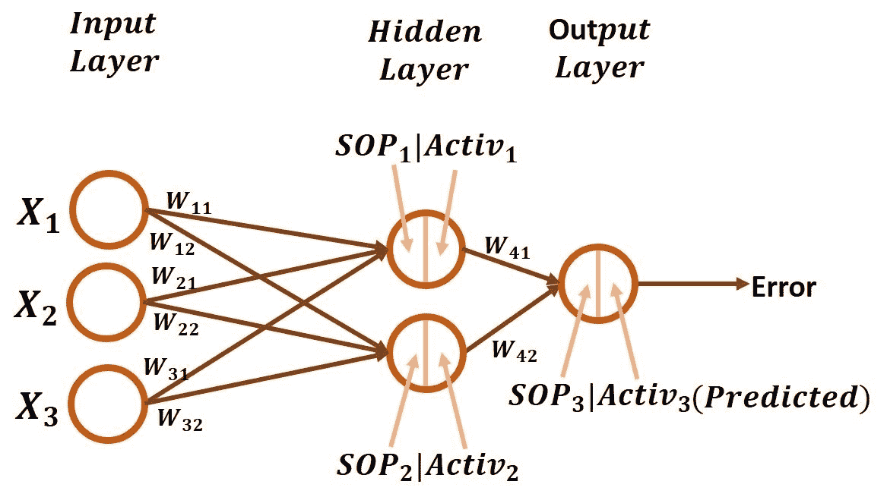

第一个输入 **X1** 和第一个隐神经元之间连接的权重是 **W11** 。同样，权重 **W12** 用于 **X1** 和第二个隐藏神经元之间的连接。关于 **X2** ，权重 **W21** 和 **W22** 分别用于第一和第二隐藏神经元的连接。同样， **X3** 有两个权重 **W31** 和 **W32** 。

除了输入层和隐藏层之间的权重之外，还有 2 个权重将 2 个隐藏神经元连接到输出神经元，它们是 **W41** 和 **W42** 。

如何让 GD 算法与所有这些参数一起工作？在写出从误差开始直到达到每个单独重量的导数链之后，答案会简单得多。通常，在考虑 GD 算法更新权重的向后传递之前，我们必须从向前传递开始。

## 前进传球

在前向传递中，隐藏层中的神经元除了接受它们的权重之外，还接受来自输入层的输入。然后，计算输入与其权重之间的乘积之和( **SOP** )。关于第一个隐藏神经元，它分别接受 3 个输入 **X1** 、 **X2** 、 **X3** 以及它们的权重 **W11** 、 **W21** 和 **W31** 。该神经元的 SOP 通过对每个输入与其权重之间的乘积求和来计算，因此结果是:

```py
SOP1=X1*W11+X2*W21+X3*W31
```

第一个隐藏神经元的 SOP 在图中标为 **SOP1** 以供参考。对于第二个隐藏神经元，其 SOP 标记为 **SOP2** ，如下所示:

```py
SOP2=X1*W12+X2*W22+X3*W32
```

在计算了所有隐藏神经元的 SOP 之后，接下来是将这样的 SOP 馈送到激活函数。此系列中使用的函数是 sigmoid 函数，其计算方法如下图中的等式所示。


通过将 **SOP1** 输入到 sigmoid 函数，结果是由下式计算的 **Activ1** :

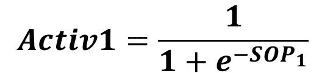

由下式计算出的 **SOP2** 为 **Activ2** :

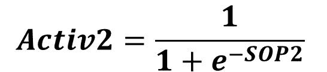

请记住，在前向传递中，一层的输出被视为下一层的输入。隐藏层的输出 **Activ1** 和 **Activ2** 被视为输出层的输入。重复该过程以计算输出层神经元中的 SOP。输出神经元的每个输入都有一个权重。对于第一个输入 **Activ1** ，其权重为 **W41** 。第二输入 **Activ2** 的重量为 **W42** 。输出神经元的 SOP 标记为 **SOP3** ，计算如下:

```py
SOP3=Activ1*W41+Activ2*W42
```

**SOP3** 被馈送到 sigmoid 函数以返回 **Activ3** ，如下式所示:

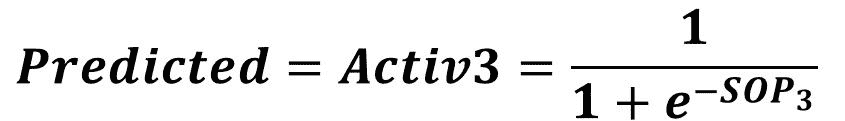

在本教程中，激活函数的输出被视为网络的预测输出。网络做出预测后，下一步是使用下面给出的平方误差函数计算误差。

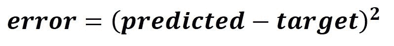

此时，向前传球完成，我们准备好通过向后传球。

## 偶数道次

在反向传递中，目标是计算更新网络中每个权重的梯度。因为我们从正向传递中结束的地方开始，所以首先计算最后一层的梯度，然后移动直到到达输入层。让我们开始计算隐藏层和输出层之间的权重梯度。

因为没有包含误差和权重(W41 和 W42)的显式方程，所以最好使用链式法则。计算这些权重的梯度所需的导数链是什么？

从第一个权重开始，我们需要找到误差对 W41 的导数。误差方程有两项，如下所示:

1.  预测
2.  目标

在这两项中，哪一项将误差与重量 W41 联系起来？确定它是**预测的**，因为它是使用 sigmoid 函数计算的，该函数接受包含 W41 的 SOP3。因此，要计算的一阶导数是预测输出导数的误差，其计算如下式所示。


之后，接下来是通过用 **SOP3** 代入 sigmoid 函数的导数来计算**预测的**到 **SOP3** 的导数，如下式所示。

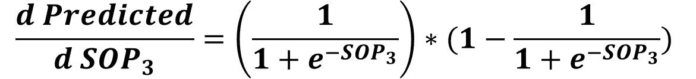

接下来是计算 SOP3 对 W41 的导数。还记得包含 SOP3 和 W41 的等式吗？下面重复一遍。

```py
SOP3 = Activ1*W41 + Activ2*W42
```

SOP3 对 W41 的导数由下式给出。

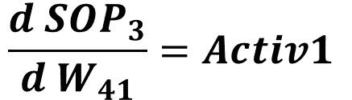

通过计算链中从误差到 **W41** 的所有导数，我们可以通过将所有这些导数相乘来计算**误差**到 **W41** 的导数，如下式所示。

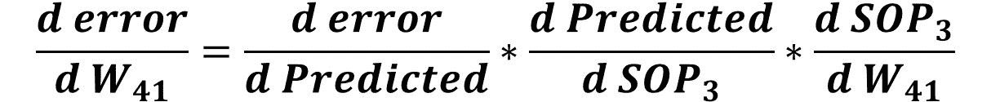

类似于计算**误差**对 **W41** 的导数，我们可以很容易地计算出**误差**对 **W42** 的导数。与上一个等式不同的唯一一项是最后一项。现在，我们不是计算 SOP3 至 W41 的导数，而是计算 SOP3 至 W42 的导数，如下式所示。

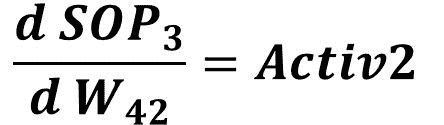

最后，根据下式计算 W42 导数的误差。

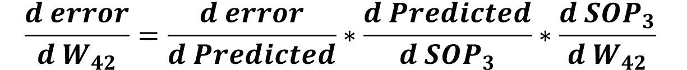

此时，我们成功地计算了隐藏层和输出层之间所有权重的梯度。接下来是计算输入层和隐藏层之间的权重梯度。这两层之间的误差和权重之间的导数链是什么？当然，前两个导数是前一个链中使用的前两个导数，如下所示:

1.  预测导数的误差。
2.  预测到 SOP3 导数。

我们需要计算 SOP3 对 Activ1 和 Activ2 的导数，而不是计算 SOP3 对 W41 和 W4s 的导数。SOP3 到 Activ1 导数有助于计算连接到第一个隐藏神经元的权重梯度，即 W11、W21 和 W31。SOP3 到 Activ2 的导数有助于计算连接到第二个隐藏神经元的权重的梯度，即 W12、W22 和 W32。

从 Activ1 开始，将 SOP3 与 Activ1 相关联的等式重复如下:

```py
SOP3=Activ1*W41+Activ2*W42
```

SOP3 对 Activ1 的导数计算如下式所示:

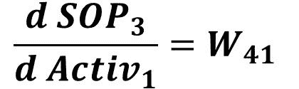

类似地，SOP3 对 Activ2 的导数计算如下式所示:

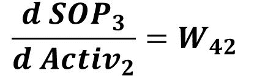

之后，我们可以计算链中的下一个导数，即 Activ1 对 SOP1 的导数，SOP1 是通过在 sigmoid 函数的导数方程中代入 so P1 计算的，如下所示。这将用于更新权重 W11、W21 和 W31。

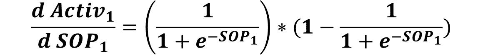

类似地，Activ2 至 SOP2 的导数计算如下。这将用于更新权重 W12、W22 和 W32。

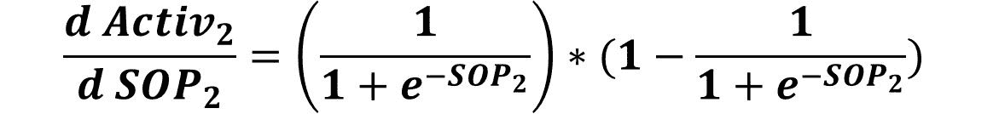

为了更新权重 W11、W21 和 W31，要计算的最后一个导数是 SOP1 与所有这些权重之间的导数。首先，我们必须记住将 SOP1 与所有这些权重相关联的等式。下面重复一遍。

```py
SOP1=X1*W11+X2*W21+X3*W31
```

SOP1 对所有这 3 个权重的导数在下面的等式中给出。

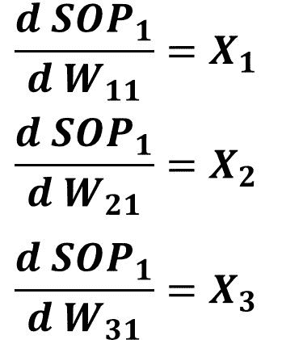

类似地，我们必须记住将 SOP2 与权重 W12、W22 和 W32 相关联的等式，这就是下面再次重复该等式的原因。

```py
SOP2=X1*W12+X2*W22+X3*W32
```

下图给出了 SOP2 至 W12、W22 和 W32 的导数。


在计算了从误差到输入层和隐藏层之间的所有权重的链中的所有导数之后，接下来是将它们相乘以计算梯度，通过该梯度来更新这些权重。

对于连接到第一个隐藏神经元(W11、W21 和 W31)的权重，将使用下面的链来计算它们的梯度。注意，所有这些链共享所有导数，除非最后一个导数。


对于连接到第二个隐藏神经元 W12、W22 和 W32 的权重，将使用下面的链来计算它们的梯度。注意，所有这些链共享所有导数，除非最后一个导数。

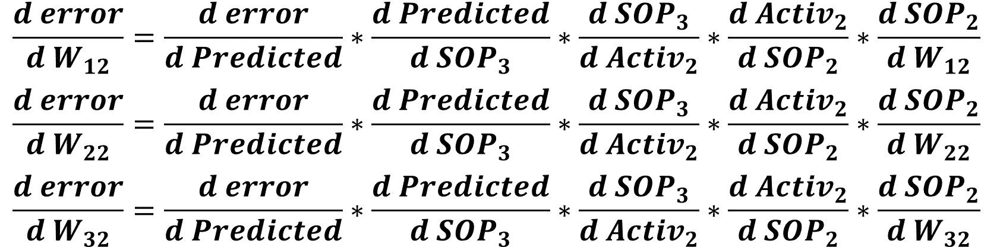

此时，我们已经成功准备好了计算整个网络中所有权重梯度的链。我们可以在下图中总结所有这些链。

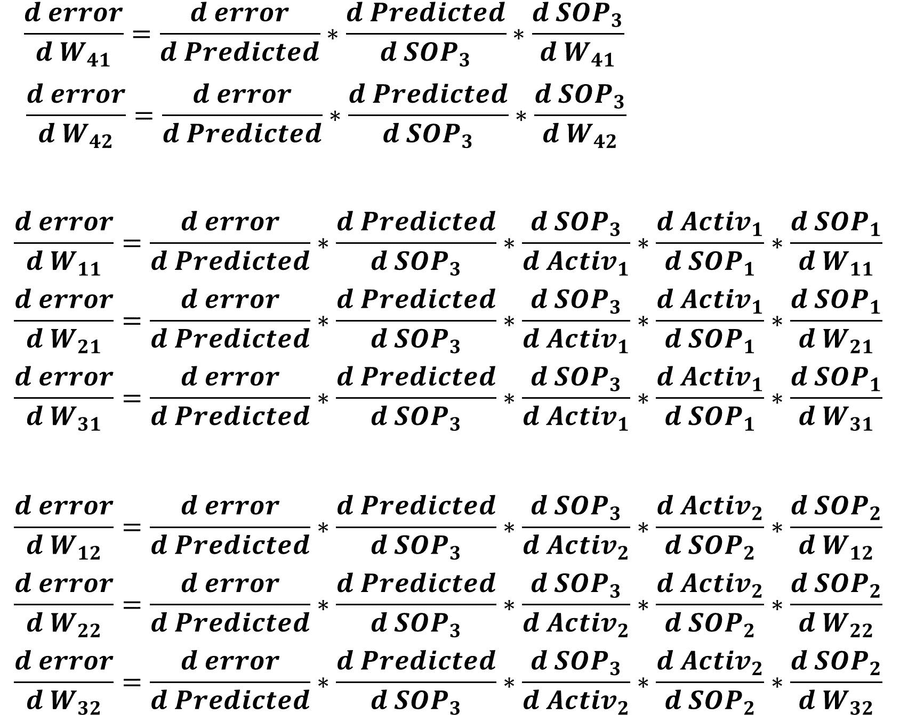

理解了为当前网络实现 GD 算法背后的理论之后，接下来是开始用 Python 实现这样的算法。请注意，该实现高度依赖于本系列前面部分中开发的实现。

# Python 实现

下面列出了实现具有 3 个输入、1 个具有 2 个神经元的隐藏层和 1 个输出神经元的 ANN 并使用 GD 算法对其进行优化的完整代码。将讨论该代码的各个部分。

```py
import numpy

def sigmoid(sop):
    return 1.0 / (1 + numpy.exp(-1 * sop))

def error(predicted, target):
    return numpy.power(predicted - target, 2)

def error_predicted_deriv(predicted, target):
    return 2 * (predicted - target)

def sigmoid_sop_deriv(sop):
    return sigmoid(sop) * (1.0 - sigmoid(sop))

def sop_w_deriv(x):
    return x

def update_w(w, grad, learning_rate):
    return w - learning_rate * grad

x = numpy.array([0.1, 0.4, 4.1])
target = numpy.array([0.2])

learning_rate = 0.001

w1_3 = numpy.random.rand(3)
w2_3 = numpy.random.rand(3)
w3_2 = numpy.random.rand(2)
w3_2_old = w3_2
print("Initial W : ", w1_3, w2_3, w3_2)

# Forward Pass
# Hidden Layer Calculations
sop1 = numpy.sum(w1_3 * x)
sop2 = numpy.sum(w2_3 * x)

sig1 = sigmoid(sop1)
sig2 = sigmoid(sop2)

# Output Layer Calculations
sop3 = numpy.sum(w3_2 * numpy.array([sig1, sig2]))

predicted = sigmoid(sop3)
err = error(predicted, target)

# Backward Pass
g1 = error_predicted_deriv(predicted, target)

### Working with weights between hidden and output layer
g2 = sigmoid_sop_deriv(sop3)

g3 = numpy.zeros(w3_2.shape[0])
g3[0] = sop_w_deriv(sig1)
g3[1] = sop_w_deriv(sig2)

grad_hidden_output = g3 * g2 * g1

w3_2 = update_w(w3_2, grad_hidden_output, learning_rate)

### Working with weights between input and hidden layer
# First Hidden Neuron
g3 = sop_w_deriv(w3_2_old[0])
g4 = sigmoid_sop_deriv(sop1)

g5 = sop_w_deriv(x)

grad_hidden1_input = g5 * g4 * g3 * g2 * g1

w1_3 = update_w(w1_3, grad_hidden1_input, learning_rate)

# Second Hidden Neuron
g3 = sop_w_deriv(w3_2_old[1])
g4 = sigmoid_sop_deriv(sop2)

g5 = sop_w_deriv(x)

grad_hidden2_input = g5 * g4 * g3 * g2 * g1

w2_3 = update_w(w2_3, grad_hidden2_input, learning_rate)

w3_2_old = w3_2
print(predicted)
```

首先，使用这两行代码准备输入和输出:

```py
x = numpy.array([0.1, 0.4, 4.1])
target = numpy.array([0.2])
```

之后，根据这些线准备网络权重。请注意， **w1_3** 是一个数组，包含将 3 个输入连接到第一个隐藏神经元的 3 个权重。 **w2_3** 是一个包含 3 个权重的数组，将 3 个输入连接到第二个隐藏神经元。最后，w3_2 是一个具有 2 个权重的数组，用于连接隐含层神经元和输出神经元。

```py
w1_3 = numpy.random.rand(3)
w2_3 = numpy.random.rand(3)
w3_2 = numpy.random.rand(2)
```

准备好输入和权重后，接下来是根据下面的代码进行正向传递。它首先计算两个隐藏神经元的乘积之和，然后将它们提供给 sigmoid 函数。sigmoid 函数的 2 个输出乘以连接到输出神经元的 2 个权重，以返回 **sop3** 。这也被用作 sigmoid 函数的输入，以返回预测输出。最后计算误差。

```py
# Forward Pass
# Hidden Layer Calculations
sop1 = numpy.sum(w1_3 * x)
sop2 = numpy.sum(w2_3 * x)

sig1 = sigmoid(sop1)
sig2 = sigmoid(sop2)

# Output Layer Calculations
sop3 = numpy.sum(w3_2 * numpy.array([sig1, sig2]))

predicted = sigmoid(sop3)
err = error(predicted, target)
```

向前传球完成后，接下来是向后传球。下面给出了负责更新隐藏层和输出层之间的权重的代码部分。预测输出导数的误差被计算并保存在变量 **g1** 中。 **g2** 保存对 SOP3 导数的预测输出。最后，计算 SOP3 到 W41 和 W42 的导数，并保存在变量 g3 中。在计算 W41 和 W41 的梯度所需的所有导数后，梯度被计算并保存在 **grad_hidden_output** 变量中。最后，通过传递旧的权重、梯度和学习率，使用 **update_w()** 函数更新这些权重。

```py
# Backward Pass
g1 = error_predicted_deriv(predicted, target)

### Working with weights between hidden and output layer
g2 = sigmoid_sop_deriv(sop3)

g3 = numpy.zeros(w3_2.shape[0])
g3[0] = sop_w_deriv(sig1)
g3[1] = sop_w_deriv(sig2)

grad_hidden_output = g3 * g2 * g1

w3_2 = update_w(w3_2, grad_hidden_output, learning_rate)
```

更新隐藏层和输出层之间的权重后，接下来是处理输入层和隐藏层之间的权重。下面是更新连接到第一个隐藏神经元的权重所需的代码。 **g3** 代表 SOP3 对 Activ1 的导数。因为这种导数是使用隐藏层和输出层之间的旧的权重值而不是更新的权重值来计算的，所以旧的权重被保存到 **w3_2_old** 变量中，以便在该步骤中使用。 **g4** 代表 **Activ1** 到 **SOP1** 的导数。最后， **g5** 代表 **SOP1** 对权重( **W11** 、 **W21** 和 **W31** )的导数。

当计算这 3 个权重的梯度时，g3、g4 和 g5 彼此相乘。在更新隐藏层和输出层之间的权重时，它们还会乘以 g2 和 g1。基于计算的梯度，将 3 个输入连接到第一个隐藏神经元的权重被更新。

```py
### Working with weights between input and hidden layer
# First Hidden Neuron
g3 = sop_w_deriv(w3_2_old[0])
g4 = sigmoid_sop_deriv(sop1)

g5 = sop_w_deriv(x)

grad_hidden1_input = g5*g4*g3*g2*g1

w1_3 = update_w(w1_3, grad_hidden1_input, learning_rate)
```

类似于处理连接到第一个隐藏神经元的 3 个权重，连接到第二个隐藏神经元的其他 3 个权重根据下面的代码进行更新。

```py
# Second Hidden Neuron
g3 = sop_w_deriv(w3_2_old[1])
g4 = sigmoid_sop_deriv(sop2)

g5 = sop_w_deriv(x)

grad_hidden2_input = g5*g4*g3*g2*g1

w2_3 = update_w(w2_3, grad_hidden2_input, learning_rate)
```

在代码结束时， **w3_2_old** 变量被设置为等于 **w3_2** 。

```py
w3_2_old = w3_2
```

到了这一步，我们示例中实现 GD 算法的全部代码就完成了。剩下的编辑是使用一个循环来进行多次迭代，以更新权重，从而做出更好的预测。下面是更新后的代码。

```py
import numpy

def sigmoid(sop):
    return 1.0/(1+numpy.exp(-1*sop))

def error(predicted, target):
    return numpy.power(predicted-target, 2)

def error_predicted_deriv(predicted, target):
    return 2*(predicted-target)

def sigmoid_sop_deriv(sop):
    return sigmoid(sop)*(1.0-sigmoid(sop))

def sop_w_deriv(x):
    return x

def update_w(w, grad, learning_rate):
    return w - learning_rate*grad

x = numpy.array([0.1, 0.4, 4.1])
target = numpy.array([0.2])

learning_rate = 0.001

w1_3 = numpy.random.rand(3)
w2_3 = numpy.random.rand(3)
w3_2 = numpy.random.rand(2)
w3_2_old = w3_2
print("Initial W : ", w1_3, w2_3, w3_2)

for k in range(80000):
    # Forward Pass
    # Hidden Layer Calculations
    sop1 = numpy.sum(w1_3*x)
    sop2 = numpy.sum(w2_3*x)

    sig1 = sigmoid(sop1)
    sig2 = sigmoid(sop2)

    # Output Layer Calculations
    sop3 = numpy.sum(w3_2*numpy.array([sig1, sig2]))

    predicted = sigmoid(sop3)
    err = error(predicted, target)

    # Backward Pass
    g1 = error_predicted_deriv(predicted, target)

    ### Working with weights between hidden and output layer
    g2 = sigmoid_sop_deriv(sop3)

    g3 = numpy.zeros(w3_2.shape[0])
    g3[0] = sop_w_deriv(sig1)
    g3[1] = sop_w_deriv(sig2)

    grad_hidden_output = g3*g2*g1

    w3_2 = update_w(w3_2, grad_hidden_output, learning_rate)

    ### Working with weights between input and hidden layer
    # First Hidden Neuron
    g3 = sop_w_deriv(w3_2_old[0])
    g4 = sigmoid_sop_deriv(sop1)

    g5 = sop_w_deriv(x)

    grad_hidden1_input = g5*g4*g3*g2*g1

    w1_3 = update_w(w1_3, grad_hidden1_input, learning_rate)

    # Second Hidden Neuron
    g3 = sop_w_deriv(w3_2_old[1])
    g4 = sigmoid_sop_deriv(sop2)

    g5 = sop_w_deriv(x)

    grad_hidden2_input = g5*g4*g3*g2*g1

    w2_3 = update_w(w2_3, grad_hidden2_input, learning_rate)

    w3_2_old = w3_2
    print(predicted)
```

迭代完成后，下图显示了迭代的预测输出是如何变化的。

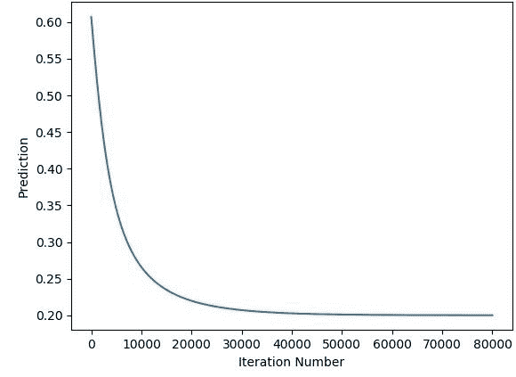

下图显示了迭代过程中误差的变化。

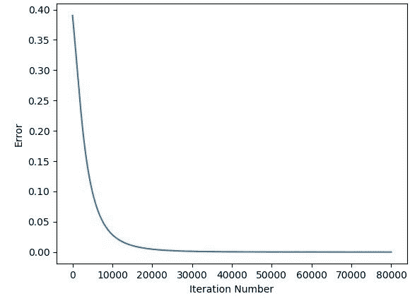

# 使用 10 个输入

之前的实现使用只有 3 个输入的输入层。如果使用更多的输入会怎样？是否需要对代码做大量修改？答案是否定的，因为有两处小改动:

1.  编辑输入数组 **x** 以添加更多输入。
2.  编辑权重数组的大小以返回 10 个权重，而不是 3 个。

下面列出了使用 10 个输入的实现。除了保存 10 个值的输入数组 **x** 之外，代码中的所有内容都与上一节中的内容相同。同样，使用**numpy . rand()**函数返回 10 个权重。这就是你需要做的一切。

```py
import numpy

def sigmoid(sop):
    return 1.0 / (1 + numpy.exp(-1 * sop))

def error(predicted, target):
    return numpy.power(predicted - target, 2)

def error_predicted_deriv(predicted, target):
    return 2 * (predicted - target)

def sigmoid_sop_deriv(sop):
    return sigmoid(sop) * (1.0 - sigmoid(sop))

def sop_w_deriv(x):
    return x

def update_w(w, grad, learning_rate):
    return w - learning_rate * grad

x = numpy.array([0.1, 0.4, 4.1, 4.3, 1.8, 2.0, 0.01, 0.9, 3.8, 1.6])
target = numpy.array([0.2])

learning_rate = 0.001

w1_10 = numpy.random.rand(10)
w2_10 = numpy.random.rand(10)
w3_2 = numpy.random.rand(2)
w3_2_old = w3_2
print("Initial W : ", w1_10, w2_10, w3_2)

for k in range(80000):
    # Forward Pass
    # Hidden Layer Calculations
    sop1 = numpy.sum(w1_10 * x)
    sop2 = numpy.sum(w2_10 * x)

    sig1 = sigmoid(sop1)
    sig2 = sigmoid(sop2)

    # Output Layer Calculations
    sop3 = numpy.sum(w3_2 * numpy.array([sig1, sig2]))

    predicted = sigmoid(sop3)
    err = error(predicted, target)

    # Backward Pass
    g1 = error_predicted_deriv(predicted, target)

    ### Working with weights between hidden and output layer
    g2 = sigmoid_sop_deriv(sop3)

    g3 = numpy.zeros(w3_2.shape[0])
    g3[0] = sop_w_deriv(sig1)
    g3[1] = sop_w_deriv(sig2)

    grad_hidden_output = g3 * g2 * g1

    w3_2[0] = update_w(w3_2[0], grad_hidden_output[0], learning_rate)
    w3_2[1] = update_w(w3_2[1], grad_hidden_output[1], learning_rate)

    ### Working with weights between input and hidden layer
    # First Hidden Neuron
    g3 = sop_w_deriv(w3_2_old[0])
    g4 = sigmoid_sop_deriv(sop1)

    g5 = numpy.zeros(w1_10.shape[0])
    g5 = sop_w_deriv(x)

    grad_hidden1_input = g5 * g4 * g3 * g2 * g1

    w1_10 = update_w(w1_10, grad_hidden1_input, learning_rate)

    # Second Hidden Neuron
    g3 = sop_w_deriv(w3_2_old[1])
    g4 = sigmoid_sop_deriv(sop2)

    g5 = numpy.zeros(w2_10.shape[0])
    g5 = sop_w_deriv(x)

    grad_hidden2_input = g5 * g4 * g3 * g2 * g1

    w2_10 = update_w(w2_10, grad_hidden2_input, learning_rate)

    w3_2_old = w3_2
    print(predicted)
```