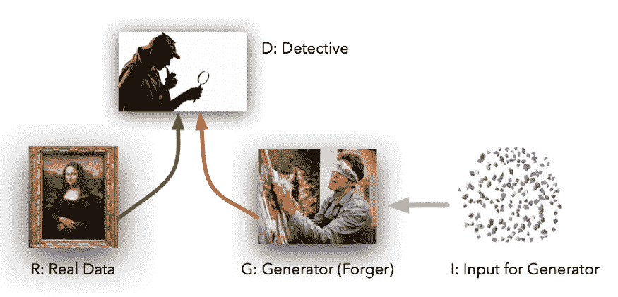
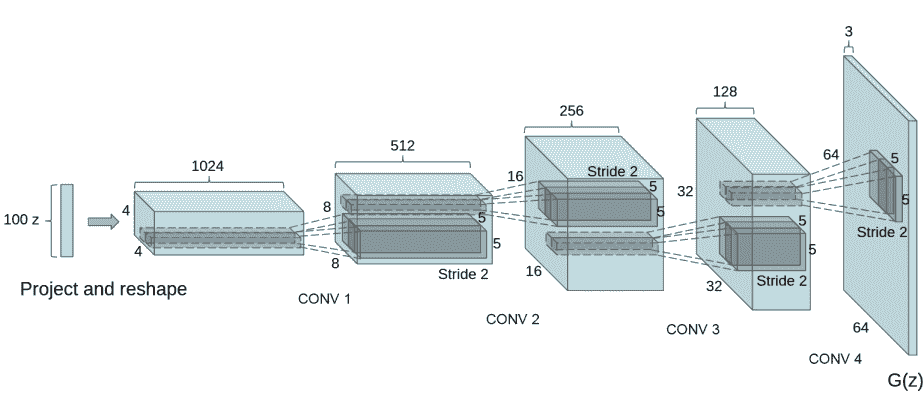
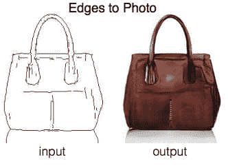
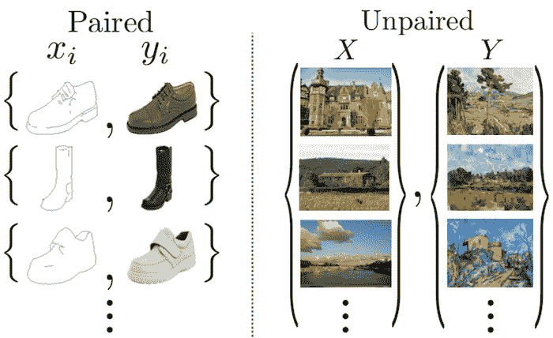
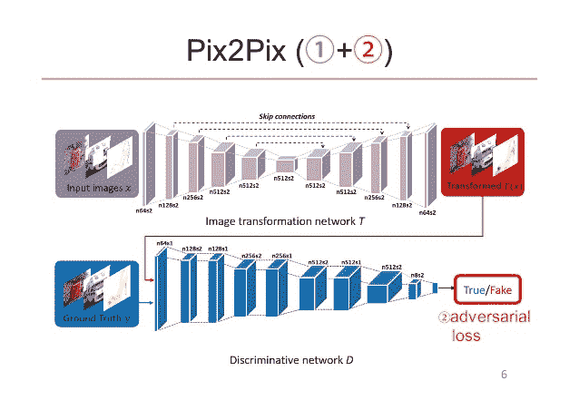
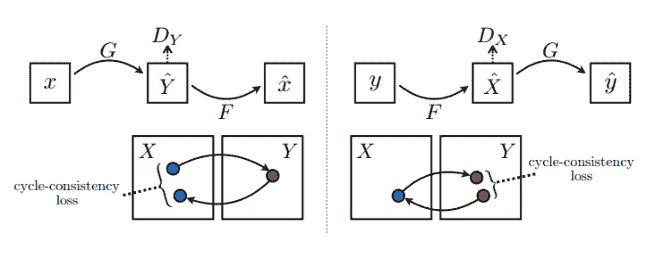
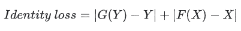
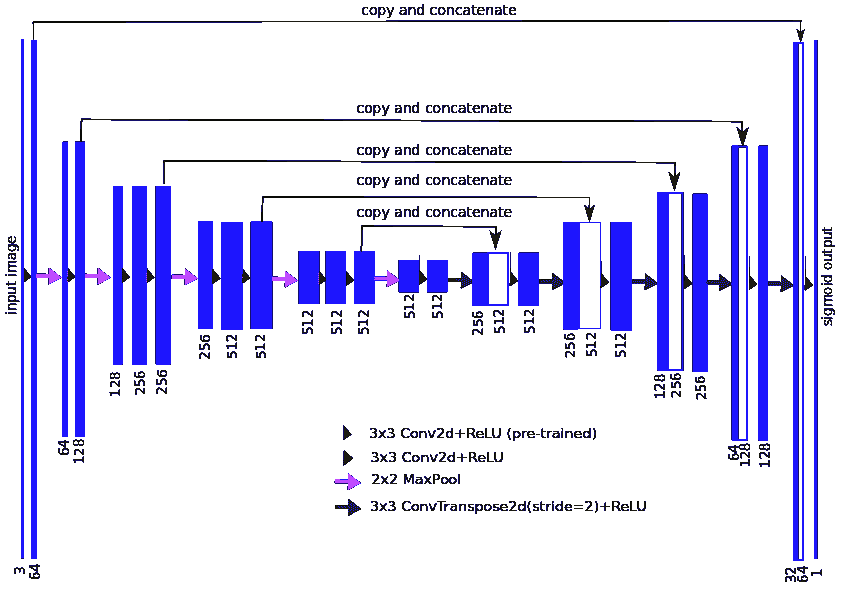
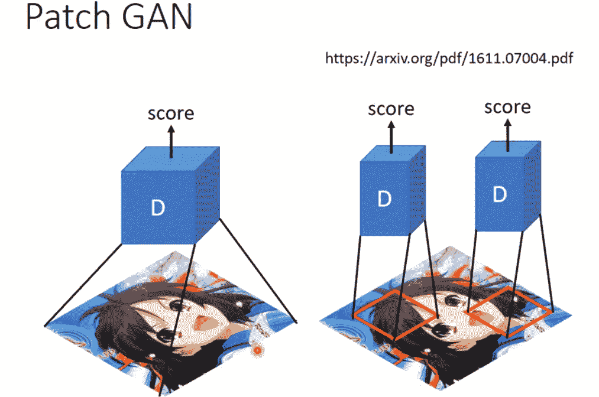
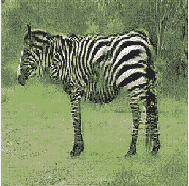

# 使用 CycleGAN 进行不成对的图像到图像翻译

> 原文：<https://blog.paperspace.com/unpaired-image-to-image-translation-with-cyclegan/>

脸书大学人工智能研究主任和 NYU 大学教授 Yann LeCun 将生成对抗网络描述为过去 10 年机器学习中最有趣的想法。自从 Ian Goodfellow 在 2014 年发明 GANs 以来，我们已经看到了来自 NVIDIA 和脸书等几个研究小组的这些有趣的神经网络的大量变体，但我们将研究加州大学伯克利分校一个研究小组的一个叫做**循环一致对抗网络的网络。**在我们深入探讨循环一致对抗网络(简称 CycleGAN)之前，我们要看看什么是生成性对抗网络。本文旨在揭示生成性对抗网络及其流行变体之一——循环一致对抗网络的工作机制。**这里使用的大部分代码摘自 TensorFlow 官方文档页面。**本文完整代码可从:[https://www . tensor flow . org/beta/tutorials/generative/cycle gan](https://www.tensorflow.org/beta/tutorials/generative/cyclegan)获得

### 生成对抗网络

生成对抗网络是一种神经网络，通常由两个以对抗方式建立的神经网络组成。我所说的对抗方式是指他们为了做得更好而互相对抗。这两个网络被称为**发生器**和**鉴别器**。第一个 GAN 是由 Ian Goodfellow 在 2014 年提出的，在他的工作之后，我们已经看到了几个 GAN，一些具有新颖的架构，另一些具有改进的性能和稳定性。那么到底什么是生成性对抗网络呢？通俗地说，生成对抗网络是一种由两个模型组成的生成模型，其中一个模型试图生成非常接近原始真实图像或数据的图像或一些其他真实生活数据来愚弄另一个模型，而另一个模型通过查看生成的图像和真实图像来优化自身，以便不被生成模型所愚弄。在 GANs 的文献中，生成图像的模型被称为生成器，确保生成器生成看起来真实的图像的模型被称为鉴别器。让我们试着用侦探-强盗的场景来理解甘斯。在这个场景中，扮演发电机的劫匪不断向扮演鉴别者的侦探出示假钞。在这一过程的每一点上，侦探都会发现钞票是假的，拒绝接受钞票，并告诉劫匪是什么让钞票变假的。强盗也在每个阶段从侦探那里得到笔记，使用来自侦探的信息生成新的笔记，然后再次向侦探展示它。这种情况一直持续到强盗成功地创造出一张看起来足够真实的钞票来愚弄侦探。这正是生成性对抗网络的工作方式——生成器连续产生合成图像，并通过接收来自鉴别器的信号进行优化，直到合成图像的分布几乎与原始图像的分布相匹配。



GAN 的单个训练迭代步骤包括三个步骤:

*   首先，向鉴别器显示一批真实图像，并且优化其权重以将这些图像分类为真实图像(真实图像标记为 1)
*   然后，我们使用生成器生成一批伪图像，将这些伪图像显示给鉴别器，然后优化鉴别器的权重，以将这些图像分类为伪图像(伪图像标记为 0)
*   第三步是训练生成器。我们生成一批伪图像，将这些伪图像展示给鉴别器，但是我们不是优化鉴别器来将这些图像分类为伪图像，而是优化生成器来迫使鉴别器将这些伪图像分类为真实图像。

迷茫？让我们把它们分解开来，你会发现这是多么简单。如前所述，首先我们向鉴别器展示一批真实图像，并对其进行优化，以将这些真实图像分类为真实图像。假设真实图像具有 1 作为它们的标签，并且简单的绝对平均误差被用作损失函数。让我们也用公式表示鉴别器的数学表达式。我们将使用 f(x)其中 f(。)表示鉴别器是前馈神经网络或卷积网络，x 是真实图像或一批真实图像。有了上面的参数，我们的损失函数应该是这样的: **| f(x) - 1 |** (为了简单起见，省略了均值)。输入一批真实图像，并通过鉴别器反向传播这一损失信号以进行优化，这仅仅意味着每当我们的鉴别器看到真实图像时，我们希望它预测一个真正接近 1 的值。同样的过程用于第二步，但是我们将生成器生成的假图像标记为 0，因此损失函数如下: **| f(x)-0 | = | f(x) |。**通过鉴别器反向传播这种损失信号并优化其权重，这意味着每当鉴别器被显示假图像时，我们希望它预测一个非常接近 0 的值，这是假图像的标签。不像第一步和第二步，我们只训练鉴别器，第三步尝试训练生成器。我们展示了鉴别器伪造由生成器生成的图像，但是这次我们使用步骤: **| f(x) - 1 |的损失签名。**然后，我们将损耗信号从鉴别器一路反向传播到发生器，并利用该损耗信号优化发生器的权重。这相当于鉴别器通知发生器它需要进行的改变，以生成假图像，这将导致鉴别器将其分类为真实图像。

您可能想知道生成器是如何生成图像的。最初提出的 GAN 通过将来自均匀分布的固定大小的向量作为输入，并逐渐增加该向量的空间维度以形成图像，来生成图像。一些最近发明的 GAN，如 CycleGAN，似乎已经偏离了这种发电机架构。



### 图像到图像翻译的任务

在 CycleGANs 发明之前，图像到图像的转换已经存在了一段时间。一个真正有趣的例子是 [Phillip Isola](https://arxiv.org/search/cs?searchtype=author&query=Isola%2C+P) 等人在论文[中的工作，使用条件对抗网络](https://arxiv.org/abs/1611.07004)进行图像到图像的翻译，其中来自一个域的图像被翻译成另一个域的图像。这项工作的数据集由来自每个域的对齐图像对组成。这个模型被命名为 Pix2Pix GAN。



CycleGAN 用于执行图像到图像转换的方法非常类似于 Pix2Pix GAN，除了不成对的图像用于训练 cycle GAN，并且 cycle GAN 的目标函数具有额外的标准，**周期一致性损失。事实上，这两篇论文几乎是由同一作者撰写的。**



正如我前面提到的，最近的一些 gan 有不同的生成器架构设计。Pix2Pix GANs 和 CycleGANs 是具有这种不同架构的 gan 的主要例子。它不是将固定大小的向量作为输入，而是将一个域中的图像作为输入，并在另一个域中输出相应的图像。这种架构还利用跳过连接来确保在正向传播期间更多的特征从输入流向输出，以及在反向传播期间从损耗到参数的梯度。鉴别器架构几乎相同。与最初提出的将整个图像分类为真实或伪造的架构不同，这些 GANs 中使用的架构通过输出值的矩阵而不是单个值来将图像的小块分类为真实或伪造。这样做的原因是为了鼓励清晰的高频细节，也是为了减少参数的数量。



此外，Pix2Pix GAN 和 CycleGAN 之间的一个主要区别是，与仅包含两个网络(鉴别器和发生器)的 Pix2Pix GAN 不同，CycleGAN 包含四个网络(两个鉴别器和两个发生器)。让我们看看一个周期的目标函数，以及如何训练一个。

### 
目标函数

之前，我提到训练 GAN 有三个步骤，前两个步骤训练鉴别器。让我们看看如何。我们将结合鉴别器目标损失，并在一个 python 函数中实现它。

```py
loss_obj = tf.keras.losses.BinaryCrossentropy(from_logits=True)

def discriminator_loss(real, generated):
  real_loss = loss_obj(tf.ones_like(real), real)

  generated_loss = loss_obj(tf.zeros_like(generated), generated)

  total_disc_loss = real_loss + generated_loss

  return total_disc_loss
```

注意，我们没有使用平均绝对误差，而是使用二进制交叉熵损失函数。当一个真实图像被输入到鉴别器和一个矩阵时，真实损失物镜将鉴别器输出作为输入。回想一下，当我们将真实图像输入鉴别器时，我们希望它预测一个接近 1 的值，因此我们在这个目标函数中增加了这个概率。同样的规则也适用于 generated _ loss——当我们将生成器生成的假图像输入鉴别器时，我们增加了鉴别器预测值接近于零的概率。我们将两个损失相加，以反向传播和训练鉴别器。接下来我们训练发电机。

```py
 def generator_loss(generated):
  return loss_obj(tf.ones_like(generated), generated)
```

我们将假图像从生成器输入鉴别器，而不是增加鉴别器预测接近 1 的值的概率，我们调整生成器以迫使鉴别器预测接近 1 的值。这相当于将梯度反向传播到生成器，并用梯度更新其权重。让我们假设生成器 G 将图像从域 X 映射到 Y，而 F 将图像从域 Y 映射到 X。根据该论文，这些对抗性损失仅确保学习到的映射 G 和 F 产生分别与 Y 和 X 的分布相匹配的输出，但在视觉上与相应域中的图像不相同。例如，假设我们训练 G 将图像从包含夏季场景图像的域映射到包含冬季场景图像的域。仅使用对抗损失来学习映射，当我们使用 G 来映射来自 X 域的图像 X 时，产生的图像 Y 仅匹配 Y 的分布，因此可以是 Y 域中可能与输入图像 X 不相同的图像的任意随机排列。映射 G 和 F 是欠约束映射，并且为了减少可能映射的空间，作者引入了循环一致性损失来增加对抗损失。他们认为，为了进一步约束映射，映射应该是周期一致的。这意味着对于来自域 X 的每个图像 X，到域 Y 并回到域 X 的图像平移应该将 X 带回原始图像。即 x → G(x) → y → F(y) ≈ x .这相当于 x→G(x)→F(G(x)) ≈ x .他们把这称为正向循环一致性。类似地，对于来自域 Y 的每个图像 Y，G 和 F 应该满足映射 y → F(y) → G(F(y)) ≈ y(向后循环一致性)。



```py
 def calc_cycle_loss(real_image, cycled_image):
      loss1 = tf.reduce_mean(tf.abs(real_image - cycled_image))

      return LAMBDA * loss1 
    #lambda is to provide weight to this objective function 
```

我们引入了最后一个损失函数，即身份损失，它进一步确保映射的输出在视觉上与它们映射到的域中的图像相匹配。



```py
 def identity_loss(real_image, same_image):
      loss = tf.reduce_mean(tf.abs(real_image - same_image))
      return LAMBDA * 0.5 * loss
    #LAMBDA is to provide weight to this objective function 
```

### 模型

在这项工作的论文中，作者为他们的发电机网络使用了更精确的架构。它由类似于剩余网络中的跳跃连接组成，但我们将使用 TensorFlow 示例模块中实现的 Unet 模型。我们可以从[https://github.com/tensorflow/examples](https://github.com/tensorflow/examples)下载并安装模块，或者使用:

```py
!pip install git+https://github.com/tensorflow/examples.git
```

要从 TensorFlow 示例包中访问模型，请使用以下代码片段:

```py
 from tensorflow_examples.models.pix2pix import pix2pix

generator_g = pix2pix.unet_generator(OUTPUT_CHANNELS, norm_type='instancenorm')
generator_f = pix2pix.unet_generator(OUTPUT_CHANNELS, norm_type='instancenorm')

discriminator_x = pix2pix.discriminator(norm_type='instancenorm', target=False)
discriminator_y = pix2pix.discriminator(norm_type='instancenorm', target=False)
```

生成器由下采样层和上采样层组成。输入图像首先通过连续的下采样层，这减小了图像或一批图像的空间维度。通过转置卷积层来实现下采样。在对输入图像进行充分的下采样之后，我们对其进行上采样以增加其空间维度来形成图像。通过卷积层实现上采样。



image of what our generator model should look like.

正如已经讨论过的，鉴别器网络是一个前馈网络，更具体地说是一个卷积神经网络，它输出一个值矩阵，每个值代表鉴别器对输入图像上一个小块或小区域的判定。因此，它不是将整个图像分类为假或真，而是对图像上的小块做出决定。



我们已经讨论了这种架构的原因。

### 数据

为生成性对抗网络获取数据可能是一个相当大的挑战。幸运的是，TensorFlow 数据集模块由几个具有不成对图像对齐的数据集组成。您可以使用以下简单命令安装模块:

```py
pip install tensorflow-datasets
```

安装模块后，使用以下代码访问数据集:

```py
 dataset, metadata = tfds.load('cycle_gan/horse2zebra',
                                  with_info=True, as_supervised=True)

    train_X, train_Y = dataset['trainA'], dataset['trainB']
    test_X, test_Y = dataset['testA'], dataset['testB'] 
```

请注意，我们使用的数据集包含“马”和“斑马”域。这里还有很多其他不成对的数据集:[https://www.tensorflow.org/datasets/catalog/cycle_gan](https://www.tensorflow.org/datasets/catalog/cycle_gan)——只需用你选择的数据集替换加载函数中的“horse2zebra”即可。现在我们有了数据集，我们需要建立一个有效的管道将数据集输入神经网络。 **tf.data** API 为我们提供了创建这个管道的所有工具。

```py
 def random_crop(image):
      cropped_image = tf.image.random_crop(
          image, size=[IMG_HEIGHT, IMG_WIDTH, 3])
      return cropped_image

    # normalizing the images to [-1, 1]
    def normalize(image):
      image = tf.cast(image, tf.float32)
      image = (image / 127.5) - 1
      return image

    def random_jitter(image):
      # resizing to 286 x 286 x 3
      image = tf.image.resize(image, [286, 286],
                              method=tf.image.ResizeMethod.NEAREST_NEIGHBOR)
      # randomly cropping to 256 x 256 x 3
      image = random_crop(image)
      # random mirroring
      image = tf.image.random_flip_left_right(image)
      return image

    def preprocess_image_train(image, label):
      image = random_jitter(image)
      image = normalize(image)
      return image

    def preprocess_image_test(image, label):
      image = normalize(image)
      return image

    train_X = train_X .map(
        preprocess_image_train, num_parallel_calls=AUTOTUNE).cache().shuffle(
        BUFFER_SIZE).batch(1)

    train_Y = train_Y.map(
        preprocess_image_train, num_parallel_calls=AUTOTUNE).cache().shuffle(
        BUFFER_SIZE).batch(1)

    test_X = test_X.map(
        preprocess_image_test, num_parallel_calls=AUTOTUNE).cache().shuffle(
        BUFFER_SIZE).batch(1)

    test_Y = test_zebras.map(
        preprocess_image_test, num_parallel_calls=AUTOTUNE).cache().shuffle(
        BUFFER_SIZE).batch(1)
```

基本上，上面的代码所做的就是定义一组函数来操作流经管道的图像(数据扩充)。我们还对数据集进行批处理，并在数据集的每次完整迭代后对图像进行洗牌。在整篇文章中，我们讨论了使用对抗性和周期一致损失来训练我们的模型。现在我们来看看如何用代码实现这个训练算法。

```py
 @tf.function
def train_step(real_x, real_y):
  # persistent is set to True because the tape is used more than
  # once to calculate the gradients.
  with tf.GradientTape(persistent=True) as tape:
    # Generator G translates X -> Y
    # Generator F translates Y -> X.

    fake_y = generator_g(real_x, training=True)
    cycled_x = generator_f(fake_y, training=True)

    fake_x = generator_f(real_y, training=True)
    cycled_y = generator_g(fake_x, training=True)

    # same_x and same_y are used for identity loss.
    same_x = generator_f(real_x, training=True)
    same_y = generator_g(real_y, training=True)

    disc_real_x = discriminator_x(real_x, training=True)
    disc_real_y = discriminator_y(real_y, training=True)

    disc_fake_x = discriminator_x(fake_x, training=True)
    disc_fake_y = discriminator_y(fake_y, training=True)

    disc_x_loss = discriminator_loss(disc_real_x, disc_fake_x)
    disc_y_loss = discriminator_loss(disc_real_y, disc_fake_y)

    # calculate the loss
    gen_g_loss = generator_loss(disc_fake_y)
    gen_f_loss = generator_loss(disc_fake_x)

    total_cycle_loss = calc_cycle_loss(real_x, cycled_x) + calc_cycle_loss(real_y, cycled_y)

    # Total generator loss = adversarial loss + cycle loss
    total_gen_g_loss = gen_g_loss + total_cycle_loss + identity_loss(real_y, same_y)
    total_gen_f_loss = gen_f_loss + total_cycle_loss + identity_loss(real_x, same_x)

  # Calculate the gradients for generator and discriminator
  generator_g_gradients = tape.gradient(total_gen_g_loss, 
                                        generator_g.trainable_variables)
  generator_f_gradients = tape.gradient(total_gen_f_loss, 
                                        generator_f.trainable_variables)

  discriminator_x_gradients = tape.gradient(disc_x_loss, 
                                            discriminator_x.trainable_variables)
  discriminator_y_gradients = tape.gradient(disc_y_loss, 
                                            discriminator_y.trainable_variables)

  # Apply the gradients to the optimizer
  generator_g_optimizer.apply_gradients(zip(generator_g_gradients, 
                                            generator_g.trainable_variables))

  generator_f_optimizer.apply_gradients(zip(generator_f_gradients, 
                                            generator_f.trainable_variables))

  discriminator_x_optimizer.apply_gradients(zip(discriminator_x_gradients,
                                                discriminator_x.trainable_variables))

  discriminator_y_optimizer.apply_gradients(zip(discriminator_y_gradients,
                                                discriminator_y.trainable_variables))
```

train 函数顶部的 tf.function 装饰器将整个 train_step 函数编译成张量流图，以提高 TPU 和 GPU 等硬件的性能。训练步骤功能可能很复杂，但它遵循我们之前在训练 GAN 中描述的步骤。我们首先使用生成器来生成假像和循环图像。伪图像用于训练发生器和鉴别器，而周期图像用于周期一致性丢失，以确保周期一致性，如前所述。在训练鉴别器时，我们首先将真实图像输入鉴别器，以获得真实图像的鉴别器输出。我们对生成器产生的假图像进行同样的处理，以获得假图像的鉴别器输出。然后，我们将这些输出馈入鉴频器损耗函数，然后使用获得的每个鉴频器的损耗来训练每个鉴频器。现在我们继续训练发电机。我们将鉴别器对假图像的判定传递给 generator_loss 函数，该函数描述了生成器在欺骗鉴别器使其认为生成的图像是真实图像方面有多好。我们将这种损失与循环一致性损失和同一性损失相结合，这两种损失都负责进一步约束可能的映射，获得梯度并优化生成器的权重。训练步骤功能在一批图像上执行所有这些操作，因此我们需要定义一个训练循环，以便在一些时期的所有数据集批次上迭代执行训练步骤。训练循环由三个阶段组成。

*   首先，我们迭代通过一些历元(整数值)
*   然后在每个时期，我们迭代通过由成批图像(train_X 和 train_Y)组成的整个数据集。
*   然后，对于每批图像，我们简单地调用 train_step 函数来训练每批数据集上的鉴别器和生成器。

训练循环还包含一些 if 语句，用于在屏幕上记录我们训练的统计数据。

```py
 for epoch in range(EPOCHS):
  start = time.time()

  n = 0
  for image_x, image_y in tf.data.Dataset.zip((train_horses, train_zebras)):
    train_step(image_x, image_y)
    if n % 10 == 0:
      print ('.', end='')
    n+=1

  clear_output(wait=True)
  # Using a consistent image (sample_horse) so that the progress of the model
  # is clearly visible.
  generate_images(generator_g, sample_horse)

  if (epoch + 1) % 5 == 0:
    ckpt_save_path = ckpt_manager.save()
    print ('Saving checkpoint for epoch {} at {}'.format(epoch+1,
                                                         ckpt_save_path))

  print ('Time taken for epoch {} is {} sec\n'.format(epoch + 1,
                                                      time.time()-start))
```

generate_images 函数显示生成器生成的图像。这是为了跟踪我们的模型执行得有多好。它的实现如下所示。

```py
 def generate_images(model, test_input):
  prediction = model(test_input)

  plt.figure(figsize=(12, 12))

  display_list = [test_input[0], prediction[0]]
  title = ['Input Image', 'Predicted Image']

  for i in range(2):
    plt.subplot(1, 2, i+1)
    plt.title(title[i])
    # getting the pixel values between [0, 1] to plot it.
    plt.imshow(display_list[i] * 0.5 + 0.5)
    plt.axis('off')
  plt.show()
```

培训需要一些时间，因此我建议您在支持 GPU 的环境中在 Paperspace gradient 笔记本上进行培训，以加快培训过程:[Paperspace.com](https://blog.paperspace.com/unpaired-image-to-image-translation-with-cyclegan/paperspace.com)。在长时间训练模型后，生成器应该能够生成相当真实的翻译图像，如下所示:



source: TensorFlow.org

### 
下一步

1.  TensorFlow 数据集包中有几个数据集与图像到图像的转换任务相关。我恳请读者尝试不同的数据集，并在 twitter 上发布他们的结果。可以加我标签@henryansah083
2.  我们使用 unet 模型实现了生成器。您还应该尝试其他架构，如本文中提出的剩余网络生成器架构。

### 关于我

我是一名本科生，目前在读电气电子工程。我也是一个深度学习爱好者和作家。我的工作主要集中在计算机视觉和自然语言处理上。我希望有一天能打入自动驾驶汽车领域。你可以在推特(@henryansah083)上关注:[https://twitter.com/henryansah083?s=09](https://twitter.com/henryansah083?s=09)LinkedIn:[https://www.linkedin.com/in/henry-ansah-6a8b84167/](https://www.linkedin.com/in/henry-ansah-6a8b84167/)。