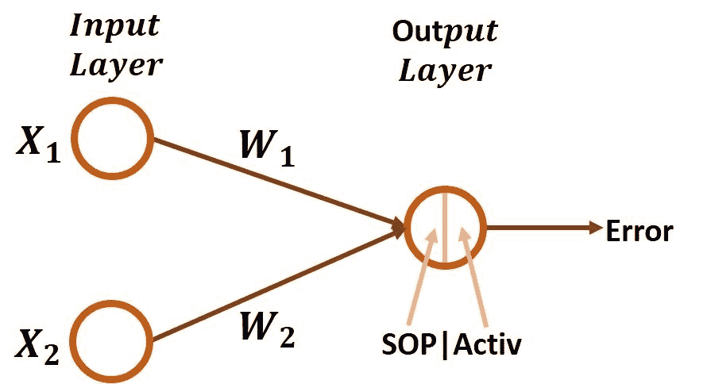
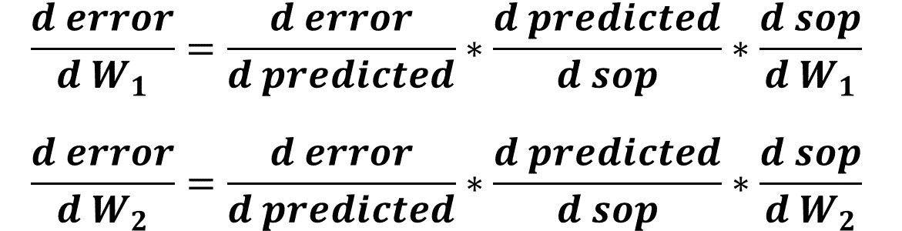
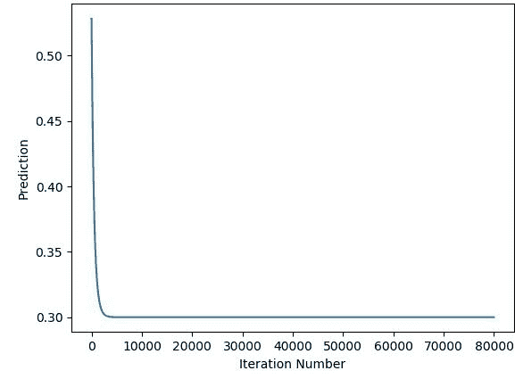
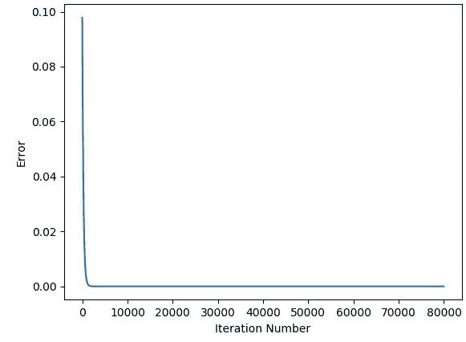
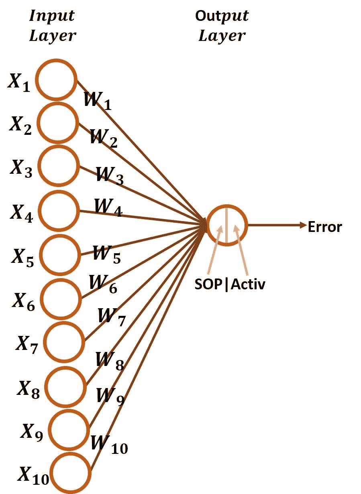
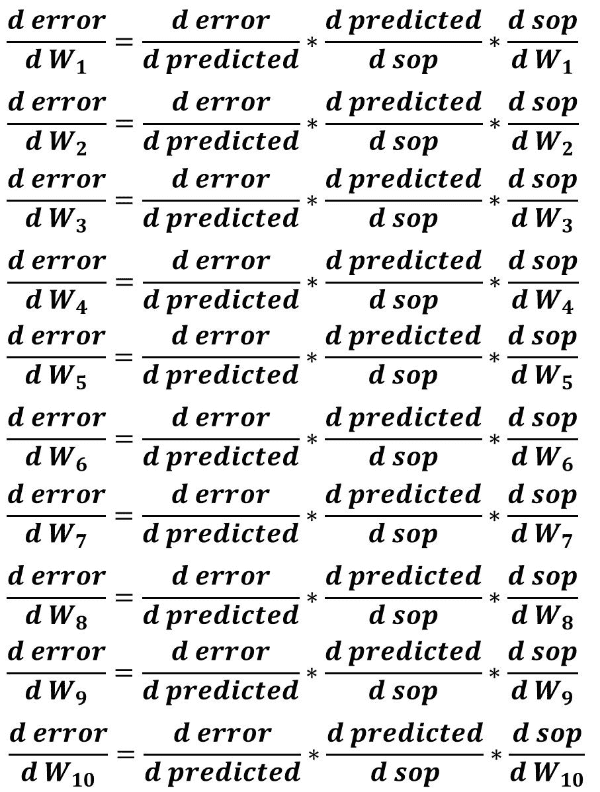
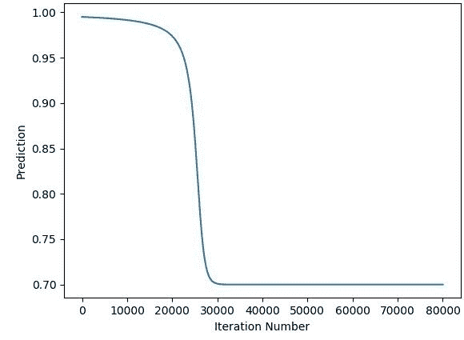
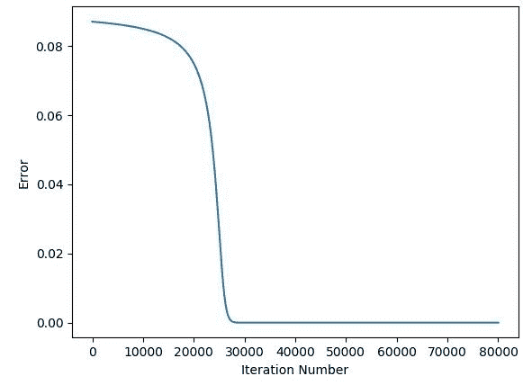

# 用 Python 实现梯度下降，第 2 部分:针对任意数量的输入进行扩展

> 原文：<https://blog.paperspace.com/part-2-generic-python-implementation-of-gradient-descent-for-nn-optimization/>

在 Python 中实现通用梯度下降(GD)算法以优化反向传播阶段的人工神经网络(ANN)参数的系列教程中，再次向您问好。GD 实现将是通用的，可以与任何人工神经网络架构一起工作。这是本系列的第二篇教程，讨论扩展第 1 部分 的 **[实现，允许 GD 算法在输入层处理任意数量的输入。](https://blog.paperspace.com/part-1-generic-python-implementation-of-gradient-descent-for-nn-optimization)**

本教程是本系列的第 2 部分，有两个部分。每一节都讨论了为具有不同数量输入的体系结构构建 GD 算法。第一种架构，输入神经元数量为 2。第二个将包括 10 个神经元。通过这些例子，我们可以推导出实现 GD 算法的一些通用规则，该算法可以处理任意数量的输入。

# 2 个输入–1 个输出

本节扩展了 **[第 1 部分](https://blog.paperspace.com/part-1-generic-python-implementation-of-gradient-descent-for-nn-optimization)** 中 GD 算法的实现，使其能够处理具有 2 个输入的输入层，而不是只有 1 个输入。下图给出了具有 2 个输入和 1 个输出的人工神经网络图。现在，每个输入都有不同的权重。对于第一个输入 **X1** ，有一个权重 **W1** 。对于第二个输入 **X2** ，其权重为 **W2** 。如何让 GD 算法与这两个参数一起工作？将误差链写成 W1 和 W2 的导数后，答案就简单多了。



下图给出了 W1 和 W2 误差的导数链。有什么区别？区别在于如何计算 SOP 和重量之间的最后一个导数。W1 和 W2 的前两个导数是相同的。



下面列出的代码给出了计算上述导数的实现。与第 1 部分的实施相比，有 3 个主要区别。

第一个是使用**numpy . rand()**初始化 2 个权重有 2 行代码。

第二个变化是 SOP 计算为每个输入与其相关权重的乘积之和( **X1*W1+X2*W2** )。

第三个变化是计算 SOP 对两个砝码的导数。在[第 1 部分](https://blog.paperspace.com/part-1-generic-python-implementation-of-gradient-descent-for-nn-optimization)中，只有一个重量，因此计算的是一个导数。在这个例子中，你可以认为它只是将代码行翻倍。变量 **g3w1** 计算 w1 的导数，变量 **g3w2** 计算 w2 的导数。最后，在两个变量 **gradw1** 和 **gradw2** 中计算每个权重更新的梯度。最后，两次调用 **update_w()** 函数来更新每个权重。

```py
import numpy

def sigmoid(sop):
    return 1.0/(1+numpy.exp(-1*sop))

def error(predicted, target):
    return numpy.power(predicted-target, 2)

def error_predicted_deriv(predicted, target):
    return 2*(predicted-target)

def activation_sop_deriv(sop):
    return sigmoid(sop)*(1.0-sigmoid(sop))

def sop_w_deriv(x):
    return x

def update_w(w, grad, learning_rate):
    return w - learning_rate*grad

x1=0.1
x2=0.4
target = 0.3
learning_rate = 0.1
w1=numpy.random.rand()
w2=numpy.random.rand()
print("Initial W : ", w1, w2)

# Forward Pass
y = w1*x1 + w2*x2
predicted = sigmoid(y)
err = error(predicted, target)

# Backward Pass
g1 = error_predicted_deriv(predicted, target)

g2 = activation_sop_deriv(predicted)

g3w1 = sop_w_deriv(x1)
g3w2 = sop_w_deriv(x2)

gradw1 = g3w1*g2*g1
gradw2 = g3w2*g2*g1

w1 = update_w(w1, gradw1, learning_rate)
w2 = update_w(w2, gradw2, learning_rate)

print(predicted)
```

前面的代码只适用于 1 次迭代。我们可以使用一个循环来进行多次迭代，其中权重可以更新为一个更好的值。这是新的代码。

```py
import numpy

def sigmoid(sop):
    return 1.0/(1+numpy.exp(-1*sop))

def error(predicted, target):
    return numpy.power(predicted-target, 2)

def error_predicted_deriv(predicted, target):
    return 2*(predicted-target)

def activation_sop_deriv(sop):
    return sigmoid(sop)*(1.0-sigmoid(sop))

def sop_w_deriv(x):
    return x

def update_w(w, grad, learning_rate):
    return w - learning_rate*grad

x1=0.1
x2=0.4
target = 0.3
learning_rate = 0.1
w1=numpy.random.rand()
w2=numpy.random.rand()
print("Initial W : ", w1, w2)

for k in range(80000):
    # Forward Pass
    y = w1*x1 + w2*x2
    predicted = sigmoid(y)
    err = error(predicted, target)

    # Backward Pass
    g1 = error_predicted_deriv(predicted, target)

    g2 = activation_sop_deriv(predicted)

    g3w1 = sop_w_deriv(x1)
    g3w2 = sop_w_deriv(x2)

    gradw1 = g3w1*g2*g1
    gradw2 = g3w2*g2*g1

    w1 = update_w(w1, gradw1, learning_rate)
    w2 = update_w(w2, gradw2, learning_rate)

    print(predicted)
```

下图显示了人工神经网络的预测值如何变化，直到达到所需的输出值 0.3。在大约 5000 次迭代之后，网络能够做出正确的预测。



下图显示了迭代次数对误差的影响。经过 5000 次迭代后，误差为 0.0。



到目前为止，我们已经成功实现了 GD 算法，可以处理 1 个输入或 2 个输入。在下一节中，前面的实现将被扩展，以允许该算法处理 10 个输入。

# 10 个输入–1 个输出

具有 10 个输入和 1 个输出的网络架构如下所示。有 10 个输入 X1 至 X10 和 10 个权重 W1 至 W10，每个输入都有其权重。为训练这样一个网络建立 GD 算法类似于前面的例子，但是只使用 10 个输入而不是 2 个。只需重复计算 SOP 和每个重量之间的导数的代码行。



在编写计算导数的代码之前，最好列出要计算的必要导数，这些导数在下图中进行了总结。很明显，所有重量的前两个导数是固定的，但最后一个导数(重量导数的 SOP)是每个重量的变化。



在前面的示例中，只有两个权重，因此有以下内容:

1.  2 行代码，用于指定 2 个输入中每个输入的值。
2.  用于初始化 2 个权重的 2 行代码。
3.  通过对 2 个输入和 2 个权重之间的乘积求和来计算 SOP。
4.  用于计算 SOP 和 2 个权重导数的 2 行代码。
5.  用于计算 2 个权重的梯度的 2 行。
6.  2 行用于更新 2 个权重。

在本例中，10 行将替换 2 行，因此将存在以下内容:

1.  10 行代码，用于指定 10 个输入中每个输入的值。
2.  初始化 10 个权重的 10 行代码。
3.  通过对 10 个输入和 10 个重量的乘积求和来计算 SOP。
4.  计算 10 个重量导数的 SOP 的 10 行代码。
5.  10 行用于计算 10 个重量的梯度。
6.  用于更新 10 个权重的 10 行代码。

下面给出了用于实现具有 10 个输入的网络的 GD 算法的代码。

```py
import numpy

def sigmoid(sop):
    return 1.0/(1+numpy.exp(-1*sop))

def error(predicted, target):
    return numpy.power(predicted-target, 2)

def error_predicted_deriv(predicted, target):
    return 2*(predicted-target)

def sigmoid_sop_deriv(sop):
    return sigmoid(sop)*(1.0-sigmoid(sop))

def sop_w_deriv(x):
    return x

def update_w(w, grad, learning_rate):
    return w - learning_rate*grad

x1=0.1
x2=0.4
x3=4.1
x4=4.3
x5=1.8
x6=2.0
x7=0.01
x8=0.9
x9=3.8
x10=1.6

target = 0.3
learning_rate = 0.01

w1=numpy.random.rand()
w2=numpy.random.rand()
w3=numpy.random.rand()
w4=numpy.random.rand()
w5=numpy.random.rand()
w6=numpy.random.rand()
w7=numpy.random.rand()
w8=numpy.random.rand()
w9=numpy.random.rand()
w10=numpy.random.rand()

print("Initial W : ", w1, w2, w3, w4, w5, w6, w7, w8, w9, w10)

# Forward Pass
y = w1*x1 + w2*x2 + w3*x3 + w4*x4 + w5*x5 + w6*x6 + w7*x7 + w8*x8 + w9*x9 + w10*x10
predicted = sigmoid(y)
err = error(predicted, target)

# Backward Pass
g1 = error_predicted_deriv(predicted, target)

g2 = sigmoid_sop_deriv(y)

g3w1 = sop_w_deriv(x1)
g3w2 = sop_w_deriv(x2)
g3w3 = sop_w_deriv(x3)
g3w4 = sop_w_deriv(x4)
g3w5 = sop_w_deriv(x5)
g3w6 = sop_w_deriv(x6)
g3w7 = sop_w_deriv(x7)
g3w8 = sop_w_deriv(x8)
g3w9 = sop_w_deriv(x9)
g3w10 = sop_w_deriv(x10)

gradw1 = g3w1*g2*g1
gradw2 = g3w2*g2*g1
gradw3 = g3w3*g2*g1
gradw4 = g3w4*g2*g1
gradw5 = g3w5*g2*g1
gradw6 = g3w6*g2*g1
gradw7 = g3w7*g2*g1
gradw8 = g3w8*g2*g1
gradw9 = g3w9*g2*g1
gradw10 = g3w10*g2*g1

w1 = update_w(w1, gradw1, learning_rate)
w2 = update_w(w2, gradw2, learning_rate)
w3 = update_w(w3, gradw3, learning_rate)
w4 = update_w(w4, gradw4, learning_rate)
w5 = update_w(w5, gradw5, learning_rate)
w6 = update_w(w6, gradw6, learning_rate)
w7 = update_w(w7, gradw7, learning_rate)
w8 = update_w(w8, gradw8, learning_rate)
w9 = update_w(w9, gradw9, learning_rate)
w10 = update_w(w10, gradw10, learning_rate)

print(predicted)
```

通常，前面的代码只进行一次迭代。我们可以使用一个循环在多次迭代中训练网络。

```py
import numpy

def sigmoid(sop):
    return 1.0/(1+numpy.exp(-1*sop))

def error(predicted, target):
    return numpy.power(predicted-target, 2)

def error_predicted_deriv(predicted, target):
    return 2*(predicted-target)

def sigmoid_sop_deriv(sop):
    return sigmoid(sop)*(1.0-sigmoid(sop))

def sop_w_deriv(x):
    return x

def update_w(w, grad, learning_rate):
    return w - learning_rate*grad

x1=0.1
x2=0.4
x3=4.1
x4=4.3
x5=1.8
x6=2.0
x7=0.01
x8=0.9
x9=3.8
x10=1.6

target = 0.3
learning_rate = 0.01

w1=numpy.random.rand()
w2=numpy.random.rand()
w3=numpy.random.rand()
w4=numpy.random.rand()
w5=numpy.random.rand()
w6=numpy.random.rand()
w7=numpy.random.rand()
w8=numpy.random.rand()
w9=numpy.random.rand()
w10=numpy.random.rand()

print("Initial W : ", w1, w2, w3, w4, w5, w6, w7, w8, w9, w10)

for k in range(1000000000):
    # Forward Pass
    y = w1*x1 + w2*x2 + w3*x3 + w4*x4 + w5*x5 + w6*x6 + w7*x7 + w8*x8 + w9*x9 + w10*x10
    predicted = sigmoid(y)
    err = error(predicted, target)

    # Backward Pass
    g1 = error_predicted_deriv(predicted, target)

    g2 = sigmoid_sop_deriv(y)

    g3w1 = sop_w_deriv(x1)
    g3w2 = sop_w_deriv(x2)
    g3w3 = sop_w_deriv(x3)
    g3w4 = sop_w_deriv(x4)
    g3w5 = sop_w_deriv(x5)
    g3w6 = sop_w_deriv(x6)
    g3w7 = sop_w_deriv(x7)
    g3w8 = sop_w_deriv(x8)
    g3w9 = sop_w_deriv(x9)
    g3w10 = sop_w_deriv(x10)

    gradw1 = g3w1*g2*g1
    gradw2 = g3w2*g2*g1
    gradw3 = g3w3*g2*g1
    gradw4 = g3w4*g2*g1
    gradw5 = g3w5*g2*g1
    gradw6 = g3w6*g2*g1
    gradw7 = g3w7*g2*g1
    gradw8 = g3w8*g2*g1
    gradw9 = g3w9*g2*g1
    gradw10 = g3w10*g2*g1

    w1 = update_w(w1, gradw1, learning_rate)
    w2 = update_w(w2, gradw2, learning_rate)
    w3 = update_w(w3, gradw3, learning_rate)
    w4 = update_w(w4, gradw4, learning_rate)
    w5 = update_w(w5, gradw5, learning_rate)
    w6 = update_w(w6, gradw6, learning_rate)
    w7 = update_w(w7, gradw7, learning_rate)
    w8 = update_w(w8, gradw8, learning_rate)
    w9 = update_w(w9, gradw9, learning_rate)
    w10 = update_w(w10, gradw10, learning_rate)

    print(predicted)
```

下图显示了迭代次数对预测输出的影响。



下图显示了误差和迭代次数之间的关系。大约 26，000 次迭代后，误差为 0.0。



至此，用于优化具有 10 个输入的网络的 GD 算法的实现完成。您可能想知道如果有 10 个以上的输入会怎么样。我们必须为每个输入神经元添加更多的线吗？使用当前的实现，我们必须复制这些行，但这不是唯一的方法。我们可以改进前面的代码，这样就根本不需要修改代码来处理任何数量的输入。

# 处理任意数量的输入

目前实现 GD 算法所遵循的策略是为每个新输入复制一些行代码。尽管这是一种遗留的方法，但理解每一小步是如何工作的是有帮助的。在本节中，将对前面的实现进行改进，这样当输入数量增加或减少时，我们就不必编辑代码了。我们要做的是检查之前的实现，寻找为每个输入神经元重复的线。之后，这些线将被一条适用于所有输入的单线所取代。在前面的代码中，有 6 个部分需要改进:

1.  指定输入值。
2.  权重初始化。
3.  计算 SOP。
4.  计算重量衍生产品的 SOP。
5.  计算权重的梯度。
6.  更新权重。

让我们研究每一部分，看看我们能做些什么。

## 指定输入值

上面代码中用于指定所有输入值的部分如下所示。如果要添加更多的输入，将会写入更多的行。

```py
x1=0.1
x2=0.4
x3=1.1
x4=1.3
x5=1.8
x6=2.0
x7=0.01
x8=0.9
x9=0.8
x10=1.6
```

我们可以使用一种更好的方法，将所有这些行替换为下面给出的一行。NumPy 数组保存所有这些输入。使用索引，我们可以返回所有单独的输入。例如，如果要检索第一个输入，那么索引 0 用于索引数组 x。

```py
x = numpy.array([0.1, 0.4, 1.1, 1.3, 1.8, 2.0, 0.01, 0.9, 0.8, 1.6])
```

## 权重初始化

下面给出了前面用于初始化权重的代码部分。如果要初始化更多的权重，将会写入更多的行。

```py
w1=numpy.random.rand()
w2=numpy.random.rand()
w3=numpy.random.rand()
w4=numpy.random.rand()
w5=numpy.random.rand()
w6=numpy.random.rand()
w7=numpy.random.rand()
w8=numpy.random.rand()
w9=numpy.random.rand()
w10=numpy.random.rand()
```

我们可以用下面的行代替所有这些行，而不是添加单独的行来初始化每个权重。这将返回一个有 10 个值的 NumPy 数组，每个值对应一个权重。同样，使用索引，我们可以检索单个权重。

```py
w = numpy.random.rand(10)
```

## 计算 SOP

先前代码中的 SOP 计算如下。对于每个输入，我们必须在下面的等式中添加一个新项，用于乘以其权重。

```py
y = w1*x1 + w2*x2 + w3*x3 + w4*x4 + w5*x5 + w6*x6 + w7*x7 + w8*x8 + w9*x9 + w10*x10
```

我们可以使用更好的方法，而不是用这种方法将每个输入乘以其权重。请记住，SOP 的计算方法是将每个输入乘以其权重。另外，记住 **x** 和 **w** 现在都是 NumPy 数组，并且每个都有 **10** 个值，其中数组 **w** 中索引 **i** 处的权重对应于数组 **x** 处索引 **i** 处的输入。我们需要的是将每个输入乘以其权重，并返回这些乘积的总和。好消息是 NumPy 支持数组逐值相乘。因此，写入 **w*x** 将返回一个新数组，其中的 **10** 值表示每个输入的权重乘积。我们可以将所有这些产品相加，并使用下面给出的行返回 SOP。

```py
y = numpy.sum(w*x)
```

## 计算重量衍生产品的 SOP

需要编辑的下一部分代码是负责计算重量导数的 SOP 的部分。下面给出。

```py
g3w1 = sop_w_deriv(x1)
g3w2 = sop_w_deriv(x2)
g3w3 = sop_w_deriv(x3)
g3w4 = sop_w_deriv(x4)
g3w5 = sop_w_deriv(x5)
g3w6 = sop_w_deriv(x6)
g3w7 = sop_w_deriv(x7)
g3w8 = sop_w_deriv(x8)
g3w9 = sop_w_deriv(x9)
g3w10 = sop_w_deriv(x10)
```

不用调用 **sop_w_deriv()** 函数来计算每个权重的导数，我们可以简单地将数组 x 传递给这个函数，如下所示。当这个函数接收一个 NumPy 数组时，它独立地处理该数组中的每个值，并返回一个新的 NumPy 数组和结果。

```py
g3 = sop_w_deriv(x)
```

## 计算权重的梯度

下面给出了负责计算权重梯度的代码部分。

```py
gradw1 = g3w1*g2*g1
gradw2 = g3w2*g2*g1
gradw3 = g3w3*g2*g1
gradw4 = g3w4*g2*g1
gradw5 = g3w5*g2*g1
gradw6 = g3w6*g2*g1
gradw7 = g3w7*g2*g1
gradw8 = g3w8*g2*g1
gradw9 = g3w9*g2*g1
gradw10 = g3w10*g2*g1
```

我们可以简单地使用下面的行，而不是添加一个新的行来乘以链中每个权重的所有导数。记住 **g1** 和 **g2** 都是保存单个值的数组，但是 g3 是保存 10 个值的 Numpy 数组。这可以看作是一个数组乘以一个标量值。

```py
grad = g3*g2*g1
```

## 更新权重

下面列出了要编辑的最终代码部分，它负责更新权重。

```py
w1 = update_w(w1, gradw1, learning_rate)
w2 = update_w(w2, gradw2, learning_rate)
w3 = update_w(w3, gradw3, learning_rate)
w4 = update_w(w4, gradw4, learning_rate)
w5 = update_w(w5, gradw5, learning_rate)
w6 = update_w(w6, gradw6, learning_rate)
w7 = update_w(w7, gradw7, learning_rate)
w8 = update_w(w8, gradw8, learning_rate)
w9 = update_w(w9, gradw9, learning_rate)
w10 = update_w(w10, gradw10, learning_rate)
```

不用为每个权重调用 **update_w()** 函数，我们可以简单地将上一步计算的 **grad** 数组和权重数组 **w** 一起传递给这个函数，如下所示。在函数内部，将为每个权重及其梯度调用权重更新等式。它将返回一个新的 **10** 值数组，代表可以在下一次迭代中使用的新权重。

```py
w = update_w(w, grad, learning_rate)
```

完成所有编辑后，最终优化的代码如下所示。它显示了前面的代码，但是作为一种映射每个部分及其编辑的方式进行了注释。

```py
import numpy

def sigmoid(sop):
    return 1.0/(1+numpy.exp(-1*sop))

def error(predicted, target):
    return numpy.power(predicted-target, 2)

def error_predicted_deriv(predicted, target):
    return 2*(predicted-target)

def sigmoid_sop_deriv(sop):
    return sigmoid(sop)*(1.0-sigmoid(sop))

def sop_w_deriv(x):
    return x

def update_w(w, grad, learning_rate):
    return w - learning_rate*grad

#x1=0.1
#x2=0.4
#x3=4.1
#x4=4.3
#x5=1.8
#x6=2.0
#x7=0.01
#x8=0.9
#x9=3.8
#x10=1.6
x = numpy.array([0.1, 0.4, 1.1, 1.3, 1.8, 2.0, 0.01, 0.9, 0.8, 1.6])
target = numpy.array([0.2])

learning_rate = 0.1

#w1=numpy.random.rand()
#w2=numpy.random.rand()
#w3=numpy.random.rand()
#w4=numpy.random.rand()
#w5=numpy.random.rand()
#w6=numpy.random.rand()
#w7=numpy.random.rand()
#w8=numpy.random.rand()
#w9=numpy.random.rand()
#w10=numpy.random.rand()
w = numpy.random.rand(10)

#print("Initial W : ", w1, w2, w3, w4, w5, w6, w7, w8, w9, w10)
print("Initial W : ", w)

for k in range(1000000000):
    # Forward Pass
#    y = w1*x1 + w2*x2 + w3*x3 + w4*x4 + w5*x5 + w6*x6 + w7*x7 + w8*x8 + w9*x9 + w10*x10
    y = numpy.sum(w*x)
    predicted = sigmoid(y)
    err = error(predicted, target)

    # Backward Pass
    g1 = error_predicted_deriv(predicted, target)

    g2 = sigmoid_sop_deriv(y)

#    g3w1 = sop_w_deriv(x1)
#    g3w2 = sop_w_deriv(x2)
#    g3w3 = sop_w_deriv(x3)
#    g3w4 = sop_w_deriv(x4)
#    g3w5 = sop_w_deriv(x5)
#    g3w6 = sop_w_deriv(x6)
#    g3w7 = sop_w_deriv(x7)
#    g3w8 = sop_w_deriv(x8)
#    g3w9 = sop_w_deriv(x9)
#    g3w10 = sop_w_deriv(x10)
    g3 = sop_w_deriv(x)
#    g3 = numpy.array([sop_w_deriv(x_) for x_ in x])

#    gradw1 = g3w1*g2*g1
#    gradw2 = g3w2*g2*g1
#    gradw3 = g3w3*g2*g1
#    gradw4 = g3w4*g2*g1
#    gradw5 = g3w5*g2*g1
#    gradw6 = g3w6*g2*g1
#    gradw7 = g3w7*g2*g1
#    gradw8 = g3w8*g2*g1
#    gradw9 = g3w9*g2*g1
#    gradw10 = g3w10*g2*g1
    grad = g3*g2*g1

#    w1 = update_w(w1, gradw1, learning_rate)
#    w2 = update_w(w2, gradw2, learning_rate)
#    w3 = update_w(w3, gradw3, learning_rate)
#    w4 = update_w(w4, gradw4, learning_rate)
#    w5 = update_w(w5, gradw5, learning_rate)
#    w6 = update_w(w6, gradw6, learning_rate)
#    w7 = update_w(w7, gradw7, learning_rate)
#    w8 = update_w(w8, gradw8, learning_rate)
#    w9 = update_w(w9, gradw9, learning_rate)
#    w10 = update_w(w10, gradw10, learning_rate)
    w = update_w(w, grad, learning_rate)
#    w = numpy.array([update_w(w_, grad_, learning_rate) for (w_, grad_) in [(w[i], grad[i]) for i in range(10)]])

    print(predicted)
```

删除注释后，代码如下。代码现在非常清晰。

```py
import numpy

def sigmoid(sop):
    return 1.0/(1+numpy.exp(-1*sop))

def error(predicted, target):
    return numpy.power(predicted-target, 2)

def error_predicted_deriv(predicted, target):
    return 2*(predicted-target)

def sigmoid_sop_deriv(sop):
    return sigmoid(sop)*(1.0-sigmoid(sop))

def sop_w_deriv(x):
    return x

def update_w(w, grad, learning_rate):
    return w - learning_rate*grad

x = numpy.array([0.1, 0.4, 1.1, 1.3, 1.8, 2.0, 0.01, 0.9, 0.8, 1.6])
target = numpy.array([0.2])

learning_rate = 0.1

w = numpy.random.rand(10)

print("Initial W : ", w)

for k in range(1000000000):
    # Forward Pass
    y = numpy.sum(w*x)
    predicted = sigmoid(y)
    err = error(predicted, target)

    # Backward Pass
    g1 = error_predicted_deriv(predicted, target)

    g2 = sigmoid_sop_deriv(y)

    g3 = sop_w_deriv(x)

    grad = g3*g2*g1

    w = update_w(w, grad, learning_rate)

    print(predicted)
```

假设我们要创建一个有 5 个输入的网络，我们可以简单地做两个改变:

1.  准备输入数组 **x** 只有 5 个值。
2.  在**numpy . rand()**中用 5 替换 10。

下面给出了适用于 5 个输入的代码。

```py
import numpy

def sigmoid(sop):
    return 1.0/(1+numpy.exp(-1*sop))

def error(predicted, target):
    return numpy.power(predicted-target, 2)

def error_predicted_deriv(predicted, target):
    return 2*(predicted-target)

def sigmoid_sop_deriv(sop):
    return sigmoid(sop)*(1.0-sigmoid(sop))

def sop_w_deriv(x):
    return x

def update_w(w, grad, learning_rate):
    return w - learning_rate*grad

x = numpy.array([0.1, 0.4, 1.1, 1.3, 1.8])
target = numpy.array([0.2])

learning_rate = 0.1

w = numpy.random.rand(5)

print("Initial W : ", w)

for k in range(1000000000):
    # Forward Pass
    y = numpy.sum(w*x)
    predicted = sigmoid(y)
    err = error(predicted, target)

    # Backward Pass
    g1 = error_predicted_deriv(predicted, target)

    g2 = sigmoid_sop_deriv(y)

    g3 = sop_w_deriv(x)

    grad = g3*g2*g1

    w = update_w(w, grad, learning_rate)

    print(predicted)
```

## **结论**

在这一点上，我们成功地实现了 GD 算法，用于处理具有输入层和输出层的 ANN，其中输入层可以包括任意数量的输入。在下一个教程中，这个实现将被扩展为在 ANN 中添加一个单独的隐藏层，并使用 GD 算法进行优化。