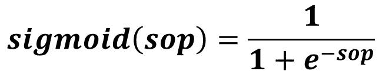
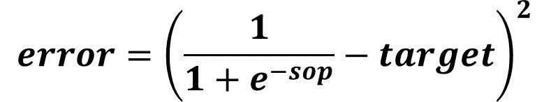
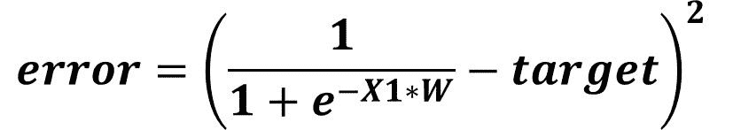
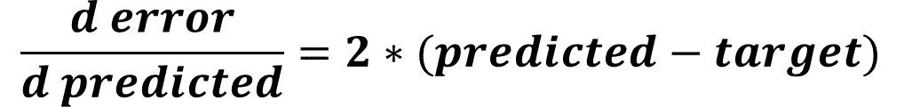
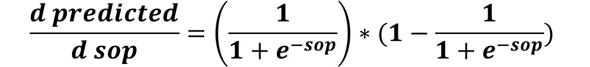
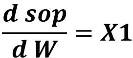
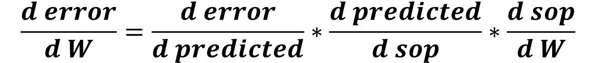
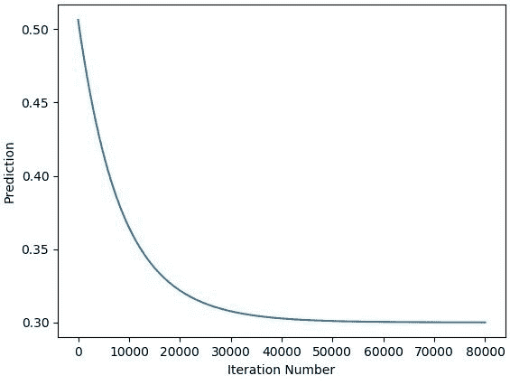
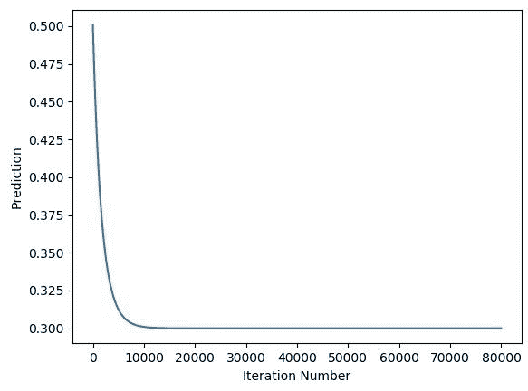
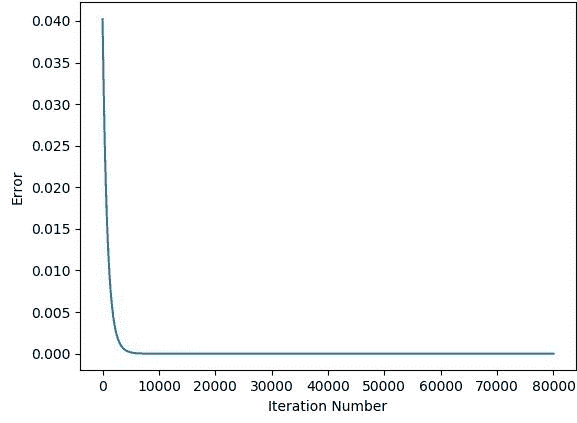

# 用 Python 实现梯度下降，第 1 部分:向前和向后传递

> 原文：<https://blog.paperspace.com/part-1-generic-python-implementation-of-gradient-descent-for-nn-optimization/>

通过一系列教程，梯度下降(GD)算法将在 Python 中从头实现，用于优化人工神经网络(ANN)在反向传播阶段的参数。GD 实现将是通用的，可以与任何人工神经网络架构一起工作。教程将遵循一个简单的路径来完全理解如何实现 GD。每个教程将涵盖所需的理论，然后在 Python 中应用。

在本教程中，这是系列的第 1 部分，我们将通过为一个特定的 ANN 架构实现 GD 来启动 worm，其中有一个具有 1 个输入的输入层和一个具有 1 个输出的输出层。本教程将不使用任何隐藏层。为了简单起见，在开始时不使用偏差。

## 1 个输入–1 个输出

通用实现 GD 算法的第一步是实现一个非常简单的架构，如下图所示。只有 1 个输入和 1 个输出，根本没有隐藏层。在考虑在向后传递中使用 GD 算法之前，让我们从向前传递开始，看看如何从输入开始直到计算误差。


## 前进传球

根据下图，输入 **X1** 乘以其权重 **W** 返回结果 **X1*W** 。在前向传递中，通常已知每个输入乘以其相关联的权重，然后对所有输入与其权重之间的乘积求和。这叫做积和(SOP)。例如，有 2 个输入 **X1** 和 **X2** ，它们的权重分别为 **W1** 和 **W2** ，那么 SOP 将为 **X1*W1+X2*W2** 。在本例中，只有 1 个输入，因此 SOP 没有意义。

计算完 SOP 后，下一步是将其馈送到输出层神经元中的激活函数。这种函数有助于捕捉输入和输出之间的非线性关系，从而提高网络的精度。在本教程中，将使用 sigmoid 函数。下图给出了它的公式。



假设本例中的输出范围为 0 到 1，则从 sigmoid 返回的结果可以被视为预测输出。这个示例是一个回归示例，但是通过将 sigmoid 返回的分数映射到类标签，可以很容易地将其转换为分类示例。

计算预测输出后，下一步是使用下面定义的平方误差函数测量预测误差。


此时，向前传球完成。基于计算的误差，我们可以返回并计算用于更新当前权重的权重梯度。

## 偶数道次

在后向过程中，我们通过改变网络权重来了解误差是如何变化的。因此，我们想建立一个方程，其中误差和重量都存在。怎么做呢？

根据上图，误差是用两项计算的，它们是:

1.  预测
2.  目标

不要忘记预测值是作为 sigmoid 函数的输出计算的。因此，我们可以将 sigmoid 函数代入误差方程，结果如下所示。但是在这一点上，误差和重量不包括在这个等式中。



这是正确的，但还要记住，sop 是作为输入 X1 与其重量 W 之间的乘积计算的。因此，我们可以删除 sop，并使用其等效物 **X1*W** ，如下所示。



此时，我们可以开始计算误差相对于重量的梯度，如下图所示。使用以下公式计算梯度可能会很复杂，尤其是当存在更多输入和权重时。作为一种选择，我们可以使用简化计算的链式法则。

## 链式法则

当梯度的两个参与者，即本例中的**误差**和 **W** 不直接与单个方程相关时，我们可以遵循从误差开始直到到达 **W** 的导数链。回顾误差函数，我们可以发现预测是误差和权重之间的纽带。因此，我们可以计算一阶导数，即误差对预测输出的导数，如下所示。



之后，我们可以通过计算 sigmoid 函数的导数，根据下图计算预测到 sop 的导数。



最后，我们可以计算 sop 和重量之间的导数，如下图所示。



经过一系列导数后，我们可以通过将所有导数相乘，将误差与重量联系起来，如下所示。



# Python 实现

在理论上理解了这个过程的工作原理之后，我们就可以很容易地应用它了。下面列出的代码经历了前面讨论的步骤。输入 X1 值为 0.1，目标值为 0.3。使用**numpy . rand()**随机初始化权重，返回 0 到 1 之间的数字。之后，输入和权重被传播到向前传递。这是通过计算输入和重量之间的乘积，然后调用 **sigmoid()** 函数实现的。请记住，sigmoid()函数的输出被视为预测输出。计算出预测输出后，最后一步是使用 **error()** 函数计算误差。这样，向前传球就完成了。

```py
import numpy

def sigmoid(sop):
    return 1.0 / (1 + numpy.exp(-1 * sop))

def error(predicted, target):
    return numpy.power(predicted - target, 2)

def error_predicted_deriv(predicted, target):
    return 2 * (predicted - target)

def activation_sop_deriv(sop):
    return sigmoid(sop) * (1.0 - sigmoid(sop))

def sop_w_deriv(x):
    return x

def update_w(w, grad, learning_rate):
    return w - learning_rate * grad

x = 0.1
target = 0.3
learning_rate = 0.001
w = numpy.random.rand()
print("Initial W : ", w)

# Forward Pass
y = w * x
predicted = sigmoid(y)
err = error(predicted, target)

# Backward Pass
g1 = error_predicted_deriv(predicted, target)

g2 = activation_sop_deriv(predicted)

g3 = sop_w_deriv(x)

grad = g3 * g2 * g1
print(predicted)

w = update_w(w, grad, learning_rate) 
```

在反向传递中，使用 **error_predicted_deriv()** 函数计算误差对预测输出的导数，结果存储在变量 **g1** 中。之后，使用 **activation_sop_deriv()** 函数计算预测(激活)输出到 sop 的导数。结果存储在变量 **g2** 中。最后，使用 **sop_w_deriv()** 函数计算 sop 对重量的导数，并将结果存储在变量 **g3** 中。

计算完链中的所有导数后，下一步是通过将所有导数 g1、g2 和 g3 相乘来计算误差对重量的导数。这将返回权重值可以更新的梯度。使用 **update_w()** 函数更新权重。它接受 3 个参数:

1.  w
2.  毕业生
3.  学习率

这将返回替换旧权重的更新后的权重。注意，前面的代码没有使用更新的权重重复重新训练网络。我们可以进行几次迭代，其中梯度下降算法可以根据下面修改的代码达到更好的权重值。请注意，您可以更改学习速率和迭代次数，直到网络做出正确的预测。

```py
import numpy

def sigmoid(sop):
    return 1.0 / (1 + numpy.exp(-1 * sop))

def error(predicted, target):
    return numpy.power(predicted - target, 2)

def error_predicted_deriv(predicted, target):
    return 2 * (predicted - target)

def activation_sop_deriv(sop):
    return sigmoid(sop) * (1.0 - sigmoid(sop))

def sop_w_deriv(x):
    return x

def update_w(w, grad, learning_rate):
    return w - learning_rate * grad

x = 0.1
target = 0.3
learning_rate = 0.01
w = numpy.random.rand()
print("Initial W : ", w)

for k in range(10000):
    # Forward Pass
    y = w * x
    predicted = sigmoid(y)
    err = error(predicted, target)

    # Backward Pass
    g1 = error_predicted_deriv(predicted, target)

    g2 = activation_sop_deriv(predicted)

    g3 = sop_w_deriv(x)

    grad = g3 * g2 * g1
    print(predicted)

    w = update_w(w, grad, learning_rate) 
```

下图显示了网络预测如何通过迭代增强。网络可以在 50000 次迭代后达到期望的输出。请注意，通过改变学习速率，您可以通过更少的迭代次数达到期望的输出。



当学习率为 0.5 时，网络仅经过 10000 次迭代就达到了期望的输出。



下图显示了当学习率为 0.5 时，网络误差如何随着迭代而变化。



在构建了对于具有 1 个输入和 1 个输出的基本架构能够有效工作的 GD 算法之后，我们可以在下一节中将输入的数量从 1 增加到 2。请注意，理解前面的实现是如何工作的非常重要，因为接下来的部分将高度依赖于它。

# 结论

到目前为止，我们已经成功实现了 GD 算法，可以处理 1 个输入或 2 个输入。在下一个教程中，前面的实现将被扩展，以允许算法处理更多的输入。使用将在下一个教程中讨论的例子，将推导出允许 GD 算法处理任意数量的输入的一般规则。