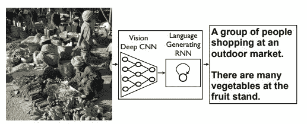
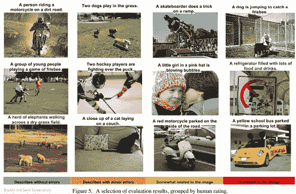
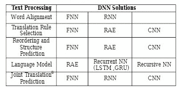
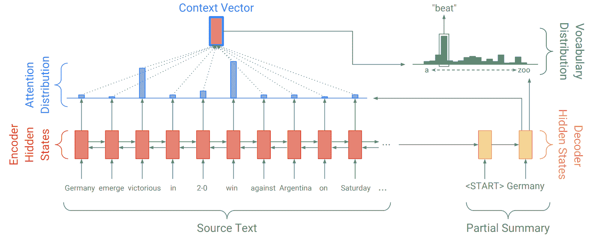

# NLP 的 6 个有趣的深度学习应用

> 原文：<https://blog.paperspace.com/6-interesting-deep-learning-applications-for-nlp/>

先进的深度学习方法正在为特定的 ML 问题取得非凡的结果，即描述图像和将文本从一种语言翻译成另一种语言。最有趣的是，单个深度学习模型可以学习词义并执行语言任务，避免了执行复杂语言任务的需要。

近年来，各种深度学习模型已被应用于自然语言处理(NLP)，以改善、加速和自动化文本分析功能和 NLP 功能。此外，这些模型和方法为将非结构化文本转换为有价值的数据和见解提供了卓越的解决方案。

继续阅读，发现深度学习方法正在自然语言处理领域得到应用，为大多数语言问题实现了最先进的结果。

## 
1。标记化和文本分类

[记号化](https://nlp.stanford.edu/IR-book/html/htmledition/tokenization-1.html)包括将单词分割成机器可以理解的片段(或记号)。英语文档很容易标记，因为它们在单词和段落之间有清晰的空间。然而，大多数其他语言提出了新的挑战。例如，像粤语、普通话和日语汉字这样的标识语言可能具有挑战性，因为它们在单词甚至句子之间没有空格。

但是所有的语言都遵循一定的规则和模式。通过深度学习，我们可以训练模型来执行标记化。因此，大多数 [AI 和深度学习课程](https://www.manipalprolearn.com/data-science/post-graduate-certificate-program-artificial-intelligence-deep-learning-certification-training)都鼓励有抱负的 DL 专业人士尝试训练 DL 模型，以识别和理解这些模式和文本。

此外，DL 模型可以分类和[预测文档](https://machinelearningmastery.com/develop-word-embedding-model-predicting-movie-review-sentiment/)的主题。例如，深度卷积神经网络(CNN)和递归神经网络(RNN)可以使用找到单词向量值的单词嵌入来自动分类源文本的语气和情感。大多数社交媒体平台部署了基于 CNN 和 RNN 的分析系统来标记和识别其平台上的垃圾内容。文本分类也应用于网络搜索、语言识别和可读性评估。

## 2.为图像生成标题

使用自然语句自动描述图像的内容是一项具有挑战性的任务。图像的标题不仅应该识别其中包含的对象，还应该表达它们之间的关系以及它们的属性(视觉识别模型)。此外，语义知识必须用自然语言来表达，这也需要语言模型。

对齐视觉和语义元素是生成完美图像字幕的核心。DL 模型可以帮助使用正确的英语句子自动描述图像的内容。这可以帮助视障人士轻松访问在线内容。

[Source](https://www.cv-foundation.org/openaccess/content_cvpr_2015/papers/Vinyals_Show_and_Tell_2015_CVPR_paper.pdf)

谷歌的神经图像字幕生成器(NIC)是基于一个由视觉 CNN 和语言生成 RNN 组成的网络。该模型自动查看图像，并用简单的英语进行描述。

[Source](https://www.cv-foundation.org/openaccess/content_cvpr_2015/papers/Vinyals_Show_and_Tell_2015_CVPR_paper.pdf)

## 
3。语音识别

DL 正越来越多地用于建立和训练神经网络，以转录音频输入并执行复杂的词汇[语音识别](https://ieeexplore.ieee.org/document/8632885/footnotes#footnotes)和分离任务。事实上，这些模型和方法被用于信号处理、语音学和单词识别，这些都是语音识别的核心领域。

例如，DL 模型可以被训练来为相应的说话者识别每个语音，并分别回答每个说话者。此外，基于 CNN 的语音识别系统可以将原始语音翻译成文本消息，从而提供与说话者相关的有趣见解。

## 4.机器翻译

机器翻译(MT)是自然语言处理中的核心任务，研究在没有人类干预的情况下使用计算机翻译语言。只是最近深度学习模型才被用于[神经机器翻译](https://www.analyticsvidhya.com/blog/2019/01/neural-machine-translation-keras/)。与传统的机器翻译不同，深度神经网络(DNN)提供了准确的翻译和更好的性能。RNNs、前馈神经网络(FNNs)、递归自动编码器(RAE)和[长短期记忆(LSTM)](https://blog.paperspace.com/training-an-lstm-and-using-the-model-in-ml5-js/) 用于训练机器将句子从源语言准确地转换成目标语言。

[Source](https://www.researchgate.net/publication/319367587_Machine_translation_using_deep_learning_An_overview)

合适的 DNN 解决方案被用于诸如单词对齐、重新排序规则、语言建模和连接翻译预测的过程，以在不使用大型规则数据库的情况下翻译句子。

## 5.问题回答

问答系统试图回答以问题的形式提出的询问。因此，在用自然语言提出的其他类型的问题中，定义问题、传记问题和多语言问题都由这样的系统来回答。

创建一个功能齐全的[问答系统](https://www.sciencedirect.com/science/article/pii/S1877050918308226)一直是 DL 领域的研究人员面临的普遍挑战之一。尽管深度学习算法过去在文本和图像分类方面取得了不错的进展，但它们无法解决涉及逻辑推理的任务(如问答问题)。然而，在最近一段时间，深度学习模型正在提高这些 QA 系统的性能和准确性。

例如，递归神经网络模型能够正确回答传统方法无法回答的段落长度问题。更重要的是，DL 模型是以这样一种方式训练的，即不需要像创建语义解析器那样使用语言学知识来构建系统。

## 
6。文档摘要

当今日益增长的可用数据量使得文档摘要的作用变得至关重要。序列到序列模型的最新进展使得 DL 专家很容易开发出好的文本摘要模型。两种类型的文档摘要，即摘要和抽象摘要，可以通过序列到序列模型来实现。参考下图，来自 [Abigail 的指针生成器博客，参见](http://www.abigailsee.com/)。

[Source](http://www.abigailsee.com/2017/04/16/taming-rnns-for-better-summarization.html)

在这里，编码器 RNN 读取源文本，产生一系列编码器隐藏状态。接下来，解码器 RNN 接收摘要的前一个单词作为输入。它使用该输入来更新解码器隐藏状态(上下文向量)。最后，上下文向量和解码器隐藏状态产生输出。这种序列到序列的模型，其中解码器能够以任何顺序自由地生成单词，是抽象摘要的强大解决方案。

## 总结

语言建模领域正在迅速从统计语言建模转向深度学习方法和神经网络。这是因为 DL 模型和方法在复杂的 NLP 任务上保证了优越的性能。因此，深度学习模型似乎是完成 NLP 任务的一种好方法，这些任务需要对文本有深刻的理解，即文本分类、机器翻译、问题回答、摘要和自然语言推理等。

这篇文章将帮助你理解 DL 模型和方法在自然语言处理中日益增长的作用。

(特征图片来源: [Pixabay](https://www.pexels.com/photo/coffee-writing-computer-blogging-34676/) )