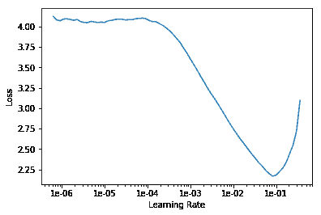

# 利用纸空间梯度和 Fast.ai 构建一流的细菌分类器

> 原文：<https://blog.paperspace.com/building-a-state-of-the-art-bacterial-classifier-with-paperspace-gradient-and-fast-ai/>

深度学习的一大承诺是它在各种复杂任务中的适用性。近年来，深度学习成功应用的领域数量激增。特别是在生物、化学、医疗保健和物理领域，已经有了巨大的突破。

在 Paperspace，我们的部分使命是为任何对 ML 研究感兴趣的人提供工具，无论他们是经验丰富的从业者还是相对较新的从业者，这些工具可以极大地提高和加快他们的生产力。吴恩达和杰瑞米·霍华德都评论说，深度学习将如何真正让领域专家在各自领域获得令人难以置信的突破，像 DeepMind 这样的组织通过将深度学习应用于蛋白质折叠等非常特定的领域，已经取得了令人难以置信的成就。

在这篇文章中，我们将展示如何使用 Fast.ai 机器学习库在梯度上建立一个最先进的细菌分类模型。我们将从理解任务和检查数据集开始。在此之后，我们将对我们的架构和培训过程做出一些决定，并评估我们的结果与当前的艺术状态相比较！

## 了解细菌分类

虽然看起来很模糊，但是对细菌种类进行分类的任务实际上非常有用，因为它们在我们的环境中非常普遍，并且关于它们的信息在许多领域都非常重要，包括农业和医学。建立一个可以自动识别和分类这些微生物的系统在这些领域将会非常有用，并且是今天一个开放的研究问题。这是一项异常复杂的任务。单个细菌细胞的形状可以有很大的不同，但它们在场景中的出现频率也是如此。当检查细菌菌落时，像菌落大小、质地和成分这样的因素开始起作用。

我们今天将使用的数据来自细菌物种数据集的数字图像(DIBaS)，该数据是作为*细菌菌落分类的深度学习方法(* Zieliński 等人，2017 年)的研究的一部分汇编的。它包含了 33 种不同细菌的 660 张图片。我们将更仔细地检查他们的结果，并在稍后的帖子中比较我们自己的结果！

## 预处理我们的数据

这里的工作是使用 Paperspace 的渐变笔记本功能和 Fast.ai 模板完成的。使用的所有包都已经安装在这个容器中，并且可以在这个容器中访问，这有助于快速启动。DIBaS 实际上有点难以自动访问，因为它被孤立在网站[的独立链接中。因此，为了自动化和节省时间，我们将利用一个抓取库来收集和解析我们的数据！让我们导入一些有用的包。](http://misztal.edu.pl/software/databases/dibas/)

```py
import requests
import urllib.request
import time
from bs4 import BeautifulSoup
import os
```

需要关注的包是`BeautifulSoup`，它允许我们在抓取 HTML 页面后解析它，以搜索有用的 URL(比如保存我们下载链接的 URL)。

让我们从 DIBaS 站点获取网页并解析它！

```py
url = 'http://misztal.edu.pl/software/databases/dibas/'
response = requests.get(url)
soup = BeautifulSoup(response.text, "html.parser")
os.mkdir('./bacteria-dataset/full_images_alt')
```

既然我们已经为细菌物种数据集中的每个子文件夹解析了 URL，我们可以使用`urllib`库来下载 zip 文件并解压它们！

```py
for i in range(19,52): #'a' tags are for links
    one_a_tag = soup.findAll('a')[i]
    link = one_a_tag['href']
    urllib.request.urlretrieve(link,'./bacteria dataset/zip_files/'+link[49:len(link)]) 
    time.sleep(1)

import zipfilefor i in range(20,52):
	one_a_tag = soup.findAll('a')[i]
    link = one_a_tag['href']
    zip_ref = zipfile.ZipFile('./bacteria-dataset/zip_files/'+link[49:len(link)], 'r')   	
    zip_ref.extractall('./bacteria-dataset/full_images_alt/')   
    zip_ref.close()
```

## 训练我们的模型

现在我们的数据已经准备好了，我们可以继续训练我们的模型。我们将利用 Fast.ai 库的易用性、高级抽象和强大的 API。如果你已经从 Fast.ai(也称为 Fast.ai 第一部分)的《程序员实用深度学习》课程中学习了第一课，你就已经准备好理解我们在这里做的一切了！

首先，让我们从库中导入正确的模块。

```py
from fastai.vision import *
from fastai.metrics import error_rate
```

我们可以设置一些配置，并使用 Fast.ai 的 get_image_files 实用程序来获取我们的文件。

```py
bs = 64
fnames = get_image_files('bacteria-dataset/full_images_alt')
fnames[:5]
# Outputs are filepaths!
# [PosixPath('bacteria-dataset/full_images_alt/Actinomyces.israeli_0001.tif'),
# PosixPath('bacteria-dataset/full_images_alt/Actinomyces.israeli_0002.tif'),
# PosixPath('bacteria-dataset/full_images_alt/Actinomyces.israeli_0003.tif'),
# PosixPath('bacteria-dataset/full_images_alt/Actinomyces.israeli_0004.tif'),
# PosixPath('bacteria-dataset/full_images_alt/Actinomyces.israeli_0005.tif')]
```

现在，我们将利用 Fast.ai 中的`ImageDataBunch`类，它基本上创建了一个数据结构，根据数据集文件夹的组织方式自动保存数据集和标签。在这种情况下，我们设置数据集以方便使用这个类，它开箱即用！

```py
np.random.seed(42)
pat = r'/([^/]+)_\d+.tif$'
data = ImageDataBunch.from_name_re('bacteria-dataset/full_images_alt', fnames, pat, ds_tfms=get_transforms(), size=224, bs=bs).normalize(imagenet_stats)
```

现在，我们可以创建一个 CNN 架构来从我们的数据集学习。CNN 在这里被证明是非常有用的，因为我们正试图学习独立于位置的视觉特征和结构。我们将使用 ResNet34，它可能工作得非常好。ResNets 尚未在此任务中使用，是一个很好的探索领域。你可以在这里找到关于 ResNets [的有用概述，我也在这篇文章的参考资料部分包含了原始论文！](https://towardsdatascience.com/an-overview-of-resnet-and-its-variants-5281e2f56035)

```py
learn = create_cnn(data, models.resnet34, metrics=error_rate)
```

现在，为了训练我们的模型，我们将使用`fit_one_cycle method`。这种方法利用了莱斯利·史密斯激动人心的论文中的策略。它使用不同的超参数配置和某些发现的规则来显著减少训练时间和提高性能。我们可以在下面看到培训过程的输出。

```py
learn.fit_one_cycle(4)
# Outputs:
# epoch	train_loss	valid_loss	error_rate
# 1	3.817713	2.944878	0.759124
# 2	2.632171	1.093049	0.248175
# 3	1.929509	0.544141	0.167883
# 4	1.509456	0.457186	0.145985 
```

哇！我们的模型实际上做得很好，达到了大约 14.5%的错误率！真正的问题是这和最先进的相比如何？这个领域的开创性工作是首先包含了 DIBaS 数据集的论文。他们测试了几种不同的方法，从 CNN 到更传统的方法，如使用各种随机森林的支持向量机。他们最好的结果是大约 97%的准确率，比我们的好得多。

那么，我们如何改进我们的方法呢？嗯，ResNet 非常强大，所以我们可能希望使用像 ResNet50 这样更重的架构。我们可以使用`lr_find()`方法找到最佳学习率，并使用它来尝试和改进我们的模型。

```py
learn = create_cnn(data, models.resnet50, metrics=error_rate)
learn.lr_find()
learn.recorder.plot()
```



这个图表告诉我们哪里的学习率对 los 影响最大——非常酷！为了便于参考，让我们在不使用学习率值范围知识的情况下进行训练。同样的训练方法我们可以用 8 个周期。

```py
learn.fit_one_cycle(8)
# epoch	train_loss	valid_loss	error_rate
# 1	2.853813	1.561166	0.306569
# 2	1.639013	0.248170	0.058394
# 3	1.101536	0.230741	0.080292
# 4	0.781610	0.159655	0.043796
# 5	0.587977	0.132877	0.036496
# 6	0.455316	0.115520	0.036496
# 7	0.356362	0.108675	0.029197
# 8	0.293171	0.109001	0.029197 
```

有意思！我们可以看到，这个模型比我们之前的模型好了很多，并且基本上与论文中概述的性能相同！97.1%的准确率没什么好嘲笑的！

但是如果我们使用我们之前学到的学习率的知识呢？让我们将一个周期的培训过程限制在学习率对损失影响最大的范围内。

```py
learn.save('stage-1-50')
learn.unfreeze()
learn.fit_one_cycle(3, max_lr=slice(1e-6,1e-4))

# Outputs
# epoch	train_loss	valid_loss	error_rate
# 1	0.178638	0.100145	0.021898
# 2	0.176825	0.093956	0.014599
# 3	0.159130	0.092905	0.014599 
```

哇！我们的新模型达到了 98.5%的准确率，这绝对超过了原来的论文。当然，原始论文来自 2017 年，应用像 ResNet 这样非常强大的模型会产生很大的结果，这是有道理的。

## **结论**

我们已经设法从一个许多人可能不熟悉的领域的一项任务中获得了一些非常惊人的结果，而且由于 Gradient 和 Fast.ai，我们完成得相当快。当然，这是有用的。自 2017 年以来，这个领域没有太多进展，所以可能有更好、更微妙的方法，而不是在这个问题上扔 ResNets。展望未来，我们可能会尝试不同的方法来完成这一细菌分类任务，或者甚至尝试解决一些其他新的数据集！你认为还有哪些深度学习架构可能有用？

如果你有一个 ML 相关的项目或想法，你一直想尝试，考虑使用 Paperspace 的渐变平台！这是一个神奇的工具，允许您做许多有用的事情，包括用笔记本探索和可视化，运行严肃的训练周期和 ML 管道，还可以将您训练的模型部署为端点！点击了解更多关于我们支持 GPU 的免费 Jupyter 笔记本电脑的信息！

**参考文献**

贺，张，谢，任，孙，(2016)。用于图像识别的深度残差学习。在*IEEE 计算机视觉和模式识别会议论文集*(第 770-778 页)。

史密斯律师事务所(2018 年)。神经网络超参数的训练方法:第 1 部分:学习速率、批量大小、动量和权重衰减。 *arXiv 预印本 arXiv:1803.09820* 。

Zieliński，b .，Plichta，a .，Misztal，k .，Spurek，p .，Brzychczy-woch，m .，和 Ochońska，D. (2017)。细菌菌落分类的深度学习方法。 *PloS one* ， *12* (9)，e0184554。